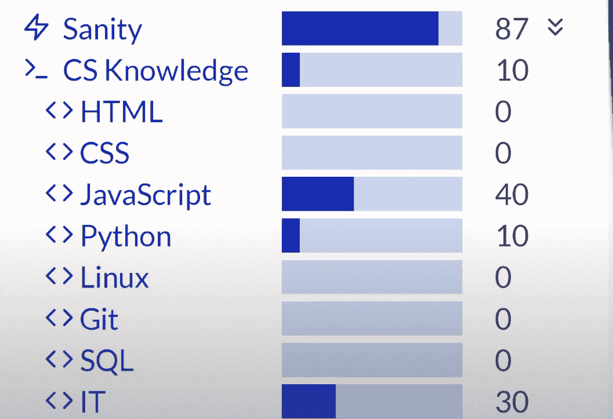
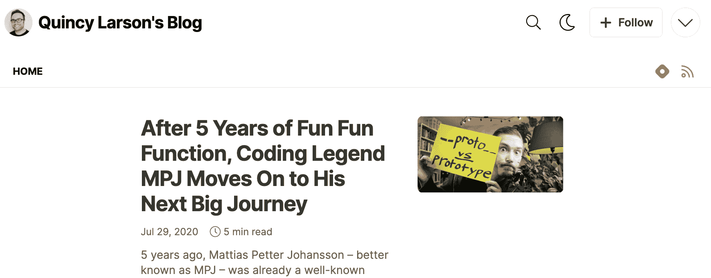

# 以 2022 年成为发展中国家新年决心挑战为例

> 原文：<https://www.freecodecamp.org/news/2022-become-a-dev-new-years-resolution-challenge/>

每年，数百万人都会制定新年计划。其中绝大多数将会失败。但我为你创造了一个，我很乐观你能成功。这些都是免费的，你会学到很多。

会有很多人和你一起挑战，准备好为你加油。你也许能在夏天之前完成所有这些。

以下是你需要的:

1.  Mac、Windows 或 Linux 电脑
2.  一个 twitter 账户(你可以在 5 分钟内创建一个)
3.  VS 代码(5 分钟左右就可以安装)
4.  Hashnode 开发者博客(我将向您展示如何创建一个。)
5.  每天至少花 30 分钟进行 [#100DaysOfCode](https://www.freecodecamp.org/news/the-crazy-history-of-the-100daysofcode-challenge-and-why-you-should-try-it-for-2018-6c89a76e298d/) 挑战

我把这个挑战组织成可管理的，但是逐渐增加参与度。通过接受这个挑战，你同意至少尝试第一步。在那之后，如果你感觉不到，放弃这个新年决心挑战也是很好的。

以下是迎接挑战的四个步骤。

### 第一步:在学习编码 RPG 中最大化你的属性(大约需要 3 个小时)

很多人不确定他们是否想成为开发者。工作量很大。所以我们创造了这个视频游戏，模拟学习编码和申请开发人员工作的过程。

[https://www.youtube.com/embed/vLK4fOeiIEk?feature=oembed](https://www.youtube.com/embed/vLK4fOeiIEk?feature=oembed)

The Learn to Code RPG game trailer (90 second watch)

这个游戏很酷的一个方面是:你学习并应用真正的编程和计算机科学概念。

这个游戏目前有 6 种不同的结局和 55 个复活节彩蛋，我鼓励你把它们都抓住。但是为了这个挑战，你只需要充分发挥你的技能。

A screenshot of Learn to Code RPG's stats view. Max these out by playing the game and answering quiz questions.

这里有更多关于[学习编写 RPG 代码以及如何安装它的信息](https://www.freecodecamp.org/news/learn-to-code-rpg/)。

### 第二步:开始 100 天代码(100 天内每天花 30 分钟)

如果你喜欢学习编写 RPG 代码，并准备深入学习编码，你可以参加流行的#100DaysOfCode 挑战。

规则很简单:

1.  每天至少写一点代码
2.  使用#100DaysOfCode 标签发布你的状态(你做了什么)
3.  通过评论来鼓励至少另外两个也发布了他们的#100DaysOfCode 状态的人。

这是一个流行的挑战，成千上万的人在过去的 6 年里做过。如果你感兴趣，我写了#100DaysOfCode challenge 的完整历史。

当您执行#100DaysOfCode 时，您可以继续执行步骤 3 和 4。

### 步骤 3:完成 freeCodeCamp 关系数据库认证

The freeCodeCamp Relational Database Certification running inside VS Code

这是我们在 2021 年发布的一个新的 300 小时课程(尽管如果你有一些 Linux / SQL 经验，它可能会花你更少的时间)。

它会教你:

*   Linux 操作系统
*   尝试
*   结构化查询语言
*   饭桶
*   ...和许多其他命令行工具

在这个过程中，您将在流行的 VS 代码编辑器中构建十几个不同的项目——全部都是交互式的。

这里有更多关于如何在你的 Mac、Windows PC 或 Linux 计算机上安装 freeCodeCamp 关系数据库课程的信息。

### 步骤 4:在你的 Hashnode 博客上发布 3 个教程

A screenshot from my own Hashnode blog

Hashnode 是一个强大的博客工具，你可以在自己的个人领域发表文章，但仍然可以在他们的社区中获得一些发现。他们使建立博客变得容易。

当你学习编程和技术的时候，我鼓励你回头写一写。这不仅能帮助其他和你一起学习的人，还能帮助你强化自己的学习。俗话说，“教就是学两遍。”

下面是如何建立你的 Hashnode 开发者博客的方法。

因此，对于这个挑战的最后一步，你应该写 3 个简短的教程，介绍你在这个过程中学到的编程概念。

如果你决定想要接触更广泛的读者，你可以考虑申请成为 freeCodeCamp 出版物的作者，该出版物每天有大约 25 万读者。如果你决定申请，这里有[freeCodeCamp 出版风格指南](https://www.freecodecamp.org/news/developer-news-style-guide/)。

## 就是这样。一个视频游戏，一个证书，和三篇博文。

如果这听起来像是对你 2022 年新年决心的合理挑战，我鼓励你去实现它。你可以这样接受挑战:如果你还没有 Twitter 账户，就创建一个，并引用转发这条推文，并写上“我加入。”

> 参加 2022 年新年决心挑战:
> 📊在[# learntocoderpg](https://twitter.com/hashtag/LearnToCodeRPG?src=hash&ref_src=twsrc%5Etfw)
> ⌨️start[# 100 daysofcode](https://twitter.com/hashtag/100DaysOfCode?src=hash&ref_src=twsrc%5Etfw)
> 🛢️finish FCC 关系数据库证书
> 中获得最大统计数据📜在 [@Hashnode](https://twitter.com/hashnode?ref_src=twsrc%5Etfw)
> 上发布 3 个教程接受:引用-转发这句话“我在。”我会把你加到我的推特名单上。🧵
> 
> — Quincy Larson (@ossia) [December 30, 2021](https://twitter.com/ossia/status/1476581551873925123?ref_src=twsrc%5Etfw)