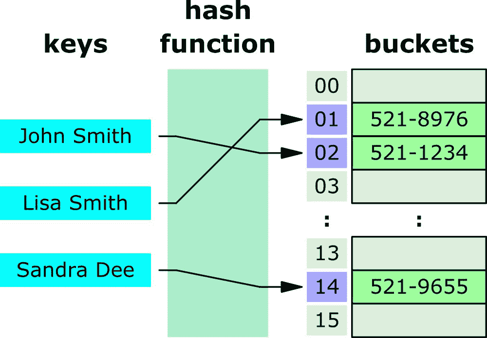

# JavaScript 哈希表——JS 中的关联数组哈希

> 原文：<https://www.freecodecamp.org/news/javascript-hash-table-associative-array-hashing-in-js/>

哈希表是一种数据结构，允许您创建成对值的列表。然后，您可以通过使用该值的键来检索某个值，该值是您事先放入表中的。

哈希表使用哈希函数将键转换为整数索引，索引将决定键/值对在内存中的存储位置:



Hash table for storing phone books (from [Wikipedia](https://en.wikipedia.org/wiki/Hash_table))

由于散列表的快速搜索、插入和删除操作，您通常会使用散列表:

|  | 大 O 表示法中的哈希表时间复杂度 |  |
| --- | --- | --- |
| 算法 | 平均的 | 最坏情况 |
| 空间 | O(n) | O(n) |
| 搜索 | O(1) | O(n) |
| 插入 | O(1) | O(n) |
| 删除 | O(1) | O(n) |

来源于[维基百科](https://en.wikipedia.org/wiki/Hash_table)

本教程将帮助您理解 JavaScript 中的哈希表实现，以及如何构建自己的哈希表类。

首先，我们来看看 JavaScript 的`Object`和`Map`类。

## 如何在 JavaScript 中对对象和映射类使用哈希表

JavaScript 中哈希表最常见的例子是`Object`数据类型，其中可以将对象的属性值与属性键配对。

在下面的例子中，键`Nathan`与电话号码值`"555-0182"`配对，键`Jane`与值`"315-0322"`配对:

```
let obj = {
  Nathan: "555-0182",
  Jane: "315-0322"
}
```

JavaScript object is an example of Hash Table implementation

但是 JavaScript 的`Object`类型是一种特殊的哈希表实现，原因有二:

*   它有由`Object`类添加的属性。您输入的键可能会冲突并覆盖从该类继承的默认属性。
*   不跟踪哈希表的大小。您需要手动计算有多少属性是由程序员定义的，而不是从原型继承的。

例如，`Object`原型具有`hasOwnProperty()`方法，该方法允许您检查一个属性是否未被继承:

```
const obj = {};
obj.name = "Nathan";

console.log(obj.hasOwnProperty("name")); // true
```

JavaScript object inherited method call example

JavaScript 不会阻止覆盖`hasOwnProperty()`方法的尝试，这可能会导致如下错误:

```
const obj = {};
obj.name = "Nathan";
obj.hasOwnProperty = true;

console.log(obj.hasOwnProperty("name")); 
// Error: obj.hasOwnProperty is not a function
```

JavaScript object inherited property gets overwritten

为了解决这些缺点，JavaScript 创建了哈希表数据结构的另一种实现，称为`Map`

就像`Object`，`Map`允许您在数据结构中存储键值对。这里有一个`Map`的例子:

```
const collection = new Map();

collection.set("Nathan", "555-0182");
collection.set("Jane", "555-0182");

console.log(collection.get("Nathan")); // 555-0182
console.log(collection.size); // 2
```

JavaScript Map class is another implementation of Hash Table

与`Object`类型不同，`Map`要求您使用`set()`和`get()`方法来定义和检索您想要添加到数据结构中的任何键对值。

您也不能覆盖`Map`继承的属性。例如，以下代码试图将`size`属性值覆盖为`false`:

```
const collection = new Map();

collection.set("Nathan", "555-0182");
collection["size"] = false;

console.log(collection.get("size")); // undefined
console.log(collection.size); // 1
```

Map type property can't be overwritten

从上面的代码中可以看出，如果不使用`set()`方法，就不能向`Map`对象添加新条目。

`Map`数据结构也是可迭代的，这意味着您可以如下循环数据:

```
const myMap = new Map();

myMap.set("Nathan", "555-0182");
myMap.set("Jane", "315-0322");

for (let [key, value] of myMap) {
  console.log(`${key} = ${value}`);
}
```

Iterating through a Map object

现在您已经了解了 JavaScript 如何以`Object`和`Map`数据结构的形式实现哈希表，接下来让我们看看如何创建自己的哈希表实现。

## 如何用 JavaScript 实现哈希表数据结构

虽然 JavaScript 已经有了两个哈希表实现，但是编写自己的哈希表实现是最常见的 JavaScript 面试问题之一。

您可以通过三个步骤在 JavaScript 中实现哈希表:

*   创建一个具有`table`和`size`初始属性的`HashTable`类
*   添加一个`hash()`函数将键转换成索引
*   添加用于从表中添加和检索键/值对的`set()`和`get()`方法。

好了，让我们从创建`HashTable`类开始。下面的代码将创建一个大小为`127`的`table`桶:

```
class HashTable {
  constructor() {
    this.table = new Array(127);
    this.size = 0;
  }
}
```

HashTable class initial properties

所有的键/值对都将存储在`table`属性中。

### 如何编写 hash()方法

接下来，您需要创建接受一个`key`值并将其转换成一个索引的`hash()`方法。

创建散列的一个简单方法是使用下面的`charCodeAt()`方法对密钥中字符的 ASCII 码求和。注意，这个方法是用`_`命名的，表示它是一个私有类:

```
_hash(key) {
  let hash = 0;
  for (let i = 0; i < key.length; i++) {
    hash += key.charCodeAt(i);
  }
  return hash;
}
```

但是由于`HashTable`类只有 127 个桶，这意味着`_hash()`方法必须返回一个介于`0 and 127`之间的数字。

为了确保哈希值不超过桶的大小，您需要使用如下所示的模运算符:

```
_hash(key) {
  let hash = 0;
  for (let i = 0; i < key.length; i++) {
    hash += key.charCodeAt(i);
  }
  return hash % this.table.length;
}
```

既然已经完成了`_hash()`方法，是时候编写`set()`和`get()`方法了。

### 如何编写 set()方法

要在哈希表中设置键/值对，您需要编写一个接受`(key, value)`作为其参数的`set()`方法:

*   `set()`方法将调用`_hash()`方法来获取`index`值。
*   在指定的`index`处，`[key, value]`对将被分配给`table`
*   然后，`size`属性将增加 1

```
set(key, value) {
  const index = this._hash(key);
  this.table[index] = [key, value];
  this.size++;
}
```

既然`set()`方法已经完成，让我们编写`get()`方法来通过它的键检索一个值。

### 如何编写 get()方法

要从哈希表中获取某个值，您需要编写一个接受一个`key`值作为其参数的`get()`方法:

*   该方法将调用`_hash()`方法来再次检索表`index`
*   返回存储在`table[index]`的值

```
get(key) {
  const index = this._hash(key);
  return this.table[index];
}
```

这样，`get()`方法将返回键/值对，或者在指定的`index`中没有存储键/值对时返回`undefined`。

到目前为止一切顺利。接下来让我们添加另一个方法来从哈希表中删除键/值对。

### 如何编写 remove()方法

要从哈希表中删除一个键/值对，您需要编写一个接受一个`key`值作为其参数的`remove()`方法:

*   使用`_hash()`方法检索正确的`index`
*   检查`table[index]`是否有真值，以及`length`属性是否大于零。将`undefined`值赋给右边的`index`，如果是，则将`size`属性减 1。
*   如果没有，只需返回`false`

```
remove(key) {
  const index = this._hash(key);

  if (this.table[index] && this.table[index].length) {
    this.table[index] = undefined;
    this.size--;
    return true;
  } else {
    return false;
  }
}
```

这样，您现在就有了一个有效的`remove()`方法。让我们看看`HashTable`类是否正常工作。

## 如何测试哈希表实现

是时候测试哈希表实现了。下面是哈希表实现的完整代码:

```
class HashTable {
  constructor() {
    this.table = new Array(127);
    this.size = 0;
  }

  _hash(key) {
    let hash = 0;
    for (let i = 0; i < key.length; i++) {
      hash += key.charCodeAt(i);
    }
    return hash % this.table.length;
  }

  set(key, value) {
    const index = this._hash(key);
    this.table[index] = [key, value];
    this.size++;
  }

  get(key) {
    const target = this._hash(key);
    return this.table[target];
  }

  remove(key) {
    const index = this._hash(key);

    if (this.table[index] && this.table[index].length) {
      this.table[index] = [];
      this.size--;
      return true;
    } else {
      return false;
    }
  }
}
```

The HashTable implementation in JavaScript

为了测试`HashTable`类，我将创建一个`class`的新实例，并设置一些键/值对，如下所示。下面的键/值对只是与国家名称配对的任意数值，没有任何特殊含义:

```
const ht = new HashTable();
ht.set("Canada", 300);
ht.set("France", 100);
ht.set("Spain", 110);
```

Testing HashTable set() method

然后，让我们尝试使用`get()`方法来检索它们:

```
console.log(ht.get("Canada")); // [ 'Canada', 300 ]
console.log(ht.get("France")); // [ 'France', 100 ]
console.log(ht.get("Spain")); // [ 'Spain', 110 ]
```

Testing HashTable get() method

最后，让我们尝试用`remove()`方法删除其中一个值:

```
console.log(ht.remove("Spain")); // true
console.log(ht.get("Spain")); // undefined
```

Testing HashTable remove() method

好的，所有的方法都如预期的那样工作。让我们用一个新的`HashTable`实例尝试另一次插入，并检索这些值:

```
const ht = new HashTable();

ht.set("Spain", 110);
ht.set("ǻ", 192);

console.log(ht.get("Spain")); // [ 'ǻ', 192 ]
console.log(ht.get("ǻ")); // [ 'ǻ', 192 ]
```

Hash Table index collision 

哎呀！看起来我们有麻烦了。😨

## 如何处理索引冲突

有时候，哈希表中的哈希函数可能会返回相同的`index`号。在上面的测试案例中，字符串`"Spain"`和`"ǻ"`T5 都返回相同的`hash`值，因为数字`507`是它们的 ASCII 码之和。

相同的`hash`值将导致索引*碰撞*，用新的条目覆盖先前的条目。

现在，存储在我们的哈希表实现中的数据如下所示:

```
[
    [ "Spain", 110],
    [ "France", 100]
]
```

为了处理`index`数字冲突，您需要将键/值对存储在第二个数组中，这样最终结果如下所示:

```
[
    [
        [ "Spain", 110 ],
        [ "ǻ", 192 ]
    ],
    [
        ["France", 100]
    ],
]
```

要创建第二个数组，您需要更新`set()`方法，以便它能够:

*   查看`table[index]`并循环数组值。
*   如果其中一个数组的键等于传递给该方法的`key`，则替换索引`1`处的值，并用`return`语句停止任何进一步的执行。
*   如果没有找到匹配的`key`，将一个新的键和值的数组推送到第二个数组。
*   否则，初始化一个新数组并将键/值对推送到指定的`index`
*   每当调用`push()`方法时，将`size`属性加 1。

完整的`set()`方法代码如下:

```
set(key, value) {
  const index = this._hash(key);
  if (this.table[index]) {
    for (let i = 0; i < this.table[index].length; i++) {
      // Find the key/value pair in the chain
      if (this.table[index][i][0] === key) {
        this.table[index][i][1] = value;
        return;
      }
    }
    // not found, push a new key/value pair
    this.table[index].push([key, value]);
  } else {
    this.table[index] = [];
    this.table[index].push([key, value]);
  }
  this.size++;
}
```

接下来，更新`get()`方法，这样它也将使用`for`循环检查第二级数组，并返回正确的键/值对:

```
get(key) {
  const target = this._hash(key);
  if (this.table[target]) {
    for (let i = 0; i < this.table.length; i++) {
      if (this.table[target][i][0] === key) {
        return this.table[target][i][1];
      }
    }
  }
  return undefined;
}
```

最后，您需要更新`remove()`方法，这样它将在第二级数组上循环，并使用`splice()`方法删除具有正确`key`值的数组:

```
remove(key) {
  const index = this._hash(key);

  if (this.table[index] && this.table[index].length) {
    for (let i = 0; i < this.table.length; i++) {
      if (this.table[index][i][0] === key) {
        this.table[index].splice(i, 1);
        this.size--;
        return true;
      }
    }
  } else {
    return false;
  }
}
```

这样，您的`HashTable`类将能够避免任何索引号冲突，并将键/值对存储在二级数组中。

作为奖励，让我们添加一个`display()`方法，它将显示哈希表中存储的所有键/值对。您只需要使用`forEach()`方法来遍历表并将值`map()`到一个字符串中，如下所示:

```
display() {
  this.table.forEach((values, index) => {
    const chainedValues = values.map(
      ([key, value]) => `[ ${key}: ${value} ]`
    );
    console.log(`${index}: ${chainedValues}`);
  });
}
```

这里是完整的`HashTable`类代码，同样应用了冲突避免，供您参考:

```
class HashTable {
  constructor() {
    this.table = new Array(127);
    this.size = 0;
  }

  _hash(key) {
    let hash = 0;
    for (let i = 0; i < key.length; i++) {
      hash += key.charCodeAt(i);
    }
    return hash % this.table.length;
  }

  set(key, value) {
    const index = this._hash(key);
    if (this.table[index]) {
      for (let i = 0; i < this.table[index].length; i++) {
        if (this.table[index][i][0] === key) {
          this.table[index][i][1] = value;
          return;
        }
      }
      this.table[index].push([key, value]);
    } else {
      this.table[index] = [];
      this.table[index].push([key, value]);
    }
    this.size++;
  }

  get(key) {
    const index = this._hash(key);
    if (this.table[index]) {
      for (let i = 0; i < this.table.length; i++) {
        if (this.table[index][i][0] === key) {
          return this.table[index][i][1];
        }
      }
    }
    return undefined;
  }

  remove(key) {
    const index = this._hash(key);

    if (this.table[index] && this.table[index].length) {
      for (let i = 0; i < this.table.length; i++) {
        if (this.table[index][i][0] === key) {
          this.table[index].splice(i, 1);
          this.size--;
          return true;
        }
      }
    } else {
      return false;
    }
  }

  display() {
    this.table.forEach((values, index) => {
      const chainedValues = values.map(
        ([key, value]) => `[ ${key}: ${value} ]`
      );
      console.log(`${index}: ${chainedValues}`);
    });
  }
}
```

Complete HashTable class implementation

您可以通过创建一个新的`HashTable`实例并进行一些插入和删除来测试实现:

```
const ht = new HashTable();

ht.set("France", 111);
ht.set("Spain", 150);
ht.set("ǻ", 192);

ht.display();
// 83: [ France: 111 ]
// 126: [ Spain: 150 ],[ ǻ: 192 ]

console.log(ht.size); // 3
ht.remove("Spain");
ht.display();
// 83: [ France: 111 ]
// 126: [ ǻ: 192 ]
```

Another HashTable test

现在在`HashTable`实例中没有冲突了。干得好！

## 结论

在本教程中，您已经学习了什么是哈希表，以及 JavaScript 如何使用它来创建`Object`和`Map`数据结构。

您还学习了如何实现自己的`HashTable`类，以及如何通过使用链接技术来防止哈希表的键索引冲突。

通过使用哈希表数据结构，您将能够创建一个具有快速搜索、插入和删除操作的关联数组。😉

## **************感谢阅读本教程**************

如果你想学习更多关于 JavaScript 的知识，你可能想看看我在 sebhastian.com 的网站，在那里我已经发表了超过 100 篇关于用 JavaScript 编程的教程，都使用了简单易懂的解释和代码示例。

教程包括字符串操作、日期操作、数组和对象方法、JavaScript 算法解决方案等等。