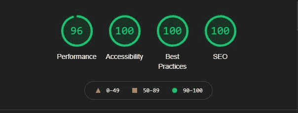

# 为什么你应该开始使用查克拉用户界面

> 原文：<https://www.freecodecamp.org/news/why-should-you-start-using-chakraui/>

在这篇文章中，我将谈论什么是 ChakraUI 以及为什么你应该使用它。

Chakra UI 是一个基于组件的库。它由可以帮助您构建 web 应用程序前端的基本构件组成。

它是可定制和可重用的，最重要的是它支持 ReactJs，以及其他一些库。

以下是我们将在本文中涉及的内容:

1.  什么是查克拉 UI？
2.  如何开始安装 Chakra UI
3.  Chakra 用户界面定制和功能
4.  查克拉界面如何影响你的灯塔得分
5.  如何在查克拉界面中使用黑暗模式
6.  结论

## 什么是查克拉 UI？

你是否曾经纠结于是更关注项目的后端还是前端？相信我，两者同等重要。

我开始使用 Chakra UI 是因为我想专注于我的后端代码，而不是停留在“如何使 div 元素居中？”。

Chakra UI 使用起来非常简单，尤其是当你熟悉如何使用 ReactJs 组件的时候。

## 如何开始安装 Chakra UI

在你各自的目录中，使用 Yarn 或 NPM 安装 ChakraUI

`yarn add @chakra-ui/react @emotion/react@^11 @emotion/styled@^11 framer-motion@^4`

`npm i @chakra-ui/react @emotion/react@^11 @emotion/styled@^11 framer-motion@^4`

#### 对于 React:

为了初始化 ChakraUI，你首先需要在你的`index.js`文件中添加`<ChakraProvider>`。

```
import React from "react"

// 1\. import `ChakraProvider` component
import { ChakraProvider } from "@chakra-ui/react"

function App({ Component }) {
 // 2\. Use at the root of your app
 return (
   <ChakraProvider>
     <Component />
   </ChakraProvider>
 )
} 
```

#### For Next.js

转到`pages/_app.js`并添加以下代码行:

```
import { ChakraProvider } from "@chakra-ui/react"
function MyApp({ Component, pageProps }) {
 return (
   <ChakraProvider>
     <Component {...pageProps} />
   </ChakraProvider>
 )
}
export default MyApp 
```

(来源: [Chakra UI 文档](https://chakra-ui.com/docs/getting-started))

> 你可以参考文档来查看 ChakraUI 对其他库的支持:[https://chakra-ui.com/docs/getting-started](https://chakra-ui.com/docs/getting-started)

## chakkari 定制和功能

### 风格道具

Chakra UI 支持 Reactjs，每个组件都可以使用风格道具进行定制。它们映射到几乎所有可用的必要 CSS 属性。

比如 CSS 中的`margin-top`，你会写成
`<Text mt={8} >`。这将在所选元素上设置一个`8px`的上边距。

Chakra UI 的灵感来源于 TailwindCSS 的调色板，你可以找到所有你喜欢的颜色！

### 如何覆盖查克拉伊的默认主题

你可以覆盖 Chakra UI 的默认主题，用你选择的颜色创建你自己的主题。你可以使用 Chakra UI 的 CSS 变量来做到这一点。

你需要做的就是创建一个新的`theme.js`文件，或者编辑 React 上现有的`index.js`文件或者 Nextjs 上的`_app.js`文件。

```
// 1\. Import `extendTheme`
import { extendTheme } from "@chakra-ui/react"

// 2\. Call `extendTheme` and pass your custom values
const theme = extendTheme({
 colors: {
   brand: {
     100: "#f7fafc",
     // ...
     900: "#1a202c",
   },
 },
})

// 4\. Now you can use these colors in your components
function Usage() {
 return <Box bg="brand.100">Welcome</Box>
} 
```

(来源: [Chakra Ui 文档](https://chakra-ui.com/docs/theming/customize-theme))

> 关于覆盖查克拉界面默认主题的更多信息，请访问位于[https://chakra-ui.com/docs/theming/customize-theme](https://chakra-ui.com/docs/theming/customize-theme)的查克拉界面文档

### 回应型风格

响应性如何？最头疼的事，至少对我来说。我不喜欢这一部分，但有了 Chakra UI，这不再是一个巨大的痛苦。

例如，考虑下面的代码行:

```
<Box m={[2, 3]} /> 
```

(来源: [Chakra UI 文档](https://chakra-ui.com/docs/features/style-props))

因此，现在通过在数组中定义这个值，Box 组件将在所有视口中为`8px`，从第一个断点开始为`16px`。

现在我们可以用很多方法来覆盖它，其中一种更容易理解——使用对象语法。

```
<Text fontSize={{ base: "24px", md: "40px", lg: "56px" }}>
 This is responsive text
</Text> 
```

(来源: [Chakra UI 文档](https://chakra-ui.com/docs/features/style-props))

所以现在在较小的屏幕上，字体大小是`24px`，在中等大小的屏幕上是`40px`，在较大的屏幕上是`56px`。

您可能已经注意到，Chakra UI 严格遵循 ReactJs 定义内联样式的语法，将第二个单词(即`fontSize`)大写，就像 CSS 属性`font-size`中的样式属性一样。

> 欲了解更多关于回应型风格的信息，请访问 ChakraUI 文档，网址为
> [、https://chakra-ui.com/docs/features/responsive-styles](https://chakra-ui.com/docs/features/responsive-styles)

### 堆栈组件

CSS 中另一个我过去不喜欢的常用特性是`flex`属性。对属性如何运作的把握有点混乱。

我很荣幸在这里说——“查克拉 UI 拯救世界🚀!"

我想向您介绍一下堆栈组件。

Stack 是一个简单的布局组件，可以用来垂直和水平地堆叠元素。

于是就有了 Stack，HStack(横栈的简称)，VStack(竖栈的简称)。你现在可能已经猜到了，但是 HStack 将水平堆叠元素，VStack 将垂直堆叠相同的布局——但是最重要的是没有 CSS。

> 关于栈组件的更多信息，请访问位于 https://chakra-ui.com/docs/layout/stack 的 Chakra UI 文档。

## 查克拉界面如何影响你的灯塔得分



当您最终准备好部署 web 应用程序时，您应该首先通过 Google Lighthouse 运行它。

Google Lighthouse 是一个内置在 Chrome 开发者工具中的自动化工具。它帮助你对你的网络应用程序进行审计，并根据它们的性能、可访问性、渐进式网络应用程序、搜索引擎优化等等来确定分数。

这里我们要注意的词是可及性。

### 什么是网页可访问性？

作为一名开发者，让每个人都能访问网络是我们的责任，谷歌对此非常重视。

当网站设计合理时，对每个人都有帮助。正确的设计意味着，例如，屏幕阅读器应该能够正确地向用户读出页面上的元素。这些原则反映在网络无障碍倡议中。

良好的可访问性不仅仅使残疾人受益。它也有助于智能手机、智能电视、各种尺寸屏幕的用户、可能看不清屏幕的老年人、色盲用户以及使用慢速互联网连接的人。

想了解更多关于 WAI 的信息，你可以访问他们的官方网站:
。

### 查克拉伊和可及性有什么关系？

ChakraUI 遵循 WAI 为其所有组件制定的所有标准。所以你所要做的就是将`Aria-label`属性添加到脉轮组件中。

这只是 Chakra 在开发过程中在幕后帮助你做的事情。

### 但是我们为什么要跟着 WAI 呢？如果我们没有呢？

正如我所说，谷歌非常重视可访问性。因此，搜索引擎会根据你的可访问性分数对你的页面进行排名。这就是为什么 Lighthouse 有专门的可访问性审计。

## 如何在 chakkari 中使用黑暗模式

黑暗模式现在越来越受欢迎，ChakraUI 使它更容易使用。

假设您在一个 React 项目中，文件如下`index.js`:

```
import React from 'react'
import ReactDOM from 'react-dom'
import App from './components/App'
import { ChakraProvider } from '@chakra-ui/react'

ReactDOM.render(
  <ChakraProvider>
    <App />
  </ChakraProvider>,
  document.getElementById('root')
) 
```

在你的网站上初始化黑暗模式所需要做的就是在`index.js`文件中做一些改变，并制作一个按钮组件来切换黑暗模式。

让我们先初始化钩子，以便在黑暗和光明模式之间切换。

转到`index.js`文件，输入下面几行代码:

```
import React from 'react'
import ReactDOM from 'react-dom'
import App from './components/App'
import { ChakraProvider, ColorModeScript } from '@chakra-ui/react'

ReactDOM.render(
  <ChakraProvider>
    <ColorModeScript initialColorMode="light" />
    <App />
  </ChakraProvider>,
  document.getElementById('root')
) 
```

钩子`ColorModeScript`将跟踪现场当前设置的模式。

将道具`initialColorMode`设置为“亮”、“暗”或“系统”。

现在看你的`App.js`文件。

像这样使用 npm 安装 react-icons:
`npm i react-icons`

导入两个 React 图标:

```
import { FaMoon, FaSun } from 'react-icons/fa' 
```

导入以下 ChakraUI 组件和`useColorMode`钩子并初始化钩子。

```
import {IconButton, useColorMode } from '@chakra-ui/react

const { colorMode, toggleColorMode } = useColorMode() 
```

这个钩子类似于`useState`钩子，除了`toggleColorMode`将全局设置站点主题为暗或亮模式，而`colorMode`将存储值“亮”或“暗”。

现在让我们引入图标按钮，并为组件提供以下道具:

```
<IconButton
    icon={colorMode === 'light' ? <FaSun /> : <FaMoon />}
    isRound="true"
    size="lg"
    alignSelf="flex-end"
    onClick={toggleColorMode}
/> 
```

现在，当你点击这个按钮时，网站应该会变成黑暗模式，并在两个图标之间切换。

有多简单？

## 结论

Chakra UI 帮助我将发展过程提升到另一个层次。它非常灵活，文档也很棒，并且有很多预构建的模板来帮助您加速这个过程。

我想调用的两个模板是 [Choc UI](https://choc-ui.tech/) 和[脉轮模板](https://chakra-templates.dev/)。

Chakra UI 在 [Discord](https://discord.com/invite/dQHfcWF) 上也有一个非常活跃的社区。

## 感谢您阅读到目前为止🎉

如果你喜欢这篇文章，和你的同事分享一下。作为一名自学成才的开发人员，我在推特上发布了我的开发历程，所以请在推特上联系我。

在那之前，祝你度过愉快的一周！