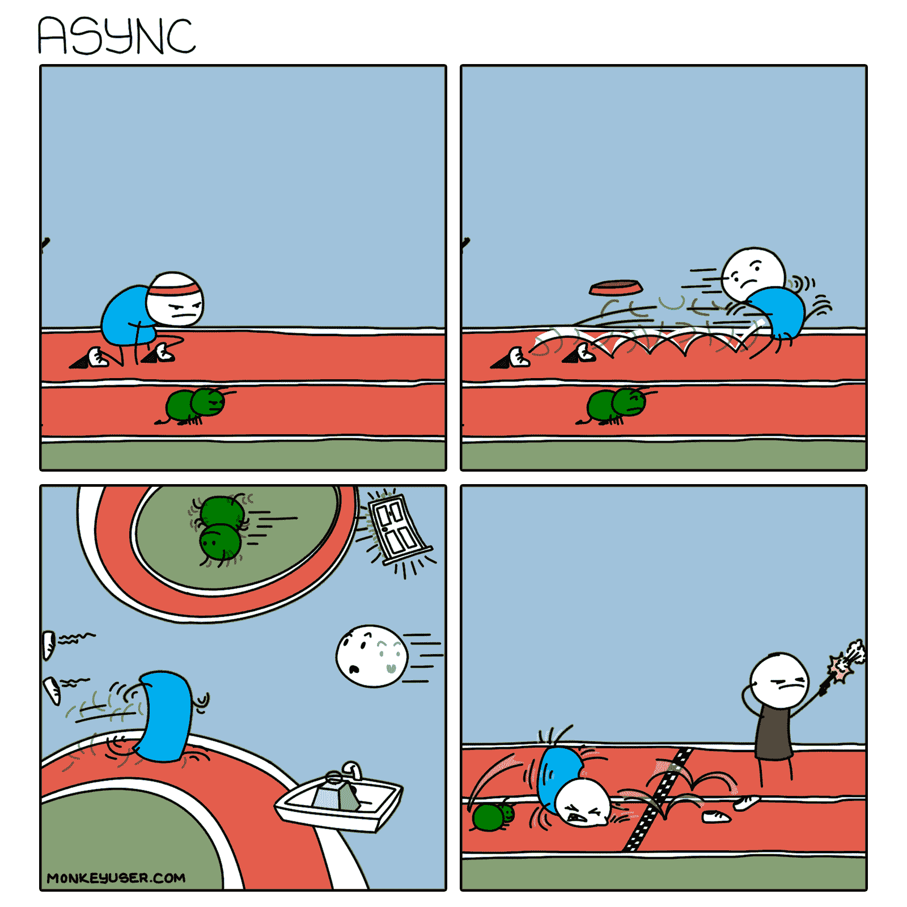
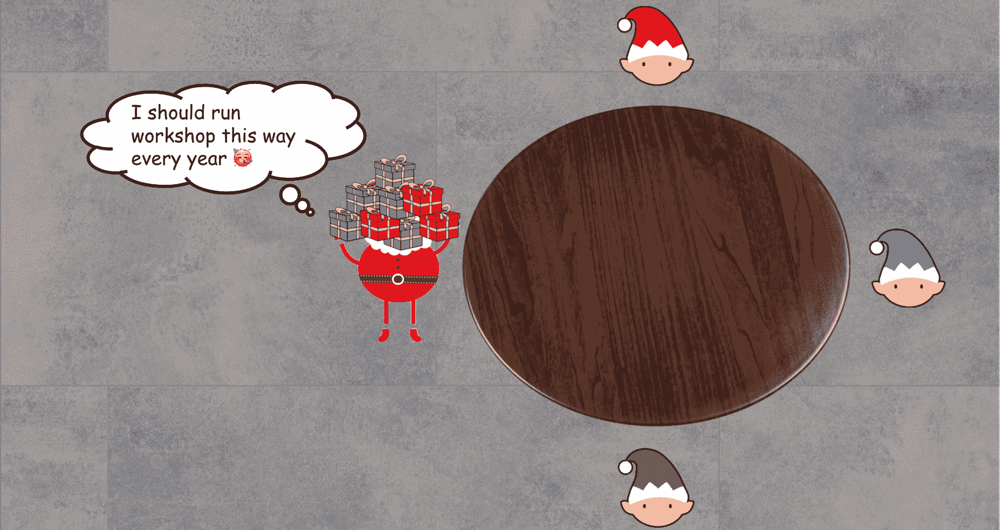
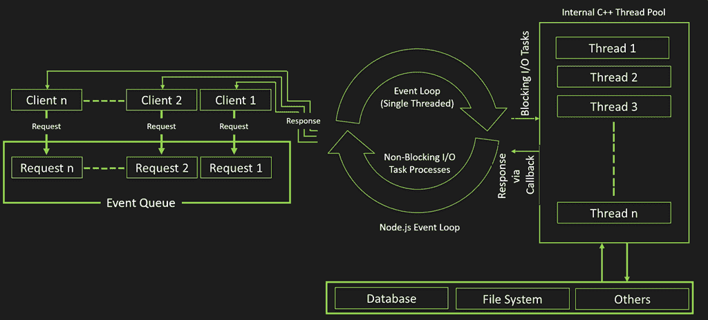
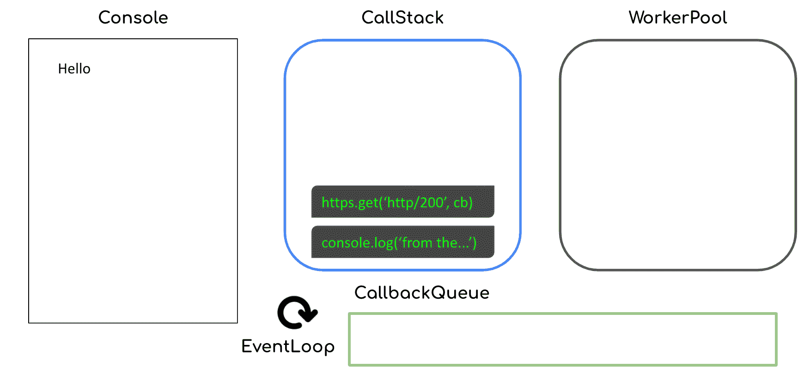
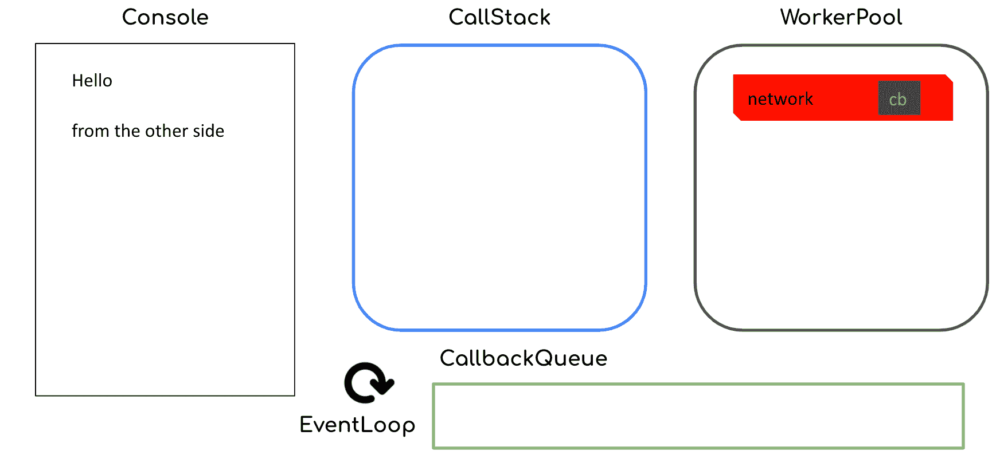
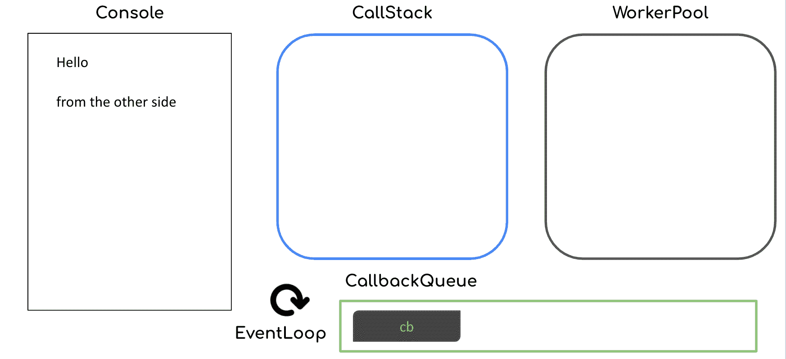
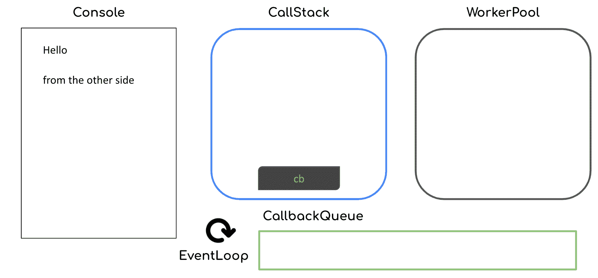
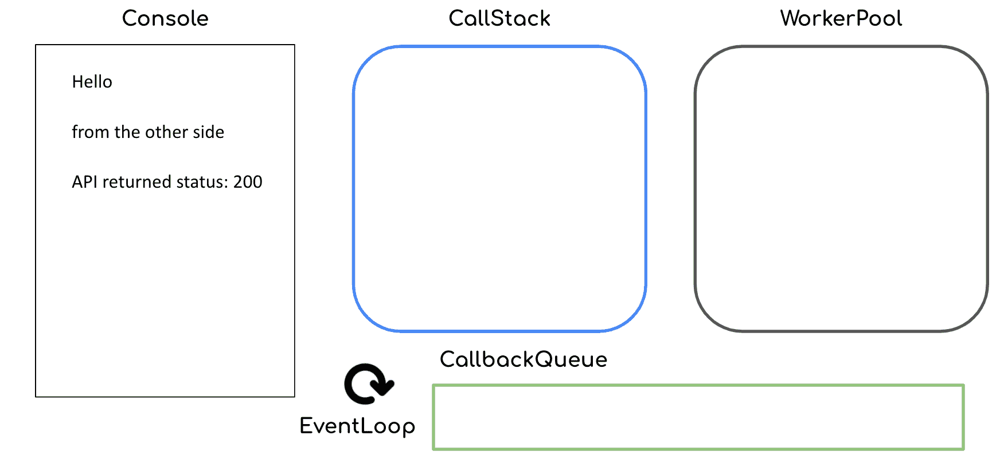

# Node.js Async Await 教程–包含异步 JavaScript 示例

> 原文：<https://www.freecodecamp.org/news/node-js-async-await-tutorial-with-asynchronous-javascript-examples/>

初学 JavaScript 时，最难理解的概念之一是语言的异步处理模型。对于我们大多数人来说，学习异步编程看起来很像这样



If your first time working with async wasn't like this, please consider yourself a genius

尽管很难掌握，但如果你想使用 JavaScript 和 Node.js 构建 web 应用程序和服务器，异步编程是非常重要的——因为 js 代码在默认情况下是异步的。

## 异步编程基础

那么到底什么是异步处理模型，或`non-blocking I/O`模型(如果你是 Node.js 用户，你可能听说过这个模型)？

这里有一个 TL；DR 描述:在异步处理模型中，当您的应用程序引擎与外部方(如文件系统或网络)交互时，它不会等待，直到从这些方获得结果。相反，它会继续执行后续任务，并且只有在收到结果信号时才会返回到先前的外部方。

为了理解 Node.js 的默认异步处理模型，让我们来看看一个假设的圣诞老人工作室。在任何工作开始之前，圣诞老人必须阅读来自世界各地孩子们的每一封可爱的信。


然后，他会计算出所需的礼物，将物品名称翻译成精灵语，然后将指令传递给我们每个辛勤工作的精灵，他们有不同的专长:红色的木制玩具，蓝色的填充玩具，绿色的机器人玩具。


今年，由于新冠肺炎疫情，只有一半的圣诞老人的精灵能来他的工作室帮忙。尽管如此，因为他很聪明，圣诞老人决定不再等待每个小精灵准备好礼物(也就是说，同步工作)，而是继续翻译并从他的一堆信件中发出指令。


等等...


当他正准备读另一封信时，瑞德告诉圣诞老人他已经准备好了第一份礼物。然后，圣诞老人收到了红色的礼物，并把它放在一边。


然后他继续翻译并传递下一封信的指示。


由于他只需要包装一个预先制作好的飞行机器人，格林可以很快完成准备，并将礼物递给圣诞老人。


经过一整天的艰苦和不同步的工作，圣诞老人和小精灵们设法完成了所有的礼物准备工作。尽管受到疫情的重创，圣诞老人的工作室还是在他改进的异步工作模式下，以创纪录的时间完成了工作。



这就是异步或非阻塞 I/O 处理模型的基本思想。现在我们来具体看看在 Node.js 中是怎么做的。

## Node.js 事件循环

你可能听说过 Node.js 是单线程的。然而，确切地说，Node.js 中只有与后台 C++工作线程池交互的事件循环是单线程的。Node.js 处理模型有四个重要的组件:

*   事件队列:在程序中声明的任务，或者通过[回调](https://nodejs.org/en/knowledge/getting-started/control-flow/what-are-callbacks/)从处理线程池返回的任务。(在我们的圣诞老人工作室里，相当于这一堆给圣诞老人的信。)
*   事件循环:主 Node.js 线程，它帮助事件队列和工作线程池执行操作——包括异步和同步操作。(这是圣诞老人。🎅)
*   后台线程池:这些线程执行任务的实际处理，这些任务
    可能是 I/O 阻塞(例如调用和等待来自外部 API 的响应)。(这些是来自我们车间的勤劳的小精灵🧝🧝‍♀️🧝‍♂️。)

您可以将此处理模型可视化如下:



Diagram courtesy of c-sharpcorner.com

让我们来看一个实际的代码片段，看看它们是如何工作的:

```
console.log("Hello");
https.get("https://httpstat.us/200", (res) => {
  console.log(`API returned status: ${res.statusCode}`);
});
console.log("from the other side"); 
```

如果我们执行上面这段代码，我们将在标准输出中得到以下内容:

```
Hello
from the other side
API returned status: 200 
```

那么 Node.js 引擎是如何实现上面这段代码的呢？它从调用堆栈中的三个函数开始:


然后将“Hello”打印到控制台，并从堆栈中删除相应的函数调用。



然后执行对`https.get`的函数调用(即对相应的 URL 发出 get 请求)，并委托给工作线程池，附带一个回调。


对`console.log`的下一个函数调用被执行，并且“从另一边”被打印到控制台。



既然网络调用已经返回了响应，回调函数调用将在回调队列中排队。请注意，这一步可能发生在前一步之前(即“从另一面”打印)，尽管通常情况下并非如此。



然后回调被放入我们的调用堆栈中:



然后我们会在控制台中看到“API 返回状态:200 ”,如下所示:



通过促进回调队列和调用堆栈，Node.js 中的事件循环以异步方式高效地执行我们的 JavaScript 代码。

## JavaScript & Node.js async/await 的同步历史

现在，您已经很好地理解了异步执行和 Node.js 事件循环的内部工作方式，让我们深入研究 JavaScript 中的 async/await。我们将看看它是如何随着时间的推移而工作的，从最初的回调驱动实现到最新的闪亮的 async/await 关键字。

### JavaScript 中的回调

处理 JavaScript 引擎异步本质的 OG 方式是通过回调。回调基本上是将在同步或 I/O 阻塞操作结束时执行的函数，**通常是**。

这种模式的一个简单例子是内置的`setTimeout`函数，它将在执行回调之前等待一定数量的毫秒。

```
setTimeout(2000, () => {
  console.log("Hello");
}); 
```

虽然将回调附加到阻塞操作很方便，但是这种模式也引入了一些问题:

*   回调地狱
*   反转控制(不是好的那种！)

#### 什么是回调地狱？

让我们再看一个圣诞老人和他的小精灵的例子。为了准备一份礼物，圣诞老人的工作室必须执行几个不同的步骤(使用`setTimeout`模拟每个步骤花费不同的时间):

```
function translateLetter(letter, callback) {
  return setTimeout(2000, () => {
    callback(letter.split("").reverse().join(""));
  });
}
function assembleToy(instruction, callback) {
  return setTimeout(3000, () => {
    const toy = instruction.split("").reverse().join("");
    if (toy.includes("wooden")) {
      return callback(`polished ${toy}`);
    } else if (toy.includes("stuffed")) {
      return callback(`colorful ${toy}`);
    } else if (toy.includes("robotic")) {
      return callback(`flying ${toy}`);
    }
    callback(toy);
  });
}
function wrapPresent(toy, callback) {
  return setTimeout(1000, () => {
    callback(`wrapped ${toy}`);
  });
} 
```

这些步骤需要按照特定的顺序执行:

```
translateLetter("wooden truck", (instruction) => {
  assembleToy(instruction, (toy) => {
    wrapPresent(toy, console.log);
  });
});
// This will produced a "wrapped polished wooden truck" as the final result 
```

当我们以这种方式做事时，向过程中添加更多的步骤将意味着将内部回调推到右边，并在回调地狱中结束，如下所示:


回调看起来是连续的，但有时执行顺序并不遵循屏幕上显示的顺序。有了多层嵌套的回调，你很容易忘记整个程序流程的全貌，产生更多的错误，或者在编写代码时变得更慢。

那么如何解决这个问题呢？只需将嵌套的回调函数模块化到命名函数中，就可以得到一个易于阅读的左对齐的程序。

```
function assembleCb(toy) {
  wrapPresent(toy, console.log);
}
function translateCb(instruction) {
  assembleToy(instruction, assembleCb);
}
translateLetter("wooden truck", translateCb); 
```

#### 控制反转

回调模式的另一个问题是，您不能决定高阶函数如何执行回调。他们可能在函数结束时执行它，这是惯例，但是他们也可能在函数开始时执行它，或者多次执行它。

基本上，你受依赖项所有者的支配，你可能永远不知道他们什么时候会破坏你的代码。

要解决这个问题，作为一个依赖用户，你无能为力。然而，如果你曾经是一个依赖者，请永远:

*   坚持使用传统的回调签名，将 error 作为第一个参数
*   在高阶函数结束时只执行一次回调
*   记录任何绝对需要的不符合惯例的东西，并始终以向后兼容为目标

### JavaScript 中的承诺

[Promises](https://developer.mozilla.org/en-US/docs/Web/JavaScript/Reference/Global_Objects/Promise) 就是通过回调来解决上述问题的。承诺确保 JavaScript 用户:

*   坚持使用他们的签名`resolve`和`reject`函数的特定约定。
*   将回调函数链接到一个对齐的自顶向下的流程中。

我们之前在圣诞老人工作室准备礼物的例子可以改写成这样的承诺:

```
function translateLetter(letter) {
  return new Promise((resolve, reject) => {
    setTimeout(2000, () => {
      resolve(letter.split("").reverse().join(""));
    });
  });
}
function assembleToy(instruction) {
  return new Promise((resolve, reject) => {
    setTimeout(3000, () => {
      const toy = instruction.split("").reverse().join("");
      if (toy.includes("wooden")) {
        return resolve(`polished ${toy}`);
      } else if (toy.includes("stuffed")) {
        return resolve(`colorful ${toy}`);
      } else if (toy.includes("robotic")) {
        return resolve(`flying ${toy}`);
      }
      resolve(toy);
    });
  });
}
function wrapPresent(toy) {
  return new Promise((resolve, reject) => {
    setTimeout(1000, () => {
      resolve(`wrapped ${toy}`);
    });
  });
} 
```

这些步骤在一个链条中被很好地执行:

```
translateLetter("wooden truck")
  .then((instruction) => {
    return assembleToy(instruction);
  })
  .then((toy) => {
    return wrapPresent(toy);
  })
  .then(console.log);
// This would produce the exact same present: wrapped polished wooden truck 
```

然而，承诺也不是没有问题。链中每只眼的数据都有不同的作用域，并且只能访问从上一步或父作用域传来的数据。

例如，我们的礼品包装步骤可能需要使用翻译步骤中的数据:

```
function wrapPresent(toy, instruction) {
  return Promise((resolve, reject) => {
    setTimeout(1000, () => {
      resolve(`wrapped ${toy} with instruction: "${instruction}`);
    });
  });
} 
```

这是一个典型的线程“内存共享”问题。为了解决这个问题，我们应该使用`Promise.all`和[“通过通信共享数据，而不是通过共享数据进行通信”](https://blog.golang.org/codelab-share)，而不是在父范围内使用变量。

```
translateLetter("wooden truck")
  .then((instruction) => {
    return Promise.all([assembleToy(instruction), instruction]);
  })
  .then((toy, instruction) => {
    return wrapPresent(toy, instruction);
  })
  .then(console.log);
// This would produce the present: wrapped polished wooden truck with instruction: "kcurt nedoow" 
```

### JavaScript 中的异步/等待

最后但绝对不是最不重要的，这个街区最耀眼的孩子是 async/await。它很容易使用，但也有一些风险。

Async/await 通过将所有东西都放在同一个作用域下，解决了 promises 的内存共享问题。我们前面的例子可以很容易地改写成这样:

```
(async function main() {
  const instruction = await translateLetter("wooden truck");
  const toy = await assembleToy(instruction);
  const present = await wrapPresent(toy, instruction);
  console.log(present);
})();
// This would produce the present: wrapped polished wooden truck with instruction: "kcurt nedoow" 
```

然而，尽管使用 async/await 编写异步代码很容易，但也很容易犯下造成性能漏洞的错误。

现在，让我们将圣诞老人工作室的示例场景本地化为包装礼物并将它们装载到雪橇上。

```
function wrapPresent(toy) {
  return Promise((resolve, reject) => {
    setTimeout(5000 * Math.random(), () => {
      resolve(`wrapped ${toy}`);
    });
  });
}
function loadPresents(presents) {
  return Promise((resolve, reject) => {
    setTimeout(5000, () => {
      let itemList = "";
      for (let i = 0; i < presents.length; i++) {
        itemList += `${i}. ${presents[i]}\n`;
      }
    });
  });
} 
```

你可能犯的一个常见错误是以这种方式执行这些步骤:

```
(async function main() {
  const presents = [];
  presents.push(await wrapPresent("wooden truck"));
  presents.push(await wrapPresent("flying robot"));
  presents.push(await wrapPresent("stuffed elephant"));
  const itemList = await loadPresents(presents);
  console.log(itemList);
})(); 
```

但是圣诞老人需要在装货前一件一件地包装礼物吗？肯定不是！礼物应该同时包装。你可能经常犯这个错误，因为编写`await`时不考虑关键字的阻塞特性是如此容易。

要解决这个问题，我们应该将礼品包装步骤捆绑在一起，一次全部执行:

```
(async function main() {
  const presents = await Promise.all([
    wrapPresent("wooden truck"),
    wrapPresent("flying robot"),
    wrapPresent("stuffed elephant"),
  ]);
  const itemList = await loadPresents(presents);
  console.log(itemList);
})(); 
```

以下是解决 Node.js 代码中并发性能问题的一些建议步骤:

*   识别代码中有多个连续等待的热点
*   检查它们是否相互依赖(即一个函数使用另一个函数返回的数据)
*   与`Promise.all`同时进行独立的函数调用

## 包装(文章，不是圣诞礼物😂)

祝贺你到达这篇文章的结尾，我尽力使这篇文章更短，但是 JavaScript 中的异步主题太宽泛了。

以下是一些关键要点:

*   模块化您的 JavaScript 回调，以避免回调地狱
*   坚持[JS 回调的惯例](https://gist.github.com/sunnycmf/b2ad4f80a3b627f04ff2)
*   使用承诺时，通过`Promise.all`交流分享数据
*   小心异步/等待代码的性能含义

我们❤️ JavaScript:)

## 感谢您的阅读！

最后但同样重要的是，如果你喜欢我的作品，请前往[我的博客](https://blog.stanleynguyen.me/)获取类似的评论，并在 Twitter 上关注[我。🎉](https://twitter.com/stanley_ngn)