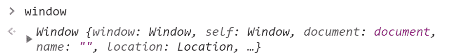
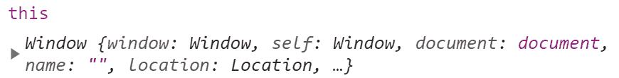
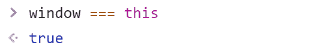
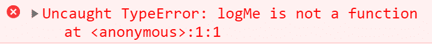
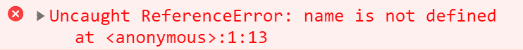

# 用代码示例解释 JavaScript 执行上下文和提升

> 原文：<https://www.freecodecamp.org/news/javascript-execution-context-and-hoisting/>

与许多同类语言相比，JavaScript 是一种简单易学的编程语言。然而，如果您想理解、调试和编写更好的代码，一些基本概念需要更多的关注。

在本文中，我们将了解两个这样的概念，

*   执行上下文
*   提升

作为 JavaScript 的初学者，理解这些概念将有助于你更好地理解关键字`this`、`scope`和`closure`。所以享受吧，继续读下去。

# JavaScript 中的执行上下文

通常，一个 JavaScript 源文件会有多行代码。作为开发人员，我们将代码组织成变量、函数、数据结构，如对象和数组等等。

一个`Lexical Environment`决定了我们如何以及在哪里写代码。看看下面的代码:

```
function doSomething() {
  var age= 7;
  // Some more code
 } 
```

在上面的代码中，变量`age`在词汇上位于函数`doSomething`内部。

请注意，我们的代码不会按原样运行。它必须由编译器翻译成计算机可理解的字节码。因此，编译器需要以有意义和有效的方式映射什么在词汇上放在哪里。

通常，你的代码中会有不止一个`Lexical Environment`。然而，并不是所有的环境都能立即执行。

帮助代码执行的环境被称为`Execution Context`。它是当前正在运行的代码，以及有助于运行它的周围的一切。

可以有很多可用的`Lexical Environment`，但是当前运行的代码是由`Execution Context`管理的。

查看下图，了解词法环境和执行上下文之间的区别:


Lexical Environment vs Execution Context

那么在执行上下文中到底发生了什么呢？代码被逐行解析，生成可执行的字节码，分配内存，然后执行。

让我们以上面看到的同一个函数为例。当下面的代码行被执行时，你认为会发生什么？

```
var age = 7; 
```

幕后发生了很多事情。这段源代码在最终执行之前要经历以下几个阶段:

*   **标记化:**在这个阶段，源代码串分成多个有意义的块，称为`Tokens`。例如，代码`var age = 7;`令牌化为**变量**、**年龄**、 **=** 、 **7** 和、**；**。
*   **解析:**下一个阶段是解析，在这里，一个标记数组变成一个嵌套元素的树，被语言的语法所理解。这棵树被称为`AST`(抽象语法树)。
*   **代码生成:**在这个阶段，解析阶段创建的 AST 会变成可执行的字节码。然后 JIT(实时)编译器进一步优化这个可执行字节码。

下面的动画图片展示了源代码到可执行字节码的转换。


Source Code to Executable Byte-Code

所有这些事情都发生在一个`Execution Context`。所以执行上下文是代码的特定部分执行的环境。

有两种类型的执行上下文:

*   全球执行环境(GEC)
*   函数执行上下文(FEC)

并且每个执行上下文具有两个阶段:

*   创建阶段
*   执行阶段

让我们详细看看它们，并更好地理解它们。

## JavaScript 中的全局执行上下文(GEC)

每当我们执行 JavaScript 代码时，它都会创建一个全局执行上下文(也称为基本执行上下文)。全局执行上下文有两个阶段。

### 创建阶段

在创建阶段，会创建两个独特的东西:

*   一个名为`window`的全局对象(用于客户端 JavaScript)。
*   名为`this`的全局变量。

如果代码中声明了任何变量，内存将被分配给该变量。变量用一个名为`undefined`的唯一值初始化。如果代码中有一个`function`，它将被直接放入内存。我们将在后面的`Hoisting`部分了解更多关于这部分的内容。

### 执行阶段

代码执行从这个阶段开始。在这里，对全局变量进行赋值。请注意，这里不会调用任何函数，因为它发生在函数执行上下文中。我们一会儿就会看到。

让我们通过几个例子来理解这两个阶段。

#### 示例 1:加载一个空脚本

创建一个名为`index.js`的空 JavaScript 文件。现在创建一个包含以下内容的 HTML 文件:

```
<!DOCTYPE html>
<html lang="en">
<head>
    <meta charset="UTF-8">
    <meta http-equiv="X-UA-Compatible" content="IE=edge">
    <meta name="viewport" content="width=device-width, initial-scale=1.0">
    <title>Document</title>
    <script src='./index.js'></script>
</head>
<body>
    I'm loading an empty script
</body>
</html>
```

注意，我们使用`<script>`标签将空脚本文件导入到 HTML 文件中。

在浏览器中加载 HTML 文件，并打开 Chrome DevTools(通常使用`F12`键)或其他浏览器的等效工具。浏览到`console`选项卡，键入`window`，然后按回车键。您应该看到该值是浏览器的`Window`对象。



The Window object

现在，键入单词`this`并按回车键。您应该在浏览器控制台中看到相同的`Window`对象值。



Value of 'this'

很好，现在试着检查 window 是否等于`this`。是的，它是。



window is equal to 'this'

好吧，我们学到了什么？

*   当我们加载 JavaScript 文件时，即使它是空的，也会创建全局执行上下文。
*   它在创建阶段为我们创建了两个特殊的东西，那就是`window`对象和`this`。
*   在全局执行上下文中，`window`对象和`this`是相等的。
*   由于脚本文件为空，没有要执行的内容。所以在执行阶段什么都不会发生。

#### 示例 2:使用变量和函数

现在让我们看一个 JavaScript 文件中包含一些代码的例子。我们将添加一个赋有值的变量(blog)。我们还将定义一个名为`logBlog`的函数。

```
var blog = 'freeCodeCamp';

function logBlog() {
  console.log(this.blog); 
} 
```

在创建阶段:

*   全局对象`window`和变量`this`被创建。
*   为变量`blog`和函数`logBlog`分配内存。
*   变量`blog`由一个特殊值`undefined`初始化。函数`logBlog`直接放在内存中。

在执行阶段:

*   值`freeCodeCamp`被分配给变量`blog`。
*   因为我们已经定义了函数，但还没有调用它，所以函数不会执行。我们将调用函数，看看当我们了解函数执行上下文时会发生什么。

## JavaScript 中的函数执行上下文(FEC)

当我们调用一个函数时，就会创建一个函数执行上下文。让我们扩展上面使用的同一个例子，但是这次我们将调用函数。

```
var blog = 'freeCodeCamp';

function logBlog() {
  console.log(this.blog); 
}

// Let us call the function
logBlog();
```

函数执行上下文经历相同的阶段，创建和执行。

函数执行阶段可以访问一个名为`arguments`的特殊值。它是传递给函数的参数。在我们的例子中，没有传递任何参数。

请注意，在全局执行上下文中创建的`window`对象和`this`变量仍然可以在这个上下文中访问。

当一个函数调用另一个函数时，会为新的函数调用创建一个新的函数执行上下文。每个函数执行上下文确定了在各自函数中使用的变量的`scope`。

# 在 JavaScript 中提升

我希望你喜欢了解`Execution Context`。让我们转到另一个叫做`Hoisting`的基本概念。当我第一次听说吊装时，过了一段时间才意识到`Hoisting`这个名字有严重的问题。

在英语中，提升意味着用绳子和滑轮提升某物。这个名字可能会误导您，让您认为 JavaScript 引擎在特定的代码执行阶段提取变量和函数。事情不是这样的。

所以让我们用`Execution Context`的概念来理解`Hoisting`。

## JavaScript 中的变量提升

请看看下面的例子，猜猜输出结果:

```
console.log(name);
var name; 
```

我相信你已经猜到了。是这样的:

```
undefined 
```

但是，问题是为什么呢？假设我们在其他编程语言中使用类似的代码。在这种情况下，我们可能会得到一个错误，说变量`name`没有声明，我们试图在此之前访问它。答案就在执行上下文中。

在`creation`阶段，

*   内存被分配给变量`name`，并且
*   一个特殊值`undefined`被分配给变量。

在`execution`阶段，

*   将执行`console.log(name)`语句。

这种在执行上下文创建阶段为变量分配内存并用值`undefined`初始化的机制被称为`Variable Hoisting`。

> 特殊值`undefined`意味着声明了一个变量，但没有赋值。

如果我们给变量赋值如下:

```
name = 'freeCodeCamp';
```

执行阶段会将这个值赋给变量。

## JavaScript 中的函数提升

现在来说说`Function Hoisting`。它遵循与`Variable Hoisting`相同的模式。

执行上下文的创建阶段将函数声明放入内存，执行阶段执行它。请看看下面的例子:

```
// Invoke the function functionA
functionA();

// Declare the function functionA
function functionA() {
 console.log('Function A');
 // Invoke the function FunctionB    
 functionB();
}

// Declare the function FunctionB
function functionB() {
 console.log('Function B');
}
```

输出如下所示:

```
Function A
Function B
```

*   执行上下文为函数创建内存，并将`functionA`的整个函数声明放入其中。
*   这些函数创建自己的执行上下文。所以类似的事情也发生在`functionB`身上。
*   接下来，函数分别在它们的执行上下文中执行。

在创建阶段将整个函数声明提前放入内存称为`Function Hoisting`。

## 一些基本规则

既然我们现在理解了`Hoisting`的概念，让我们来理解一些基本规则:

*   在代码中使用变量和函数之前，一定要先定义它们。它减少了意外错误和调试噩梦的机会。
*   提升只是为了函数声明，不是初始化。下面是一个函数初始化的例子，其中代码执行将会中断。

```
logMe();

var logMe = function() {
  console.log('Logging...');
}
```

代码执行将会中断，因为在函数初始化时，变量`logMe`将被提升为变量，而不是函数。因此，使用变量提升，内存分配将随着使用`undefined`的初始化而发生。这就是我们会得到错误的原因:



Error in hoisting a function initialization

假设我们试图在声明之前访问一个变量，并在之后使用`let`和`const`关键字来声明它。在这种情况下，它们将被提升，但不会分配默认的`undefined`。访问这些变量将导致`ReferenceError`。这里有一个例子:

```
console.log(name);
let name;
```

它将抛出错误:



Error with hoisting variable declared with let and const keywords

如果我们使用`var`而不是`let`和`const`，同样的代码运行起来不会有问题。这个错误是我们已经讨论过的 JavaScript 语言的保护机制，因为意外的提升可能会导致不必要的麻烦。

# 在结束之前...

我希望你觉得这篇文章很有见地，并且它能帮助你更好地理解`Execution Context`和`hoisting`的概念。基于这些概念，我将很快写一篇关于`Scope`和`Closure`的文章。敬请关注。

我们来连线。你会发现我活跃在 [Twitter (@tapasadhikary)](https://twitter.com/tapasadhikary) 。请随时关注。

您可能也会喜欢这些文章:

*   [为 JS 初学者讲解的 JavaScript `this` Keyword + 5 键绑定规则](https://www.freecodecamp.org/news/javascript-this-keyword-binding-rules/)
*   [作为软件开发人员如何每天学习新东西](https://www.freecodecamp.org/news/learn-something-new-every-day-as-a-software-developer/)
*   [我最喜欢的 JavaScript 技巧和窍门](https://blog.greenroots.info/my-favorite-javascript-tips-and-tricks-ckd60i4cq011em8s16uobcelc)
*   像我五岁一样解释我:ES6 符号是什么？
*   [你可能会发现有用的 16 个 GitHub 辅助项目库](https://blog.greenroots.info/16-side-project-github-repositories-you-may-find-useful-ckk50hic406quhls1dui2d6sd)