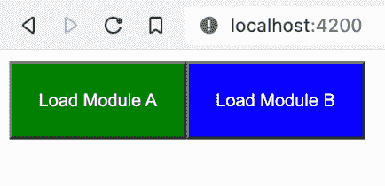
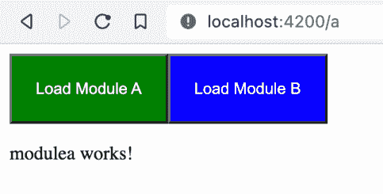
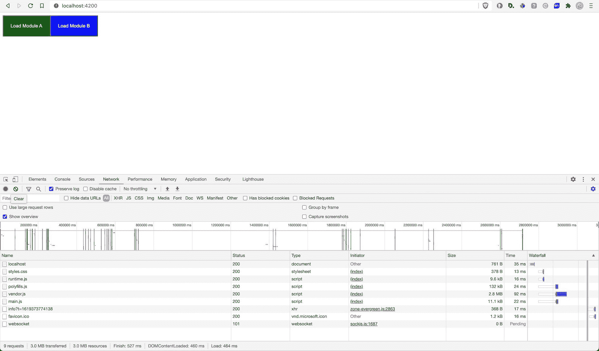
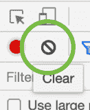
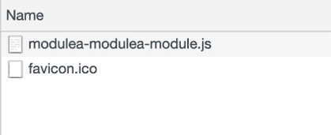
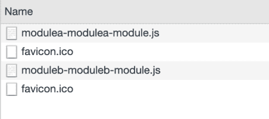

# Angular 中的惰性加载 NgModules 初学者指南

> 原文：<https://www.freecodecamp.org/news/lazy-loading-in-angular-intro-to-ngmodules/>

## 什么是懒装？

惰性加载是根据需要加载组件、模块或网站的其他资产的过程。

因为 Angular 创建了一个 [SPA(单页应用)](https://en.wikipedia.org/wiki/Single-page_application#:~:text=From%20Wikipedia%2C%20the%20free%20encyclopedia,browser%20loading%20entire%20new%20pages.)，所以它的所有组件都是一次性加载的。这意味着许多不必要的库或模块也可能被加载。

对于一个小的应用程序来说，这是可以的。但是随着应用程序的增长，如果一次加载所有内容，加载时间将会增加。惰性加载允许 Angular 在需要的时候加载组件和模块。

首先，要理解 Angular 中的惰性加载是如何工作的，我们需要了解框架的基本构建模块:NgModules。

## 什么是 NgModules？

像 RouterModule、BrowserModule 和 FormsModule 这样的 Angular 库是 NgModules。[角材](https://material.angular.io/)是第三方工具，也是 NgModule 的一种。

NgModules 由与特定领域相关或具有类似功能集的文件和代码组成。

典型的 NgModule 文件声明组件、指令、管道和服务。它还可以导入当前模块中需要的其他模块。

NgModules 的一个重要优点是它们可以被延迟加载。让我们来看看如何配置延迟加载。

你可以在下面[查看一个基本的 NgModule 文件是什么样子的。](#root-module)

## 如何创建 NgModules

在本教程中，我们将创建两个模块， **模块** **A** 和 **模块 B** ，它们将被惰性加载。在主屏幕上，我们将有两个按钮来加载每个模块。

### 创建项目

通过执行以下命令，创建一个名为 **lazy-load-demo** 的新 Angular 项目:

```
ng new lazy-load-demo --routing --style css
code lazy-load-demo 
```

这里，我们正在创建一个带有路由的新项目。其次，我们向 CSS 提及样式表格式。第二个命令在 VS 代码中打开项目。

### 根模块

默认情况下，根模块或 app 模块是在 **/src/app** 下创建的。下面是创建的 NgModule 文件。

```
import { NgModule } from '@angular/core';
import { BrowserModule } from '@angular/platform-browser';

import { AppRoutingModule } from './app-routing.module';
import { AppComponent } from './app.component';

@NgModule({
  declarations: [
    AppComponent
  ],
  imports: [
    BrowserModule,
    AppRoutingModule
  ],
  providers: [],
  bootstrap: [AppComponent]
})
export class AppModule { } 
```

首先，我们导入所有需要的模块和组件。

之后， ****`@NgModule`**** decorator 声明 AppModule 类是 NgModule 的一种类型。装饰器接受 **声明、导入、提供者、** 和 **引导。** 以下是对每一种的描述:

*   ****声明**** :该模块中的组件。
*   ****导入**** :当前模块需要的模块。
*   ****提供商**** :服务提供商，如果有的话。
*   ****bootstrap****:Angular 创建的 **根** 组件，插入到`index.html`宿主网页中。

### 主屏幕

主屏幕上会有两个按钮， ****加载模块 A**** & ****加载模块 B.**** 顾名思义，点击这些按钮会懒洋洋地加载各个模块。

为此，用下面的内容替换您的*app.component.html 文件。*

```
*`<button style="padding: 20px; color: white; background-color: green;" routerLink="a">Load Module A</button>
<button style="padding: 20px; color: white; background-color: blue;" routerLink="b">Load Module B</button>
<router-outlet></router-outlet>`* 
```

 *让我们定义路线**a**&**b**的模块。

### 惰性加载模块

为了创建惰性加载模块，执行以下命令:

```
ng generate module modulea --route a --module app.module
ng generate module moduleb --route b --module app.module 
```

这些命令将生成两个文件夹，分别名为**和 ****moduleb**** 。每个文件夹都会包含自己的 **module.ts** ， **routing.ts** 和 **component** 文件。**

**如果您检查您的**app-routing . module . ts**，您将看到以下路线代码:**

```
`const routes: Routes = [
  { path: 'a', loadChildren: () => import('./modulea/modulea.module').then(m => m.ModuleaModule) },
  { path: 'b', loadChildren: () => import('./moduleb/moduleb.module').then(m => m.ModulebModule) }
];` 
```

 **它暗示当路由 **a** 或 **b** 被访问时，懒惰地加载各自的模块。

在使用 ****ng serve**** 运行项目时，您会看到下面的屏幕:



Home Page

当你点击 **加载模块一** 按钮时，你将被路由到*页面一* 。您的屏幕应该是这样的:



Lazily loaded Module A

你应该会看到一个类似的屏幕，上面写着 ****moduleb 工作！**** 点击 **时加载模块 B.**

## 如何验证延迟加载有效

为了验证文件是否已加载，请按 F12 打开开发人员工具。之后，访问 **网络** 标签，如下图截图所示。当您刷新页面时，它会显示一些被请求的文件。



Network Tab

点击清除按钮，清除你的请求列表，如下图所示。



当你点击 **加载模块 A** 时，你会看到一个对**modulea-modulea-Module . js**的请求，如下图截图所示。这验证了 **模块 A** 被延迟加载。



Module A Loaded

同样，当你点击 **加载模块 B** 时，加载的是**moduleb-moduleb-Module . js**文件。这验证了模块 B 是延迟加载的。



Module B Loaded

现在，当你试图点击按钮时，它不会再次加载这些 *js* 文件。

## NgModules 的用例

正如我们所见，创建惰性加载模块非常容易。它们有很多有用的用例，例如

*   为登录前和登录后屏幕创建单独的模块。
*   对于电子商务网站，面向供应商和面向客户的屏幕可以属于不同的模块。您也可以创建一个单独的支付模块。
*   通常会创建一个单独的包含共享组件、指令或管道的 CommonModule。像*复制代码*按钮这样的指令，像*投赞成票/反对票*这样的组件通常包含在一个公共模块中。

## 结论

对于较小的网站来说，一次加载所有模块可能没什么关系。但是，随着站点的增长，根据需要加载独立的模块会很有帮助。

由于惰性加载，网站的加载时间可以大大减少。这是特别有帮助的，当你试图为搜索引擎优化排名更高。即使不是，更短的加载时间意味着更好的用户体验。

有兴趣了解更多教程吗？查看这些资源:

*   通过集成测试学习 TDD。网络
*   [如何认证&在中正确授权 API。网络](https://arjavdave.com/2021/03/31/net-5-setup-authentication-and-authorisation/)
*   [Azure 函数& wkhtmltopdf:将 HTML 转换成 PDF](https://arjavdave.com/2021/03/22/azure-functions-wkhtmltopdf/)***