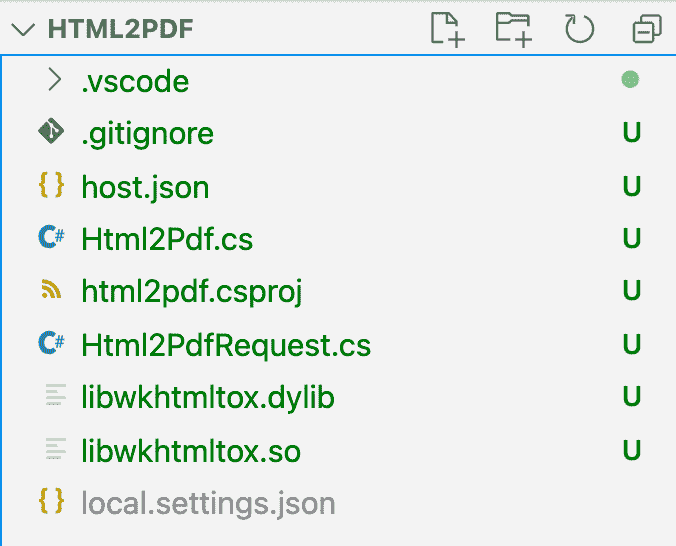
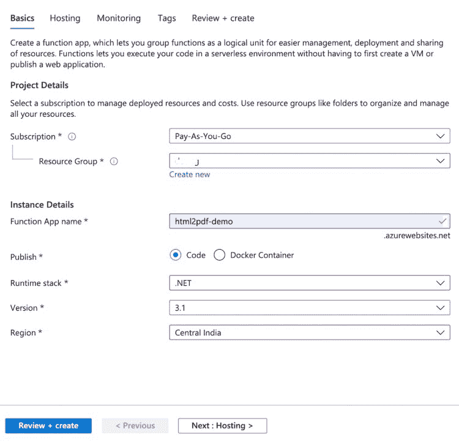
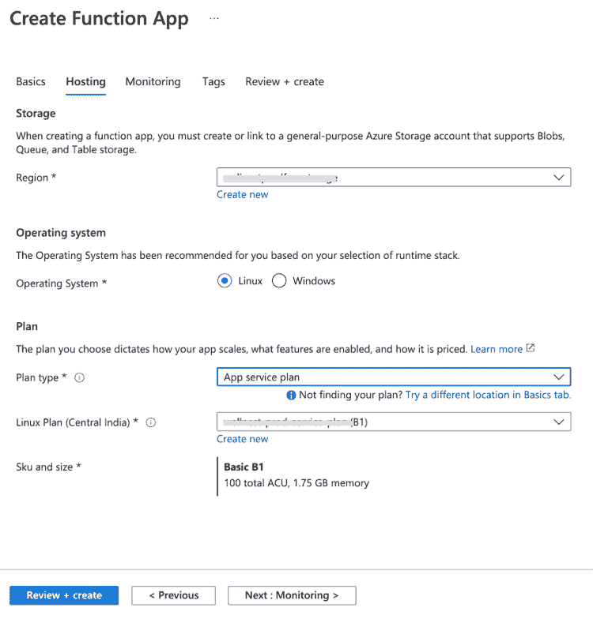
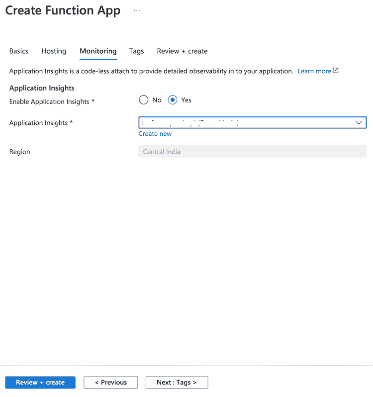
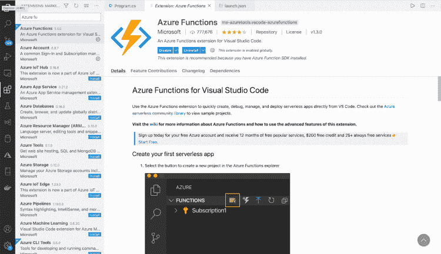
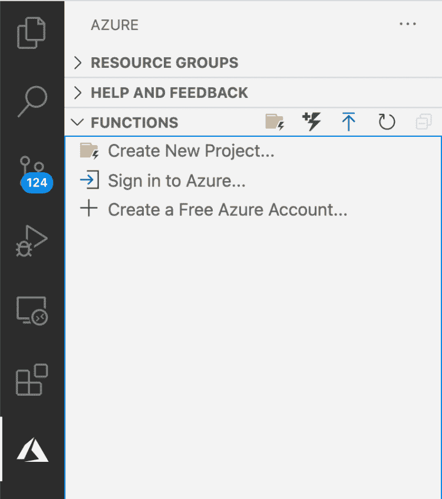
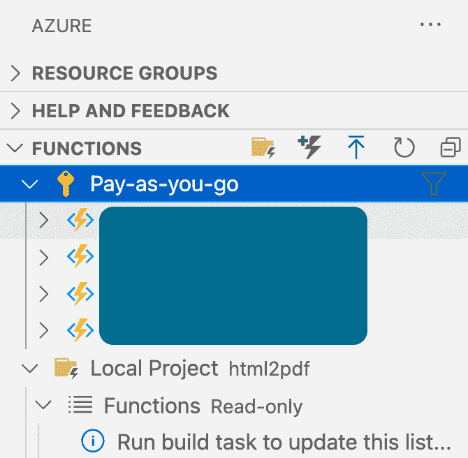
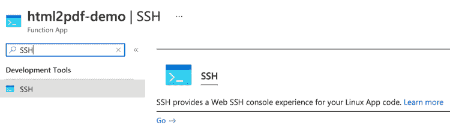
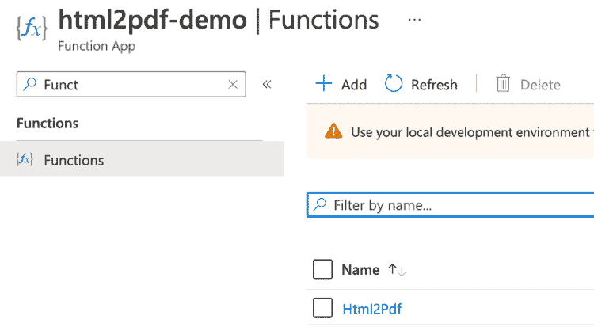
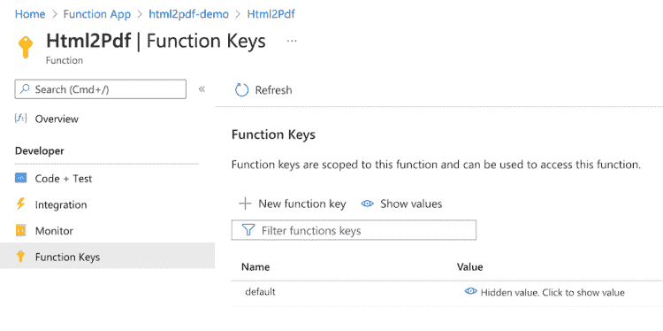

# 如何用 Azure 函数和 wkhtmltopdf 把 HTML 转换成 PDF

> 原文：<https://www.freecodecamp.org/news/convert-html-to-pdf-with-azure-functions-and-wkhtmltopdf/>

在本文中，我们将使用 Azure 函数和 [wkhtmltopdf](https://wkhtmltopdf.org/) 工具从 HTML 文件生成 pdf 文件。

您可能出于许多原因想要创建 PDF 文件，例如为销售生成发票、为患者生成医疗报告、为客户生成保险单等等。有几种方法可以做到这一点。

首先，你可以使用 Adobe 的填充和签名工具来填写表格。但这主要需要人工交互，因此不可扩展或不方便。

第二种选择是直接创建一个 PDF 文件。基于您正在工作的平台，您将拥有完成这项工作的工具。如果这是一个非常简单的 PDF，你可以采取这种方法。

这让我们想到了最后一个也是最方便的选项， [wkhtmltopdf](https://wkhtmltopdf.org/) 。这是一个非常棒的工具，可以让你把 HTML 转换成 PDF。由于它是免费的、开源的，并且几乎可以为所有平台编译，所以它是我们的最佳选择。

## 先决条件

*   VS 代码编辑器已安装
*   Azure 门户网站上的一个帐户
*   Linux Basic (B1)应用服务计划。如果您已经有 Windows Basic (B1)应用服务计划，您可以使用该计划。
*   Azure 存储帐户。

## 如何使用 Azure 函数

由于将 HTML 转换成 PDF 是一项耗时的任务，我们不应该在我们的主 web 服务器上运行它。否则，它可能会开始阻塞其他重要的请求。Azure 函数是委派此类任务的最佳方式。

为了创建一个函数，你首先需要在你的机器上安装 Azure 函数。基于你的操作系统安装 Azure 功能核心工具。

安装完成后，打开命令行工具，启动下面的命令。`html2pdf`这里是项目的名称，但是你可以用任何名称替换它。

`func init html2pdf`

当您执行该命令时，它将要求一个工作运行时。这里选择选项 1、dotnet 既然是微软的产品，对 dotnet 提供了很大的支持。

这将在当前目录下生成一个名为`html2pdf`的文件夹。由于 Visual Studio 代码允许直接发布到 Azure 函数，我们将使用它来编码和部署。

在 VS 代码中打开项目后，创建一个名为`Html2Pdf.cs`的文件。Azure Functions 提供了各种各样的[触发器](https://www.serverless360.com/blog/azure-functions-triggers-and-bindings)来执行函数。现在，我们将从 HTTP 触发器开始，即可以通过 HTTP 协议直接调用该函数。

在我们新创建的文件中，粘贴以下内容:

```
using System;
using Microsoft.Azure.WebJobs;
using Microsoft.Azure.WebJobs.Extensions.Http;
using Microsoft.Extensions.Logging;

namespace Html2Pdf
{
    public class Html2Pdf
    {
        // The name of the function
        [FunctionName("Html2Pdf")]

        // The first arugment tells that the functions can be triggerd by a POST HTTP request. 
        // The second argument is mainly used for logging information, warnings or errors
        public void Run([HttpTrigger(AuthorizationLevel.Function, "POST")] Html2PdfRequest Request, ILogger Log)
        {
        }
    }
} 
```

我们已经创建了骨架，现在我们将填充细节。您可能已经注意到请求变量的类型是`Html2PdfRequest`。所以让我们创建一个模型`Html2PdfRequest.cs`类，如下所示:

```
namespace Html2Pdf
{
    public class Html2PdfRequest
    {
        // The HTML content that needs to be converted.
        public string HtmlContent { get; set; }

        // The name of the PDF file to be generated
        public string PDFFileName { get; set; }
    }
} 
```

## 如何将 DinkToPdf 添加到项目中

为了从托管代码中调用 wkhtmltopdf，我们使用了一种称为 P/Invoke 的技术。

简而言之， [P/Invoke](https://docs.microsoft.com/en-us/dotnet/standard/native-interop/pinvoke) 允许我们访问非托管库中的结构、回调和函数。有一个很好的 P/Invoke 包装器，名为 [DinkToPdf](https://github.com/rdvojmoc/DinkToPdf) ，它允许我们抽象出技术细节。

您可以通过 [nuget](https://www.nuget.org/packages/DinkToPdf/) 将 DinkToPdf 添加到您的项目中。只需从根文件夹中运行命令。

```
dotnet add package DinkToPdf --version 1.0.8 
```

是时候在我们的类顶部添加一些代码了:

```
// Read more about converter on: https://github.com/rdvojmoc/DinkToPdf
// For our purposes we are going to use SynchronizedConverter
IPdfConverter pdfConverter = new SynchronizedConverter(new PdfTools());

// A function to convert html content to pdf based on the configuration passed as arguments
// Arguments:
// HtmlContent: the html content to be converted
// Width: the width of the pdf to be created. e.g. "8.5in", "21.59cm" etc.
// Height: the height of the pdf to be created. e.g. "11in", "27.94cm" etc.
// Margins: the margis around the content
// DPI: The dpi is very important when you want to print the pdf.
// Returns a byte array of the pdf which can be stored as a file
private byte[] BuildPdf(string HtmlContent, string Width, string Height, MarginSettings Margins, int? DPI = 180)
{
  // Call the Convert method of SynchronizedConverter "pdfConverter"
  return pdfConverter.Convert(new HtmlToPdfDocument()
            {
                // Set the html content
                Objects =
                {
                    new ObjectSettings
                    {
                        HtmlContent = HtmlContent
                    }
                },
                // Set the configurations
                GlobalSettings = new GlobalSettings
                {
                    // PaperKind.A4 can also be used instead PechkinPaperSize
                    PaperSize = new PechkinPaperSize(Width, Height),
                    DPI = DPI,
                    Margins = Margins
                }
            });
} 
```

我添加了行内注释，这样代码就不言自明了。如果你有任何问题，你可以在推特上问我。让我们从我们的`Run`方法调用上面创建的函数。

```
// PDFByteArray is a byte array of pdf generated from the HtmlContent 
var PDFByteArray = BuildPdf(Request.HtmlContent, "8.5in", "11in", new MarginSettings(0, 0, 0,0)); 
```

一旦生成了字节数组，让我们将它作为一个 blob 存储在 Azure 存储中。在上传 blob 之前，请确保创建了一个容器。完成后，在`PDFByteArray`后添加下面的代码。

```
// The connection string of the Storage Account to which our PDF file will be uploaded
// Make sure to replace with your connection string.
var StorageConnectionString = "DefaultEndpointsProtocol=https;AccountName=<YOUR ACCOUNT NAME>;AccountKey=<YOUR ACCOUNT KEY>;EndpointSuffix=core.windows.net";

// Generate an instance of CloudStorageAccount by parsing the connection string
var StorageAccount = CloudStorageAccount.Parse(StorageConnectionString);

// Create an instance of CloudBlobClient to connect to our storage account
CloudBlobClient BlobClient = StorageAccount.CreateCloudBlobClient();

// Get the instance of CloudBlobContainer which points to a container name "pdf"
// Replace your own container name
CloudBlobContainer BlobContainer = BlobClient.GetContainerReference("pdf");

// Get the instance of the CloudBlockBlob to which the PDFByteArray will be uploaded
CloudBlockBlob Blob = BlobContainer.GetBlockBlobReference(Request.PDFFileName);

// Upload the pdf blob
await Blob.UploadFromByteArrayAsync(PDFByteArray, 0, PDFByteArray.Length); 
```

添加此代码后，您会看到一些错误和警告。要解决这些问题，首先添加缺失的 import 语句。其次，将`Run`函数的返回类型从`void`改为`async Task`。下面是最终的`Html2Pdf.cs`文件的样子:

```
using Microsoft.Azure.WebJobs;
using Microsoft.Azure.WebJobs.Extensions.Http;
using Microsoft.Extensions.Logging;
using DinkToPdf;
using IPdfConverter = DinkToPdf.Contracts.IConverter;
using Microsoft.WindowsAzure.Storage;
using Microsoft.WindowsAzure.Storage.Blob;
using System.Threading.Tasks;

namespace Html2Pdf
{
    public class Html2Pdf
    {
        // Read more about converter on: https://github.com/rdvojmoc/DinkToPdf
        // For our purposes we are going to use SynchronizedConverter
        IPdfConverter pdfConverter = new SynchronizedConverter(new PdfTools());

        // A function to convert html content to pdf based on the configuration passed as arguments
        // Arguments:
        // HtmlContent: the html content to be converted
        // Width: the width of the pdf to be created. e.g. "8.5in", "21.59cm" etc.
        // Height: the height of the pdf to be created. e.g. "11in", "27.94cm" etc.
        // Margins: the margis around the content
        // DPI: The dpi is very important when you want to print the pdf.
        // Returns a byte array of the pdf which can be stored as a file
        private byte[] BuildPdf(string HtmlContent, string Width, string Height, MarginSettings Margins, int? DPI = 180)
        {
            // Call the Convert method of SynchronizedConverter "pdfConverter"
            return pdfConverter.Convert(new HtmlToPdfDocument()
            {
                // Set the html content
                Objects =
                {
                    new ObjectSettings
                    {
                        HtmlContent = HtmlContent
                    }
                },
                // Set the configurations
                GlobalSettings = new GlobalSettings
                {
                    // PaperKind.A4 can also be used instead of width & height
                    PaperSize = new PechkinPaperSize(Width, Height),
                    DPI = DPI,
                    Margins = Margins
                }
            });
        }

        // The name of the function
        [FunctionName("Html2Pdf")]

        // The first arugment tells that the functions can be triggerd by a POST HTTP request. 
        // The second argument is mainly used for logging information, warnings or errors
        public async Task Run([HttpTrigger(AuthorizationLevel.Function, "POST")] Html2PdfRequest Request, ILogger Log)
        {
            // PDFByteArray is a byte array of pdf generated from the HtmlContent 
            var PDFByteArray = BuildPdf(Request.HtmlContent, "8.5in", "11in", new MarginSettings(0, 0, 0, 0));

            // The connection string of the Storage Account to which our PDF file will be uploaded
            var StorageConnectionString = "DefaultEndpointsProtocol=https;AccountName=<YOUR ACCOUNT NAME>;AccountKey=<YOUR ACCOUNT KEY>;EndpointSuffix=core.windows.net";

            // Generate an instance of CloudStorageAccount by parsing the connection string
            var StorageAccount = CloudStorageAccount.Parse(StorageConnectionString);

            // Create an instance of CloudBlobClient to connect to our storage account
            CloudBlobClient BlobClient = StorageAccount.CreateCloudBlobClient();

            // Get the instance of CloudBlobContainer which points to a container name "pdf"
            // Replace your own container name
            CloudBlobContainer BlobContainer = BlobClient.GetContainerReference("pdf");

            // Get the instance of the CloudBlockBlob to which the PDFByteArray will be uploaded
            CloudBlockBlob Blob = BlobContainer.GetBlockBlobReference(Request.PDFFileName);

            // Upload the pdf blob
            await Blob.UploadFromByteArrayAsync(PDFByteArray, 0, PDFByteArray.Length);
        }
    }
} 
```

本教程的编码部分到此结束！

## 如何将 wkhtmltopdf 添加到项目中

我们仍然需要在项目中添加 wkhtmltopdf 库。当你选择一个特定的 Azure 应用计划时，有一些注意事项。根据计划，我们将必须获得 wkhtmltopdf 库。

出于我们的目的，我们选择了 Linux Basic (B1)应用服务计划，因为 Windows Basic (B1)应用服务计划的价格要贵五倍。

在写这篇博客的时候，Azure App 服务计划正在使用带有 amd64 架构的 Debian 10。幸运的是，DinkToPdf 为 Linux、Windows 和 MacOS 提供了[预编译库](https://github.com/rdvojmoc/DinkToPdf/tree/master/v0.12.4/64%20bit)。

下载。所以把它放在你的项目的根文件夹中。我在 MacOS 上工作，所以我也下载了 libwkhtmltox.dylib。

如果你正在使用 Windows 或者你已经在 Windows 应用服务计划上托管了 Azure 功能，你必须下载 libwkhtmltox.dll。下面是我们的项目结构现在的样子:



Project Structure

当我们创建一个构建时，我们需要包含。所以图书馆。为此，请打开 csproj 文件，并将下面的内容添加到 ItemGroup 中。

```
<None Update="./libwkhtmltox.so">
    <CopyToOutputDirectory>PreserveNewest</CopyToOutputDirectory>
    <CopyToPublishDirectory>Always</CopyToPublishDirectory>
</None> 
```

以下是完整的 csproj 文件:

```
<Project Sdk="Microsoft.NET.Sdk">
  <PropertyGroup>
    <TargetFramework>netcoreapp3.1</TargetFramework>
    <AzureFunctionsVersion>v3</AzureFunctionsVersion>
  </PropertyGroup>
  <ItemGroup>
    <PackageReference Include="DinkToPdf" Version="1.0.8" />
    <PackageReference Include="Microsoft.NET.Sdk.Functions" Version="3.0.11" />
  </ItemGroup>
  <ItemGroup>
    <None Update="host.json">
      <CopyToOutputDirectory>PreserveNewest</CopyToOutputDirectory>
    </None>
    <None Update="local.settings.json">
      <CopyToOutputDirectory>PreserveNewest</CopyToOutputDirectory>
      <CopyToPublishDirectory>Never</CopyToPublishDirectory>
    </None>
    <None Update="./libwkhtmltox.so">
      <CopyToOutputDirectory>PreserveNewest</CopyToOutputDirectory>
      <CopyToPublishDirectory>Always</CopyToPublishDirectory>
    </None>
  </ItemGroup>
</Project> 
```

## 如何创建 Azure Functions 应用

在我们部署 Azure 功能之前，我们必须在 Azure Portal 中创建它。你可以去 Azure Portal 开始创建 **Azure Functions** 资源。为了清晰起见，请遵循下面的截图。



Instance Details

在下面的屏幕截图中，请确保在此处至少选择或创建了 **基本** 计划。其次，在操作系统中选择 **Linux** 。



Plan Details

拥有 **应用洞察** 很好，因为你将能够看到日志和监控功能。此外，它几乎不花什么钱。如下图截图所示，如果要启用，选择 **是** 。



Application Insights

选择 Next: Tags 并再次单击 Next，然后单击 **Create** 来创建您的资源。创建 **Azure Functions** 资源可能需要几分钟时间。

## 如何部署到 Azure 功能

一旦创建完成，我们将通过 VS 代码将代码直接部署到 Azure 功能中。为此，你必须进入扩展并安装 **Azure Functions** 扩展。在它的帮助下，我们将能够登录和管理 Azure 功能。



Azure Functions in Marketplace

安装完成后，你会在边栏上看到 Azure 图标。当你点击它时，它会打开一个面板，其中有一个选项是 **登录 Azure** 。



Azure Functions Extension

选择 **登录 Azure** ，这将打开一个浏览器，您可以在其中使用您的帐户登录。登录后，你可以返回 VS 代码，在侧面板看到 Azure 函数列表。



List of Azure Functions

对我来说，有四个功能应用。因为您可能只创建了一个，所以它将显示一个。现在是时候部署应用程序了。

按 **F1** 打开带有动作列表的菜单。选择 **Azure 功能:部署到功能 App…** ，会打开一个 Azure 功能列表，您可以部署到其中。

选择我们新创建的 Azure Funtions 应用程序。这将要求弹出一个确认窗口，所以请继续部署它。部署你的应用需要几分钟时间。

## 如何配置 wkhtmltopdf

一旦你部署了 Azure 功能，还有最后一件事要做。我们需要将`libwkhtmltox.so`添加到 Azure Functions 应用程序的适当位置。

登录 Azure 门户并导航到我们的 Azure Functions 应用程序。在侧面板上搜索 SSH，点击 **转到** 按钮。



Search SSH for Azure Functions

这将在新选项卡中打开一个 SSH 控制台。我们的站点位于/home/site/wwwroot。因此，通过键入以下命令导航到该文件夹:

```
cd /home/site/wwwroot/bin 
```

当您执行`ls`命令来查看文件内容时，您不会看到`libwkhtmltox.so`文件。它实际上位于/home/site/wwwroot。

这不是正确的立场。我们需要将它复制到 bin 文件夹中。为此，请执行以下命令:

```
cp ../libwkhtmltox.so libwkhtmltox.so 
```

如果你知道一个更好的方法将文件放入 bin 文件夹，请告诉我。

就是这样！你有一个全功能的 Azure Functions 应用。是时候从我们的演示网站项目中调用它了。

## 如何调用 Azure 函数

尽管如此，我们仍然需要测试和调用我们的函数。在此之前，我们需要得到调用函数所需的 **代码** 。

**代码** 是一个秘密，需要包含它才能安全地调用函数。要获取 **代码** ，请导航至 Azure Portal 并打开您的功能应用。在侧面板中搜索 **功能。**



Search Functions

你会在列表中看到 **Html2Pdf** 。单击该功能将打开详细视图。在侧面板中会有一个选项为 **功能键** 。选择该选项查看已经为您添加的隐藏默认 **代码** 。



复制代码并放在手边，因为我们会在代码中用到它。为了测试该功能，我为您创建了一个示例控制台应用程序。替换基本 URL，代码如下:

```
using System;
using System.Net;
using System.Net.Http;
using System.Net.Http.Headers;
using System.Threading.Tasks;
using Newtonsoft.Json;

namespace Demo.ConsoleApp
{
    public class Program
    {
        public static async Task Main(string[] args)
        {
            string AzureFunctionsUrl = "https://<Your Base Url>/api/Html2Pdf?code=<Replace with your Code>";

            using (HttpClient client = new HttpClient())
            {
                var Request = new Html2PdfRequest
                {
                    HtmlContent = "<h1>Hello World</h1>",
                    PDFFileName = "hello-world.pdf"
                };
                string json = JsonConvert.SerializeObject(Request);
                var buffer = System.Text.Encoding.UTF8.GetBytes(json);
                var byteContent = new ByteArrayContent(buffer);

                byteContent.Headers.ContentType = new MediaTypeHeaderValue("application/json");

                using (HttpResponseMessage res = await client.PostAsync(AzureFunctionsUrl, byteContent))
                {
                    if (res.StatusCode != HttpStatusCode.NoContent)
                    {
                        throw new Exception("There was an error uploading the pdf");
                    }
                }
            }
        }
    }

    public class Html2PdfRequest
    {
        // The HTML content that needs to be converted.
        public string HtmlContent { get; set; }

        // The name of the PDF file to be generated
        public string PDFFileName { get; set; }
    }

} 
```

同样，代码应该是不言自明的。如果您有任何反馈或问题，请告诉我。一旦你运行上面的控制台应用程序，它将在 Azure Storage 中你的 **pdf** 容器中创建一个**hello-world.pdf**文件。

## 结论

关于如何使用 Azure 函数将 HTML 转换成 PDF 的教程到此结束。虽然安装起来可能有点困难，但这是最便宜的无服务器解决方案之一。

在这里阅读我的其他文章:

*   学习整合测试。与...交往。TDD
*   [使用提供无密码登录方式。网络](https://www.freecodecamp.org/news/how-to-go-passwordless-with-dotnet-identity/)
*   [如何认证&授权。网络身份](https://itnext.io/net-5-how-to-authenticate-authorise-apis-correctly-34b09d132d84)
*   [如何用 Azure CDN 加速你的网站](https://www.freecodecamp.org/news/how-to-speed-up-your-website-with-azure-cdn/)