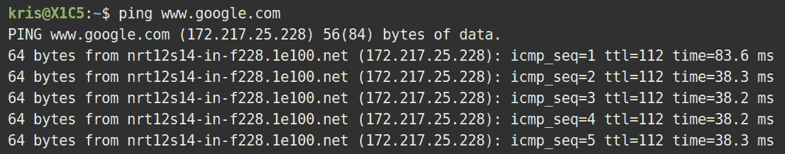
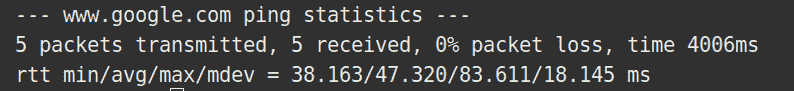

# Ping 定义

> 原文：<https://www.freecodecamp.org/news/ping-definition/>

在计算机科学、网络和游戏中，ping 可以指几种不同的东西。

最常见的 ping 指的是向另一台设备发送数据包或信号并监听响应的行为。这通常是为了测量网络速度，或者确定计算机或服务器的状态。

ping 一词是由 Mike Muuss 在 20 世纪 80 年代初创造的，他选择这个词是因为它与声纳工作和声音的方式相似。穆斯还开发了第一个 ping 程序来诊断网络问题。

默认情况下，所有现代操作系统上都应该安装 ping 程序的一个版本。

要使用 ping，只需打开系统的命令行，键入`ping`，后跟 IP 地址或主机名，然后按回车键。要退出 ping 实用程序，只需按 CTRL + C。

例如，如果您运行`ping www.freecodecamp.org`，您将看到如下内容:

每行显示发出的每个探测或 ping 数据包的信息。一些邮政重要的信息是在该行的末尾。这显示了发送数据包和从其他服务器或计算机接收数据包所用的时间(以毫秒为单位)。

当您停止 ping 实用程序时，您将看到所有 ping 尝试的摘要:

Ping 也可以指网络本身的延迟或响应时间。这个定义通常用于在线游戏，其中 ping 表示游戏客户端(控制台或 PC)和游戏服务器之间的响应时间。

在这种背景下，高 ping (>= 150ms)意味着玩家在游戏中的动作和游戏的响应之间会有较大的延迟。而低 ping(大约 20-50 毫秒)意味着玩家的动作和游戏的响应之间的时间是最小的。