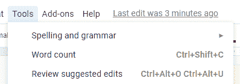
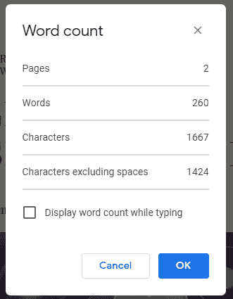
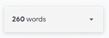
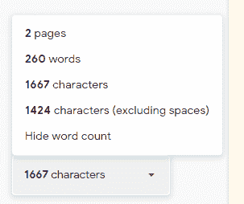

# Google 文档教程中的字数统计——统计 Google 文档或 Word 文件中的字数和字符数

> 原文：<https://www.freecodecamp.org/news/word-count-in-google-docs-tutorial-counting-words-and-characters-in-a-google-doc-or-word-file/>

如果你需要知道谷歌文档中的字数或字符数，使用谷歌文档本身提供的工具很容易找到。

无论是对于谷歌文档还是导入的 Word 文件，它的工作方式都是一样的——我将在这个快速指南中向你展示如何操作。

## 在哪里可以找到谷歌文档中的字数统计工具

你可以在“工具”菜单中找到“字数统计”工具——它是菜单顶部的第二项。或者您可以使用`Ctrl+Shift+C`键盘快捷键。

Tools menu and word count feature.

## 谷歌文档中字数统计的工作原理

字数统计工具显示当前文档的统计数据。所以如果你点击“工具”菜单中的“字数统计”，或者使用键盘快捷键，就会显示你正在处理的文档的统计数据。

它首先显示文档中的页数，然后是字数，然后是字符数，最后是不包括空格的字符数。你可以看到下面的例子:

只需点击“确定”或“取消”关闭窗口。

## 如何让文档的统计数据在页面上始终可见

如果你的目标是在一个文档中有一定数量的单词，你可能想要不断地监控你的单词数——而不必一直重新打开这个工具。

您可以设置它，使统计数据总是在您的当前页面上可见。在字数统计工具中，在所有内容的下方，有一个名为“键入时显示字数”的复选框。如果您选中该框，它将使字数统计出现在文档窗口的右下角，如下所示:

字数其实是一个下拉菜单。您可以单击它来查看所有统计数据，并更改下拉菜单关闭时显示的统计数据。它还为您提供了再次隐藏字数统计工具的选项。

## 结论

使用字数统计工具，谷歌文档可以很容易地显示你文档中的字数、页数和字符数。而且很容易从工具菜单打开它，或者使用`Ctrl+Shift+C`键盘快捷键。