# 如何进行谷歌表单调查——谷歌表单教程

> 原文：<https://www.freecodecamp.org/news/how-to-make-a-google-form-survey-google-forms-tutorial/>

Google Forms 是一个有用的工具，可以让您创建具有各种定制选项的调查。在本指南中，我们将看到制作和定制您自己的 Google 表单的最常见方法。

## 从模板开始

当您准备好创建一个新的调查时，您可以选择从一个空白文档开始，或者从许多可用的模板之一开始。

这些模板分为三类:个人、工作和教育。有现成的可以使用，让您不必自己设计表单，例如，客户反馈表单或派对邀请函。

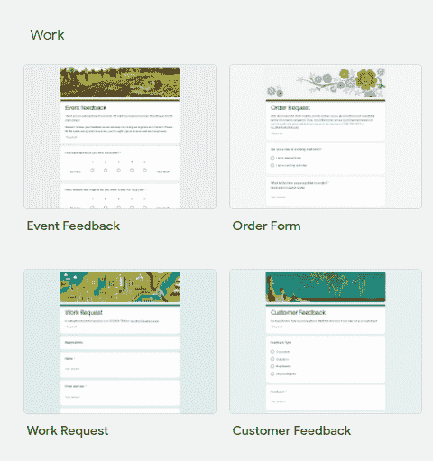

In the image you can see examples of the templates available when creating from a model.

## Google 表单的一般功能

在页面的右上角有一些按钮，可以访问设置和定制选项。

From left to right the buttons are Customize Theme, Preview, Settings, Send, More, Google Account

### 设置

这些设置允许您自定义各种功能，例如

*   是否收集了受访者的电子邮件地址
*   如果回答者可以稍后返回来更改他们的答案
*   如果他们可以多次提交或只提交一次(在这种情况下，回答者必须使用他们的帐户登录)
*   如果它显示进度条，并且
*   如果问题被随机打乱。

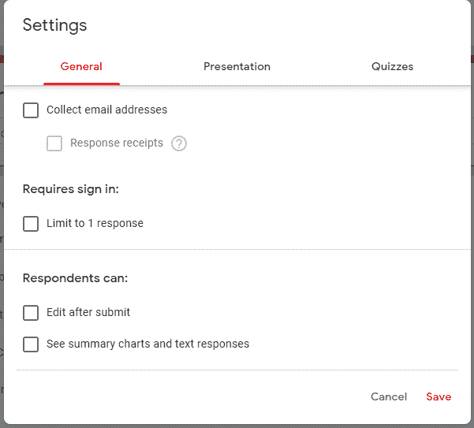

General tab in the Settings with options: Collect email addresses, Limit to 1 response, Edit after submit, See summary charts and text responses.

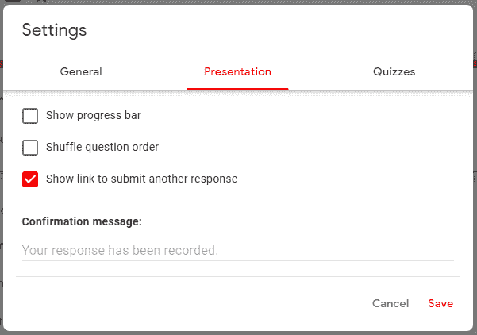

Presentation tab in Settings with options: Show progress bar, Shuffle question order, Show link to submit another response.

### 自定义主题

您还可以使用各种选项自定义模板的主题，如更改表单中使用的主色、背景色和字体。

您还可以添加标题图像，上传一个，或在许多可用选项中进行选择。

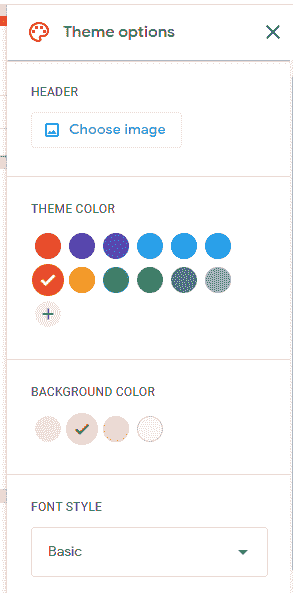

Theme Option menu, with options of changing header image, theme color, background color, font style.

## Google 表单问题和问题类型

您可以使用右侧浮动菜单中的第一个按钮添加新问题。每个问题都可以定制标题和描述(通过问题的三点菜单)，也可以定制图像或视频。

The floating menu, with the Create Question button marked

您还可以根据需要设置每个问题，要求回答某些问题。这样的话，不填那个答案是不可能提交表单的。对于某些问题类型，还可以自定义响应验证。

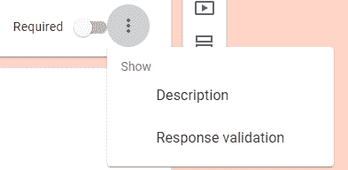

Three dots menu on questions, with Description and Response validation menu items.

有各种可能的问题，我将在下面逐一描述。

### 简答形式问题

简答题允许单行回答。从三点菜单中，可以验证这个答案:

*   作为一个数字，并且还具有允许数字的各种可能的约束，
*   作为文本，约束它是否包含某些内容，
*   作为 URL 或电子邮件地址，
*   使用具有最小或最大长度约束的长度，
*   使用正则表达式，这允许您进行个性化的模式验证(这个 [Google 支持页面上的正则表达式语法](https://support.google.com/a/answer/1371415?hl=en)可能很有用)，

您可以设置自定义错误消息，以便在答案验证失败时显示。

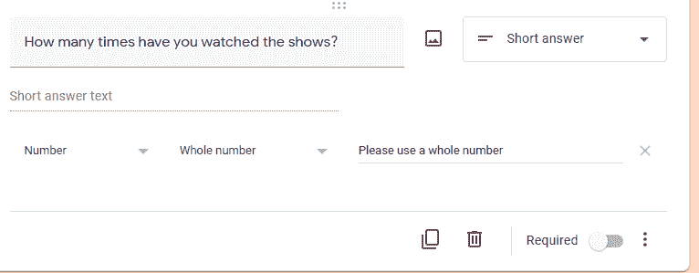

The response is being validated to be a whole number, and a custom error message of "Please use a whole number" will be shown in case the response fails validation.

### 段落形式问题

段落问题允许多行文本回答。它可以用最小或最大长度或正则表达式进行验证，并且您可以设置一个自定义消息来显示验证是否失败。

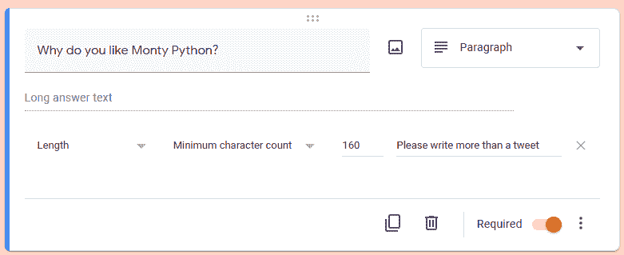

Paragraph form question creation, the response is being validated by length, a minimum character count of 160 characters is required. If the validation fails the message "Please write more than a tweet" is displayed.

### 多项选择、复选框和下拉式表单问题

这三类问题让回答者在多个预先写好的选项中选择。多选或下拉允许选择一个答案，而复选框允许回答者选择多个选项。

多项选择和下拉菜单的区别在于，在下拉菜单中，所有选项都隐藏在菜单中，直到它被选中。在多项选择中，所有选项总是可见的。

复选框和多项选择都允许“其他”选项，回答者可以填写他们想要的内容。在所有这些类型的问题中，选项顺序是可以打乱的。

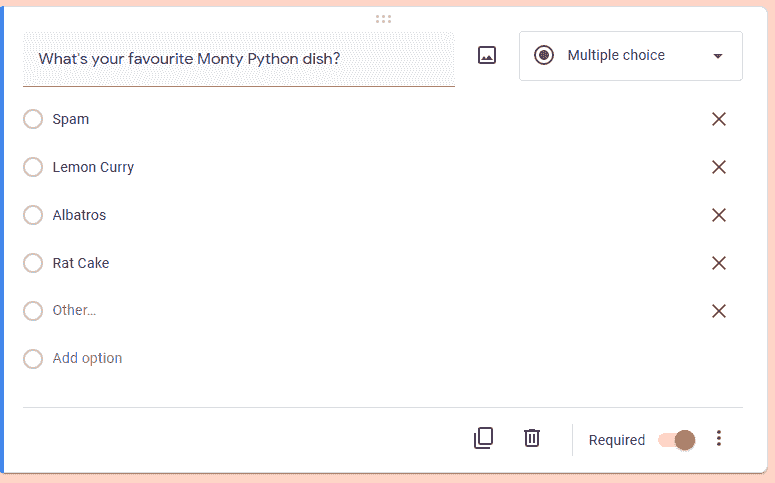

Screenshot of the process of creating a multiple choice question.

### 文件上传表单问题

这些问题允许用户将文件上传到表单所有者的 Google Drive。添加此问题后，回答者必须使用他们的 Google 帐户登录。

对于这类问题，您需要确认您同意让其他人访问您的 Google Drive。

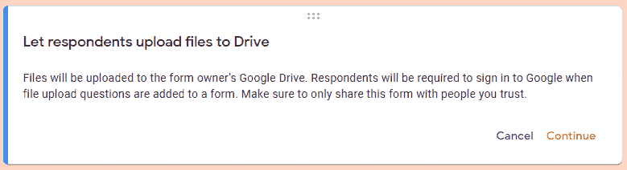

The message that appear when creating a File upload question.

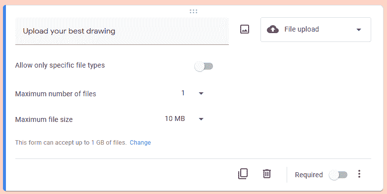

FIle upload question settings.

您可以对可以上传的文件、文件大小以及是否可以一次上传多个文件进行限制。

*   **仅允许特定的文件类型**:打开此选项将允许您选择接受哪些文件类型。

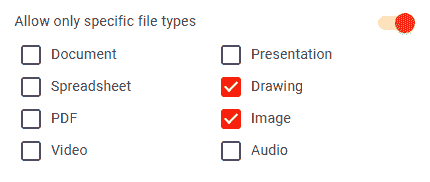

*   **最大文件数量**:此下拉菜单允许您选择一次上传 1、5 到 10 个文件。
*   **最大文件大小**:您可以选择 1 MB、10 MB、100 MB、1 GB、10 GB 的最大文件大小。
*   该表单最多可接受 1 GB 的文件。更改:按下“更改”将调出一个设置区，您可以在这里更改从该表单上传的文件可以占用多少内存。您可以在 1 GB、10 GB、100 GB 和 1 TB 之间选择。一旦达到大小限制，表单将停止接受答案。

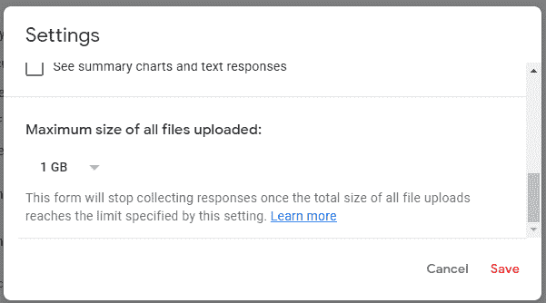

In the General tab of the Settings you can set the maximum size of files collected. This section appear only if this kind of question is present in the form.

### 线性量表形式问题

这类问题从 1 或 0 开始评分，最多 10 分。受访者将在量表上选择一个他们认为最能反映他们想法的点。

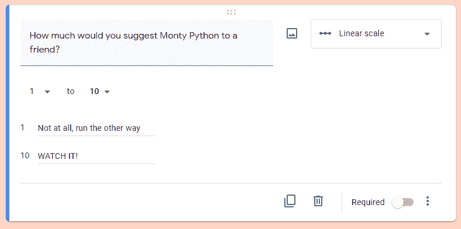

Screenshot of the process of creating a linear scale question.

This is how a linear scale question appears to the respondents.

### 多项选择网格和复选框网格问题

这些问题创建了一个网格，其中每一行都是多项选择或复选框问题。您可以将其设置为要求每行一个响应，和/或将响应者限制为每列一个响应(如果行数多于列数，则不要同时设置两者)。你也可以设置行的顺序来打乱。

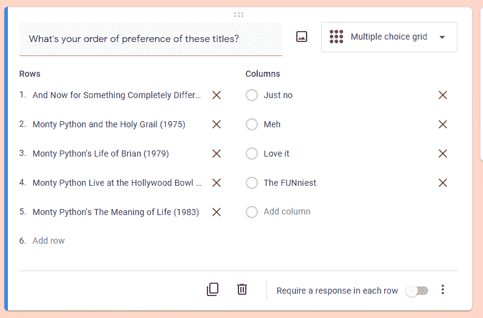

Building a multiple choice grid question.

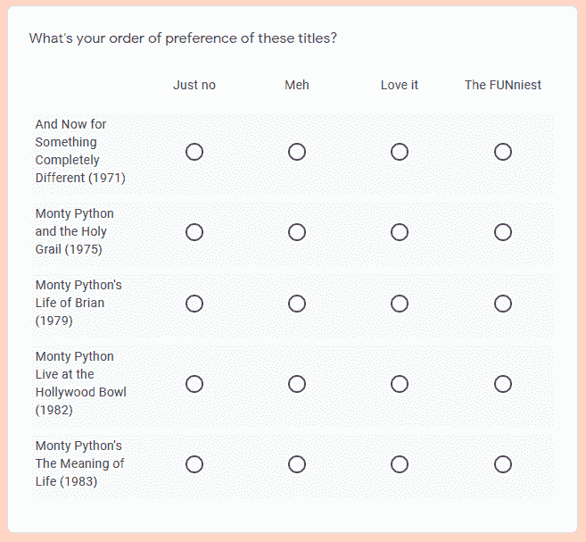

How a multiple choice grid appears to the respondents.

### 日期和时间表单问题

日期型问题将让回答者插入一个日期。有包括或不包括年份、包括或不包括时间的选项。时间类型问题将让回答者插入时间或持续时间。

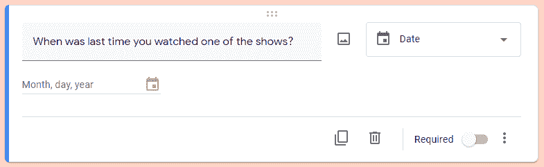

Creating a Date question.

## 如何将表单分成几个部分

可以使用节将表格分成几页，每一节都单独显示给回答者。

您可以从页面右侧浮动菜单中的最后一个按钮创建一个新部分。从节标题附近的“三点”菜单中，您可以复制当前节，将其移动到文档中的另一个位置，或者删除它。您可以使用描述来自定义每个部分。

The floating menu with the New section button marked.

### 如何在各部分之间导航

您可以这样做，在一个部分结束时，回答者将被重定向到不是按顺序排列的下一个部分。

您可以通过部分末尾的下拉菜单进行设置。

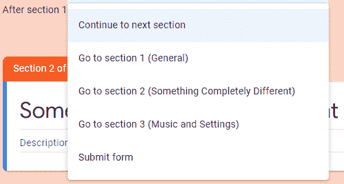

Menu at the end of a section from which you can choose which is the next section.

或者，您可以使用多项选择或下拉式问题的设置，根据所选答案来决定进入哪个部分。如果一个回答者选择了一个具有重定向能力的答案，那就赢得了部分结束选项。

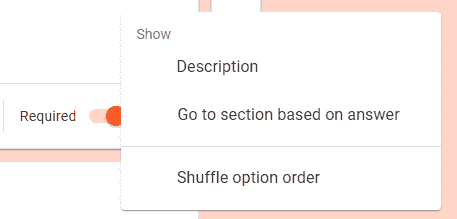

Three dots menu of a question, you can give redirecring powers to the answers from "Go to section based on answer"

如果多个问题具有重定向能力，则最后一个问题决定发生什么重定向(如果问题 2 指示重定向到 C 部分，问题 4 指示重定向到 D 部分，则最后一个问题决定下一个访问的部分是 D 部分)。

## 如何在谷歌表单中显示答案

答案收集在创建表单的同一页面上的第二个选项卡中。可以选择在摘要中查看答案，在“问题”选项卡中按问题查看，或在“个人”选项卡中按回答者查看。

使用 Google 工作表按钮，您可以在工作表中自动更新答案。从三点菜单，更多的答案选项可用，如下载到一个`*.csv`文件，每次提交表格时激活电子邮件通知，或打印答案。

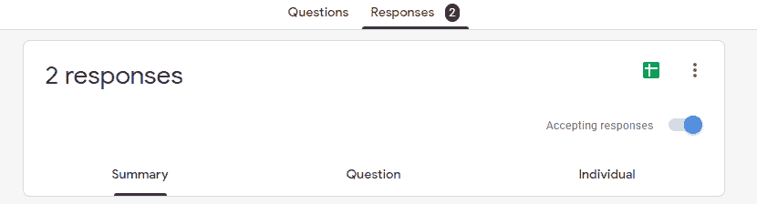

The top of the Responses tab

下图显示了一个选择题的摘要。与“其他”选项一起给出的答案也会出现在侧面的图例中。相同的答案不同的拼写将创建不同的条目，所以它将需要手动计数。

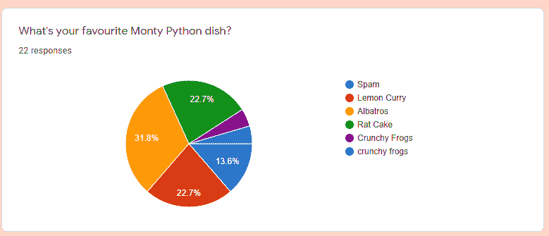

Summary of a multiple choice question, a cake diagram where each slice represents the percentage of respondents choosing that option.

## 其他 Google 表单功能

### 盘问

您可以随时从设置中打开测验模式。这将为每种类型的问题提供更多选项，如自动评分，为每个问题提供分数，以及显示结果的反馈。

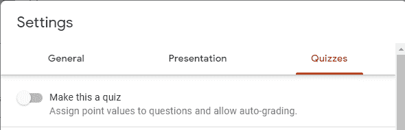

Screenshot of the settings showing the toggle to activate quiz options.

当您使用问题块左下角的“答案”将表格设置为分级测验时，您可以添加分数和问题的正确答案。您还可以设置反馈，向回答者显示他们的测试结果。

### 更加复杂

使用 Google Apps 脚本(三点->脚本编辑器)或附加组件(三点->附加组件)的选项允许您更多地定制表单。

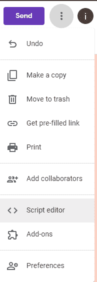

Three dots menu in the upper right corner, the Script editor and Add-ons item menu are near the bottom.

例如，您可以从任何 Google 表单的列中填充多项选择、列表、复选框和网格选项，或者您可以在一定数量的提交后关闭表单。你甚至可以(在测验模式下很有用)在表单中添加一个计时器，或者摄像头人脸识别作为反作弊措施。

## 结论

Google Forms 本身提供了很多定制选项。您可以创建复杂的数据收集调查或复杂的评分测验。随着脚本和附加组件复杂性的增加，几乎没有什么是不可企及的。