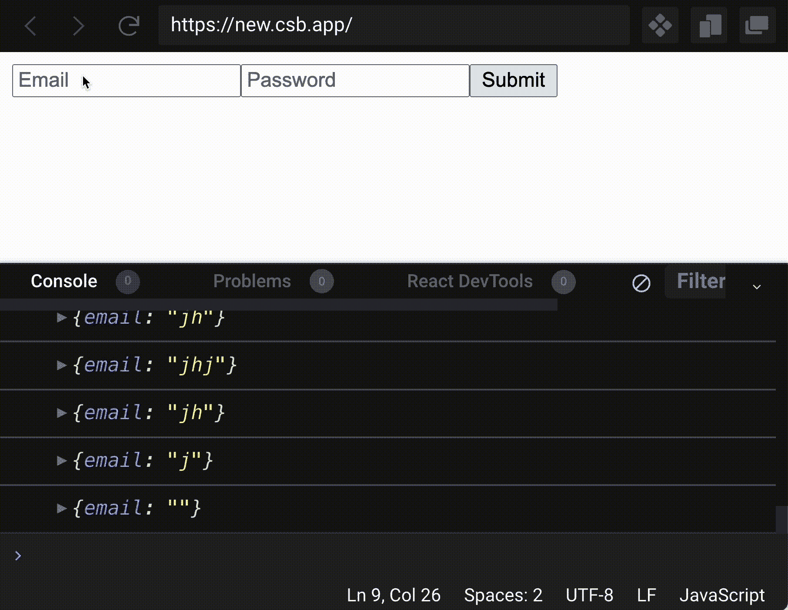
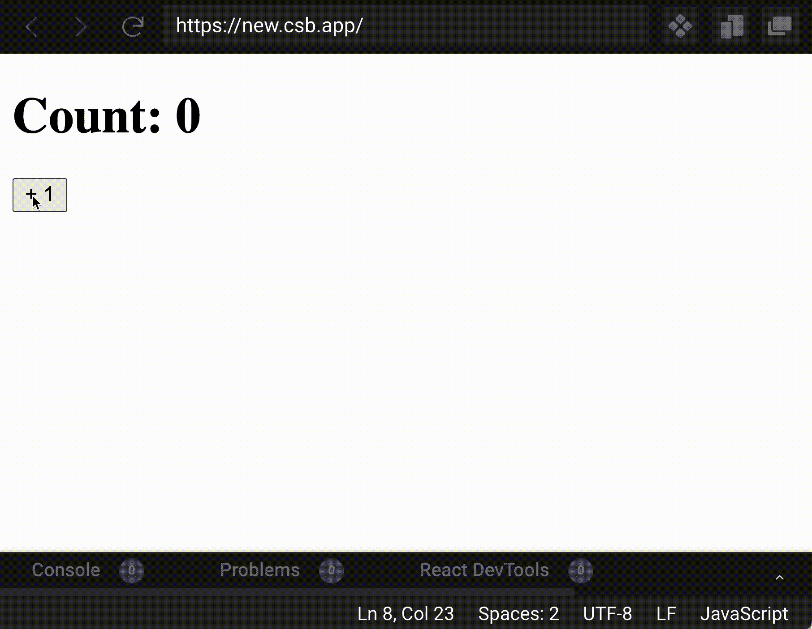

# 每个 React 开发人员应该了解的状态

> 原文：<https://www.freecodecamp.org/news/what-every-react-developer-should-know-about-state/>

每个 React 开发人员需要理解的最重要的概念之一是状态——它是什么，如何正确使用它，以及在构建应用程序时如何避免常见的陷阱。

让我们来看看你需要知道的国家的五个最重要的部分。每一部分都建立在彼此的基础上，有助于你对一个有点复杂的主题的整体理解。

为了使这些抽象的概念尽可能清晰，我已经包含了许多实际的例子，您可以在代码沙箱或您设置的任何 React 项目中运行这些例子。

> 想在最短的时间内成为一名专业的 React 开发人员吗？查看 [**反应训练营**](https://reactbootcamp.com) 。

## 1.不合并带有 useState 的状态更新

许多 React 开发人员在从基于类的组件转移到带有 React 挂钩的功能组件时面临的一个挑战是，使用对象的状态更新不再自动合并。

useState 钩子的一个很大的优点是，我们可以根据需要任意多次调用它，使用任意多的状态变量。

在这个例子中，我们有一个带有电子邮件和密码输入的基本表单。我们将电子邮件和密码状态作为单独的状态变量进行管理:

```
import React from "react";

export default function App() {
  const [email, setEmail] = React.useState("");
  const [password, setPassword] = React.useState("");

  return (
    <form>
      <input
        name="email"
        type="email"
        placeholder="Email"
        onChange={(e) => setEmail(e.target.value)}
      />
      <input
        name="password"
        type="password"
        placeholder="Password"
        onChange={(e) => setPassword(e.target.value)}
      />
      <button type="submit">Submit</button>
    </form>
  );
}
```

让我们改变我们的例子，在单个对象中管理表单状态。这允许我们只调用一次 useState，其中电子邮件和密码不是由单独的状态变量管理，而是作为这个名为`state`的状态变量的属性。

*当它是一个对象时，我们如何用`setState`函数恰当地更新状态？*

如果我们使用一个通用的事件处理程序，它连接到我们表单的每个输入的`onChange`属性，它看起来就像这样:

```
import React from "react";

export default function App() {
  const [state, setState] = React.useState({
    email: '',
    password: ''
  })

  function handleInputChange(e) {
    setState({
      [e.target.name]: e.target.value
    })
  }

  return (
    <form>
      <input
        name="email"
        type="email"
        onChange={handleInputChange}
      />
      <input
        name="password"
        type="password"
        onChange={handleInputChange}
      />
      <button type="submit">Submit</button>
    </form>
  );
}
```

我们现在根据用户当前输入的输入名称来更新 state 中每个输入的值。

这种模式通常用于更新基于类的组件中的状态，但这不适用于 useState 挂钩。使用 useState 的`setState`函数的状态更新不会自动合并。

*这是什么意思？*

这意味着每当我们在用户输入时设置状态，以前的状态不会包含在新状态中。如果我们在输入表单时记录新更新的状态，我们会看到以下内容:



由于以前的状态不会自动合并到新的状态对象中，因此我们必须使用对象扩展操作符手动合并状态对象及其以前的属性:

```
import React from "react";

export default function App() {
  const [state, setState] = React.useState({
    email: '',
    password: ''
  })

  function handleInputChange(e) {
    setState({
      // spread in previous state with object spread operator
      ...state,
      [e.target.name]: e.target.value
    })
  }

  return (
    <form>
      <input
        name="email"
        type="email"
        onChange={handleInputChange}
      />
      <input
        name="password"
        type="password"
        onChange={handleInputChange}
      />
      <button type="submit">Submit</button>
    </form>
  );
}
```

对于 useState 挂钩，我们可以灵活地管理多个原始值或使用具有多个属性的对象。

但是，如果对对象使用 State，请记住在执行任何更新时扩展前一个状态，以确保它被正确更新。

## 2.状态挂钩会触发重新渲染，useRef 不会

反应状态与渲染组件有着非常重要的关系。

每当我们从一个 React 组件返回 JSX 时，当该组件被使用时，它将被呈现并显示在我们的应用程序中。React 负责这个渲染过程。

如果我们的组件使用任何状态，我们必须理解它需要被再次呈现——也就是重新呈现——以响应任何状态更新。

为什么组件在状态更新时需要重新渲染？

因为如果我们在更新状态时不重新呈现，我们将无法显示新数据。这是非常简单的表达，当我们在 JSX 中展示一个状态变量中包含的任何状态时。

如果每当我们对该变量进行更改时，它没有重新呈现，更新就不会显示。

这似乎是一个相当简单的概念，但你需要理解的是**每当我们更新状态，** **它不仅会导致直接管理状态的组件中的重新呈现-它还会导致所有子组件中的重新呈现**。

为什么这很重要？因为在某些情况下，我们可能不希望子组件重新呈现来响应父组件重新呈现。

这样的例子有哪些？假设我们有一个应用程序，用户可以输入一个通过状态管理其值的输入。这个应用程序还有另一个显示数据列表的组件。

每当用户在输入中键入内容时，我们的状态都会更新，这导致在另一个子组件中出现不必要的重新呈现。

我们解决这个问题的方法是借助于`React.memo`函数，它有助于防止我们的组件在父组件重新渲染时被重新渲染:

```
export default function App() {
  const [skill, setSkill] = React.useState("");
  const [skills, setSkills] = React.useState(["HTML", "CSS", "JavaScript"]);

  function handleChangeInput(event) {
    setSkill(event.target.value);
  }

  function handleAddSkill() {
    setSkills(skills.concat(skill));
  }

  return (
    <>
      <input onChange={handleChangeInput} />
      <button onClick={handleAddSkill}>Add Skill</button>
      <SkillList skills={skills} />
    </>
  );
}

/* But the problem, if you run this code yourself, is that when we type into the input, because the parent component of SkillList (App) re-renders, due to the state being updated on every keystroke, the SkillList is rerendered constantly (as indicated by the console.log) */

/* However, once we wrap the SkillList component in React.memo (which is a higher-order function, meaning it accepts a function as an argument), it no longer re-renders unnecessarily when our parent component does. */
const SkillList = React.memo(({ skills }) => {
  console.log("rerendering");
  return (
    <ul>
      {skills.map((skill, i) => (
        <li key={i}>{skill}</li>
      ))}
    </ul>
  );
});
```

这里要注意的另一件事是，从技术上讲，有一种方法可以管理状态，而不会导致重新渲染。我们可以用一个大多数人不认为是有状态 React 钩子的钩子来做这件事。

useRef 可以用来存储它的`.current`属性的任何值。换句话说，如果我们想用 useRef 制作一个简单的计数器，并更新我们存储在其上的计数值，即使我们更新了它的值，它也不会在初始渲染后显示正确的计数，因为这样做不会触发重新渲染:

```
import React from "react";

export default function App() {
  const countRef = React.useRef(0);

  function handleAddOne() {
    countRef.current += 1;
  }

  return (
    <>
      <h1>Count: {countRef.current}</h1>

      {/* clicking this will not change display count */}
      <button onClick={handleAddOne}>+ 1</button>
    </>
  );
}
```

## 3.状态更新应该是不可变的

React 中状态的一个非常重要的部分是它必须以正确的方式更新和管理。

当使用 useState 钩子管理状态时，我们必须*仅*使用专用的 setter 函数，作为从 useState 返回的数组中的第二个元素来更新它。如果我们不这样做，并试图手动更新它，例如在普通 JavaScript 的帮助下，我们的应用程序将不会像我们预期的那样工作。

这一点与我们之前提出的观点密切相关:状态，当正确更新*时，会导致组件的重新呈现。*

*如果我们试图用我们自己的方式而不是“反应”的方式更新状态，你认为会发生什么？*

*同样，React 负责在发生变化时正确显示和呈现组件。如果我们不使用 React，那么我们不能期望我们的应用程序反映我们对状态所做的任何改变。*

*换句话说，**如果我们用普通 JavaScript 而不是`setState`更新状态，它不会触发重新渲染，React 也不会向用户显示那些(无效的)状态变化。***

*这是一个需要记住的简单但至关重要的教训。*

*我们必须知道如何使用 React 更新状态，并为我们的目的选择合适的状态钩子。我们可能会选择`useReducer`、`useState`，或者像 Redux 这样的第三方状态管理库。*

*不管我们在状态管理中的选择如何，我们必须以适当的方式更新状态，而不是试图直接更新或改变它。*

*除了我们的 React 应用程序不能正常工作之外，另一个原因是它违反了 React 的核心原则。这就是**不变性**的概念。*

*状态更新应该总是不可变的。这意味着我们不应该对存储在状态变量中的数据进行修改或变异。这样做会使我们的状态变得不可预测，并可能在我们的应用程序中导致难以调试的意外问题。*

```
*`import React from 'react';

export default function App() {
  const [count, setCount] = React.useState(0);

  // Don't assign state to new (non-state) variables
  const newCount = count;
  // Don't directly mutate state
  const countPlusOne = count + 1;

  return (
    <>
      <h1>Count: {count}</h1>
    </>
  );
}`*
```

*除了不直接改变状态变量之外，确保不要将状态变量赋给其他(非状态)变量。*

## *4.状态更新是异步的和预定的*

*关于状态更新，需要知道的一个重要教训是，它们不是立即执行的。*

*如果我们看一下 React 文档，看看当我们调用`setState`函数时到底发生了什么，就可以看出这一点。我们用它来更新与之相关的状态变量，但是我们也被告知:*

> *它接受一个新的状态值，并对组件的重新呈现进行排队。*

*“入队”这个词是什么意思？*

*换句话说，它不会立即重新渲染组件。它并没有在我们更新状态那一行停止我们的代码，而是发生在未来的某个时刻。这是为了提高性能，让我们更好地了解 React 在做什么。*

*基于这些信息，当我们试图更新状态时，我们需要改变我们的心理模型:**`setState`函数并不立即更新状态，它只是计划在未来的某个时间进行状态更新。**之后，React 会计算出状态更新发生的时间。*

*因此，仅仅能够查看我们的代码并准确了解状态更新发生或将要发生的时间并不容易。*

*与`useRef`相比，这一点很重要，我们之前提到过，T0 能够在其当前属性中保存数据。使用 useRef 进行的任何更新都是同步执行的——我们可以查看我们的代码，并准确地看到给定的更新是何时在`useRef`中执行的，但使用 useState 则不行。*

## *5.闭包可能会出现陈旧状态*

*最后，React 状态可能出现的一个重要问题是陈旧状态问题。*

### *React 中的陈旧状态是什么？*

*陈旧状态是每当我们试图更新状态时都会出现的问题，通常是在一个闭包内。*

> *闭包是 JavaScript 中的一种函数，我们使用外部作用域中的变量。*

*陈旧状态的问题是基于这样一个事实，即闭包可能无法捕获最新的状态变量值。这就是我们所说的陈旧，我们的意思是它是旧的，而不是我们想要的当前值。*

*陈旧状态的问题与我们讨论的主题密切相关，即先前的状态更新主题是异步的。*

*在许多情况下，异步状态更新的一个问题是，我们并不总是获得正确的先前状态值，特别是当我们试图根据先前的值更新状态时。*

*我们可以在一个简单的计数器应用程序中表达陈旧闭包的问题，该应用程序使用`setTimeout`函数在一秒钟后更新计数。*

*因为 setTimeout 创建了一个闭包，所以当我们调用`setCount`时，我们访问的是状态变量`count`的一个陈旧值。*

```
*`import React from 'react';

export default function App() {
  const [count, setCount] = React.useState(0);

  function delayAddOne() {
    setTimeout(() => {
      setCount(count + 1);
    }, 1000);
  }

  return (
    <>
      <h1>Count: {count}</h1>
      <button onClick={delayAddOne}>+ 1</button>
    </>
  );
}`*
```

*当我们运行我们的应用程序时，问题就很明显了。尽管多次单击该按钮，它仍然每秒钟只增加 1:*

**

*我们可以通过使用一种更可靠的更新状态的方法来解决闭包内陈旧状态的问题。状态更新仍将被调度，但是它将使得可靠地获得先前的状态值成为可能。*

*我们通过为`setState`函数提供一个内部函数来实现这一点。在函数体中，我们可以在这个函数的参数中获得前一个状态，然后返回我们希望的下一个状态。*

*在我们的例子中，它将是前一个计数值加 1:*

```
*`import React from 'react';

export default function App() {
  const [count, setCount] = React.useState(0);

  function delayAddOne() {
    setTimeout(() => {
      // stale state problem goes away using inner function
      setCount(prevCount => prevCount + 1);
    }, 1000);
  }

  return (
    <div>
      <h1>Count: {count}</h1>
      <button onClick={delayAddOne}>+ 1</button>
    </div>
  );
}`*
```

> *如果你看一下 React 文档，另一件有趣的事情是，如果这个函数没有返回任何东西，那么无论如何都不会发生重新渲染。*

*一旦我们将这个内部函数提供给`setState`来可靠地获取之前的状态并从我们的函数返回新的状态，由于我们的闭包而导致的陈旧状态问题就消失了。*

## *喜欢这篇文章吗？加入 React 训练营*

 ***[React 训练营](http://bit.ly/join-react-bootcamp)** 将你应该知道的关于学习 React 的一切打包成一个全面的包，包括视频、备忘单，外加特殊奖励。

获得数百名开发人员已经使用的内部信息，以掌握 React、找到他们梦想的工作并掌控他们的未来:

[](http://bit.ly/join-react-bootcamp) 
*打开时点击此处通知**