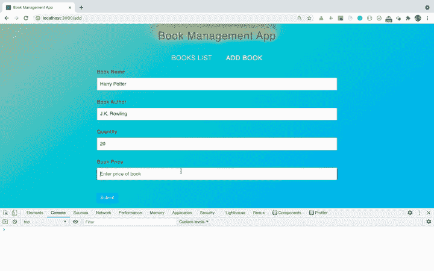
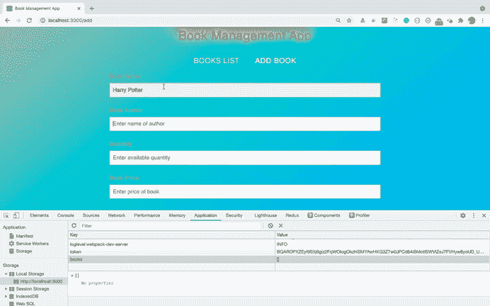
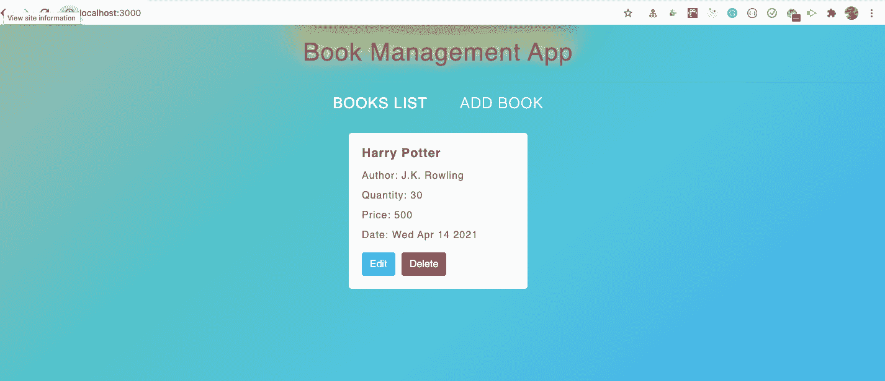
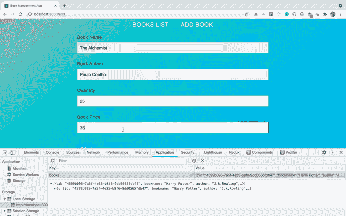
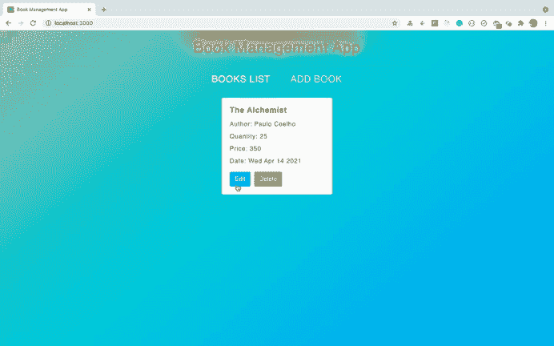
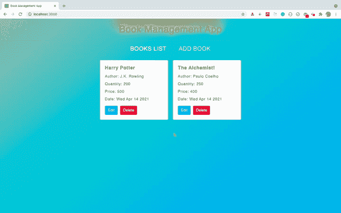

# React CRUD 应用教程——如何在 React 中从头开始构建图书管理应用

> 原文：<https://www.freecodecamp.org/news/react-crud-app-how-to-create-a-book-management-app-from-scratch/>

在本文中，您将从头开始在 React 中构建一个图书管理应用程序。

通过创建此应用程序，您将了解到:

1.  如何执行 CRUD 操作
2.  如何使用 React 路由器在路由之间导航
3.  如何使用 React 上下文 API 跨路由传递数据
4.  如何在 React 中创建自定义钩子
5.  如何在本地存储中存储数据，以便即使在页面刷新后也能持久存储数据
6.  如何使用自定义钩子管理存储在本地存储器中的数据

还有更多。

我们将使用 React 钩子来构建这个应用程序。因此，如果你是 React Hooks 的新手，可以看看我的[React Hooks 简介](https://levelup.gitconnected.com/an-introduction-to-react-hooks-50281fd961fe?source=friends_link&sk=89baff89ec8bc637e7c13b7554904e54)文章来学习基础知识。

> 想从绝对开始学 Redux，从零开始打造一款订餐 app？查看[掌握 Redux](https://master-redux.yogeshchavan.dev/) 课程。

## 初始设置

使用`create-react-app`创建一个新项目:

```
npx create-react-app book-management-app 
```

项目创建完成后，删除`src`文件夹中的所有文件，并在`src`文件夹中创建`index.js`和`styles.scss`文件。同样，在`src`文件夹中创建`components`、`context`、`hooks`和`router`文件夹。

安装必要的依赖项:

```
yarn add bootstrap@4.6.0 lodash@4.17.21 react-bootstrap@1.5.2 node-sass@4.14.1 react-router-dom@5.2.0 uuid@8.3.2 
```

打开`styles.scss`，将[中的内容添加到这里的](https://github.com/myogeshchavan97/react-book-management-app/blob/master/src/styles.scss)中。

## 如何创建初始页面

在`components`文件夹中创建一个新文件`Header.js`，内容如下:

```
import React from 'react';
import { NavLink } from 'react-router-dom';

const Header = () => {
  return (
    <header>
      <h1>Book Management App</h1>
      <hr />
      <div className="links">
        <NavLink to="/" className="link" activeClassName="active" exact>
          Books List
        </NavLink>
        <NavLink to="/add" className="link" activeClassName="active">
          Add Book
        </NavLink>
      </div>
    </header>
  );
};

export default Header; 
```

这里，我们使用`react-router-dom`的`NavLink`组件添加了两个导航链接:一个查看所有书籍的列表，另一个添加一本新书。

我们使用`NavLink`代替锚标签(`<a />`)，这样当用户点击任何链接时，页面都不会刷新。

在`components`文件夹中创建一个名为`BooksList.js`的新文件，内容如下:

```
import React from 'react';

const BooksList = () => {
  return <h2>List of books</h2>;
};

export default BooksList; 
```

在`components`文件夹中创建一个名为`AddBook.js`的新文件，内容如下:

```
import React from 'react';
import BookForm from './BookForm';

const AddBook = () => {
  const handleOnSubmit = (book) => {
    console.log(book);
  };

  return (
    <React.Fragment>
      <BookForm handleOnSubmit={handleOnSubmit} />
    </React.Fragment>
  );
};

export default AddBook; 
```

在这个文件中，我们显示了一个`BookForm`组件(我们还没有创建它)。

对于`BookForm`组件，我们传递了`handleOnSubmit`方法，这样我们可以在提交表单后做一些处理。

现在，在`components`文件夹中创建一个新文件`BookForm.js`，内容如下:

```
import React, { useState } from 'react';
import { Form, Button } from 'react-bootstrap';
import { v4 as uuidv4 } from 'uuid';

const BookForm = (props) => {
  const [book, setBook] = useState({
    bookname: props.book ? props.book.bookname : '',
    author: props.book ? props.book.author : '',
    quantity: props.book ? props.book.quantity : '',
    price: props.book ? props.book.price : '',
    date: props.book ? props.book.date : ''
  });

  const [errorMsg, setErrorMsg] = useState('');
  const { bookname, author, price, quantity } = book;

  const handleOnSubmit = (event) => {
    event.preventDefault();
    const values = [bookname, author, price, quantity];
    let errorMsg = '';

    const allFieldsFilled = values.every((field) => {
      const value = `${field}`.trim();
      return value !== '' && value !== '0';
    });

    if (allFieldsFilled) {
      const book = {
        id: uuidv4(),
        bookname,
        author,
        price,
        quantity,
        date: new Date()
      };
      props.handleOnSubmit(book);
    } else {
      errorMsg = 'Please fill out all the fields.';
    }
    setErrorMsg(errorMsg);
  };

  const handleInputChange = (event) => {
    const { name, value } = event.target;
    switch (name) {
      case 'quantity':
        if (value === '' || parseInt(value) === +value) {
          setBook((prevState) => ({
            ...prevState,
            [name]: value
          }));
        }
        break;
      case 'price':
        if (value === '' || value.match(/^\d{1,}(\.\d{0,2})?$/)) {
          setBook((prevState) => ({
            ...prevState,
            [name]: value
          }));
        }
        break;
      default:
        setBook((prevState) => ({
          ...prevState,
          [name]: value
        }));
    }
  };

  return (
    <div className="main-form">
      {errorMsg && <p className="errorMsg">{errorMsg}</p>}
      <Form onSubmit={handleOnSubmit}>
        <Form.Group controlId="name">
          <Form.Label>Book Name</Form.Label>
          <Form.Control
            className="input-control"
            type="text"
            name="bookname"
            value={bookname}
            placeholder="Enter name of book"
            onChange={handleInputChange}
          />
        </Form.Group>
        <Form.Group controlId="author">
          <Form.Label>Book Author</Form.Label>
          <Form.Control
            className="input-control"
            type="text"
            name="author"
            value={author}
            placeholder="Enter name of author"
            onChange={handleInputChange}
          />
        </Form.Group>
        <Form.Group controlId="quantity">
          <Form.Label>Quantity</Form.Label>
          <Form.Control
            className="input-control"
            type="number"
            name="quantity"
            value={quantity}
            placeholder="Enter available quantity"
            onChange={handleInputChange}
          />
        </Form.Group>
        <Form.Group controlId="price">
          <Form.Label>Book Price</Form.Label>
          <Form.Control
            className="input-control"
            type="text"
            name="price"
            value={price}
            placeholder="Enter price of book"
            onChange={handleInputChange}
          />
        </Form.Group>
        <Button variant="primary" type="submit" className="submit-btn">
          Submit
        </Button>
      </Form>
    </div>
  );
};

export default BookForm; 
```

让我们明白我们在这里做什么。

最初，我们将状态定义为一个对象，使用`useState`钩子来存储所有输入的细节，如下所示:

```
const [book, setBook] = useState({
    bookname: props.book ? props.book.bookname : '',
    author: props.book ? props.book.author : '',
    quantity: props.book ? props.book.quantity : '',
    price: props.book ? props.book.price : '',
    date: props.book ? props.book.date : ''
  }); 
```

因为我们将使用相同的`BookForm`组件来添加和编辑图书，所以我们首先检查是否使用三元运算符传递了`book`属性。

如果属性被传递，我们将它设置为传递的值，否则为空字符串(`''`)。

> 现在看起来复杂也不用担心。一旦我们构建了一些初始功能，你会更好地理解它。

然后，我们添加了一个显示错误消息的状态，并使用 ES6 析构语法来引用状态中的每个属性，如下所示:

```
const [errorMsg, setErrorMsg] = useState('');
const { bookname, author, price, quantity } = book; 
```

从`BookForm`组件中，我们返回一个表单，在其中输入书名、作者、数量和价格。我们使用 [react-bootstrap](https://react-bootstrap.github.io/) 框架以一种良好的格式显示表单。

每个输入字段都添加了一个调用`handleInputChange`方法的`onChange`处理程序。

在`handleInputChange`方法中，我们添加了一个 switch 语句，根据输入字段的变化来改变状态的值。

当我们在`quantity`输入字段中输入任何内容时，`event.target.name`将会是`quantity`，因此第一个开关大小写将会匹配。在 switch 案例中，我们检查输入的值是否是一个不带小数点的整数。

如果是，那么我们只更新状态，如下所示:

```
if (value === '' || parseInt(value) === +value) {
  setBook((prevState) => ({
    ...prevState,
    [name]: value
  }));
} 
```

因此用户不能为数量输入字段输入任何十进制值。

对于`price`开关的情况，我们检查小数点后只有两位数的十进制数。所以我们添加了一个正则表达式检查，如下所示:`value.match(/^\d{1,}(\.\d{0,2})?$/)`。

如果价格值与正则表达式匹配，那么我们才更新状态。

**注意:**对于`quantity`和`price`两种切换情况，我们还会检查空值，比如:`value === ''`。这是为了允许用户在需要时完全删除输入的值。

没有该检查，用户将不能通过按`Ctrl + A + Delete`删除输入的值。

对于所有其他输入字段，将执行默认的切换情况，这将根据用户输入的值更新状态。

接下来，一旦我们提交了表单，就会调用`handleOnSubmit`方法。

在这个方法中，我们首先检查用户是否已经使用`every`数组方法输入了所有细节:

```
const allFieldsFilled = values.every((field) => {
  const value = `${field}`.trim();
  return value !== '' && value !== '0';
}); 
```

`every`数组方法是 JavaScript 中最有用的数组方法之一。

> 点击这里查看我的文章，了解最有用的 JavaScript 数组方法及其浏览器支持。

如果所有的值都被填入，那么我们就创建了一个包含所有填入值的对象。我们还通过将 book 作为参数传递来调用`handleOnSubmit`方法，否则我们将设置一个错误消息。

`handleOnSubmit`方法作为道具从`AddBook`组件传递。

```
if (allFieldsFilled) {
  const book = {
    id: uuidv4(),
    bookname,
    author,
    price,
    quantity,
    date: new Date()
  };
  props.handleOnSubmit(book);
} else {
  errorMsg = 'Please fill out all the fields.';
} 
```

注意，为了创建一个惟一的 ID，我们从 [uuid](https://www.npmjs.com/package/uuid) npm 包中调用了`uuidv4()`方法。

现在，在`router`文件夹中创建一个新文件`AppRouter.js`，内容如下:

```
import React from 'react';
import { BrowserRouter, Switch, Route } from 'react-router-dom';
import Header from '../components/Header';
import AddBook from '../components/AddBook';
import BooksList from '../components/BooksList';

const AppRouter = () => {
  return (
    <BrowserRouter>
      <div>
        <Header />
        <div className="main-content">
          <Switch>
            <Route component={BooksList} path="/" exact={true} />
            <Route component={AddBook} path="/add" />
          </Switch>
        </div>
      </div>
    </BrowserRouter>
  );
};

export default AppRouter; 
```

这里，我们已经使用`react-router-dom`库为各种组件设置了路由，比如`BooksList`和`AddBook`。

> 如果你是 React 路由器的新手，请查看我的免费 [React 路由器介绍](https://yogeshchavan1.podia.com/react-router-introduction)课程。

现在，打开`src/index.js`文件，在其中添加以下内容:

```
import React from 'react';
import ReactDOM from 'react-dom';
import AppRouter from './router/AppRouter';
import 'bootstrap/dist/css/bootstrap.min.css';
import './styles.scss';

ReactDOM.render(<AppRouter />, document.getElementById('root')); 
```

现在，通过从终端运行以下命令来启动 React 应用程序:

```
yarn start 
```

当您在 [http://localhost:3000/](http://localhost:3000/) 访问应用程序时，您将看到以下屏幕。



如您所见，我们能够正确地添加图书并将其显示在控制台上。

但是，让我们将它添加到本地存储，而不是登录控制台。

## 如何为本地存储创建自定义挂钩

本地存储是惊人的。它允许我们在浏览器中轻松地存储应用程序数据，并且是存储数据的 cookies 的替代方案。

使用本地存储的优点是，数据将永久保存在浏览器缓存中，直到我们手动删除它，这样即使在刷新页面后我们也可以访问它。您可能知道，一旦我们刷新页面，存储在 React 状态中的数据将会丢失。

本地存储有许多用例，其中之一是存储购物车商品，这样即使我们刷新页面，它们也不会被删除。

为了将数据添加到本地存储，我们通过提供一个键和值来使用`setItem`方法:

```
localStorage.setItem(key, value) 
```

> 键和值都必须是字符串。但是我们也可以使用`JSON.stringify`方法来存储 JSON 对象。

要详细了解本地存储及其各种应用，请查看本文。

在`hooks`文件夹中创建一个新文件`useLocalStorage.js`，内容如下:

```
import { useState, useEffect } from 'react';

const useLocalStorage = (key, initialValue) => {
  const [value, setValue] = useState(() => {
    try {
      const localValue = window.localStorage.getItem(key);
      return localValue ? JSON.parse(localValue) : initialValue;
    } catch (error) {
      return initialValue;
    }
  });

  useEffect(() => {
    window.localStorage.setItem(key, JSON.stringify(value));
  }, [key, value]);

  return [value, setValue];
};

export default useLocalStorage; 
```

这里，我们使用了一个接受一个`key`和`initialValue`的`useLocalStorage`钩子。

为了使用`useState`钩子声明状态，我们使用了[惰性初始化](https://reactjs.org/docs/hooks-reference.html#lazy-initial-state)。

因此，传递给`useState`的函数中的代码将只执行一次，即使在应用程序的每次重新呈现中多次调用`useLocalStorage`钩子。

因此，最初我们用提供的`key`检查本地存储中是否有任何值，并通过使用`JSON.parse`方法解析它来返回值:

```
try {
  const localValue = window.localStorage.getItem(key);
  return localValue ? JSON.parse(localValue) : initialValue;
} catch (error) {
  return initialValue;
} 
```

然后，如果`key`或`value`有任何变化，我们将更新本地存储:

```
useEffect(() => {
    window.localStorage.setItem(key, JSON.stringify(value));
}, [key, value]);

return [value, setValue]; 
```

然后，我们返回存储在本地存储中的`value`和我们将调用来更新本地存储数据的`setValue`函数。

## 如何使用本地存储挂钩

现在，让我们使用这个`useLocalStorage`钩子，这样我们就可以在本地存储器中添加或删除数据。

打开`AppRouter.js`文件，使用组件内的`useLocalStorage`钩子:

```
import useLocalStorage from '../hooks/useLocalStorage';

const AppRouter = () => {
 const [books, setBooks] = useLocalStorage('books', []);

 return (
  ...
 )
} 
```

现在，我们需要将`books`和`setBooks`作为道具传递给`AddBook`组件，这样我们就可以将书添加到本地存储中。

因此，从以下代码开始更改路线:

```
<Route component={AddBook} path="/add" /> 
```

到下面的代码:

```
<Route
  render={(props) => (
    <AddBook {...props} books={books} setBooks={setBooks} />
  )}
  path="/add"
/> 
```

这里，我们使用 render props 模式来传递 React router 传递的默认属性以及`books`和`setBooks`。

> 查看我的免费 [React 路由器介绍](https://yogeshchavan1.podia.com/react-router-introduction)课程，以更好地理解这个渲染道具模式以及使用`render`关键字而不是`component`的重要性。

您的整个`AppRouter.js`文件现在将看起来像这样:

```
import React from 'react';
import { BrowserRouter, Switch, Route } from 'react-router-dom';
import Header from '../components/Header';
import AddBook from '../components/AddBook';
import BooksList from '../components/BooksList';
import useLocalStorage from '../hooks/useLocalStorage';

const AppRouter = () => {
  const [books, setBooks] = useLocalStorage('books', []);

  return (
    <BrowserRouter>
      <div>
        <Header />
        <div className="main-content">
          <Switch>
            <Route component={BooksList} path="/" exact={true} />
            <Route
              render={(props) => (
                <AddBook {...props} books={books} setBooks={setBooks} />
              )}
              path="/add"
            />
          </Switch>
        </div>
      </div>
    </BrowserRouter>
  );
};

export default AppRouter; 
```

现在打开`AddBook.js`，用下面的代码替换它的内容:

```
import React from 'react';
import BookForm from './BookForm';

const AddBook = ({ history, books, setBooks }) => {
  const handleOnSubmit = (book) => {
    setBooks([book, ...books]);
    history.push('/');
  };

  return (
    <React.Fragment>
      <BookForm handleOnSubmit={handleOnSubmit} />
    </React.Fragment>
  );
};

export default AddBook; 
```

首先，我们使用 ES6 析构语法来访问组件中的`history`、`books`和`setBooks`属性。

React 路由器自动将`history`属性传递给`<Route />`中提到的每个组件。我们正在传递来自`AppRouter.js`文件的`books`和`setBooks`道具。

我们将所有添加的书籍存储在一个数组中。在`handleOnSubmit`方法中，我们通过传递一个数组来调用`setBooks`函数，首先添加一个新添加的书，然后将所有已经添加的书传播到`books`数组中，如下所示:

```
setBooks([book, ...books]); 
```

在这里，我首先添加新添加的`book`，然后扩展已经添加的`books`，因为我希望当我们稍后显示图书列表时，最新的图书首先显示。

但是如果你愿意，你可以这样改变顺序:

```
setBooks([...books, book]); 
```

这会将新添加的图书添加到所有已添加图书的末尾。

我们能够使用 spread 运算符，因为我们知道`books`是一个数组(因为我们已经在如下所示的`AppRouter.js`文件中将它初始化为一个空数组`[]`):

```
 const [books, setBooks] = useLocalStorage('books', []); 
```

然后，一旦通过调用`setBooks`方法将书添加到本地存储，在`handleOnSubmit`方法中，我们使用`history.push`方法将用户重定向到`Books List`页面:

```
history.push('/'); 
```

现在，让我们检查一下我们是否能够将书籍保存到本地存储。



正如你所看到的，这本书被正确地添加到本地存储中(你可以在 Chrome dev tools 的 applications 选项卡中确认这一点)。

## 如何在用户界面上显示添加的图书

现在，让我们在 UI 上的`Books List`菜单下显示添加的书籍。

打开`AppRouter.js`，将`books`和`setBooks`作为道具传递给`BooksList`组件。

您的`AppRouter.js`文件现在看起来像这样:

```
import React from 'react';
import { BrowserRouter, Switch, Route } from 'react-router-dom';
import Header from '../components/Header';
import AddBook from '../components/AddBook';
import BooksList from '../components/BooksList';
import useLocalStorage from '../hooks/useLocalStorage';

const AppRouter = () => {
  const [books, setBooks] = useLocalStorage('books', []);

  return (
    <BrowserRouter>
      <div>
        <Header />
        <div className="main-content">
          <Switch>
            <Route
              render={(props) => (
                <BooksList {...props} books={books} setBooks={setBooks} />
              )}
              path="/"
              exact={true}
            />
            <Route
              render={(props) => (
                <AddBook {...props} books={books} setBooks={setBooks} />
              )}
              path="/add"
            />
          </Switch>
        </div>
      </div>
    </BrowserRouter>
  );
};

export default AppRouter; 
```

这里，我们只是改变了与`BooksList`组件相关的第一条路线。

现在，在`components`文件夹中创建一个新文件`Book.js`，内容如下:

```
import React from 'react';
import { Button, Card } from 'react-bootstrap';

const Book = ({
  id,
  bookname,
  author,
  price,
  quantity,
  date,
  handleRemoveBook
}) => {
  return (
    <Card style={{ width: '18rem' }} className="book">
      <Card.Body>
        <Card.Title className="book-title">{bookname}</Card.Title>
        <div className="book-details">
          <div>Author: {author}</div>
          <div>Quantity: {quantity} </div>
          <div>Price: {price} </div>
          <div>Date: {new Date(date).toDateString()}</div>
        </div>
        <Button variant="primary">Edit</Button>{' '}
        <Button variant="danger" onClick={() => handleRemoveBook(id)}>
          Delete
        </Button>
      </Card.Body>
    </Card>
  );
};

export default Book; 
```

现在，打开`BooksList.js`文件并用以下代码替换其内容:

```
import React from 'react';
import _ from 'lodash';
import Book from './Book';

const BooksList = ({ books, setBooks }) => {

  const handleRemoveBook = (id) => {
    setBooks(books.filter((book) => book.id !== id));
  };

  return (
    <React.Fragment>
      <div className="book-list">
        {!_.isEmpty(books) ? (
          books.map((book) => (
            <Book key={book.id} {...book} handleRemoveBook={handleRemoveBook} />
          ))
        ) : (
          <p className="message">No books available. Please add some books.</p>
        )}
      </div>
    </React.Fragment>
  );
};

export default BooksList; 
```

在这个文件中，我们使用数组`map`方法遍历`books`，并将它们作为道具传递给`Book`组件。

注意，我们还将`handleRemoveBook`函数作为道具传递，这样我们就可以删除任何我们想要的书。

在`handleRemoveBook`函数中，我们通过使用数组`filter`方法来调用`setBooks`函数，以便只保留与提供的图书`id`不匹配的图书。

```
const handleRemoveBook = (id) => {
    setBooks(books.filter((book) => book.id !== id));
}; 
```

现在，如果您通过访问 [http://localhost:3000/](http://localhost:3000/) 来检查应用程序，您将能够在 UI 上看到添加的图书。



我们再加一本书来验证一下整个流程。



如您所见，当我们添加一本新书时，我们会被重定向到列表页面，在那里我们可以删除该书。您可以看到它被立即从 UI 和本地存储中删除。

此外，当我们刷新页面时，数据不会丢失。这就是本地存储的威力。

## 如何编辑一本书

现在我们有了书籍的添加和删除功能。让我们添加一种方法来编辑我们现有的书籍。

打开`Book.js`并更改以下代码:

```
<Button variant="primary">Edit</Button>{' '} 
```

对于此代码:

```
<Button variant="primary" onClick={() => history.push(`/edit/${id}`)}>
  Edit
</Button>{' '} 
```

这里，我们添加了一个`onClick`处理程序，当我们单击编辑按钮时，它将用户重定向到`/edit/id_of_the_book`路线。

但是我们不能访问`Book`组件中的`history`对象，因为`history`属性只传递给`<Route />`中提到的组件。

我们在`BooksList`组件中呈现`Book`组件，这样我们就只能在`BooksList`组件中访问`history`。然后我们可以将它作为道具传递给`Book`组件。

但是与之相反，React router 提供了一种使用`useHistory`钩子的简单方法。

在`Book.js`文件的顶部导入`useHistory`钩子:

```
import { useHistory } from 'react-router-dom'; 
```

并且在`Book`组件内部，调用`useHistory`钩子。

```
const Book = ({
  id,
  bookname,
  author,
  price,
  quantity,
  date,
  handleRemoveBook
}) => {
  const history = useHistory();
  ...
} 
```

现在我们可以访问`Book`组件中的`history`对象。

您的整个`Book.js`文件现在看起来像这样:

```
import React from 'react';
import { Button, Card } from 'react-bootstrap';
import { useHistory } from 'react-router-dom';

const Book = ({
  id,
  bookname,
  author,
  price,
  quantity,
  date,
  handleRemoveBook
}) => {
  const history = useHistory();

  return (
    <Card style={{ width: '18rem' }} className="book">
      <Card.Body>
        <Card.Title className="book-title">{bookname}</Card.Title>
        <div className="book-details">
          <div>Author: {author}</div>
          <div>Quantity: {quantity} </div>
          <div>Price: {price} </div>
          <div>Date: {new Date(date).toDateString()}</div>
        </div>
        <Button variant="primary" onClick={() => history.push(`/edit/${id}`)}>
          Edit
        </Button>{' '}
        <Button variant="danger" onClick={() => handleRemoveBook(id)}>
          Delete
        </Button>
      </Card.Body>
    </Card>
  );
};

export default Book; 
```

在`components`文件夹中创建一个名为`EditBook.js`的新文件，内容如下:

```
import React from 'react';
import BookForm from './BookForm';
import { useParams } from 'react-router-dom';

const EditBook = ({ history, books, setBooks }) => {
  const { id } = useParams();
  const bookToEdit = books.find((book) => book.id === id);

  const handleOnSubmit = (book) => {
    const filteredBooks = books.filter((book) => book.id !== id);
    setBooks([book, ...filteredBooks]);
    history.push('/');
  };

  return (
    <div>
      <BookForm book={bookToEdit} handleOnSubmit={handleOnSubmit} />
    </div>
  );
};

export default EditBook; 
```

这里，对于编辑按钮的`onClick`处理程序，我们将用户重定向到`/edit/some_id`路由——但是这样的路由还不存在。所以让我们先创建它。

打开`AppRouter.js`，在`Switch`的结束标签前再增加两条路线:

```
<Switch>
...
<Route
  render={(props) => (
    <EditBook {...props} books={books} setBooks={setBooks} />
  )}
  path="/edit/:id"
/>
<Route component={() => <Redirect to="/" />} />
</Switch> 
```

第一条路线是针对`EditBook`组件的。这里，路径被定义为`/edit/:id`，其中`:id`代表任意随机 id。

第二个路由是处理所有其他与提到的路由都不匹配的路由。

因此，如果我们访问像`/help`或`/contact`这样的任意路由，那么我们会将用户重定向到`/`路由，这是`BooksList`组件。

您的整个`AppRouter.js`文件现在看起来像这样:

```
import React from 'react';
import { BrowserRouter, Switch, Route } from 'react-router-dom';
import Header from '../components/Header';
import AddBook from '../components/AddBook';
import BooksList from '../components/BooksList';
import useLocalStorage from '../hooks/useLocalStorage';

const AppRouter = () => {
  const [books, setBooks] = useLocalStorage('books', []);

  return (
    <BrowserRouter>
      <div>
        <Header />
        <div className="main-content">
          <Switch>
            <Route
              render={(props) => (
                <BooksList {...props} books={books} setBooks={setBooks} />
              )}
              path="/"
              exact={true}
            />
            <Route
              render={(props) => (
                <AddBook {...props} books={books} setBooks={setBooks} />
              )}
              path="/add"
            />
            <Route
              render={(props) => (
                <EditBook {...props} books={books} setBooks={setBooks} />
              )}
              path="/edit/:id"
            />
            <Route component={() => <Redirect to="/" />} />
          </Switch>
        </div>
      </div>
    </BrowserRouter>
  );
};

export default AppRouter; 
```

现在，让我们检查应用程序的编辑功能。



如你所见，我们成功地编辑了这本书。让我们理解这是如何工作的。

首先，在`AppRouter.js`文件中，我们有一个这样的路径:

```
<Route
  render={(props) => (
    <EditBook {...props} books={books} setBooks={setBooks} />
  )}
  path="/edit/:id"
/> 
```

在`Book.js`文件中，我们有一个编辑按钮，如下所示:

```
<Button variant="primary" onClick={() => history.push(`/edit/${id}`)}>
  Edit
</Button> 
```

所以每当我们点击任何一本书的编辑按钮时，我们通过传递要编辑的书的 id，使用`history.push`方法将用户重定向到`EditBook`组件。

然后在`EditBook`组件内部，我们使用由`react-router-dom`提供的`useParams`钩子来访问`props.params.id`。

所以下面两条线是一样的。

```
const { id } = useParams();

// the above line of code is same as the below code

const { id } = props.match.params; 
```

一旦我们得到了那个`id`，我们就使用数组`find`方法从书籍列表中找出与提供的`id`相匹配的特定书籍。

```
const bookToEdit = books.find((book) => book.id === id); 
```

我们将这本书作为`book`道具传递给`BookForm`组件:

```
<BookForm book={bookToEdit} handleOnSubmit={handleOnSubmit} /> 
```

在`BookForm`组件中，我们定义了如下所示的状态:

```
const [book, setBook] = useState({
  bookname: props.book ? props.book.bookname : '',
  author: props.book ? props.book.author : '',
  quantity: props.book ? props.book.quantity : '',
  price: props.book ? props.book.price : '',
  date: props.book ? props.book.date : ''
}); 
```

在这里，我们检查一下`book`道具是否存在。如果是，那么我们使用作为道具传递的书的细节，否则我们用一个空值(`''`)为每个属性初始化状态。

每个输入元素都提供了一个`value`道具，我们从这个状态开始设置:

```
<Form.Control
  ...
  value={bookname}
  ...
/> 
```

但是我们可以在`BookForm`组件内部的`useState`语法上做一点改进。

我们可以像在`useLocalStorage.js`文件中那样使用惰性初始化，而不是直接为`useState`钩子设置一个对象。

因此，请更改以下代码:

```
const [book, setBook] = useState({
  bookname: props.book ? props.book.bookname : '',
  author: props.book ? props.book.author : '',
  quantity: props.book ? props.book.quantity : '',
  price: props.book ? props.book.price : '',
  date: props.book ? props.book.date : ''
}); 
```

对于此代码:

```
const [book, setBook] = useState(() => {
  return {
    bookname: props.book ? props.book.bookname : '',
    author: props.book ? props.book.author : '',
    quantity: props.book ? props.book.quantity : '',
    price: props.book ? props.book.price : '',
    date: props.book ? props.book.date : ''
  };
}); 
```

由于这一更改，设置状态的代码将不会在每次重新呈现应用程序时执行。它只会在组件挂载时执行一次。

> 请注意，组件的重新呈现会在每次状态或属性更改时发生。

如果您检查该应用程序，您将看到该应用程序完全像以前一样工作，没有任何问题。但是我们只是稍微提高了应用程序的性能。

## 如何使用 React 的上下文 API

现在我们已经完成了构建整个应用程序的功能。但是如果你检查一下`AppRouter.js`文件，你会发现每条路线看起来都有点复杂。这是因为我们通过使用渲染道具模式将相同的`books`和`setBooks`道具传递给每个组件。

所以我们可以使用 React 上下文 API 来简化这段代码。

> 请注意，这是一个可选步骤。你不需要使用上下文 API，因为我们传递的属性只有一层，当前的代码运行得非常好，我们没有使用任何错误的方法来传递属性。

但是为了使路由器代码更简单，并让您了解如何利用上下文 API 的强大功能，我们将在我们的应用程序中使用它。

在`context`文件夹中创建一个新文件`BooksContext.js`，内容如下:

```
import React from 'react';

const BooksContext = React.createContext();

export default BooksContext; 
```

现在，在`AppRouter.js`文件中，导入上面导出的上下文。

```
import BooksContext from '../context/BooksContext'; 
```

并用以下代码替换`AppRouter`组件:

```
const AppRouter = () => {
  const [books, setBooks] = useLocalStorage('books', []);

  return (
    <BrowserRouter>
      <div>
        <Header />
        <div className="main-content">
          <BooksContext.Provider value={{ books, setBooks }}>
            <Switch>
              <Route component={BooksList} path="/" exact={true} />
              <Route component={AddBook} path="/add" />
              <Route component={EditBook} path="/edit/:id" />
              <Route component={() => <Redirect to="/" />} />
            </Switch>
          </BooksContext.Provider>
        </div>
      </div>
    </BrowserRouter>
  );
}; 
```

在这里，我们将渲染道具模式转换回正常的路线，并将整个`Switch`块添加到`BooksContext.Provider`组件中，如下所示:

```
<BooksContext.Provider value={{ books, setBooks }}>
 <Switch>
 ...
 </Switch>
</BooksContext.Provider> 
```

这里，对于`BooksContext.Provider`组件，我们提供了一个`value` prop，将我们想要访问的数据传递到 Route 中提到的组件内部。

所以现在，声明为 Route 一部分的每个组件都将能够通过上下文 API 访问`books`和`setBooks`。

现在，打开`BooksList.js`文件，移除被破坏的`books`和`setBooks`道具，因为我们不再直接传递道具。

导入文件顶部的`BooksContext`和`useContext`:

```
import React, { useContext } from 'react';
import BooksContext from '../context/BooksContext'; 
```

并在`handleRemoveBook`函数上方，添加以下代码:

```
const { books, setBooks } = useContext(BooksContext); 
```

在这里，我们使用`useContext`挂钩从`BooksContext`中取出`books`和`setBooks`道具。

您的整个`BooksList.js`文件将如下所示:

```
import React, { useContext } from 'react';
import _ from 'lodash';
import Book from './Book';
import BooksContext from '../context/BooksContext';

const BooksList = () => {
  const { books, setBooks } = useContext(BooksContext);

  const handleRemoveBook = (id) => {
    setBooks(books.filter((book) => book.id !== id));
  };

  return (
    <React.Fragment>
      <div className="book-list">
        {!_.isEmpty(books) ? (
          books.map((book) => (
            <Book key={book.id} {...book} handleRemoveBook={handleRemoveBook} />
          ))
        ) : (
          <p className="message">No books available. Please add some books.</p>
        )}
      </div>
    </React.Fragment>
  );
};

export default BooksList; 
```

现在，在`AddBook.js`文件中进行类似的修改。

您的整个`AddBook.js`文件将如下所示:

```
import React, { useContext } from 'react';
import BookForm from './BookForm';
import BooksContext from '../context/BooksContext';

const AddBook = ({ history }) => {
  const { books, setBooks } = useContext(BooksContext);

  const handleOnSubmit = (book) => {
    setBooks([book, ...books]);
    history.push('/');
  };

  return (
    <React.Fragment>
      <BookForm handleOnSubmit={handleOnSubmit} />
    </React.Fragment>
  );
};

export default AddBook; 
```

注意，在这里，我们仍然对`history`属性使用析构。我们只从析构语法中移除了`books`和`setBooks`。

现在，在`EditBook.js`文件中进行类似的修改。

您的整个`EditBook.js`文件将如下所示:

```
import React, { useContext } from 'react';
import BookForm from './BookForm';
import { useParams } from 'react-router-dom';
import BooksContext from '../context/BooksContext';

const EditBook = ({ history }) => {
  const { books, setBooks } = useContext(BooksContext);
  const { id } = useParams();
  const bookToEdit = books.find((book) => book.id === id);

  const handleOnSubmit = (book) => {
    const filteredBooks = books.filter((book) => book.id !== id);
    setBooks([book, ...filteredBooks]);
    history.push('/');
  };

  return (
    <div>
      <BookForm book={bookToEdit} handleOnSubmit={handleOnSubmit} />
    </div>
  );
};

export default EditBook; 
```

如果您检查应用程序，您会看到它和以前一样工作，但是我们现在使用 React 上下文 API。



> 如果你想详细了解上下文 API，可以查看我的[这篇文章](https://medium.com/swlh/what-is-context-api-in-react-and-how-to-use-it-in-react-app-dedbcdd78801?source=friends_link&sk=5ea2b1078e16173036b95c477cde369c)。

### 感谢阅读！

您可以在这个库中找到这个应用程序的完整源代码。

想从头开始详细学习所有 ES6+特性，包括 let 和 const、promises、各种 promise 方法、数组和对象析构、arrow 函数、async/await、import 和 export 等等吗？

查看我的[掌握现代 JavaScript](https://modernjavascript.yogeshchavan.dev/) 一书。这本书涵盖了学习 React 的所有先决条件，并帮助您更好地掌握 JavaScript 和 React。

> 点击查看该书[的免费预览内容。](https://www.freecodecamp.org/news/learn-modern-javascript/)

还有，你可以查看我的**免费**[React 路由器简介](https://yogeshchavan1.podia.com/react-router-introduction)课程，从零开始学习 React 路由器。

想要了解关于 JavaScript、React、Node.js 的最新常规内容吗？[在领英上关注我](https://www.linkedin.com/in/yogesh-chavan97/)。

[](https://bit.ly/3w0DGum)