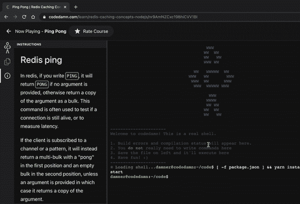
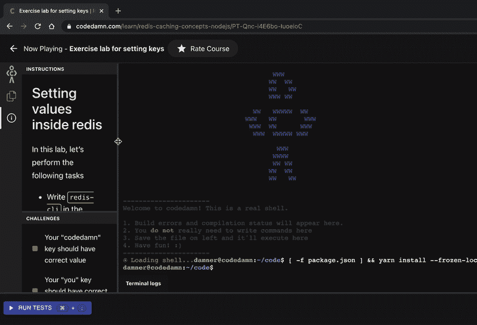
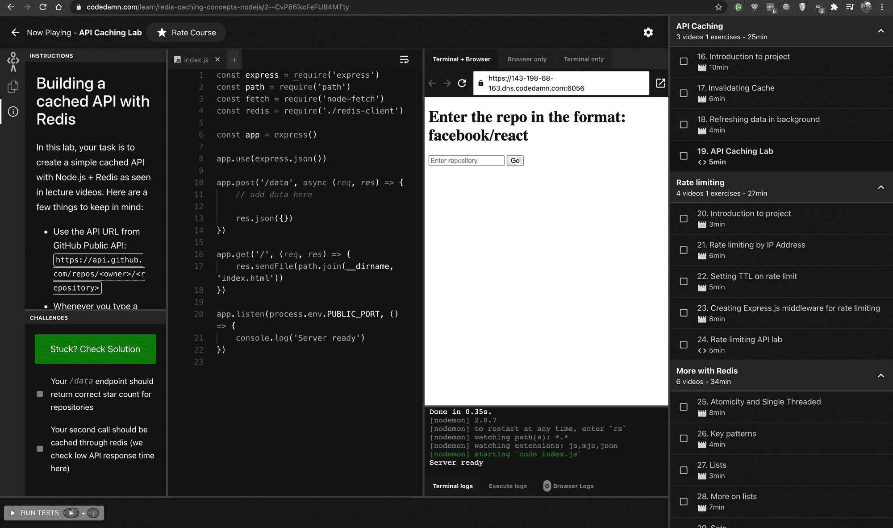
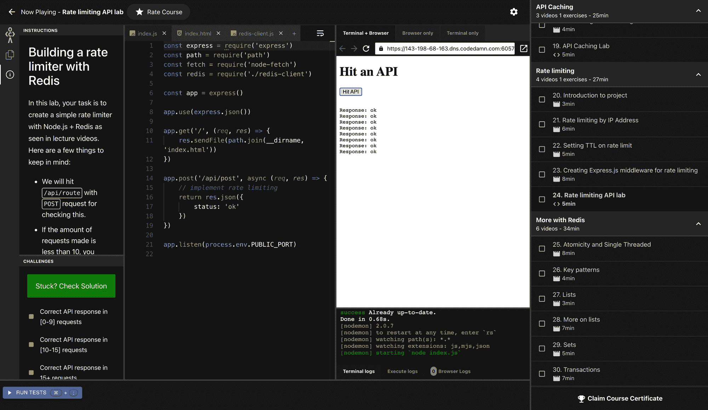

# Redis 数据库基础 Redis CLI 的工作原理、常用命令和示例项目

> 原文：<https://www.freecodecamp.org/news/how-to-learn-redis/>

Redis 是一个流行的内存数据库，用于各种项目，如缓存和速率限制。

在这篇博文中，我们将看到如何使用 Redis 作为内存数据库，为什么要使用 Redis，最后我们将讨论数据库的一些重要特性。我们开始吧。

## 什么是内存数据库？

传统数据库将数据库的一部分(通常是“热”或经常访问的索引)保存在内存中，以便更快地访问，而将数据库的其余部分保存在磁盘上。

另一方面，Redis 非常关注延迟以及数据的快速检索和存储。所以它完全在内存(RAM)上运行，而不是在存储设备(SSD/HDD)上运行。速度很重要！

Redis 是一个键值数据库。但是不要让它欺骗您，使您认为它是一个简单的数据库。您有很多方法来存储和检索这些键和值。

## 你为什么需要背台词？

你可以在很多方面使用 Redis。但我能想到的主要原因有两个:

1.  您正在创建一个应用程序，您想让您的代码层成为无状态的。为什么？-因为如果你的代码是无状态的，它是水平可伸缩的。因此，您可以使用 Redis 作为中央存储系统，让您的代码只处理逻辑。
2.  您正在创建一个应用程序，其中多个应用程序可能需要共享数据。例如，如果有人试图在`payments.codedamn.com`攻击你的网站，一旦你检测到，你也想在`login.codedamn.com`阻止他们，该怎么办？Redis 让您的多个断开连接/松散连接的服务共享一个公共内存空间。

## 里兹·基督山

Redis 相对容易学习，因为您只需要知道少数几个命令。在接下来的几节中，我们将介绍一些主要的 Redis 概念和一些有用的常用命令。

### Redis CLI



Redis 有一个 CLI，它是命令行的 REPL 版本。你写的任何东西都会被评估。

上图是在我的一个 codedamn Redis 课程练习中，给你展示了如何在 Redis 中做一个简单的`PING`或者 hello world(课程链接在最后，如果你想查看的话)。

当您在应用程序中使用数据库，并且需要快速查看几个键或 Redis 的状态时，这个 Redis REPL 非常有用。

## 常用重定向命令



Trying out common commands on Redis CLI in codedamn course

下面是 Redis 中几个非常常用的命令，可以帮助您更多地了解它的工作原理:

### 设置

SET 允许您在 Redis 中为一个值设置一个键。

下面是它如何工作的一个例子:

```
SET mehul "developer from india"
```

这将密钥`mehul`设置为值`developer from india`。

### 得到

“获取”允许您获取已设置的关键点。

下面是语法:

```
GET mehul
```

这将返回字符串“developer from india ”,正如我们上面设置的那样。

### SETNX

仅当该键不存在时，该键才会设置值。这个命令有许多用例，包括不要意外地覆盖可能已经存在的键值。

它是这样工作的:

```
SET key1 value1
SETNX key1 value2
SETNX key2 value2
```

运行这个例子后，你的`key1`将会有值`value1`和`key2`作为`value2`。这是因为第二个命令没有效果，因为`key1`已经出现了。

### MSET

MSET 类似于 SET，但是您可以在一个命令中同时设置多个密钥。它是这样工作的:

```
MSET key1 "value1" key2 "value2" key3 "value3"
```

现在我们使用`key`和`value`作为键和值的前缀。但是在现实中，当你写这样的代码时，很容易忘记在这么长的命令中什么是键，什么是值。

因此，您可以做的一件事是始终使用双引号来引用您的值，并让您的键不带引号(如果它们是不带引号的有效 keynames)。

### MGET

MGET 类似于 GET，但它可以一次返回多个值，如下所示:

```
MGET key1 key2 key3 key4
```

这将以数组的形式返回四个值:`value1`、`value2`、`value3`和`null`。我们将`key4`设为空，因为我们从未设置它。

### 是吗

这个命令删除一个密钥——很简单，对吗？

这里有一个例子:

```
SET key value
GET key # gives you "value"
DEL key 
GET key # null
```

### INCR 和 DECR

您可以使用这两个命令来增加或减少一个键，这是一个数字。它们非常有用，你会经常用到，因为 Redis 可以一次执行两个操作——GET key 和 SET key to key + 1。

这避免了到父应用程序的往返，并使操作在不使用事务的情况下也能安全执行(稍后将详细介绍)

它们是这样工作的:

```
SET favNum 10
INCR favNum # 11
INCR favNum # 12
DECR favNum # 11
```

### 期满

EXPIRE 命令用于设置密钥的到期计时器。从技术上讲，它不是一个计时器，而是一个 kill 时间戳，超过这个时间戳，键将总是返回 null，除非它被再次设置。

```
SET bitcoin 100
EXPIRE bitcoin 10

GET bitcoin # 100
# after 10 seconds
GET bitcoin # null
```

使用稍微多一点的内存来整体存储该密钥(因为现在您还必须存储该密钥何时到期)。但你可能永远都不会关心那笔开销。

### 晶体管-晶体管逻辑。

此命令可用于了解密钥的生存时间。

示例:

```
SET bitcoin 100
TTL bitcoin # -1
TTL somethingelse # -2

EXPIRE bitcoin 5
# wait 2 seconds
TTL bitcoin # returns 3
# after 1 second
GET bitcoin # null
TTL bitcoin # -2
```

那么我们能从这段代码中学到什么呢？

1.  如果密钥存在但没有过期，TTL 将返回`-1`
2.  如果密钥不存在，TTL 将返回`-2`
3.  如果密钥存在并将过期，TTL 将以秒为单位返回生存时间

### SETEX

您可以与`SETEX`一起执行**设定**和**到期**。

像这样:

```
SETEX key 10 value
```

这里，键是“key”，值是“value”，生存时间(TTL)是 10。该键将在 10 秒后复位。

现在您已经对基本的 Redis 命令和 CLI 的工作原理有了基本的了解，让我们构建几个项目并在实际生活中使用这些工具。

## 项目 1–用 Redis 构建一个 API 缓存系统



Preview of API caching system building lab on codedamn

这个项目包括用 Redis 建立一个 API 缓存系统，在这里你可以缓存来自第三方服务器的结果并使用一段时间。

这很有用，这样您就不会受到第三方费率限制。此外，缓存提高了您的网站的速度，所以如果你正确地实现它，这是一个双赢的局面。

你可以在浏览器内部使用 Node.js 在 codedamn 上交互构建这个项目，如果你有兴趣，你可以[免费尝试一下 API 缓存实验室](https://codedamn.com/learn/redis-caching-concepts-nodejs/2--CvP86ikcFeFUB4MTty)。

如果您只对解决方案感兴趣(而不是自己构建)，以下是 Node.js 中核心逻辑的工作方式:

```
app.post('/data', async (req, res) => {
	const repo = req.body.repo

	const value = await redis.get(repo)

	if (value) {
		// means we got a cache hit
		res.json({
			status: 'ok',
			stars: value
		})

		return
	}

	const response = await fetch(`https://api.github.com/repos/${repo}`).then((t) => t.json())

	if (response.stargazers_count != undefined) {
		await redis.setex(repo, 60, response.stargazers_count)
	}

	res.json({
		status: 'ok',
		stars: response.stargazers_count
	})
})
```

让我们看看这里发生了什么:

*   我们尝试从 Redis 缓存中获取`repo`(这是传递的回购格式- `facebook/react`)。如果在场，太好了！我们从 redis 缓存中返回星计数，省去了往返 GitHub 服务器的时间。
*   如果我们在缓存中找不到它，我们就向 GitHub 的服务器发出一个请求，并获得星计数。我们检查星计数是否未定义(以防回购不存在/是私有的)。如果它有一个值，我们用 60 秒的超时时间`setex`这个值。
*   我们设置了一个超时，因为我们不想提供过时的值。这有助于我们至少每分钟刷新一次星级。

以下是完整的源代码:

[codedamn-classrooms/redis-nodejs-classroomContribute to codedamn-classrooms/redis-nodejs-classroom development by creating an account on GitHub.codedamn-classroomsGitHub](https://github.com/codedamn-classrooms/redis-nodejs-classroom/tree/lab5sol)

## 项目 2 -带 Redis 的限速 API



Preview of rate limiting API with Redis

该项目包括限制某个端点的速率，以保护它免受不良行为者的影响，然后阻止他们访问该特定的 API。

这对于登录和敏感的 API 端点非常有用，在这种情况下，您不希望一个人用数千个请求来访问您的端点。

在本实验中，我们通过 IP 地址执行速率限制。如果你想尝试这个 codelab，你可以在 codedamn 上免费试用[它](https://codedamn.com/learn/redis-caching-concepts-nodejs/RapJaltQbkvVtm4_b5oYl)。

如果您只对解决方案感兴趣(而不是自己构建)，以下是 Node.js 中核心逻辑的工作方式:

```
app.post('/api/route', async (req, res) => {
	// add data here
	const ip = req.headers['x-forwarded-for'] || req.ip

	const reqs = await redis.incr(ip)
	await redis.expire(ip, 2)

	if (reqs > 15) {
		return res.json({
			status: 'rate-limited'
		})
	} else if (reqs > 10) {
		return res.json({
			status: 'about-to-rate-limit'
		})
	} else {
		res.json({
			status: 'ok'
		})
	}
})
```

让我们来理解这个代码块:

*   我们尝试从`x-forwarded-for`报头中提取 IP(或者您可以使用`req.ip`,因为我们正在使用 express)
*   我们`INCR`IP 地址字段。如果我们的密钥在 Redis 中从未存在过，INCR 会自动将其设置为 0 并递增，也就是最终将其设置为 1。
*   我们将密钥设置为 2 秒后过期。理想情况下，你会想要一个更大的值——但这是上面 codedamn 挑战指定的，所以我们有它。
*   最后，我们检查请求计数，如果它们大于某个阈值，我们就阻止请求到达主函数体。

以下是完整的解决方案:

[codedamn-classrooms/redis-nodejs-classroomContribute to codedamn-classrooms/redis-nodejs-classroom development by creating an account on GitHub.codedamn-classroomsGitHub](https://github.com/codedamn-classrooms/redis-nodejs-classroom/tree/lab6sol)

## 再重复一遍

Redis 比我们目前所学的要多得多。但好的一面是，我们已经学到了足够的知识，可以开始使用它了！

在这一节中，我们将介绍更多的 Redis 基础知识。

### Redis 是单线程的

Redis 作为单线程进程运行，即使在支持多线程的多核系统上也是如此。这不是性能噩梦，而是多线程环境中针对不一致读/写的安全措施。

如果 Redis 是多线程的，为了确保访问单个键时的线程安全，您最终会采用某种锁定机制，这可能会比单线程/顺序访问的性能差。

### 重试事务处理

当然，您不能在一个命令中完成 Redis 中的所有工作。但是您肯定可以要求它一次执行一个命令块(也就是说，在 Redis 执行这个命令块时，没有其他人与它对话)。你可以使用`MULTI`命令来完成。

这是如何工作的:

```
MULTI
SET hello world
SET yo lo
SET number 1
INCR number
EXPIRE hello 10
EXPIRE yo 5
EXEC
```

这将一次执行所有这些操作，也就是说，在`MULTI`之后**不会**运行任何操作，当它看到`EXEC`关键字时，将立即运行所有操作。

Redis 包括对更高级用例的列表和集合的支持。你也可以使用 Redis 作为一种广播服务，在这里你向一个频道发布消息，而其他已经向该频道订阅了消息的人会收到通知。这在多客户端架构中非常有用。

## 结论

我希望您喜欢这篇 Redis 介绍。这篇博客文章是 codedamn 的[新互动课程的一部分:Redis + Node.js 缓存](https://codedamn.com/learn/redis-caching-concepts-nodejs)，在这里你不仅可以学习这些概念，还可以随时在浏览器中实践它们。

你可以尝试一下这门课程，并告诉我你的想法。您可以在 [twitter](https://twitter.com/mehulmpt) 上找到我，发送任何反馈:)