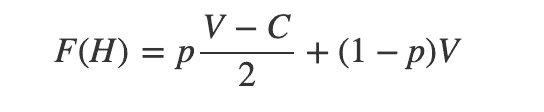
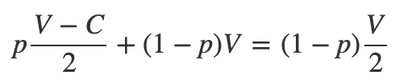
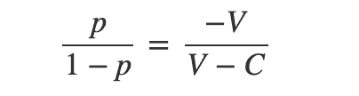
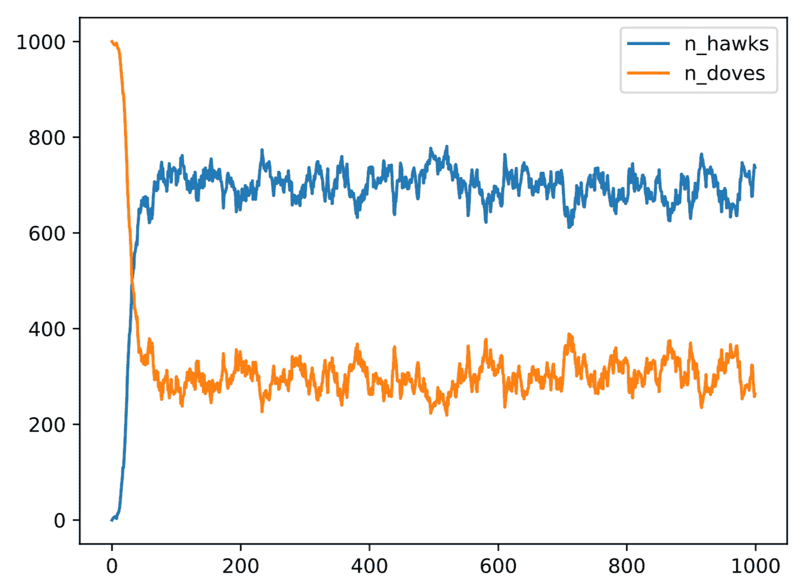

# 进化博弈论导论

> 原文：<https://www.freecodecamp.org/news/introduction-to-evolutionary-game-theory/>

长久以来，合作社会行为的进化一直吸引着进化生物学家。

博弈论的数学领域有助于阐明它是如何出现的。博弈论是“理性决策者之间战略互动的数学模型研究”(根据[维基百科](https://en.wikipedia.org/wiki/Game_theory))。

博弈论适用于各种各样的“游戏”，如经济、政治、象棋和井字游戏。在每种情况下，都有一些规则、一些“玩家”或“代理”，以及一套可供他们使用的策略。

每个玩家都有一个“效用”的概念——一种“货币”，他们试图通过自己的策略来最大化。

进化的通用概念是[适应性](https://www.nature.com/scitable/blog/accumulating-glitches/the_meaning_of_fitness/)。

也就是下一代被代表的机会。增加存活到生育年龄几率的基因和特征更有可能遗传给后代。因此，它们赋予“招待”它们的个人更大的适应性。

进化博弈理论从博弈理论中提取概念，并将它们应用于进化环境中。

对于一个给定的模型，它允许您询问关于哪个策略占优势，以及某些策略是否可以共存的问题。如果是，频率是多少？

## 复制器动力学

进化博弈论玩了很多代的“游戏”。

每个游戏都会改变玩家的效用(也就是适应度)。下一代球员产生了，他们的表现与他们的整体健康状况成比例。

这种设置被称为“复制器动力学”。很容易模拟和探索进化博弈的不同模型。

进化博弈论的经典模型是“鹰鸽”博弈，由约翰·梅纳德·史密斯在 20 世纪 70 年代推广开来。

在这个游戏中，有一群动物在争夺有限的资源(例如食物)。个体赢得的资源越多，它的适应度就越大。

每种动物可以玩两种策略中的一种:

*   鹰派好斗，会不惜一切代价争夺一项资源。
*   **鸽派**是被动的，会去分享而不是去争夺一个资源。

这些动物都是同类——“鹰”和“鸽”指的是它们的行为。

可能存在三种成对竞争:

**鹰对鹰**

*   如果两只鹰竞争，它们将进行 50:50 的战斗来赢得资源。这是一个赢家通吃的场景——赢家获得资源的全部价值。受伤的失败者付出了代价，失去了一定的体能。

**鹰 vs 何处**

*   如果一只鹰遇到一只鸽子，鸽子会立刻后退。鹰赢得了资源的全部价值，而鸽子则空手而归。但是他们不支付任何费用。

**哪里 vs 哪里**

*   当两只鸽子相遇时，他们同意平均分享资源。没人会受伤。

这可以用数学建模。这样做可以让我们理解这些策略是否可以共存(或者是否其中一种占优势)。

### 复制者动力学的数学

设 *V* 为赢得一场比赛的价值， *C* 为在一场比赛中受伤的代价。

用 *p* 表示鹰派在群体中出现的频率，用 *1-p* 表示鸽派出现的频率。

现在，定义两个函数 F(H)和 F(D ),它们分别定义了鹰派和鸽派策略的期望适应度。

作为一名鹰派玩家将意味着以 *p.* 的频率参与鹰与鹰的较量，这样做的预期效用被理解为平均结果。鹰一半时间赢 *V* ，一半时间输 *C* 。

剩下的鹰派竞争将是针对鸽派的。这保证了轻松赢得*对*



扮演鸽派不会赢鹰派。但是一只鸽子会遇到另一只频率为 *1-p* 的鸽子。在这种情况下，期望效用是共享资源，价值为 *V/2* 。


现在，设 *F(H)* 等于 *F(D)* ，求解 *p* 。

这揭示了鹰派策略比鸽派策略更适合或更不适合的频率。

在这个频率下，任何一种策略都没有优势，所以这是两种策略可能共存的均衡。



一些代数重排给出:



它提供了平衡状态下鹰派和鸽派的比例。

只要稍微重新排列一下，就能得到平衡，即 *p* :


考虑这个表达式的属性揭示了两件事:

*   每当输掉一场比赛的成本 *C* 小于或等于获胜的价值 *V* 时，鹰派策略将占优势。这两种策略都不能共存。
*   如果成本 *C* 大于价值 *V* ，策略将均衡共存。

插入值 *V* =4 和 *C* =6 表明当 2/3 的人采取鹰派策略时，均衡出现。

您可以通过在 Python 中模拟模型来测试这一点。

### 代码

在名为 bird.py 的文件中:

```
import random

class Bird:
    def __init__(self, strategy):
        """
        Each bird has a strategy type (hawk or dove)
        And a small starting fitness
        """
        self.strategy = strategy
        self.fitness = 10

    def contest(self, opponent, v, c):
       """
       Simulate the outcomes depending on the strategies
       """

        # both hawks --> 50:50 battle

        if self.strategy == opponent.strategy == "hawk":
            if random.randint(0, 1) == 1:
                self.fitness = self.fitness + v
                opponent.fitness = opponent.fitness - c
            else:
                self.fitness = self.fitness - c
                opponent.fitness = opponent.fitness + v

        # hawk meets dove

        elif self.strategy == "hawk" != opponent.strategy:
            self.fitness = self.fitness + v
            opponent.fitness = opponent.fitness
        elif self.strategy == "dove" != opponent.strategy:
            self.fitness = self.fitness
            opponent.fitness = opponent.fitness + v

        # both doves --> share the resource

        else:
            self.fitness = self.fitness + v/2
            opponent.fitness = opponent.fitness + v/2

    def spawn(self):
        """
        Allow a small chance of mutation to flip strategy
        Otherwise, return offspring of the same type
        """

        mutation = random.randint(0, 1000) > 999
        if mutation:
            if self.strategy == "dove":
                return Bird("hawk")
            else:
                return Bird("dove")
        else:
            return Bird(self.strategy) 
```

下一个文件叫做 simulation.py。

1.  初始化所有鸽子的种群。
2.  定义一个时间步长函数来模拟随机竞赛。
3.  画下一代的相对适合度。
4.  冲洗并重复一千次，然后将输出保存为图表。

```
from bird import Bird
import random
import numpy as np
import pandas as pd
import matplotlib

def initialise():
    """
    Create a population of birds - all dove to begin
    """

    birds = []

    for _ in range(1000):
        birds.append(Bird("dove"))

    return (birds)

def timestep(birds, value, cost):
    """
    Pair up the birds, make them compete
    Then produce next generation, weighted by fitness
    """

    next_generation = []

    random.shuffle(birds)

    for _ in range(1000):

        # pair up random birds to contest
        a, b = random.sample(birds, 2)
        a.contest(b, value, cost)

    # generate next generation
    fitnesses = [bird.fitness for bird in birds]

    draw = random.choices(birds, k=1000, weights=fitnesses)
    next_generation = [bird.spawn() for bird in draw]

    return next_generation

def main():

    birds = initialise()

    rows = []

    V = 4 ; C = 6

    for _ in range(1000):

        # add the counts to a new row
        strategy = [bird.strategy for bird in birds]
        n_hawks = strategy.count("hawk")
        n_doves =  strategy.count("dove")
        row = {'n_hawks': n_hawks, 'n_doves': n_doves}
        rows.append(row)

        # run the timestep function
        birds = timestep(birds, V, C)

    # create dataframe and save output

    df = pd.DataFrame(rows)
    df.to_csv('simulation.csv')
    fig = df.plot(y=["n_hawks", "n_doves"]).get_figure()
    fig.savefig('simulation.pdf')

if __name__ == "__main__":
    main() 
```

瞧，这是 *V* =4 和 *C* =6 的输出示例:



正如理论预测的那样。

## 结尾部分

复杂系统的进化是一个迷人的研究领域。了解自然力量和竞争压力如何塑造个体水平的特征，从而产生复杂的社会行为，是过去几十年生物科学研究的主要领域之一。

相对简单的数学模型准确预测动态系统结果的能力也是一个关键点。

在这种情况下，是反馈回路的存在导致两种策略达到平衡。这两种策略所赋予的优势取决于人群中有多少人在使用这种策略。

换句话说，当更多的个体玩“鸽派”时，玩“鹰派”就有优势了。但是，随着越来越多的个人玩“鹰”，玩“鸽”的预期价值增加。

最后，编程和软件工具的可用性使得通过模拟来检验理论预测成为可能。

如果你觉得这篇文章很有趣，你可能也会发现[如何用 R](https://www.freecodecamp.org/news/how-to-model-an-epidemic-with-r/) 建模流行病也值得一试。

你可以在[gleeson.substack.com](https://gleeson.substack.com/)关注我更多的文章