# 如何使用 NextJS、Chakra UI 和 Firebase 构建一个测验应用程序

> 原文：<https://www.freecodecamp.org/news/how-to-build-a-quizapp-using-nextjs-chakra-ui-and-firebase/>

大家好！欢迎来到这个实践教程。在我们开始之前，你应该熟悉[反应堆](https://reactjs.org/docs/getting-started.html)、[反应堆](https://nextjs.org/docs/getting-started)和[反应堆](https://firebase.google.com/docs/firestore)的基础知识。如果你不是，我建议你浏览他们的文档。

## **这是我们将要构建的:**

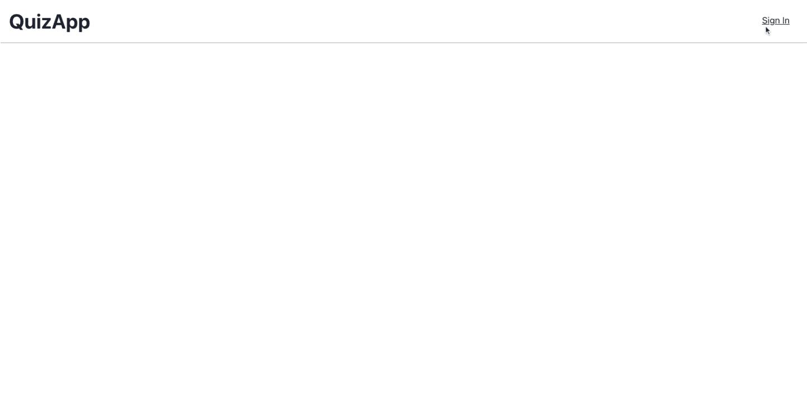

## 这是我们将使用的技术:

1.  **TypeScript:** 提供类型安全的代码，帮助我们在构建时发现 bug。
2.  NextJS: 一个基于 React 的框架，允许我们在服务器端呈现数据。这有助于谷歌抓取应用程序，并导致搜索引擎优化的好处。
3.  Chakra UI: 一个简单的、模块化的、可访问的组件库，它将为我们提供构建应用程序所需的构件。
4.  **Firebase:** 提供我们将在应用程序中使用的 Firestore 和身份验证。我们将使用 Firestore 保存测验、用户信息和答案。我们将使用身份验证为用户提供 Google 登录功能。
5.  Vercel: 将托管我们的应用程序。它的扩展性很好，完全不需要任何配置，而且部署是即时的。
6.  Formik: 为我们提供了各种组件来构建表单。没有 formik 很难开发表单。
7.  是的:表单总是需要被验证。Yup 是一个我们将用于此目的的库。Yep 和 Formik 配合非常好，不需要太多配置。

我将把这个教程分成四个独立的部分。在每一节的开始，您会发现一个 Git commit，其中包含了在该节中开发的代码。此外，如果您想查看完整的代码，可以在这个[库](https://github.com/Sharvin26/quizApp)中找到。

## 内容

1.  [如何设置 Auth 和用户集合](#how-to-set-up-auth-and-user-collection)。
2.  [如何添加一个测验并显示多个测验](#how-to-add-a-quiz-and-display-multiple-quizzes)。
3.  [如何显示单个测验，如何回答测验以及如何验证答案](#how-to-show-a-single-quiz-how-to-answer-a-quiz-and-how-to-validate-the-answer)。
4.  [如何将 App 部署到 Vercel 和 Firebase 认证配置](#how-to-deploy-the-app-to-vercel-and-firebase-authentication-configuration)。

让我们开始吧。

## **如何设置授权和用户集合**

在接下来的这一部分中，我们将实现以下功能:

1.  如何在我们的问答 app 中配置 NextJS 和 Chakra UI？
2.  如何配置 Firebase 身份验证和 Firestore。
3.  如何设置导航条、注册和注销机制？

你可以在这个[提交](https://github.com/Sharvin26/QuizApp/tree/11273c2f2ac33607e258c837c69f2473f4910656)处找到本节实现的**问答 app 代码**。

### 如何在我们的测验应用程序中配置 NextJS 和 Chakra UI:

要创建 NextJS 应用程序，您需要使用以下命令:

```
npx create-next-app quizapp
```

您将获得以下目录结构:

```
+-- node_modules
+-- pages
+-- public
+-- styles
+-- .gitignore
+-- package-lock.json
+-- package.json
+-- README.md
```

**注意:**我用的是 NextJS 10 . 1 . 3 版本和 React 17 . 0 . 2 版本。您可以在您的 package.json 中确认版本。

现在让我们将代码库转换成与 TypeScript 兼容的代码。

在项目的根目录中，使用以下命令创建一个名为`tsconfig.json`的文件:

```
touch tsconfig.json
```

之后，使用以下命令在项目中安装 TypeScript 依赖项:

```
npm install --save-dev typescript @types/react @types/node 
```

在之后，这样转换下面的文件:

```
pages/_app.js => pages/_app.tsx
pages/index.js => pages/index.tsx
```

移除`pages/api`目录。现在转到`pages/_app.tsx`并替换完整代码，如下所示:

```
import { AppProps } from 'next/app'

function App({ Component, pageProps }: AppProps) {
  return <Component {...pageProps} />
}

export default App
```

转到`pages/index.tsx`并用以下代码替换它:

```
import Head from 'next/head';

export default function Home() {
  return (
    <div>
      <Head>
        <title>QuizApp</title>
        <link rel="icon" href="/favicon.ico" />
      </Head>
      <main></main>
      <footer></footer>
    </div>
  );
}
```

现在使用以下命令启动开发服务器:

```
npm run dev
```

第一次启动开发服务器时，Next 将:

1.  为您填充`tsconfig.json`文件。
2.  创建`next-env.d.ts`文件，该文件确保 TypeScript 编译器选择下一个类型。你应该**而不是**碰这份文件。

从根目录中删除`styles`目录。

完成上述步骤后，您将拥有以下目录结构:

```
+-- node_modules
+-- pages
|   +-- _app.tsx
|   +-- index.tsx
+-- public
+-- .gitignore
+-- package-lock.json
+-- package.json
+-- README.md
+-- tsconfig.json
```

现在转到`http://localhost:3000`，你会发现一个空屏幕。

让我们使用以下命令安装 Chakra UI:

```
npm i @chakra-ui/react @emotion/react@^11 @emotion/styled@^11 framer-motion@^4
```

**注意:**如果您使用 zsh，您需要在@后面添加转义符(\)，如下所示:

```
npm i @chakra-ui/react @emotion/react@\^11 @emotion/styled@\^11 framer-motion@\^4
```

根据脉轮文档，我们需要在`pages/_app.tsx`中用`ChakraProvider`包装`<Component />`，如下所示:

```
import { ChakraProvider } from '@chakra-ui/react';
import { AppProps } from 'next/app';

function App({ Component, pageProps }: AppProps) {
  return (
    <ChakraProvider>
      <Component {...pageProps} />
    </ChakraProvider>
  );
}

export default App; 
```

基本上，这将执行 CSSReset 并将[脉轮主题](https://chakra-ui.com/docs/theming/theme)传递给组件。

现在我们将创建我们的`Navbar`组件。

要创建这个组件，首先我们需要在根目录中创建一个名为`src`的目录，并在`src`目录中剪切/粘贴`pages`目录。

之后，在`src`目录下创建一个名为`common`的目录。

在`common`目录下创建一个名为`Navbar.tsx`的文件。将以下代码复制/粘贴到该文件中:

```
import React from 'react';
import { Box, Divider, Flex, Heading, Link } from '@chakra-ui/react';
import { useRouter } from 'next/router';

const Navbar: React.FC<{}> = () => {
  const router = useRouter();

  return (
    <>
      <Flex justify="space-between" m={4}>
        <Heading onClick={() => router.push('/')} as="button">
          QuizApp
        </Heading>
        <Box>
          <Box p={2}>
            <Link
              p={2}
              onClick={() => router.push('/signin')}
              fontWeight={
                router.pathname === '/signin' ? 'extrabold' : 'normal'
              }
            >
              Sign In
            </Link>
          </Box>
        </Box>
      </Flex>
      <Divider
        css={{
          boxShadow: '1px 1px #888888',
        }}
      />
    </>
  );
};

export default Navbar;
```

之后，转到`pages/index.tsx`，在`<main></main>`标签之间添加下面一行。

```
<Navbar />
```

您还需要使用以下语法导入导航栏:

```
import Navbar from '../common/Navbar'; 
```

转到您的网络浏览器并打开`http://localhost:3000`，您将看到以下输出:

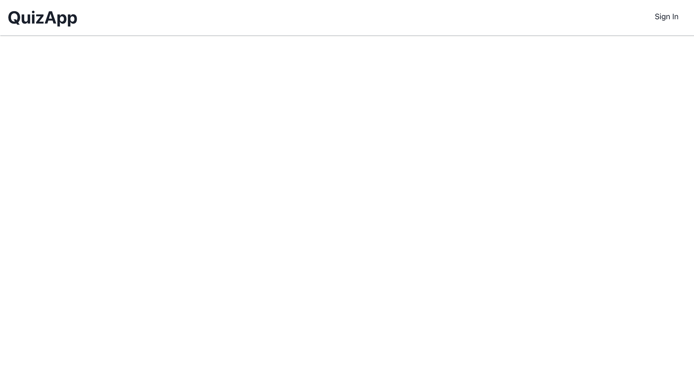

### 如何配置 Firebase 身份验证和 Firestore:

现在让我们配置 Firebase。前往 [firebase 控制台](https://console.firebase.google.com/u/0/)。点击添加项目:


然后添加您的项目名称，如下所示:


接下来，它会问你是否要启用谷歌分析。我更喜欢禁用它，但你可以打开它，如果你想。

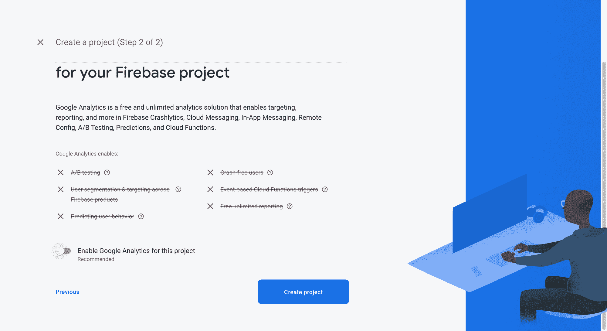

现在点击**创建项目**。创建项目需要一些时间。

创建项目后，您将看到以下屏幕:


单击“继续”后，您将看到一个类似于以下内容的控制面板:


点击**设置>项目设置>通用**。在常规选项卡中向下滚动，在**你的应用**卡片中，选择第三个选项(在安卓图标之后)。

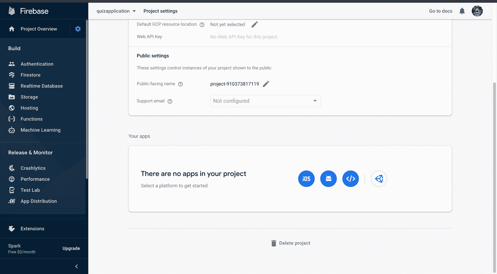

它会询问一些细节来注册应用程序。添加应用程序的昵称，如下所示:

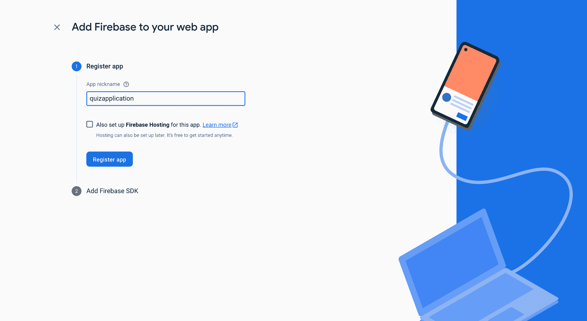

点击**注册应用**后，Firebase 会给你一个片段。将这些细节复制粘贴到一个文件中，然后你可以点击**继续控制台**。

现在转到项目设置中的**服务账户标签**并点击按钮**生成新私钥**。它将下载一些配置，我们将需要 firebase-admin。

现在，返回并单击“身份验证”选项卡:


之后，点击**开始**按钮，您将看到以下屏幕:

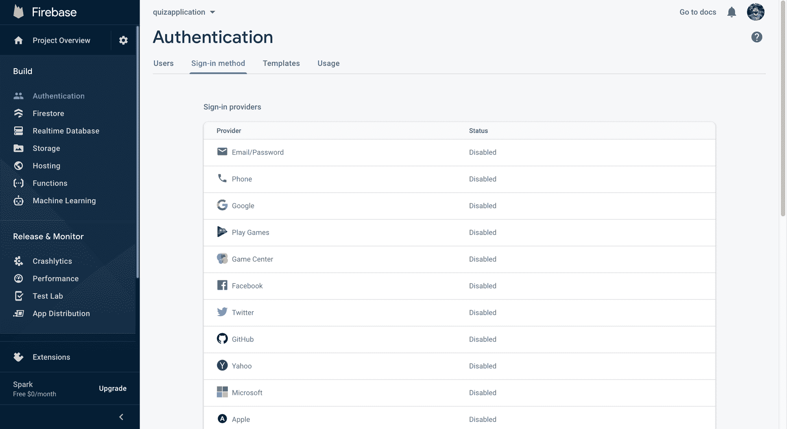

现在点击 Google text 并点击**启用**按钮:

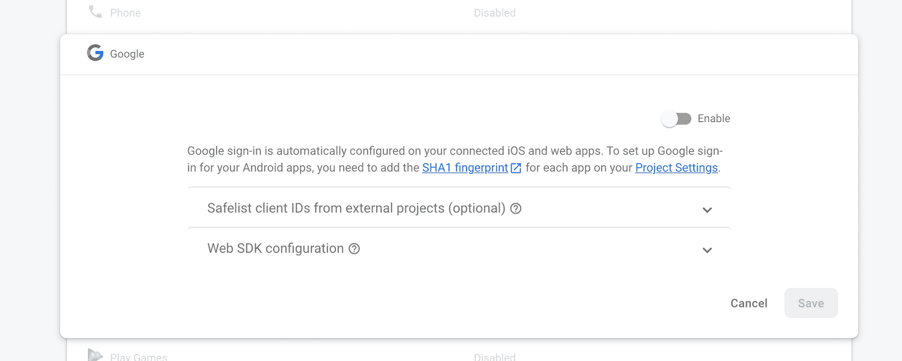

选择项目配置的电子邮件作为您的电子邮件 id。

单击 Firestore 选项卡，然后单击创建数据库按钮。


一旦你点击创建数据库，它会询问模式。选择开发应用程序的测试模式。

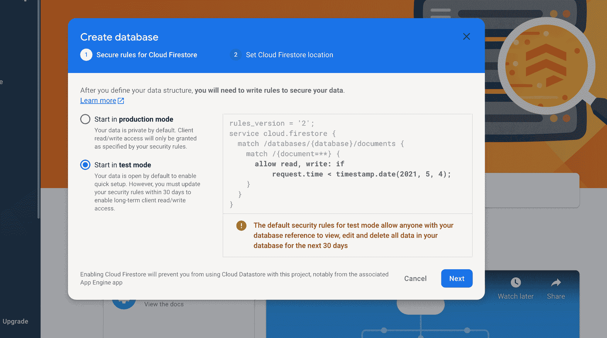

点击下一步。它会询问位置。选择适当的选项，然后单击启用按钮。

### 如何设置导航栏、注册和注销机制:

现在回到我们的项目。使用此 npm 命令安装以下依赖项:

```
npm i firebase firebase-admin
```

在`src`目录中创建一个名为`lib`的目录。

在`lib`目录下创建两个名为`firebase.ts`和`firebase-admin.ts`的文件。

将下面的代码复制到`firebase.ts`中:

```
import firebase from 'firebase/app';
import 'firebase/firestore';
import 'firebase/auth';

const firebaseConfig = {
  apiKey: process.env.NEXT_PUBLIC_FIREBASE_API_KEY,
  authDomain: process.env.NEXT_PUBLIC_FIREBASE_AUTH_DOMAIN,
  projectId: process.env.NEXT_PUBLIC_FIREBASE_PROJECT_ID,
};

try {
  firebase.initializeApp(firebaseConfig);
} catch (err) {
  if (!/already exists/.test(err.message)) {
    console.error('Firebase initialization error', err.stack);
  }
}

export default firebase; 
```

这里我们使用`apikey`、`authdomain`和`projectId`初始化 Firebase 库。

将以下代码粘贴到`firebase-admin.ts`中:

```
import admin from 'firebase-admin';

if (!admin.apps.length) {
  admin.initializeApp({
    credential: admin.credential.cert({
      projectId: process.env.NEXT_PUBLIC_FIREBASE_PROJECT_ID,
      privateKey: process.env.FIREBASE_PRIVATE_KEY,
      clientEmail: process.env.FIREBASE_CLIENT_EMAIL,
    }),
    databaseURL: process.env.FIREBASE_DATABASE_URL,
  });
}

const db = admin.firestore();
const auth = admin.auth();

export { db, auth }; 
```

这里我们使用`projectId`、`privateKey`、`clientEmail`和`databaseURL`来初始化`firebase-admin`库。

现在在根目录下创建一个名为`.env.local`的文件，并粘贴以下代码:

```
NEXT_PUBLIC_FIREBASE_API_KEY=
NEXT_PUBLIC_FIREBASE_AUTH_DOMAIN=
NEXT_PUBLIC_FIREBASE_PROJECT_ID=

FIREBASE_PRIVATE_KEY=
FIREBASE_CLIENT_EMAIL=
FIREBASE_DATABASE_URL=
```

你会在 **Firebase 控制台** > **设置>项目设置>通用>你的应用卡**里面找到`NEXT_PUBLIC_FIREBASE_API_KEY`、`NEXT_PUBLIC_FIREBASE_AUTH_DOMAIN`、`NEXT_PUBLIC_FIREBASE_PROJECT_ID`。

您会在服务帐户选项卡下找到`FIREBASE_PRIVATE_KEY`、`FIREBASE_CLIENT_EMAIL`。我们可以使用**生成新的私钥**按钮来生成新的私钥。该文件包含两组数据。

在`FIREBASE_DATABASE_URL`中增加`https://<database-name>.firebaseio.com`。用您的数据库名替换`database-name`。

**注:**你可以在数据页签的 **firebase 控制台> firestore** 下找到`database-name`(参考下面的截图)。

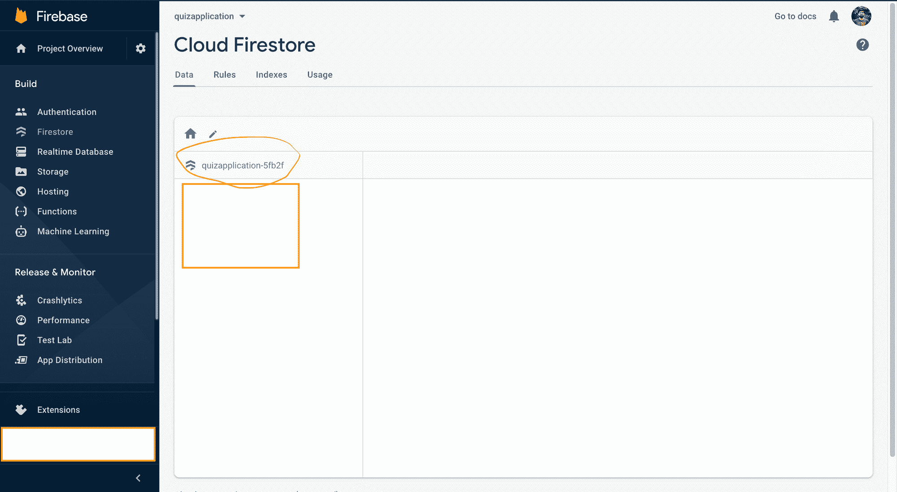

现在在`lib`目录中创建第三个名为`auth.tsx`的文件。这将包含我们的授权机制和状态。将以下代码粘贴到该文件中:

```
import { Context, createContext, useContext, useEffect, useState } from 'react';
import { addUser } from '../utils/db';
import firebase from './firebase';

interface Auth {
  uid: string;
  email: string | null;
  name: string | null;
  photoUrl: string | null;
  token: string | null;
}

interface AuthContext {
  auth: Auth | null;
  loading: boolean;
  siginWithGoogle: () => Promise<void>;
  signOut: () => Promise<void>;
}

const authContext: Context<AuthContext> = createContext<AuthContext>({
  auth: null,
  loading: true,
  siginWithGoogle: async () => {},
  signOut: async () => {},
});

const formatAuthState = (user: firebase.User): Auth => ({
  uid: user.uid,
  email: user.email,
  name: user.displayName,
  photoUrl: user.photoURL,
  token: null,
});

function useProvideAuth() {
  const [auth, setAuth] = useState<Auth | null>(null);
  const [loading, setLoading] = useState<boolean>(true);

  const handleAuthChange = async (authState: firebase.User | null) => {
    if (!authState) {
      setLoading(false);
      return;
    }
    const formattedAuth = formatAuthState(authState);
    formattedAuth.token = await authState.getIdToken();
    setAuth(formattedAuth);
    setLoading(false);
  };

  const signedIn = async (
    response: firebase.auth.UserCredential,
    provider: String = 'google'
  ) => {
    if (!response.user) {
      throw new Error('No User');
    }
    const authUser = formatAuthState(response.user);
    await addUser({ ...authUser, provider });
  };

  const clear = () => {
    setAuth(null);
    setLoading(true);
  };

  const siginWithGoogle = async () => {
    setLoading(true);
    return firebase
      .auth()
      .signInWithPopup(new firebase.auth.GoogleAuthProvider())
      .then(signedIn);
  };
  const signOut = async () => {
    return firebase.auth().signOut().then(clear);
  };

  useEffect(() => {
    const unsubscribe = firebase.auth().onAuthStateChanged(handleAuthChange);
    return () => unsubscribe();
  }, []);

  return {
    auth,
    loading,
    siginWithGoogle,
    signOut,
  };
}

export function AuthProvider({ children }: any) {
  const auth = useProvideAuth();
  return <authContext.Provider value={auth}>{children}</authContext.Provider>;
}

export const useAuth = () => useContext(authContext); 
```

在`src`目录中创建一个名为`utils`的文件夹，并在该文件夹下创建一个名为`db.ts`的文件。在该文件中添加以下代码:

```
import firebase from '../lib/firebase';

export const addUser = async (authUser: any) => {
  const resp = await firebase
    .firestore()
    .collection('users')
    .doc(authUser.uid as string)
    .set({ ...authUser }, { merge: true });
  return resp;
}; 
```

转到组件目录下的`Navbar.tsx`，用以下代码更新之前的代码:

```
import { Box, Divider, Flex, Heading, Link } from '@chakra-ui/react';
import { useRouter } from 'next/router';
import React from 'react';
import { useAuth } from '../lib/auth';

const Navbar: React.FC<{}> = () => {
  const { auth, signOut } = useAuth();
  const router = useRouter();

  return (
    <>
      <Flex justify="space-between" m={4}>
        <Heading onClick={() => router.push('/')} as="button">
          QuizApp
        </Heading>
        <Box>
          {auth ? (
            <Box p={2}>
              <Link
                p={2}
                fontWeight={
                  router.pathname === '/quiz/new' ? 'extrabold' : 'normal'
                }
                onClick={() => router.push('/quiz/new')}
              >
                Add new quiz
              </Link>
              <Link p={2} onClick={() => signOut()}>
                Logout
              </Link>
            </Box>
          ) : (
            <Box p={2}>
              <Link
                p={2}
                onClick={() => router.push('/signin')}
                fontWeight={
                  router.pathname === '/signin' ? 'extrabold' : 'normal'
                }
              >
                Sign In
              </Link>
            </Box>
          )}
        </Box>
      </Flex>
      <Divider
        css={{
          boxShadow: '1px 1px #888888',
        }}
      />
    </>
  );
};

export default Navbar;
```

用以下代码替换`_app.tsx`:

```
import { ChakraProvider } from '@chakra-ui/react';
import { AppProps } from 'next/app';
import { AuthProvider } from '../lib/auth';

function App({ Component, pageProps }: AppProps) {
  return (
    <ChakraProvider>
      <AuthProvider>
        <Component {...pageProps} />
      </AuthProvider>
    </ChakraProvider>
  );
}

export default App; 
```

在 pages 目录下创建一个名为`signin.tsx`的新文件，并添加以下代码:

```
import { Button, Center, Container, Heading, VStack } from '@chakra-ui/react';
import { useRouter } from 'next/router';
import React from 'react';
import { FcGoogle } from 'react-icons/fc';
import Navbar from '../common/Navbar';
import { useAuth } from '../lib/auth';

const signin = () => {
  const { auth, siginWithGoogle } = useAuth();
  const router = useRouter();

  if (auth) {
    router.push((router.query.next as string) || '/');
  }

  return (
    <>
      <Navbar />
      <Container>
        <Center mt={10}>
          <VStack spacing="4">
            <Heading fontSize="3xl" mb={2}>
              Hello, Welcome to the Quiz App!!
            </Heading>
            <Button leftIcon={<FcGoogle />} onClick={() => siginWithGoogle()}>
              Sign In with Google
            </Button>
          </VStack>
        </Center>
      </Container>
    </>
  );
};

export default signin; 
```

你需要安装反应图标。要安装 react-icons，请使用以下命令:

```
npm i react-icons 
```

现在重启开发服务器并转到`http://localhost:3000`。单击登录链接，您将看到以下屏幕。

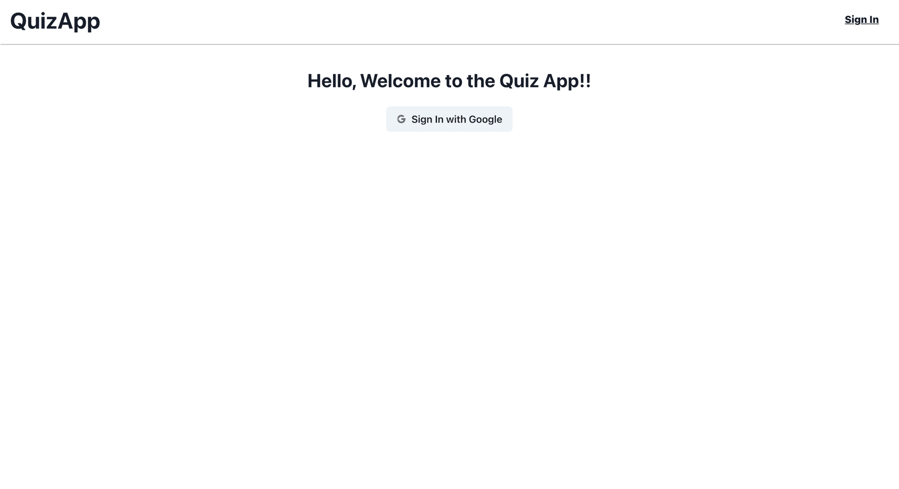

现在点击用谷歌登录按钮。成功登录后，您将被重定向到主页。

## **如何添加测验并显示多个测验**

在本节中，我们将实现以下功能:

1.  如何设置添加测验机制？
2.  如何设置显示多重测验机制？

你可以在本节的[提交](https://github.com/Sharvin26/QuizApp/tree/5ff954a606151e9574ac747ae3780d7644561865)处找到**问答 app 代码**。

### 如何设置添加测验机制:

现在，我们将重点添加测验。要添加新的测验，我们将使用 **Formik。**它将帮助我们配置动态表单，而**是的**将帮助我们验证这些表单。

让我们使用下面的命令安装这两个库。

```
npm i formik yup
```

我们还将使用一个名为 **uuid** 的包，为我们的问题和选项提供一个惟一的标识符。要安装该软件包，请使用以下命令:

```
npm i uuid
```

我们还需要脉轮图标，所以使用以下命令安装它们:

```
npm i @chakra-ui/icons
```

我们将需要 Axios 对我们的下一个无服务器环境进行 API 调用。使用以下命令安装它:

```
npm i axios
```

在 **src > pages** 目录下创建一个名为**小考**的新目录，并在该目录下创建一个名为 **new** 的新目录。

在**新的**目录中创建一个名为`index.tsx`的文件，并将以下代码粘贴到其中:

```
import { AddIcon, MinusIcon } from '@chakra-ui/icons';
import {
  Box,
  Button,
  Center,
  Container,
  Divider,
  Flex,
  FormControl,
  FormErrorMessage,
  FormLabel,
  IconButton,
  Input,
  SimpleGrid,
  Text,
  Textarea,
} from '@chakra-ui/react';
import { Field, FieldArray, Form, Formik, getIn } from 'formik';
import { useRouter } from 'next/router';
import React, { useEffect } from 'react';
import { v4 as uuidv4 } from 'uuid';
import * as yup from 'yup';
import Navbar from '../../../common/Navbar';
import { useAuth } from '../../../lib/auth';
import { addQuizApi } from '../../../utils/service';

const optionData = [
  {
    label: 'Option A:',
  },
  {
    label: 'Option B:',
  },
  {
    label: 'Option C:',
  },
  {
    label: 'Option D:',
  },
];

const answerOption = [
  {
    label: 'A',
    answer: 0,
  },
  {
    label: 'B',
    answer: 1,
  },
  {
    label: 'C',
    answer: 2,
  },
  {
    label: 'D',
    answer: 3,
  },
];

const Index = () => {
  const { auth, loading } = useAuth();

  const router = useRouter();

  useEffect(() => {
    if (!auth && !loading) {
      router.push('/signin?next=/quiz/new');
    }
  }, [auth, loading]);

  const questionsData = {
    title: '',
    options: [{ title: '' }, { title: '' }, { title: '' }, { title: '' }],
    answer: '0',
  };

  const initialValues = {
    title: '',
    description: '',
    questions: [questionsData],
  };

  const validationSchema = yup.object().shape({
    title: yup.string().required('Required'),
    description: yup.string().required('Required'),
    questions: yup
      .array()
      .of(
        yup.object().shape({
          title: yup.string().required('Required!'),
          options: yup.array().of(
            yup.object().shape({
              title: yup.string().required('Required!'),
            })
          ),
        })
      )
      .required('Must add a question'),
  });

  const submitHandler = async (values, actions) => {
    try {
      values = {
        ...values,
        createdAt: new Date(),
        updatedAt: new Date(),
        questions: values.questions.map((question) => {
          return {
            ...question,
            options: question.options.map((option) => {
              return { ...option, optionId: uuidv4() };
            }),
            questionId: uuidv4(),
          };
        }),
      };
      await addQuizApi(auth, values);
      router.push('/');
    } catch (error) {
      console.log('error', error);
    } finally {
      actions.setSubmitting(false);
    }
  };

  return (
    <>
      <Navbar />
      <Container
        maxW="3xl"
        mt={5}
        mb={5}
        borderWidth="1px"
        borderRadius="lg"
        p={6}
        boxShadow="xl"
      >
        <Formik
          initialValues={initialValues}
          onSubmit={submitHandler}
          validationSchema={validationSchema}
        >
          {(props) => (
            <Form>
              <Field name="title">
                {({ field, form }) => (
                  <FormControl
                    isInvalid={form.errors.title && form.touched.title}
                  >
                    <FormLabel htmlFor="title" fontSize="xl">
                      Quiz Title
                    </FormLabel>
                    <Input {...field} id="title" />
                    <FormErrorMessage>{form.errors.title}</FormErrorMessage>
                  </FormControl>
                )}
              </Field>
              <Field name="description">
                {({ field, form }) => (
                  <FormControl
                    isInvalid={
                      form.errors.description && form.touched.description
                    }
                  >
                    <FormLabel htmlFor="description" fontSize="xl" mt={4}>
                      Quiz description
                    </FormLabel>
                    <Textarea {...field} id="description" />
                    <FormErrorMessage>
                      {form.errors.description}
                    </FormErrorMessage>
                  </FormControl>
                )}
              </Field>
              <Field name="questions">
                {({ field }) => (
                  <FormControl>
                    <FormLabel htmlFor="questions" fontSize="xl" mt={4}>
                      Enter your question data:
                    </FormLabel>
                    <Box ml={4}>
                      <FieldArray {...field} name="questions" id="questions">
                        {(fieldArrayProps) => {
                          const { push, remove, form } = fieldArrayProps;
                          const { values, errors, touched } = form;
                          const { questions } = values;
                          const errorHandler = (name) => {
                            const error = getIn(errors, name);
                            const touch = getIn(touched, name);
                            return touch && error ? error : null;
                          };
                          return (
                            <div>
                              {questions.map((_question, index) => {
                                return (
                                  <Flex key={index} direction="column">
                                    <FormControl
                                      isInvalid={errorHandler(
                                        `questions[${index}][title]`
                                      )}
                                    >
                                      <FormLabel
                                        htmlFor={`questions[${index}][title]`}
                                      >
                                        Question Title:
                                      </FormLabel>
                                      <Input
                                        name={`questions[${index}][title]`}
                                        as={Field}
                                        mb={
                                          !errorHandler(
                                            `questions[${index}][title]`
                                          ) && 3
                                        }
                                      />
                                      <FormErrorMessage>
                                        {errorHandler(
                                          `questions[${index}][title]`
                                        )}
                                      </FormErrorMessage>
                                    </FormControl>
                                    <SimpleGrid
                                      minChildWidth="300px"
                                      spacing="10px"
                                      mb={{ base: 4 }}
                                    >
                                      {optionData.map((option, subIndex) => (
                                        <FormControl
                                          mb={2}
                                          key={subIndex}
                                          isInvalid={errorHandler(
                                            `questions[${index}][options][${subIndex}].title`
                                          )}
                                        >
                                          <FormLabel
                                            htmlFor={`questions[${index}][options][${subIndex}].title`}
                                          >
                                            {option.label}
                                          </FormLabel>
                                          <Input
                                            name={`questions[${index}][options][${subIndex}].title`}
                                            as={Field}
                                          />
                                          <FormErrorMessage>
                                            {errorHandler(
                                              `questions[${index}][options][${subIndex}].title`
                                            )}
                                          </FormErrorMessage>
                                        </FormControl>
                                      ))}
                                    </SimpleGrid>
                                    <Box>
                                      <Text mb="8px">Correct Answer:</Text>
                                      <Field
                                        component="select"
                                        name={`questions[${index}][answer]`}
                                        style={{
                                          width: '100%',
                                          padding: '10px',
                                        }}
                                      >
                                        {answerOption.map((value, key) => (
                                          <option
                                            value={value.answer}
                                            key={key}
                                          >
                                            {value.label}
                                          </option>
                                        ))}
                                      </Field>
                                    </Box>
                                    <Flex
                                      direction="row"
                                      justify="flex-end"
                                      mt={4}
                                    >
                                      {index > 0 && (
                                        <IconButton
                                          onClick={() => remove(index)}
                                          aria-label="Remove Question"
                                          icon={<MinusIcon />}
                                          variant="ghost"
                                        >
                                          -
                                        </IconButton>
                                      )}
                                      {index === questions.length - 1 && (
                                        <IconButton
                                          onClick={() => push(questionsData)}
                                          aria-label="Add Question"
                                          icon={<AddIcon />}
                                          variant="ghost"
                                        >
                                          +
                                        </IconButton>
                                      )}
                                    </Flex>
                                    {index !== questions.length - 1 && (
                                      <Divider
                                        mt={2}
                                        mb={4}
                                        css={{
                                          boxShadow: '1px 1px #888888',
                                        }}
                                      />
                                    )}
                                  </Flex>
                                );
                              })}
                            </div>
                          );
                        }}
                      </FieldArray>
                    </Box>
                  </FormControl>
                )}
              </Field>
              <Center>
                <Button
                  colorScheme="green"
                  isLoading={props.isSubmitting}
                  type="submit"
                  disabled={!(props.isValid && props.dirty)}
                >
                  Submit Quiz
                </Button>
              </Center>
            </Form>
          )}
        </Formik>
      </Container>
    </>
  );
};

export default Index; 
```

我们来理解一下上面的代码。

**注意:**不要复制/粘贴下面的单个代码片段。我从上面的大代码块中取出一些片段，并把它们分成小块，这样我们就可以理解发生了什么。

```
const questionsData = {
  title: '',
  options: [{ title: '' }, { title: '' }, { title: '' }, { title: '' }],
  answer: '0',
};

const initialValues = {
  title: '',
  description: '',
  questions: [questionsData],
};

<Formik
   initialValues={initialValues}
   onSubmit={submitHandler}
   validationSchema={validationSchema}
>
    {(props) => (
       <Form>
         #Input field and button
       </Form>
    )}
</Formik>
```

`<Formik>`是一个需要 3 个道具的包装。上面定义的并在这里作为 props 传递的`initialValues`然后被向下传递到中间定义的输入字段。

```
<FieldArray {...field} name="questions" id="questions">
  {(fieldArrayProps) => {
    const { push, remove, form } = fieldArrayProps;
    const { values, errors, touched } = form;
    const { questions } = values;
    const errorHandler = (name) => {
      const error = getIn(errors, name);
      const touch = getIn(touched, name);
      return touch && error ? error : null;
    };
    return (<div> 
      // Input fields
    </div>)
  };
</FieldArray>
```

在这个表单中，您会发现定义了`FieldArray`组件。这个组件是 Formik 自己提供的。当我们需要动态输入字段时，我们可以使用这个组件。

`fieldArrayProps`由两个重要的元素组成，名为`push`和`remove`，这有助于我们添加一个新的输入字段和删除它。

我们使用 Formik 的`getIn`实用程序来验证我们的字段，并检查是否有任何错误。

```
const validationSchema = yup.object().shape({
  title: yup.string().required('Required'),
  description: yup.string().required('Required'),
  questions: yup
    .array()
    .of(
      yup.object().shape({
        title: yup.string().required('Required!'),
        options: yup.array().of(
          yup.object().shape({
            title: yup.string().required('Required!'),
          })
        ),
      })
    )
    .required('Must add a question'),
}); 
```

上面是定义对象形状的 Yup 语法。更多信息请参考 [yup 的文档](https://github.com/jquense/yup)。

我们将验证模式与 Yup 结合起来，并将其传递给 Formik。Formik 用输入字段中定义的名称在内部映射它们。

```
const submitHandler = async (values, actions) => {
  try {
    values = {
      ...values,
      createdAt: new Date(),
      updatedAt: new Date(),
      questions: values.questions.map((question) => {
        return {
          ...question,
          options: question.options.map((option) => {
            return { ...option, optionId: uuidv4() };
          }),
          questionId: uuidv4(),
        };
      }),
    };
    await addQuizApi(auth, values);
    router.push('/');
  } catch (error) {
    console.log('error', error);
  } finally {
    actions.setSubmitting(false);
  }
};
```

当用户点击键盘上的 enter 或者点击网站上的提交按钮时，就会调用 **onSubmit** 。我们必须传递`submitHandler`作为对它的引用。

在该函数中，我们为我们的问题和选项设置了一个惟一的 id，并通过 API 调用将其存储在我们的 Firestore 集合中。

现在在 **src** > **utils** 目录中，创建一个名为`service.ts`的新文件，并添加以下代码:

```
import axios from 'axios';

export const addQuizApi = async (auth, values) => {
  try {
    const header = {
      'Content-Type': 'application/json',
      token: auth.token,
    };
    const resp = await axios.post('/api/quiz', values, { headers: header });
    return resp;
  } catch (error) {
    throw error;
  }
};
```

在 **src > pages** 目录中创建一个名为 **api** 的新目录。默认情况下，该目录下的所有文件都将作为无服务器环境运行。

在 **api** 目录中创建一个名为**测验**的**目录**。在这里创建一个名为 index.ts 的新文件，并粘贴以下代码:

```
import { NextApiRequest, NextApiResponse } from 'next';
import { auth } from '../../../lib/firebase-admin';
import { addQuiz as addQuizFb } from '../../../utils/db';

export default async (req: NextApiRequest, res: NextApiResponse) => {
  switch (req.method) {
    case 'POST':
      await addQuiz(req, res);
      break;
    default:
      res.status(405).json({ status: false, message: 'Method Not found' });
      break;
  }
};

const addQuiz = async (req: NextApiRequest, res: NextApiResponse) => {
  try {
    const user = await auth.verifyIdToken(req.headers.token as string);
    const quizData = { ...req.body, userId: user.uid };
    await addQuizFb(quizData);
    return res
      .status(200)
      .json({ status: true, message: 'Quiz added successfully...' });
  } catch (error) {
    return res
      .status(500)
      .json({ status: false, message: 'Something went wrong' });
  }
}; 
```

现在转到 **src > utils > db.ts** 目录，在`addUser`函数后添加以下代码:

```
export const addQuiz = async (quizData) => {
  let response = await firebase.firestore().collection('quiz').add(quizData);
  return response;
};
```

现在，让我们运行我们的开发服务器并尝试添加一个新的测验。

```
npm run dev
```

转到`http://localhost:3000`并点击导航栏中的`Add new quiz`链接。您将获得以下输出:

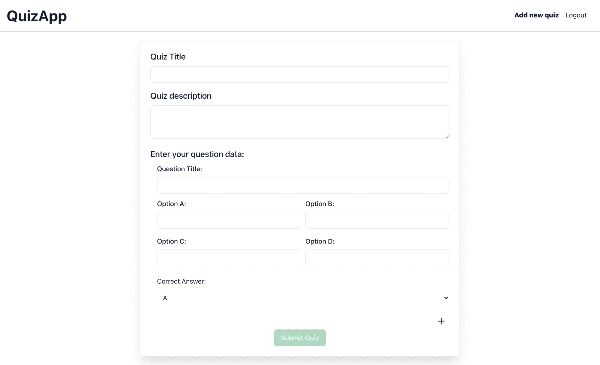

现在填写表格并点击**提交测验**按钮。转到 Firebase 控制台，您会看到一个名为**测验**的新集合已经创建。

**注意:**对于`.env.local`中的`FIREBASE_PRIVATE_KEY`，记得在它周围加上字符串引号，否则会得到以下错误:

```
FirebaseAppError: Failed to parse private key: Error: Invalid PEM formatted message. 
```

### 如何设置显示多项测验机制:

现在让我们展示一下`/`路线上的测验清单。转到**页面> index.js** ，用以下代码更新现有代码:

```
import { Box, Container, Divider, Flex, Heading, SimpleGrid, Text } from '@chakra-ui/react';
import Head from 'next/head';
import { useRouter } from 'next/router';
import React from 'react';
import Navbar from '../common/Navbar';
import { getAllQuiz, getAllUsers } from '../utils/db';

const Home = (props) => {
  const quiz = JSON.parse(props.quiz);
  const router = useRouter();

  const generateQuizCard = (singleQuiz) => {
    return (
      <Box m={3} borderWidth="1px" borderRadius="lg" p={6} boxShadow="xl">
        <Heading as="h3" size="lg">
          {singleQuiz.title}
        </Heading>

          <Text color="gray.500" mt={2}>
            Posted By: {singleQuiz.user.name}
          </Text>
          <Text color="gray.500" mt={2}>
            No of Questions: {singleQuiz.questions.length}
          </Text>

        <Divider mt={3} mb={3} />
        <Text noOfLines={[1, 2, 3]}>{singleQuiz.description}</Text>
      </Box>
    );
  };

  return (
    <Box>
      <Head>
        <title>QuizApp</title>
        <link rel="icon" href="/favicon.ico" />
      </Head>
      <main>
        <header>
          <Navbar />
          <Container maxW="6xl">
            {quiz.length > 0 && (
              <SimpleGrid minChildWidth="400px">
                {quiz.map((singleQuiz) => (
                  <Box
                    key={singleQuiz.id}
                    onClick={() => router.push(`/quiz/${singleQuiz.id}`)}
                    as="button"
                    textAlign="start"
                    m={2}
                  >
                    {generateQuizCard(singleQuiz)}
                  </Box>
                ))}
              </SimpleGrid>
            )}
          </Container>
        </header>
      </main>
      <footer></footer>
    </Box>
  );
};

export async function getServerSideProps(_context) {
  const quiz = await getAllQuiz();
  const users = await getAllUsers();
  const data = quiz.map((singleQuiz: any) => {
    return { ...singleQuiz, user: users.find((user) => user.id === singleQuiz.userId)};
  });
  return { props: { quiz: JSON.stringify(data) } };
}

export default Home;
```

现在转到 **src > utils > db.ts** 并在`addQuiz`函数后添加以下内容:

```
export const getAllQuiz = async () => {
  const snapshot = await firebase.firestore().collection('quiz').get();
  const quiz = snapshot.docs.map((doc) => ({ id: doc.id, ...doc.data() }));
  return quiz;
};

export const getAllUsers = async () => {
  const snapshot = await firebase.firestore().collection('users').get();
  const users = snapshot.docs.map((doc) => ({ id: doc.id, ...doc.data() }));
  return users;
}
```

转到`http://localhost:3000`并刷新页面。您将获得以下输出:

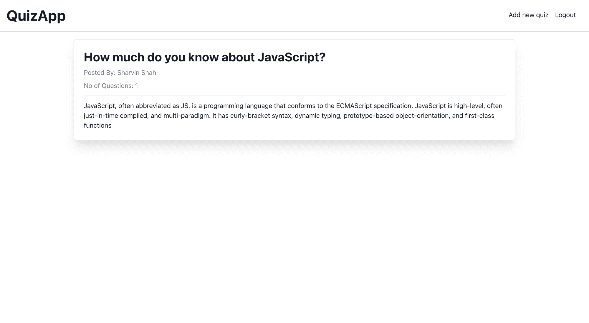

## 如何显示单个测验，如何回答测验以及如何验证答案

在本节中，将实施以下内容:

1.  如何设置节目单个问答和答题机制？
2.  如何建立验证答案机制？

你可以在这个[提交](https://github.com/Sharvin26/QuizApp/tree/ebc092727b9346b796a1d14fec6234e498403710)处找到本节实现的**问答 app 代码**。

### **如何设置显示单个测验和答案测验机制**:

在 **src > pages >测验下创建一个名为【T1【id】**的新目录。在这个目录下创建一个名为`index.tsx`的文件，并粘贴以下代码:

```
import {
  Button,
  Center,
  Container,
  Divider,
  FormControl,
  FormLabel,
  Heading,
  HStack,
  RadioGroup,
  SimpleGrid,
  Text,
} from '@chakra-ui/react';
import { Field, Form, Formik } from 'formik';
import { NextPageContext } from 'next';
import { useRouter } from 'next/router';
import React, { useEffect } from 'react';
import Navbar from '../../../common/Navbar';
import { useAuth } from '../../../lib/auth';
import { getSingleQuiz } from '../../../utils/db';
import { addAnswerApi } from '../../../utils/service';

const ShowQuiz = (quiz, onSubmit) => {
  return (
    <Container
      maxW="7xl"
      mt={5}
      mb={5}
      borderWidth="1px"
      borderRadius="lg"
      p={6}
      boxShadow="xl"
    >
      <Center flexDirection="column">
        <Heading>{quiz.title}</Heading>
      </Center>
      <Text mt={4}>{quiz.description}</Text>
      <Heading mt={4} size="lg">
        Questions:
      </Heading>
      <Divider
        mt={4}
        mb={4}
        css={{
          boxShadow: '1px 1px #888888',
        }}
      />
      <Formik initialValues={{}} onSubmit={onSubmit}>
        {(props) => (
          <Form>
            {quiz.questions.map((singleQuiz, key) => (
              <Field name={singleQuiz.questionId} key={key}>
                {({ field, _form }) => (
                  <FormControl
                    as="fieldset"
                    isRequired={true}
                    mb={{ base: 4, md: 0 }}
                  >
                    <FormLabel as="legend">{singleQuiz.title}</FormLabel>
                    <RadioGroup>
                      <SimpleGrid minChildWidth="120px" mb={2}>
                        {singleQuiz.options.map((option, subkey) => (
                          <HStack key={subkey}>
                            <Field
                              {...field}
                              type="radio"
                              name={singleQuiz.questionId}
                              value={option.optionId}
                            />
                            <Text>{option.title}</Text>
                          </HStack>
                        ))}
                      </SimpleGrid>
                    </RadioGroup>
                  </FormControl>
                )}
              </Field>
            ))}
            <Center mt={10}>
              <Button
                type="submit"
                isLoading={props.isSubmitting}
                colorScheme="green"
              >
                Submit
              </Button>
            </Center>
          </Form>
        )}
      </Formik>
    </Container>
  );
};

const SingleQuiz = (props) => {
  const { auth, loading } = useAuth();

  const router = useRouter();

  useEffect(() => {
    if (!auth && !loading) {
      router.push(`/signin?next=/quiz/${props.quizId}`);
    }
  }, [auth, loading]);

  const quiz = JSON.parse(props.quiz);

  const onSubmit = async (values, actions) => {
    try {
      const resp = await addAnswerApi(auth, props.quizId, values);
      const answerId = resp.data.data.answerId;
      router.push(`/quiz/${props.quizId}/answer/${answerId}`);
    } catch (error) {
      console.log('error', error);
    } finally {
      actions.setSubmitting(false);
    }
  };

  return (
    <>
      <Navbar />
      {quiz && ShowQuiz(quiz, onSubmit)}
    </>
  );
};

export async function getServerSideProps(context: NextPageContext) {
  const quizId = context.query.id;
  const quizData = await getSingleQuiz(quizId);
  return { props: { quiz: quizData, quizId } };
}

export default SingleQuiz;
```

在 **src > utils >** `db.ts`内部，在`getAllUsers`函数下面添加以下代码:

```
export const getSingleQuiz = async (quizId) => {
  const snapshot = await firebase
    .firestore()
    .collection('quiz')
    .doc(String(quizId))
    .get();
  const quizData = snapshot.exists ? JSON.stringify(snapshot.data()) : null;
  return quizData;
};
```

在 **src > utils >** `service.ts`内部，在`addQuizApi`函数下面添加以下代码:

```
export const addAnswerApi = async (auth, quizId, values) => {
  try {
    const header = {
      'Content-Type': 'application/json',
      token: auth.token,
    };
    const resp = await axios.post(
      `/api/quiz/${quizId}/answer`,
      {
        questions: values,
        createdAt: new Date(),
        updatedAt: new Date(),
      },
      { headers: header }
    );
    return resp;
  } catch (error) {
    throw error;
  }
}; 
```

在 **src > pages > api >小考**目录下，新建一个名为【T2【id】的目录。

### 如何设置验证答案机制:

在该目录中创建一个名为`answer.ts`的文件，并粘贴以下代码:

```
import { NextApiRequest, NextApiResponse } from 'next';
import { auth } from '../../../../lib/firebase-admin';
import { addAnswer as addAnswerFb } from '../../../../utils/db';

export default async (req: NextApiRequest, res: NextApiResponse) => {
  switch (req.method) {
    case 'POST':
      await addAnswer(req, res);
      break;
    default:
      res.status(405).json({ status: false, message: 'Method Not found' });
      break;
  }
};

const addAnswer = async (req: NextApiRequest, res: NextApiResponse) => {
  try {
    const user = await auth.verifyIdToken(req.headers.token as string);
    const data = {
      ...req.body,
      quizId: req.query.id,
      userId: user.uid,
    };
    const response = await addAnswerFb(data);
    return res
      .status(200)
      .json({ status: true, data: { answerId: response.id } });
  } catch (error) {
    return res
      .status(500)
      .json({ status: false, message: 'Something went wrong' });
  }
};
```

在 **src > utils >** `db.ts`内部，在`getSingleQuiz`函数下面添加以下代码:

```
export const addAnswer = async (data) => {
  const response = await firebase.firestore().collection('answer').add(data);
  return response;
};
```

转到`http://localhost:3000`，刷新页面，点击测验。您将获得以下输出:

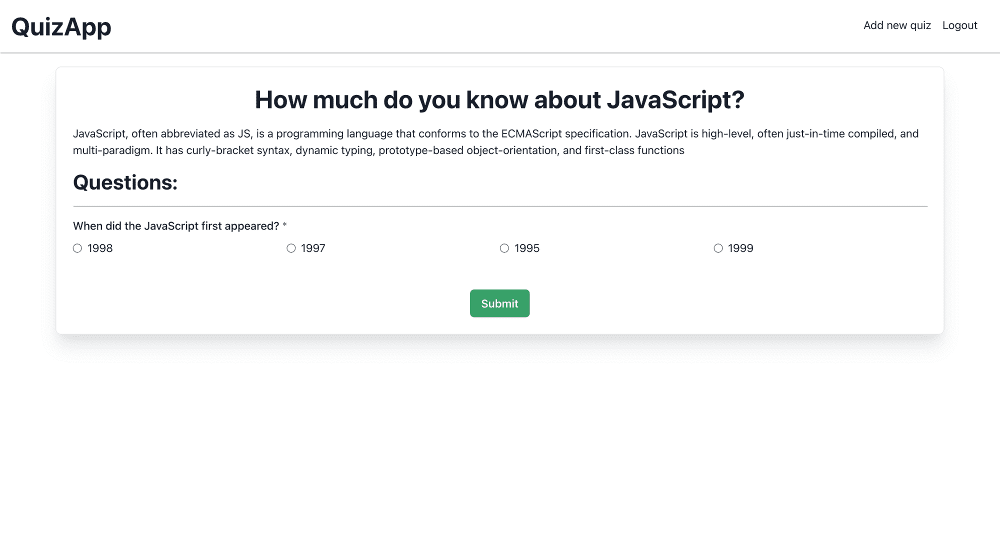

现在你可以回答问题并点击提交。现在它将进入 404 页。我们将需要创建一个页面，我们可以显示正确的答案。

在 **src > pages >小考>【id】**目录下，新建一个名为**答案**的目录。在该目录中创建一个名为`[answerId].tsx`的新文件，并粘贴以下代码:

```
import {
  Box,
  Center,
  Container,
  Divider,
  Heading,
  Radio,
  RadioGroup,
  SimpleGrid,
  Text,
} from '@chakra-ui/react';
import { NextPageContext } from 'next';
import React from 'react';
import Navbar from '../../../../common/Navbar';
import { getAnswer, getSingleQuiz } from '../../../../utils/db';

const answer = (props) => {
  const quiz = JSON.parse(props.quiz);
  const answer = JSON.parse(props.answer);

  return (
    <>
      <Navbar />
      {quiz && answer && (
        <Container maxW="3xl" mt={5}>
          <Center flexDirection="column">
            <Heading>Correct Answer for {quiz.title}</Heading>
            <Text mt={4}>{quiz.description}</Text>
          </Center>
          <Divider
            mt={4}
            mb={4}
            css={{
              boxShadow: '1px 1px #888888',
            }}
          />
          {quiz.questions.map((singleQuiz, index) => {
            return (
              <Box
                mt={index !== 0 && 4}
                key={index}
                borderWidth="1px"
                borderRadius="lg"
                p={6}
                boxShadow="xl"
                backgroundColor={
                  answer.questions[singleQuiz.questionId] &&
                  singleQuiz.options[singleQuiz.answer].optionId ===
                    answer.questions[singleQuiz.questionId]
                    ? 'green.200'
                    : 'red.200'
                }
              >
                <Text>
                  {index + 1}) {singleQuiz.title}
                </Text>
                <RadioGroup>
                  <SimpleGrid minChildWidth="120px" mt={2}>
                    {singleQuiz.options.map((option, index) => (
                      <Radio value={option.title} isDisabled key={index}>
                        {option.title}
                      </Radio>
                    ))}
                  </SimpleGrid>
                </RadioGroup>
                <Text mt={3}>
                  Correct Answer: {singleQuiz.options[singleQuiz.answer].title}
                </Text>
                {answer.questions[singleQuiz.questionId] ? (
                  <Text>
                    Selected Answer:{' '}
                    {
                      singleQuiz.options.find(
                        (option) =>
                          option.optionId ===
                          answer.questions[singleQuiz.questionId]
                      ).title
                    }
                  </Text>
                ) : (
                  <Text>Not Answered</Text>
                )}
              </Box>
            );
          })}
        </Container>
      )}
    </>
  );
};

export async function getServerSideProps(context: NextPageContext) {
  const quizId = context.query.id;
  const answerId = context.query.answerId;
  const quizData = await getSingleQuiz(quizId);
  const answerData = await getAnswer(answerId);
  return { props: { answer: answerData, quiz: quizData } };
}

export default answer;
```

在 **src > utils >** `db.ts`内部，在`addAnswer`函数下面添加以下代码:

```
export const getAnswer = async (answerId) => {
  const answerSnapshot = await firebase
    .firestore()
    .collection('answer')
    .doc(String(answerId))
    .get();
  let answerData = answerSnapshot.exists
    ? JSON.stringify(answerSnapshot.data())
    : null;
  return answerData;
};
```

转到`http://localhost:3000`，刷新页面，点击测验并回答问题。您将获得以下输出:

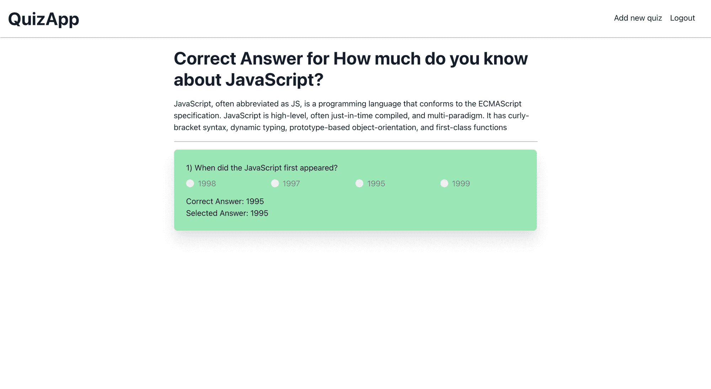

至此，我们已经完成了我们的应用程序，并准备在 Vercel 上进行部署。在下一节中，我们将配置部署机制。

## 如何将应用程序部署到 Vercel 和 Firebase 身份验证配置

在 Vercel 上配置应用程序有两种方式:

1.  使用 [Vercel npm 库](https://www.npmjs.com/package/vercel)并将代码本地推送到 Vercel 服务器
2.  将 Vercel bot 连接到 GitHub 存储库。

我将使用第二种方法。

你需要在 GitHub 上创建一个存储库，然后把代码推到那里。

如果你还没有在 Vercel 上创建账户，那么你可以去[https://vercel.com/](https://vercel.com/)点击注册按钮。

创建帐户后，您将被引导至如下所示的控制面板:

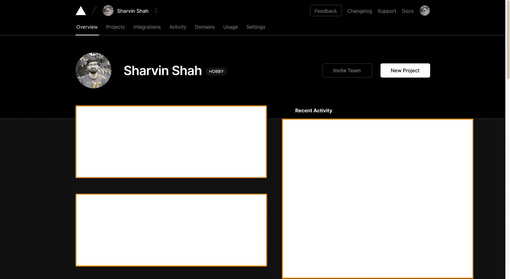

点击**新建项目**按钮。它会要求你安装 Vercel 机器人和权限。

**注意:**您可以允许 Vercel bot 从您的 GitHub 帐户读取所有存储库，或者授予当前创建的存储库的权限。

在上面创建的 GitHub 存储库上单击 Import 按钮:

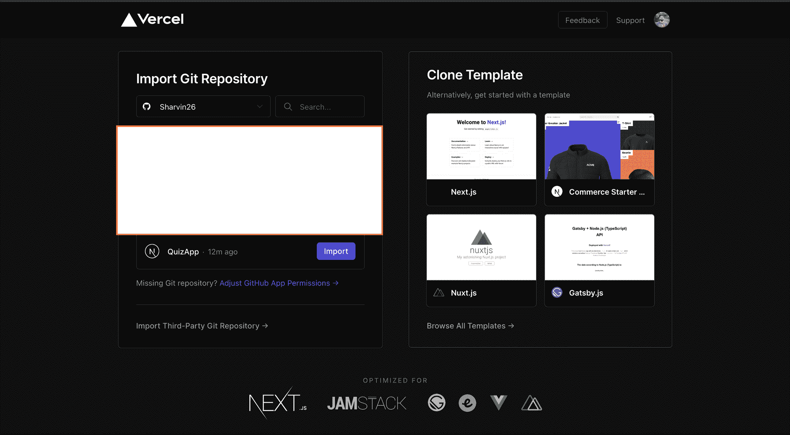

现在您需要添加环境变量。从`.env.local`开始添加。

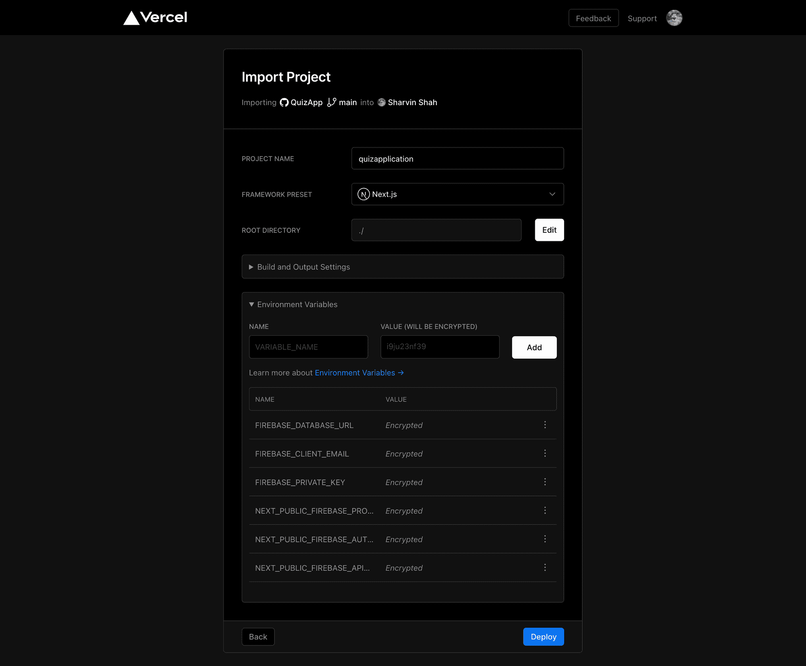

添加后，单击“部署”按钮。部署成功后，您将看到以下屏幕。

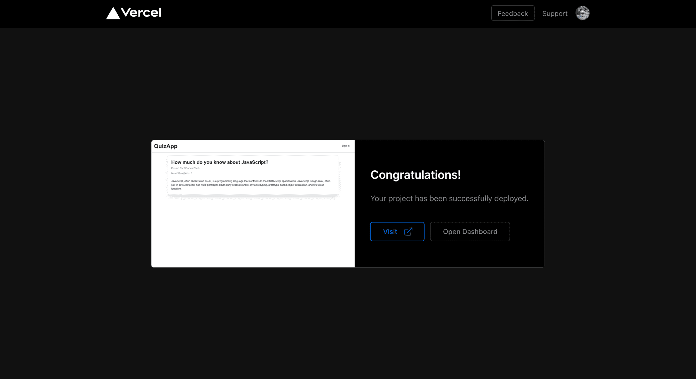

**注意:**网址可能是这样的格式<应用名> - <用户名-or _ something _ random>. vercel . app

我们的登录现在无法工作。我们必须在 Firebase 控制台中将我们的新 URL 添加到允许的 URL 中。

进入 **Firebase 控制台>认证**，点击**登录方式**并向下滚动。你会看到**授权域名**表。

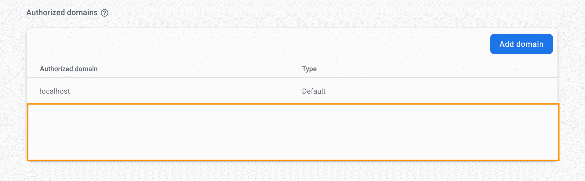

单击 Add domain 按钮，复制新生成的 URL，然后单击 Add。现在打开部署的测验应用程序并测试它。

**注意:**如果您在添加新测验或回答测验时收到错误，请转到 **Vercel 仪表板>选择项目>选择设置选项卡>选择环境变量**并再次更新您的`FIREBASE_PRIVATE_KEY`。

至此，我们已经创建了生产就绪的测验应用程序。如果你已经按照教程开发了这个应用程序，那么恭喜你取得了这个成就。

## 后续步骤:

如果你想在这款应用中加入更多功能，你可以考虑以下几个步骤:

1.  用户仪表板。(显示个人资料信息，更新和删除。显示测验添加，更新和删除。显示测验答案。)
2.  森林安全规则修改。
3.  测验问题和选项的富文本降价。

感谢您的阅读！

> 请随时在 [Twitter](https://twitter.com/sharvinshah26) 和 [Github](https://github.com/Sharvin26) 上联系我。

> 如果你想开发什么项目，或者想找我咨询，可以在我的 Twitter 上给我发 DM(@ sharvin 26)。