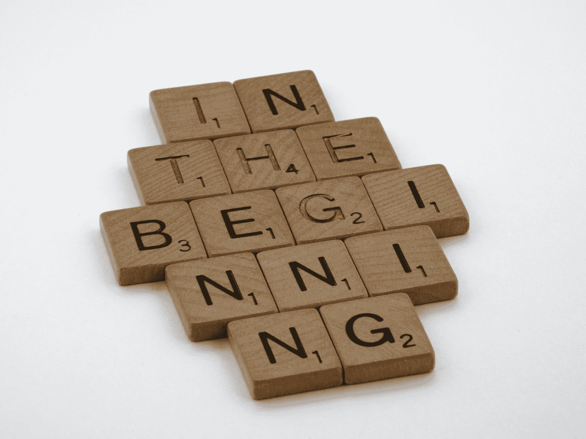

# 健康的习惯——如何成为更好的开发人员，过上更幸福的生活

> 原文：<https://www.freecodecamp.org/news/how-to-become-a-better-developer-and-live-a-happier-life/>

成为一名伟大的开发人员不仅仅是写伟大的代码。我发现有些习惯对你的工作和生活都有好处。

习惯基本上是构成我们日常生活的一部分。一旦建立起来，它们就是我们改变生活的最有力的工具。

在这篇文章中，我分享了五个基本习惯，我相信它们将对你作为开发人员的工作大有裨益。但是这些习惯不仅仅有助于你的编码技能——它们也会改善你的生活，让你更快乐、更健康。

最后会给你一个额外的小提示。所以一定要看完。

## 习惯 1——吃健康的食物

Photo by [Dan Gold](https://unsplash.com/@danielcgold?utm_source=unsplash&utm_medium=referral&utm_content=creditCopyText) on [Unsplash](https://unsplash.com/s/photos/healthy-food?utm_source=unsplash&utm_medium=referral&utm_content=creditCopyText)

编程可能是一项非常密集的任务，尤其是对你的大脑而言。你的身体只能和你摄入的营养物质一起工作。如果投入很差，就不能指望有很大的产出，对吧？

例如，赛车不会进水。它给汽油加燃料，帮助汽车尽可能高效地工作。你自己也一样。如果你想表现得更好，工作效率更高，你必须把正确的东西放在你的身体里。

### 什么是健康食品？

但是吃得“更健康”实际上意味着什么呢？在过去的两年里，我学到了很多关于良好营养的知识，我自己也尝试了很多方法。当我开始正确饮食时，我感觉我的生活和作为程序员的工作有了巨大的改善。

我不是营养学家，但你可以根据我自己的经验和知识考虑以下建议。

*   减少糖的摄入量
*   喝水而不是苏打水
*   每天只吃少量的糖果
*   吃水果时，多吃些低糖水果，如浆果、猕猴桃、杏或椰子(等等)
*   采取甜味剂替代品，如 Erythrit
*   遵循均衡的饮食
*   吃全谷物，如糙米、荞麦、藜麦、小麦、小米和燕麦(复合碳水化合物)
*   获取大量的豆类，如小扁豆、菜豆、青豌豆、鹰嘴豆和大豆
*   选择健康的坚果，如杏仁、开心果、核桃、腰果和花生
*   多吃蔬菜(最好是十字花科蔬菜),如花椰菜、抱子甘蓝、甘蓝、卷心菜、花椰菜和芜菁
*   吃一些种子，像芝麻，大麻籽，亚麻籽，南瓜籽和芝麻籽(它们放在你的盘子上很棒)
*   从鱼、藻类和上面提到的坚果/种子中获取“健康”脂肪
*   将你的肉类摄入量减少到每天 70 克左右(我建议你自己做进一步的研究，因为我不吃肉)
*   早上吃最多的碳水化合物
*   你最清淡的一餐应该在睡觉前至少三个小时

有许多不同的节食方法，在我看来，其中大多数完全没有用，因为它们似乎只是试图从你的口袋里掏钱。

你不必像我一样成为素食主义者，但根据我的研究和与医生的交谈，遵循地中海饮食是大多数时候被推荐的。你可以在本文中了解更多信息。

如果你真的想认真对待这个问题，我建议你预约一位营养学家或该领域的任何其他专业人士。他们可以帮助你制定饮食计划，并建议你如何做出健康的选择。

## 习惯 2——做大量的体育活动和伸展运动

Photo by [Alora Griffiths](https://unsplash.com/@aloragriffiths?utm_source=unsplash&utm_medium=referral&utm_content=creditCopyText) on [Unsplash](https://unsplash.com/s/photos/sport?utm_source=unsplash&utm_medium=referral&utm_content=creditCopyText)

我们都知道。作为程序员，我们可能一天坐 8 到 10 个小时，这导致我们的背部疼痛，通常会让我们感觉不平衡。

像跑步、举重或其他形式的体育活动不仅能改善我们的身体健康，还能改善我们的心理健康。

### 为什么体育活动很重要？

作为一名程序员，积极锻炼身体是帮助我取得高水平成绩的最重要因素之一。它有助于缓解压力，理清思绪，增强体质。

体育活动也有助于保护你免受许多慢性疾病的侵害，并改善你的大脑功能——这对于程序员来说当然非常重要。

还有一个很大的好处就是可以帮你控制体重。因此，当遵循更健康的饮食并定期进行体育锻炼时，你就不太可能担心自己的体重。

我喜欢早上空腹跑步，因为它让我的血液流动，为一天注入能量。这可能很难，尤其是当我不喜欢的时候——但是一旦我完成了，我知道我已经从一开始就克服了一天中最困难的部分。

这形成了一个强大的心态，让我充满能量。这也非常有益，因为你的身体从你的脂肪储备中获取所需的能量，从而导致脂肪燃烧。

### 为什么拉伸也很重要

定期进行体育锻炼很好，但这只是事情的一半。另一半是拉伸你的身体。

拉伸有助于改善你的柔韧性和姿势。它也有助于减轻你在坐在电脑前一整天后的疼痛。把你的工作姿势从坐着变成站着也是以不同方式移动身体的好方法。

拉伸对你生活的其他方面也非常有益。它释放紧张，因此降低你的压力水平。它还能帮助你平静心态，增加精力。

不要跳过早上或晚上的伸展运动。你的身体和大脑会感谢你的。[这个视频](https://www.youtube.com/watch?v=E2SOrScNbww)曾经帮了我大忙。

## 习惯 3——发展适当的压力管理技巧

Photo by [Hans Vivek](https://unsplash.com/@oneshotespresso?utm_source=unsplash&utm_medium=referral&utm_content=creditCopyText) on [Unsplash](https://unsplash.com/s/photos/meditation?utm_source=unsplash&utm_medium=referral&utm_content=creditCopyText)

作为开发人员，我们的生活可能会非常紧张忙碌。因此，在日常生活中融入至少一种缓解压力的方式是非常重要的。

正如我们在上面看到的，每天进行体育锻炼和伸展运动可以帮助我们减轻很多压力。但是你应该考虑更多的方法。

### 好的压力对坏的压力

但是压力总的来说是不好的吗？基本上，这是一个产生战斗或逃跑反应的警告系统。它既有有利的一面，也有有害的一面。

在小剂量下，压力可以帮助你应对日常挑战，激励你自己达到目标。它还能增强你的记忆力，帮助你更有效地完成任务。

另一方面，过多的压力会导致严重的健康问题。它会削弱你的免疫系统，导致高血压、抑郁和焦虑。

压力过大的一些最重要的信号是无法集中注意力、身体疼痛、头痛、食欲改变和更经常生病。另一个非常常见的信号是，如果你再也睡不好觉，无法关闭你的思维。

在我看来，这种不好的压力不是你有的，而是你给自己创造的。这总是一个迹象，表明你正在考虑未来，并为此感到焦虑。也许你不能在截止日期前完成任务，或者你在想当你做一件“糟糕”的工作时，你的老板会怎么做。你感觉到你的心脏在跳动，它开始控制你。

### 如何管理你的压力

呼吸练习是让你平静下来、缓解压力、帮助你更加了解自己的最好方法之一。

在紧张的情况下，我们开始呼吸加快，这将导致我们身体的压力。还有一种叫做屏幕呼吸暂停的东西，这意味着当我们看着屏幕时，我们往往会停止呼吸。可想而知，这根本不可能是健康的！

通过呼吸练习，你可以训练自己即使在紧张的情况下也能慢慢呼吸。把它比作一杯茶。每天你都在充满压力或忙乱的情况下。通过放松呼吸练习，如冥想、太极、气功或横膈膜呼吸，你可以再次清空杯子。

想象一下，当你每天不倒空杯子，倒越来越多的茶进去的时候，杯子和你自己会发生什么。

如果你没有任何冥想之类的经验，我可以强烈推荐你从“headspace”或者“calculate”这样的 app 开始。他们为初学者提供非常友好的指导冥想。你也可以去当地的太极团体或者参加冥想团体。

这些练习不仅能帮你缓解压力，还能训练你更专注于当下，控制你的想法。你将学会让思想来来去去。感觉就像 500 磅从你的肩膀上掉了下来。你还会提高自己的能力，更好地专注于工作。

## 习惯 4——保持初学者的心态

Photo by [Brett Jordan](https://unsplash.com/@brett_jordan?utm_source=unsplash&utm_medium=referral&utm_content=creditCopyText) on [Unsplash](https://unsplash.com/s/photos/start?utm_source=unsplash&utm_medium=referral&utm_content=creditCopyText)

你还记得你第一次写代码或探索计算机科学的宇宙吗？你还能感受到那种兴奋吗？

### 回想一下开始的时候

我仍然记得当我发现编码时我的感受和它对我的影响。这就像接触到了一个最高机密。计算机科学，尤其是编程对我来说就像魔术一样。在我看来，那些能够编写代码的人就像是超级英雄。

当我迈出自己写代码的第一步时，我记得当时的感觉是“天哪，这将是我的事情”。我想全部学会，尽管我知道那是不可能的。

我知道我仍然处于旅程的开始，我真的很乐意学习很多不同的东西。我不擅长也没关系，但是我知道我坐下来学得越多，我就会变得越好。

我接受了我的初级水平，我学的越多，我就越意识到我有多么想学。

### 再次成为初学者

这就是我认为的初学者心态。从初学者的角度来看，他寻找新的东西来学习，并接受还有很多东西需要学习。他们仍然有越来越多的兴奋去探索。

保持这种心态并认识到错误是学习新技能的机会是开发人员进步的关键。不要回避新的挑战，即使你有二十年的经验。

## 习惯 5——充足的睡眠和休息

Photo by [Adi Goldstein](https://unsplash.com/@adigold1?utm_source=unsplash&utm_medium=referral&utm_content=creditCopyText) on [Unsplash](https://unsplash.com/s/photos/sleeping-man?utm_source=unsplash&utm_medium=referral&utm_content=creditCopyText)

休息和保证充足的睡眠可能是帮助你保持高水平表现的两个最重要的因素。

就像电池一样，我们的身体和心灵需要适当的休息来充电。由于编程可能是紧张和精神上的负担，休息和充足的睡眠就更加重要了。

当然，我不是医生，也不是医学领域的专家。但是我喜欢和你分享我的发现和我在试验我的睡眠规律时的经历。如果你有严重的睡眠和健康问题，考虑咨询专家。

### 睡眠不足的负面影响

当我们睡眠不足时，会对我们的身体产生许多负面影响。这可能会导致记忆问题，因为在睡眠期间，我们的大脑形成了帮助我们处理和记忆新信息的连接。

当我们睡眠不足时，我们最重要的技能之一也会面临危险。我们会出现思考和集中注意力的问题。当我们没有得到足够的休息时，我们解决问题的能力和注意力就会受到负面影响。因此，通宵达旦地工作可能首先看起来很有效率，但确实会损害你的长期编程技能。

还有许多其他负面影响，如情绪变化、免疫力下降、高血压、糖尿病风险、体重增加、心脏病风险和性欲低下。对于我们的身体来说，睡眠就像水和空气一样重要。

### 多少睡眠才够？

但是充足的睡眠到底是什么意思呢？关于这个话题有不同的观点，我建议你找到自己的最佳切入点。你可以测试不同的时间，比如六小时、七小时或八小时，并跟踪你一天中的能量水平。

我自己的最佳时间是 7 到 8 小时。有时睡眠少于 7 小时对我来说没什么，但时间一长，我就觉得精力下降了。另一方面，当我睡眠超过八小时，一段时间后对我的能量水平也没有好处。

有一些技巧可以帮助你建立一个健康的睡眠习惯，比如避免白天小睡，睡前几小时不喝咖啡因，在同一时间睡觉和起床(即使是在周末！)，睡前一小时做像调解一样的放松活动，睡前不使用电子设备。

### 为什么休息很重要

在工作时间休息也是一样。一旦我觉得自己无法集中注意力，我通常会快速休息一下。

突破不一定是巨大的。在我的飞镖靶上扔一些飞镖，带着狗快速散步，跑步 30 分钟或只是站起来，做一个伸展运动，泡一杯新咖啡或茶都是一些休息的机会。

大多数时候，我会在休息时间找到我思考了一个小时的问题的解决方案。把我带出那个“黑洞”真是奇迹。

一些生产力系统，如番茄工作法，也可以帮助你建立休息的习惯。你可以设定一个 20 分钟的计时器，在此之后你可以休息 5 分钟。那是一只番茄。吃了三四个番茄后，你可以休息三十分钟。

但是你可以设置一个计时器，每小时提醒你休息 10 分钟左右。像往常一样，尝试不同的东西，坚持最适合你的。

## 如何养成习惯

Photo by [Aman Upadhyay](https://unsplash.com/@iaman_upadhyay?utm_source=unsplash&utm_medium=referral&utm_content=creditCopyText) on [Unsplash](https://unsplash.com/s/photos/motivation?utm_source=unsplash&utm_medium=referral&utm_content=creditCopyText)

如果你想了解更多关于建立持久习惯的知识，我强烈建议你阅读詹姆斯·克利尔的《原子习惯》。如果你已经读过了，还在努力培养习惯，那就再读一遍。他将成功建立习惯的过程归纳为四个法则。

### 养成习惯法则 1——让它显而易见

第一定律是显而易见。指出提醒或迫使你养成新习惯的诱因。

例如，如果你想在早上锻炼，前一天晚上收拾好你的包，把它和你的衣服一起放在门口。早上你首先看到的是你的健身用品。

### 养成习惯法则# 2——让它有吸引力

第二定律是让它有吸引力。把一个你不得不做的习惯(你的新习惯，比如跑步)和一个你喜欢做的习惯(一个已经存在的习惯，比如听你喜欢的音乐)结合起来。

另一个方法是寻找一个你的新习惯正常的环境。例如，这可能是一个当地的跑步俱乐部。

### 养成习惯法则 3——让它变得简单

第三定律是让它变得容易。我们常常倾向于对自己期望过高，尤其是在开始的时候。养成习惯没有一夜之间的感觉——它们都是日积月累形成的。

当你试图养成一种习惯的时候，前 60 天是最重要的，这是通过坚持不懈地做来建立的。所以，尽量让它对你来说容易些。

清除所有可能妨碍你养成习惯的障碍。例如，如果你想自己做健康的食物，确保你的厨房是干净的。因为在做饭前清理干净会妨碍你，耗尽你的动力，导致你根本不想做饭。

让它尽可能简单的一个关键因素是遵循两分钟规则。做不超过两分钟的动作。

例如，你想多读书，你的最终目标是每周读一本书，从每天一页开始。记得先建立习惯，再优化。这对习惯新习惯至关重要。

### 养成习惯法则 4——让它有回报

第四定律是让它有回报。在你养成新习惯后，奖励自己，鼓励自己。一个非常普遍的做法是有一个清单或日历，每次你做完这件事，你就又划掉了一天。

你也可以把这个过程转移到一个习惯跟踪器中，在那里你可以真正看到你的进步。你不会想结束持续这样做的记录。就像第三条法则一样，记住把重点放在一致性而不是质量上。受到奖励的将会重复，受到惩罚的将会避免。

## 如何改掉坏习惯

如果你想改掉坏习惯，你可以逆转那些规律。假设你想减少看电视的时间。拔掉电源插头，把遥控器藏在地下室，或者把电视完全收起来，让自己更难打开电视。

或者当你犯了一个错误，犯了一个坏习惯，烧掉 50 美元或者其他任何真正惩罚你的东西。有什么习惯是你必须改进的吗？还是有我忘了提的习惯？

就在我的 instagram 账号上给我发消息 **@jean_marc.dev *。*** 收到你的回答我很兴奋！