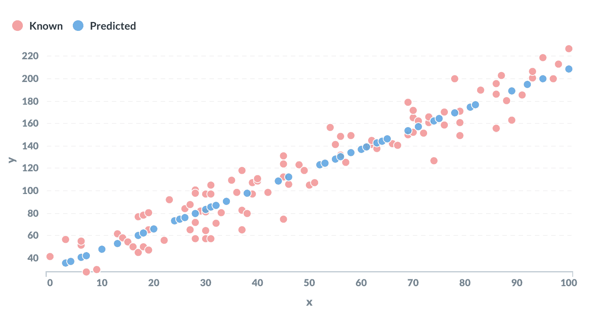
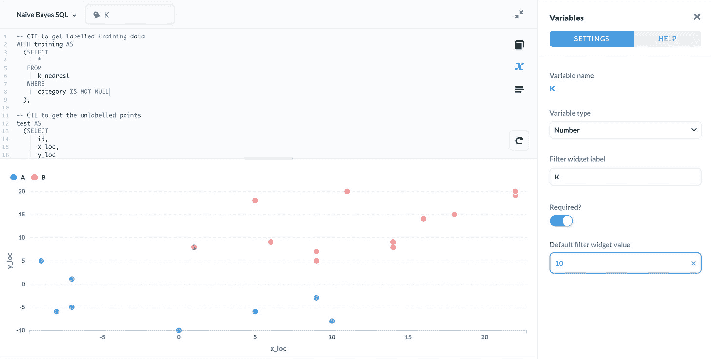
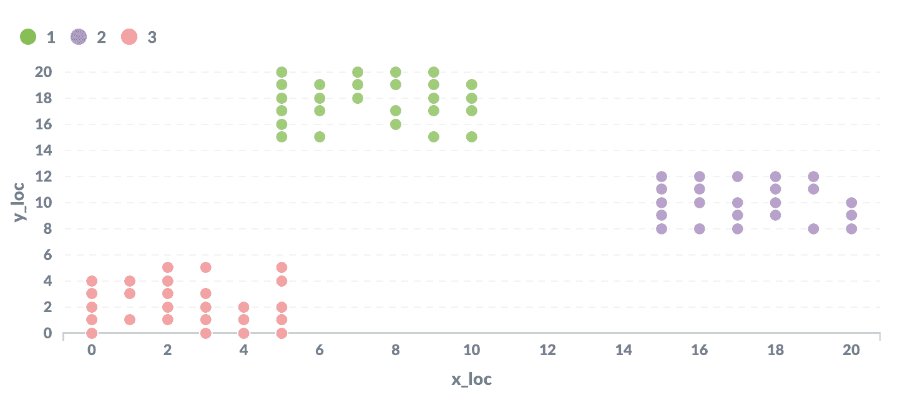

# 直接在 SQL 中进行机器学习——如何在数据库中使用 ML

> 原文：<https://www.freecodecamp.org/news/machine-learning-directly-in-sql/>

机器学习不需要神秘。许多基础知识都包含在高级软件包中，如 [scikit-learn](https://scikit-learn.org/) ，但是实际上你可以做很多事情，而不必离开数据库。

[PostgreSQL](https://www.postgresql.org/) 让你建立查询，对你的数据运行各种机器学习算法。

在这里，我演示了四种完全用 SQL 编写的流行的机器学习算法。

我将以一种便于阐述的方式呈现这些查询，但它们并不打算在生产环境中使用。

无论如何，研究它们是测试您的机器学习和 SQL 知识以及解决问题的好方法，这是任何数据科学家的基本技能。

## 线性回归

线性回归可能是机器学习最基本的例子。目标是从一组训练数据中“学习”形式为`y = mx + c`的线性方程的参数`m`和 c。

这是 PostgreSQL 内置的[统计函数](https://www.postgresql.org/docs/13/functions-aggregate.html)的一个很好的例子。

输入数据在一个包含两列的表中:

`x | y`

`y`的一些值被设置为空。目标是预测这些缺失值。

```
WITH regression AS
  (SELECT 
      regr_slope(y, x) AS gradient,
      regr_intercept(y, x) AS intercept
   FROM
      linear_regression
   WHERE
      y IS NOT NULL
   )

SELECT
   x,
   (x * gradient) + intercept AS prediction
FROM
   linear_regression
CROSS JOIN
   regression
WHERE
   y IS NULL ;
```

`regr_slope()`和`regr_intercept()`函数分别用于估计梯度和截距项。这些对应于等式中的参数`m`和`c`。

输出将是所有的未知点，以及基于`x`值的`y`的预测值。



## k-最近邻

[K-最近邻](https://en.wikipedia.org/wiki/K-nearest_neighbors_algorithm)是监督分类算法的经典例子。前提很简单。每个数据点被表示为空间中的一个点，被标记为任意数量的类别或类中的一个。

要对未标记的数据点进行分类，只需查看最接近它的点的标签。出现频率最高的标签被用作估计值。

考虑的相邻点的数量由参数`K`决定。

这里，输入数据是一个包含以下列的表格:

`id | x_loc | y_loc | category`

`category`列中的一些值为空。目标是使用 K-最近邻算法对这些进行分类。

```
-- CTE to get labelled training data
WITH training AS
  (SELECT
      id,
      POINT(x_loc, y_loc) as xy,
      category
  FROM
      k_nearest
  WHERE
      category IS NOT NULL
  ),

-- CTE to get the unlabelled points
test AS
  (SELECT
      id,
      POINT(x_loc, y_loc) as xy,
      category
  FROM
      k_nearest
  WHERE
      category IS NULL
  ),

-- calculate distances between unlabelled & labelled points
distances AS
  (SELECT
      test.id,
      training.category,
      test.xy <-> training.xy AS dist,
      ROW_NUMBER() OVER (
         PARTITION BY test.id
         ORDER BY test.xy <-> training.xy 
         ) AS row_no
  FROM
      test
  CROSS JOIN training
  ORDER BY 1, 4 ASC
  ),

-- count the 'votes' per label for each unlabelled point
votes AS
  (SELECT
      id,
      category,
      count(*) AS votes
  FROM distances
  WHERE row_no <= {{K}}
  GROUP BY 1,2
  ORDER BY 1)

-- query for the label with the most votes
SELECT
  v.id,
  v.category
FROM
  votes v
JOIN
  (SELECT
      id,
      max(votes) AS max_votes
  FROM
      votes
  GROUP BY 1
  ) mv 
ON v.id = mv.id
AND v.votes = mv.max_votes
ORDER BY 1 ASC ;
```

在上面的查询中，参数`K`被写成变量`{{K}}`。如果使用[元数据库](https://www.metabase.com/start/oss/)之类的工具，可以输入不同的`K`值，看看它们有什么效果。

该查询利用 PostgreSQL 的`POINT()` [数据类型](https://www.postgresql.org/docs/13/datatype-geometric.html)和[距离运算符](https://www.postgresql.org/docs/13/functions-geometry.html)来计算数据之间的距离。

输出将是每个未标记的点，以及估计的类。



## 朴素贝叶斯分类

[朴素贝叶斯分类](https://en.wikipedia.org/wiki/Naive_Bayes_classifier)是一种用于分类任务的技术，从垃圾邮件检测到文档分类和情感分析。

它通过使用[贝叶斯规则](https://www.freecodecamp.org/news/p/885a763e-a3d5-473a-a951-2c5fdd2abcda/)将“给定数据的类的概率”与“给定类的数据的概率”联系起来。后者可以很容易地从一组标记的训练数据中估计出来。

以下查询将包含以下列的表作为输入:

`id | record | category`

这里，`record`是一段文本(例如，电子邮件主题行)，而`category`是几个可能的类别之一(例如，垃圾邮件或非垃圾邮件)。

对于某些行，`category`被设置为 NULL。目标是使用朴素贝叶斯分类来估计缺失的类别。

```
-- CTE to create one row per word
WITH staging AS
  (SELECT 
      REGEXP_SPLIT_TO_TABLE(
         LOWER(record), '[^a-z]+') AS word,
      category
   FROM
      naive_bayes
   WHERE
      category IS NOT NULL
  ),

-- testing data
test AS
  (SELECT
      id,
      record
   FROM
      naive_bayes
   WHERE
      category is NULL
  ),

-- one row per word + category
cartesian AS
  (SELECT
      *
   FROM
     (SELECT
         DISTINCT word
      FROM
         staging) w
      CROSS JOIN
     (SELECT
         DISTINCT category
      FROM
         staging) c
      WHERE
         length(word) > 0
   ),

-- CTE of smoothed frequencies of each word by category
frequencies AS
  (SELECT
      c.word,
      c.category,
      -- numerator plus one
      (SELECT
          count(*)+1
       FROM
          staging s
       WHERE
          s.word = c.word
       AND
          s.category = c.category) /
      -- denominator plus two
      (SELECT
          count(*)+2
       FROM
          staging s1
       WHERE
          s1.category = c.category) ::DECIMAL AS freq
   FROM
      cartesian c
   ),

-- for each row in testing, get the probabilities   
probabilities AS
  (SELECT
      t.id,
      f.category,
      SUM(LN(f.freq)) AS probability
   FROM
     (SELECT
         id,
         REGEXP_SPLIT_TO_TABLE(
            LOWER(record), '[^a-z]+') AS word
      FROM
         test) t
   JOIN
     (SELECT
         word,
         category,
         freq
      FROM
         frequencies) f 
   ON t.word = f.word
   GROUP BY 1, 2
  )

-- keep only the highest estimate            
SELECT
   record,
   probabilities.category
FROM
   probabilities
JOIN
  (SELECT
      id,
      max(probability) AS max_probability
   FROM
      probabilities
   GROUP BY 1) p
ON probabilities.id = p.id
AND probabilities.probability = p.max_probability
JOIN
   test
ON probabilities.id = test.id
ORDER BY 1 ;
```

输出是每个未分类的记录，并分配有预测的类别。

上面的查询做了一些简化。首先，对文本数据的唯一预处理是一个简单的[正则表达式](https://www.postgresql.org/docs/13/functions-matching.html#FUNCTIONS-POSIX-REGEXP)来保存字母 A-Z，并使用`LOWER()`函数将所有内容转换成小写。

它还假设每个类别的先验概率一致(换句话说，假设在查看数据之前，垃圾邮件和非垃圾邮件的可能性相同)。


## k 均值聚类

[K-means 聚类](https://en.wikipedia.org/wiki/K-means_clustering)是一种众所周知的分类算法。这是一种[无监督算法](https://en.wikipedia.org/wiki/Unsupervised_learning)，这意味着它不需要任何带标签的训练数据。

K-means 聚类的工作原理是将每个数据点表示为空间中的一个点。每个点最初被随机分配给`K`个簇中的一个(其中`K`是预先选择的参数)。

接下来，为每个聚类计算点的平均位置。

然后，将每个点重新分配给平均位置最近的聚类。

这两个步骤被一遍又一遍地重复，直到这些点不再在步骤之间被重新分配。

输入数据是包含以下列的表格:

`id | x_loc | y_loc`

输出是一组完整的点，每个点被分配给一个`K`簇。

这个很难实现。下面的解决方案很大程度上基于吉姆·纳斯比根据 [BSD 双条款许可](https://github.com/decibel/examples/blob/master/LICENSE)(下面适用)创建的[这个购买数据示例](https://github.com/decibel/examples)的概括。

```
WITH points AS
   (SELECT
       id,
       POINT(x_loc, y_loc) AS xy
    FROM
       k_means_clustering
    ),

initial AS
   (SELECT 
       RANK() OVER (
          ORDER BY random() 
       ) AS cluster,
       xy
    FROM points 
    LIMIT {{K}}
    ),

iteration AS
   (WITH RECURSIVE kmeans(iter, id, cluster, avg_point) AS (
       SELECT
          1,
          NULL::INTEGER,
          *
        FROM 
           initial
        UNION ALL
        SELECT
           iter + 1,
           id,
           cluster,
           midpoint
        FROM (
           SELECT DISTINCT ON(iter, id)
              *
           FROM (
              SELECT
                 iter,
                 cluster,
                 p.id, 
                 p.xy <-> k.avg_point AS distance,
                 @@ LSEG(p.xy, k.avg_point) AS midpoint,
                 p.xy,
                 k.avg_point
               FROM points p
               CROSS JOIN kmeans k
               ) d
            ORDER BY 1, 3, 4
            ) r
       WHERE iter < {{max_iter}}
   )
   SELECT
      *
   FROM
      kmeans
   )

SELECT
   k.*,
   cluster
FROM
   iteration i
JOIN
   k_means_clustering k
USING(id)
WHERE
   iter = {{max_iter}}
ORDER BY 4,1 ASC ;
```

这个查询使用了几个简洁的特性。

首先，它利用 PostgreSQL 的[几何数据类型](https://www.postgresql.org/docs/13/datatype-geometric.html)和[操作符](https://www.postgresql.org/docs/13/functions-geometry.html)来根据点和线段对数据建模。

它还使用一个[递归查询](https://www.postgresql.org/docs/13/queries-with.html)来迭代地重新计算每个聚类的中心，直到达到最大迭代次数。

这种实现在终止之前使用预定义的迭代次数，而不是在迭代之间停止重新分配点时停止。

如果使用 Metabase 这样的工具，可以使用变量`{{K}}`和`{{max_iter}}`动态设置参数`K`和最大迭代次数。



## 摘要

SQL 是一种强大的语言，它不仅仅能够在数据库中存储和加载数据。

它是一种声明性语言，所以你必须描述你正在寻找的结果(与命令性语言相反，在命令性语言中，你一步一步地给计算机下达指令)。

这就需要换一种方式思考机器学习问题，但还是有可能取得一些有趣的结果。

本文中使用的所有示例数据和查询都可以在[这里](https://github.com/pg0408/sql-machine-learning)找到。

如果你喜欢这篇文章，你可能也有兴趣[学习 PostgreSQL 中的这些快速技巧](https://www.freecodecamp.org/news/postgresql-tricks/)和[如何在 PostgreSQL 中使用模糊字符串匹配](https://www.freecodecamp.org/news/fuzzy-string-matching-with-postgresql/)。

你可以在[gleeson.substack.com](https://gleeson.substack.com/)关注我更多的文章