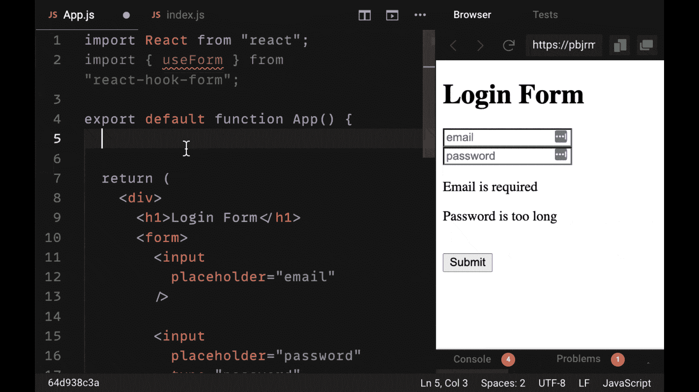
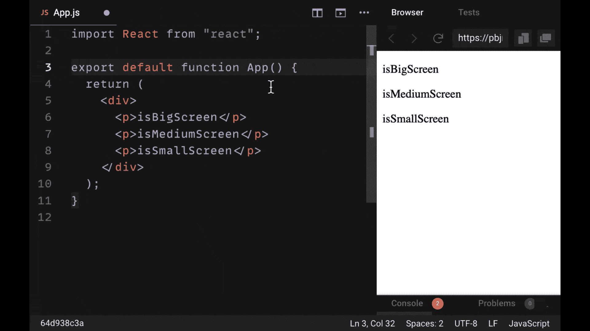

# 你现在应该使用的最好的 React 库

> 原文：<https://www.freecodecamp.org/news/react-libraries-you-should-use/>

让我们来看看五个 React 库，它们是您在 2021 年及以后想要构建的任何 React 项目的重要补充。

我之所以选择这些库，是因为它们不仅能帮助我们构建功能强大、令人印象深刻的应用程序，还能让我们更快、更容易、用更少的代码完成这些工作。

在本指南中，我将向您展示如何从头开始使用这些库，并将它们集成到您的项目中。

> 希望用最好的库构建令人惊叹的真实 React 项目？查看 [React 训练营](https://reactbootcamp.com)。

## 1.反应查询

用 React 获取数据通常是一个涉及大量代码的过程。

您经常需要结合使用`useEffect`钩子和`useState`来管理获取的数据。这需要我们在每个想要获取数据的组件中编写大量的样板文件。

React Query 可以帮助您在使用 React 发出网络请求时减少编写的代码。我们之前必须编写的所有这些 React 代码都可以用钩子`useQuery`代替。从它那里我们可以得到我们需要的所有数据，而不必声明一个状态变量:

然而，简化数据获取只是 React Query 工作的一小部分。它之所以成为一个非常强大的库，是因为它缓存(保存)了我们的请求。因此，在许多情况下，如果我们以前请求过数据，我们就不必再请求了，我们可以直接从缓存中读取数据。

这非常有帮助，因为它减少了代码中的重复，减少了我们在 API 上的负载，并帮助我们管理我们的整体应用程序状态。如果您从这个列表中选择任何一个库来开始添加到您的项目中，让它 React Query。

## 2.蚂蚁设计

当谈到制作令人印象深刻的 React 应用程序时，有许多有用的组件库，允许我们在预制组件的帮助下快速设计我们的应用程序。

有很多组件库，但是很少有像 Ant Design 这样复杂和设计良好的。如果你能想到一种类型的组件包含在你的 React 应用程序界面和设计中，Ant Design 几乎肯定有:

使用像 Ant Design 这样的组件库可以减少我们必须自己编写的不可靠的样式，从而加快我们的开发时间。

此外，这些预制的组件提供了我们自己创建通常是多余的功能，比如一个公共的模态或工具提示。在大多数情况下，我们应该选择可靠的、经过验证的解决方案，而不是试图重新发明轮子。

如果您现在正在考虑构建一个应用程序，并且正在寻找一个可靠的组件库，请选择 Ant Design。它几乎拥有组件库中需要的所有功能，加上出色的可定制性，可以为您可能考虑实现的任何应用程序功能提供服务。

## 3 .状态

谈到管理状态，React 开发人员经常会有两个熟悉的选择:Redux 或 React Context。

Redux 是 React 开发人员用来管理状态的第三方库。但是随着 React 版本 16 中 React 上下文的到来，我们有了一种更简单的方法来管理状态，方法是在组件树中传递状态。

如果您正在寻找一个具有 Redux 所有功能和强大功能的库，以及 React 上下文的简单性，那么看看库 Zustand。正如您在下面的示例中所看到的，它非常容易上手:

它涉及到使用`create`函数来创建一个专用的状态对象，该对象可以包含任何状态值和函数，以便在我们需要时更新该状态。这些都可以在几行代码内创建。

此外，不需要使用任何上下文提供者将您的状态传递给应用程序组件。您所需要做的就是创建一个状态片段，将创建的状态作为一个钩子调用，并接收您在 React 组件中的对象上声明的任何状态变量和函数。

下次您在为您的应用程序寻找更复杂的状态解决方案(如 Redux)时，请尝试一下 Zustand——您会喜欢它的。

## 4.反应挂钩形式

当谈到在 React 中构建表单时，您可能知道执行验证输入、管理所有表单和错误状态等基本任务是多么乏味。

也许目前最友好的表单库是 React Hook Form。表单库中需要的所有功能都在一个简单的钩子中提供，称为`useForm`，它使您能够创建尽可能复杂的表单。

它在内部控制管理我们的表单状态，为我们提供简单的助手来显示适当输入的错误，并在没有任何外部库(如 Yup)的情况下应用验证规则——以及处理我们的表单提交:

当涉及到构建函数表单时，您需要一个易于使用的库，并且不会向组件添加太多代码。根据这两个标准，React Hook Form 可以说是最好的 React form 库。

## 5.反应灵敏

毫无疑问，每个 React 应用程序都应该为不同设备上的用户创建，并且需要具有响应能力。也就是说，它需要根据用户使用的屏幕大小或设备来调整样式和外观。

虽然媒体查询通常在 CSS 样式表中用于隐藏和显示不同的元素，但管理 React 组件的可见性或样式的最佳基于 React 的库是 React Responsive。

它给了我们一个方便的`useMediaQuery`钩子，使我们能够传递非常精确的条件来确定某一类型屏幕上的用户是否正在使用某一设备。然后他们将能够相应地调整我们的用户界面:

要让任何 React 应用程序在不使用 CSS 的情况下做出响应，请务必查看 React Responsive 库。

## 喜欢这篇文章吗？加入 React 训练营

**[React 训练营](http://bit.ly/join-react-bootcamp)** 将你应该知道的关于学习 React 的一切打包成一个全面的包，包括视频、备忘单，外加特殊奖励。

获得数百名开发人员已经使用的内部信息，以掌握 React、找到他们梦想的工作并掌控他们的未来:

 
*打开时点击此处通知*