# 如何使用 Azure AI 解决数独难题

> 原文：<https://www.freecodecamp.org/news/solve-sudoku-using-azure-ai/>

在这篇文章中，我们将在 Azure Form Recognizer 的帮助下创建一个数独求解器，这是一个人工智能支持的文档提取服务。

该应用程序将允许用户上传数独表的图像。我们将从图像中提取数据，然后在其上实现数独求解算法。

我们将使用。NET 作为后端，Angular 作为前端，Angular material 作为应用程序的样式。

您可以在下面看到该应用程序的工作演示。

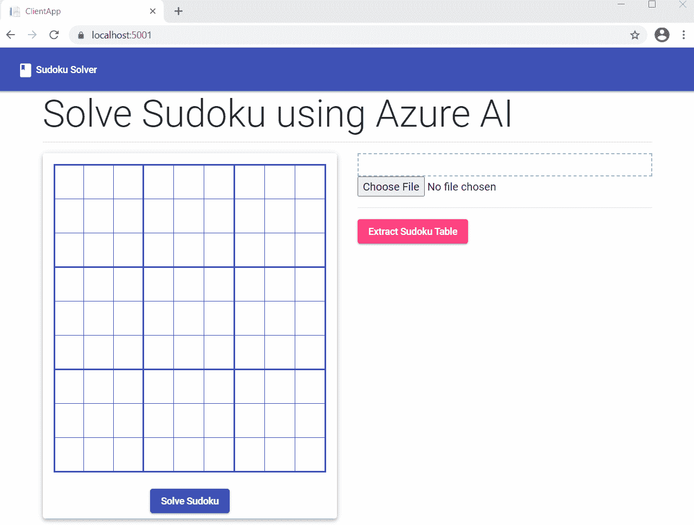

## 先决条件

*   安装节点的最新 LTS 版本。来自 https://nodejs.org/en/download/的 JS
*   从[https://cli.angular.io/](https://cli.angular.io/)安装角度 CLI
*   Azure 订阅帐户。你可以在[https://azure.microsoft.com/en-in/free/](https://azure.microsoft.com/en-in/free/)创建一个免费的 Azure 账户
*   安装。来自[https://dotnet.microsoft.com/download/dotnet/5.0](https://dotnet.microsoft.com/download/dotnet/5.0)的 NET Core 5.0 SDK
*   从[https://visualstudio.microsoft.com/downloads/](https://visualstudio.microsoft.com/downloads/)安装最新版本的 Visual Studio 2019

## 源代码

可以从 [GitHub](https://github.com/AnkitSharma-007/Azure-AI-Sudoku-solver) 获取源代码。

## 什么是 Azure 表单识别器认知服务？

Azure 表单识别器认知服务允许我们使用机器学习技术构建自动化数据处理软件。它让我们从文档中提取文本、键/值对、选择标记、表格和结构。

借助 REST API 或客户端库 SDK，我们可以轻松地调用表单识别器模型。

表单识别器认知服务提供以下功能:

*   **预建模型**:我们可以使用预建模型从发票、收据、身份证和名片等独特的文档类型中提取数据。
*   **定制模型**:我们可以使用定制模型从表单中提取文本、键/值对、选择标记和表格数据。然而，我们需要使用我们的数据来训练定制模型，以便它适合我们的定制需求。
*   **布局 API** :它允许我们从文档中提取文本、选择标记和表格结构。

在本文中，我们将使用布局 API 从用户上传的数独表图像中提取内容。

## 如何创建 Azure 表单识别器认知服务资源

登录 Azure 门户，在搜索栏中搜索认知服务，然后点击结果。在下一个屏幕上，单击“Create”按钮。这将打开认知服务市场页面。在搜索栏中搜索表单识别器，并在搜索结果中单击“表单识别器”卡片。

这将打开表单识别器 API 页面。单击“创建”按钮创建新的表单识别器资源。请参考下图。

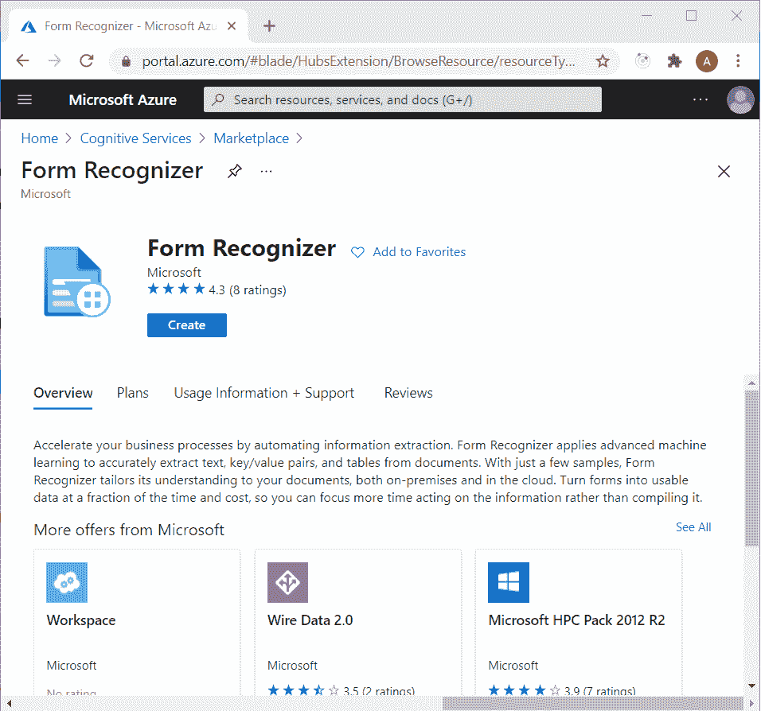

在“创建表单识别器”页面上，按如下所示填写详细信息。

*   **订阅**:下拉选择订阅类型。
*   **资源组**:选择一个已有的资源组或创建一个新的资源组。
*   **地区**:选择适合自己的地区。
*   **Name** :给你的资源起一个唯一的名字。
*   **定价等级**:选择您想要的定价等级。

点击“查看+创建”按钮。请参考下图。

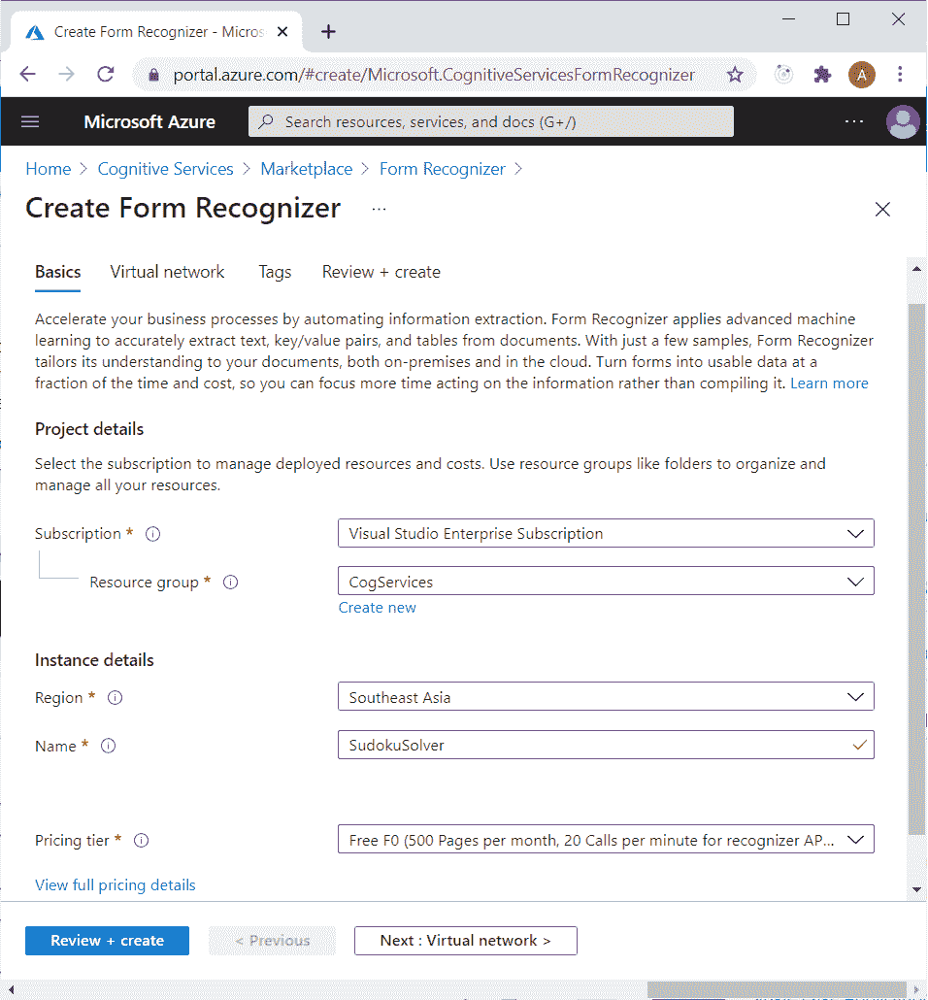

在下一页，检查使用条款，验证您提供的信息，然后单击“创建”按钮。

成功部署资源后，单击“转到资源”按钮。单击左侧菜单上的“Keys and the endpoint”链接。请参考下图。

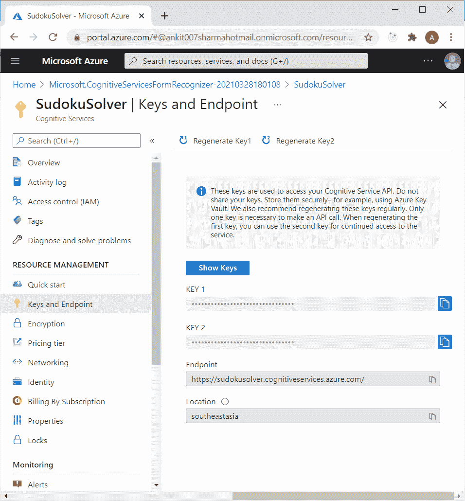

记下端点和提供的任何一个键。在本文的后半部分，我们将使用它们从。NET 代码。

## 如何创建 ASP.NET 核心应用程序

打开 Visual Studio 2019，点击“新建项目”。将会打开一个“创建新项目”对话框。选择“ASP。NET Core with Angular”并点击下一步。请参考下图。

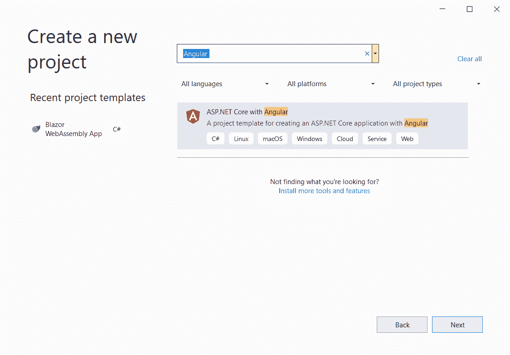

现在，您将进入“配置您的新项目”屏幕。为您的应用程序提供名称`ngSudokuSolver`，然后单击 Next。请参考下图。

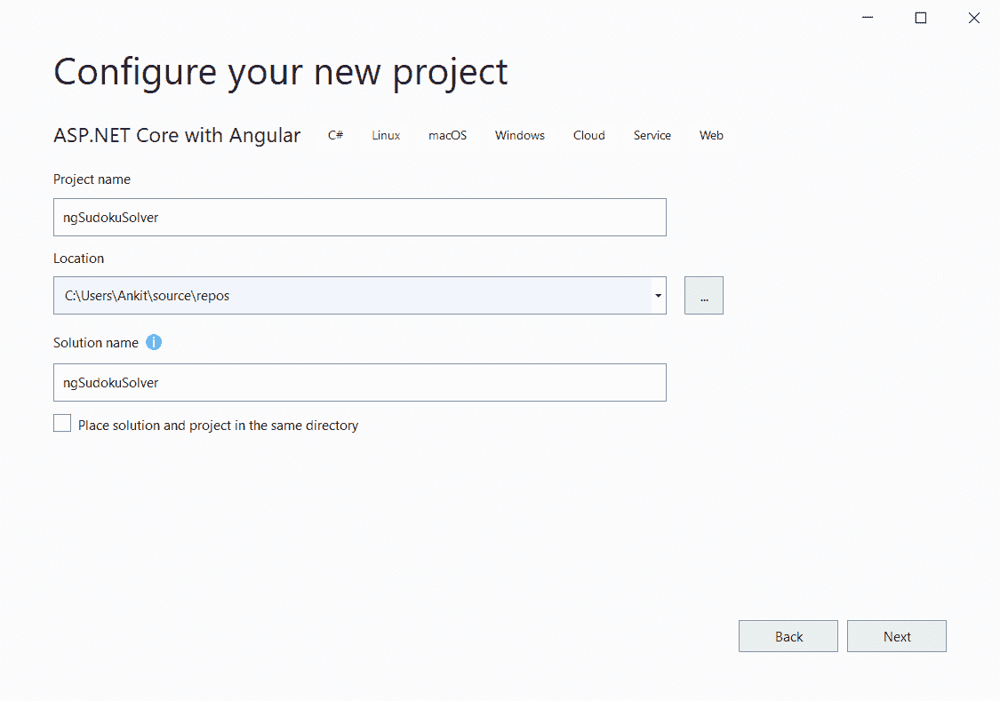

在“附加信息”页面上，选择目标框架作为。NET 5.0，并将身份验证类型设置为 none，如下图所示。

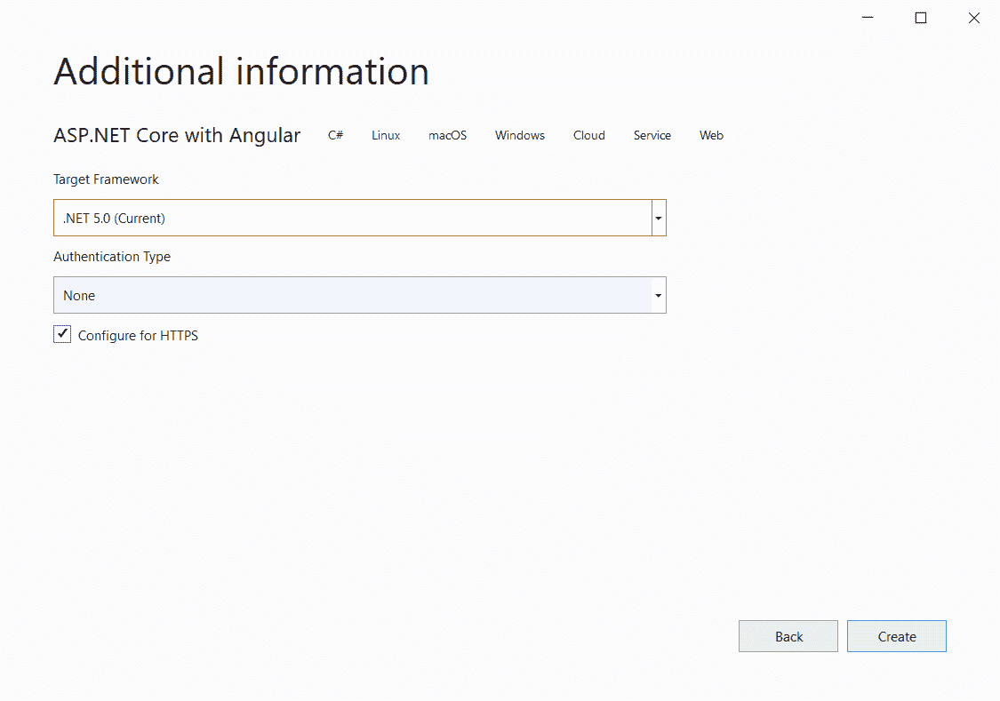

这将创建我们的项目。应用程序的文件夹结构如下所示:

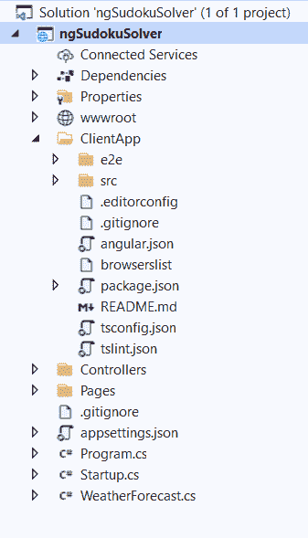

`ClientApp`文件夹包含我们应用的角度代码。控制器文件夹将包含我们的 API 控制器。角度组件存在于`ClientApp\src\app`文件夹中。

默认模板包含很少的角度组件。这些组件不会影响我们的应用程序，但是为了简单起见，我们将从`ClientApp/src/app`文件夹中删除`fetchdata`和`counter`文件夹。此外，从`app.module.ts`文件中删除这两个组件的引用。

## 如何安装所需的 NuGet 软件包

要安装软件包，请导航到工具>>获取软件包管理器>>软件包管理器控制台。它将在 Visual Studio 中打开包管理器控制台。

运行以下命令来安装 [Polly 库](https://www.nuget.org/packages/Polly)。这个库允许您以流畅和线程安全的方式表达弹性和瞬时故障处理策略，如重试、断路器、超时、隔板隔离和回退。

`Install-Package Polly -Version 7.2.1`

运行以下命令安装 [Newtonsoft。Json](https://www.nuget.org/packages/Newtonsoft.Json/) 包。

`Install-Package Newtonsoft.Json -Version 13.0.1`

## 如何创建 RetryMessage 处理程序

右键单击`ngSudokuSolver`项目并选择添加> >新文件夹。将文件夹命名为模型。

同样，右键单击 Models 文件夹并选择 Add >> Class 来添加一个新的类文件。将您的班级名称设为`HttpRetryMessageHandler.cs`，然后单击“添加”。

将下面的代码放在这个类中。

```
 using Newtonsoft.Json;
using Polly;
using System;
using System.Net.Http;
using System.Threading;
using System.Threading.Tasks;

namespace ngSudokuSolver.Models
{
    public class HttpRetryMessageHandler : DelegatingHandler
    {
        public HttpRetryMessageHandler(HttpClientHandler handler) : base(handler) { }

        protected override Task<HttpResponseMessage> SendAsync(
            HttpRequestMessage request,
            CancellationToken cancellationToken) =>
            Policy
                .Handle<HttpRequestException>()
                .Or<TaskCanceledException>()
                .OrResult<HttpResponseMessage>(x =>
                {
                    string result = x.Content.ReadAsStringAsync().GetAwaiter().GetResult();
                    dynamic array = JsonConvert.DeserializeObject(result);

                    if (array["status"] == "running")
                    {
                        return true;
                    }
                    else
                    {
                        return false;
                    }
                })
                .WaitAndRetryAsync(7, retryAttempt => TimeSpan.FromSeconds(Math.Pow(2, retryAttempt)))
                .ExecuteAsync(() => base.SendAsync(request, cancellationToken));
    }
} 
```

我们将使用 RetryMessageHandler 来重试`sendAsync`调用。如果 HttpResponseMessage 的状态为“正在运行”,我们将重试 HTTP 调用。

最大重试次数设置为 7。每次重试时，我们都会将等待时间增加 2 的幂次。如果已达到最大重试次数，HttpResponseMessage 仍未成功，我们将返回 false。

## 如何添加 FormRecognizer 控制器

现在，我们将向我们的应用程序添加一个新的控制器。

右键单击控制器文件夹并选择添加>>新项目。将会打开“添加新项目”对话框。

从左侧面板中选择“Visual C#”，然后从模板面板中选择“API Controller-Empty”，并将名称设为`FormRecognizerController.cs`。点击添加。参考下图。

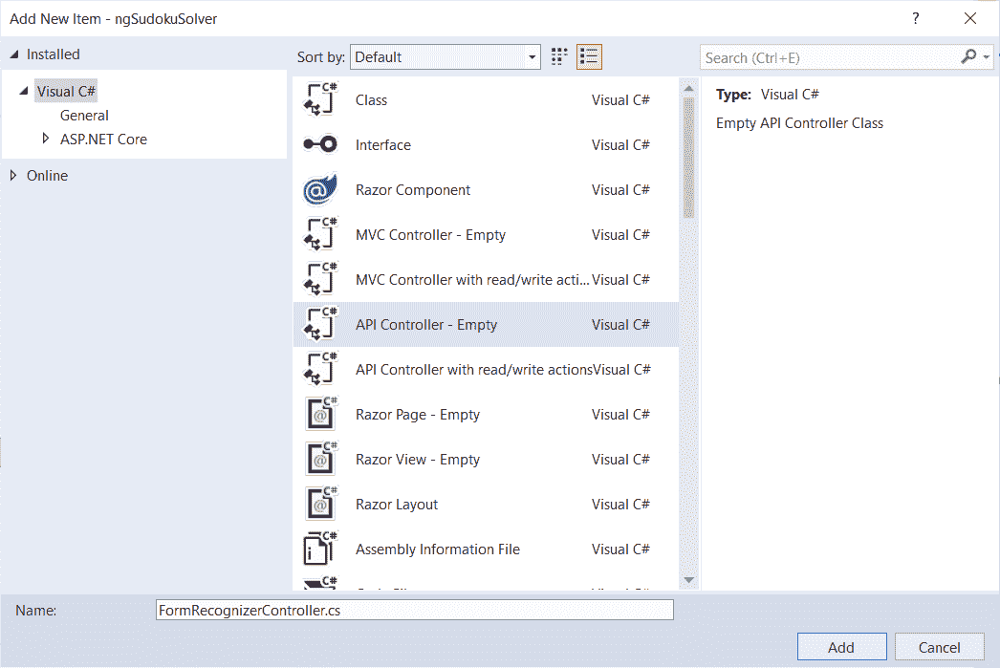

将下面的代码放在这个类中。

```
using Microsoft.AspNetCore.Mvc;
using Newtonsoft.Json;
using Newtonsoft.Json.Linq;
using ngSudokuSolver.Models;
using System;
using System.Collections.Generic;
using System.IO;
using System.Linq;
using System.Net.Http;
using System.Net.Http.Headers;
using System.Threading.Tasks;

namespace ngSudokuSolver.Controllers
{
    [Produces("application/json")]
    [Route("api/[controller]")]
    public class FormRecognizerController : ControllerBase
    {
        static string endpoint;
        static string apiKey;

        public FormRecognizerController()
        {
            endpoint = "https://sudokusolver.cognitiveservices.azure.com/";
            apiKey = "a9f75796b3ba49bdade48eb3b905cb0e";
        }

        [HttpPost, DisableRequestSizeLimit]
        public async Task<string[][]> Post()
        {
            try
            {
                string[][] sudokuArray = GetNewSudokuArray();

                if (Request.Form.Files.Count > 0)
                {
                    var file = Request.Form.Files[Request.Form.Files.Count - 1];

                    if (file.Length > 0)
                    {
                        var memoryStream = new MemoryStream();
                        file.CopyTo(memoryStream);
                        byte[] imageFileBytes = memoryStream.ToArray();
                        memoryStream.Flush();

                        string SudokuLayoutJSON = await GetSudokuBoardLayout(imageFileBytes);
                        if (SudokuLayoutJSON.Length > 0)
                        {
                            sudokuArray = GetSudokuBoardItems(SudokuLayoutJSON);
                        }
                    }
                }

                return sudokuArray;
            }
            catch
            {
                throw;
            }
        }

        static async Task<string> GetSudokuBoardLayout(byte[] byteData)
        {
            HttpClient client = new();
            client.DefaultRequestHeaders.Add("Ocp-Apim-Subscription-Key", apiKey);
            string uri = endpoint + "formrecognizer/v2.1-preview.3/layout/analyze";
            string LayoutJSON = string.Empty;

            using (ByteArrayContent content = new(byteData))
            {
                HttpResponseMessage response;
                content.Headers.ContentType = new MediaTypeHeaderValue("image/png");
                response = await client.PostAsync(uri, content);

                if (response.IsSuccessStatusCode)
                {
                    HttpHeaders headers = response.Headers;

                    if (headers.TryGetValues("Operation-Location", out IEnumerable<string> values))
                    {
                        string OperationLocation = values.First();
                        LayoutJSON = await GetJSON(OperationLocation);
                    }
                }
            }
            return LayoutJSON;
        }

        static async Task<string> GetJSON(string endpoint)
        {
            using var client = new HttpClient(new HttpRetryMessageHandler(new HttpClientHandler()));
            var request = new HttpRequestMessage();
            request.Method = HttpMethod.Get;
            request.RequestUri = new Uri(endpoint);

            client.DefaultRequestHeaders.Add("Ocp-Apim-Subscription-Key", apiKey);

            var response = await client.SendAsync(request);
            var result = response.Content.ReadAsStringAsync().GetAwaiter().GetResult();

            return result;
        }

        static string[][] GetSudokuBoardItems(string LayoutData)
        {
            string[][] sudokuArray = GetNewSudokuArray();
            dynamic array = JsonConvert.DeserializeObject(LayoutData);
            int countOfCells = ((JArray)array?.analyzeResult?.pageResults[0]?.tables[0]?.cells).Count;

            for (int i = 0; i < countOfCells; i++)
            {
                int rowIndex = array.analyzeResult.pageResults[0].tables[0].cells[i].rowIndex;
                int columnIndex = array.analyzeResult.pageResults[0].tables[0].cells[i].columnIndex;

                sudokuArray[rowIndex][columnIndex] = array.analyzeResult.pageResults[0].tables[0].cells[i]?.text;
            }
            return sudokuArray;
        }

        static string[][] GetNewSudokuArray()
        {
            string[][] sudokuArray = new string[9][];

            for (int i = 0; i < 9; i++)
            {
                sudokuArray[i] = new string[9];
            }

            return sudokuArray;
        }
    }
} 
```

在该类的构造函数中，我们已经初始化了 formrecognizer API 的键和端点 URL。

Post 方法将接收图像数据作为请求主体中的文件集合，并返回一个二维数组。我们将把图像数据转换成一个字节数组，并调用`GetSudokuBoardLayout`方法。如果我们得到一个成功的响应，并且 JSON 结果不为空，我们将调用`GetSudokuBoardItems`方法。

在`GetSudokuBoardLayout`方法中，我们将实例化一个新的 HttpClient。我们将在请求的头部传递订阅密钥。

当我们使用 formrecognizer API 时，我们将获得一个状态代码 202。这表示服务已经接受请求，稍后将开始处理。

该响应包括“操作位置”报头。“Operation-Location”字段包含我们应该用来获取 formrecognizer 操作结果的 URL。标题中提到的网址将在 48 小时后过期。

要使 formrecognizer 服务的结果可用，需要一定的时间，具体取决于文本的长度。

这是我们的 RetryMessageHandler 将被利用的地方。我们将从头部获取 URL，并调用`GetJSON`方法来获取 JSON 结果。

在`GetJSON`方法中，我们创建 HttpClient 并用我们的自定义`HttpRetryMessageHandler`初始化它。该方法将以字符串形式返回 JSON 响应。

`GetSudokuBoardItems`方法将接受 JSON 字符串。然后，它将遍历 JSON 字符串的 tables 属性，准备二维的`sudokuArray`。

## 现在让我们来看看应用程序的客户端

客户端的代码可以在 ClientApp 文件夹中找到。我们将使用 Angular CLI 来处理客户端代码。

> 使用 Angular CLI 不是强制性的。我在这里使用 Angular CLI，因为它用户友好且简单明了。如果您不想使用 CLI，则可以手动创建组件和服务的文件。

导航到机器中的`ngSudokuSolver\ClientApp`文件夹，打开命令窗口。我们将在此窗口中执行所有 Angular CLI 命令。

## 如何安装角形材料

运行以下命令将角度材质添加到项目中。

`ng add @angular/material`

此命令会将角度材质安装到您的项目中，然后询问以下问题以确定要包括哪些功能:

*   选择一个预构建的主题名称，或者为自定义主题选择“custom ”:我们将选择靛蓝/粉色主题。
*   设置全局角度材料排版样式？(是/否):是
*   为有角度的材质设置浏览器动画？(是/否):是

请参考下图:

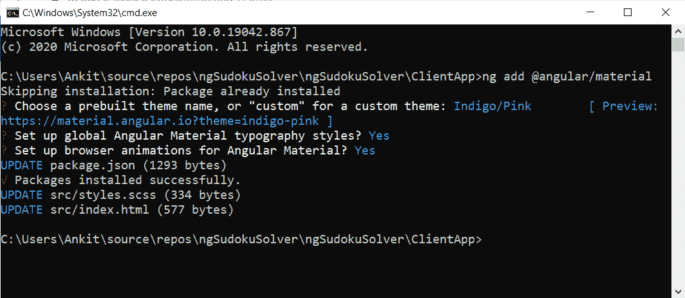

## 如何添加角形材料模块

运行以下命令创建一个新模块。

`ng g m ng-material`

打开`src\app\ng-material\ng-material.module.ts`文件，将下面的代码放入其中。

```
import { NgModule } from '@angular/core';
import { CommonModule } from '@angular/common';
import { MatButtonModule } from '@angular/material/button';
import { MatCardModule } from '@angular/material/card';
import { MatInputModule } from '@angular/material/input';
import { MatToolbarModule } from '@angular/material/toolbar';
import { MatDividerModule } from '@angular/material/divider';
import { MatIconModule } from '@angular/material/icon';

const materialModules = [
  MatButtonModule,
  MatCardModule,
  MatInputModule,
  MatToolbarModule,
  MatDividerModule,
  MatIconModule,
];

@NgModule({
  declarations: [],
  imports: [CommonModule, ...materialModules],
  exports: [...materialModules],
})
export class NgMaterialModule {} 
```

我们正在导入我们将在此应用中使用的角形材料组件所需的所有模块。用于角形材料的独立模块将使应用程序易于维护。

导入`app.module.ts`文件中的`NgMaterialModule`，如下图所示:

```
import { NgMaterialModule } from './ng-material/ng-material.module';

@NgModule({
	...
	imports: [
		...
		NgMaterialModule,
	],
}) 
```

## 如何配置应用程序的导航栏

打开`nav-menu.component.html`，把下面的代码放进去。

```
<mat-toolbar color="primary" class="mat-elevation-z2">
  <mat-toolbar-row>
    <div>
      <button mat-button [routerLink]='["/"]'>
        <mat-icon>book</mat-icon> Sudoku Solver
      </button>
    </div>
  </mat-toolbar-row>
</mat-toolbar> 
```

我们已经添加了材质工具栏和一个链接到应用程序基本路径的按钮。

## 如何创建表单识别器服务

我们将创建一个角度服务，该服务将调用 Web API 端点并将响应传递给我们的组件。运行以下命令。

`ng g s services\form-recognizer`

该命令将创建一个名为 services 的文件夹，然后在其中创建以下两个文件:

*   form-recognizer . service . ts-服务类文件。
*   form-recognizer . service . spec . ts—服务的单元测试文件。

打开`form-recognizer.service.ts`文件，将下面的代码放入其中。

```
import { Injectable } from '@angular/core';
import { HttpClient } from '@angular/common/http';

@Injectable({
  providedIn: 'root',
})
export class FormRecognizerService {
  baseURL: string;

  constructor(private http: HttpClient) {
    this.baseURL = '/api/FormRecognizer';
  }

  getSudokuTableFromImage(image: FormData) {
    return this.http.post(this.baseURL, image);
  }
} 
```

我们已经定义了一个变量 baseURL，它将保存我们的 API 的端点 URL。我们将在构造函数中初始化 baseURL，并将其设置为`FormRecognizerController`的端点。

`getSudokuTableFromImage`方法将向`FormRecognizerController`发送一个 Post 请求，并提供 FormData 类型的参数。它将获取一个表示数独表中项目的二维数组。

## 如何更新主页组件

打开`home.component.html`，把下面的代码放进去。

```
<div class="container">
  <h1 class="display-4">Solve Sudoku using Azure AI</h1>
  <mat-divider></mat-divider>
  <div class="row mt-3">
    <div class="col-md-6">
      <mat-card class="mat-elevation-z4">
        <mat-card-content>
          <table>
            <tr *ngFor="let row of gameBoard">
              <td *ngFor="let col of gameBoard">
                {{game[row][col]}}
              </td>
            </tr>
          </table>
        </mat-card-content>
        <mat-card-actions>
          <button type="button" mat-raised-button color="primary" (click)="SolveSudoku()"> Solve Sudoku </button>
        </mat-card-actions>
      </mat-card>
    </div>
    <div class="col-md-6">
      <div class="image-container">
        
      </div>
      <input type="file" (change)="uploadImage($event)" />
      <hr />
      <button mat-raised-button color="accent" (click)="GetSudokuTable()">
        <span *ngIf="loading" class="spinner-border spinner-border-sm mr-1"></span>Extract Sudoku Table
      </button>
    </div>
  </div>
</div> 
```

我们已经创建了一个 9x9 的表来表示数独板。我们已经定义了一个文件上传控件，允许我们上传图像。上传图像后，将使用``元素显示图像的预览。

点击“提取数独表”按钮将从图像中提取数独的内容，并部分填充表格。点击“解决数独”将解决数独，并用结果更新表格。

打开`home.component.ts`文件，将下面的代码放入其中。

```
import { Component, OnDestroy, OnInit } from '@angular/core';
import { Subject } from 'rxjs';
import { FormRecognizerService } from '../services/form-recognizer.service';
import { takeUntil } from 'rxjs/operators';

@Component({
  selector: 'app-home',
  templateUrl: './home.component.html',
  styleUrls: ['./home.component.scss'],
})
export class HomeComponent implements OnDestroy {
  gameBoard = [0, 1, 2, 3, 4, 5, 6, 7, 8];
  loading = false;
  imageFile;
  imagePreview;
  maxFileSize: number;
  isValidFile = true;
  status: string;
  DefaultStatus: string;
  imageData = new FormData();
  game = new Array(9);
  private unsubscribe$ = new Subject();

  constructor(private formRecognizerService: FormRecognizerService) {
    this.DefaultStatus = 'Maximum size allowed for the image is 4 MB';
    this.status = this.DefaultStatus;
    this.maxFileSize = 4 * 1024 * 1024; // 4MB

    for (var i = 0; i < this.game.length; i++) {
      this.game[i] = new Array(9);
    }
  }

  uploadImage(event) {
    this.imageFile = event.target.files[0];
    if (this.imageFile.size > this.maxFileSize) {
      this.status = `The file size is ${this.imageFile.size} bytes, this is more than the allowed limit of ${this.maxFileSize} bytes.`;
      this.isValidFile = false;
    } else if (this.imageFile.type.indexOf('image') == -1) {
      this.status = 'Please upload a valid image file';
      this.isValidFile = false;
    } else {
      const reader = new FileReader();
      reader.readAsDataURL(event.target.files[0]);
      reader.onload = () => {
        this.imagePreview = reader.result;
      };
      this.status = this.DefaultStatus;
      this.isValidFile = true;
    }
  }

  GetSudokuTable() {
    if (this.isValidFile) {
      this.loading = true;
      this.imageData.append('imageFile', this.imageFile);

      this.formRecognizerService
        .getSudokuTableFromImage(this.imageData)
        .pipe(takeUntil(this.unsubscribe$))
        .subscribe(
          (result: any) => {
            this.game = result;
            this.loading = false;
          },
          () => {
            console.error();
            this.loading = false;
          }
        );
    }
  }

  SolveSudoku() {
    this.sudokuSolver(this.game);
  }

  ngOnDestroy() {
    this.unsubscribe$.next();
    this.unsubscribe$.complete();
  }

  private sudokuSolver(data) {
    for (let i = 0; i < 9; i++) {
      for (let j = 0; j < 9; j++) {
        if (data[i][j] == '') {
          for (let k = 1; k <= 9; k++) {
            if (this.isSudokuValid(data, i, j, k)) {
              data[i][j] = `${k}`;
              if (this.sudokuSolver(data)) {
                return true;
              } else {
                data[i][j] = '';
              }
            }
          }
          return false;
        }
      }
    }
    return true;
  }

  private isSudokuValid(board, row, col, k) {
    for (let i = 0; i < 9; i++) {
      const m = 3 * Math.floor(row / 3) + Math.floor(i / 3);
      const n = 3 * Math.floor(col / 3) + (i % 3);
      if (board[row][i] == k || board[i][col] == k || board[m][n] == k) {
        return false;
      }
    }
    return true;
  }
} 
```

我们将在`HomeComponent`的构造函数中注入 formRecognizerService，并为构造函数中允许的最大图像大小设置一条消息和一个值。我们还将初始化二维数组来保存数独的值。

上传图像时将调用`uploadImage`方法。我们将检查上传的文件是否是有效的图像，是否在允许的大小范围内。我们将使用 FileReader 对象处理图像数据。readAsDataURL 方法将读取上传文件的内容。

当读取操作成功完成时，将触发 reader.onload 事件。imagePreview 的值将被设置为 fileReader 对象返回的结果，该对象的类型为 ArrayBuffer。

在`GetSudokuTable`方法中，我们将把图像文件附加到 FormData 类型的变量中。我们将调用服务的`getSudokuTableFromImage`,并将结果绑定到游戏数组。

`sudokuSolver`方法将接受数独板作为参数。然后我们将在回溯算法的帮助下解决数独板。

## 执行演示

按 F5 启动应用程序。上传数独表的图片。点击“提取数独表”按钮。它将从图像中提取内容，并填充左侧的表格。请参考下图:


点击“解决数独”按钮。你可以在 UI 上看到数独的最终结果。请参考下图:

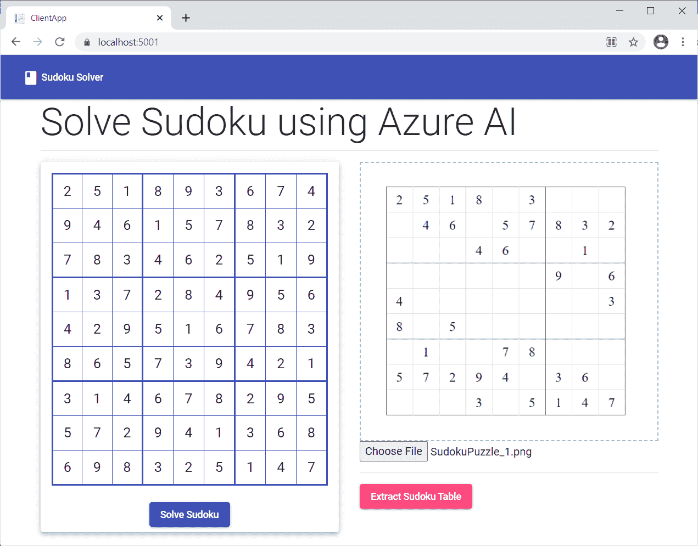

## **总结**

我们已经使用 Angular 和 Azure 表单识别器服务创建了一个数独求解应用程序。该应用程序可以从用户上传的数独板图像中提取数据。然后我们实现回溯来解决数独。我们使用了棱角分明的材料来设计应用程序。

从 [GitHub](https://github.com/AnkitSharma-007/Azure-AI-Sudoku-solver) 中获取源代码，并进行试验，以便更好地理解。

## 请参见

*   [使用角度和天蓝色计算机视觉的光学字符阅读器](https://ankitsharmablogs.com/optical-character-reader-using-angular-and-azure-computer-vision/)
*   [使用 Blazor 和 Azure 认知服务的多语言翻译](https://ankitsharmablogs.com/multi-language-translator-using-blazor-and-azure-cognitive-services/)
*   [服务器端 Blazor 应用中的脸书认证和授权](https://ankitsharmablogs.com/facebook-authentication-and-authorization-in-server-side-blazor-app/)
*   [使用 Heroku 和 GitHub 持续部署 Angular App](https://ankitsharmablogs.com/continuous-deployment-for-angular-app-using-heroku-and-github/)
*   [使用 Blazor 实现无服务器化](https://ankitsharmablogs.com/going-serverless-with-blazor/)

如果你喜欢这篇文章，请分享给你的朋友。你也可以在 [Twitter](https://twitter.com/ankitsharma_007) 和 [LinkedIn](https://www.linkedin.com/in/ankitsharma-007/) 上与我联系。

最初发表于[https://ankitsharmablogs.com/](https://ankitsharmablogs.com/)