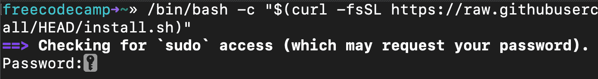
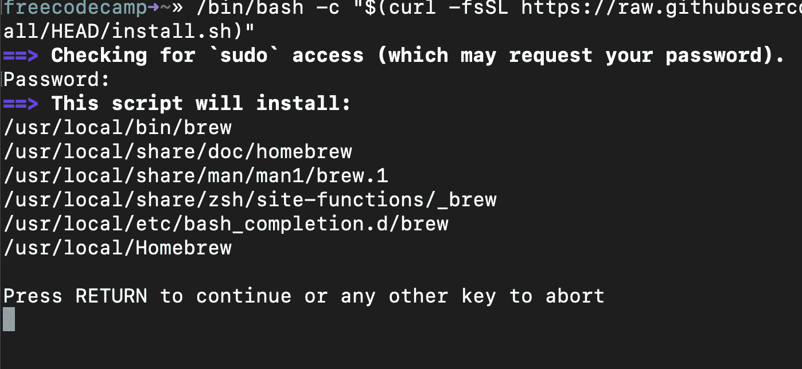
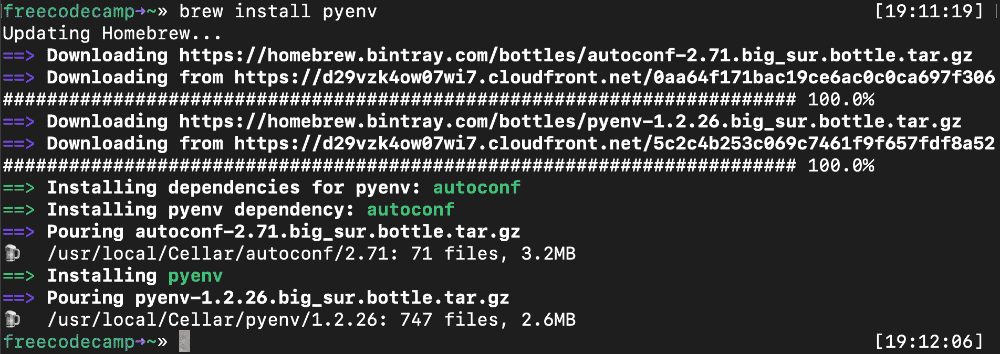
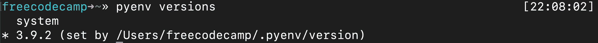
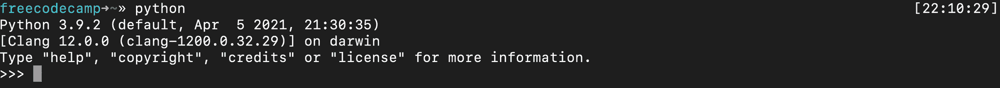

# 如何在 Mac 上安装 Python 3–Brew 安装更新教程

> 原文：<https://www.freecodecamp.org/news/python-version-on-mac-update/>

MacOS 预装了 Python。但它是 Python 2.7 版，现在已经被弃用(被 Python 开发者社区抛弃)。

整个 Python 社区现在都在使用 Python 3.x(撰写本文时的最新版本是 3.9)。而且 Python 4.x 也快出了，但是会完全向后兼容。

如果您尝试从 MacOS 终端运行 Python，您甚至会看到以下警告:


WARNING: Python 2.7 is not recommended. This version is included in macOS for compatibility with legacy software. Future versions of macOS will not include Python 2.7\. Instead, it is recommended that you transition to using 'python3' from within Terminal.

在苹果决定将 Python 3.x 设为默认之前，你必须自己安装它。

## 运行 Python 3 的一个命令

对于正在阅读这篇文章的一些人来说，这个命令可能就足够了。您可以使用这个命令运行 Python 3(末尾有 3)。

```
python3
```

如果这就是你来的目的，没关系。祝您愉快，编码愉快。

但是，如果您想要一个合适的 Python 版本控制系统来跟踪各种版本——并对您使用的版本进行精细控制——本教程将向您展示如何实现这一点。


By the way, if you're wondering why I keep referring to Python 3.x – the x is a stand-in for sub-versions (or point releases as developers call them.) This means any version of Python 3.

## 如何在 Mac 上安装家酿

首先你需要安装家酿，一个强大的 Mac 软件包管理器。

打开你的终端。你可以通过使用 MacOS spotlight (command+space)并输入“终端”来实现。

现在您在命令行中，您可以通过运行以下命令来安装最新版本的 Homebrew:

```
/bin/bash -c "$(curl -fsSL https://raw.githubusercontent.com/Homebrew/install/HEAD/install.sh)"
```

您的终端将要求超级用户级访问。您需要键入密码才能运行此命令。这与您登录 Mac 时键入的密码相同。键入并按回车键。



A screenshot of my heavily customized terminal. Your terminal will probably look different from this.

家酿将要求您确认您要安装以下。你必须按回车键才能继续。(或者，如果您感到害怕，请按任何其他键。)



## 如何安装 pyenv 来管理您的 Python 版本

现在让我们花点时间来安装 PyEnv。这个库将帮助您在不同版本的 Python 之间切换(万一您出于某种原因需要运行 Python 2.x，并且预计到 Python 4.0 的到来)。

运行以下命令:

```
brew install pyenv
```



PyEnv installing

现在你可以安装最新版本的 Python 了。

## 如何使用 pyenv 安装 Python 或更新您的 Python 版本

现在，您只需要运行以下命令:

```
pyenv install 3.9.2 
```

请注意，无论 Python 的最新版本是什么，您都可以用 3.9.2 来代替。例如，一旦 Python 4.0.0 问世，您可以运行以下代码:

```
pyenv install 4.0.0
```

## pyenv 安装故障排除

如果你遇到“C 编译器无法创建可执行文件”的错误，那么最简单的解决方法就是重新安装苹果的 Xcode。

Xcode 是苹果公司创造的一个工具，包括 Python 在 MacOS 上运行时使用的所有 C 库和其他工具。Xcode 是一个巨大的 11g 字节，但你会希望是最新的。你可能想在睡觉的时候运行这个。

你可以在这里获得苹果 Xcode 的最新版本。在升级到 MacOS Big Sur 之后，我不得不这样做，但是一旦我这样做了，下面所有的命令都工作正常。只要重新运行上面的`pyenv install 3.9.2`，它现在应该可以工作了。

## 如何为 pyenv (Bash 或 ZSH)设置 MacOS 路径

首先，您需要更新您的 Unix 路径，为 PyEnv 能够与您的系统交互铺平道路。

这是一篇关于 PATH 在 MacOS(和 Unix)中如何工作的长篇解释，直接从[pyenv GitHub repo](https://github.com/pyenv/pyenv)开始。

> 当您运行类似于`python`或`pip`的命令时，您的操作系统会在目录列表中搜索以该名称命名的可执行文件。这个目录列表位于一个名为`PATH`的环境变量中，列表中的每个目录用冒号分隔:

```
/usr/local/bin:/usr/bin:/bin 
```

> 从左到右搜索`PATH`中的目录，因此列表开头的目录中匹配的可执行文件优先于末尾的另一个。在这个例子中，将首先搜索`/usr/local/bin`目录，然后是`/usr/bin`，然后是`/bin`。

这是他们对垫片的解释。我再次详细引用它们，因为我自己真的无法更好地解释这一点。

> pyenv 的工作原理是在你的`PATH`前面插入一个*垫片*的目录:

```
$(pyenv root)/shims:/usr/local/bin:/usr/bin:/bin 
```

> 通过一个名为*的重新散列*的过程，pyenv 在该目录中维护垫片，以匹配每个已安装的 Python 版本中的每个 Python 命令— `python`、`pip`等等。

> Shims 是轻量级的可执行文件，它只是将您的命令传递给 pyenv。

下面是如何在 Bash 中更新你的`.bash_profile`(默认安装在 MacOS 中):

```
echo 'export PYENV_ROOT="$HOME/.pyenv"' >> ~/.bash_profile
```

然后运行:

```
echo 'export PATH="$PYENV_ROOT/bin:$PATH"' >> ~/.bash_profile
```

**注意:**如果您的`pyenv_root`文件夹中没有`/bin`目录(您可能只有一个`/shims`目录),您可能需要运行以下版本的命令:

```
`echo 'export PATH="$PYENV_ROOT/shims:$PATH"' >> ~/.bash_profile`
```

然后，您希望将 PyEnv Init 添加到您的终端。如果您正在使用 Bash，请运行以下命令(同样，这是 MacOS 的默认设置):

```
echo -e 'if command -v pyenv 1>/dev/null 2>&1; then\n  eval "$(pyenv init -)"\nfi' >> ~/.bash_profile 
```

现在，通过运行以下命令重置您的终端:

```
reset
```

## 如何为 ZSH 的 pyenv 或 OhMyZSH 设置 MacOS 路径

如果您不使用 Mac 默认的 Bash，而是像我一样使用 ZSH(或 OhMyZSH ),您将需要编辑`.zshrc`文件:

```
echo 'export PYENV_ROOT="$HOME/.pyenv"' >> ~/.zshrc
echo 'export PATH="$PYENV_ROOT/bin:$PATH"' >> ~/.zshrc
```

然后运行以下命令:

```
echo -e 'if command -v pyenv 1>/dev/null 2>&1; then\n  eval "$(pyenv init --path)"\n  eval "$(pyenv init -)"\nfi' >> ~/.zshrc
```

## 如何将 Python 的一个版本设置为全局默认(Bash 或 ZSH)

您可以将 Python 的最新版本设置为全局版本，这意味着当您运行 Python 应用程序时，它将是 Python MacOS 使用的默认版本。

运行以下命令:

```
pyenv global 3.9.2
```

同样，您可以用任何最新版本替换 3.9.2。

现在，您可以通过检查 Python 的全局版本来验证这一点:

```
pyenv versions
```

您应该会看到以下输出:



The * means that version is now the global default

## 最后一步:关闭终端并重启

重启终端后，运行`python`命令，启动 Python 的新版本，而不是旧版本。



Yay. Python 3.9.2 and no deprecation warnings

恭喜你。感谢您阅读本文，祝您编码愉快。