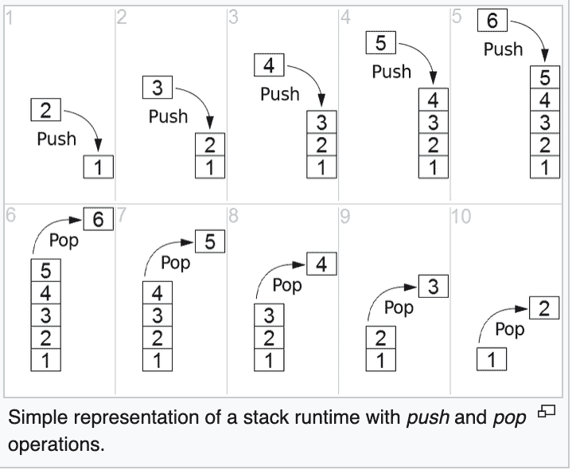
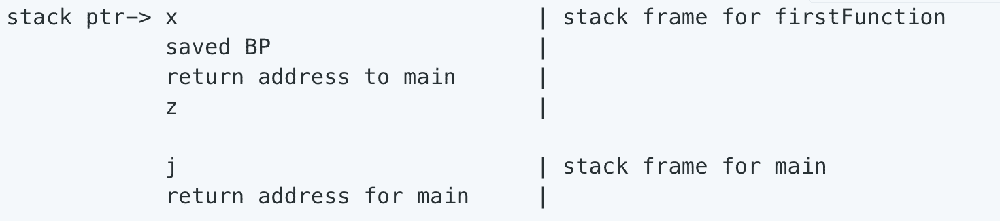

# 什么是缓冲区溢出攻击，以及如何阻止它

> 原文：<https://www.freecodecamp.org/news/buffer-overflow-attacks/>

当写入内存位置的信息超过分配给它的容量时，就会发生缓冲区溢出。这可能导致数据损坏、程序崩溃，甚至执行恶意代码。

虽然 C、C++和 Objective-C 是具有缓冲区溢出漏洞的主要语言(因为它们比许多解释语言更直接地处理内存)，但它们是互联网的基础。

即使代码是用“安全”语言编写的(如 Python)，如果它调用任何用 C、C++或 Objective C 编写的库，它仍然容易受到缓冲区溢出的攻击。

## 存储器分配

为了理解缓冲区溢出，了解一些程序如何分配内存是很重要的。在 C 程序中，可以在编译时在堆栈上分配内存，也可以在运行时在堆上分配内存。

在堆栈上声明一个变量:`int numberPoints = 10;`

或者，堆上:`int* ptr = malloc (10 * sizeof(int));`

缓冲区溢出可能发生在堆栈上(堆栈溢出)或堆上(堆溢出)。

一般来说，堆栈溢出比堆溢出更容易被利用。这是因为堆栈包含一系列嵌套的函数，每个函数都返回调用函数的地址，函数运行结束后，堆栈将返回该地址。这个返回地址可以被替换为指令来执行一段恶意代码。

由于堆很少存储这些返回地址，因此很难发起攻击(尽管并非不可能)。堆上的内存通常包含程序数据，并在程序运行时动态分配。这意味着堆溢出可能必须覆盖函数指针——比堆栈溢出更难，效率更低。

由于堆栈溢出是最常被利用的缓冲区溢出类型，我们将简要探究它们是如何工作的。

## 堆栈溢出

当一个可执行文件运行时，它在一个进程中运行，每个进程都有自己的堆栈。当进程执行 main 函数时，它会发现新的局部变量(将被推到堆栈顶部)和对其他函数的调用(这将创建一个新的 stackframe)。

为清楚起见，堆栈的示意图如下:



https://en.wikipedia.org/wiki/Stack_(abstract_data_type)

### 那么，什么是堆栈框架？

首先，调用栈基本上是特定程序的汇编代码。它是一堆变量和堆栈帧，告诉计算机执行指令的顺序。每个尚未执行完的函数都有一个 stackframe，当前正在执行的函数在栈顶。

为了跟踪这一点，计算机在内存中保存了几个指针:

*   **栈指针:**指向进程调用栈顶(或者最后一个推到栈上的项)。
*   **指令指针:**指向下一条要执行的 CPU 指令的地址。
*   **基址指针(BP):** (也称为框架指针)指向当前 stackframe 的基址。只要程序正在执行当前的堆栈帧，它就保持不变(尽管堆栈指针会改变)。

例如，给定以下程序:

```
int main() {
    int j = firstFunction(5);
    return 0;
}

int firstFunction(int z) {
    int x = 1 + z;
    return x;
}
```

在 firstFunction 被调用并且语句`int x = 1+z`被执行之后，调用堆栈看起来像这样:



这里，`main`调用了`firstFunction`(当前正在执行)，所以它在调用栈的顶部。返回地址是调用它的函数的内存地址(在创建堆栈帧时由指令指针保存)。仍在作用域内的局部变量也在调用堆栈上。当它们被执行并超出范围时，它们被“弹出”栈顶。

因此，计算机能够跟踪哪条指令需要执行，以及以何种顺序执行。堆栈溢出被设计成用它自己的恶意地址覆盖这些保存的返回地址之一。

**缓冲区溢出漏洞示例(C):**

```
int main() {
    bufferOverflow();
 }

 bufferOverflow() {
    char textLine[10];
    printf("Enter your line of text: ");
    gets(textLine);
    printf("You entered: ", textLine);
    return 0;
 }
```

这个简单的例子读入任意数量的数据(gets 将读入直到文件或换行符的末尾)。想想我们上面走过的调用堆栈，您就会明白为什么这是危险的。如果用户输入的数据多于该变量的赋值量，用户输入的字符串将覆盖调用堆栈上的下一个内存位置。如果足够长，甚至可能会覆盖调用函数的返回地址。

计算机对此的反应取决于栈是如何实现的，以及在特定系统中内存是如何分配的。对缓冲区溢出的响应可能是完全不可预测的，从程序错误、崩溃到恶意代码的执行。

## 为什么会发生缓冲区溢出？

缓冲区溢出之所以成为如此重要的问题，是因为 C 和 C++中的许多内存操作函数不执行任何边界检查。虽然缓冲区溢出现在已经广为人知，但它们也经常被利用(例如， [WannaCry](https://en.wikipedia.org/wiki/WannaCry_ransomware_attack) 利用了缓冲区溢出)。

当代码依赖于外部输入数据、对程序员来说太复杂而不容易理解其行为，或者当它在代码的直接范围之外具有依赖性时，缓冲区溢出是最常见的。

Web 服务器、应用服务器和 web 应用环境都容易受到缓冲区溢出的影响。

用解释型语言编写的环境是个例外，尽管解释器本身容易受到溢出的影响。

## 如何减轻缓冲区溢出

*   使用不易受这些问题影响的口译语言。
*   **避免使用不执行缓冲区检查的函数**(例如，在 C 中，使用 f gets()，而不是 gets())。
*   使用有助于识别不安全函数或错误的编译器。
*   **[使用](https://ritcsec.wordpress.com/2017/05/18/buffer-overflows-aslr-and-stack-canaries/) [加那利](http://www.cbi.umn.edu/securitywiki/CBI_ComputerSecurity/MechanismCanary.html)，**一个有助于防止缓冲区溢出的“警戒值”。它们被插入到堆栈中的返回地址之前，并在访问返回地址之前被检查。如果程序检测到金丝雀值的变化，它将中止进程，防止攻击者得逞。金丝雀值要么是随机的(因此，攻击者很难猜到)，要么是一个字符串，由于技术原因，它不可能被覆盖。
*   **重新排列局部变量**使标量变量(单个固定大小的数据对象)位于数组变量(包含多个值)之上。这意味着如果数组变量溢出，它们不会影响标量变量。这种技术与金丝雀值结合使用，有助于防止缓冲区溢出攻击得逞。
*   **通过设置 NX(不执行)位，使堆栈不可执行**，防止攻击者将外壳代码直接插入堆栈并在那里执行。这不是一个完美的解决方案，因为即使是不可执行的堆栈也可能成为缓冲区溢出攻击的受害者，比如 return-to-libc 攻击。当 stackframe 的返回地址被进程地址空间中已经存在的库地址替换时，就会发生这种攻击。此外，并非所有 CPU 都允许设置 NX 位。
*   **[【ASLR】(地址空间布局随机化)](https://en.wikipedia.org/wiki/Address_space_layout_randomization)** ，可以作为一般防御(以及针对 return-to-libc 攻击的特定防御)。这意味着每当一个库文件或其他函数被一个正在运行的进程调用时，它的地址都会被一个随机数移位。这使得几乎不可能将固定的进程内存地址与函数相关联，这意味着攻击者很难(如果不是不可能)知道从哪里调用特定的函数。在许多版本的 Linux、OS X 和 Android 中，ASLR 是默认开启的(可以在命令行中关闭)。

### 关于堆栈下溢的说明:

当同一个程序的两个部分以不同的方式处理同一块内存时，也可能存在缓冲区下溢漏洞。例如，如果你分配一个大小为 X 的数组，但是用一个大小为 x < X 的数组填充它，然后你试图检索所有的 X 字节，你很可能得到 X - x 字节的垃圾数据。

实际上，您可能已经提取了以前使用该内存时留下的数据。最好的情况是它是没有任何意义的垃圾，而最坏的情况是它是攻击者可能会滥用的敏感数据。

### 来源/延伸阅读:

*   [计算机与网络安全讲座，Avinash Kak](https://engineering.purdue.edu/kak/compsec/)
*   OWASP 缓冲区溢出
*   [堆栈 vs 堆](https://gribblelab.org/CBootCamp/7_Memory_Stack_vs_Heap.html)