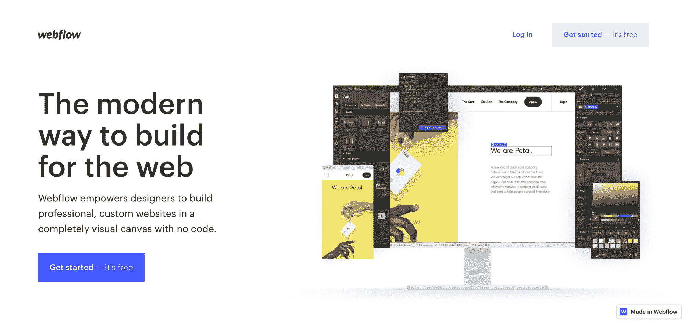
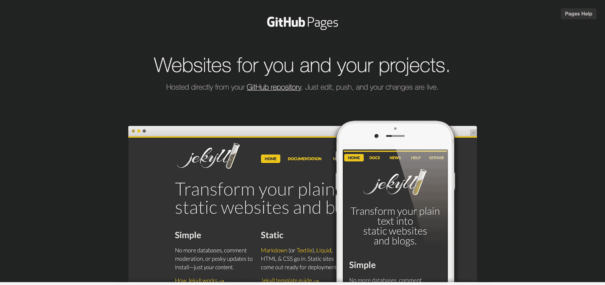
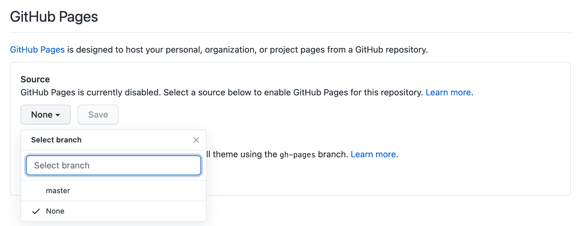
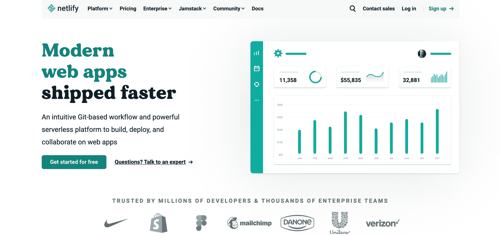
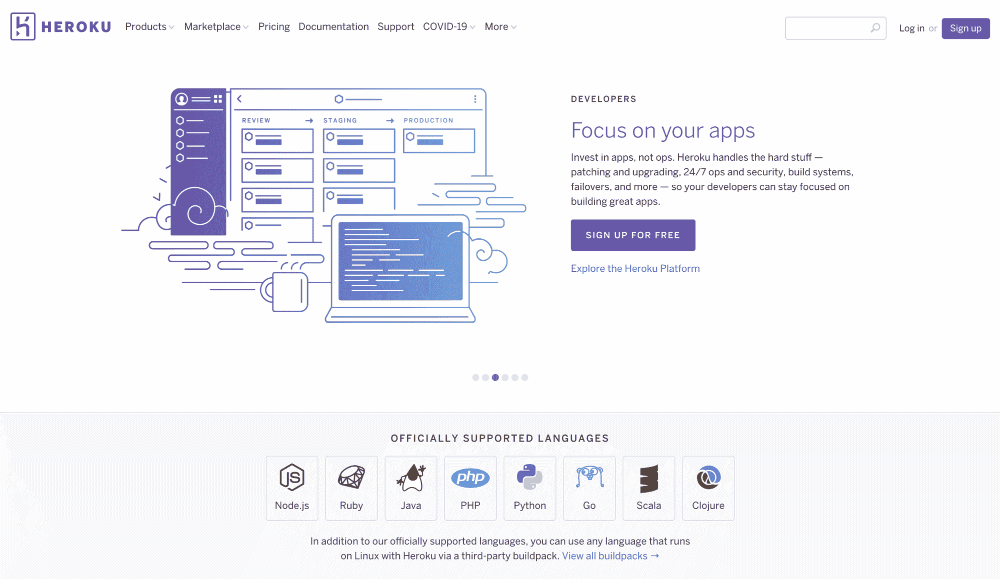
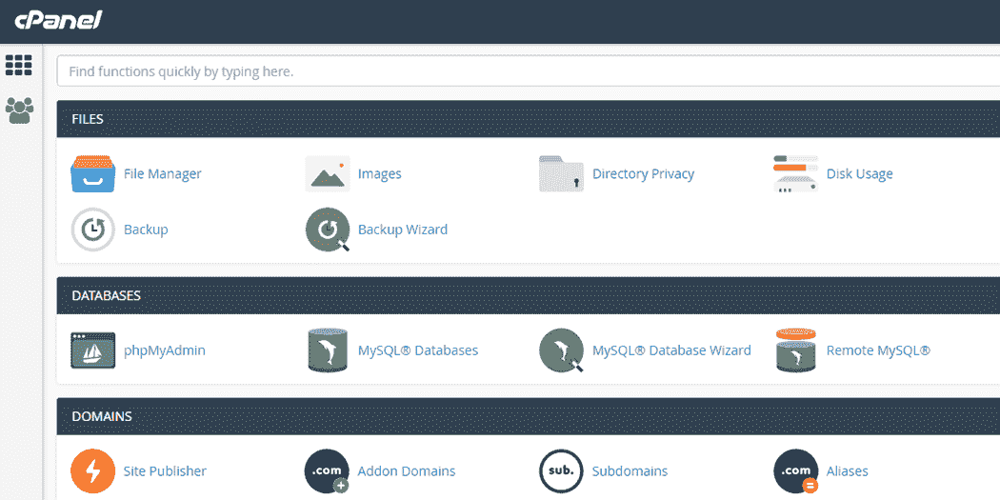
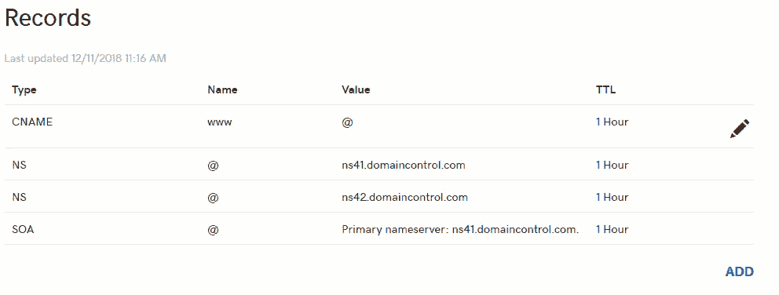

# 如何创建作品集网站——初学者开发指南

> 原文：<https://www.freecodecamp.org/news/beginners-guide-to-creating-a-portfolio-website/>

2021 年初，我决定改造我的投资组合网站[，就像我每隔一年做的那样。](https://www.jemimaabu.com)

如果你以前从来没有部署过网站，弄清楚如何让你的网站上线会很困惑。像获得域名、上传必要的文件和选择网站托管地这样的事情会让人不知所措。

我记得第一次建立我的网站有多困难，我想帮助其他人避免我犯的错误，所以我发了这条推特:

我得到的回复比我预期的多，所以我在二月份的每个周末安排了 9 次会议，每次 2 小时。

我的想法是，在二月底，我应该已经完成了我的投资组合设计，因为我认为帮助别人会确保我按照我的计划进行。那个计划没有成功，但是我在这个过程中学到了很多。

在二月底，我成功地帮助了 6 名开发人员(从初级到中级，男女比例为 1:2，来自 3 个不同的国家)以这样或那样的形式建立了他们的投资组合网站。我将在这里记录每节课的主要内容。

在这篇文章中，我们将涵盖关于建立你的投资组合网站你需要知道的一切——从购买域名到在线部署网站。所以让我们开始吧。

## 1)如何获得域名

域名是你网站的在线位置。这就像有了一个万维网的用户名，访问者在地址栏中输入这个用户名就可以访问你的网站。

域名由名称(如`google`)和扩展名(如`.com`)组成，它指向您正在部署的站点的特定 IP 地址。

从注册中心购买域名可以让您确定该域名指向的位置。有多个注册处，你可以从那里购买域名，所以你应该做你的研究，并决定哪一个适合你。

以下是我根据它们的特点推荐的一些域名注册中心:

1.  **[name cheap](https://shareasale.com/r.cfm?b=1197848&u=2778801&m=46483&urllink=&afftrack=0https://www.shareasale.com/r.cfm?u=2778801&m=46483&b=518798)**——这是一个比较受欢迎的平台，所以它有很多客户支持和无障碍设置。他们还提供免费的域名隐私。如果你想快速购买域名，我推荐你使用这个。
2.  **[blue host](https://www.bluehost.com/track/jemabu)**–blue host 提供了很好的主机选择，并带有内置的 WordPress 平台。我个人过去曾在一些客户网站上使用过 Bluehost，我非常喜欢它提供的简洁界面和入门指南。我推荐使用 Bluehost 来托管 WordPress 站点。
3.  **–name silo 的一个主要好处是[他们提供免费的附加服务](https://www.namesilo.com/pricing?rid=17e7856ns)，如 WHOIS 隐私(保护您的注册信息安全)和电子邮件转发(从`me@mysite.com`向您的实际电子邮件地址发送电子邮件)。如果你的域名需要很多额外的插件，我推荐你使用这个。**
4.  **[**Netim**](https://www.netim.com/?partnerid=AJ2220)**–**我推荐使用 Netim 购买地理域名，如`.eu`或`.me`。一个有趣的选择是购买一个以你名字的最后几个字符结尾的域名，例如`www.jemi.ma`。******

> ******购买域名时要小心隐藏的费用。许多注册机构倾向于提供非常便宜甚至免费的域名，但通常在续费方法中会有额外的费用。留意那些你可能不需要的附件。******

******结对编程课程中的一些开发者已经支付了`.com`域名的费用，但是大多数人没有域名，也没有兴趣购买，至少目前没有。******

******拥有自定义域名的好处是:******

*   ******它提高了你的搜索引擎优化排名******
*   ******当你给未来的雇主或客户发送链接时，看起来更专业。******

******域名提供商每年收取域名费用，一个`.com`域名可能每年花费 10 到 30 美元，这取决于任何额外的费用。******

******如果你还不习惯为域名付费，你可以选择免费域名。我们将在下一节探讨免费域名选项。******

## ******2)如何选择托管平台******

******当你建立一个网站时，你可以通过进入`localhost`或 index.html 在你的机器上访问它。然而，如果你想让其他人能够在互联网上访问你的网站，你需要把它上传到一个托管平台。******

******托管平台是互联网的`localhost`——它是每个人都可以访问的服务器。******

******大多数域名注册机构也提供托管服务，但是没有必要让你的域名和托管服务在同一个地方，因为大多数注册机构会收取额外的托管费用。一旦你购买了域名，你可以使用任何你喜欢的托管平台。******

******有许多主机平台提供免费主机和域名(附带平台域名)，你可以选择任何平台，这取决于你想如何构建你的投资组合。******

******让我们探讨以下选项。******

### ******如何在不写代码的情况下托管一个作品集网站******

********站台:[webflow.com](https://webflow.grsm.io/jemabu)********

********

****Webflow 是一个拖放式网站，让你只需编写很少甚至不需要编写代码就能创建漂亮的网站。****

****使用 Webflow，您可以通过使用仪表板上的 HTML 和 CSS 功能来创建令人惊叹的布局和动画，它带有内置的 CMS，因此您不必担心更新内容或存储图像。****

****Webflow 提供了一个带有`webflow.io`扩展名的自由域选项，例如`myportfolio.webflow.io`。使用此选项，您可以创建一个包含两个页面的静态站点。他们还有一个[展示项目的橱窗](https://webflow.grsm.io/jadsc)，你可以从中克隆；还有一个[在线论坛](https://webflow.grsm.io/jafrm)，在那里你可以得到大多数问题的答案。****

****我推荐 Webflow 给那些了解 CSS 布局和动画并且想要快速建立他们的站点的设计者和开发者。****

### ****如何托管用 HTML 和 CSS 构建的静态投资组合****

******平台**:[GitHub 页面 ](https://pages.github.com/)****

********

****GitHub Pages 是 GitHub 平台的一个特性，它允许你在一个`github.io`站点上显示你的库的代码——所以 URL 看起来像`my-portfolio.github.io`****

****GitHub 页面最适合静态网站(即使用 HTML 和 CSS 构建的网站，内容固定，不需要服务器交互或构建过程)。它的设置也非常简单，只需 10 分钟就能让你的网站运行起来。****

****要创建 GitHub 页面，您的存储库应该在根文件夹中包含一个`index.html`文件。然后，转到您的存储库的 Settings 页面，并在 Github Pages 部分选择您的主分支作为源。****

********

****这是大多数开发人员在结对编程会话中使用的方法，因为它花费的时间最少，并且几乎没有复杂性。我向希望快速部署静态站点的初学者推荐 Github 页面。****

### ****如何托管使用 React 或 Vue 框架的网站****

******平台:**[Netlify](https://www.netlify.com/)****

********

****如果你用一个需要构建过程的前端框架来构建你的网站，Netlify 是你最好的选择。它非常适合动态网站(即从服务器生成内容或具有需要脚本的功能的网站——如通过联系人表单发送消息),它也适用于静态网站。****

****Netlify 有很棒的文档，它提供了您在使用该网站时可能遇到的任何问题的信息。它也有改善你的网站的关键特性，比如 [Netlify Forms](https://www.netlify.com/products/forms/) ，它允许你在你的网站上建立一个联系表单，而不需要服务器端代码。****

****我目前使用 Netlify 来托管我的网站，到目前为止，它是我最喜欢的平台。我向那些想让他们的站点(静态或动态)在建立构建过程中没有任何麻烦的开发人员推荐它。****

### ****如何用后端服务器托管网站****

******平台:** [**英雄**](https://heroku.com)****

********

****如果您的 portfolio 站点需要来自后端服务器的数据(比如从 RESTful 应用程序获取项目列表)，那么您还需要部署该服务器，以便前端可以访问它。****

****Heroku 是一个平台，可以让你从八种支持的语言(包括 Node.js 和 Python)部署后端应用程序。它还允许您部署静态和动态前端站点，以便您可以创建两个项目-一个用于您的前端代码，另一个用于后端应用程序。****

****您可以访问 [Heroku 开发中心](https://devcenter.heroku.com/)了解更多 Heroku 入门信息。****

****我个人以前没有使用 Heroku 平台来部署后端应用程序，但是结对编程会议中的一个程序员使用了它，所以我想我也应该包括它。我向那些想在他们的投资组合中展示他们的前端和后端技能的全栈开发人员推荐它。****

## ****3)如何部署您的站点****

****部署一个站点意味着把你写的代码放到托管平台上。在较旧的平台上，您必须将代码和所有资源上传到 cPanel(基本上是托管平台的文件浏览器)。****

****

Source: **What Is cPanel Used For And Why Do I Need It? - A2Hosting****** 

****如今，网站已经变得比仅仅是`.html`文件复杂得多，因此它们需要不同的部署方法。****

****例如，如果您有一个 React 应用程序，那么每次将它部署到域中时，都需要构建项目(就像您如何在笔记本电脑上运行`npm start`来查看应用程序一样)。****

****根据您选择的托管平台，部署方法会有所不同。您可以从 Netlify ( [文档，此处为](https://docs.netlify.com/configure-builds/get-started/))和 Heroku ( [文档，此处为](https://devcenter.heroku.com/articles/github-integration))上的 Github 存储库中设置持续部署。这意味着每次您向存储库推送新的变更时，该变更都会反映在您的站点中。****

********

****如果您选择使用自定义域名，您需要将该域名链接到您的网站。例如，在 Netlify 上，你的应用程序默认创建有一个`netlify.app`扩展名，所以它看起来像`myportfolio.netlify.app`，但是你可以[设置一个自定义域名](https://docs.netlify.com/domains-https/custom-domains/)。你也可以在 Heroku 上设置一个[自定义域名。](https://devcenter.heroku.com/articles/custom-domains)****

****在这些平台上链接一个自定义域意味着你需要从你的域名提供商那里更新 DNS(域名系统)记录。DNS 允许用户用你的域名访问你的网站，例如用`portfolio.com`而不是像`127.0.0.1`这样的 IP 地址。你可以在这里阅读更多关于[域名系统的信息。](https://www.freecodecamp.org/news/what-is-dns/)****

****

Source: Add an A record - GoDaddy**** 

## ****4.如何为你的网站选择设计****

****会议期间我们讨论的另一个主题是选择设计。一些开发者已经建立了他们的网站，但是一些不知道什么样的布局。****

****说到选择作品集设计，我建议查看其他开发者的作品集，寻找如何构建网站的灵感和想法。这篇文章展示了 [**15 个 Web 开发者作品集**](https://www.freecodecamp.org/news/15-web-developer-portfolios-to-inspire-you-137fb1743cae/) 或者，如果你需要更多灵感，试试 [**63 个例子**](https://www.noupe.com/design/web-developer-portfolio-examples.html) 。****

****你也可以阅读这篇关于 **[的文章，将 5 个项目纳入你的前端投资组合](https://www.freecodecamp.org/news/coding-projects-to-include-in-your-frontend-portfolio/)** 以获得项目创意**。******

****确定你的作品集的目的是很重要的，而且要确保这个目的在你网站的每个部分都很明显。****

****例如，如果你试图用你的作品集去找工作，确保你在主页上突出了你的技能和经验，并包括行动号召，让人们看到你的简历或给你发信息。****

****如果你的作品集是为了给你带来自由职业者的客户，那么就把重点放在你以前做过的项目和其他客户的评论上。****

****

Source: https://www.bmediagroup.com/news/employ-adam/**** 

## ****结论****

****让我们总结一下我们在本文中所涉及的内容。要在线部署您的站点，您必须:****

1.  ****从域名提供商处购买域名。****
2.  ****选择一个托管平台，取决于你想如何建立你的网站。****
3.  ****通过更新域名提供商的 DNS 记录，将您的域名链接到您的托管平台。****
4.  ****根据他们的文档从你的主机平台设置你的站点的部署。****

****我写了这篇文章并提供了结对编程会议，因为我记得部署我的第一个网站是多么复杂。我还记得我犯了很多本可以避免的错误(比如，由于一堆我不需要的附加软件，我支付了 10 倍的费用来续费我的一个域名)，所以我希望你会发现这很有帮助。****

****如果你做了，或者你有任何其他问题，你可以在 [Twitter](https://www.twitter.com/jemimaabu) 上告诉我，或者在我的[网站](https://www.jemimaabu.com#contact)上给我发消息。****