# 自由代码营的员工

> 原文：<https://www.freecodecamp.org/news/team/>

freeCodeCamp 社区在世界各地有成千上万的志愿者贡献者。

由于每月 7000 多人的慷慨捐赠，我们的非营利组织也有了几名工作人员的预算。这些人负责代码库、课程和课外学习资源。

所有这些人都是从志愿贡献者开始的，随着时间的推移逐渐发展壮大。如果你也有兴趣成为一名贡献者，这里有[如何开始为 freeCodeCamp](https://contribute.freecodecamp.org) 做贡献。

以下是组成 freeCodeCamp 的人员。

### 来自美国俄勒冈州波特兰的艾比·雷恩梅尔([@艾比·雷恩](https://twitter.com/abbeyrenn))

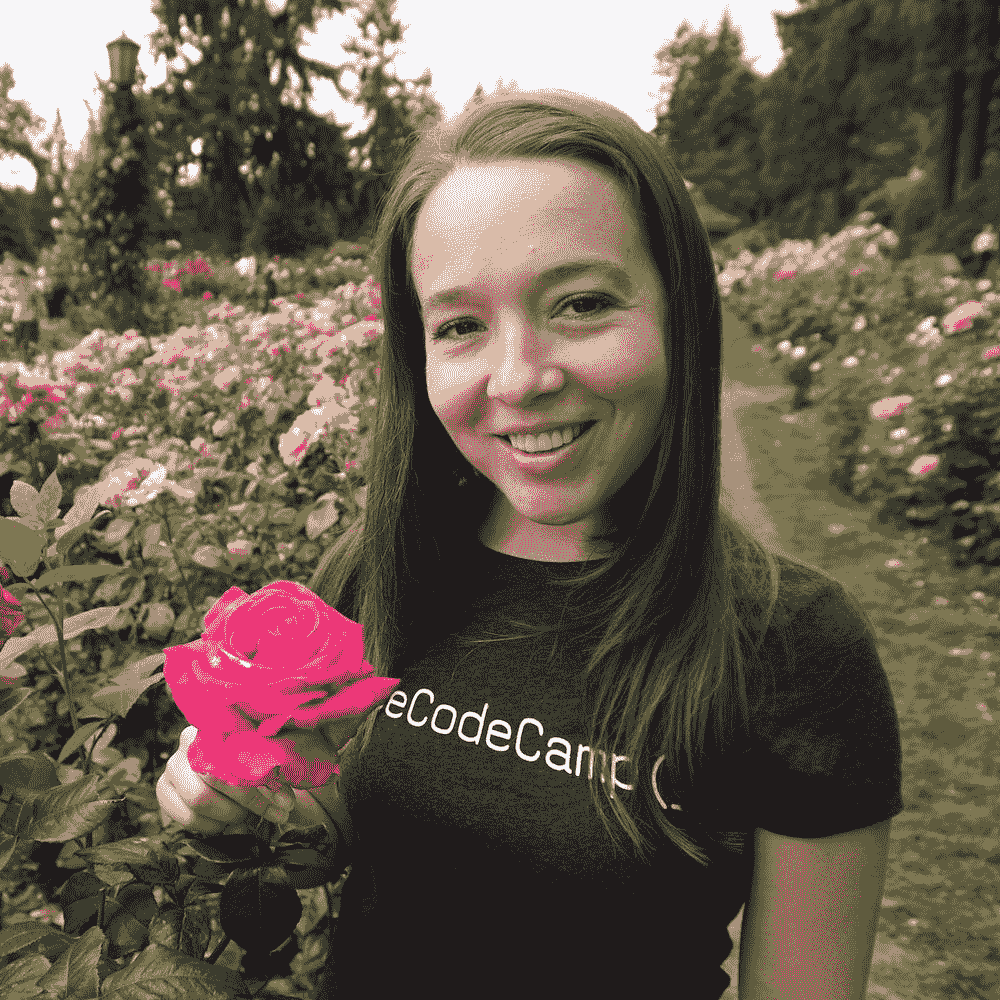

在接受考古学家培训并从事商业开发后，Abbey 发现了 freeCodeCamp。她自愿贡献自己的技能，帮助编辑数百份教程。她于 2018 年加入我们的工作人员。她现在监管 freeCodeCamp 的出版和社交媒体。她还为该出版物撰写了许多自己的教程。

### 来自土耳其伊斯坦布尔的 Ahmad Abdolsaheb([@ Abdolsaheb](https://twitter.com/Abdolsaheb)

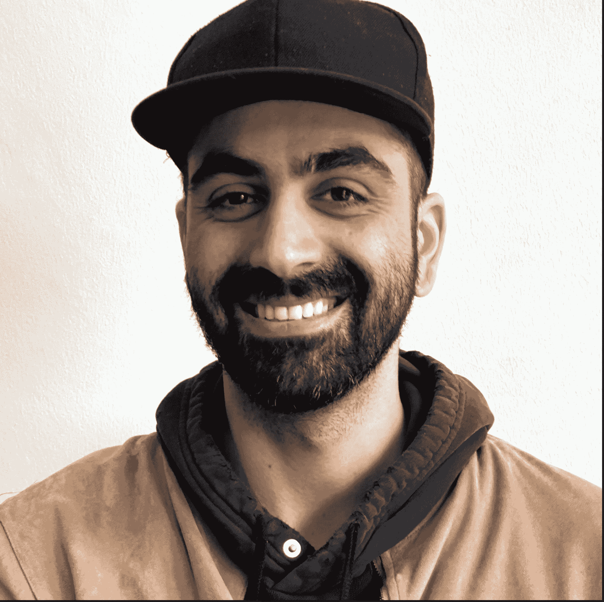

Ahmad 是 freeCodeCamp 的软件工程师、产品设计师和数据分析师。他热爱数学、色彩理论和信息架构。当他不工作时，他喜欢画画、阅读、力量训练和学习德语。

### 来自英国伦敦的艾莉森·尹( [@aliyooncreative](https://twitter.com/aliyooncreative) )

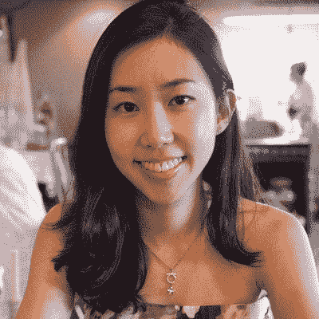

Alison 是一名 web 开发人员和演说家，热衷于帮助他人学习。

她成为伦敦人已经有几年了，但是在韩国出生和长大，并且在几个国家生活过。

她喜欢她的狗，做瑜伽，在她的办公桌前工作，沿着泰晤士河散步。

### 来自乌克兰捷尔诺波尔的 anastasiia Buievych([@ anisiangel](https://twitter.com/anisiangel?s=21&t=3yJxu9lXXPDyxB6WYhRsWg))

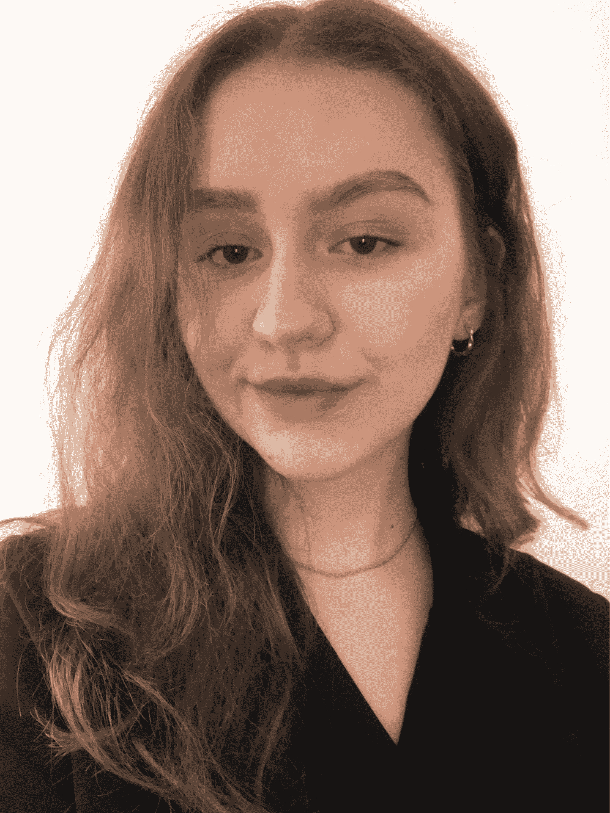

Anastasiia 领导乌克兰的本地化工作。她的目标是帮助他人学习、成长，并朝着他们的目标前进。闲暇时，她喜欢阅读、烹饪和探索周围的世界。

### 来自英国伦敦的 ania Kubow([@ ania _ Kubow](https://twitter.com/ania_kubow))

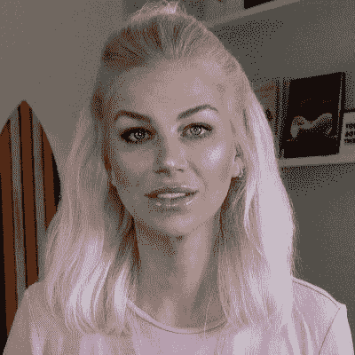

Ania Kubow 是 YouTube 上的一名软件开发人员和课程创建者。她喜欢通过制作复古视频游戏来教授代码。她出生在波兰。在她移居英国之前，她在阿联酋、泰国和新加坡长大。

### 来自比利时布鲁塞尔的阿克塞尔·罗菲([@阿克塞尔 _ 罗菲](https://twitter.com/Axel_Roffi))

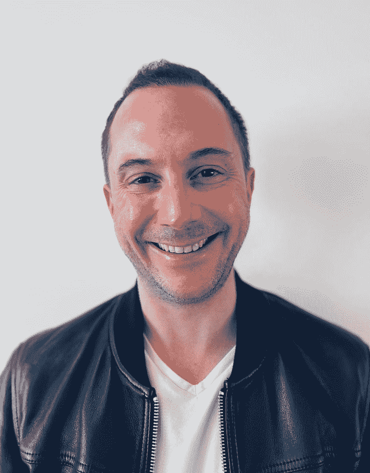

阿克塞尔·罗菲在法国巴黎出生并长大。商学院毕业后，他建立了一个自由软件开发实践。

2018 年，他开创了“快速休闲”餐厅特许经营业务。2021 年，他将自己的股权出售给商业伙伴，以重新专注于科技。

Axel 是几个区块链项目的早期采用者，他正在开发一个专注于智能合同开发的课程。他和妻子及两个孩子住在比利时的布鲁塞尔。他喜欢足球、拳击和阅读侦探小说。

### 来自美国密歇根州大急流城的博·卡恩斯([@博·卡恩斯](https://twitter.com/beaucarnes))

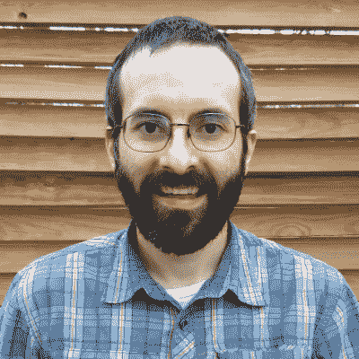

博在密歇根附近的学校做了多年的特殊教育教师。他现在经营着 freeCodeCamp 社区 YouTube 频道，并创建课程。当他不帮助推进 freeCodeCamp.org 的使命时，他喜欢带着儿子们冒险，玩棋盘游戏，玩杂耍，并在他的个人频道上制作机器人玩具视频。

### 来自尼日利亚科吉州洛科贾的博拉吉·阿约吉吉( [@iambolajiayo](https://twitter.com/iambolajiayo) )

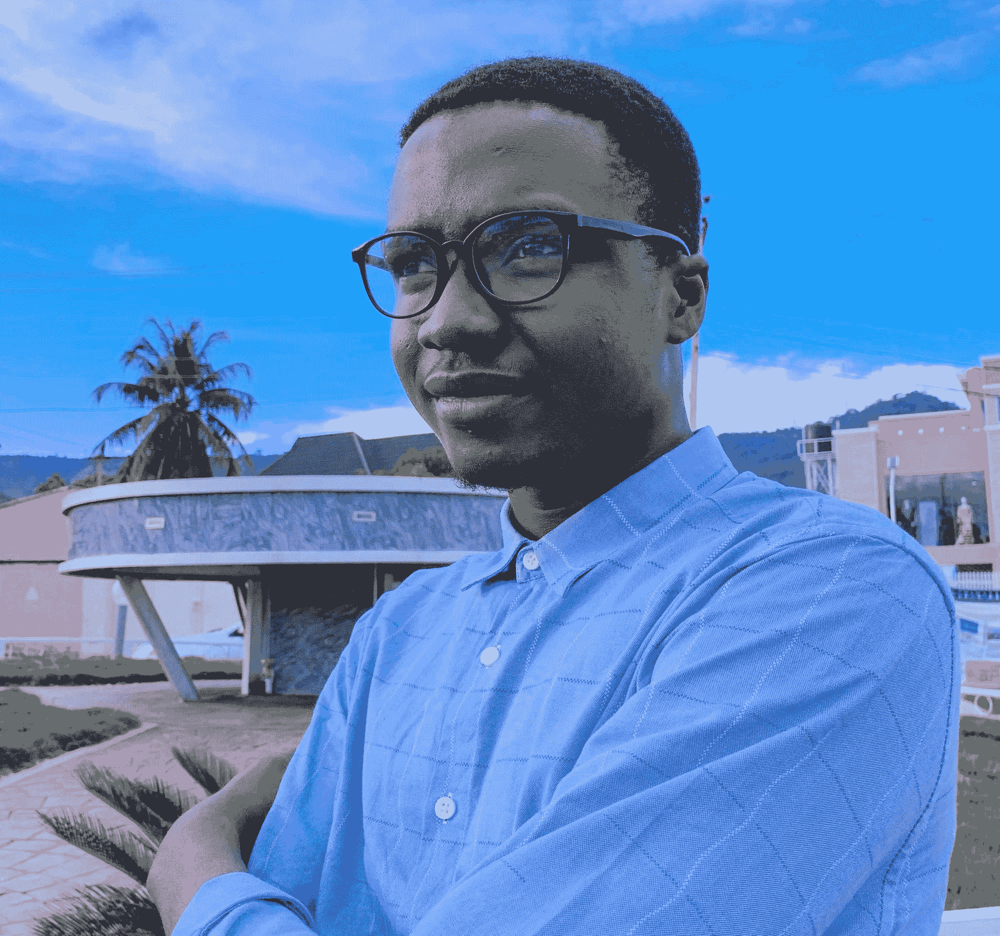

博拉吉是一名软件工程师和作家。他热衷于分享知识、文档、web 工程、Jamstack、headless commerce、社区和自由开源软件(FOSS)。博拉吉还在上大学，在学业允许的情况下，他为 freeCodeCamp 做贡献。

### 来自泰国曼谷的 chanin Nantasenamat([@ the data prof](https://www.twitter.com/thedataprof))

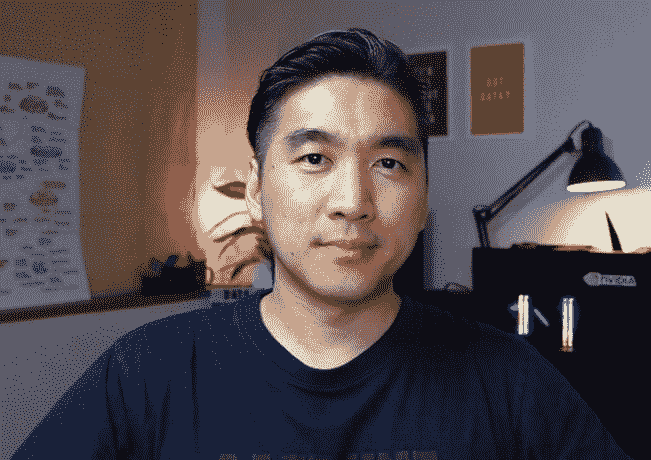

Chanin 在洛杉矶和加州尔湾长大，后来移居泰国。作为生物信息学副教授，他在计算药物发现方面进行教学和研究。在业余时间，他运营着两个 YouTube 频道，分别名为(1)数据教授和(2)编码教授，在那里他创建了关于数据科学、生物信息学和编码的教程。他喜欢音乐、电影、旅游和与家人共度时光。

### 来自巴西阿雷格里港的丹尼尔·罗莎([@丹尼尔 _ _ 罗莎](https://mobile.twitter.com/daniel__rosa))

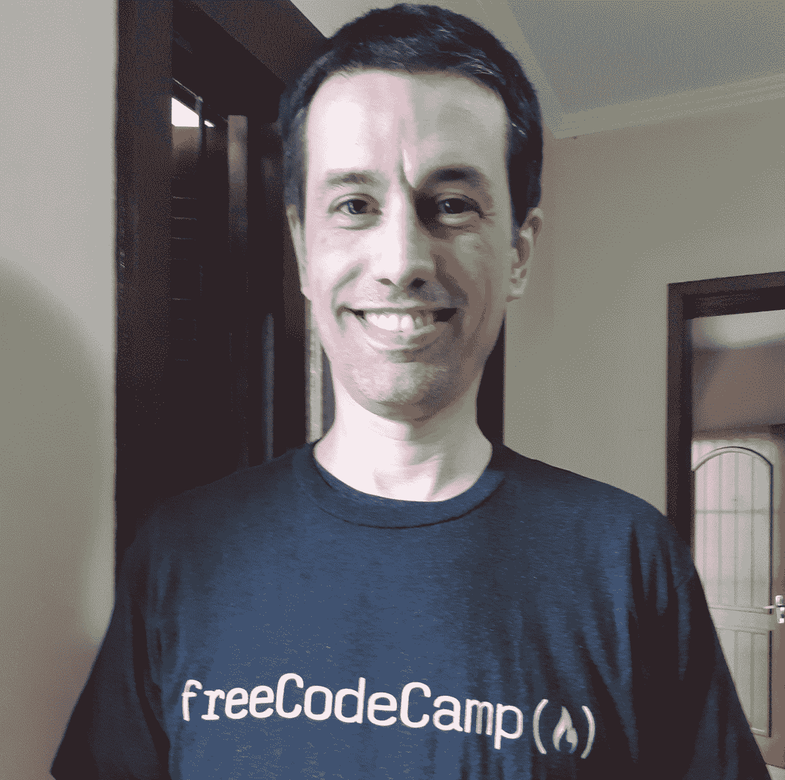

丹尼尔负责 freeCodeCamp 的葡萄牙语本地化工作。作为一名丈夫和两个孩子的父亲，他在 2021 年初开始为 freeCodeCamp 做志愿者，现在是工作人员中的一员。

丹尼尔是一名翻译、英语教师、技术作家和系统分析师。他热爱学习、教学、编程、写作和帮助人们学习。

### 来自意大利博洛尼亚的达里奥·迪·西洛([@达里奥多克](https://twitter.com/_DarioDC))

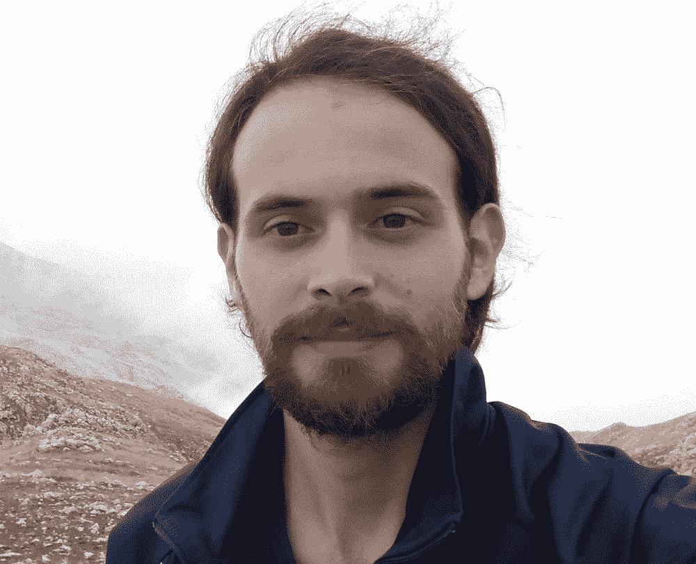

Dario 帮助运行意大利本地化工作。他最近获得了化学硕士学位。他对环境科学和技术感兴趣。他喜欢音乐、弹吉他和在大自然中徒步旅行。

### 来自尼日利亚 Kogi 的 dillion Megida([@ iam dillion](https://twitter.com/iamdillion))

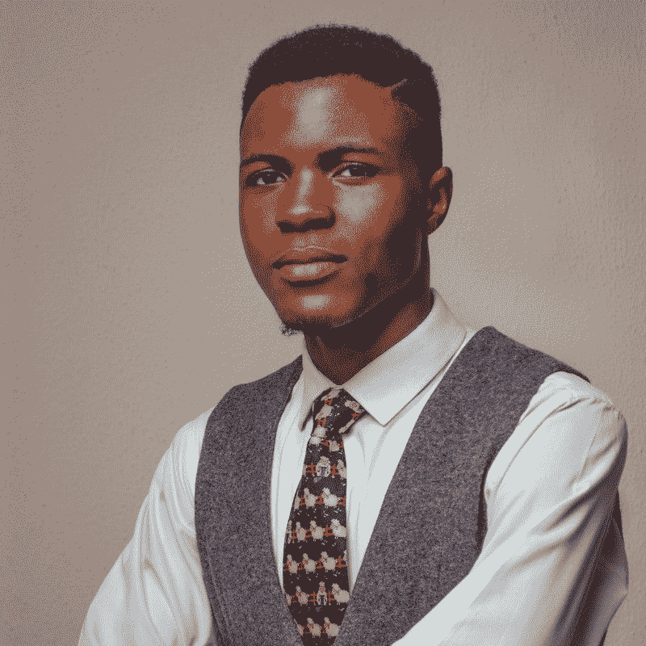

Dillion 是一位多产的开发人员和技术作家。他热衷于用户体验设计和网页可访问性。他喜欢围绕 web 技术、概念和最佳实践的学习和教学。

### 来自希腊雅典的迪奥尼西亚·莱蒙纳奇( [@deniselemonaki](https://twitter.com/deniselemonaki) )

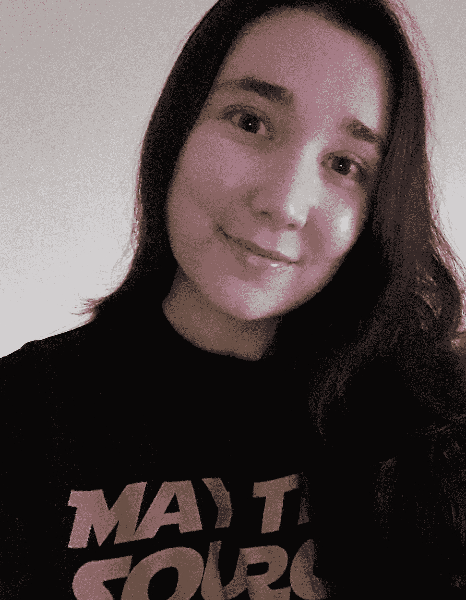

Dionysia 是一个专注于前端技术的开发人员。她为 freeCodeCamp 出版物写文章。作为一名自学成才的开发人员，她的目标是帮助他人并回报在她自己的编码之旅中帮助过她的社区。她喜欢阅读，喜欢在大自然中散步，喜欢被她的猫所拥有。

### 来自美国宾夕法尼亚州费城的爱德华·普拉托斯基( [@EPratowski](https://www.twitter.com/epratowski) )

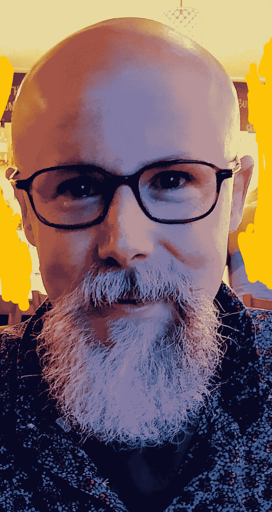

爱德华是 freeCodeCamp 的课程开发者。他是一个为副业写代码的老师。他喜欢音乐、益智游戏和与家人共度时光。

### 来自委内瑞拉巴伦西亚的 estefan ia Cassingena Navone([@ estefan iacassn](https://twitter.com/EstefaniaCassN))

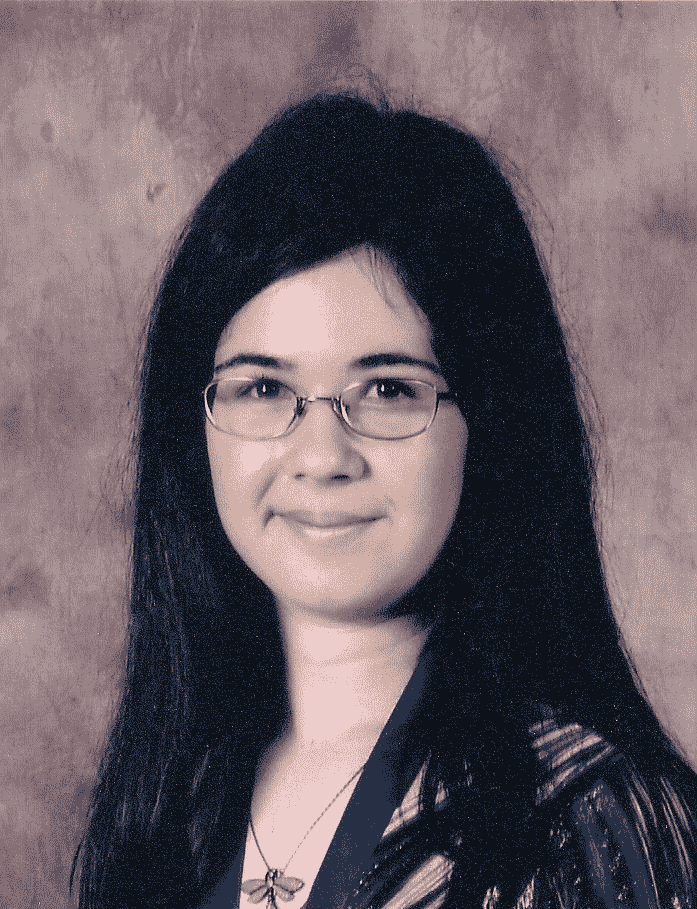

Estefania 是一名开发人员和在线讲师。她用英语和西班牙语为 freeCodeCamp 的出版物撰写文章，并为我们的 YouTube 频道制作视频课程。Estefania 开始为 freeCodeCamp 做志愿者，为该出版物撰写文章。她创建了我们在西班牙语 YouTube 频道上发布的第一个视频课程。在空闲时间，她喜欢学习和看电影。

### 来自孟加拉国达卡的法尔汉·哈辛·乔杜里( [@frhnhsin](https://twitter.com/frhnhsin) )

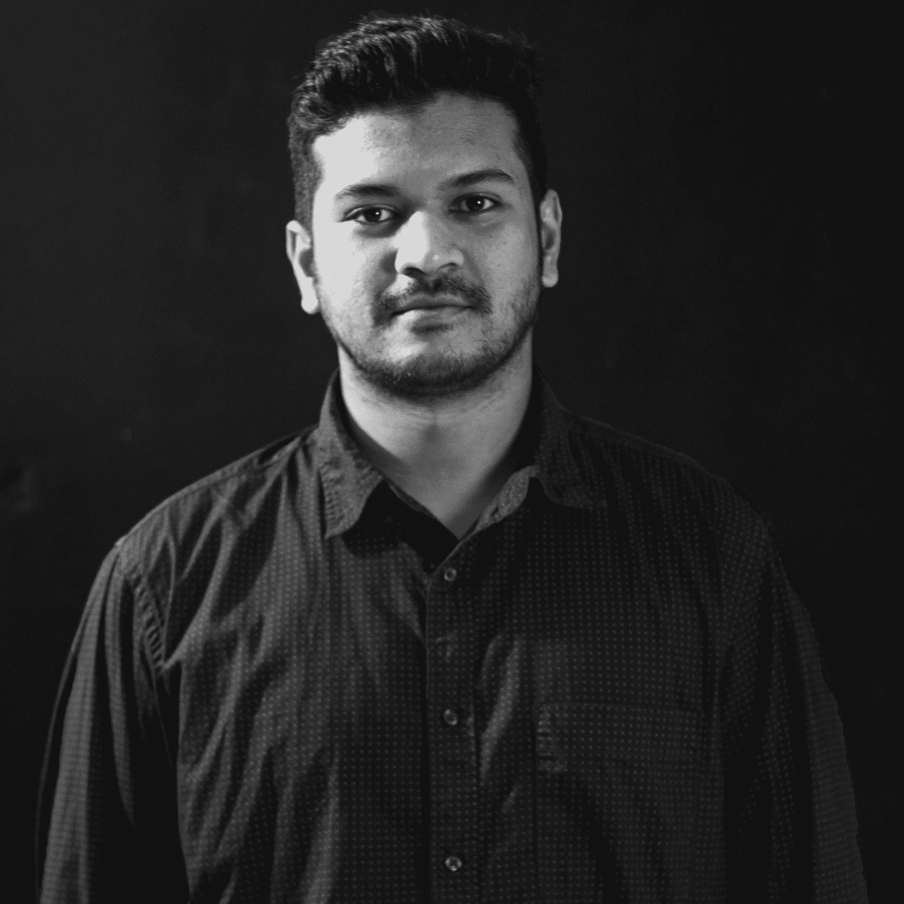

Farhan 是一名软件开发人员和作家，主要关注后端技术。他热衷于学习新技能并与社区分享他的知识。在业余时间，他喜欢看书和玩游戏。

### 来自英国伦敦的加文·伦

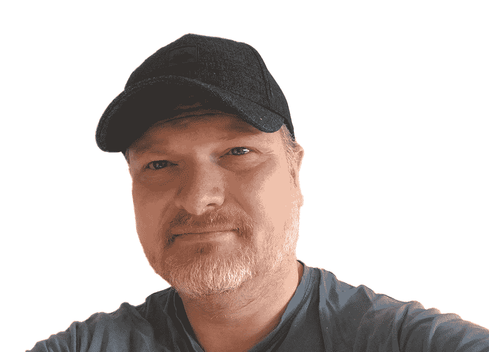

Gavin 是 freeCodeCamp 的教学设计师，帮助开发课程和课程表。他出生在南非德班，20 多岁时移居伦敦。他在法律行业做了将近 20 年的软件工程师。

Gavin 使用过各种各样的技术，包括各种。NET 平台(移动、桌面和网络)。他在 JavaScript 和相关框架方面也有丰富的经验。

### 来自美国印第安纳州印第安纳波利斯的格温多林·法拉第([@格温 _ 法拉第](https://twitter.com/gwen_faraday))

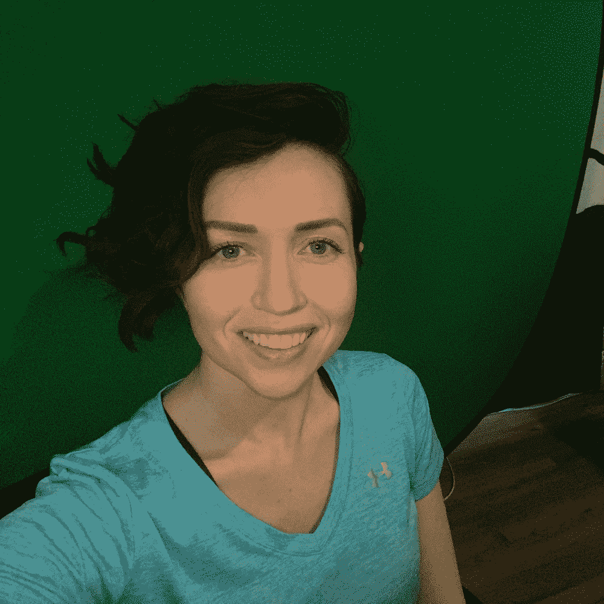

除了用 freeCodeCamp 设计课程之外，Gwen 还是 SaaS 营销技术初创公司 Relevize 的技术主管。Gwen 在 web 开发中使用 Python、JavaScript 和相关技术。

此外，Gwen 还创建了名为 Faraday Academy 的软件开发课程。当她不编码的时候，她可能出去跑步、读书或者和她的猫玩耍。

### 来自尼日利亚埃邦伊的 ihechikara Vincent Abba([@ ihechikara 2](https://twitter.com/ihechikara2))

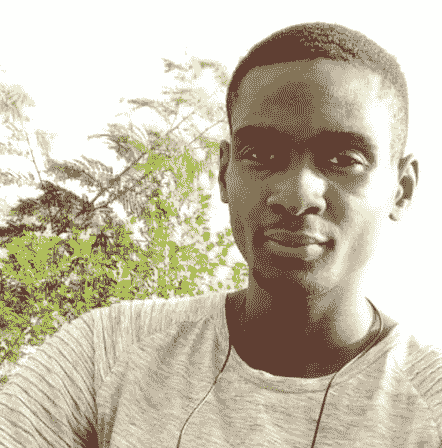

Ihechikara 是一名开发人员和技术作家。他目前在大学学习机电工程。他喜欢通过写作创建教程，作为帮助他人学习和扩展自己知识的一种方式。在空闲时间，他喜欢下棋、学习、编程和与家人共度时光。

### 来自肯尼亚内罗毕的希拉里·“拉里”·尼亚昆迪( [@larymak1](https://twitter.com/larymak1) )

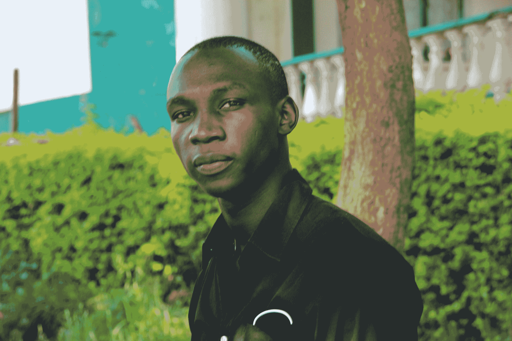

Lary 是一名开发人员和计算机科学学生。他对技术和开源充满热情。

他的目标是通过创造有益的编程资源对社会产生影响。

在空闲时间，他喜欢学习新概念和尝试新的烹饪方法。他喜欢烹饪。

### **来自意大利博洛尼亚的 Ilenia Magoni(**T2)【ieahleen

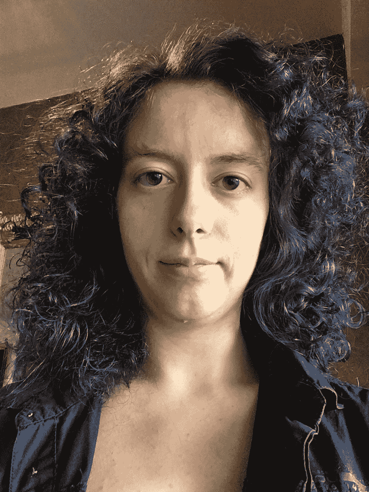

Ilenia 是一名即将完成化学硕士学位的研究生。她对环境问题和技术感兴趣，也对让世界变得更美好感兴趣。自 2019 年夏天以来，她一直作为版主为 freeCodeCamp 社区做出贡献，现在她是我们工作人员的一部分，主要专注于创作教程。

### 来自拉脱维亚瓦尔梅拉的伊斯兰·马赫福兹( [@codezilla_](https://twitter.com/codezilla_) )

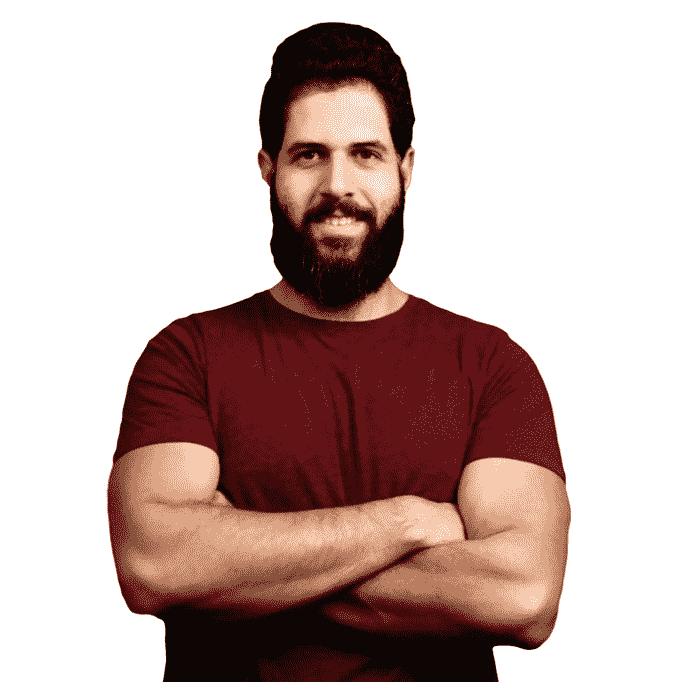

Islam 领导着 freeCodeCamp 的阿拉伯语本地化工作。他已经在教育技术领域工作好几年了。他经营着一个名为 Codezilla 的 YouTube 频道，旨在为说阿拉伯语的观众教授编程和制作与技术相关的视频。

闲暇时，伊斯拉姆喜欢制作短片，并总是热衷于冒险，比如在森林里骑自行车，或者在湖泊和河流中划独木舟。

### 来自美国加州洛杉矶的杰西卡·威尔金斯( [@codergirl1991](https://twitter.com/codergirl1991) )

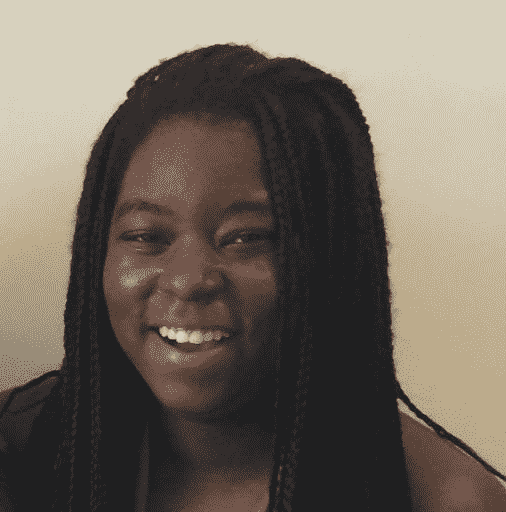

Jessica 是一名开发人员和经验丰富的教师。她为 freeCodeCamp 的出版物创建教程，并在论坛上帮助学习者。杰西卡也是一名出色的双簧管演奏家，曾在美国、加拿大、中国和南非的多个乐团演出。她经营着自己的在线乐谱公司 [JDW 乐谱](https://www.jdwsheetmusic.com/)。

### 来自尼日利亚翁多市的乔尔·奥拉万勒([@奥拉万勒 _ 乔尔](https://twitter.com/olawanle_joel))

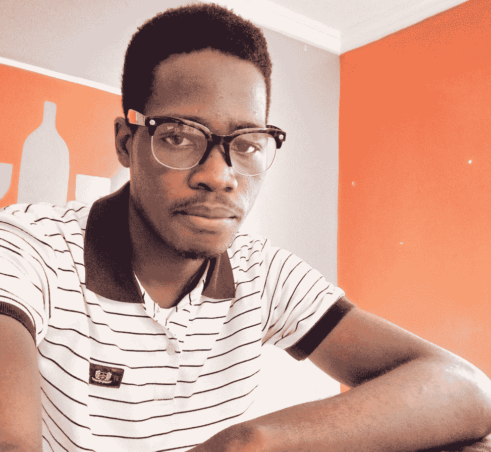

Joel 是一名前端工程师和技术作家，他对让每个人都能访问 web 感兴趣。他总是想方设法回馈技术社区，分享他的知识。他热衷于社区建设和开源。

### 来自孟加拉国达卡的 joy Shaheb([@ JoyShaheb](https://twitter.com/JoyShaheb))

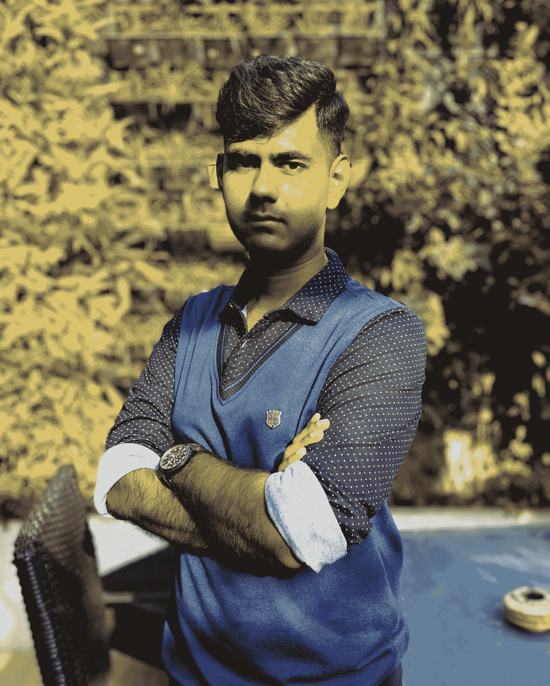

乔伊是一名作家兼教师。他的任务是在互联网上创建最好的 web 开发教程。闲暇时，他喜欢看动漫和听韩国流行音乐。

### 来自美国佐治亚州亚特兰大的凯拉·托马斯( [@cfhcofficialkat](https://twitter.com/cfhcofficialkat) )

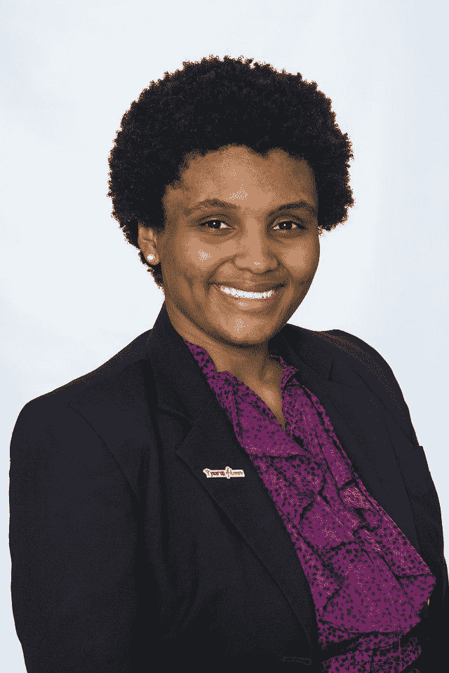

凯拉是一名软件工程师，经营着一家名为寄居蟹编码的非营利组织。这个项目帮助无家可归的年轻人学习如何编程——自从她自己在青少年时期无家可归以来，她就被激励去支持这项事业。

她被 freeCodeCamp 相似的理念和使命所感动，即让所有人都能使用编程。她是学习编码 RPG 视频游戏的主要作者。

### 韩国大邱的 Kris Koishigawa([@ Kris Koishigawa](https://twitter.com/kriskoishigawa))

克里斯在夏威夷的瓦胡岛长大。他一直梦想去旅行。毕业后，他搬到韩国大邱教英语。很快他找到了 freeCodeCamp，学会了编程。目前，他在软件开发和编写 freeCodeCamp 出版物的教程之间分配时间。

### 来自尼日利亚的科拉迪·克里斯( [@Ksound22](https://twitter.com/Ksound22) )

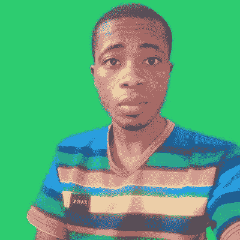

Kolade 从环境生物学转向网络开发。他酷爱写作，并为 freeCodeCamp 英文出版物撰写教程。

他喜欢每天学习新东西，空闲时间看足球和摔跤。

### 来自美国马萨诸塞州波士顿的 Kylie Ying([@ kylieyying](https://twitter.com/kylieyying))

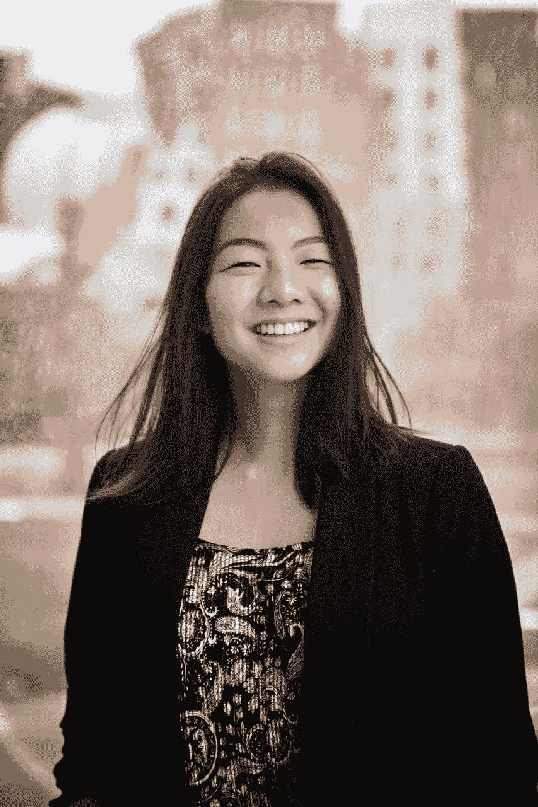

Kylie 目前是麻省理工学院计算机科学研究生，从事机器学习和粒子物理领域的研究。她有一个专注于编程教程和项目的 YouTube 频道，并热衷于教授代码和激励人们追求 STEM。闲暇时，她喜欢花样滑冰、曲棍球、日落、狗和扑克。

### 来自美国加州旧金山的 Lynn Zheng([@ Lynn Zheng 08](https://twitter.com/lynnzheng08))

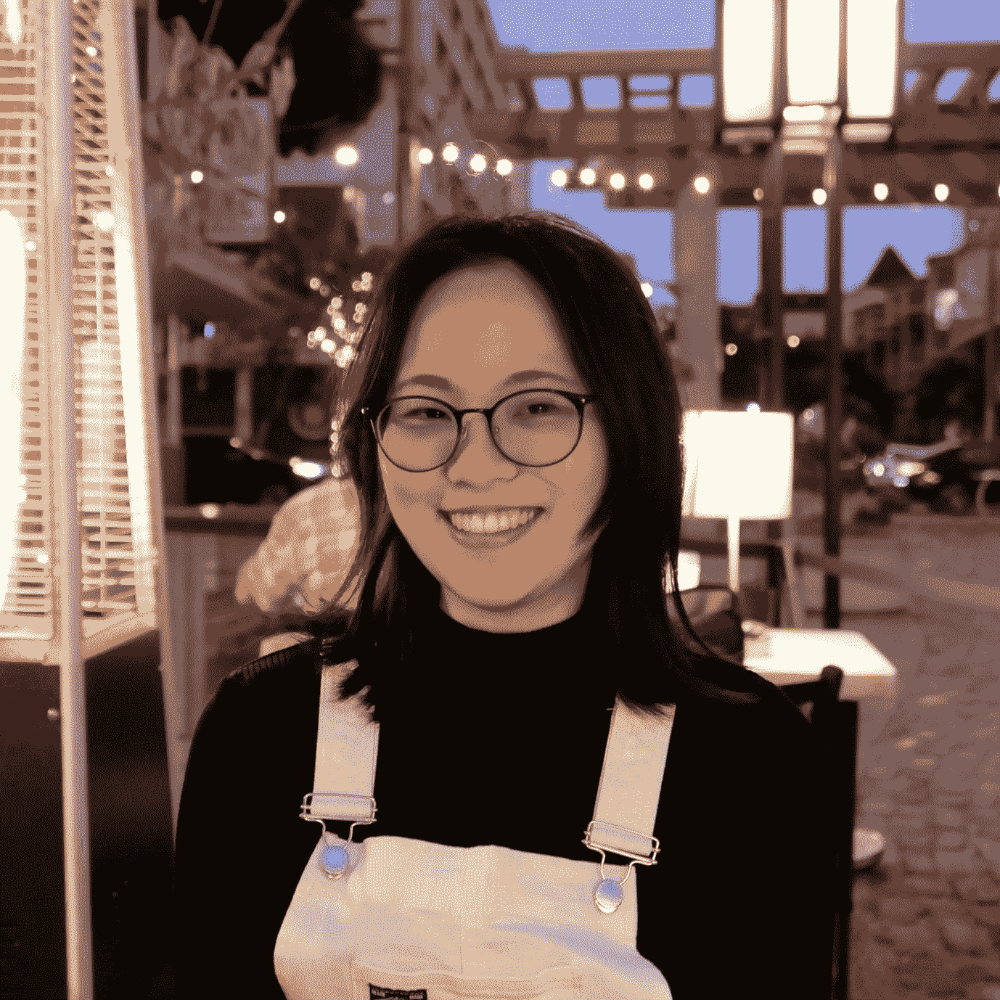

Lynn 是一名软件工程师，2021 年毕业于芝加哥大学，获得了计算机科学的联合学士和硕士学位。当她不忙于构建软件时，她喜欢从事开源项目、学习游戏开发和创作数字艺术。

### 来自中国四川成都的刘( [@miyaliu666](https://twitter.com/miyaliu666) )

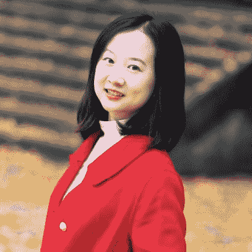

陈美雅负责监管全球中文自由代码营社区和中文本地化工作。她喜欢阅读、散步、烹饪，并与世界各地的自由代码营贡献者会面。

### 来自印度本加卢鲁的穆鲁格什·莫哈帕特拉( [@raisedadead](https://twitter.com/raisedadead) )

在加入 freeCodeCamp 之前，Mrugesh 学习计算机科学，并在几家跨国科技公司担任软件工程师。他监管 freeCodeCamp 的大部分服务器基础设施和 DevOps 任务。在业余时间，他喜欢摄影。

### 来自埃及苏伊士的穆罕默德·埃尔鲁比([@ sboonydev](https://twitter.com/SboonnyDev)

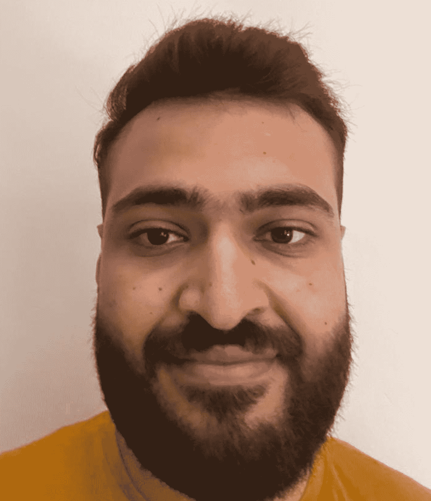

穆罕默德，以前是海关清关经理。一天偶然的机会，他偶然发现了 freeCodeCamp 社区。从那以后，他一直坚持编码，为开源做出贡献。他喜欢笑话、迷因和烹饪。他也在帮助 freeCodeCamp 的阿拉伯语本地化工作。

### 来自美国华盛顿州温哥华的娜奥米·卡里根( [@nhcarrigan](https://twitter.com/nhcarrigan) )

Naomi 是一名专注于平均值堆栈的 web 开发人员。她非常喜欢打字稿。在空闲时间，她喜欢开发聊天机器人，为开源软件做贡献，玩视频游戏。

### 来自巴西圣保罗的尼尔达·卡拉·贡萨尔维斯·德·梅洛([@尼尔达·卡拉](https://twitter.com/NieldaKarla)

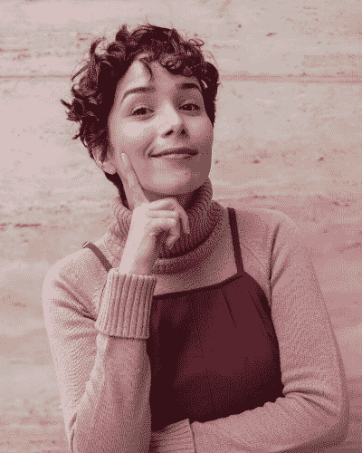

Nielda 是一名英语教师，她正在学习编码，以便为她的班级开发更好的工具。她还是 freeCodeCamp 即将推出的开发人员英语课程的开发人员和教学设计师。

尼尔达喜欢学习新技能、水彩画和观察自然。她喜欢和家人、朋友在一起，尤其是她的猫。

### 来自阿联酋迪拜的 niraj Nandish([@ drsilverfox 2311](https://twitter.com/DrSilverFox2311))

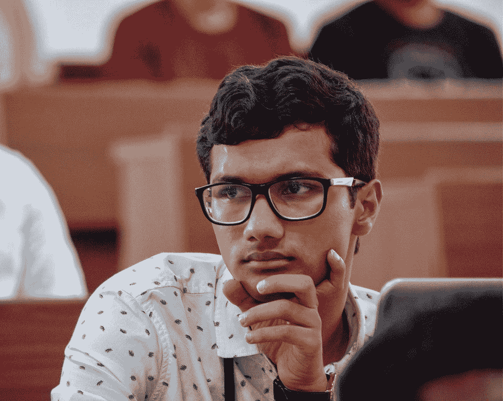

Niraj 是信息技术专业三年级学生。他是 freeCodeCamp 的长期撰稿人。他正在开发 freeCodeCamp Android 应用程序的更新版本。在空闲时间，他要么读一本好小说，要么看科幻电影/电视剧。

### 来自美国威斯康星州史蒂文斯点的汤姆·蒙德洛克([@莫特尼斯](https://twitter.com/moTness))

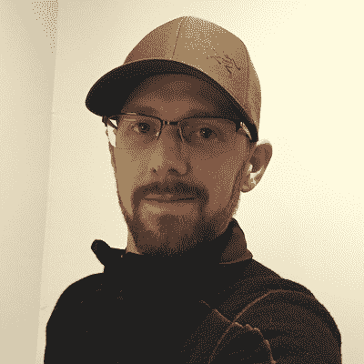

Tom 以学生身份加入 freeCodeCamp，并完成了课程。他开始频繁地为开源代码库做贡献。几年后，我们邀请他加入我们的团队。他目前的重点是课程设计和开发。他也喜欢钓鱼和曲棍球。

### 来自英国伦敦的孙铁麟·托克科( [@tomitokko3](https://twitter.com/tomitokko3) )

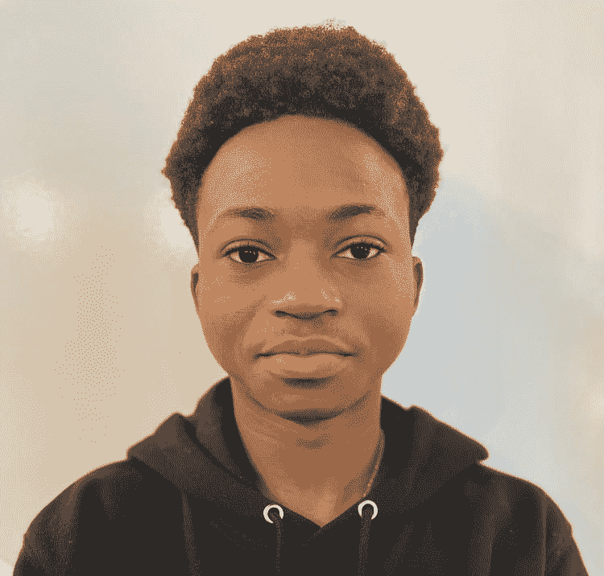

孙铁麟是一名开发者，为 freeCodeCamp 制作教程。他还经营着一个名为 CodeWithTomi 的 YouTube 频道，在那里他制作关于简化 web 开发的视频教程。

### 来自比利时布鲁塞尔的奥利弗·埃顿·威廉姆斯

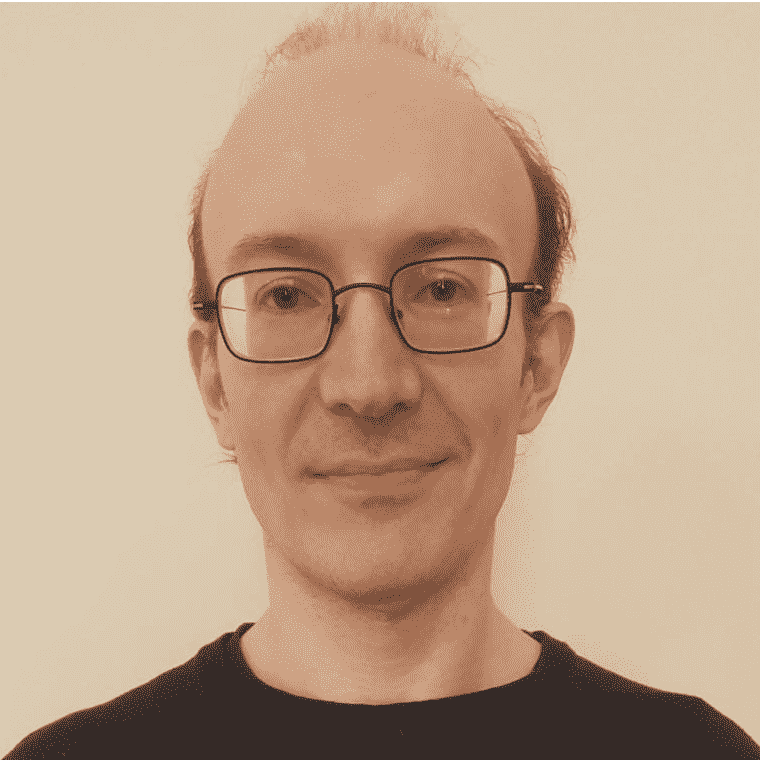

在 Oliver 成为 freeCodeCamp 开源代码库的多产贡献者之前，他获得了粒子物理学博士学位，并作为一名科学家工作。作为一名软件工程师，他专注于改进 freeCodeCamp 的课程和基础设施。在他的空闲时间，他玩太多的游戏。典型的涉及卡、板或计算机的问题。

### 来自美国德克萨斯州达拉斯的昆西·拉森([@奥西娅](https://www.twitter.com/ossia))

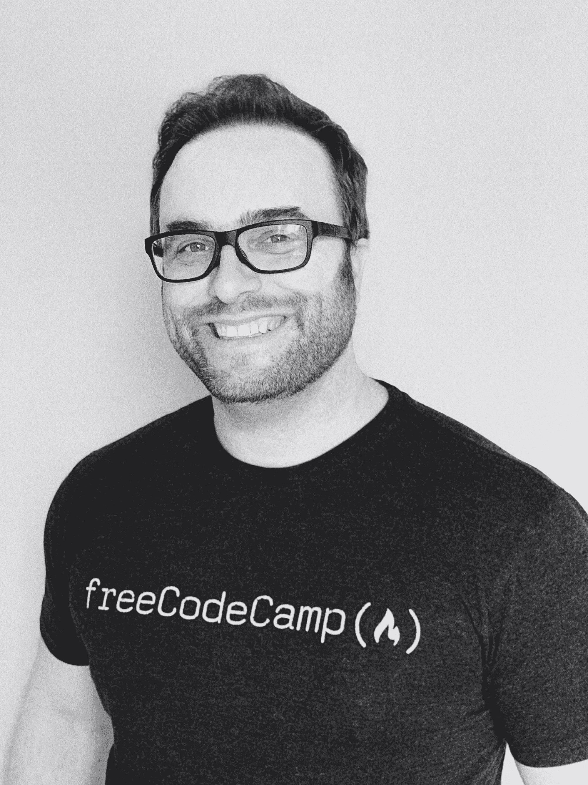

昆西在加州的黑客马拉松和创客空间学习编程之前，曾做过十年的教师和学校主管。他喜欢读历史书，带他的孩子去公园，并试图教任何愿意听他说话的人。

### 来自美国加州洛杉矶的拉斐尔·d·埃尔南德斯([@拉斐尔·达维什](https://twitter.com/RafaelDavisH))

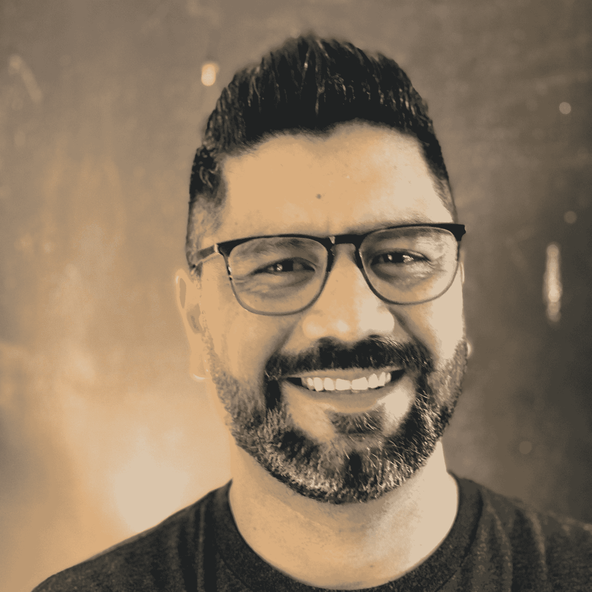

拉斐尔是一位父亲、丈夫和网络开发人员。他为代码库做出贡献，并监督 freeCodeCamp 将我们的课程和数千个教程翻译成西班牙语的工作。在空闲时间，他喜欢打鼓和弹吉他。

### 这里是来自荷兰 purple 的 bauke(t0)@ sembauke

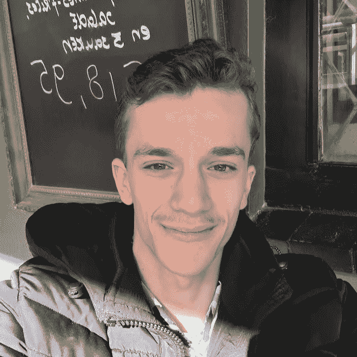

Sem 是一名软件工程师，正在开发 freeCodeCamp 移动应用程序，这将使全球数百万人能够访问我们的学习资源。他在 2014 年开始学习编程，并通过学习 freeCodeCamps 课程提前完成了他的软件工程学习。

闲暇时，Sem 喜欢和朋友一起玩游戏，在大自然中徒步旅行。

### 来自苏格兰格拉斯哥的肖恩·汉密尔顿

Shaun 是 freeCodeCamp 的一名软件开发人员。他受教育是机械工程师，实践是音乐家。肖恩和他的妻子准备过上“宅第生活”——有科技相伴。

### 来自美国纽约 Tivoli 的 Veronica Stork([@ vee wren](https://twitter.com/veewren))

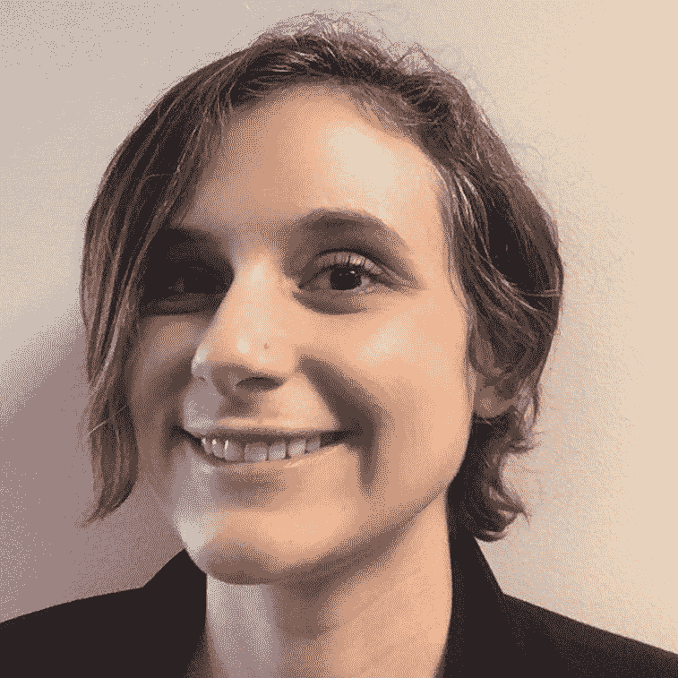

维罗妮卡是一位作家和养猫女士。她热爱书籍和学习。她喜欢用 React 编程。

### 来自日本东京的松田隼洋子( [@_sidemt](https://twitter.com/_sidemt) )

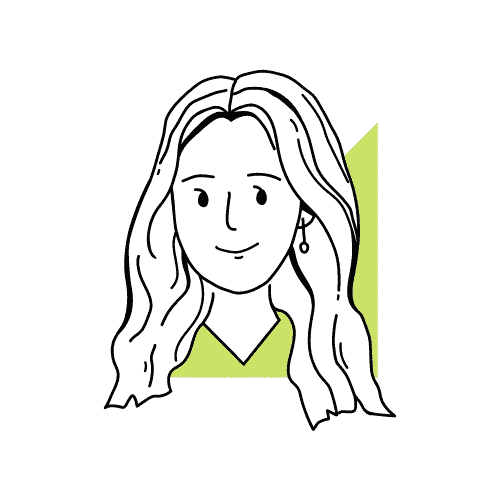

Yoko 一直梦想成为一名开发人员。并且在 2017 年，她开始在 freeCodeCamp 上学习编码。

今天 Yoko 是一名 web 开发人员，为客户构建 Ruby on Rails 项目。她还在 freeCodeCamp 领导日本本地化工作。

在空闲时间，她喜欢学习行星科学，也喜欢把翻译作为一种爱好。

### 来自巴基斯坦伊斯兰堡的扎伊拉·希拉(@ [希拉 _ 扎伊拉](https://twitter.com/hira_zaira))

Zaira 是 freeCodeCamp 的 DevOps 工程师，负责 Urdu 本地化工作。

她已经在技术运营领域工作了好几年。她旨在回馈社区，她从社区中学到了许多最佳实践。

闲暇时，她喜欢摄影、徒步旅行、创作数字艺术、游戏和写作。