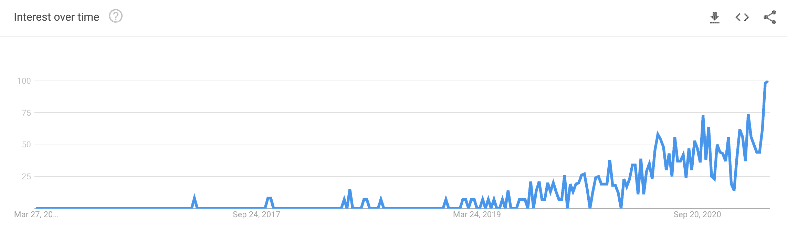
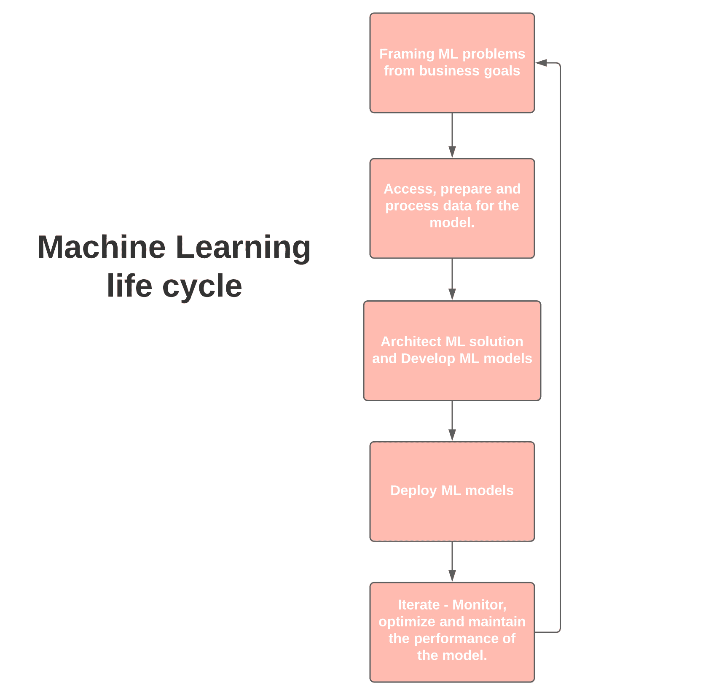
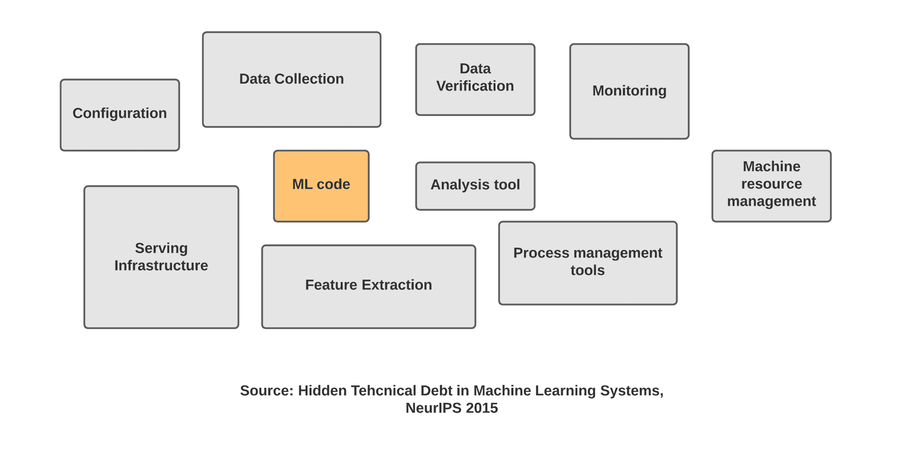
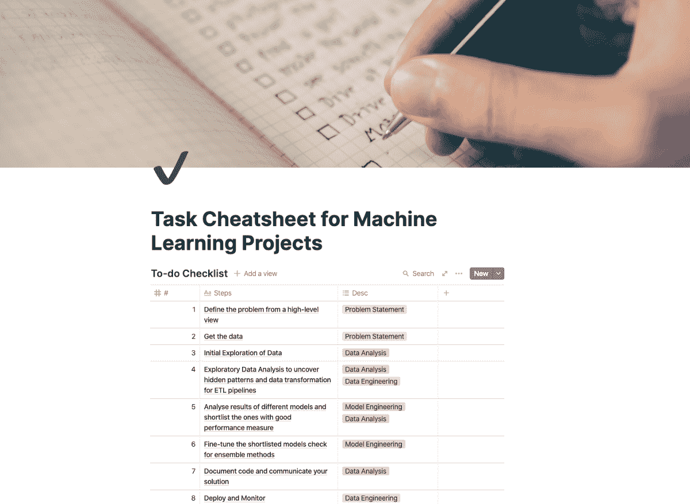

# 什么是 MLOps？机器学习操作解释

> 原文：<https://www.freecodecamp.org/news/what-is-mlops-machine-learning-operations-explained/>

在这篇文章中，我将教你机器学习操作，这就像机器学习的 DevOps。

直到最近，我们都在学习标准软件开发生命周期(SDLC)。从**需求获取**到**设计**到**开发**到**测试**到**部署**，一直到**维护**。

我们过去(现在仍然)在研究软件开发的瀑布模型、迭代模型和敏捷模型。

现在，我们正处于一个阶段，几乎每个组织都在试图将机器学习(ML)——通常称为人工智能——融入他们的产品。

这种构建 ML 系统的新需求增加并改革了 SDLC 的一些原则，产生了一种新的工程学科，称为机器学习操作，或 MLOps。这个新名词引起了轰动，并产生了新的工作简介。

在这里我们将讨论:

*   什么是 MLOps？
*   MLOps 解决什么问题？
*   MLOps 需要哪些技能？

继续阅读，我会详细解释每一个。

## 什么是 MLOps？

如果你在 Google trends 上查找 MLOps，你会发现这是一个相对较新的学科。同样，这是因为越来越多的组织试图将 ML 系统集成到他们的产品和平台中。

### 我是这样定义 MLOps 的:

MLOps 是一个工程学科，旨在统一 ML 系统开发(dev)和 ML 系统部署(Ops ),以便标准化和简化生产中高性能模型的持续交付。

### 为什么是 MLOps？

直到最近，我们还在处理可管理的数据量和小规模的极少数模型。

现在情况正在发生变化，我们正在将决策自动化嵌入到广泛的应用中。这产生了许多技术挑战，这些挑战来自于构建和部署基于 ML 的系统。

为了理解 MLOps，我们必须首先理解 ML 系统的生命周期。生命周期涉及数据驱动组织的几个不同团队。

从开始到结束，以下团队插话:

*   **业务开发或产品团队** —用 KPI 定义业务目标
*   **数据工程** —数据采集和准备。
*   **数据科学** —构建 ML 解决方案和开发模型。
*   **IT 或 DevOps** —完成部署设置，与科学家一起监控。

这是 ML 生命周期的一个非常简单的表示。

Google 的团队已经对构建基于 ML 的系统所带来的技术挑战进行了大量的研究。一篇关于 ML 系统中隐藏的技术债务的 NeurIPS 论文向你展示了开发模型只是整个过程中的一小部分。还有许多其他流程、配置和工具需要集成到系统中。

为了简化整个系统，我们有了新的机器学习工程文化。该系统涉及每个人，从具有最低技术技能的高层管理人员到数据科学家，再到开发人员和 ML 工程师。

## MLOps 解决什么问题？

大规模管理这样的系统不是一件容易的事情，有许多瓶颈需要解决。以下是团队面临的主要挑战:

*   擅长开发和部署可扩展网络应用的数据科学家数量不足。最近市场上出现了一种新的 ML 工程师，旨在满足这种需求。这是数据科学和 DevOps 的交汇点。
*   **改变模型中的业务目标**—数据不断变化，维护模型的性能标准，以及确保 AI 治理，这些都有许多依赖关系。很难跟上持续的模型培训和不断发展的业务目标。
*   **技术和业务团队之间的沟通差距**,他们很难找到共同语言进行协作。大多数情况下，这种差距成为大项目失败的原因。
*   **风险评估—** 围绕此类 ML/DL 系统的黑箱性质，有很多争论。模型往往会偏离它们最初的目标。评估此类故障的风险/成本是一个非常重要且细致的步骤。
    例如，YouTube 上一个不准确的视频推荐的成本要比标记一个无辜的人欺诈并封锁他们的账户，以及拒绝他们的贷款申请低得多。

## MLOps 需要哪些技能？

至此，我已经对系统的瓶颈以及 MLOps 如何解决这些问题给出了很多见解。你可以从这些挑战中发现你需要的技能。

以下是你需要关注的关键技能:

### 1.从商业目标出发构建 ML 问题

机器学习系统开发通常始于商业目标或目的。它可以是将欺诈交易的百分比降低到 0.5%以下的简单目标，也可以是建立一个系统来检测皮肤科医生标记的图像中的皮肤癌。

这些目标通常有特定的性能度量、技术需求、项目预算和 KPI(关键性能指标),它们驱动着对已部署模型的监控过程。

### 2.架构 ML 和问题的数据解决方案

在目标被清楚地转化为 ML 问题之后，下一步是开始搜索合适的输入数据和模型的种类来尝试这种数据。

搜索数据是最费力的任务之一。这是一个包含几个部分的过程:

*   你需要寻找任何可用的相关数据集，
*   检查数据及其来源的可信度。
*   数据源是否符合 GDPR 等法规？
*   如何使数据集可访问？
*   源的类型是什么—静态(文件)还是实时流(传感器)？
*   要使用多少个源？
*   一旦模型被部署到生产环境中，如何构建一个可以驱动训练和优化的数据管道？
*   你会使用哪些云服务？

### 3.数据准备和处理——数据工程的一部分。

数据准备包括诸如要素工程、清理(格式化、检查异常值、插补、重新平衡等)等任务，然后选择有助于基本问题输出的要素集。

您需要设计一个完整的管道，然后对其进行编码，以产生干净和兼容的数据，这些数据将被提供给模型开发的下一个阶段。

部署这种管道的一个重要部分是选择云服务和架构的正确组合，这种组合是高性能和经济高效的。例如，如果您有大量的数据移动和大量的数据要存储，您可以使用 AWS S3 和 AWS Glue 构建数据湖。

您可能想练习构建一些不同种类的管道(批处理与流)，并尝试在云上部署这些管道。

### 4.模型训练和实验—数据科学

一旦你的数据准备好了，你就可以进入训练你的 ML 模型的下一步。

现在，训练的初始阶段是用一堆不同类型的模型进行迭代。您将使用几个量化指标(如准确度、精确度、召回率等)来缩小范围，找到最佳解决方案。

你也可以使用模型的定性分析，来解释驱动模型的数学，或者简单地说，模型的可解释性。

我有一个完整的任务列表，你可以在训练 ML 模型时阅读:

[Task Cheatsheet for Almost Every Machine Learning ProjectAs I am working on creating a range of portfolio-worthy projects for all of you, I thought of documenting practices that I’ve either learned from someone or developed while working. In this blog…Harshit TyagiTowards Data Science](https://towardsdatascience.com/task-cheatsheet-for-almost-every-machine-learning-project-d0946861c6d0)

现在，您将使用不同类型的数据和参数运行大量实验。数据科学家在训练模型时面临的另一个挑战是**再现性**。这可以通过版本化您的模型和数据来解决。

您可以向 ML 系统的所有组件(主要是数据和模型)添加版本控制以及参数。

现在，随着开源工具的发展，如[**【DVC】**](https://dvc.org/)**和**[**CML**](https://cml.dev/)**，这变得非常容易。******

****其他任务包括:****

*   ****通过为模型定型编写单元测试来测试模型。****
*   ****对照基线、更简单的模型以及不同的维度检查模型。****
*   ****使用分布式系统、硬件加速器和可扩展分析来扩展模型训练。****

### ****5.构建和自动化 ML 管道****

****您应该在构建 ML 管道时牢记以下任务:****

*   ****确定系统需求—参数、计算需求、触发因素。****
*   ****选择合适的云架构—混合云或多云。****
*   ****构建培训和测试管道。****
*   ****跟踪和审核管道运行。****
*   ****执行数据验证。****

### ****6.将模型部署到生产系统****

****部署 ML 模型主要有两种方式:****

*   ****静态部署或嵌入式模型—其中模型被打包到可安装的应用程序软件中，然后进行部署。例如，提供请求批量评分的应用程序。****
*   ****动态部署——使用 FastAPI 或 Flask 等 web 框架部署模型，并作为响应用户请求的 API 端点提供。****

****在动态部署中，您可以使用不同的方法:****

*   ****在服务器(虚拟机)上部署****
*   ****在容器中部署****
*   ****无服务器部署****
*   ****模型流——与 REST APIs 不同，所有的模型和应用程序代码都在一个流处理引擎上注册，比如 Apache Spark、Apache Storm 和 Apache Flink。****

****以下是一些注意事项:****

*   ****确保符合适当的文件和测试分数。****
*   ****重新验证模型的准确性。****
*   ****执行可解释性检查。****
*   ****确保满足所有治理要求。****
*   ****检查任何数据工件的质量****
*   ****负载测试—计算资源使用情况。****

### ****7.监控、优化和维护模型****

****您不仅需要关注生产中模型的性能，还需要确保良好和公平的治理。****

****这里的治理意味着添加控制措施，以确保模型向受其影响的所有涉众、员工和用户交付它们的责任。****

****作为该阶段的一部分，我们需要数据科学家和 DevOps 工程师通过执行以下任务来维护整个生产系统:****

*   ****跟踪模型预测的性能下降和业务质量。****
*   ****设置日志记录策略并建立持续评估指标。****
*   ****排除系统故障和引入偏差。****
*   ****在生产中部署的培训和服务管道中调整模型性能。****

### ****进一步推荐阅读****

****这篇文章是关于 MLOps 的，它不是一个工作简介，而是一个由几个利益相关者组成的生态系统。****

****如果你是在 ML 和软件工程(DevOps)交叉领域工作的人，你可能很适合寻找能够端到端处理这种系统的人的初创公司和中型组织。****

****ML 工程师是服务于这个最佳位置的职位，也是有抱负的候选人应该瞄准的目标。以下是一些您可以参考的资源:****

*   ******【书】**:安德烈·布尔科夫关于[机器学习工程的书](http://www.mlebook.com/wiki/)。****
*   ******【书】:** [奥莱利传媒对 MLOps 的介绍](https://learning.oreilly.com/library/view/introducing-mlops/9781492083283/)。****
*   ****您也可以参加如下认证计划:****

****[Professional ML Engineer Certification | Certifications | Google CloudA Professional Machine Learning Engineer designs, builds, and productionizes ML models to solve business challenges using Google Cloud technologies and knowledge of proven ML models and techniques.Google Cloud](https://cloud.google.com/certification/machine-learning-engineer)********[AWS Certified Machine Learning - SpecialtyAmazon Web Services, Inc.](https://aws.amazon.com/certification/certified-machine-learning-specialty/?ch=sec&sec=rmg&d=1)****

****你也可以在这里观看这个博客的视频版本:****

 ****[https://www.youtube.com/embed/0jLdp2Tl0sM?feature=oembed](https://www.youtube.com/embed/0jLdp2Tl0sM?feature=oembed)**** 

****如果这个教程有帮助，你应该看看我在 [Wiplane Academy](https://www.wiplane.com/) 上的数据科学和机器学习课程。它们全面而紧凑，帮助您建立一个坚实的工作基础来展示。****