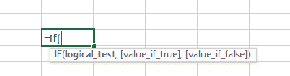
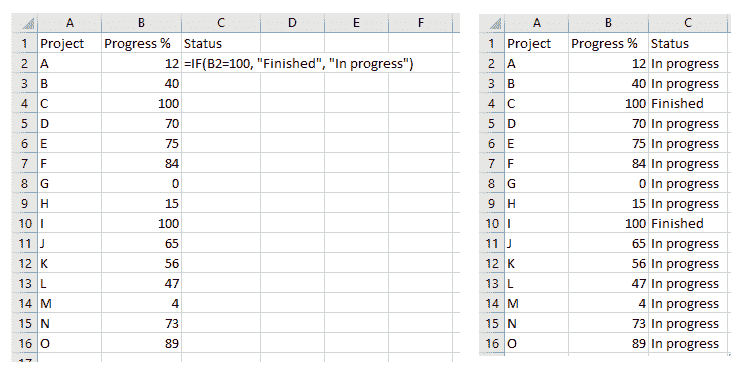

# If 函数 Excel 教程-以及如何在 Excel 中执行多个 If 语句

> 原文：<https://www.freecodecamp.org/news/if-function-excel-tutorial-and-how-to-do-multiple-if-statements-in-excel/>

当我们需要实现条件逻辑时，也就是当我们需要根据一个条件得到不同的结果时，Excel 中的`IF`函数是一个不可估量的助手。

语法是`IF(logical_test, [value_if_true], [value_if_false])`，其中

*   `logical_test`是计算结果为`TRUE`或`FALSE`的表达式，
*   `value_if_true`是可选参数，它是在`logical_test`为真的情况下表达式计算的值，并且
*   `value_if_false`是可选参数，确定`logical_test`为假时的值。



## 如何在 Excel 中有条件地设置单元格的值

让我们在最简单的用例中看看 if 语句的作用，当一个单元格的值是基于不同单元格的值在两个选项之间确定时。

例如，假设我们有一个项目列表，每个项目的进度百分比，我们想自动将字符串设置为“进行中”或“已完成”。然后我们可以写`IF(B2=100, "Finished", "In progress")`(其中`B2`是第一个有进度的单元格)。

在第一个单元格中写入公式后，我们只需双击选中该单元格时出现的绿色手柄，公式就会填充到该列中的所有其他单元格中。



## 如何使用嵌套的 if 语句在 Excel 中有条件地设置具有更多选项的单元格的值

从上面的例子继续，我们可能想要进一步分解进度状态。这一次，我们希望根据项目的进展有 7 个不同的状态字符串。

我们需要使用嵌套的 if 语句，编写一个 if 语句来代替`value_if_false`(它也可以用来代替`value_if_true`，但是会变得更混乱)。

让我们试着建立一个公式，以防我们想要所有这些进度状态:未开始、开始、前半部分、中途、后半部分、几乎完成、完成。

在这种情况下，我们总共需要 6 个 if 语句，所以我们可以这样写:

```
=IF(B2=0, "Not started", IF(B2<10, "Started", IF(B2<50, "First Half", IF(B2=50, "Halfway through", IF(B2<90, "Second half", IF(B2<100, "Almost finished", "Finished")))))) 
```

Excel 最多允许 7 个嵌套的 if 语句。如果我们想要扩展可能状态的列表，我们可以只添加一个条件和一个状态。但幸运的是，我们可以使用不同的函数添加更多。

## Excel 中 7 个以上条件如何使用`IFS()`

`IFS()`函数是 Excel 2016 中引入的，它最多允许 127 个条件。语法是`IFS(logical_test1, value_if_true1, [logical_test2, value_if_true2] ... [logical_test127, value_if_true127])`。

逻辑测试表达式的计算是必然的。当找到第一个返回 TRUE 的时，相应的`value_if_true`作为输出给出。

我们之前用嵌套 if 语句编写的表达式可以写成这样:

```
=IFS(B2=0, "Not started", B2<10, "Started", B2<50, "First Half"B2=50, "Halfway through", B2<90, "Second half", B2<100, "Almost finished", B2=100, "Finished") 
```

## 结论

当你需要有条件地设置时，你会经常使用`IF()`。您可以嵌套多个`IF()`语句来拥有复杂的逻辑链。

但是如果你需要使用超过 7 个嵌套的`IF()`语句，那么你可以使用`IFS()`来代替。