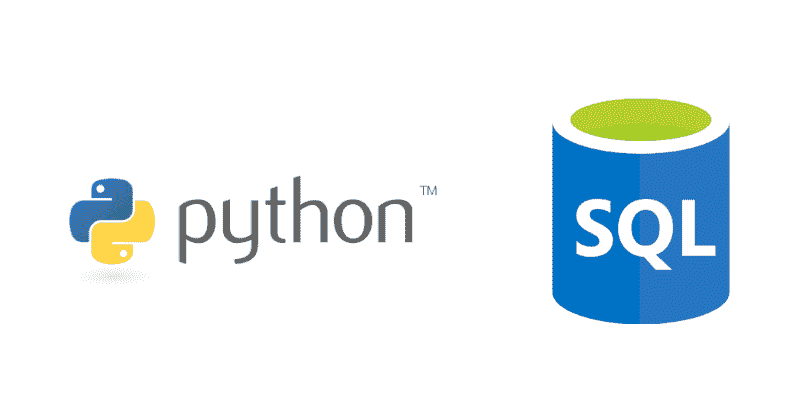

# Python SQL——如何在 Python 中使用 SQLite、MySQL 和 PostgreSQL 数据库

> 原文：<https://www.freecodecamp.org/news/python-sql-how-to-use-sql-databases-with-python/>

作为一名开发人员，我最大的乐趣之一就是了解不同的技术是如何交叉的。

多年来，我有机会使用不同类型的软件和工具。在我用过的众多工具中，Python 和结构化查询语言(SQL)是我最喜欢的两个。

在这篇文章中，我将和你分享 Python 和不同的 SQL 数据库是如何交互的。

我将谈论最流行的数据库，SQLite，MySQL 和 PostgreSQL。我将解释每个数据库的主要区别和相应的用例。我将用一些 Python 代码来结束这篇文章。

该代码将向您展示如何编写一个 SQL 查询来从 PostgreSQL 数据库中提取数据，并将数据存储在 pandas 数据框中。

如果你对关系数据库(RDBMS)不熟悉，我建议你看看 Sameer 关于基本 RDBMS 术语的文章[这里](https://www.freecodecamp.org/news/sql-and-databases-explained-in-plain-english/)。本文的其余部分将使用 Sameer 文章中引用的术语。

## 流行的 SQL 数据库

### SQLite

SQLite 最出名的是作为一个集成的数据库。这意味着您不必安装额外的应用程序或使用单独的服务器来运行数据库。

如果你正在创建一个 MVP 或者不需要大量的数据存储空间，你会想要一个 SQLite 数据库。

优点是，相对于 MySQL 和 PostgreSQL，SQLite 数据库可以更快地运行。也就是说，您将被有限的功能所束缚。您将无法定制功能或添加大量多用户功能。

### MySQL/PostgreSQL

MySQL 和 PostgreSQL 有明显的区别。也就是说，根据这篇文章的上下文，它们属于类似的类别。

这两种数据库类型都非常适合企业解决方案。如果您需要快速扩展，MySQL 和 PostgreSQL 是您的最佳选择。它们将提供长期的基础设施并增强您的安全性。

它们对企业非常有用的另一个原因是，它们可以处理高性能的活动。较长的 insert、update 和 select 语句需要大量的计算能力。您将能够以比 SQLite 数据库更少的延迟编写这些语句。

## 为什么要连接 Python 和 SQL 数据库？

您可能想知道，“我为什么要关心 Python 和 SQL 数据库的连接？”

当有人想要将 Python 连接到 SQL 数据库时，有许多用例。正如我前面提到的，您可能正在开发一个 web 应用程序。在这种情况下，您需要连接一个 SQL 数据库，以便存储来自 web 应用程序的数据。

也许你从事数据工程，你需要建立一个自动化的 ETL 管道。将 Python 连接到 SQL 数据库将允许您使用 Python 的自动化功能。您还将能够在不同的数据源之间进行通信。你不必在不同的编程语言之间切换。

连接 Python 和 SQL 数据库也将使您的数据科学工作更加方便。您将能够使用 Python 技能来操作 SQL 数据库中的数据。你不需要 CSV 文件。

## Python 和 SQL 数据库如何连接



Python 和 SQL 数据库通过自定义 Python 库连接。您可以将这些库导入到 Python 脚本中。

特定于数据库的 Python 库作为补充说明。这些说明指导您的计算机如何与 SQL 数据库进行交互。否则，对于您尝试连接的数据库来说，您的 Python 代码将是一种外语。

### 如何设置项目

我们以一个 PostgreSQL 数据库，AWS Redshift 为例。首先，您需要导入 psycopg 库。这是一个用于 PostgreSQL 数据库的通用 Python 库。

```
#Library for connecting to AWS Redshift
import psycopg

#Library for reading the config file, which is in JSON
import json

#Data manipulation library
import pandas as pd
```

您会注意到我们还导入了 JSON 和 pandas 库。我们导入 JSON 是因为创建 JSON 配置文件是存储数据库凭证的一种安全方式。我们不希望其他人看到这些！

pandas 库将允许您在 Python 脚本中使用 pandas 的所有统计功能。在这种情况下，该库将使 Python 能够将 SQL 查询返回的数据存储到数据框中。

接下来，您需要访问您的配置文件。`json.load()`函数读取 JSON 文件，这样您就可以在下一步中访问您的数据库凭证。

```
config_file = open(r"C:\Users\yourname\config.json")
config = json.load(config_file) 
```

现在 Python 脚本可以访问 JSON 配置文件了，您需要创建一个数据库连接。您需要从配置文件中读取并使用凭证:

```
con = psycopg2.connect(dbname= "db_name", host=config[hostname], port = config["port"],user=config["user_id"], password=config["password_key"])
cur = con.cursor()
```

您刚刚创建了一个数据库连接！当您导入 psycopg 库时，您翻译了上面编写的 Python 代码来与 PostgreSQL 数据库(AWS Redshift)对话。

就其本身而言，AWS Redshift 无法理解上述代码。但是因为您导入了 psycopg 库，所以您现在说的是 AWS Redshift 可以理解的语言。

Python 的好处在于它有 SQLite、MySQL 和 PostgreSQL 的库。你将能够轻松地整合这些技术。

### 如何编写 SQL 查询

*随意下载[欧洲足球数据](https://www.kaggle.com/hugomathien/soccer)到你的 PostgreSQL 数据库。在这个例子中，我将使用它的数据。*

您在上一步中创建的数据库连接允许您编写 SQL，然后将数据存储在 Python 友好的数据结构中。现在您已经建立了一个数据库连接，您可以编写一个 SQL 查询来开始提取数据:

```
query = "SELECT *
         FROM League
         JOIN Country ON Country.id = League.country_id;"
```

然而，这项工作还没有完成。您需要编写一些额外的 Python 代码来执行 SQL 查询:

```
#Runs your SQL query
execute1 = cur.execute(query)
result = cur.fetchall()
```

然后，您需要将返回的数据存储在 pandas 数据框中:

```
#Create initial dataframe from SQL data
raw_initial_df = pd.read_sql_query(query, con)
print(raw_initial_df)
```

您应该得到一个熊猫数据帧(raw_initial_df ),看起来像这样:


## 每个人都有一个数据库


SQLite、MySQL 和 PostgreSQL 各有利弊。你选择哪一个应该取决于你的项目或公司的需求。你还应该考虑你现在需要什么，而不是未来几年。

需要记住的重要一点是，Python 可以与每种数据库类型集成。

本文只是简单介绍了将 Python 连接到 SQL 数据库的可能性。我喜欢看到软件交叉和结合的方式来增加难以置信的价值。

如果你想要更多这种类型的内容，你可以在[球场找到我来雇佣](https://coursetohire.com/)！我想帮助更多的人学习如何编程，并在技术领域找到一份工作。如果您有任何问题或者只是想打个招呼，请联系我们:)