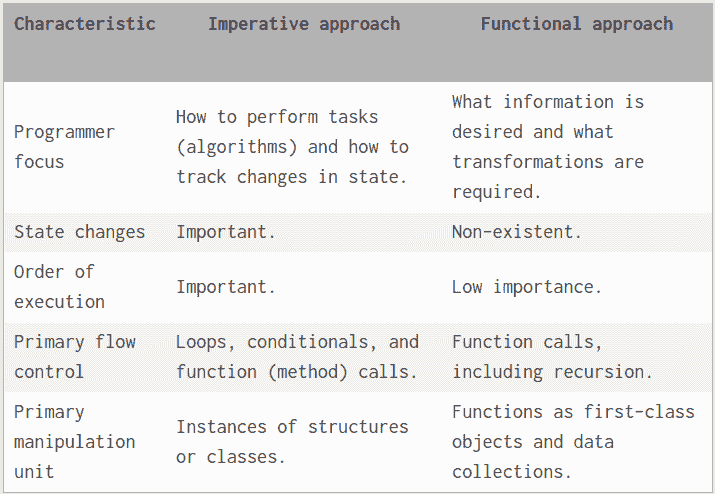
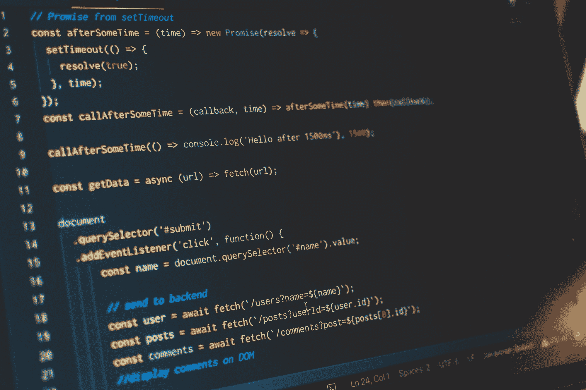

# 面向初学者的 JavaScript 函数式编程

> 原文：<https://www.freecodecamp.org/news/functional-programming-in-javascript-for-beginners/>

函数式编程并不是一种新的编码方法，但它在最近几年越来越受欢迎。

这是因为，一旦程序员理解了该技术背后的基础知识(并且能够使用它编写干净可靠的代码)，使用函数式方法编写的应用程序就更容易使用。

正因为如此，一旦你看完这本 [JavaScript 初学者手册](https://www.freecodecamp.org/news/the-complete-javascript-handbook-f26b2c71719c/)，理解函数式编程是值得的。

如果您经常使用 JavaScript，使用这种方法可以节省您的时间，并且可以使您的代码更容易使用，可能更安全。

在本文中，我们将研究函数式编程的基本原理，然后概述一些在 JavaScript 中使用这种方法的关键工具。

## 命令式编程与函数式编程

函数式编程的起源可以追溯到 20 世纪 30 年代 Lambda 演算的发明。

这是一种计算方法，[试图将常见的任务](https://en.wikipedia.org/wiki/Lambda_calculus)和功能定义为对数据结构(如数组和列表)的结构性操作，而不是对它们执行的数学功能。



[Image Source](https://android.jlelse.eu/how-to-wrap-your-imperative-brain-around-functional-reactive-programming-in-rxjava-91ac89a4eccf)

这听起来可能很抽象，尤其是如果您是编程新手。但事实上，函数式方法和命令式方法之间的区别可以通过一个例子简洁地表达出来。看看这些:

### 命令式:

```
const arr = [1, 2, 3, 4, 5, 6, 7, 8, 9];

function getOdds(arr) {
  let odds = [];
  for (let i = 0; i < arr.length + 1; i++) {
    if (i % 2 !== 0) {
      odds.push(i);
    }
  }
  return odds;
}

console.log(getOdds(arr)); // logs [1, 3, 5, 7, 9] 
```

### 功能性:

```
function getOdds2(arr){
return arr.filter(num => num % 2 !== 0)
}console.log(getOdds2(arr))
// logs [ 1, 3, 5, 7, 9 ]
const getOdds3 = arr => arr.filter(num => num % 2 !== 0)console.log(getOdds3(arr))
// logs [ 1, 3, 5, 7, 9 ]
```

如你所见，这些程序的工作方式非常不同。

必要的方法是定义一个数据结构，然后操纵它以获得我们需要的输出。在函数式方法中，我们使用过滤函数来定义一个编程函数，然后根据需要调用它。

当然，[函数式编程如何工作的大部分复杂性对最终用户是隐藏的，如果程序员使用前端开发框架，他们也是隐藏的。](https://www.freecodecamp.org/news/an-introduction-to-the-basic-principles-of-functional-programming-a2c2a15c84/)

但是即使从这个例子中也可以清楚地看到使用函数方法的优势——这种范式产生了更短的代码，更容易阅读、理解和审计。

## 为什么要使用函数式编程？

除了这一基本优势之外，使用函数式编程还有许多其他优势。

其中许多都源于一个简单的事实，即函数式代码比强制性定义的代码更容易阅读。因为人类可以很容易地看到一个功能程序是如何工作的，而不是为了理解它而必须拆开代码，所以测试的许多方面都得到了简化。

### 函数式编程通过渗透测试确保代码完整性

当代码可读时，渗透测试变得更加有效。这使得评估功能代码的完整性更加容易。

根据[云防御](https://www.clouddefense.ai/blog/penetration-testing)的软件开发人员 Barbara Ericson 的说法，渗透测试应该总是在 JavaScript 应用程序上进行，功能方法可以帮助使这一点更加严格。

这种易读性也简化了许多应用于新代码和应用程序开发的其他管理过程。

在函数式方法中，遵从过程要容易得多，因为程序员不应该太担心他们代码的执行。这意味着程序中处理敏感数据的部分可以与程序的其余部分分开，单独进行评估。

### 函数式编程使代码更容易阅读

然而，功能方法的优势不仅仅局限于代码评估。它们也延伸到开发它的过程。

事实上，函数式方法建立在 JavaScript 本身的优点和缺点的基础上。



[Image Source](https://itnext.io/why-are-we-creating-a-javascript-only-world-wide-web-db8c3a340b9)

通过使代码更容易阅读，您可以将更多的员工团队带入开发过程，即使他们对 JavaScript 没有深入的理解。

这是 DevOps 方法的一个关键原则，[可以帮助减少 JavaScript 代码中的漏洞](https://privacycanada.net/how-to-fight-common-java-security-vulnerabilities-from-devops/)。这也是一个通过对你的编码采取函数式方法来促进的过程。

## 函数式编程的关键工具

在将功能方法付诸实践时，您应该了解许多关键工具和概念。让我们来看看它们。

### 1.纯函数和不纯函数

在最基本的层面上，函数式方法寻求在不改变数据的情况下操纵数据。这意味着一个“功能函数”将获取数据，执行一些计算，并返回一个结果(所有这些都不需要重写数据结构本身的任何部分)。

以这种方式工作的函数称为“纯”函数，而不以这种方式工作的函数称为“不纯”函数。

```
 function getSquare(items) {
  var len = items.length;
  for (var i = 0; i < len; i++) {
    items[i] = items[i] * items[i];
  }
  return items;
}
```

这里的总体思路是让您正在处理的数据完全保持原样。

如果您想要合并两个数组，您不应该利用`Array.prototype.push()`策略(这会覆盖原始数据)。相反，使用`Array.prototype.concat()`函数，它将为您创建一个新的“工作”数组。

### 2.匿名函数

匿名函数也是函数式编程的一个重要部分，它源于 Lambda 演算。

顾名思义，匿名函数没有明确定义的名称。相反，它们是分配给变量的函数，并通过变量调用。

```
 alert((function(x) {
    return !(x > 1)
      ? 1
      : arguments.callee(x - 1) * x;
  })(20));
```

这样做的好处是，只要您能够跟踪哪些函数被分配给了哪些变量，就可以非常容易地调用它们，并且只需调用一个变量就可以将它们从一个模块传递到另一个模块。这为您提供了一种强大、灵活的处理函数的新方法。

### 3.递归函数

递归函数的使用是函数式编程的另一个标志。虽然递归的一般思想对于初学者来说也是熟悉的，但是函数式编程通过定义调用自身的函数来进一步发展这一思想。

```
function countDown(fromNumber) {
    console.log(fromNumber);

    let nextNumber = fromNumber - 1;

    if (nextNumber > 0) {
        countDown(nextNumber);
    }
}
countDown(3);
```

这使得递归的实现更加简单——很大程度上是因为程序员不需要使用循环来实现。

然而，它也伴随着危险。具体来说，函数调用本身使得意外创建无限循环变得更加容易，因此要注意用严格的停止执行方式来支持每个递归函数。

## 结论

尽管这三个概念是函数式编程的典型特征，但实际上这种范式的应用范围意味着它更多的是一种哲学，而不是一套设计良好的工具和过程。

向令人兴奋的函数式编程世界走几步，你会开始看到它的影响无处不在。事实上，它为今天使用的许多最常见的 JavaScript 实践提供了信息。

换句话说，尽管函数式编程表面上看起来很简单，但它对您的编码方式有着深远的影响。这就是它值得学习的原因，即使你并不总是使用它。