# 如何确保在线安全——确保您浏览安全的网络安全提示

> 原文：<https://www.freecodecamp.org/news/how-to-be-safe-online/>

互联网是一个连接世界的全球网络，提供了一个我们分享知识、信息、娱乐和交流的平台。

它已经成为我们生活中不可或缺的一部分，使我们依赖它来获得我们关心和感兴趣的每一点信息。

但是它带来的好处也伴随着危险。在网络犯罪日益增多的时代，互联网不再安全。使用互联网是必要的，但你应该总是小心使用它。

## 什么是互联网？

所以在我们开始今天的话题之前，我有一个问题要问大家:

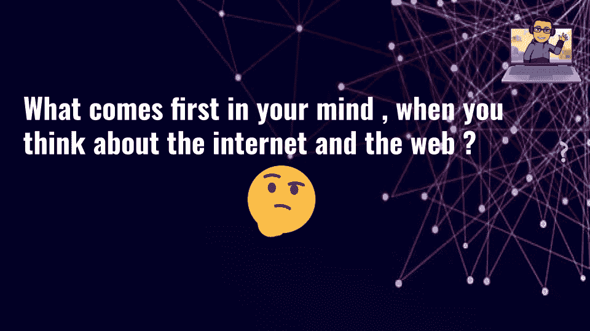

可能是社交媒体、你访问的网站、搜索引擎、你所在的组织等等...为了弄清楚我所说的“互联网”是什么意思，让我们来定义它。

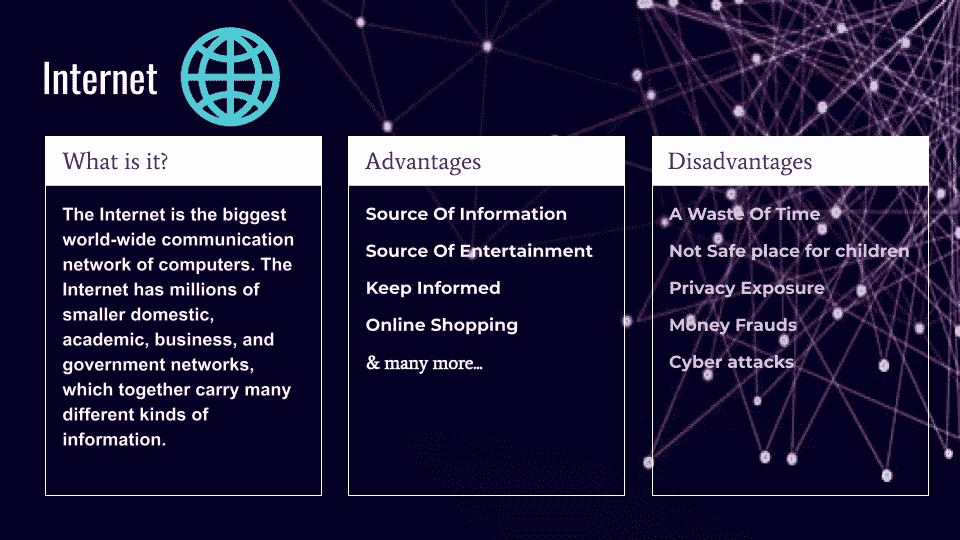

互联网是全世界计算机之间最大的连接！它包含数以百万计的小型家庭、学术、商业、社区和政府网络，这些网络共同承载着许多不同种类的信息。

这很好，但这也意味着你所有的数据和信息都可以公开😨！所以让我们来看看你如何安全地使用互联网。

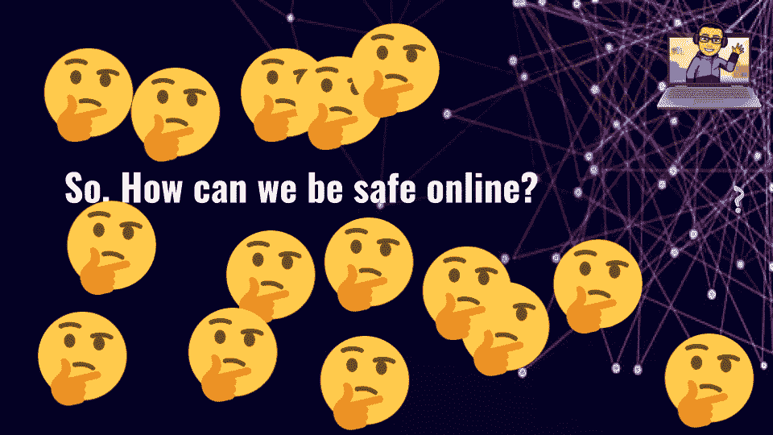

## 如何在网上安全

你可以采取各种预防措施来保证自己在互联网上的安全。现在让我们逐一讨论。

### 1.使用强密码

当你在一个平台上创建一个账户时，确保你使用一个强密码。这将有助于确保网络攻击者不能轻易突破密码，并在您的系统上从事可疑的活动。

现在，你可能在想**什么是强密码或弱密码？**

很多人常用的密码是弱密码——比如“0123456789”、“9876543210”或者“password”。攻击者可以很容易地发现这些弱密码。

但当密码不常见时，如“WA[T8{N#Tv4”，“h812h$$6y48”，或“#$U^d#v@4”，就更难猜了。

如果你不能自己创建一个强密码，你可以使用像 **[1password](https://1password.com/password-generator/)** 或 **[LastPass](https://www.lastpass.com/)** 这样的服务。它们帮助你创建难以猜测的强密码，给你一个安全的地方来存储这些密码和其他信息。

### 2.谨防骗局

如果你收到一封电子邮件，说你赢得了一大笔钱，或者提供了一些你意想不到的东西，要小心了。

这些骗局通常会询问您的个人和财务信息...一旦你结束了，他们就不会回应了。这被称为网络钓鱼攻击，黑客试图欺骗用户以获得一些个人利益。

那么让我们来看看如何保护自己免受这几类攻击:

首先，不要点击任何可疑邮件中提供的链接。如果你认为它的来源可靠，并且你点击了其中的任何一个链接，请确保该域名与该网站的域名相同，比如 example.com 应该是 example.com。攻击者很可能使用了真实网站的复制品，并试图获取该网站的帐户信息。

如果发现此类骗局，请尽快将该电子邮件标记为垃圾邮件。

永远不要回复这类邮件。不回复并将其报告为垃圾邮件有助于确保您将来不会成为此骗局的受害者。

其次，不要下载恶意邮件提供的任何文件，因为它们可能包含各种类型的病毒，如恶意软件、特洛伊木马等。

最后，我建议你尽快删除那封邮件(这是可选的，但这是个好主意)。然后你就再也不用担心那封邮件了:)

### 3.让您的操作系统和浏览器保持最新

每当你的浏览器或操作系统有新版本时，一定要尽快更新。旧版本可能安全性较低，或者不如新版本强大。所有这些都会导致你的系统受到更多的网络攻击。

为了让您的操作系统保持最新，只需将其设置为检查自动更新。您可以通过以下步骤实现这一点:

1.  转到您的设置

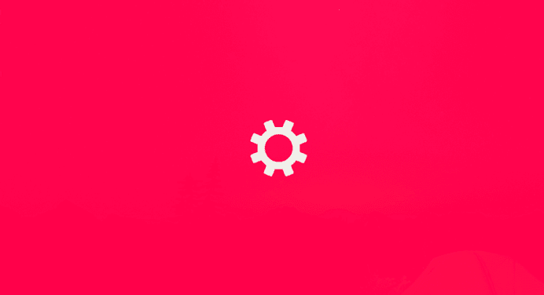

2.打开更新和安全性

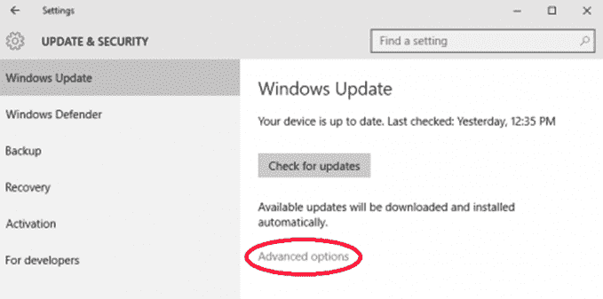

3.打开高级设置，设置为**自动**即可

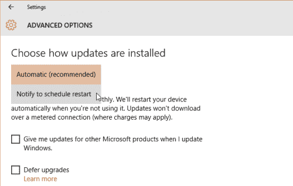

要使您的浏览器保持最新，只需遵循以下说明:

1.  转到您的浏览器设置:

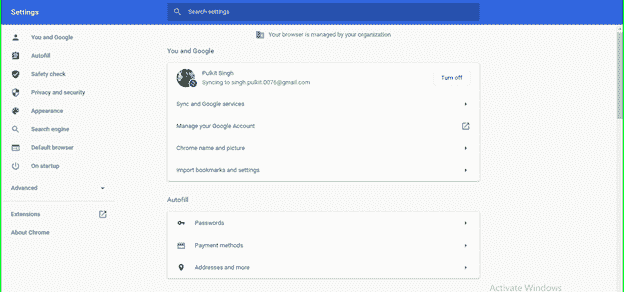

2.打开安全检查并点击立即安全检查:

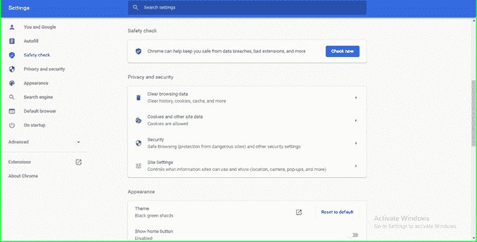

3.查看更新部分。如果您看不到更新按钮，这意味着您的浏览器是最新的🎉

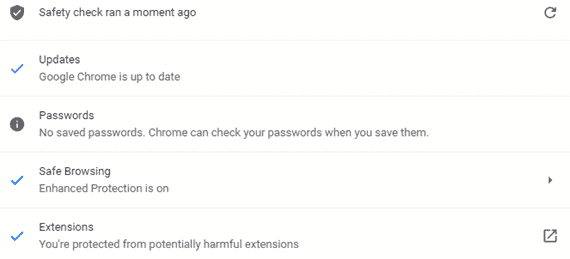

### 4.小心你点击的地方

当你点击任何东西或从网站或电子邮件下载东西时要小心。总是关闭弹出窗口，要求您下载任何不熟悉的软件或提供修复您的设备，等等。

为了帮助您和您的系统免受弹出窗口的攻击，请按照以下步骤在设置中禁用它们:

1.  在您的计算机上，打开您首选的浏览器
2.  打开设置

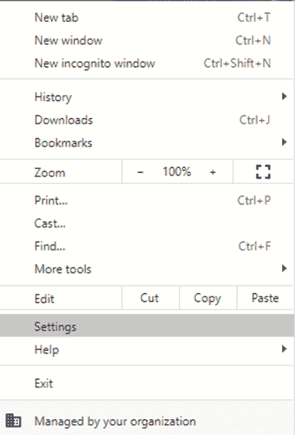

3.在“隐私和安全”部分，打开“网站设置”:

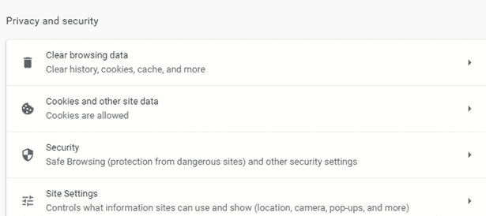

4.转到“弹出窗口和重定向”并在显示“允许”的地方关闭。

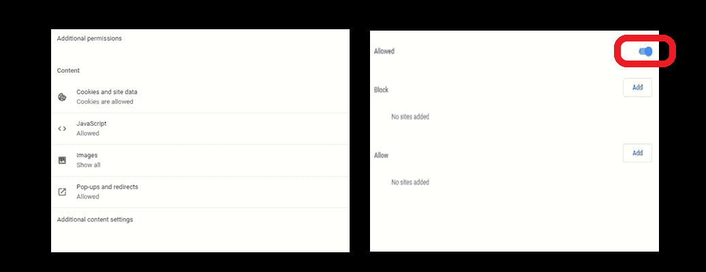

然后每当有一个弹出窗口，浏览器就会像这样阻止它:

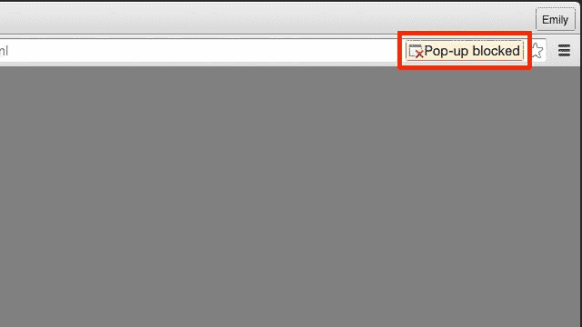

### 5.仅从可信来源下载内容

当您下载某些内容时，请确保网站是安全的，或者您是从受信任的来源下载的。

总有可能有人会欺骗你，告诉你一些虚假/欺骗性的东西，让你下载一个会损害你的计算机的产品。这些产品可能包含恶意软件、特洛伊木马等病毒，因此您应该避免使用它们。

### 6.使用安全网络

当你上网和访问各种网站时，检查它是否是安全的或不安全的来源。这一点很重要，因为通过不安全的网站分享你的个人信息意味着数据可能被泄露或窃取，并可能对你造成伤害。

以下是如何检查一个网站是否安全的方法:

1.  只需在地址栏中检查网站的 URL 旁边——如果它显示**“不安全”**,那么这意味着它不是一个安全的网站。
2.  在网站 URL 的开头，它应该包括**“https”**(“s”表示安全)。如果它只是“http ”,那么它就是一个不安全的网站。

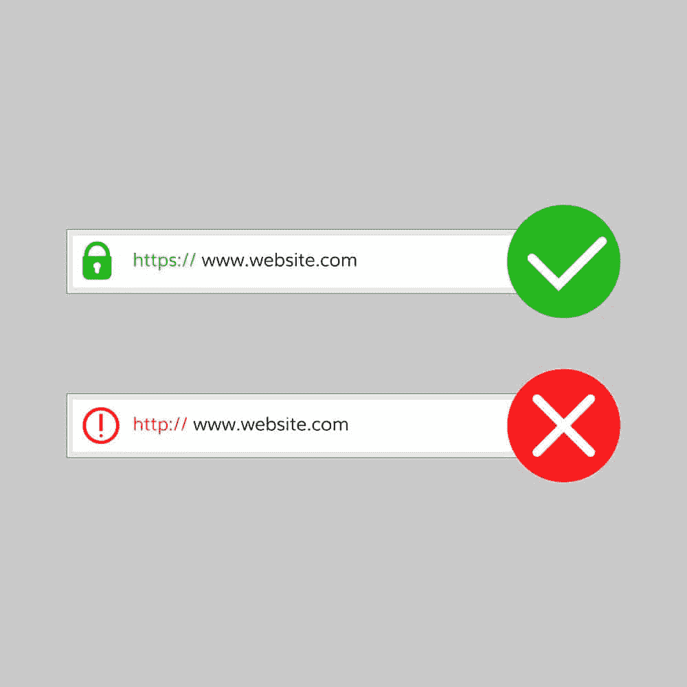

### 7.使用公共网络时要小心

当您的设备连接到任何公共网络时，例如咖啡馆的公共 wifi，您可能会受到攻击。如果你在这样的网络上，不要使用需要输入密码或其他个人信息的网站。

如果攻击者能够访问该 wifi 网络，他们就可以窃取您的数据。这可能会导致**中间人攻击(MITM )** 攻击者可以访问您和您正在使用的网站之间传递的信息(这意味着如果您输入任何个人或重要信息，如密码、信用卡详细信息等，那么这些信息也会被攻击者获得)。

发生这种情况是因为这些公共网络中的大多数**是未加密的**！

## 包扎

就是这样！

但是在你离开之前，要知道使用互联网的好处和坏处是一样多的。但是如果你在网上冲浪时总是小心翼翼，互联网可以帮助你更有效地工作。

### 🎉 🎉现在你可以在线工作了🎉 🎉