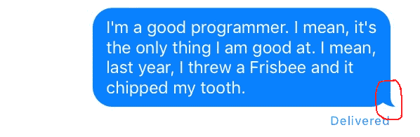
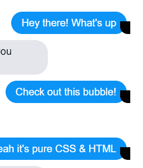
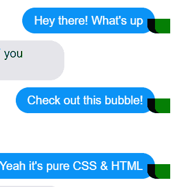
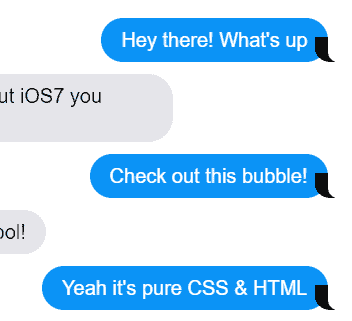
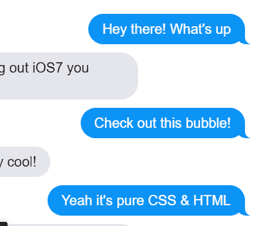
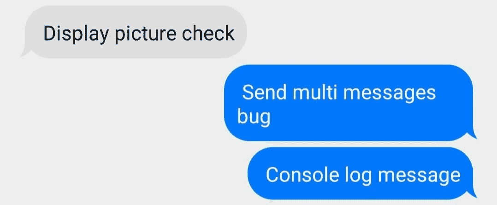

# 如何在 React Native 中设计类似 iMessage 的聊天气泡

> 原文：<https://www.freecodecamp.org/news/design-imessage-like-chat-bubble-react-native/>

不管你是不是苹果粉丝，你可能都会同意苹果确实有一个突破性的用户界面。iMessage 绝对是这个设计的重要组成部分。

弯箭是我一直很喜欢的东西，很久以来一直想复制。

经过大量的试验和错误，我终于能够找到一个变通办法来建立一个类似版本的 iMessage 的聊天泡沫。在本文中，我将带您了解构建一个看起来像苹果 iMessage 的聊天气泡所需的步骤。

如果你正在构建一个聊天应用程序，或者打算以消息的形式显示信息，我绝对推荐你尝试这种风格，因为它让你的应用程序看起来很酷，很专业。

### 先决条件

本文假设您了解以下基本知识:

*   JSX
*   反应自然
*   HTML 和 CSS

## 什么是聊天气泡？

聊天气泡基本上是一个容纳文本的容器。聊天气泡多用于即时通讯应用中，以有效显示聊天记录。

传统的方法是，发送的消息显示在屏幕的右侧，接收的消息显示在左侧，用不同的颜色来区分发送和接收的消息。

大多数消息应用程序都有一个基本的聊天气泡，这是一个带圆角的常规容器。其他应用程序和 iMessage 之间的主要区别在于有一个小的弧形箭头固定文本容器，看起来像这样:



## 如何建立一个看起来像 iMessage 的聊天气泡

如果我们仔细观察上面的图像，我们可以看到 iMessage 聊天气泡是一个常规聊天气泡和一个添加在角落的箭头的组合。

主要的挑战在于将箭头绑定到文本容器上。

在直接进入代码之前，我希望您知道这个箭头状的元素是如何创建和添加的。

首先，看看这个代码，它展示了如何使用 HTML & CSS 实现这个箭头。下面是它的代码片段。

```
p {
  max-width: 255px;
  word-wrap: break-word;
  margin-bottom: 12px;
  line-height: 24px;
  position: relative;
	padding: 10px 20px;
  border-radius: 25px;

  &:before, &:after {
    content: "";
		position: absolute;
    bottom: 0;
    height: 25px;
  }
}

.from-me {
	color: white; 
	background: #0B93F6;
	align-self: flex-end;

	&:before {
		right: -7px;
    width: 20px;
    background-color: #0B93F6;
		border-bottom-left-radius: 16px 14px;
	}

	&:after {
		right: -26px;
    width: 26px;
    background-color: white;
		border-bottom-left-radius: 10px;
	}
}
.from-them {
	background: #E5E5EA;
	color: black;
  align-self: flex-start;

	&:before {
		left: -7px;
    width: 20px;
    background-color: #E5E5EA;
		border-bottom-right-radius: 16px;
	}

	&:after {
		left: -26px;
    width: 26px;
    background-color: white;
		border-bottom-right-radius: 10px;
	}
}
```

如果你只是浏览代码，它可能看起来很可怕。所以让我们在原子水平上分解它，然后再把它们粘在一起。

`<**p>**`标签包含了样式约束，比如下边距、位置、填充等等。注意，这里使用的最大宽度是 255px，这是一个静态值。但是我们将使用一种动态的方法，因为聊天气泡需要在不同的屏幕尺寸上做出响应。

**`<p>`** 样式中的`&:before`和`&:after`定义了两个没有内容的元素。它们相对于 **`<p>`** 标签(文本容器)绝对定位，并放置在底部。它们的高度是 25px(箭头的高度)。

更进一步来说，`.from-me`(已发送消息)样式定义了文本为白色，背景为蓝色(#0b936f)，并放置在屏幕的右侧(align-self: flex-end)。

现在重要的部分来了——扩展 **`&:before`** 和**`&:after`**这是箭头的实际实现。

**`&:before`** 宽度为 20px，放置在右侧负 7 个像素处。它的左下边框半径为 16px，这是箭头弯曲的原因。

类似地， **`&:after`** 的宽度为 26px，位于右侧负 26 像素处。由于-7px > -26px，`&:after`放置在`&:before`元素的右侧，并与其部分重叠。

如果你仍然感到困惑，不要担心——只要参考下面的图片，就能更清楚地了解我一直在谈论的内容。



&:before with black background and bottom-left-radius



&:after overlapping &:before with green background



&:after background changed to white to match the background of the chat screen.



&:before background updated to #0b93f6 to match chat bubble color.

因此，基本上箭头是通过在聊天气泡的底部角落重叠两个元素并调整背景颜色以匹配聊天气泡和聊天屏幕的颜色来创建的。

再往前看，将 CSS 和 HTML 翻译成 JSX 是相当简单的，因为大多数事情都非常简单。

## 如何构建 React 原生版本

在开始之前，我想指出的是，这最适合使用 FlatList，我建议您使用它，而不要使用其他组件或功能，如 map(它在不同的屏幕和设备上缺乏一致性)。

这里我们要遵循的三个步骤是:

1.  创建带箭头的聊天气泡
2.  向聊天气泡和箭头添加样式
3.  在平面列表中嵌入聊天气泡

所以让我们开始吧。

首先，我们将创建带有箭头的聊天气泡，如下所示:

```
<View style={{
                    backgroundColor: "#0078fe",
                    padding:10,
                    marginLeft: '45%',
                    borderRadius: 5,
                    //marginBottom: 15,
                    marginTop: 5,
                    marginRight: "5%",
                    maxWidth: '50%',
                    alignSelf: 'flex-end',
                    //maxWidth: 500,

                    borderRadius: 20,
                  }} key={index}>

                    <Text style={{ fontSize: 16, color: "#fff", }} key={index}>{item.text}</Text>

                      <View style={styles.rightArrow}></View>

                      <View style={styles.rightArrowOverlap}></View>

</View>

//Recevied Message
      <View style={{
                    backgroundColor: "#dedede",
                    padding:10,
                    borderRadius: 5,
                    marginTop: 5,
                    marginLeft: "5%",
                    maxWidth: '50%',
                    alignSelf: 'flex-start',
                    //maxWidth: 500,
                    //padding: 14,

                    //alignItems:"center",
                    borderRadius: 20,
                  }} key={index}>

                      <Text style={{ fontSize: 16, color: "#000",justifyContent:"center" }} key={index}> {item.text}</Text>
                      <View style={styles.leftArrow}>

                      </View>
                      <View style={styles.leftArrowOverlap}></View>

                    </View> 
```

与 HTML 版本相比，最外面的 **`<View>`** 标签充当‘p’标签。剩下的两个 **`<View>`** 标签充当`&:before`和`&:after`。

接下来，我们将向聊天气泡和箭头添加样式，如下所示:

```
const styles = StyleSheet.create({
rightArrow: {
  position: "absolute",
  backgroundColor: "#0078fe",
  //backgroundColor:"red",
  width: 20,
  height: 25,
  bottom: 0,
  borderBottomLeftRadius: 25,
  right: -10
},

rightArrowOverlap: {
  position: "absolute",
  backgroundColor: "#eeeeee",
  //backgroundColor:"green",
  width: 20,
  height: 35,
  bottom: -6,
  borderBottomLeftRadius: 18,
  right: -20

},

/*Arrow head for recevied messages*/
leftArrow: {
    position: "absolute",
    backgroundColor: "#dedede",
    //backgroundColor:"red",
    width: 20,
    height: 25,
    bottom: 0,
    borderBottomRightRadius: 25,
    left: -10
},

leftArrowOverlap: {
    position: "absolute",
    backgroundColor: "#eeeeee",
    //backgroundColor:"green",
    width: 20,
    height: 35,
    bottom: -6,
    borderBottomRightRadius: 18,
    left: -20

},
})
```

然后我们将它嵌入到 FlatList 中:

```
<FlatList
        //inverted
        style={{backgroundColor:"#eeeeee"}}
        data={this.state.chat_log}
        ref={ref => (this.FlatListRef = ref)} // assign the flatlist's ref to your component's FlatListRef...

        renderItem = {({item,index})=>{

          rowId={index}

            if (SENT_MESSAGE) { //change as per your code logic

                return (

                  <View style={{
                    backgroundColor: "#0078fe",
                    padding:10,
                    marginLeft: '45%',
                    borderRadius: 5,

                    marginTop: 5,
                    marginRight: "5%",
                    maxWidth: '50%',
                    alignSelf: 'flex-end',
                    borderRadius: 20,
                  }} key={index}>

                    <Text style={{ fontSize: 16, color: "#fff", }} key={index}> {item.text}</Text>

                      <View style={styles.rightArrow}>

                      </View>
                      <View style={styles.rightArrowOverlap}></View>

                  </View>
                )

            } else {

                return (
                  <View style={{
                    backgroundColor: "#dedede",
                    padding:10,
                    borderRadius: 5,
                    marginTop: 5,
                    marginLeft: "5%",
                    maxWidth: '50%',
                    alignSelf: 'flex-start',
                    //maxWidth: 500,
                    //padding: 14,

                    //alignItems:"center",
                    borderRadius: 20,
                  }} key={index}>

                      <Text style={{ fontSize: 16, color: "#000",justifyContent:"center" }} key={index}> {item.text}</Text>
                      <View style={styles.leftArrow}>

                      </View>
                      <View style={styles.leftArrowOverlap}></View>

                  </View>
                )

            }

        }

        keyExtractor={(item,index)=>index.toString()}
        /> 
```

诸如**边框半径、填充、边距、**和**背景色**的值是任意值，可以根据需要进行更改。因此，请随意尝试，做出最符合您需求的改变。

上述代码的结果如下所示:



Chat bubble appearance, as tested on several devices(Android).

看起来很酷，不是吗？；)

## 结论

恭喜你！您创建了一个聊天气泡，看起来就像 iMessage 使用的那个。

我希望这篇文章对你有所帮助。如果是的话，一定要和你的朋友和同事分享。

还有问题吗？不要犹豫与我联系，我会尽快回复你。

你也可以在[LinkedIn](https://in.linkedin.com/in/prajwal-kulkarni)/[insta gram](https://instagram.com/prajwalkulkarni_)上与我联系。