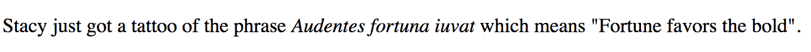
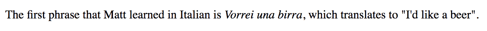
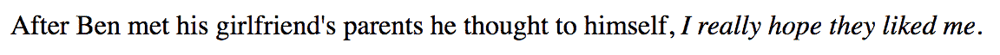
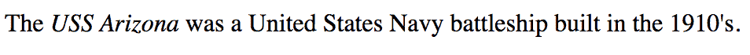
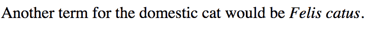
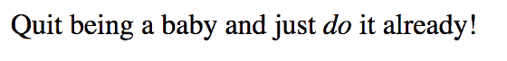
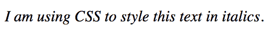

# HTML 斜体教程——如何用*标签*使文本变成斜体

> 原文：<https://www.freecodecamp.org/news/html-italics-tutorial-how-to-make-text-italic-with-the-i-tag/>

在本文中，我们将学习如何使用`<i>`标签，以及它与`<em>`标签有何不同。

在以前的 HTML 版本中，`<i>`标签用于以斜体显示文本。但是在 HTML 5 中，定义发生了变化。我们将探索这个新的定义，并了解使用 CSS 来设置斜体文本样式的其他方法。

## 什么是*标签？*

标签，或者惯用的文本元素，是一段文本，代表文本的情绪或质量的变化。该文本以斜体显示。

让我们来看看您可能想要使用`<i>`标签的几个原因。

### 使用*标签标记不同语言的短语*

您可以使用`<i>`标签来标记一段不同语言的文本。本示例将一个拉丁语短语设为斜体。

```
<p>Stacy just got a tattoo of the phrase <i>Audentes fortuna iuvat</i> which means "Fortune favors the bold".</p> 
```



您还可以使用`<i>`标签中的`lang`属性来表示与其周围文本语言不同的短语。

```
<p>The first phrase that Matt learned in Italian is <i lang="it">Vorrei una birra</i>, which translates to "I'd like a beer".</p> 
```



### 使用*标签表达某人的想法*

还可以用`<i>`标签来突出一个人内心的想法。

```
<p>After Ben met his girlfriend's parents he thought to himself, <i>I really hope they liked me</i>.</p> 
```



### 使用*标签作为船名*

如果您想使用一艘船的名字，那么您可以将这个名字包含在`<i>`标签中。

```
<p>The <i>USS Arizona</i> was a United States Navy battleship built in the 1910's.</p> 
```



### 使用*标签进行分类描述*

根据生物多样性公约，

> 分类学是对生物体进行命名、描述和分类的科学，包括世界上所有的植物、动物和微生物。

这将是一个使用`<i>`标签表示*猫科动物*的例子。

```
<p>Another term for the domestic cat would be <i>Felis catus</i>.</p> 
```



## **HTML 中< i >标签和< em >标签的区别**

你可能认为`<i>`和`<em>`标签有相同的意思，因为它们在浏览器中看起来是一样的。但是这两个标签具有不同的含义。

当您想要强调一个单词或一段文本时，应该使用`<em>`标签或强调元素。

下面是一个使用`<em>`标签的例子。

```
 <p>Quit being a baby and just <em>do</em> it already!</p> 
```



人类和屏幕阅读器会把单词“do”放在单词重音上。这不同于`<i>`标签，它没有对文本进行额外的强调。

## 你应该使用*标签来设计样式吗？*

你不应该使用`<i>`标签来设计样式。如果你想让文本变成斜体，那么你应该使用 CSS `font-style`属性。

```
<p class="demo-para">I am using CSS to style this text in italics.</p> 
```

```
.demo-para {
  font-style: italic;
}
```



## 图标应该使用*还是标签？*

多年来，关于使用`<i>`标签或`<span>`标签在你的网站上添加图标是否“正确”一直存在争议。

有些人会争辩说这没有什么错，这是很常见的做法，而其他人认为这是对`<i>`标签的误用，你应该使用`<span>`标签来代替。

以下是来自 [Font Awesome](https://fontawesome.com/how-to-use/on-the-web/referencing-icons/basic-use) 关于使用`<i>`作为其图标的回应:

> 我们喜欢使用`<i>`标签是因为简洁，因为现在大多数人使用`<em></em>`来强调/斜体的语义文本。如果那不是你喜欢的，使用`<span>`在语义上更正确。

我的目标不是让你在这场辩论中选择一方而不是另一方，而是让你意识到这场正在进行的讨论。

## 结论

标签是一段文本，代表了文本的情绪或质量的变化。如果你想强调文本，那么合适的标签应该是`<em>`标签。

`<i>`标签不应用于样式目的。用斜体显示文本的正确方法是使用 CSS `font-style`属性。

我希望你喜欢这篇文章，并了解什么时候使用`<i>`标签。