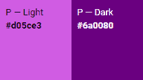

# 如何使用 Jetpack Compose 设计应用程序的样式和主题

> 原文：<https://www.freecodecamp.org/news/how-to-style-and-theme-an-app-with-jetpack-compose/>

在本文中，我们将学习如何在 Jetpack Compose 中设计应用程序的样式和主题。

Compose 是一个新的 Android UI 框架(尽管桌面和 Web 支持正在开发中)，它取代了旧的基于 XML 的视图系统。

虽然在撰写本文时仍处于测试版，但我不认为库的这一特定部分会在稳定版中发生巨大变化。

主题包括:

*   XML 方法的简要概述
*   如何从基于 XML 的颜色、主题和字体系统中迁移
*   如何只用几行代码就为你的应用程序设置明暗主题
*   如何在组件中使用新的基于 Kotlin 的样式信息
*   如何专门设计文本组件的样式

在继续之前，理解什么是可组合的是很重要的。我不会在这里停下来解释这个概念，因为我已经在[这篇文章](https://www.freecodecamp.org/news/jetpack-compose-beginner-tutorial-composables-recomposition/)中解释过了。

[https://www.youtube.com/embed/81r-vwPxlaw?feature=oembed](https://www.youtube.com/embed/81r-vwPxlaw?feature=oembed)

Watch this short video for a summary.

## 我们过去如何使用 XML 资源来设计 Android 应用程序

像往常一样，我喜欢与你分享这些话题背后的动机和一些历史。如果你不在乎，请随意跳到下一部分，在那里我们将进入实际的东西。

### Android 资源

Android 应用资源系统是 Android 团队值得击掌称赞的地方，至少在我看来是这样。但是就像每个设计决策一样，一种情况下的特性在另一种情况下会变成缺陷。

具体来说，对于平台和应用程序开发人员来说，最大的挑战之一就是创建我称之为**本地化资源**。我指的是构建应用程序的挑战:

*   以各种不同的语言和字母显示文本和图形
*   外观与各种外形尺寸(尺寸、密度等)相称。)

这只是两个常见的例子，还有很多。资源系统为我们提供了一个地方，应用程序开发人员可以提供本地化的资源，平台可以在编译时选择这些资源。这让我们不必自己编写样板代码。

### 特色还是瑕疵？

虽然我从来不想自己管理本地化字符串资源所需的样板代码，但这并不意味着我喜欢编写 XML。

事实上，**比起 Kotlin 或 Swift 等现代、地道、优雅的语言，我更喜欢用 XML** 做一些事情。撇开个人偏好不谈，XML 资源并不总是理想的还有一个更技术性的原因。

请注意，这并不意味着对平台开发者/工程师的批评。这仅仅是对设计决策总是有收益和成本的观察。

为了将基于 XML 的资源集成到基于 JVM 的应用程序代码中，我们必须拥有**层翻译**(编译)和**平台桥**(API)。这给平台和应用程序开发人员都带来了困难。

我遇到的两个常见问题是:

*   我希望在不希望与提供资源的平台 API 紧密耦合的地方访问资源
*   我不得不编写一些荒谬的样板代码来改变视图的外观(也就是说，覆盖资源样式和主题中定义的一些东西)

对所有相关人员来说，**根本问题**是**与视图系统和 Android 资源系统的紧密耦合**(它们本身紧密耦合在一起)。

对于平台开发人员来说，这意味着他们必须在庞大而陈旧的代码库之上构建或工作。此外，他们还必须尝试让新功能在旧版本的 Android 操作系统上运行，这将成为一项费力不讨好的工作。

对于我们这些应用程序开发人员来说，最常见的结果是大量的**样板代码、**一些**针对直觉上看起来应该是一行程序的东西的不成熟的变通办法**。更不用说获取这些资源的主要 API 是`Context`，这是一个你真的不想在内存中泄露的类。

**输入 Jetpack Compose。**

## 如何使用 Jetpack Compose 设置主题、颜色和字体

随着我们对旧系统的回顾的结束，让我们探索一种更漂亮、更简单的方式来设计 Android 应用程序的风格和主题。我说过我会保持这种务实，但允许一点。

由于我们将在 Kotlin 中完成这项工作，这意味着一件非常重要的事情:我们和平台开发人员都不再受 XML 和 JVM 之间的翻译(编译)和 API 桥(Android 的`R`类和`Context`)的束缚。

简单来说，这意味着**更少的样板代码**，以及**更多的运行时控制**。

对于本文的实用部分，我给你的建议是按照我解释的顺序来进行这个过程。我按照在新应用中编写代码时遵循的顺序对其进行了组织。

### 如何用 Kotlin Compose 替换 Colors.xml 资源

如果你还没有决定你的应用的颜色方案，我建议你使用官方材料设计网站上的各种资源。试用:

*   [调色板](https://material.io/design/color/the-color-system.html#tools-for-picking-colors)
*   [颜色工具](https://material.io/resources/color/)

如果你计划支持浅色和深色的应用程序主题(稍后解释)，尝试选择一个支持白色文本的配色方案和一个支持黑色文本的配色方案。



Example of light and dark color schemes.

创建一个类似于 [Color.kt](https://github.com/BracketCove/GraphSudokuOpen/blob/master/app/src/main/java/com/bracketcove/graphsudoku/ui/Color.kt) 的文件(名字并不重要)，并用不可变的 **val** ues 填充它:

```
import androidx.compose.ui.graphics.Color

val primaryGreen = Color(0XFF00bc00)
val primaryCharcoal = Color(0xFF2b2b2b)
val accentAmber = Color(0xFFffe400)

val textColorLight = Color(0xDCFFFFFF)
val textColorDark = Color(0xFFf3f3f3)
val gridLineColorLight = Color.Black
//...
```

您可以使用像`Color.Black`这样的预定义值，也可以提供您自己的 ARGB 十六进制值。

既然 ARGB 妖术只是一堆行话来描述“`0XFF00bc00`到底是什么意思，让我来翻译一下:

*   前两个字符`0x`告诉编译器这是一个十六进制数
*   第二个两个字符“`FF`或“【T1””，以十六进制表示透明/不透明/**α**
*   剩下的六个字符对代表 **R** ed、 **G** reen 和 **B** lue

### 如何添加字体和替换`fontFamily`属性

排版(字体)也非常容易管理。这就是 Kotlin 的默认参数非常有用的地方。

创建一个类似于 [Type.kt](https://github.com/BracketCove/GraphSudokuOpen/blob/master/app/src/main/java/com/bracketcove/graphsudoku/ui/Type.kt) 的文件(名字仍然无关紧要)并创建`Typography`类...：

```
val typography = Typography(
    body1 = TextStyle(
        fontFamily = FontFamily.Default,
        fontWeight = FontWeight.Normal,
        fontSize = 16.sp
    ),

    button = TextStyle(
        fontFamily = FontFamily.Default,
        fontWeight = FontWeight.Bold,
        fontSize = 32.sp
    ),

    caption = TextStyle(
        fontFamily = FontFamily.Default,
        fontWeight = FontWeight.Normal,
        fontSize = 12.sp
    )
)
//...
```

...还有一些`TextStyle` 类:

```
//...
val mainTitle = TextStyle(
    fontFamily = FontFamily.Default,
    fontWeight = FontWeight.Light,
    fontSize = 48.sp,
    textAlign = TextAlign.Center
)

fun dropdownText(color: Color) = TextStyle(
    fontFamily = FontFamily.Default,
    fontWeight = FontWeight.Normal,
    fontSize = 32.sp,
    textAlign = TextAlign.Center,
    color = color
)
//...
```

您是否提供公共函数或值(我建议不要在这里使用`**var**`)取决于您的个人偏好和当前需求。

### 如何在 Jetpack Compose 中创建应用程序主题

在组件中使用主题之前，您需要配置的最后一件事是一个`MaterialTheme @Composable`。我有我的，还有我的明暗调色板在一个叫做 [GraphSudokuTheme](https://github.com/BracketCove/GraphSudokuOpen/blob/master/app/src/main/java/com/bracketcove/graphsudoku/ui/GraphSudokuTheme.kt) 的文件里:

```
import androidx.compose.foundation.isSystemInDarkTheme
import androidx.compose.material.MaterialTheme
import androidx.compose.material.darkColors
import androidx.compose.material.lightColors
import androidx.compose.runtime.Composable
import androidx.compose.ui.graphics.Color

private val LightColorPalette = lightColors(
    primary = primaryGreen,
    secondary = textColorLight,
    surface = lightGrey,
    primaryVariant = gridLineColorLight,
    onPrimary = accentAmber,
    onSurface = accentAmber
)

private val DarkColorPalette = darkColors(
    //main background color
    primary = primaryCharcoal,
    //used for text color
    secondary = textColorDark,
    //background of sudoku board
    surface = lightGreyAlpha,
    //grid lines of sudoku board
    primaryVariant = gridLineColorLight,
    onPrimary = accentAmber,

    onSurface = accentAmber

)

@Composable
fun GraphSudokuTheme(
    darkTheme: Boolean = isSystemInDarkTheme(),
    content: @Composable () -> Unit
) {

    MaterialTheme(
        colors = if (darkTheme) DarkColorPalette else LightColorPalette,
        typography = typography,
        shapes = shapes,
        content = content
    )
} 
```

既然你应该已经熟悉了什么是可组合的(我给了你合理的警告)，这里唯一的新东西就是`darkTheme: Boolean = isSystemInDarkTheme()`。

简单来说，`isSystemInDarkTheme()`是一个向任何兼容的 Android 设备询问用户偏好浅色还是深色主题的呼叫。

它**返回一个布尔值**，我们可以在一个三元(条件)赋值表达式中使用，比如`colors = if (darkTheme) DarkColorPalette else LightColorPalette`。

事实上就是这样。几分钟内定义的颜色、字体和两个主题。

## 如何在作曲中使用主题

现在是时候在你的应用程序中使用这个主题了。在这个只有两个主屏幕的应用程序中，我只是使用一个[活动](https://github.com/BracketCove/GraphSudokuOpen/blob/master/app/src/main/java/com/bracketcove/graphsudoku/ui/activegame/ActiveGameActivity.kt)作为我的组件的**容器**:

```
class NewGameActivity : AppCompatActivity(), NewGameContainer {
	//...
    override fun onCreate(savedInstanceState: Bundle?) {
        super.onCreate(savedInstanceState)
		//...

        setContent {
            GraphSudokuTheme {
                NewGameScreen(
                    onEventHandler = logic::onEvent,
                    viewModel
                )
            }
        }
		//...
    }
```

无论你发现自己在哪里调用`setContent {}`，我对初学者的建议是立即将你的主题可组合放入其中。这样做将导致样式信息**级联/继承到每个嵌套的可组合**。

你完了！差不多了。

## 如何覆盖样式和主题

如果可以的话，试着在你的浅色和深色调色板中加入任何你想要的颜色。这样，当您调用`MaterialTheme.colors.<Color>`时，系统将处理必要的条件逻辑来选择合适的调色板:

```
@Composable
fun NewGameContent(
    onEventHandler: (NewGameEvent) -> Unit,
    viewModel: NewGameViewModel
) {
    Surface(
        Modifier
            .wrapContentHeight()
            .fillMaxWidth()
    ) {
        ConstraintLayout(Modifier.background(MaterialTheme.colors.primary)) { 
        	//...
        }
        //...
      }
} 
```

但是，有时候自己写条件逻辑更合适...或者我只是变懒了。幸运的是，Compose 将许多这样的配置作为属性提供:

```
@Composable
fun DoneIcon(onEventHandler: (NewGameEvent) -> Unit) {
    Icon(
        imageVector = Icons.Filled.Done,
        tint = if (MaterialTheme.colors.isLight) textColorLight 
        else textColorDark,
        contentDescription = null,
        modifier = Modifier
            .clickable(
            //...
            )
    )
}
```

返回一个布尔值，表明它们处于什么模式，然后我们可以从那里使用另一个三元赋值。

### 如何设置可组合文本的样式

只需将`style`参数设置为您的一种文本样式(无论它来自`MaterialTheme`还是来自`Type.kt`中的一种样式):

```
Text(
    text = stat.toTime(),
    style = statsLabel.copy(
        color = if (isZero) Color.White
        else MaterialTheme.colors.onPrimary,
    fontWeight = FontWeight.Normal
    ),
    modifier = Modifier
        .wrapContentSize()
        .padding(end = 2.dp, bottom = 4.dp),
        textAlign = TextAlign.End
)
```

`TextStyle`有自己的`copy`功能，随时可以覆盖任何内容。

就是这样！现在，您已经知道如何使用 Jetpack Compose 来设计应用程序的样式和主题。感谢阅读:)

### **社交**

你可以在 [Instagram 这里](https://www.instagram.com/rkay301/)和 [Twitter 这里](https://twitter.com/wiseAss301)找到我。

### 下面是我的一些教程&课程

[https://youtube.com/wiseass](https://www.youtube.com/channel/UCSwuCetC3YlO1Y7bqVW5GHg)https://www.freecodecamp.org/news/author/ryan-michael-kay/T2[https://skl.sh/35IdKsj](https://skl.sh/35IdKsj)(安卓工作室安卓入门)