# Three.js 教程-如何在 3D 中构建一个简单的带有纹理的汽车

> 原文：<https://www.freecodecamp.org/news/three-js-tutorial/>

用 Three.js 在浏览器中拼凑一个 3D 场景就像玩乐高一样。我们将一些盒子放在一起，添加灯光，定义一个相机，然后 Three.js 渲染 3D 图像。

在本教程中，我们将从盒子中组装一辆极简主义的汽车，并学习如何将纹理映射到它上面。

首先，我们将设置一些东西——我们将定义灯光、摄像机和渲染器。然后我们将学习如何定义几何图形和材质来创建 3D 对象。最后，我们将使用 JavaScript 和 HTML Canvas 对纹理进行编码。

## 如何设置 Three.js 项目

Three.js 是一个外部库，所以首先我们需要将它添加到我们的项目中。我使用 NPM 将它安装到我的项目中，然后在 JavaScript 文件的开头导入它。

```
import * as THREE from "three"; 

const scene = new THREE.Scene();

. . .
```

首先，我们需要定义场景。场景是一个容器，其中包含了我们想要与灯光一起显示的所有 3D 对象。我们将在这个场景中添加一辆汽车，但是首先让我们设置灯光、摄像机和渲染器。

### 如何设置灯光

我们将在场景中添加两个灯光:一个环境光和一个平行光。我们通过设置颜色和强度来定义这两者。

颜色被定义为十六进制值。在这种情况下，我们将其设置为白色。强度是一个介于 0 和 1 之间的数字，由于它们同时发光，我们希望这些值在 0.5 左右。

```
. . . 

const ambientLight = new THREE.AmbientLight(0xffffff, 0.6);
scene.add(ambientLight);

const directionalLight = new THREE.DirectionalLight(0xffffff, 0.8);
directionalLight.position.set(200, 500, 300);
scene.add(directionalLight); 

. . .
```

环境光从各个方向照射，为我们的几何体提供了一个基色，而平行光模拟太阳。

平行光从很远的地方发出平行光线。我们为这种光线设置一个位置，定义这些光线的方向。

这个位置可能有点混乱，让我解释一下。在所有平行光线中，我们特别定义了一条。这条特定的光线将从我们定义的位置(200，500，300)照射到 0，0，0 坐标。其余的将与它平行。

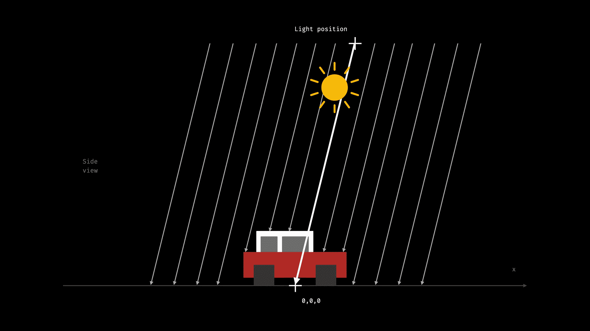

由于光线是平行的，它们从非常远的地方发出，精确的坐标在这里并不重要——相反，它们的比例很重要。

三个位置参数是 X、Y 和 Z 坐标。默认情况下，Y 轴指向上方，因为它的值最高(500)，这意味着我们的汽车顶部接收到的光线最多。所以会是最亮的。

其他两个值定义了光线沿 X 和 Z 轴弯曲的程度，也就是汽车正面和侧面接收到的光线量。

### 如何安装照相机

接下来，让我们设置定义我们如何看待这个场景的相机。

这里有两个选项-透视相机和正交相机。视频游戏大多使用透视相机，但我们将使用正交相机，以获得更小的几何外观。

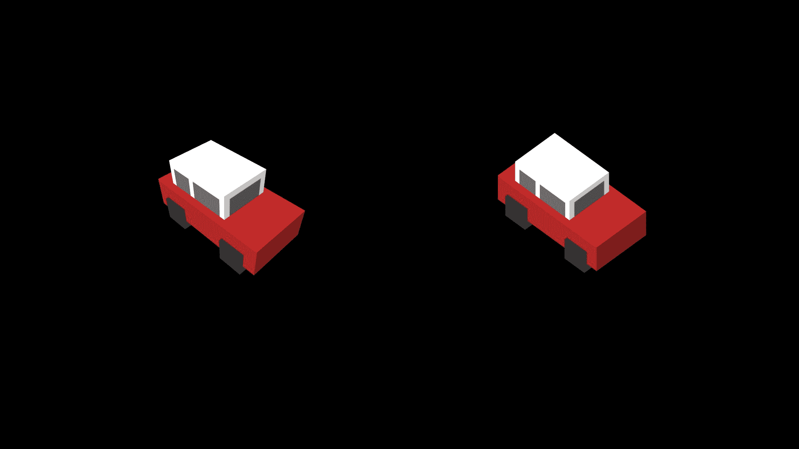

在[我之前的文章](https://www.freecodecamp.org/news/render-3d-objects-in-browser-drawing-a-box-with-threejs/)中，我们更详细地讨论了两款相机的区别。因此，在这一次，我们将只讨论如何设置一个正交相机。

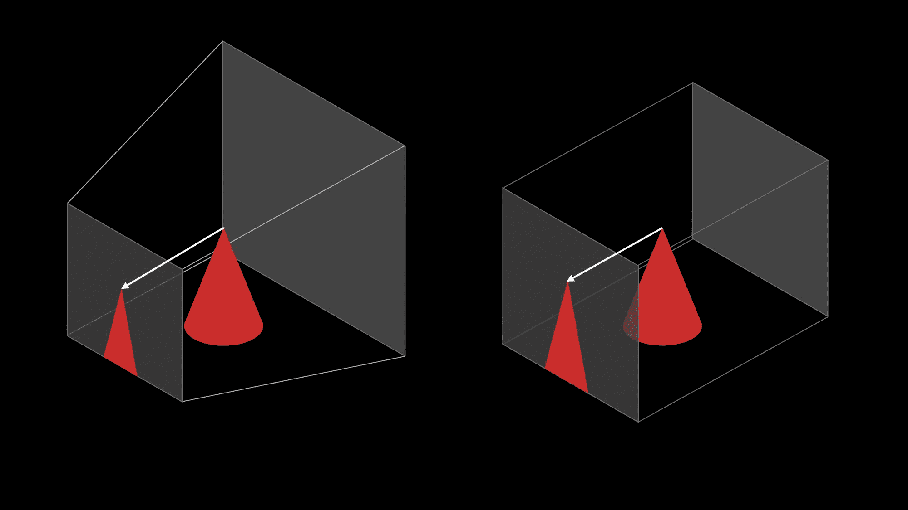

对于摄像机，我们需要定义一个视图截锥。这是 3D 空间中将要投影到屏幕上的区域。

在正交相机的情况下，这是一个盒子。相机将这个盒子中的 3D 对象投射到它的一侧。因为每条投影线都是平行的，所以正交相机不会扭曲几何图形。

```
. . .

// Setting up camera
const aspectRatio = window.innerWidth / window.innerHeight;
const cameraWidth = 150;
const cameraHeight = cameraWidth / aspectRatio;

const camera = new THREE.OrthographicCamera(
  cameraWidth / -2, // left
  cameraWidth / 2, // right
  cameraHeight / 2, // top
  cameraHeight / -2, // bottom
  0, // near plane
  1000 // far plane
);
camera.position.set(200, 200, 200);
camera.lookAt(0, 10, 0);

. . .
```

要设置正交摄像机，我们必须定义平截头体的每一边离视点有多远。我们定义左侧向左 75 个单位，右侧平面向右 75 个单位，依此类推。

这里这些单位不代表屏幕像素。渲染图像的大小将在渲染器中定义。这里，这些值具有我们在 3D 空间中使用的任意单位。稍后，当在 3D 空间中定义 3D 对象时，我们将使用相同的单位来设置它们的大小和位置。

一旦我们定义了一个摄像机，我们还需要定位它并把它转向一个方向。我们在每个维度上移动相机 200 个单位，然后我们设置它向后看向 0，10，0 坐标。这几乎是在原点。我们看向稍微高于地面的一个点，这是我们汽车的中心。

### 如何设置渲染器

我们需要设置的最后一部分是一个渲染器，它根据我们的相机将场景渲染到我们的浏览器中。我们这样定义 WebGLRenderer:

```
. . .

// Set up renderer
const renderer = new THREE.WebGLRenderer({ antialias: true });
renderer.setSize(window.innerWidth, window.innerHeight);
renderer.render(scene, camera);

document.body.appendChild(renderer.domElement);
```

在这里，我们还设置了画布的大小。这是我们设置像素大小的唯一地方，因为我们设置它在浏览器中的显示方式。如果我们想填满整个浏览器窗口，我们传递窗口的大小。

最后，最后一行将这个渲染图像添加到我们的 HTML 文档中。它创建一个 HTML Canvas 元素来显示呈现的图像，并将其添加到 DOM 中。

## 如何用 Three.js 制造汽车

现在让我们看看如何组装一辆汽车。首先，我们将创建一个没有纹理的汽车。这将是一个极简主义的设计——我们将把四个盒子放在一起。

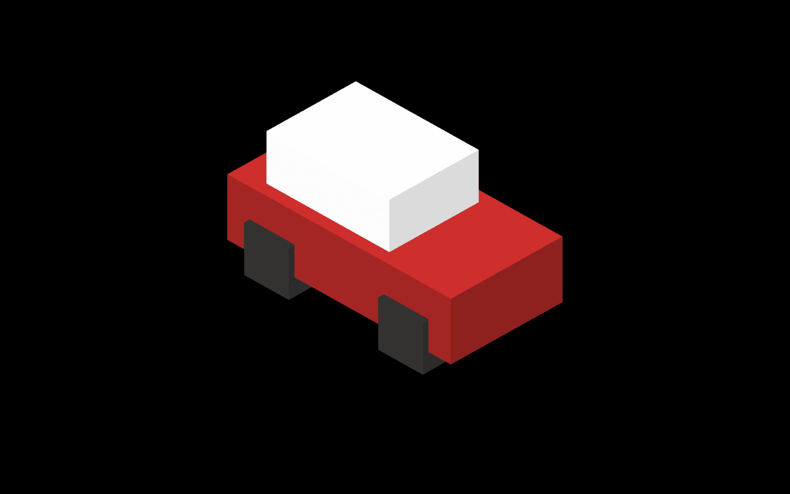

### 如何添加盒子

首先，我们创建一对轮子。我们将定义一个灰色的盒子来表示一个左轮和一个右轮。因为我们从下面看不到汽车，所以我们不会注意到我们只有一个大箱子，而不是有一个独立的左右车轮。

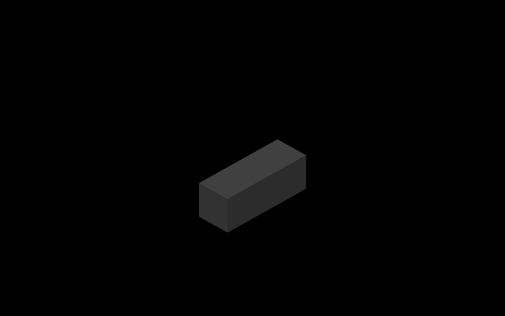

我们需要在汽车的前后各有一对轮子，这样我们就可以创建一个可重复使用的功能。

```
. . . 

function createWheels() {
  const geometry = new THREE.BoxBufferGeometry(12, 12, 33);
  const material = new THREE.MeshLambertMaterial({ color: 0x333333 });
  const wheel = new THREE.Mesh(geometry, material);
  return wheel;
}

. . .
```

我们将轮子定义为一个网格。网格是几何图形和材料的组合，它将代表我们的 3D 对象。

几何定义了对象的形状。在本例中，我们通过将 X、Y 和 Z 轴上的尺寸设置为 12、12 和 33 个单位来创建一个长方体。

然后，我们传递一个定义网格外观的材质。有不同的材料选择。它们之间的主要区别是它们对光的反应。

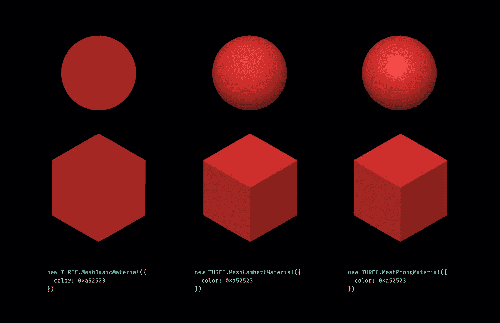

在本教程中，我们将使用`MeshLambertMaterial`。`MeshLambertMaterial`计算每个顶点的颜色。在画一个盒子的情况下，基本上就是每一边。

我们可以看到这是如何工作的，因为盒子的每一面都有不同的阴影。我们将平行光定义为主要从上方照射，因此盒子的顶部是最亮的。

其他一些材质不仅计算每条边的颜色，还计算该边内的每个像素的颜色。它们为更复杂的形状产生更真实的图像。但是对于用平行光照明的盒子来说，它们没有太大的区别。

### 如何制造汽车的其余部分

然后，以类似的方式，让我们创建汽车的其余部分。我们定义了返回一个组的`createCar`函数。这个组是另一个像场景一样的容器。它可以容纳三个. js 对象。这很方便，因为如果我们想绕着汽车移动，我们可以简单地绕着车队移动。

```
. . .

function createCar() {
  const car = new THREE.Group();

  const backWheel = createWheels();
  backWheel.position.y = 6;
  backWheel.position.x = -18;
  car.add(backWheel);

  const frontWheel = createWheels();
  frontWheel.position.y = 6;  
  frontWheel.position.x = 18;
  car.add(frontWheel);

  const main = new THREE.Mesh(
    new THREE.BoxBufferGeometry(60, 15, 30),
    new THREE.MeshLambertMaterial({ color: 0x78b14b })
  );
  main.position.y = 12;
  car.add(main);

  const cabin = new THREE.Mesh(
    new THREE.BoxBufferGeometry(33, 12, 24),
    new THREE.MeshLambertMaterial({ color: 0xffffff })
  );
  cabin.position.x = -6;
  cabin.position.y = 25.5;
  car.add(cabin);

  return car;
}

const car = createCar();
scene.add(car);

renderer.render(scene, camera);

. . .
```

我们用我们的函数生成两对轮子，然后定义汽车的主要部分。然后我们将添加小屋的顶部作为第四个网格。这些都只是不同尺寸不同颜色的盒子。

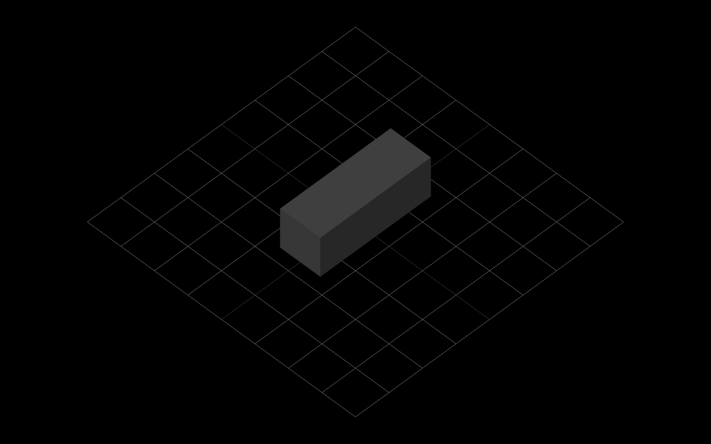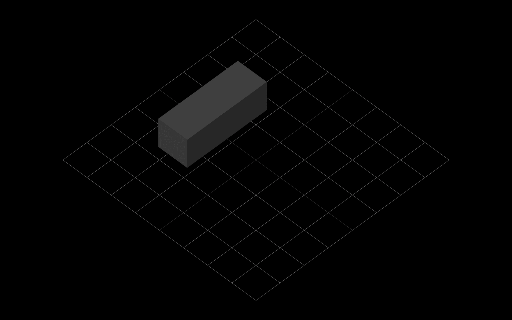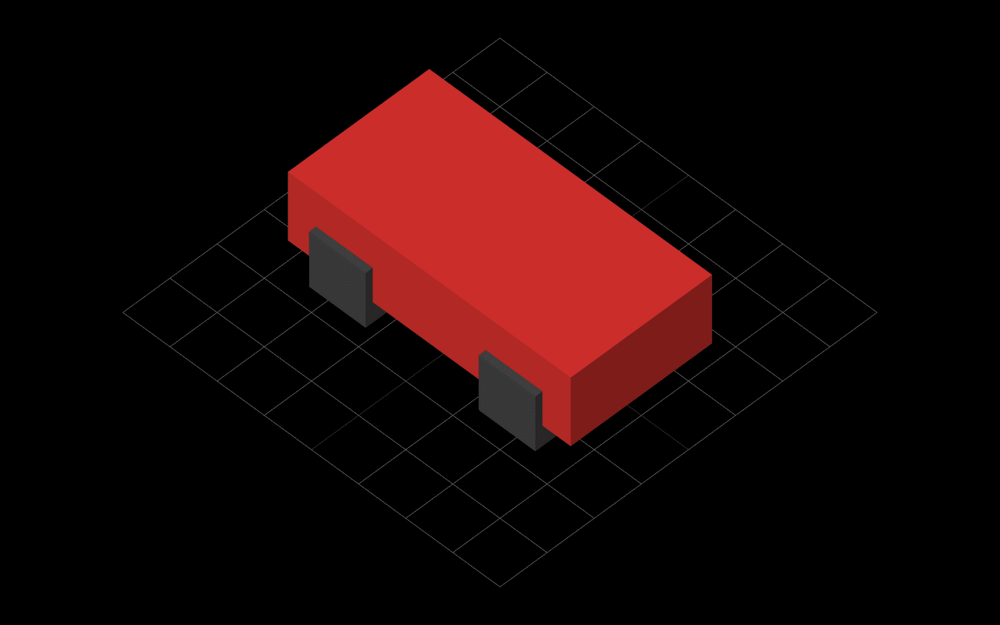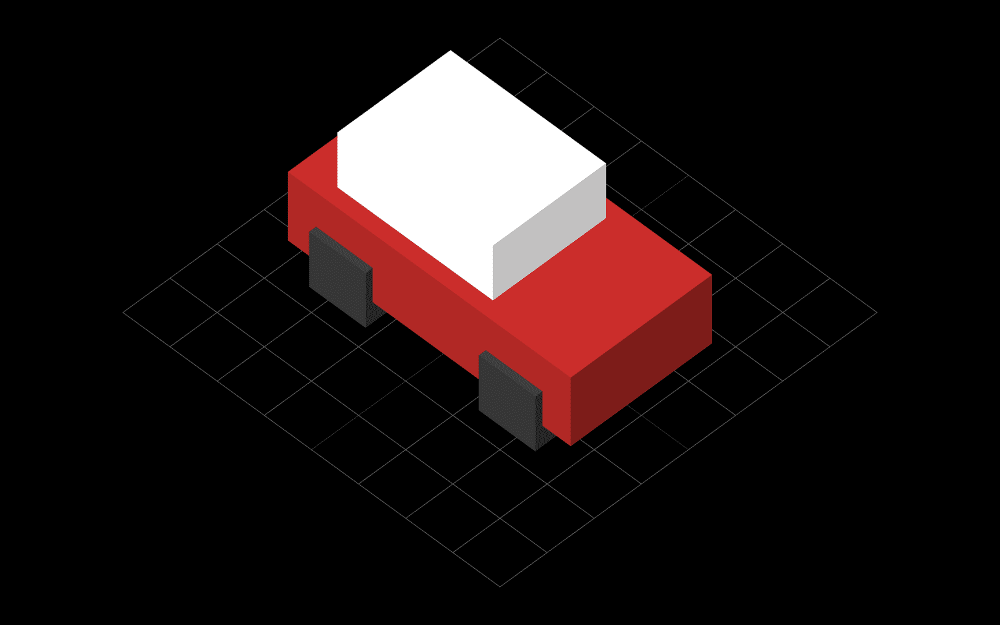

默认情况下，每个几何体都在中间，它们的中心在 0，0，0 坐标上。

首先，我们通过调整它们在 Y 轴上的位置来提升它们。我们将车轮抬高一半的高度——这样，它们就躺在了地上，而不是下沉到地面的一半。然后，我们也调整沿 X 轴的作品，以达到他们的最终位置。

我们将这些部件添加到汽车组，然后将整个组添加到场景中。在渲染图像之前，我们将汽车添加到场景中是很重要的，否则一旦我们修改了场景，我们将需要再次调用渲染。

### 如何给汽车增加质感

现在我们有了非常基本的汽车模型，让我们给车厢添加一些纹理。我们打算油漆窗户。我们将为侧面定义一个纹理，为小屋的前面和后面定义一个纹理。

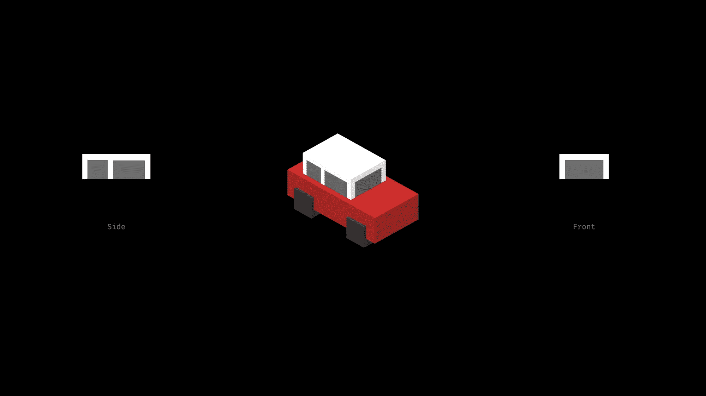

当我们用一个材质设置一个网格的外观时，设置一个颜色并不是唯一的选择。我们也可以映射纹理。我们可以为每一面提供相同的纹理，也可以为数组中的每一面提供一种材质。

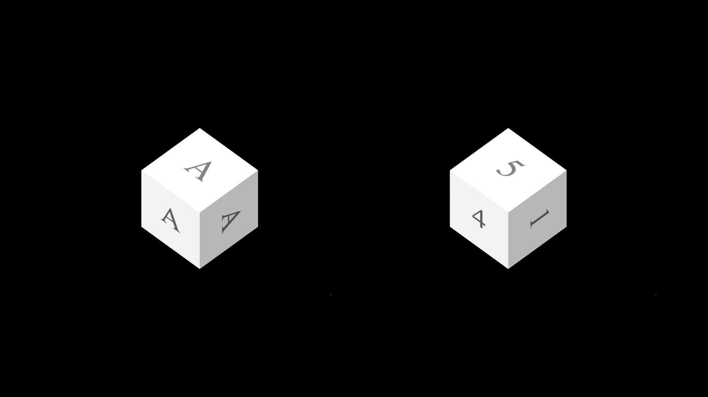

作为纹理，我们可以使用图像。但不是那样，我们将使用 JavaScript 创建纹理。我们将使用 HTML Canvas 和 JavaScript 对图像进行编码。

在我们继续之前，我们需要区分 Three.js 和 HTML Canvas。

Three.js 是一个 JavaScript 库。它使用 WebGL 将 3D 对象渲染到图像中，并在 canvas 元素中显示最终结果。

另一方面，HTML Canvas 是一个 HTML 元素，就像`div`元素或段落标签一样。但是，它的特别之处在于，我们可以用 JavaScript 在这个元素上绘制形状。

这就是 Three.js 如何在浏览器中渲染场景，这就是我们如何创建纹理。让我们看看它们是如何工作的。

### 如何在 HTML 画布上绘图

要在画布上绘图，首先我们需要创建一个画布元素。当我们创建一个 HTML 元素时，这个元素永远不会成为我们的 HTML 结构的一部分。就其本身而言，它不会显示在页面上。相反，我们将把它变成一个 Three.js 纹理。

让我们看看如何在这块画布上画画。首先，我们定义画布的宽度和高度。这里的大小并没有定义画布会出现多大，它更像是画布的分辨率。纹理将被拉伸到盒子的侧面，而不管它的大小。

```
function getCarFrontTexture() {
  const canvas = document.createElement("canvas");
  canvas.width = 64;
  canvas.height = 32;
  const context = canvas.getContext("2d");

  context.fillStyle = "#ffffff";
  context.fillRect(0, 0, 64, 32);

  context.fillStyle = "#666666";
  context.fillRect(8, 8, 48, 24);

  return new THREE.CanvasTexture(canvas);
}
```

然后我们得到了 2D 绘画的背景。我们可以使用这个上下文来执行绘图命令。

首先，我们要用一个白色矩形填充整个画布。为此，首先我们设置填充样式为 while。然后通过设置矩形的左上角位置和大小来填充矩形。在画布上绘图时，默认情况下，0，0 坐标将位于左上角。

然后我们用灰色填充另一个矩形。这个从 8，8 坐标开始，它不填充画布，它只画窗户。

就这样——最后一行将画布元素转换成纹理并返回，这样我们就可以将它用于我们的汽车。

```
function getCarSideTexture() {
  const canvas = document.createElement("canvas");
  canvas.width = 128;
  canvas.height = 32;
  const context = canvas.getContext("2d");

  context.fillStyle = "#ffffff";
  context.fillRect(0, 0, 128, 32);

  context.fillStyle = "#666666";
  context.fillRect(10, 8, 38, 24);
  context.fillRect(58, 8, 60, 24);

  return new THREE.CanvasTexture(canvas);
}
```

用类似的方法，我们可以定义侧面纹理。我们再次创建一个画布元素，获取它的上下文，然后首先填充整个画布以获得一个基色，然后将窗口绘制成矩形。

### 如何将纹理映射到长方体

现在让我们来看看如何在我们的车上使用这些纹理。当我们为船舱顶部定义网格时，我们不是只设置一种材质，而是为每一侧设置一种。我们定义了一个包含六种材料的数组。我们将纹理映射到小屋的侧面，而顶部和底部仍将保持纯色。

```
. . .

function createCar() {
  const car = new THREE.Group();

  const backWheel = createWheels();
  backWheel.position.y = 6;
  backWheel.position.x = -18;
  car.add(backWheel);

  const frontWheel = createWheels();
  frontWheel.position.y = 6;
  frontWheel.position.x = 18;
  car.add(frontWheel);

  const main = new THREE.Mesh(
    new THREE.BoxBufferGeometry(60, 15, 30),
    new THREE.MeshLambertMaterial({ color: 0xa52523 })
  );
  main.position.y = 12;
  car.add(main);

  const carFrontTexture = getCarFrontTexture();

  const carBackTexture = getCarFrontTexture();

  const carRightSideTexture = getCarSideTexture();

  const carLeftSideTexture = getCarSideTexture();
  carLeftSideTexture.center = new THREE.Vector2(0.5, 0.5);
  carLeftSideTexture.rotation = Math.PI;
  carLeftSideTexture.flipY = false;

  const cabin = new THREE.Mesh(new THREE.BoxBufferGeometry(33, 12, 24), [
    new THREE.MeshLambertMaterial({ map: carFrontTexture }),
    new THREE.MeshLambertMaterial({ map: carBackTexture }),
    new THREE.MeshLambertMaterial({ color: 0xffffff }), // top
    new THREE.MeshLambertMaterial({ color: 0xffffff }), // bottom
    new THREE.MeshLambertMaterial({ map: carRightSideTexture }),
    new THREE.MeshLambertMaterial({ map: carLeftSideTexture }),
  ]);
  cabin.position.x = -6;
  cabin.position.y = 25.5;
  car.add(cabin);

  return car;
}

. . .
```

这些纹理中的大部分无需任何调整就能正确映射。但是如果我们把车转过来，我们会发现左边的窗户顺序错了。

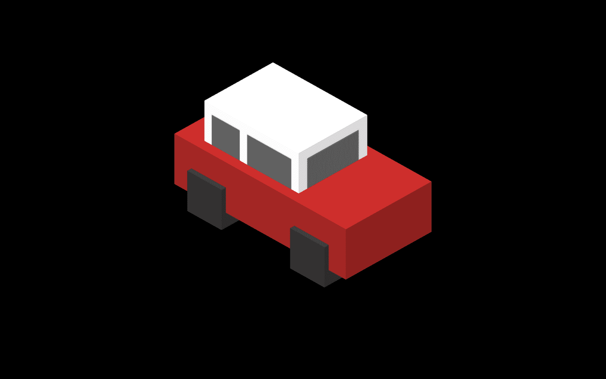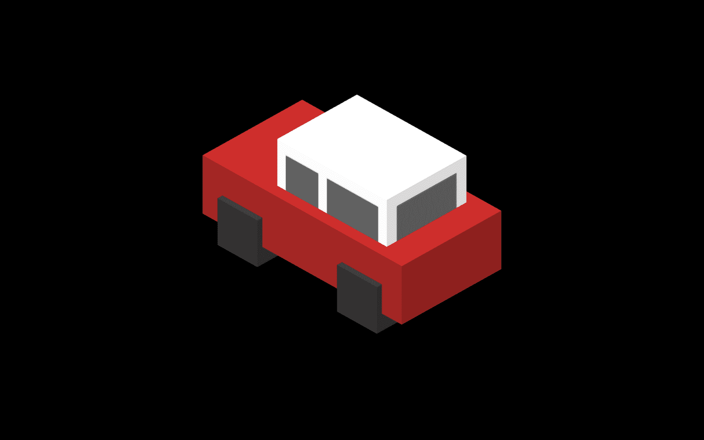

Right side and left side before and after fixing the texture

这是意料之中的，因为我们在右边也使用了纹理。我们可以为左侧定义单独的纹理，也可以镜像右侧。

不幸的是，我们不能水平翻转纹理。我们只能垂直翻转纹理。我们可以通过三个步骤解决这个问题。

首先，我们将纹理旋转 180 度，这等于π的弧度。然而，在旋转它之前，我们必须确保纹理是围绕它的中心旋转的。这不是默认设置，我们必须设置旋转中心在中间。我们在两个轴上都设置了 0.5，这基本上意味着 50%。最后，我们将纹理翻转过来，使其处于正确的位置。

## 总结

我们在这里做了什么？我们创建了一个包含我们的汽车和灯光的场景。我们用简单的盒子组装了这辆汽车。

你可能会认为这太简单了，但是如果你仔细想想，许多外观时尚的手机游戏实际上是用盒子制作的。或者想想《我的世界》，看看你能把盒子放在一起走多远。

然后我们用 HTML canvas 创建纹理。HTML canvas 的功能远不止我们在这里使用的。我们可以用曲线和弧线画出不同的形状，但是有时候一个简单的设计就是我们所需要的。


最后，我们定义了一个相机来确定我们如何看待这个场景，以及一个渲染器来将最终的图像渲染到浏览器中。

## 后续步骤

如果你想玩玩代码，你可以在 [CodePen](https://codepen.io/HunorMarton/pen/qBqzQOJ) 上找到源代码。如果你想推进这个项目，可以看看我在 YouTube 上的视频，看看如何把它变成一个游戏。

在本教程中，我们创建一个交通运行游戏。在定义了赛车之后，我们绘制了赛道，我们添加了游戏逻辑、事件处理程序和动画。

[https://www.youtube.com/embed/JhgBwJn1bQw?feature=oembed](https://www.youtube.com/embed/JhgBwJn1bQw?feature=oembed)