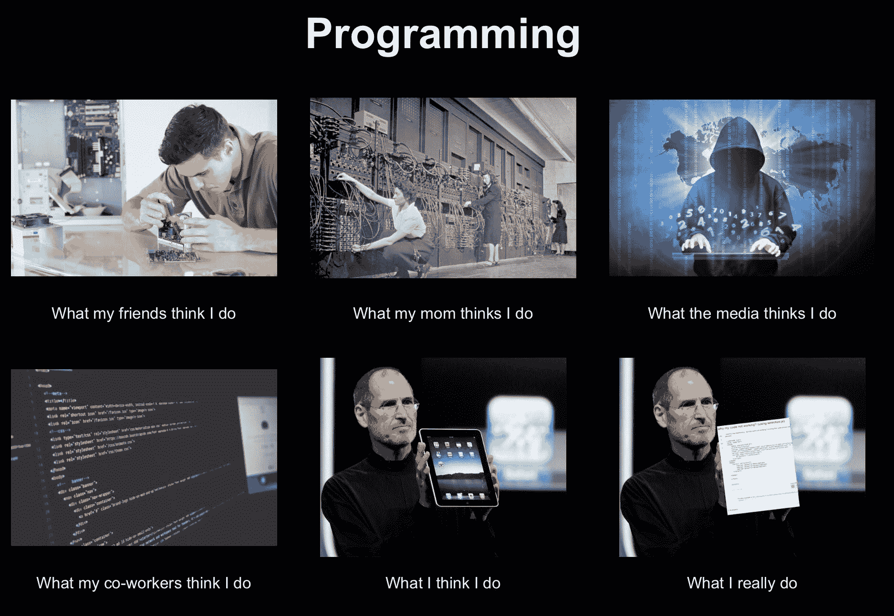
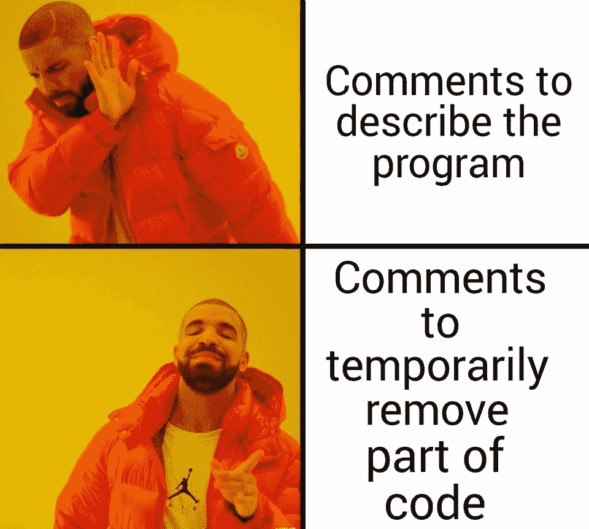

# 模因定义

> 原文：<https://www.freecodecamp.org/news/meme-definition/>

迷因是一种思想、笑话、行为或其他文化元素，像基因一样在人与人之间传递。

理查德·道金斯教授在《自私的基因》一书中首次创造了“模因”这个术语。道金斯将希腊语中的“模仿物”和“基因”结合在一起。

他认识到思想在整个文化中的传播就像基因的传播一样。它们都从一个人转移到另一个人，变异，当好的存活下来，其他的被遗忘和死亡。

但 meme 这个词也可以指短视频或音频剪辑、流行语录或其他容易模仿的病毒式内容。

以下是一些编程迷因的例子:

Source: [I made a programming meme](https://www.reddit.com/r/ProgrammerHumor/comments/censlq/i_made_a_programming_meme/)

Source: [I made a programming meme](https://www.reddit.com/r/ProgrammerHumor/comments/censlq/i_made_a_programming_meme/)

Source: [The Best Programming Memes](https://levelup.gitconnected.com/the-best-programming-memes-b435d1bf918d)