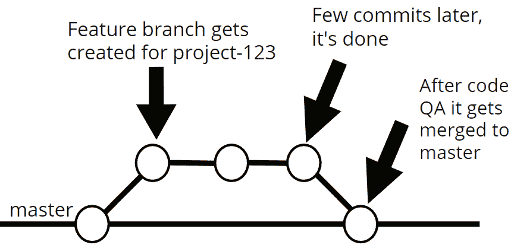
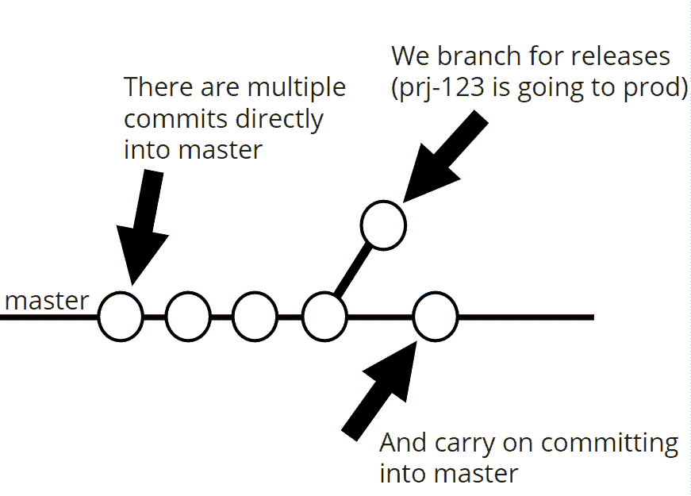

# 什么是基于主干的开发？软件开发生命周期的不同方法

> 原文：<https://www.freecodecamp.org/news/what-is-trunk-based-development/>

每个公司的软件开发生命周期 ( **SDLC** )都是不同的。

使用的版本控制系统，同行评审过程，代码评审过程，设计评审过程，他们如何做 CI，自动化测试，手动测试等等，根据你工作的地方有很大的不同。

一个公司如何计划、编写、构建、评审、部署和发布软件是针对他们特定的用例而优化的，所有这些都考虑到了他们自己的优点和缺点。

我开始阅读不同的大型科技公司如何运行他们的软件开发生命周期( **SDLC)** ，并几次听到术语**基于主干的开发**。这是谷歌遵循的做法，我很好奇它与大多数其他公司开发软件的方式有何不同。

## 两种不同的分支方式

### 特征分支

有两种常见的方法可以让多个开发人员在一个代码库上工作。

第一种我们称之为**特性分支**方法。

通常通过 Git，开发人员都派生出代码库(因此他们在机器上都有相同的副本)，他们基于`master`创建一个特性/项目分支，并在工作完成时合并。这里的重点是它们只合并一次，在所有工作完成的最后，将*整个分支*合并到主分支。

下面是开发者如何使用**特性分支方法**的概述。

**Feature Branching** development workflow visualised. 

白点代表提交，底部的黑色实线是`master`。开发人员从 master 中分支出来，进行他们的更改，然后当它完成/通过代码 QA 时，它被合并回 master。

#### 基于主干的开发(TBD)

**TBD** 是第二种方法。在这里，每个开发人员将他们要做的工作分成小批，并在一天内多次合并到`master`(通常被称为**主干**)。

他们不会创建一个分支，然后将分支合并到主干中。他们将*直接*提交到没有分支的**主干**中。

在 TBD，他们的代码更改一般不会持续几个小时。它们不断地与其他人编写的代码合并和集成。

Jez Humble 是谷歌的一名网站可靠性工程师，也是《持续交付》一书的作者，他说“分支不是问题，合并才是问题”，这正是 T2·TBD 试图解决的问题。

它的目的是避免痛苦的合并，当需要合并从**主干**中分支出来的长期分支时，或者甚至在与**主干**合并之前，将来自不同团队/开发人员的多个分支合并成一个分支。

## TBD 在规模上有效吗？

在 Google talk 中，谷歌工程经理 Rachel Potvin 描述了一个代码库(截至 2015 年 1 月):

*   10 亿个文件
*   20 亿行代码
*   86tb 的内容
*   每个工作日 45，000 次提交
*   每周 250，000 个文件中有 1，500 万行发生变化

他们在这个代码库中使用了 **TBD** ,它很好地服务于他们的用例。由于谷歌由许多有才华的(最重要的是，**经验丰富的**)工程师组成，他们很少打破他们的构建。

谷歌也有一个非常彻底、严格的代码质量保证过程(在这里阅读)，当使用**【TBD】**、时，它允许快速、高效的软件交付。

TBD 也适用于敏捷方法，在这种方法中，你必须频繁地发布软件以获得消费者的反馈。您可以不断地整合并获得当前状态的良好快照。

让我们简单讨论一下 TBD 的一些优势。

## TBD 的优势

*   随着您每天的合并，反馈(无论是来自代码 QA，还是同行评审)很快就会到来。这可以阻止你连续三周做错事，然后在最后得到反馈说你的工作不正确，导致你错过最后期限。
*   **TBD** 有一个精神上的好处，开发者感觉**主干**是**我们的**代码，而不是每个人都有自己的特性分支，并且认为这个分支是**我的**代码。这可以培养一种更加协作的文化，增加沟通。
*   这有助于提前整合所有其他飞行项目/机票，并帮助您重复使用。当你 9 个月大的**特性分支**需要合并回**主干**时，它也会停止合并。
*   包含大量工作的大型项目被迫分解成更小的可交付成果，这对于估计时间表和将代码分解成模块化的部分更好。
*   当许多开发人员孤立地在**特性分支**上工作时，很难发现初级开发人员在他们自己的分支中挣扎。但是如果他们每天都要完成工作，你可以监控他们的日常产出，并在必要时帮助他们。
*   **TBD** 确实干净利落地结合了持续集成。通过对最终完成的项目进行许多小的、增量的提交，您得到了一个总是经过测试的、总是集成的代码库，并且(最少的)合并很糟糕。

## TBD 的弱点

*   这种方法的挑战之一是，你有更大的机会打破**主干**，并阻止许多人工作。您必须确保您的提交运行单元测试以及良好的代码审查过程，这样您就不会浪费时间整天恢复提交。
*   您提交到 master 的历史记录可能会更详细，并且更难看出是否有问题。如果您在凌晨 3 点被叫去修复您的 prod 站点上的一个 bug，并且在工作时间提交了一些不可靠的提交，您更喜欢一天提交 1 次还是 200 次？
*   如果你没有一个快速的构建过程，当你的团队不断地提交时，你会花很长时间等待事情的构建。
*   通常，使用 **TBD** 时，你会逐渐增加新代码来做一些新的事情，但是你也需要你所替换的“旧”路径仍然工作。因此，你需要依赖特性开关(通常来自数据库)来打开和关闭东西。这可能会增加调试的复杂性。
*   最后一个挑战是，当您不断提交时，您就一直处于变动状态。你需要确保你的团队有规律地从**主干**中拉出，而不是在合并东西的时候相互绊倒。

## 如何用 TBD 发布软件

使用 **TBD** 的团队和使用**特性分支**的团队会有完全不同的发布过程。

一般来说，如果你使用**特性分支**，每当你有东西被合并进来(标签、完成的项目等等)时，你就释放`master`。).或者一些团队按计划发布`master`，比如每周一次。

以下是 TBD 团队如何发布产品的概述:

How **Trunk Based Development** teams release their code.

在**、分支一般只用于发布。**

**它们为您的代码库提供了一个稳定状态的“快照”，为部署和发布做好了准备。**

**上面的 **TBD** 图可能需要额外细节的唯一原因是当 prj-123 的发布出现问题时。然后，我们将结果提交到**主干**中，并挑选提交到我们的发布分支中，以尽快使其处于可工作状态。**

**一些地方，如果他们定期释放，甚至不需要分支，只要需要就可以释放主干。**

## **结论**

**有一整个网站是基于 **TBD** 的理论和实践。随意阅读更多[这里](https://trunkbaseddevelopment.com/)。**

**我希望这已经解释了什么是**基于主干的开发**以及为什么使用它。这当然有助于减轻合并包含主要重写的长期分支的一些问题。**

**如果你喜欢这篇文章并想看更多，我在 Twitter 上分享我的文章。**