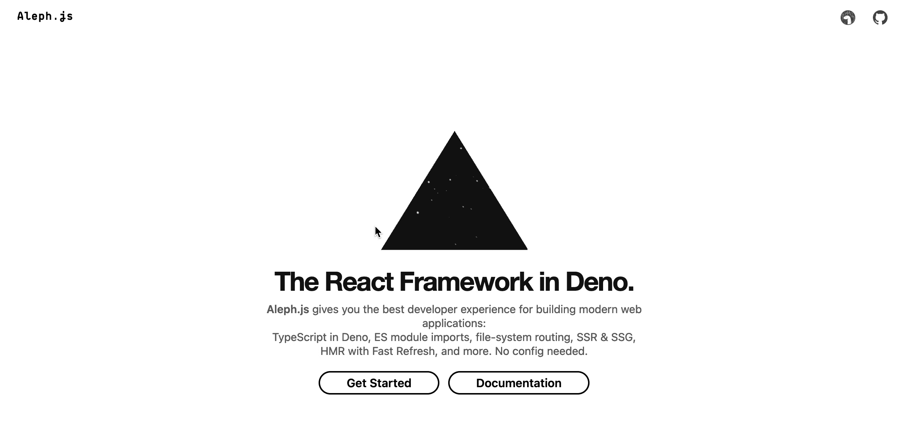
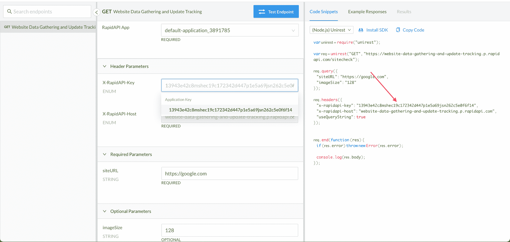

# 如何使用 AlephJS 库用 Deno 构建 React 应用程序

> 原文：<https://www.freecodecamp.org/news/build-react-app-using-deno-and-alephjs/>

如果你是一名前端开发人员，刚刚开始使用 Deno，你可能想知道——你能使用 Deno 构建像 NextJS 或 create-react-app (CRA)应用程序那样复杂的东西吗？

我最近也在想同样的事情。我想尝试 Deno 是因为它的可共享性，这是能够直接从 URL 运行应用程序的结果。Deno 编译器支持从 URL 运行 JavaScript 和 TypeScript 文件，它还支持从 URL 导入，这带来了极大的可移植性。

我看了看网上是否有任何现有的解决方案，但我只找到了这篇文章，它使用一些复杂的技术构建了一个 SSR'd React 应用程序。这并不简单，就像开始使用 NextJS 或 CRA 一样。

所以，通过我在网上的搜索，我找到了 AlephJS ，它拥有有史以来最酷的登陆页面动画。



Aleph 是一个零配置、类型脚本驱动的 React 框架，就像 NextJS 一样。唯一缺点是 Aleph 仍然处于 alpha 阶段。

因此，为了在 Deno 中获得真正的 Next-like React 体验，让我们从 AlephJS 开始吧。它有许多与 Next 相同的约定，例如:

*   用于创建 URL 路由的`/pages`目录
*   页面中的直接`.js, .jsx, .ts, .tsx`支持
*   一个为静态资产如视频、音频或图像文件提供服务的目录
*   一个`/pages/api`文件夹，用于将 JavaScript 或 TypeScript 文件作为无服务器 API。

如果你想看一段关于如何做到这一点的视频来补充你的阅读，请点击这里:

[https://www.youtube.com/embed/SDTedmFhnQc?feature=oembed](https://www.youtube.com/embed/SDTedmFhnQc?feature=oembed)

## 如何开始使用 AlephJS

为了能够使用 AlephJS，您需要在您的机器上安装 Deno。你可以在我之前的文章中看到如何安装和开始使用 Deno。

要开始使用 Aleph，您需要首先通过运行以下命令安装 Aleph CLI:

```
deno install -A -f -n aleph https://deno.land/x/aleph@v0.3.0-alpha.1/cli.ts 
```

安装后，您可以运行`aleph -h`来检查它是否安装正确。

由于 Deno 的可移植性，您可以用`deno run -A https://deno.land/x/aleph@v0.3.0-alpha.1/cli.ts start $app_URI`替换任何命令的`aleph`,它将能够运行 Aleph 程序，而无需在本地安装 CLI。

要创建一个初学者应用程序，请运行:

```
aleph init hello
cd hello 
```

使用`aleph dev`在端口`8080`启动服务器，在开发模式下启动应用程序。

要在生产模式下启动应用程序，您必须首先`build`应用程序，然后运行构建的应用程序。您可以通过以下命令完成此操作:

```
aleph build # build your app
aleph start # runs built app 
```

在你初始化你的 Aleph 应用程序后，你会发现根组件是在`pages/index.tsx`定义的。这是正常的反应成分。你可以用它做实验，看看 Aleph 是如何工作的。

您可以通过在`pages`文件夹中创建更多的`.jsx`或`.tsx`文件来为您的应用程序添加更多的路线。你可以在 Aleph [这里](https://alephjs.org/docs/basic-features/routing)阅读更多关于路由的信息。

## 如何在 Deno 中导入库

我以前在 [freeCodeCamp](https://www.freecodecamp.org/news/build-a-url-shortener-in-deno/) 上写过关于 Deno 的文章，在那里我演示了一些 Deno 基础知识，包括 URL 导入。由于 Aleph 是一个 Deno 框架，所有的导入都以“Deno 方式”进行。

您可以在 Deno 应用程序中导入两种类型的库。

1.  导入 Deno-Native 库:这些库要么是为 Deno 构建的，要么是从 npm 移植来支持 Deno 的使用。
2.  从 npm 进口:如果你最近和 JS 一起工作过，你可能知道 NPM。如果没有，NPM(node package manager 背后的公司)是所有 JavaScript 库的标准存储库。幸运的是，Deno 对 npm 库的支持有限。使用类似于 [esm.sh](http://esm.sh) 或 skypack.dev 的工具，用户可以将 npm 库导入 Deno。

### 1.如何导入非原生库

通过直接导入它们的 URL，可以在应用程序中导入非原生库。你可以在这里找到 Deno 库的列表:[deno.land/x](http://deno.land/x)

为了测试这一点，让我们导入这个[标准 Deno 日期格式库](https://deno.land/std@0.88.0/datetime)，并在 React 页面中调用一个日期格式函数。在应用程序的`pages`文件夹中创建一个文件`date-import.tsx`。在该文件中，编写以下代码:

```
// react is a compulsoy import in Aleph
import React from "react";

// import the format function from its URL
import { format } from "https://deno.land/std@0.88.0/datetime/mod.ts";

// capitalize the function name so it's recognized as a React component
export default function DateImport() {
	// Here, directly calling the format function works as expected.
  return <section>Hello all! Today is: {format(new Date(), "dd-MM-yyyy")}</section>;
} 
```

要查看这个文件的输出，请转到[localhost:8080/date-import](http://localhost:8080/date-import)，或者您的服务器的等效文件。您应该会看到显示今天日期的页面。

### 2.如何从 NPM 导入库

要导入 npm 库，您也可以直接从 URL 导入——但在这种情况下，有一点小小的变化。既然我们谈到了 [esm.sh](http://esm.sh) 和 skypack.dev，那么让我们试着在实际中使用它们。在这种情况下，让我们尝试在我们的项目中使用 [dayjs](https://www.npmjs.com/package/dayjs) 库。

> 注意:并非所有的 npm 库都能在 Deno 中正常工作，因为它们可能依赖于特定于节点的函数。

要在 [esm.sh](http://esm.sh) 中导入一个库，您可以将库的包名添加到 URL 中。在本例中，要导入 dayjs，我们将导入 [`https://esm.sh/dayjs`](https://esm.sh/dayjs) 。这也适用于您想要从库中导入的任何 CSS 文件。

现在，让我们在`pages`中创建一个名为`dayjs-import.tsx`的文件。因此，我们页面中的代码将如下所示:

```
// react is a compulsoy import in Aleph
import React from "react";

// import the dayjs npm library using esm.sh
import dayjs from "https://esm.sh/dayjs";

// capitalize the function name so it's recognized as a React component
export default function DateImport() {
	// call the dayjs function directly to display today's date
  return <section>Hello all! Today is: {dayjs().format("DD-MM-YYYY")}</section>;
} 
```

要查看这个文件的输出，请转到[localhost:8080/day js-import](http://localhost:8080/dayjs-import)，或者您的服务器的等效文件。您应该会看到显示当天日期的页面。

不过，在我们继续之前，还有一件重要的事情——如何处理**对导入**的反应，比如导入`useState`、`useEffect`等等？幸运的是，Aleph 的开发人员已经为我们编写了一个例子。

进入`./lib/useCounter.ts`，你会发现用于主页中计数器的定制钩子的代码。

因为我想在这篇文章中关注 Aleph 并对它们做出反应，为了检查在 Aleph 中导入 CSS 文件的所有不同方式，请访问官方文档中的[页面。](https://alephjs.org/docs/basic-features/built-in-css-support)

## 如何用 Deno 和 AlephJS 构建一个示例应用程序

现在，让我们进入本质，并尝试自己在 Aleph 中构建一个 React 应用程序。我们将建立“它倒了吗？”这是我用现有的网站检查 API 制作的一个示例应用程序。这个应用程序将允许我们检查一个网站目前是上线还是下线。

下面是代码沙盒链接:[https://codesandbox.io/s/awesome-firefly-5dofg](https://codesandbox.io/s/awesome-firefly-5dofg)

[https://codesandbox.io/embed/awesome-firefly-5dofg?fontsize=14&hidenavigation=1&theme=dark&view=preview](https://codesandbox.io/embed/awesome-firefly-5dofg?fontsize=14&hidenavigation=1&theme=dark&view=preview)

构建这个应用程序将向您展示如何使用状态挂钩、效果挂钩，以及如何在 Aleph 中进行 API 调用。

在您的`pages`文件夹中创建一个名为`web-checker.tsx`的新文件。让我们先从添加 UI 元素开始。我们将显示一个带有标题的`h1`元素、一个链接到 API 的`h2`元素和一个接受用户输入的表单元素。这是一个非交互式页面，只显示元素。

```
import React from "react";

export default function App() {
	return (
    <div style={{ fontFamily: "sans-serif", textAlign: "center" }}>
      <h1>Is it Down?</h1>
      <h2>
        Go{" "}
        <a
          href="https://rapidapi.com/jakash1997/api/website-data-gathering-and-update-tracking"
          target="_blank"
        >
          here
        </a>{" "}
        to get an API key
      </h2>

      <form
        onSubmit={(e) => {
          e.preventDefault();
        }}
      >
        <input
          type="text"
        />
        <button type="submit">Submit</button>
      </form>
    </div>
  );
} 
```

接下来，为了捕获输入字段的状态，也为了捕获我们必须进行的 API 调用的响应，让我们引入 state。

```
// import useState from react
import React, { useState } from "react";

export default function App() {
  // define both state variables
  const [siteURL, setUrl] = useState("");
  const [response, setResponse] = useState(undefined);
... 
```

现在，我们将在 input 元素中使用这个状态，这样它就可以对它做出反应。

```
...
<input
  value={siteURL}
  onChange={(e) => setUrl(e.target.value)}
  type="text"
/>
... 
```

我们还将添加一些代码来显示从 API 响应返回的响应:

```
...
	</form>

	<br />

	<code>{JSON.stringify(response, null, 2)}</code>
</div>
... 
```

现在，为了开始集成 API，让我们尝试正确地形成请求。在这种情况下，API 是一个简单的`GET`调用，所以我们只需要传递一个参数和一个 API 键。

首先转到这里，生成一个 API key:[https://rapidapi . com/jakash 1997/API/website-data-gathering-and-update-tracking](https://rapidapi.com/jakash1997/api/website-data-gathering-and-update-tracking)。找到如下截图所示的 API 密钥，并将其保存在安全的地方:



接下来，让我们创建一个单独的函数`submitData`，它将生成所需的请求数据。我们将使用`axios`库进行我们的`GET`调用，所以我们将形成它的 options 对象。

```
...
const [response, setResponse] = useState(undefined);

const submitData = (siteURL) => {
  setResponse("Loading...");
  const options = {
		// passing siteURL here through object shorthand
    params: { siteURL },

		// passing the required headers here
    headers: {
      "x-rapidapi-key": "YOUR_API_KEY",
      "x-rapidapi-host":
        "website-data-gathering-and-update-tracking.p.rapidapi.com",
    },
  };

	// print options here
	console.log("options", options);
};

return (
... 
```

我们将它添加到表单中的`onSubmit`函数中。

```
onSubmit={(e) => {
  e.preventDefault();
  submitData(siteURL);
}} 
```

现在，每当您按下提交按钮，您将会看到我们在控制台中生成的`options`。如果您在控制台中看到了`options`对象，那么到目前为止您做得很好！

接下来，我们只需使用 [`http://esm.sh`](http://esm.sh) 导入`axios`库，并使用它进行 API 调用。

导入`react`后导入`axios`这样导入:

```
import React, { useState } from "react";
import axios from "https://esm.sh/axios";

... 
```

并在`submitData`函数中将其用作:

```
...
	axios
    .get(
      "https://website-data-gathering-and-update-tracking.p.rapidapi.com/sitecheck",
      options
    )
    .then(function (response) {
      setResponse(response.data);
      console.log(response.data);
    })
    .catch(function (error) {
      console.error(error);
    });
};
... 
```

就是这样！尝试再次提交表单，这一次您将在屏幕和控制台上看到结果。

## 结论

现在你知道了 Aleph 的基本知识。这是一个非常有趣的工具，它允许您将现有的 React 知识与 [deno.land](http://deno.land) 的前瞻性和安全性相结合。

如果你喜欢这个教程，你可以在 Twitter 上关注我。