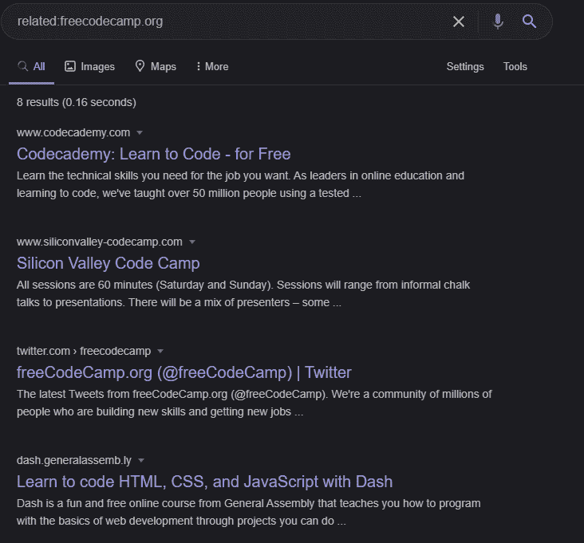
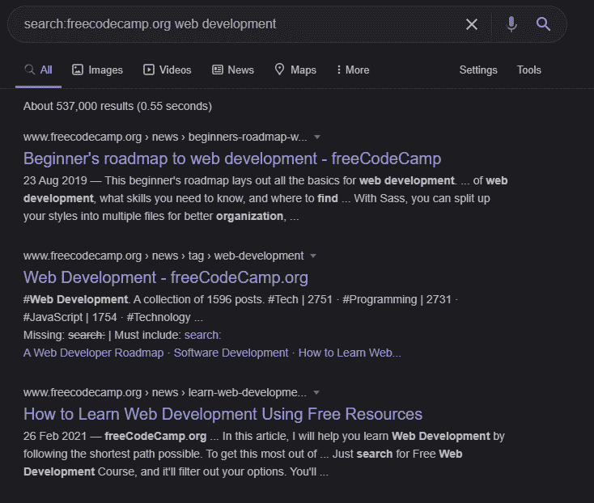
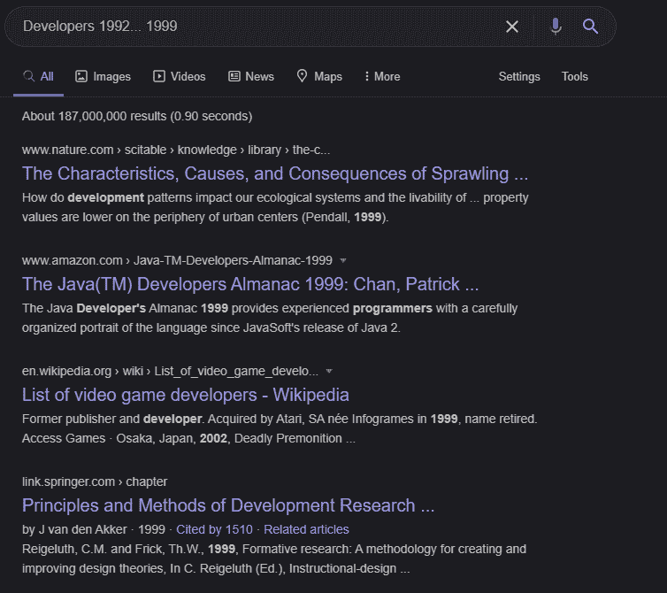
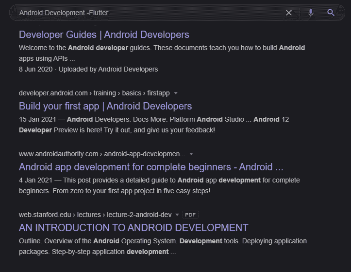
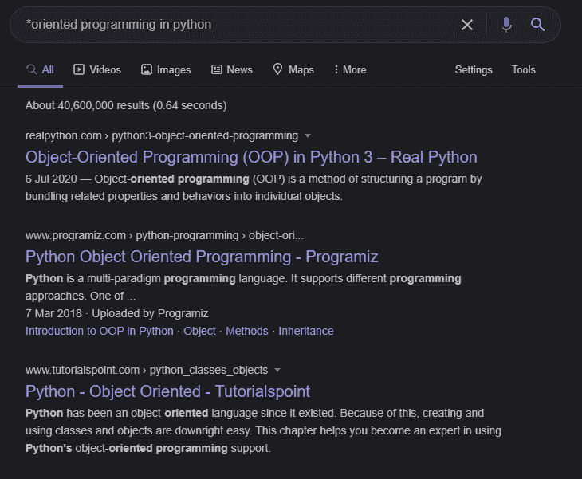
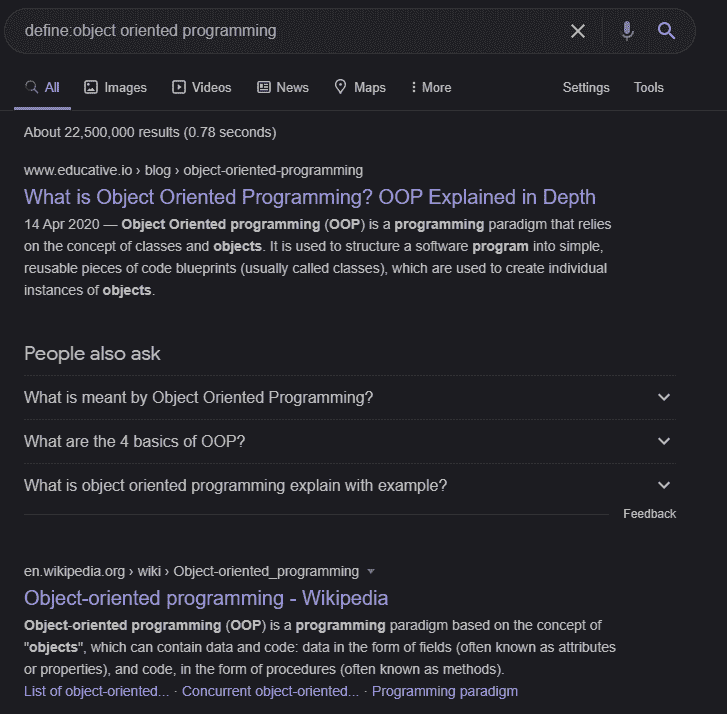
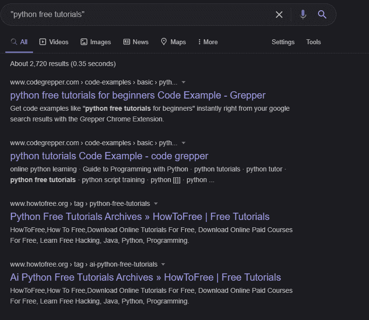
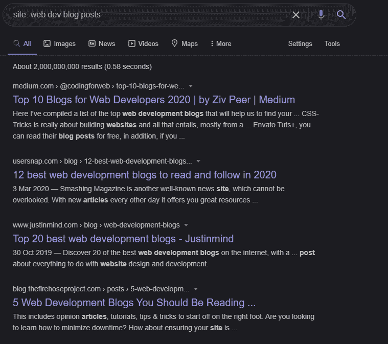

# 如何像专家一样搜索谷歌——获得更好搜索结果的技巧

> 原文：<https://www.freecodecamp.org/news/how-to-search-google-like-a-pro/>

如果你想找到问题的正确答案，你需要知道如何提出正确的问题。对大多数人来说，这是最难做到的事情——不拐弯抹角地问正确的问题。

要找到你的答案，你必须能够直接指向你想要的。你也需要一个好的搜索引擎来帮助你。

## 什么是搜索引擎？

根据牛津英语词典，

> 搜索引擎是一种程序，它在数据库中搜索并识别与用户指定的关键字或字符相对应的项目，特别用于在万维网上查找特定的网站

是的，你没看错——与我们搜索的关键词相对应的项目。现在有不同类型的搜索引擎，如:

*   谷歌
*   达克达克戈
*   美国 Yahoo 公司(提供互联网的信息检索服务)
*   还有更多...

我们这篇文章的主要焦点是 **GOOGLE** 以及如何学习如何像专业人士一样使用它。

那么，谷歌是什么？这是最常用和最受欢迎的互联网搜索引擎之一。它使用自己的秘密算法来获取和组织搜索结果，以便给你最相关和最可靠的数据来源。

让我们来看看一些改变你如何使用它的技巧。

## 如何像专业人士一样搜索谷歌

搜索谷歌是一种技能，信不信由你。这需要练习，但是如果你运用这些技巧，你很快就会找到最棘手问题的答案。

1.  使用关键字相关:查找类似网站。
    如果你要搜索与`freeCodeCamp`相关的任何内容，它看起来会像下面这样，显示所有与 freeCodeCamp 相关的网站。

2.  使用关键字搜索:在网站内搜索。
    假设你想在 freeCodeCamp 上找到一些与 web 开发相关的东西，这就是如何使用`search:`关键字来获得正确答案:

3.  使用关键字...在一定时间范围内进行搜索。
    例如，假设你想找一篇关于 1992 年到 1999 年间的开发人员或与开发人员有关的任何事情的文章，它应该是这样的:`Developer 1992...1999`

4.  使用关键字 - 排除一个单词。
    如果我想了解更多关于 Android 开发的知识，但不想在我的搜索结果中包含`flutter`相关技能，我会这样搜索:`android development -flutter`

5.  使用关键字 * 替换缺失的单词。
    试图搜索某样东西，但你碰巧忘记了一些单词？不要着急，试着用`*`来代替你已经忘记的缺失单词。像这样:

6.  如果你正在寻找一个词的定义，使用关键字 define: 来寻找一个定义。
    如果我想找到`object oriented programming`的定义，这将给出所有带有面向对象编程定义的文章的结果。我会这样做:

7.  你可以用双引号 来搜索一个精确的短语。如果我想找免费的 Python 教程，我会这样做:

8.  使用站点:搜索特定的网站或内容。
    例如，如果我想找到一个网站，上面有与网络开发相关的博客，我们会这样搜索:

### 这里有一些额外的提示给你:

*   想隐姓埋名，而不必使用鼠标来找到选项？试着按下 Ctrl + Shift + N 。
*   你是否在一个打开的标签页中，你想不用鼠标点击`x`就能轻松关闭它？试着按下 Ctrl + W 。

## 结论

现在你有了——8 个谷歌搜索技巧，让你成为一个谷歌搜索向导。

现在走出去，开始使用你新发现的神奇搜索能力征服世界吧！或者至少找到更好的搜索结果。不管怎样，我希望这篇文章对你有所帮助。如果你有，不要忘记分享它！

在[Twitter](https://twitter.com/larymak1)|[Insta](https://www.instagram.com/nextgencoders/)|[YouTube](https://www.youtube.com/channel/UCrT1ARRZfLOuf6nc_97eXEg)|[LinkedIn](https://www.linkedin.com/in/hillary-nyakundi-3a64b11ab/)|[GitHub](https://github.com/larymak)与我联系

请分享您的宝贵意见，感谢您的真诚反馈！

享受编码❤