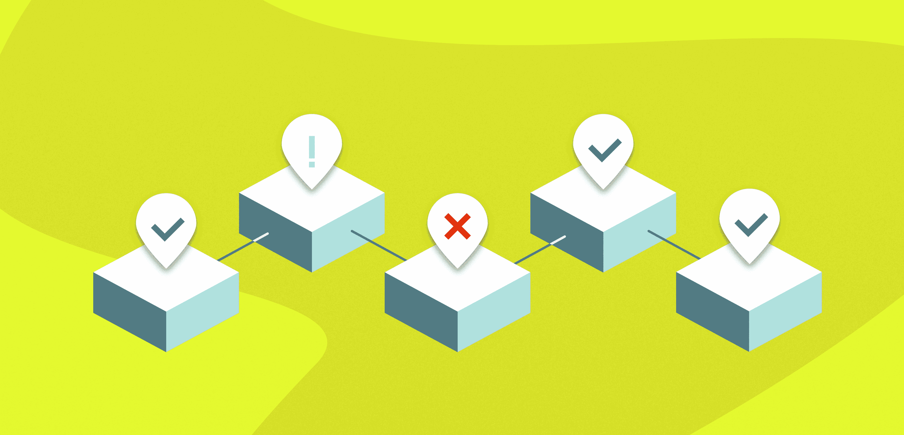
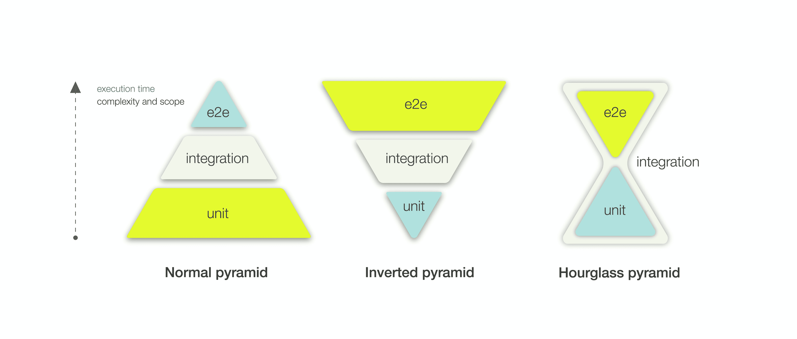
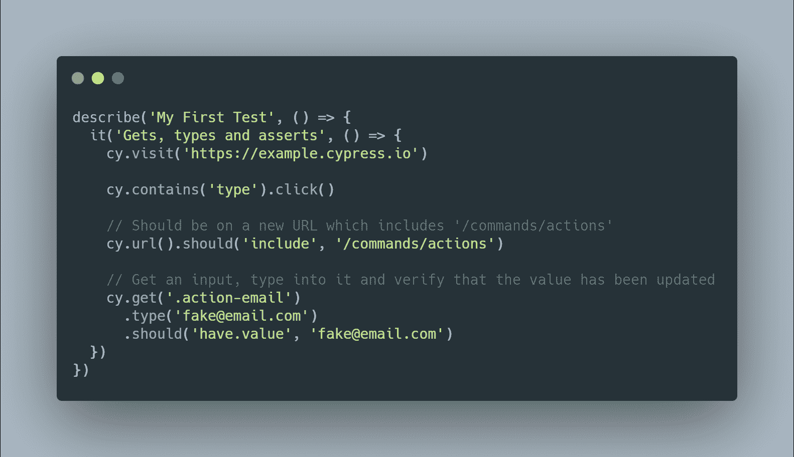
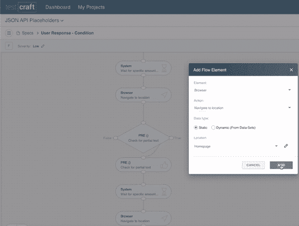

# 什么是端到端测试，什么时候应该使用它？

> 原文：<https://www.freecodecamp.org/news/end-to-end-testing-tutorial/>

任何严肃的应用程序都应该附带一些测试套件来验证其稳定性和性能。

有许多类型的测试，每一种都有自己的目的，涵盖应用程序的特定方面。所以当你测试你的应用程序时，你应该确保你在各种测试中有一个好的平衡。

但是有一种类型的测试通常比其他测试更受开发人员的青睐，因此有被过度使用的趋势。这种类型的测试是[端到端测试](https://www.freecodecamp.org/news/end-to-end-tests-with-selenium-and-docker-the-ultimate-guide/) (E2E)。

## 什么是端到端测试？

对于那些仍在探索软件测试世界的人来说，E2E 测试就是你从头到尾验证你的整个应用程序，以及它的任何依赖。

在 E2E 测试中，您创建了一个与真实用户使用的环境相同的环境。然后测试用户可能对应用程序执行的所有操作。

使用端到端测试，您可以测试整个流程——比如登录网站或从在线商店购买产品。

但是如果你过度使用 E2E 测试，你就颠倒了测试金字塔的方向。我也遇到过这样的情况。在我的一个项目中，我计划用 E2E 测试覆盖大多数情况——或者更糟，只使用 E2E 测试。幸运的是，我改变了主意。所以现在我想和你分享我学到的东西。

## 为什么你应该尊重测试金字塔

乱七八糟的笔试一开始看起来和感觉都很正常，但最后总会很痛苦。

我们编写测试来获得更多的时间，我们通过测试自动化来做到这一点。当然，我们可以自己打开应用程序，手动测试它们。如果我们只需要这样做一次，那就没有问题了。但这种情况很少发生。

软件总是在更新。因此，您需要执行持续的测试来保持对事物的掌控。您不能在每次应用程序更新时都手动运行所有的测试。如果您可以编写一次测试套件，然后在每次想要测试应用程序的某个方面时运行它，那么您将会节省很多时间。

每个测试都有自己的目的。如果你超越了每一种测试的界限，你的测试将会伤害而不是帮助你。这是因为你将花费更多的时间来编写和维护测试，而不是开发应用程序本身。换句话说，您将失去自动化测试的最大好处之一。

遵循测试金字塔是一个很好的起点。它帮助你找到测试的正确平衡。它代表了一种行业标准的指导方针，并且自 2000 年代中期以来一直存在，因为它一直很实用。

那么这是否意味着开发者总是遵循它的指导方针呢？不完全是。有几次金字塔会看起来像一个倒置的金字塔，在那里大多数的测试是 E2E。或者它看起来像一个沙漏，里面有很多单元测试和 E2E 测试，但是没有多少集成测试。

## 测试金字塔的三个层次

测试金字塔通常有三层:单元测试、集成测试和端到端测试。现在就让我们来了解一下他们吧。

### 1.单元测试

单元测试关注最小的代码单元，比如函数或类。

它们很短，没有任何外部依赖性。如果他们有一个外部依赖，你可以使用模仿来代替。

如果单元测试失败，找到问题通常是一个简单的过程。它们还具有缩小的测试范围，这使得它们编写简单，运行快速，并且易于维护。

### 2.集成测试

集成测试关注两个不同实体之间的交互。它们运行起来通常比较慢，因为需要设置更多的东西。

如果集成测试失败了，找到问题就有点困难了，因为失败的范围更大。

它们也更难编写和维护，主要是因为它们需要更高级的模拟和更大的测试范围。

### 3.端到端测试

最后，E2E 测试关注从最简单到最复杂的流程。它们可以被视为多步集成测试。

这些测试运行起来最慢，因为它们涉及到构建、部署、启动浏览器以及围绕应用程序执行操作。

如果 E2E 测试失败，找到问题通常是困难的，因为现在失败的范围扩展到了整个应用程序。基本上，沿着这条路，任何东西都可能坏掉。

它们是迄今为止最难编写和维护的测试类型(从这里考虑的三种类型中)，因为它们的测试范围很大，而且涉及到整个应用程序。

希望你现在能明白为什么测试金字塔是这样设计的。从下到上，每一层测试都代表着**速度**的降低和**范围、复杂度**和**维护的增加。**

这就是为什么要记住的一件重要事情是，E2E 测试不能取代其他方法——它意味着扩展它们。E2E 测试的目的是明确的，测试不应该超出这个界限。

理想情况下，测试应该在尽可能靠近金字塔根部的地方捕获 bug。E2E 在这里验证按钮、表单、更改、链接、外部流程以及整个工作流程的功能，没有任何问题。

## 代码测试与无代码测试

一般来说，有两种类型的测试:手工测试和自动化测试。这意味着我们要么手工测试，要么使用脚本。

第二种方法是最常用的。但是自动化测试可以进一步分为两部分:**用** **代码进行测试**和**无代码测试。**

### 代码测试

当你用代码测试时，你使用的框架可以自动化浏览器。最流行的工具之一是 [Selenium](https://www.selenium.dev/) ，但是我更喜欢并且经常在我的项目中使用 [Cypress](https://www.cypress.io/) (仅用于 JavaScript)。尽管如此，它们大多以相同的方式工作。

基本上，使用这样的工具，您可以模拟 web 浏览器，并指示它们在您的目标应用程序上执行不同的操作。之后，测试应用程序是否响应了相应的动作。

这是一个取自 Cypress 文档的简单模拟示例，可以帮助您更好地理解这个工具是如何工作的:

[Raw code from doc](https://docs.cypress.io/guides/getting-started/writing-your-first-test.html#Step-4-Make-an-assertion)

让我们来看看发生了什么:

1.  给定用户访问 https://example.cypress.io
2.  当他们单击标记为“类型”的链接时，URL 应该包含/命令/操作
3.  如果他们在。操作-电子邮件输入，然后。动作-电子邮件输入的值为“【fake@email.com】T2

### 无代码测试

在**无代码**测试的情况下，你使用由人工智能驱动的框架来记录你的行为。基于一些额外的信息，他们测试目标应用程序是否如预期的那样响应。

这些工具通常看起来像低代码平台，您可以在其中拖放不同的面板。其中一个工具是 [TestCraft](https://www.testcraft.io/) ，这是一个基于 Selenium 的**无代码**解决方案。

由于它们所提供的特性(比如用简单的拖放选项和没有编码知识来创建、维护和运行测试)，这种工具通常价格较高。但是我想提一下 TestCraft，因为他们有一个免费的计划，基本上包括了一切。

当然，如果你想要速度和金钱，无代码解决方案可能是一个优势，但是这些解决方案仍然是新的。因此，他们还不能达到测试套件的复杂性，你可以通过自己写代码来开发。

如果目标应用程序有一些非常复杂的流程，包括多个移动的部分，那么经典的测试场景是可行的。但是如果你有简单的流程，那么你就需要一个无代码的解决方案。

## 包扎

对于任何应用程序来说，编写测试都是必须的。如果您遵循坚实的原则，并根据它们的类型编写测试套件，那么您的测试只会改进您的应用程序，并且还会相当容易编写和维护。

你应该只使用端到端测试，就像任何其他测试一样，按照它们应该被使用的方式。创建它们是为了通过复制真实的用户场景从头到尾测试应用程序的工作流。但是最后，请记住，大多数 bug 应该尽可能地在靠近根的地方被捕获。