# 交互设计——如何评估交互成本并改善用户体验

> 原文：<https://www.freecodecamp.org/news/interaction-design-evaluate-interaction-costs-improve-ux/>

每个现代产品设计师都必须掌握三个核心技能:产品思维、视觉设计和交互设计。

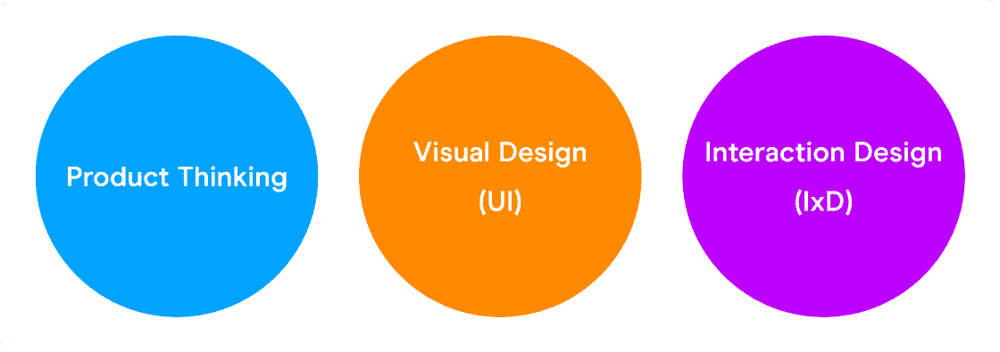

The “table-stakes” for all modern product designers.

一般来说，你应该擅长所有三个方面，但你应该真正擅长两个方面。大多数设计师可以通过在线资源、实践和运送真实产品来自学视觉设计和产品思维。

作为一家 FAANG 公司的产品设计主管，我已经指导了数百名有抱负的设计师，我发现交互设计往往是设计师自学的最具挑战性的核心技能。

在这篇文章中，我提供了一个学习和提高你的交互设计技能的基础和框架。

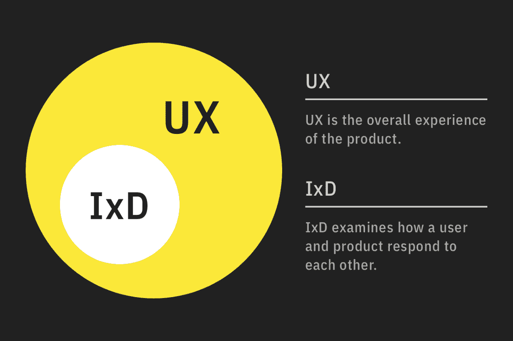

The difference between UX (user experience) and IxD (interaction design).

## 什么是交互成本？

交互设计背后的基本概念是“交互成本”，它通常用来衡量产品的可用性。尼尔森·诺曼将“互动成本”定义为用户为达到目标而必须付出的脑力和体力努力的总和。

总的来说，我们希望保持尽可能低的交互成本。然而，这是困难的，因为你的产品覆盖的用例越多，这就变得越困难。

支持更多的用例和功能增加了产品信息架构(IA)和导航的复杂性。一个用例是一系列的步骤，从用户的目标和目标实现的结果开始。

一个更复杂的 IA 必然会增加完成用户目标所需的点击次数。例如，一个 iOS 时钟应用程序有以下闹钟用例目标:打开闹钟、创建新闹钟和编辑闹钟。

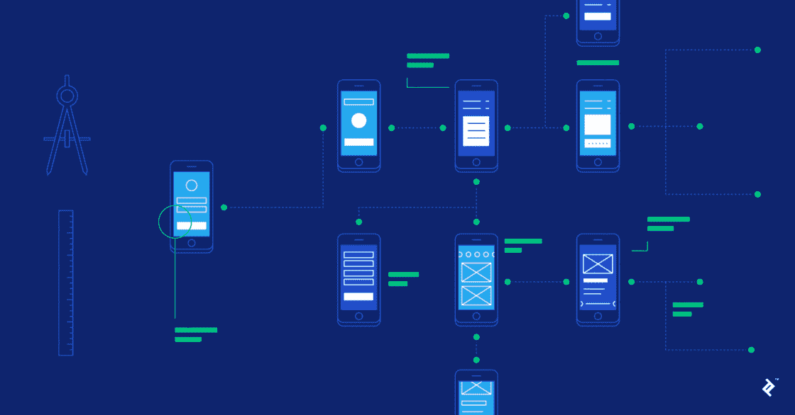

The more complex the IA, the more the user has to click to get to their desired screen. [Credits: Topta](https://dribbble.com/shots/4406909-The-Comprehensive-Guide-to-Information-Architecture)l

经验法则侧重于降低目标用户主要用例的交互成本。每当一个产品容纳了太多的用例时(例如，有一百万个下拉菜单和特性的企业产品)，它就会变得难以使用。

为了避免这种过度复杂化，在构建一个全新的产品时，选择一个特定的用户和用例来关注。

### 身心互动成本

许多初级设计师有一个误解，认为交互成本等于用户完成一项任务所需的点击次数。

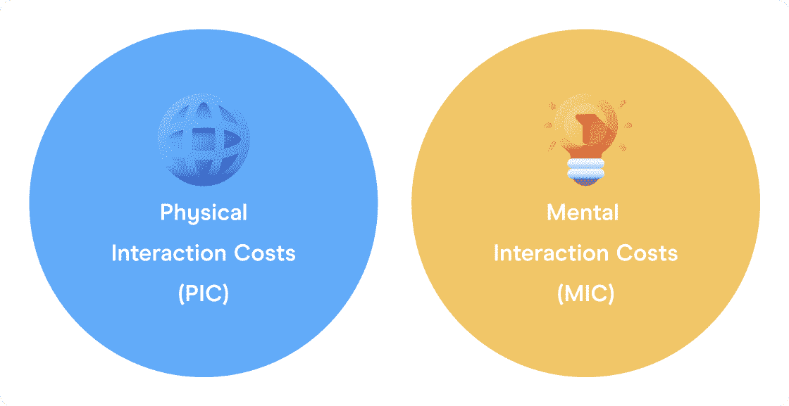

然而，它比这更深入。交互成本可以分为精神交互成本(MIC)和身体交互成本(PIC)，我将在下面解释。

## 如何评估交互成本——首先找到关键用户流

最佳实践是识别主要用例(即红色路线)，并在必要时以牺牲次要和第三用例为代价来降低它们的交互成本。

您可以使用[红色路线分析(RRA)](https://medium.muz.li/red-routes-critical-design-paths-that-make-or-break-your-app-a642ebe0940a) 来评估哪些用例交互流对您的主要用户最重要。

红色路线往往至关重要，包含具有多个步骤的端到端任务，经常被使用，为高容量使用而构建，提供最大价值，具有明确的成功标准，并与产品指标相关。

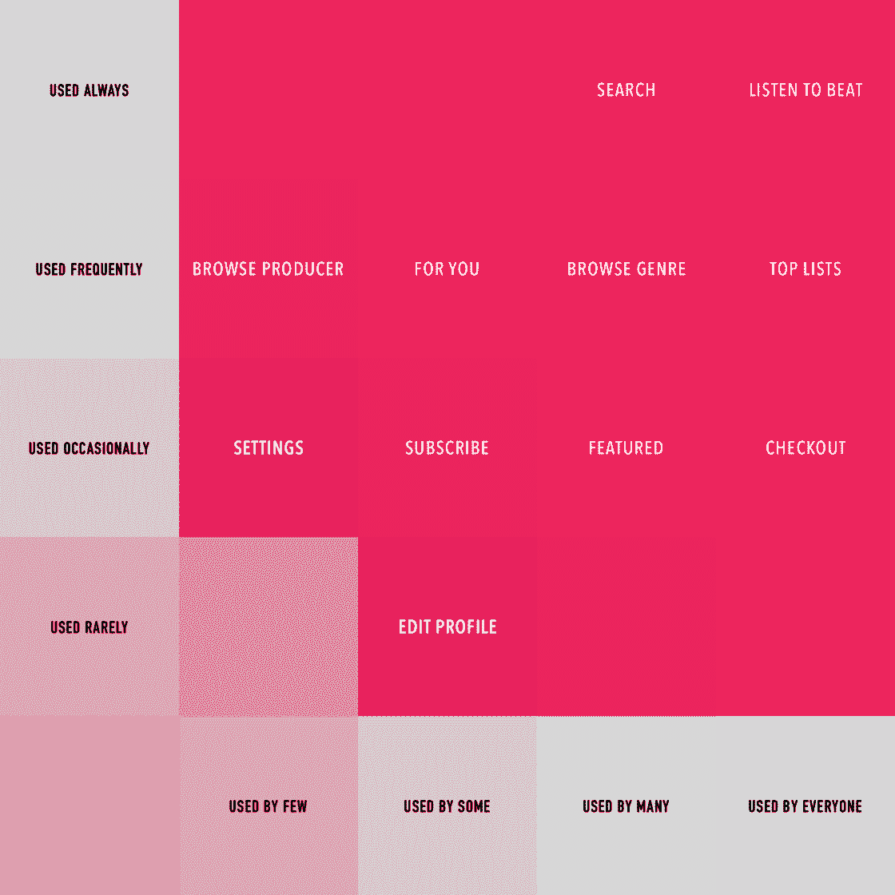

You can create an RRA from user interviews or with data if the product is live.

例如，在优步的应用程序中，骑手的红色路线将是请求搭车，而他们的正常路线将是添加支付方式。

## 特斯勒定律如何帮助降低交互成本

根据[特斯勒复杂性守恒定律](https://lawsofux.com/laws/teslers-law/),所有系统都有一个固有的复杂性，无法消除或隐藏。

好的设计确保尽可能多的复杂性负担在系统上，而不是在用户身上。

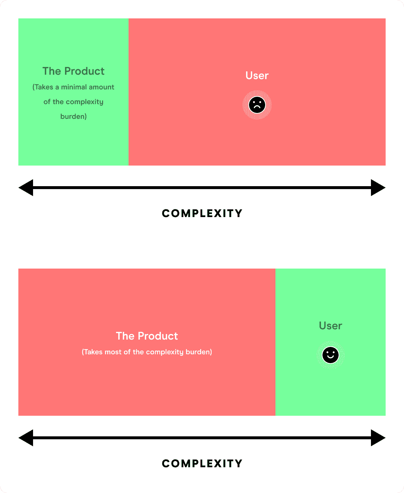

您应该从减少主要用例中的交互成本开始，并将复杂性负担转移到最不重要的用例上。

特斯勒认为，设计师和工程师应该多花一周时间降低应用程序的复杂性，而不是让数百万用户多花一分钟。

但是，注意不要把接口简化到抽象的程度。一个常见的陷阱是以牺牲麦克风为代价来降低 PIC(我在看你，苹果)。

当系统已经处理了尽可能多的固有复杂性时，您应该将剩余的复杂性从主要用例转移到第二和第三用例。

由于这个原因，大多数数码产品都有复杂的设置。在大多数情况下，设置通常是第三个用例，很少使用。

想象一下，如果你总是看到设置屏幕而不是主屏幕，需要点击几次才能转到你需要的屏幕。你可能会对不合理的交互成本感到沮丧。

## 心理互动成本

[心理交互成本(MICs)](https://www.researchgate.net/publication/23456170_A_Framework_of_Interaction_Costs_in_Information_Visualization) 往往被只关注身体交互成本(PIC)的新设计师忽略。

你可能已经注意到可用性差的产品中常见的麦克风包括复杂的导航、密集的指令、非常规的心智模型和交互模式等等。

### 注意力和记忆力

MIC 的两个最重要的组成部分是注意力和记忆力。

当一项任务需要过多的注意力或内存来完成时，它的 MIC 会相应地变高，从而降低可用性。

一些增加注意力成本或转移注意力的常见元素包括弹出式横幅、模型、引人注目的视觉效果以及与用户当前任务无关的动作。

用户很容易分心。当他们试图完成一项任务时，确保你没有把他们的注意力转移到其他地方。

### 评估注意力

如果你想评估你的界面有多少注意力，考虑做一个[眼球追踪研究(ETS)](https://uxplanet.org/uxers-quick-guide-to-eye-tracking-edf70bffd03d) 。你不仅可以用 ETS 来推断用户在看什么，还可以推断他们在想什么。

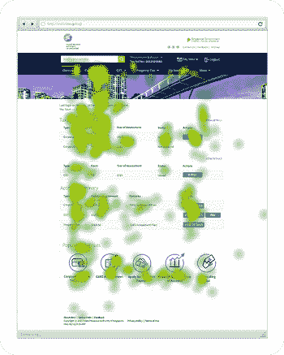

An example of an ETS.

ETS 特别检查了两种相关的眼球运动:“注视”和“迅速扫视”

当用户的瞳孔在一个界面元素上停留足够长的时间来处理它时，注视就发生了。当眼睛运动时，会发生迅速扫视——在你的界面内的不同区域之间快速移动。

如果你的 ETS 发现了许多与任务无关的扫视运动，很可能是由于分心的界面。您的 ETS 结果可以帮助您了解用户是否遗漏了界面中的关键元素，什么是令人分心的，什么是不必要的。

### 内存储器

所有不同类型的记忆都有广泛的分类。

对于我们作为设计师的目的来说，工作记忆(短期记忆的一部分)是最相关的。最短类型的记忆被称为工作记忆，在一项任务中通常只持续几秒钟。

换句话说，当我们参与其他认知过程时，我们的工作记忆负责我们头脑中的信息。

米勒定律指出，普通人一次只能在工作记忆中保留 5-11 个项目。在你的产品中完成一项任务所需的工作内存与你强加给用户的麦克风负担成正比。

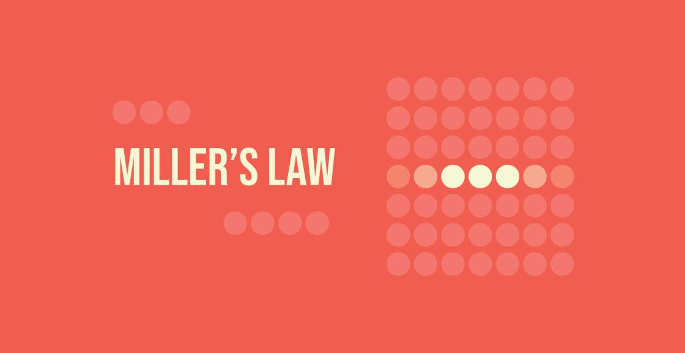

相反，在任何时候你的任务都不应该要求用户在他们的工作记忆中保存超过七个条目。

在极少数情况下，你需要用户在记忆中保存 11 个以上的条目，使用“分块”来减轻他们的精神负担。组块是将信息集的各个部分分解，然后组合成一个有意义的整体。

例如，我们记得电话号码是 XXX-XXXX，而不是 XXXXXXX。将数字分成两部分来记忆比由七个独立单元组成的序列更容易。

另一个需要考虑的与注意力和记忆力相关的因素是“希克斯定律”该定律指出，“做决定所需的时间随着选择的数量和复杂程度而增加。

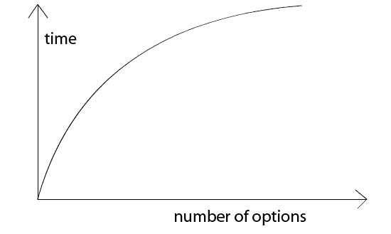

The more choices there are, the longer it takes the user to make a decision.

避免过多的选择让用户不知所措，尽可能突出对他们来说最好的选择。将复杂的任务分解成小步骤，也就是在适当的时候使用渐进式披露。

## 物理交互成本(PIC)

我不会在图片上说太多细节，因为大多数设计师都很了解它们。

常见的 PIC 因素包括到达距离和目标宽度([菲特定律](https://lawsofux.com/laws/fittss-law/))、完成任务所需的用户输入和动作的数量等等。

[菲特定律](https://lawsofux.com/laws/fittss-law/)指出，击中目标(即点击按钮)的时间是与输入设备的距离和目标击中框宽度的函数。

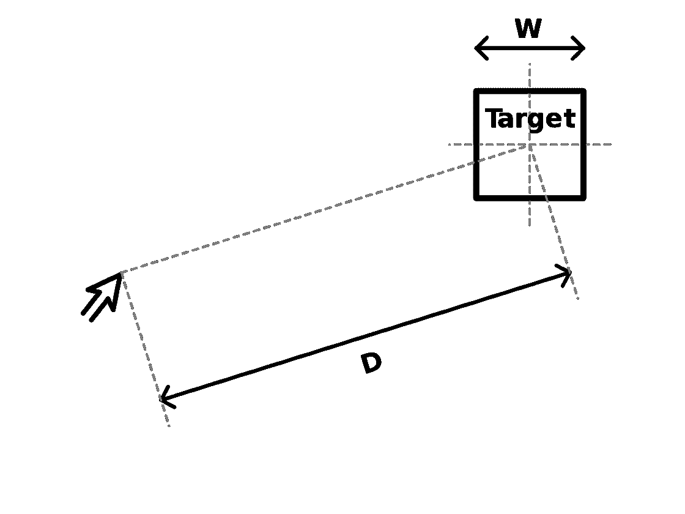

A diagram for Fitt's Law.

例如，如果你的鼠标光标在很远的地方，而按钮又很小，那么点击桌面上的一个按钮就要花很长时间。

评估 PIC 的一个很好的方法是[“任务分析”](https://www.nngroup.com/articles/task-analysis/)和检查[可用性度量](https://usabilitygeek.com/usability-metrics-a-guide-to-quantify-system-usability/)，比如“任务时间(TT)”

TA 的根本是看完成用户目标所需的任务数量，那些任务的频率，身体要求，任务时间。

TA 和可用性度量是高级主题，需要完全独立的注释，所以我将把它留到下一次。

## 要避免的常见陷阱

根据 Nielsen Norman Group 的调查，导致交互成本增加的一些最常见的产品方面包括:

*   过度阅读和滚动
*   四处寻找相关信息的用户
*   理解呈现给用户的信息
*   物理用户输入
*   页面加载和等待时间
*   注意开关
*   内存负载

### 情境互动成本

根据用户的不同，上述缺陷可能或多或少很严重。例如，阅读障碍用户发现阅读比普通用户更具挑战性(提示:使用阅读障碍友好的字体，如[“阅读障碍”](https://www.dyslexiefont.com/en/typeface/))。

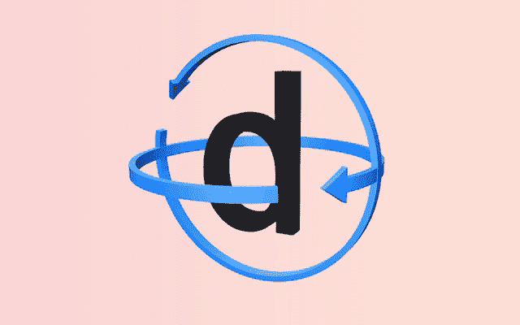

[Source](https://www.dyslexiefont.com/)

有运动障碍的用户可能会发现点击比阅读更难。甚至用户的设备也能发挥重要作用。例如，如果蜂窝网络覆盖较慢，移动设备上的页面加载可能会花费很长时间。

### 互动途径和动机

在某些情况下，用户可以通过多种途径来实现他们的目标。用户根据“预期效用”的概念决定走哪条路，预期效用定义为预期效用=预期收益-预期交互成本。

换句话说，用户权衡每个操作的收益和成本，并选择收益和成本之间达到最佳平衡的路径。

用户将被吸引到具有最低估计交互成本的路径。即使有成本更低的路径，如果路径不直观或不熟悉，由于 MIC 较低，他们最终会选择他们更熟悉的路径。

动机高的用户(例如，由于你的营销或品牌努力)更有可能付出高交互成本来完成他们的目标。例如，如果苹果网站的交互成本很高，用户可能仍然有足够的动力来完成他们的任务。

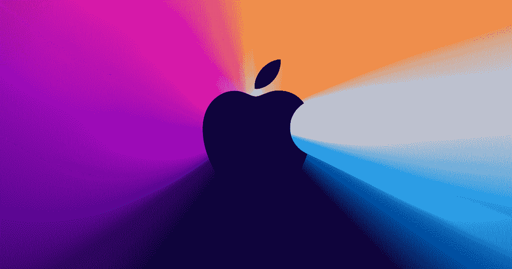

Apple is the world’s most valuable brand for a reason.

然而，如果用户想购买一个通用产品，并且结账过程有很高的交互成本，他们会从竞争对手那里购买。

更多细节，请看尼尔森诺曼集团的[例子，如何评估用例](https://www.nngroup.com/articles/interaction-cost-definition/)的交互成本，“找出‘仪式’一词的来源。”

## 结论

理解交互成本对于任何现代产品设计师来说都是一项至关重要的技能。我鼓励你超越肤浅的交互设计考虑，深入研究众多的 PIC 和 MIC 因素。

当然，我们要努力尽可能降低交互成本。但是到了紧要关头，我们应该做出权衡，以确保主要用例的摩擦最小。

一个很好的第一步是创建一个法律、框架和测试的心智模型来评估你的设计的交互成本。

如果你喜欢这篇文章， [****加入我的免费简讯****](https://theambitiousdesigner.substack.com/) 【雄心勃勃的设计师】获取更多职业&设计见解。

我还在脸书运营一个私人导师小组和一个设计账户。