# JavaScript 不和谐机器人教程——编写一个不和谐机器人并免费托管它

> 原文：<https://www.freecodecamp.org/news/create-a-discord-bot-with-javascript-nodejs/>

本教程将向您展示如何使用 JavaScript 和 Node.js 完全在云中构建自己的 Discord bot。

你不需要在你的电脑上安装任何东西，你也不需要支付任何费用来托管你的机器人。

我们将使用许多工具，包括 Discord API、Node.js 库和一个名为 [Repl.it](https://www.repl.it) 的云计算平台。

如果你更愿意使用 Python 而不是 JavaScript 来编写你的 discord bot，[阅读本教程而不是](https://www.freecodecamp.org/news/create-a-discord-bot-with-python/)。

还有这个书面教程的视频版本。视频嵌在下面，文字版在视频后面。

[https://www.youtube.com/embed/7rU_KyudGBY?feature=oembed](https://www.youtube.com/embed/7rU_KyudGBY?feature=oembed)

## 如何创建一个不和谐机器人帐户

为了使用 Node.js 库和 Discord API，我们必须首先创建一个 Discord Bot 帐户。

以下是创建不和谐机器人账户的步骤。

1.确保您已登录到 [Discord 网站](https://discord.com)。

2.导航到[应用程序页面](https://discord.com/developers/applications)。

3.单击“新建应用程序”按钮。

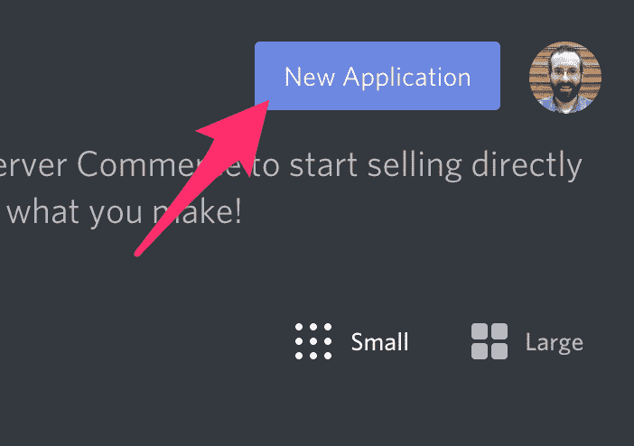

4.为应用程序命名，然后单击“创建”。

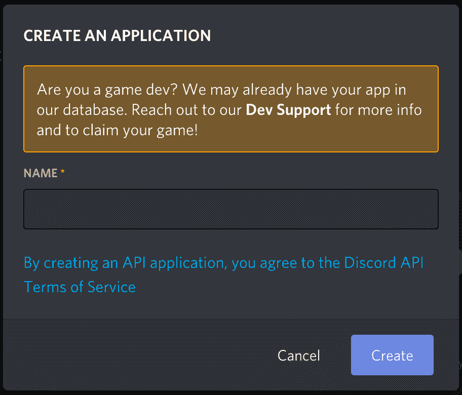

5.转到“机器人”选项卡，然后单击“添加机器人”。你必须通过点击“是，做它！”来确认

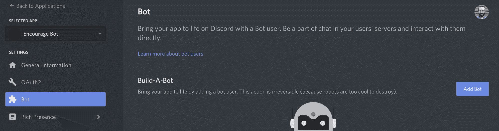

保持**公共机器人**(选中)和**需要 OAuth2 代码授权**(未选中)的默认设置。

您的机器人已经创建。下一步是复制令牌。

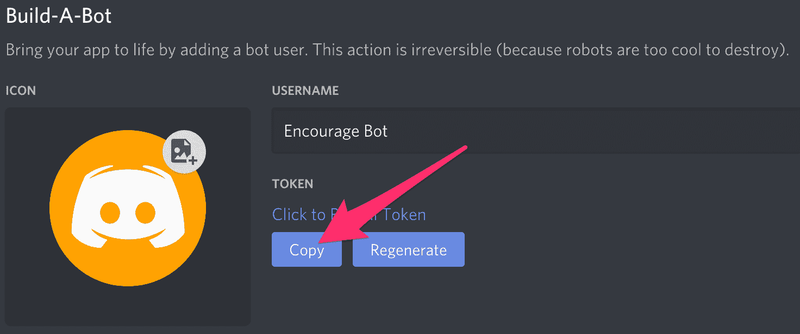

这个令牌是你的机器人的密码，所以不要与任何人分享。它可以让某人登录你的机器人，做各种坏事。

如果令牌意外被共享，您可以重新生成令牌。

## 如何邀请你的机器人加入服务器

现在你必须让你的机器人用户进入服务器。为此，您应该为它创建一个邀请 URL。

转到“OAuth2”选项卡。然后在“scopes”部分选择“bot”。

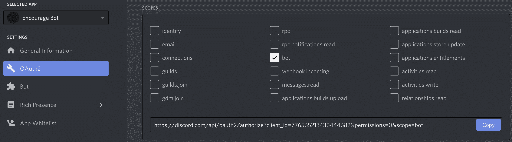

现在选择你想要的权限。我们的机器人将主要使用短信，所以我们不需要太多的权限。你可能需要更多，这取决于你想让你的机器人做什么。小心“管理员”权限。

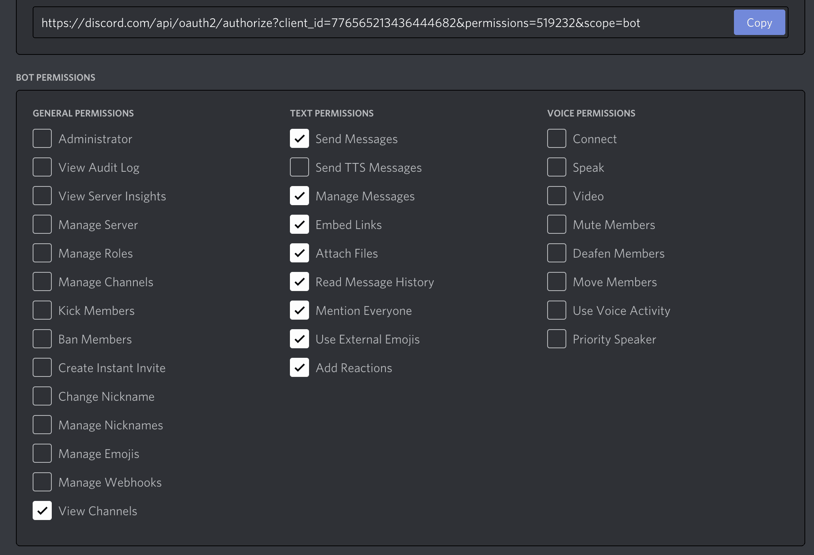

选择适当的权限后，单击权限上方的“复制”按钮。这将复制一个可用于将机器人添加到服务器的 URL。

将 URL 粘贴到您的浏览器中，选择要邀请机器人的服务器，然后单击“授权”。

要添加 bot，您的帐户需要“管理服务器”权限。

现在您已经创建了机器人用户，我们将开始为机器人编写 Python 代码。

## 如何用 discord.js 库编写一个基本的 Discord Bot

我们将使用 discord.js 节点库来编写机器人代码。discord.js 是 discord 的 API 包装器，使得在 Node.js / JavaScript 中创建 Discord bot 更加容易。

### 如何创建 Repl 并安装 discord.js

您可以在本地计算机上使用任何代码编辑器开发 bot。然而，在本教程中，我们将使用 Repl.it，因为它将使任何人都更容易理解。它是一个在线 IDE，你可以在你的网络浏览器中使用。

首先转到 [Repl.it](https://repl.it) 。创建一个新的 Repl 并选择“Node.js”作为语言。这意味着编程语言将是 JavaScript。

要使用 discord.js 库，只需在`main.js`的顶部添加`const Discord = require("discord.js");`。当您按下“运行”按钮时，它将自动安装这个依赖项。

### 如何为你的机器人设置不和谐事件

discord.js 围绕着事件的概念。一个事件是你听了然后做出反应的事情。例如，当一个消息发生时，您将收到一个关于它的事件，您可以对其进行响应。

让我们制作一个回复特定消息的机器人。这个简单的机器人代码直接取自 discord.js 文档。我们将在以后增加更多的功能。

将这段代码添加到 main.js 中。我将很快解释所有这些代码的作用。

```
const Discord = require("discord.js")
const client = new Discord.Client()

client.on("ready", () => {
  console.log(`Logged in as ${client.user.tag}!`)
})

client.on("message", msg => {
  if (msg.content === "ping") {
    msg.reply("pong");
  }
})

client.login(process.env.TOKEN)
```

当你在 Discord 上创建你的机器人用户时，你复制了一个令牌。现在我们将创建一个`.env`文件来存储令牌。

`.env`文件用于声明环境变量。在 Repl.it 上，你创建的大多数文件对任何人都是可见的，但是`.env`文件只对你可见。其他查看公共回复的人将看不到`.env`文件的内容。

因此，如果您在 Repl.it 上开发，只需在`.env`文件中包含私有信息，如令牌或密钥。

点击“添加文件”按钮，创建一个名为`.env`的文件。

在文件中添加以下行，包括您之前复制的实际令牌:

```
TOKEN=[paste token here]
```

现在让我们来看看每一行代码在你的不和谐机器人代码中做了什么。

第一行导入 discord.js 库。接下来，我们创建一个 [`Client`](https://discordpy.readthedocs.io/en/latest/api.html#discord.Client) 的实例。这是与不和谐的联系。

`client.on()`用于检查事件。它接受一个事件名，然后在事件发生时调用一个回调函数。在这段代码中，当 bot 准备好开始使用时，将调用`ready`事件。然后，当 Discord 服务器有新消息时，就会调用`message`事件。

代码检查 [`msg.content`](https://discordpy.readthedocs.io/en/latest/api.html#discord.Message.content) 是否等于`'ping'`。如果是，那么机器人用`'pong'`回复频道。

现在 bot 已经设置好了，最后一行代码使用登录令牌运行 bot。它从 out `.env`文件中获取令牌。

我们有机器人的代码，所以现在我们只需要运行它。

### 如何运行这个机器人

现在单击顶部的 run 按钮，在 repl.it 中运行您的 bot。

现在去你的不和谐房间输入“ping”。你的机器人应该返回“乓”。

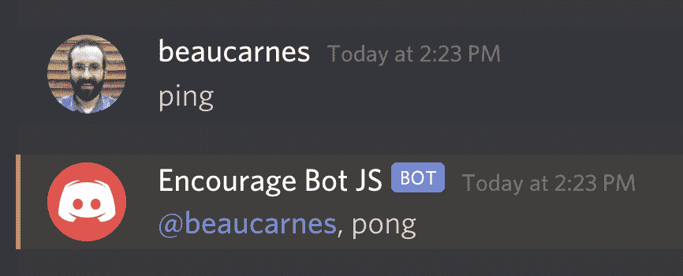

## 如何改进 Bot

现在我们有了一个基本的机器人，我们将改进它。之所以叫“鼓励 Bot”是有原因的。

每当有人发送包含悲伤或沮丧词语的消息时，这个机器人就会回复一条鼓励的消息。

任何人都可以添加鼓励消息供机器人使用，用户提交的消息将存储在 Repl.it 数据库中。

当有人在聊天中键入消息“$inspire”时，该机器人还会从 API 中返回随机的灵感引用。

我们将从添加“$inspire”功能开始。

### 如何给机器人添加励志名言

我们将从一个名为 zenquotes.io 的 API 中获得启发性的报价，我们需要导入 node-fetch 模块，添加一个`getQuote()`函数，并更新我们的 bot 代码来调用该函数。

下面是更新后的代码。在代码之后，我将解释新的部分。

```
const Discord = require("discord.js")
const fetch = require("node-fetch")
const client = new Discord.Client()

function getQuote() {
  return fetch("https://zenquotes.io/api/random")
    .then(res => {
      return res.json()
      })
    .then(data => {
      return data[0]["q"] + " -" + data[0]["a"]
    })
}

client.on("ready", () => {
  console.log(`Logged in as ${client.user.tag}!`)
})

client.on("message", msg => {
  if (msg.author.bot) return

  if (msg.content === "$inspire") {
    getQuote().then(quote => msg.channel.send(quote))
  }
})

client.login(process.env.TOKEN)
```

我们现在必须导入`node-fetch`模块。这个模块允许我们的代码发出 HTTP 请求，从 API 获取数据。

`getQuote()`函数非常简单。首先，它使用节点获取模块从 API URL 请求数据。API 会返回一个随机的启发性引用。如果当前的 API 停止工作，可以很容易地重写这个函数，从不同的 API 获取报价。

然后，该函数将响应从 API 转换为 JSON，并创建一个要返回的字符串。通过反复试验，我知道了如何将 JSON 中的引用转换成我想要的字符串格式。引号作为字符串从函数中返回。

代码中更新的最后一部分接近末尾。先前它寻找“ping”消息。现在它在寻找“$inspire”。它不是返回“pong ”,而是用`getQuote()`获取报价并返回报价。我们使用`msg.channel.send()`将消息发送到通道。此外，代码检查消息是否来自机器人本身，如果是，它离开函数，因此它不做任何事情。

此时，您可以运行代码并进行测试。

## 如何给机器人添加鼓励信息

现在，我们将实现这样一个功能，当用户发布一条带有悲伤字眼的消息时，机器人会以鼓励性的消息做出响应。

### 如何给机器人加上悲伤的字眼

首先，我们需要创建一个数组，其中包含机器人将响应的悲伤词。

在`client`变量创建后添加以下行:

`sadWords = ["sad", "depressed", "unhappy", "angry", "miserable"]`

请随意在列表中添加更多的单词。

### 如何给机器人添加鼓励信息

现在，我们将添加一系列鼓励性的消息，机器人将对此做出响应。

在您创建的`sadWords`列表后添加以下数组:

```
encouragements = [
  "Cheer up!",
  "Hang in there.",
  "You are a great person / bot!"
]
```

像以前一样，您可以随意向数组中添加更多您选择的短语。我现在只使用三个项目，因为稍后我们将为用户添加更多鼓励机器人使用的短语的能力。

### 如何回复邮件

现在我们需要更新我们的 bot 来使用我们创建的两个列表。

现在我们将更新`message`函数来检查所有消息，看它们是否包含来自`sadWords`列表的单词。如果发现一个悲伤的单词，机器人会随机发送一条鼓励的消息。

以下是更新后的代码:

```
client.on("message", msg => {
  if (msg.content === "$inspire") {
    getQuote().then(quote => msg.channel.send(quote))
  }

  if (sadWords.some(word => msg.content.includes(word))) {
    const encouragement = encouragements[Math.floor(Math.random() * encouragements.length)]
    msg.reply(encouragement)
  }

})
```

这是测试机器人的好时机。你现在知道的足够多了，可以创建你自己的机器人了。但是接下来您将学习如何实现更高级的特性，以及如何使用 Repl.it 数据库存储数据。

### 如何启用用户提交的邮件

该机器人是完全功能性的，但现在让我们有可能从不和谐的权利更新机器人。当机器人检测到一个悲伤的单词时，用户应该能够添加更多鼓励的消息。

我们将使用 Repl .它的内置数据库来存储用户提交的消息。这个数据库是内置于每个 repl 中的键值存储。

在代码顶部的其他导入语句下，添加:

```
const Database = require("@replit/database")
const db = new Database()
```

这将允许我们使用 Repl.it 数据库。当您运行代码时，Repl.it 应该会自动安装数据库模块。如果由于某种原因没有，您可能需要进入 Shell 选项卡(不是控制台)并键入“npm install @replit/database”。

在创建了`encouragements`数组之后，插入以下代码，以便在需要时将激励添加到数据库中:

```
db.get("encouragements").then(encouragements => {
  if (!encouragements || encouragements.length < 1) {
    db.set("encouragements", starterEncouragements)
  }  
})
```

同样，将顶部的`encouragements`数组重命名为`starterEncouragements`。

用户将能够添加自定义的鼓励消息，让机器人直接从 Discord 聊天中使用。在我们为 bot 添加新命令之前，让我们创建两个助手函数，它们将向数据库添加自定义消息并删除它们。

在`getQuote()`函数后添加以下代码:

```
function updateEncouragements(encouragingMessage) {
  db.get("encouragements").then(encouragements => {
    encouragements.push([encouragingMessage])
    db.set("encouragements", encouragements)
  })
}

function deleteEncouragment(index) {
  db.get("encouragements").then(encouragements => {
    if (encouragements.length > index) {
      encouragements.splice(index, 1)
      db.set("encouragements", encouragements)
    }
  })
}
```

`updateEncouragements()`函数接受一条鼓舞人心的消息作为参数。

首先，它从数据库中获得“鼓励”。然后，它将新的鼓励添加到数组中，并将更新后的数组存储回数据库中的“鼓励”键下。

`deleteEncouragement()`函数接受一个索引作为参数。

它从存储在“鼓励”键下的数据库中获取鼓励列表。如果长度大于索引，则删除该索引处的列表项。最后，更新后的列表被存储回数据库中的“鼓励”键下。

下面是`message`函数的更新代码。在代码之后，我将解释新的部分。

```
client.on("message", msg => {
  if (msg.content === "$inspire") {
    getQuote().then(quote => msg.channel.send(quote))
  }

  if (sadWords.some(word => msg.content.includes(word))) {
    db.get("encouragements").then(encouragements => {
      const encouragement = encouragements[Math.floor(Math.random() * encouragements.length)]
      msg.reply(encouragement)
    })
  }

  if (msg.content.startsWith("$new")) {
    encouragingMessage = msg.content.split("$new ")[1]
    updateEncouragements(encouragingMessage)
    msg.channel.send("New encouraging message added.")
  }

  if (msg.content.startsWith("$del")) {
    index = parseInt(msg.content.split("$del ")[1])
    deleteEncouragment(index)
    msg.channel.send("Encouraging message deleted.")
  }
})
```

悲伤的话部分已经更新，以使用来自数据库的鼓励信息，所以用户提交的信息可以使用。

下一段新代码用于向数据库添加新的用户提交的消息。如果不和谐信息以“$new”开头，那么“$new”之后的文本将被用作新的鼓励信息。

代码`msg.content.split('$new ')[1]`从“$new”命令中分离出消息，并将该消息存储在一个变量中。在这一行代码中，注意`'$new '`中的空格。我们想要太空后的一切*。*

我们用新消息调用`updateEncouragements`助手函数，然后机器人向 discord chat 发送一条消息，确认消息已被添加。

第三个新的部分(在上面代码的末尾)检查新的 Discord 消息是否以“$del”开头。这是从数据库的“鼓励”列表中删除项目的命令。

该索引是从以“$del”开头的 Discord 消息中分离出来的。然后，调用`deleteEncouragement()`函数传入要删除的索引。更新后的鼓励列表被加载到`encouragements`变量中，然后机器人发送一条消息来改变当前列表。

## 最终 Bot 功能

机器人应该工作，所以这是一个很好的时间来测试它。我们现在将添加一些最后的功能。

我们将增加从 Discord 获取用户提交的消息列表的能力，并且我们将增加关闭和打开机器人是否响应悲伤话语的能力。

我会给你完整的程序最终代码，然后我会讨论代码下面的更新。

```
const Discord = require("discord.js")
const fetch = require("node-fetch")
const Database = require("@replit/database")

const db = new Database()
const client = new Discord.Client()

const sadWords = ["sad", "depressed", "unhappy", "angry", "miserable"]

const starterEncouragements = [
  "Cheer up!",
  "Hang in there.",
  "You are a great person / bot!"
]

db.get("encouragements").then(encouragements => {
  console.log(encouragements)
  if (!encouragements || encouragements.length < 1) {
    db.set("encouragements", starterEncouragements)
  }  
})

db.get("responding").then(value => {
  if (value == null) {
    db.set("responding", true)
  }  
})

function getQuote() {
  return fetch("https://zenquotes.io/api/random")
    .then(res => {
      return res.json()
      })
    .then(data => {
      return data[0]["q"] + " -" + data[0]["a"]
    })
}

function updateEncouragements(encouragingMessage) {
  db.get("encouragements").then(encouragements => {
    encouragements.push([encouragingMessage])
    db.set("encouragements", encouragements)
  })
}

function deleteEncouragment(index) {
  db.get("encouragements").then(encouragements => {
    if (encouragements.length > index) {
      encouragements.splice(index, 1)
      db.set("encouragements", encouragements)
    }
  })
}

client.on("ready", () => {
  console.log(`Logged in as ${client.user.tag}!`)
})

client.on("message", msg => {
  if (msg.content === "$inspire") {
    getQuote().then(quote => msg.channel.send(quote))
  }

  db.get("responding").then(responding => {
    if (responding && sadWords.some(word => msg.content.includes(word))) {
      db.get("encouragements").then(encouragements => {
        const encouragement = encouragements[Math.floor(Math.random() * encouragements.length)]
        msg.reply(encouragement)
      })
    }
  })

  if (msg.content.startsWith("$new")) {
    encouragingMessage = msg.content.split("$new ")[1]
    updateEncouragements(encouragingMessage)
    msg.channel.send("New encouraging message added.")
  }

  if (msg.content.startsWith("$del")) {
    index = parseInt(msg.content.split("$del ")[1])
    deleteEncouragment(index)
    msg.channel.send("Encouraging message deleted.")
  }

  if (msg.content.startsWith("$list")) {
    db.get("encouragements").then(encouragements => {
      msg.channel.send(encouragements)
    })
  }

  if (msg.content.startsWith("$responding")) {
    value = msg.content.split("$responding ")[1]

    if (value.toLowerCase() == "true") {
      db.set("responding", true)
      msg.channel.send("Responding is on.")
    } else {
      db.set("responding", false)
      msg.channel.send("Responding is off.")
    }
  }
})

client.login(process.env.TOKEN)
```

添加到代码中的第一个部分位于`starterEncouragements`列表的正下方:

```
db.get("responding").then(value => {
  if (value == null) {
    db.set("responding", true)
  }  
})
```

我们在数据库中创建一个名为“responding”的新键，并将其设置为“true”。我们将用它来决定机器人是否应该回应悲伤的话语。因为即使在程序停止运行后，数据库仍被保存，所以我们只在新键不存在时才创建它。

代码的下一个新部分在响应悲伤词的部分，现在在 if 语句中。机器人只会回应悲伤的话，如果。更新这个值的能力在下一节之后。

接下来，在让机器人响应“$del”命令的代码之后，有新的代码在作为不和谐消息发送时响应“$list”命令。

机器人会将鼓励列表作为不和谐消息发送出去。

接下来是最后一个新部分。这段代码让机器人响应“$responding”命令。此命令接受“true”或“false”参数。下面是一个用法示例:“$responding true”。

代码首先使用`value = msg.content.split("$responding ")[1]`完成参数(像以前一样，注意`"$responding "`中的空格)。然后有一个 if/else 语句适当地设置数据库中的“responding”键，并向 Discord 发回一个通知消息。如果参数不是“真”，代码将假定为“假”。

机器人的代码完成了！你现在可以运行这个机器人并进行测试。但是还有一个更重要的步骤，我们将在下面讨论。

## 如何设置 Bot 持续运行

如果您在 repl.it 中运行您的 bot，然后关闭它正在运行的选项卡，您的 bot 将停止运行。

但是有两种方法可以让你的机器人持续运行，即使你关闭了你的网络浏览器。

第一种方法也是最简单的方法是在 Repl.it 中注册付费计划。他们最便宜的付费计划称为黑客计划，它包括五个永远在线的 Repl。

你可以免费使用这个链接三个月(限前 1000 人):https://repl.it/claim?code=tryalwayson2103

一旦您注册了该计划，请打开您的 Repl 并单击顶部的名称。然后选择“始终开启”选项。

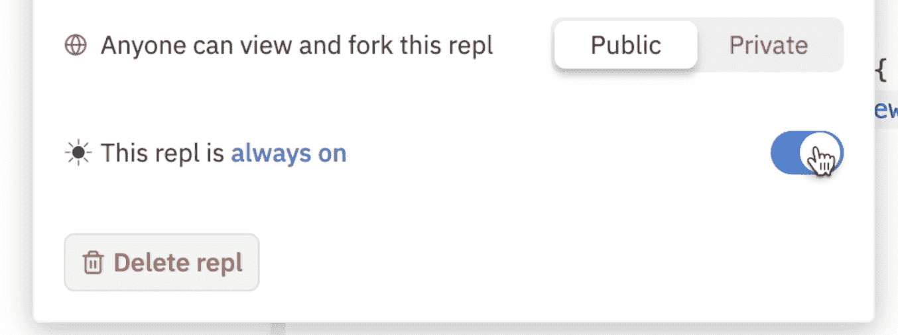

还有另一种方法可以让你的代码运行在自由层，但是有点复杂。Repl.it 将继续运行 web 服务器，即使在选项卡关闭后。但是，即使是网络服务器也只能在没有任何用途的情况下运行一个小时。

以下是回复文件中的内容:

> 部署后，服务器将继续在后台运行，即使在您关闭浏览器选项卡之后。服务器将保持唤醒和活动状态，直到它发出最后一个请求一个小时后，它将进入休眠阶段。休眠的 repls 一收到另一个请求就会被唤醒；不需要重新运行 repl。但是，如果您对服务器进行了更改，您将需要重新启动 repl，以便看到这些更改反映在 live 版本中。

为了保持机器人持续运行，我们将在 https://uptimerobot.com/使用另一项名为 Uptime Robot 的免费服务。

Uptime Robot 可以设置为每 5 分钟 ping repl . it 上的 bot web 服务器。随着不断的 ping，机器人将永远不会进入睡眠阶段，只会继续运行。

因此，我们还需要做两件事来让我们的机器人持续运行:

1.  在 repl.it 中创建一个 web 服务器
2.  设置正常运行时间机器人连续 ping 网络服务器。

### 如何在 repl.it 中创建 Web 服务器

创建一个 web 服务器比你想象的要简单。

为此，在您的项目中创建一个名为`server.js`的新文件。

然后添加以下代码:

```
const express = require("express")

const server = express()

server.all("/", (req, res) => {
  res.send("Bot is running!")
})

function keepAlive() {
  server.listen(3000, () => {
    console.log("Server is ready.")
  })
}

module.exports = keepAlive
```

在这段代码中，我们使用 express 启动一个 web 服务器。服务器返回“Bot 正在运行！”任何参观过它的人。服务器将在一个独立于我们的机器人的线程上运行。我们不会在这里讨论所有的事情，因为其余的都与我们的机器人无关。

现在我们只需要机器人来运行这个网络服务器。

在`index.js`的顶部添加下面一行来导入服务器。

```
const keepAlive = require("./server")
```

要在运行`index.js`时启动 web 服务器，在 bot 运行之前添加下面一行作为倒数第二行。

`keepAlive()`

添加完这段代码后，当您在 repl.it 上运行 bot 时，将会打开一个新的 web 服务器窗口。显示了 web 服务器的 URL。复制 URL，以便在下一节中使用。

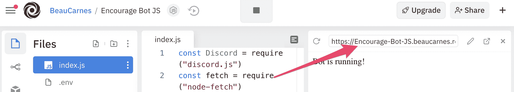

### 如何设置正常运行时间机器人

现在我们需要设置 Uptime Robot 每五分钟 ping 一次 web 服务器。这将导致 bot 持续运行。

在[https://uptimerobot.com/](https://uptimerobot.com/)上创建一个免费账户。

登录到您的帐户后，单击“添加新显示器”。

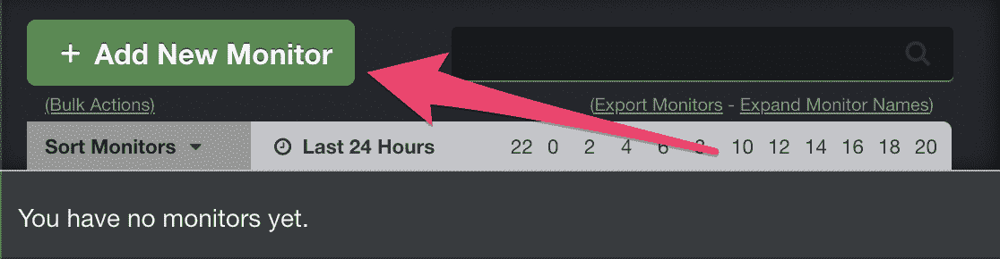

对于新的监视器，选择“HTTP(s)”作为监视器类型，并随意命名。然后，从 repl.it 中粘贴您的 web 服务器的 URL。最后，单击“创建监视器”。

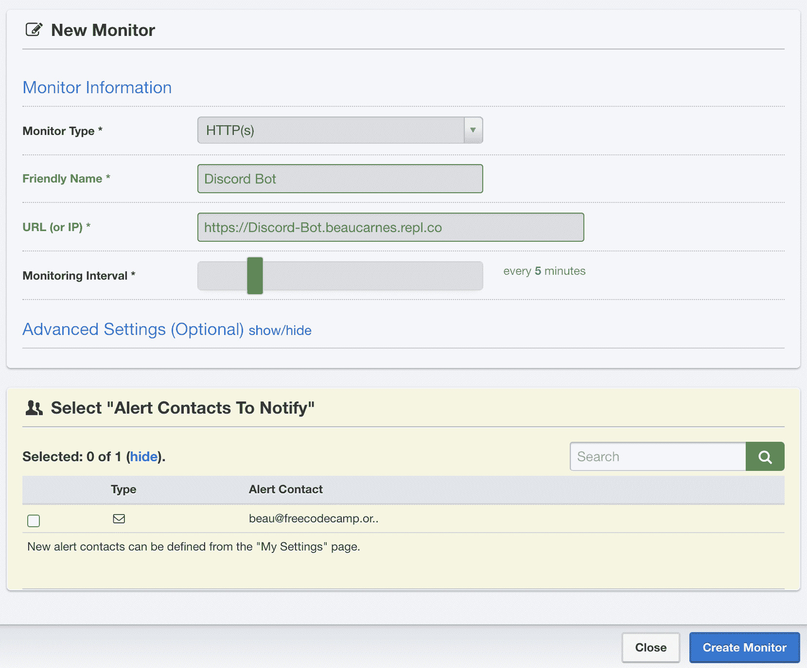

我们完了！现在，机器人将持续运行，因此人们可以随时在 Repl.it 上与它进行交互。

## 结论

您现在知道如何用 JavaScript 创建一个 Discord bot，并在云中持续运行它。

discord.js 库还可以做很多其他的事情。因此，如果你想给 Discord 机器人更多的功能，你的下一步就是查看 discord.js 的文档