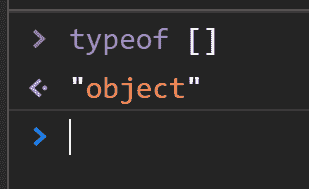
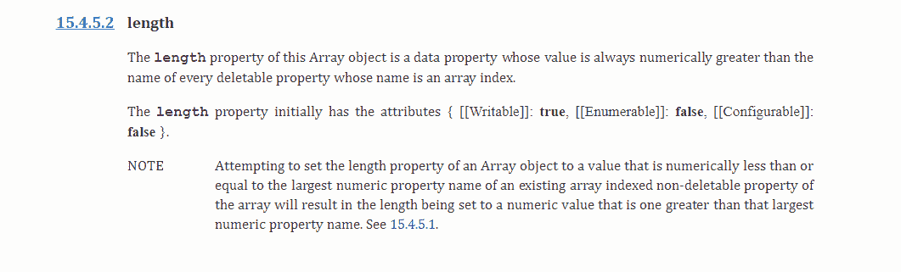
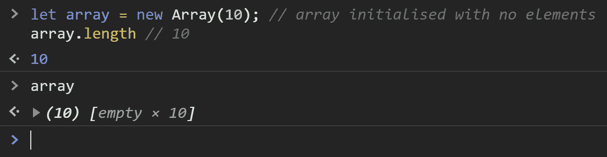
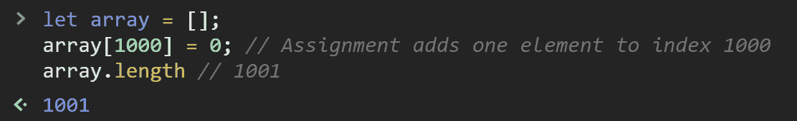
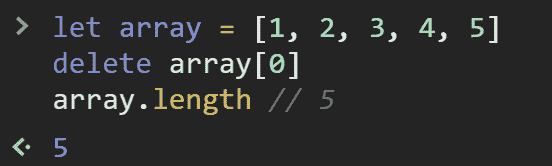
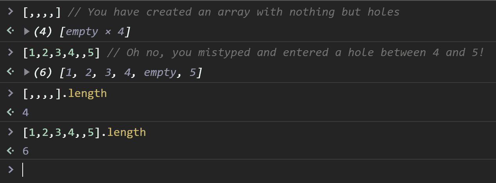
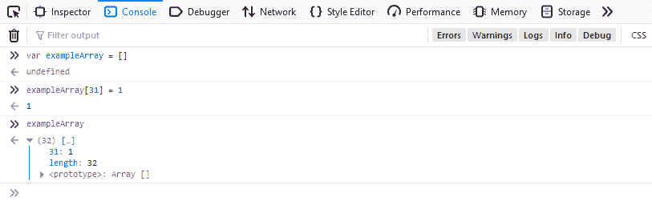

# JavaScript 中的稀疏数组和密集数组——用例子解释

> 原文：<https://www.freecodecamp.org/news/sparse-and-dense-arrays-in-javascript/>

我最近遇到了一个非常有趣的 bug，乍一看，完全难倒了我。我看到我的数组是空的。但是长度是 31。

等等，什么？

## 什么是密集阵列？

密集阵列是最广为人知的`Array`类型。它们是大多数人熟悉的“普通”阵列。

密集数组是这样一种数组，其中的元素都是从索引 0 开始连续排列的。

在这种情况下，数组的长度属性准确地指定了数组中元素的数量。

```
let array = [1, 2, 3, 4, 5]  
array.length // Returns 5 
```

## 什么是稀疏数组？

稀疏数组中的元素不是连续的，也不总是从 0 开始。

它们本质上是有“洞”的，或者在它们的索引序列中有缺口。

举个例子:

```
let array = [];
array[100] = "Holes now exist";
array.length // 101, but only 1 element
```

通常情况下，`Array`的 length 属性会准确地返回数组中元素的数量，但是在稀疏数组中却不会。如果数组是稀疏的，则 length 属性的值大于元素数。

# 为什么`Array` s 可以稀疏？

JavaScript 中的`Array`是`Object`它们的键是数字，它们的值是元素。



```
let array = [];
array[20] = {};
array[100] = {};
array[19] = {};
alert(array.length); // Logs 101 
```

`Array`上的`length`属性获取最后一个元素的索引并加 1。所以如果你有一个数组，在索引 0 到 100 之间有洞，在索引 101 有一个元素，`length`将返回 101，因为它是最后一个索引+ 1。

不管`Array`中有多少元素，上述情况都会发生。

如果你想在这里阅读更多关于 ECMAScript 规范的内容，该规范特别详细地描述了这种行为。



# 如何得到一个稀疏数组？

您已经看到了一些方法，但还有更多:

## 使用`Array`对象

```
let array = new Array(10); // array initialized with no elements
array.length // 10 
```



## 在某个索引处插入一个键/值

```
array[1000] = 0; // Assignment adds one element 
array.length // But .length returns 1001 
```



## 使用`delete`操作符

```
let array = [1, 2, 3, 4, 5]
delete array[0]
array.length // .length returns 5 
```



## 用孔初始化一个`Array`

```
[,,,,] // You have created an array with nothing but holes
[1,2,3,4,,5] // Oh no, you mistyped a comma and entered a hole between 4 and 5! 
```



## 浏览器实现差异

您所在的浏览器(以及版本)以不同方式表示稀疏阵列的孔。

Chrome 最好地显示了这一点(在我看来)，并显示了`empty`。


Firefox 的最新版本(知晓时为 80.0.1)是这样显示的:



## 结论

我在开始时介绍的错误的最终解决方案是在使用元素之前检查它不是错误的。类似于:

```
let array = [,,,,]
for(let i = 0; i < array.length; i++){
    if (array[i]) {
        console.log(array[i])
    }
} 
```

因为这些漏洞是假的，它不会执行你在`Array`中的任何漏洞上尝试的逻辑。

那么为什么我的浏览器显示为空呢？

我用的是 Safari，它没有显示任何洞。所以我注销了长度为 31 的`Array`，当我注销内容时，它只显示了一个空数组！乍一看很困惑。