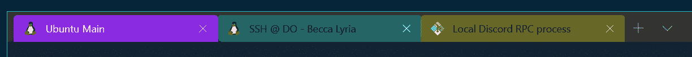
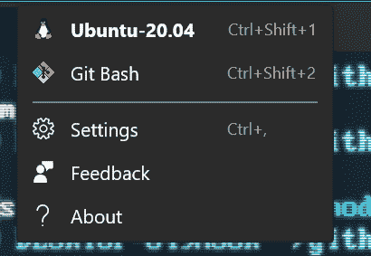
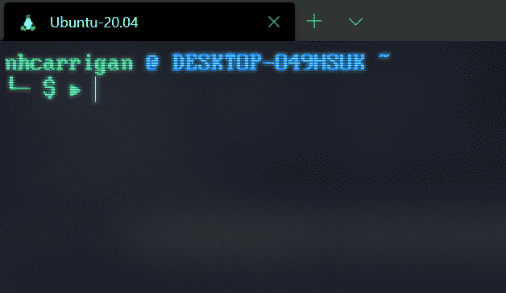
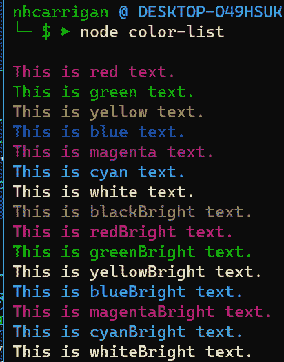
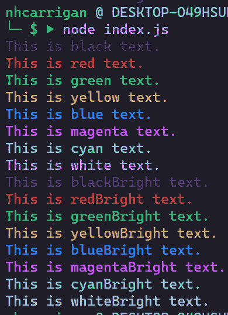
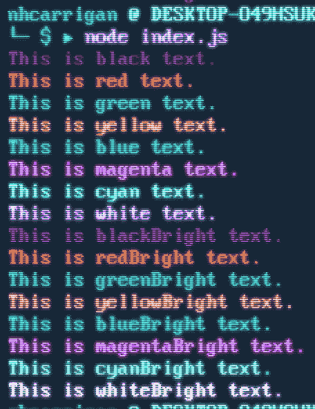
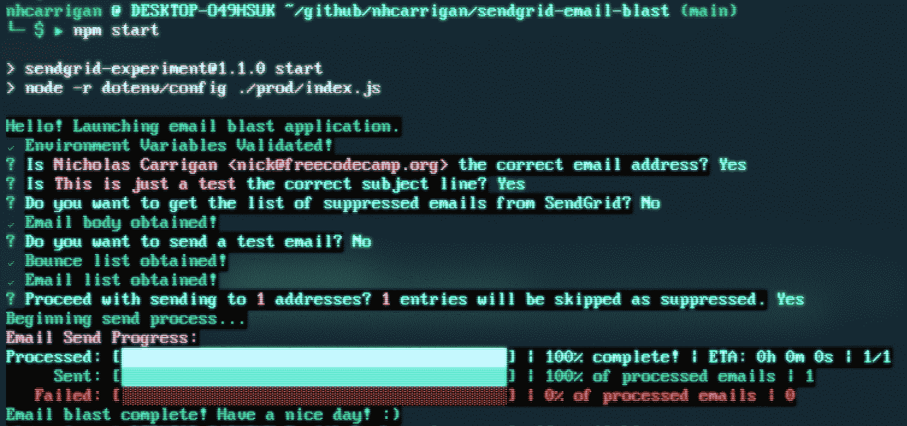

# PowerShell 主题和 Windows 终端配色方案–如何自定义命令行

> 原文：<https://www.freecodecamp.org/news/windows-terminal-themes-color-schemes-powershell-customize/>

我最近为我的本地开发环境安装并配置了 Windows 终端。在本文中，我将带您完成配置您自己的终端的步骤。

如果你还没有这样做，你可以从微软商店下载 Windows 终端[如果你使用的是 Windows 10。Windows 终端在早期版本的 Windows 上不可用。](https://aka.ms/terminal)

## 如何配置您的 PowerShell 选择



Image demonstrating the multi-tab functionality offered by Windows Terminal

Windows 终端最大的好处之一是能够在同一个屏幕上使用多个 shell，在选项卡之间切换以访问不同的 shell。

安装完应用程序后，打开终端并选择顶部的`v`符号(在打开选项卡旁边)。您应该会看到一个可用终端的列表，但是我们现在将忽略这些终端。

从下拉菜单中选择“设置”选项，然后`settings.json`文件应该会在默认的文本编辑器中打开。

这里有很多房产。您需要查看的第一个属性是`profiles`属性。`profiles`属性包含所有的终端选择选项——嵌套的`defaults`属性包含所有配置文件的默认设置,`list`属性包含您的终端配置文件。

我们将重点关注`list`属性，该属性当前应该包含类似如下的值:

```
 [
        {
            "guid": "{61c54bbd-c2c6-5271-96e7-009a87ff44bf}",
            "name": "Windows PowerShell",
            "commandline": "powershell.exe",
            "hidden": false
        },
        {
            "guid": "{0caa0dad-35be-5f56-a8ff-afceeeaa6101}",
            "name": "cmd",
            "commandline": "cmd.exe",
            "hidden": false
        }
    ],
```

The objects you see here will likely match the list of terminals you saw in the dropdown earlier.

属性是一个对象数组，它决定了哪些终端可执行文件可以通过 Windows 终端加载。在此示例中，可用的选项是 Windows PowerShell 和 CMD 提示符。

以下是这些对象的属性分类:

*   `guid`:这是一个 **G** 全局 **U** 唯一 **Id** 标识符，专门用于`defaultProfile`设置(我们将在后面介绍)。
*   `name`:这是当您在 Windows 终端中打开一个新标签时，在下拉列表中显示的名称。
*   `commandline`:这是当你用这个配置文件打开一个标签时加载的可执行文件。
*   `hidden`:该选项为布尔值，决定了配置文件是否出现在新标签下拉列表中。如果您不经常使用终端，将此设置为`true`以防止它显示在下拉列表中。这允许您保留配置文件设置，同时保持您的下拉列表只显示您需要的终端。



Image depicting the dropdown menu, showing two terminals enabled: Ubuntu-20.04 and Git Bash

## 自定义 PowerShell 窗口终端配置示例

根据您的开发环境，这些默认选项可能就是您所需要的。我的大部分工作是在 Linux 的 Windows 子系统(WSL 2)中完成的，偶尔会使用 Git Bash，所以我有一些额外的选择。

```
 {
        "guid": "{07b52e3e-de2c-5db4-bd2d-ba144ed6c273}",
        "hidden": false,
        "name": "Ubuntu-20.04",
        "source": "Windows.Terminal.Wsl",
        "startingDirectory": "//wsl$/Ubuntu-20.04/home/nhcarrigan",
      },
      {
        "guid": "{00000000-0000-0000-ba54-000000000002}",
        "commandline": "%PROGRAMFILES%/git/usr/bin/bash.exe -i -l",
        "icon": "%PROGRAMFILES%/Git/mingw64/share/git/git-for-windows.ico",
        "name": "Git Bash",
        "startingDirectory": "%USERPROFILE%",
      },
```

The WSL option was pre-generated for me, while I had to add the Git Bash option manually.

你可能会在这里看到一些新的属性。

*   `source`:当 Windows 终端检测并生成新终端可执行文件的配置文件时，自动生成该属性。当您手动构造一个配置文件时，您不应该添加它。
*   `icon`:该属性用于选择新标签下拉列表中名称旁边使用的`.ico`图标文件。
*   这是当你用这个描述文件加载一个新标签时，Windows 终端将指向的文件路径。

## 如何在 PowerShell 中构造自定义配置文件

Git Bash 的配置文件设置不是由 Windows 终端自动生成的，我必须手动构造它们。如果你需要做同样的事情，你可以这样做。

首先，您需要生成一个`guid`值。这些采取`{00000000-0000-0000-0000-000000000000}`的格式。您可以通过运行`[guid]::NewGuid()`在 Windows PowerShell 中生成一个，或者通过运行`uuidgen`在 WSL 中生成一个。

接下来，在`commandline`属性中定义可执行文件的路径。`%PROGRAMFILES%`值指向您的“程序文件”目录，并将解释 32 位和 64 位应用程序路径之间的差异。

如果您的安装位于您的用户目录中，您可以使用`%USERPROFILE%`值。`-i -l`标志用于确保 Windows 终端将正确加载你的`.bashrc`文件。

可以省略`icon`属性，但是如果您希望图标出现在终端名称旁边，您需要在这里添加图标文件的路径。

`name`属性是必需的，它决定了下拉选择器中的显示名称。这里我使用“Git Bash”，所以我知道这个选项打开哪个终端。

最后，`startingDirectory`应该设置为默认的文件路径位置，您希望终端在打开时指向这个位置。我将我的设置为`%USERPROFILE%`，它在加载时将终端指向我的 Windows 用户目录。这样，我可以快速访问我的“文档”文件夹或其他文件夹。

## 如何在 PowerShell Windows 终端中设置默认配置文件

现在，如果你返回到`settings.json`文件的顶部，你应该会看到一个`defaultProfile`属性。该选项接受一个`guid`值，该值应该与您的`list`数组中的`guid`值之一相匹配。当您启动 Windows 终端时，它将加载一个带有此配置文件的选项卡。

在我的例子中，我的大部分工作都是在 WSL 中完成的，所以我将我的`defaultProfile`设置为那个`guid`:

```
 "defaultProfile": "{07b52e3e-de2c-5db4-bd2d-ba144ed6c273}",
```

Yes, this is a string which starts and ends with curly braces.

现在，当我打开我的 Windows 终端应用程序时，会产生一个 WSL 实例。



Screenshot depicting a Windows Terminal instance, with a single tab titled "Ubuntu-20.04". "nhcarrigan @ DESKTOP-049HSUK ~" is displayed in the terminal screen.

## 如何在 PowerShell Windows 终端中设计您的配色方案


现在，您已经设置了终端应用程序，我们可以将重点放在对文本进行样式化以使其更加美观。

在`settings.json`中你的`profiles`属性下面，你应该会看到一个`schemes`属性。`schemes`包含一组配色方案对象，如下所示:

```
{
    "name" : "Campbell",

    "cursorColor": "#FFFFFF",
    "selectionBackground": "#FFFFFF",

    "background" : "#0C0C0C",
    "foreground" : "#CCCCCC",

    "black" : "#0C0C0C",
    "blue" : "#0037DA",
    "cyan" : "#3A96DD",
    "green" : "#13A10E",
    "purple" : "#881798",
    "red" : "#C50F1F",
    "white" : "#CCCCCC",
    "yellow" : "#C19C00",
    "brightBlack" : "#767676",
    "brightBlue" : "#3B78FF",
    "brightCyan" : "#61D6D6",
    "brightGreen" : "#16C60C",
    "brightPurple" : "#B4009E",
    "brightRed" : "#E74856",
    "brightWhite" : "#F2F2F2",
    "brightYellow" : "#F9F1A5"
},
```

如果你使用过像`npm`上的`chalk`包这样的工具，你可能会认出其中一些颜色值(`purple`这里是粉笔中的`magenta`)。)其他键执行以下操作:



Image depicting the resulting colors from the default theme above.

*   `name`:这用于将配色方案链接到我们之前创建的配置文件之一。
*   `cursorColor`:这决定了你的文本光标的颜色。
*   `selectionBackground`:决定高亮文本的背景颜色。
*   `background`:决定终端的背景颜色。
*   `foreground`:这决定了你的终端的前景色。就我目前的配置而言，在修改这个值时，我没有看到任何明显的不同。

颜色属性决定了如何显示终端命令(如`console.log`)发送的每个颜色值。

我用于颜色配置文件的设置是:

```
 {
      "name": "Duotone Dark",
      "black": "#1f1d27",
      "red": "#d9393e",
      "green": "#2dcd73",
      "yellow": "#d9b76e",
      "blue": "#2488ff",
      "purple": "#de8d40",
      "cyan": "#6ad7d9",
      "white": "#b7a1ff",
      "brightBlack": "#353147",
      "brightRed": "#d9393e",
      "brightGreen": "#2dcd73",
      "brightYellow": "#d9b76e",
      "brightBlue": "#2488ff",
      "brightPurple": "#de8d40",
      "brightCyan": "#6ad7d9",
      "brightWhite": "#dfd1ed",
      "background": "#1f1d27",
      "foreground": "#b7a1ff"
    },
```

我鼓励您尝试这些值，直到找到适合您偏好的颜色集。



Image depicting the resulting colors from my theme settings.

### 如何将您的配色方案链接到配置文件

现在您已经定义了颜色设置，您需要将这些设置链接到终端配置文件。您可以将设置应用到`profiles`属性中的`defaults`对象，这将把它们应用到您的所有终端。我更喜欢为不同的终端配置不同的颜色设置，这样我就可以很快识别出什么时候我在正确的窗口。

让我们将它应用到我们的 WSL 概要文件中。向您的配置文件对象添加一个`colorScheme`键，并赋予它一个与您的方案的`name`相匹配的值。您现在应该有这样的东西:

```
 {
        "guid": "{07b52e3e-de2c-5db4-bd2d-ba144ed6c273}",
        "hidden": false,
        "name": "Ubuntu-20.04",
        "source": "Windows.Terminal.Wsl",
        "startingDirectory": "//wsl$/Ubuntu-20.04/home/nhcarrigan",
        "colorScheme": "Duotone Dark",
      }
```

如果您重新加载您的 Windows 终端，您应该看到您的新颜色生效。

### 如何配置附加外观设置

我的完整 WSL 配置文件对象有一些额外的设置:

```
 {
        "guid": "{07b52e3e-de2c-5db4-bd2d-ba144ed6c273}",
        "hidden": false,
        "name": "Ubuntu-20.04",
        "source": "Windows.Terminal.Wsl",
        "startingDirectory": "//wsl$/Ubuntu-20.04/home/nhcarrigan",
        "colorScheme": "Duotone Dark",
        "useAcrylic": true,
        "acrylicOpacity": 0.5,
        "fontFace": "PxPlus IBM VGA8",
        "fontSize": 16,
        "experimental.retroTerminalEffect": true
      },
```

您也可以根据自己的喜好调整这些设置。

*   `useAcrylic`将在终端背景上启用 Windows 10 透明效果
*   如果启用了透明效果，`acrylicOpacity`将决定透明效果的强度。数字越低，透明度越高。
*   `fontFace`将选择终端使用的字体。请注意，您需要在计算机上安装该字体。我用的是 [PxPlus IBM VGA8](https://github.com/pocketfood/Fontpkg-PxPlus_IBM_VGA8) 字体，下载了 Windows 可以安装的`.ttf`文件。
*   `fontSize`将决定字体的大小(在`pt`中)。
*   `experimental.retroTerminalEffect`是我最喜欢的设定。这模拟了你终端上的“扫描线”,很像老式的 CRT 显示器。

以下是我最终的设置:



Image depicting the final result of the theme settings.

这些外观设置中的任何一个都可以传入到`defaultSettings`选项中，从而将它们应用到您的所有个人资料中。

```
 "defaultSettings":
    {
        "useAcrylic": true,
        "acrylicOpacity": 0.1,
        "fontFace": "Cascadia Code",
        "fontSize": 10
    },
```

## 如何在 PowerShell Windows 终端中配置附加设置

还有一些额外的设置值得您花时间考虑。

在`schemes`属性之后，您应该会看到一个`actions`属性。这包含一组键盘快捷键设置。

默认情况下，Windows 终端将复制和粘贴命令分别分配给`Ctrl+Shift+C`和`Ctrl+Shift+V`。您可以使用这些设置将它们绑定到默认的`Ctrl+C`和`Ctrl+V`:

```
 { "command": { "action": "copy", "singleLine": false }, "keys": "ctrl+c" },
    { "command": "paste", "keys": "ctrl+v" },
```

设置为`false`的`singleLine`选项保留复制文本中的换行符。

可能在您的`settings.json`文件的顶部附近，有两个属性也影响从您的终端复制文本的行为:

*   `copyOnSelect`默认为`false`。当设定为 true 时，用鼠标高亮显示终端中的文本会将其拷贝到剪贴板。
*   `copyFormatting`默认为`false`。当设置为 true 时，文本格式也将被复制(否则，内容以纯文本形式复制)。

从你的终端复制文本通常是安全的，但是*粘贴*文本到你的终端[可能是危险的](https://www.nhcarrigan.com/dont-paste-to-terminal/)。Windows 终端附带了一些保护措施来帮助避免风险:

*   `largePasteWarning`默认为`true`，可能不在您的`settings.json`文件中。当您尝试粘贴超过 5KB 的内容时，此设置会触发一个对话框。
*   `multiLinePasteWarning`默认为 true，可能不在您的`settings.json`文件中。当您试图粘贴包含换行符的文本内容时，此设置会触发一个对话框(剪贴板劫持攻击的一种常用策略是在粘贴时使用换行符强制命令运行)。

我强烈建议保留这些保护措施。

## 额外资源

恭喜你！现在，您已经设置并配置了自己的 Windows 终端安装程序。

对于您在本文中没有读到的其他定制选项，请访问 [Windows 终端定制文档](https://docs.microsoft.com/en-us/windows/terminal/customize-settings/startup)。

对于大量可供下载的 JSON 文件，请查看 [Windows 终端主题](https://windowsterminalthemes.dev/)。这是我得到设置的地方，我根据个人喜好做了一些调整。



The image which started it all - a demonstration screenshot of my [email blast tool](https://www.freecodecamp.org/news/send-email-newsletter-with-the-sendgrid-api/).

快乐编码。