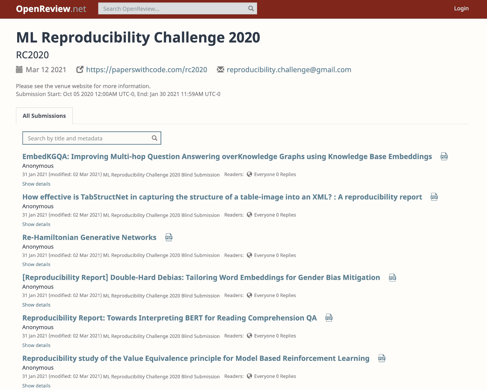
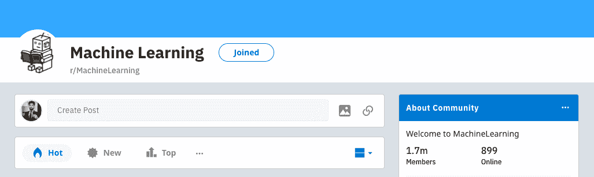
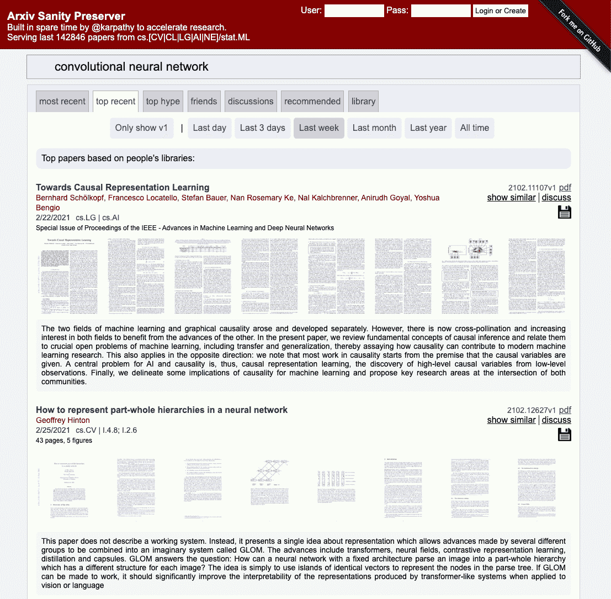
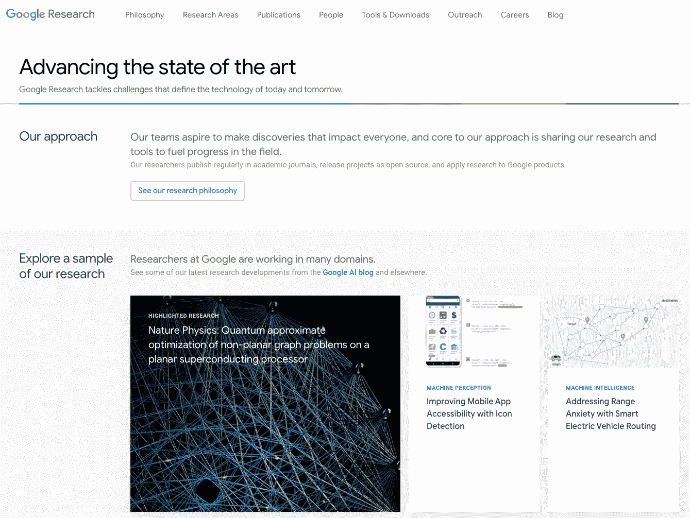
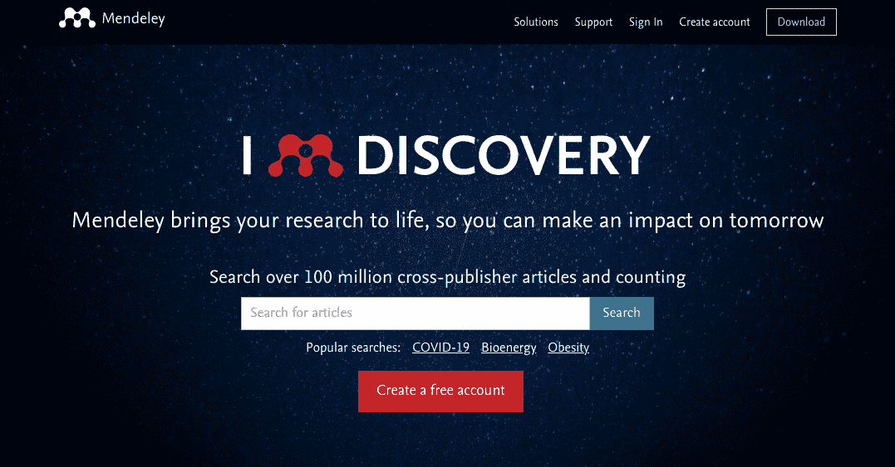
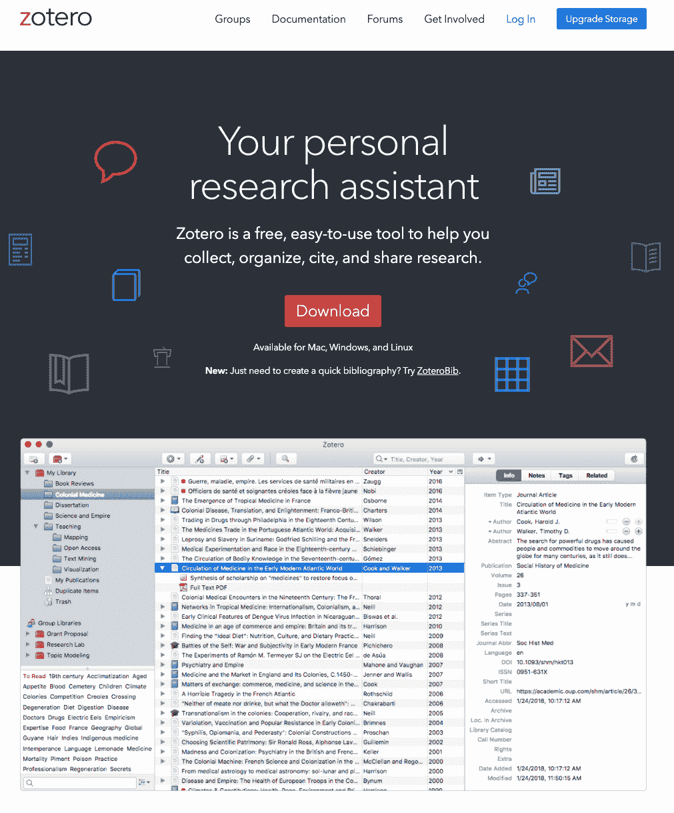
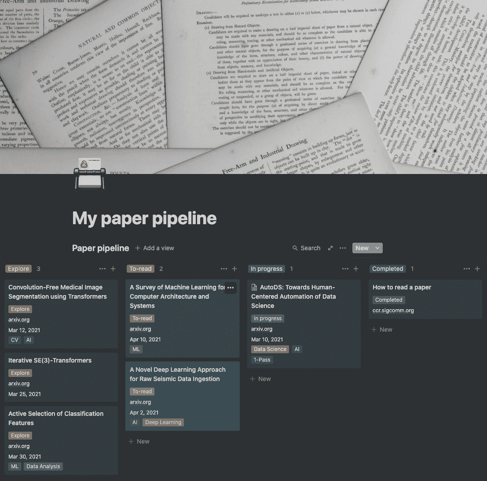

# 如何阅读研究论文——设定研究目标、寻找论文阅读指南，等等

> 原文：<https://www.freecodecamp.org/news/building-a-habit-of-reading-research-papers/>

如果你在一个科学领域工作，你应该试着对那个领域建立一个深刻和公正的理解。这不仅能以最好的方式教育你，还能帮助你预见你所在领域的机会。

一篇研究论文通常是围绕一个主题的广泛深入和真实的实践的高潮。在写研究论文时，作者批判性地思考问题，进行严谨的研究，评估他们的过程和来源，组织他们的思想，然后写作。这些真正执行的实践构成了一篇好的研究论文。

如果你正在努力养成定期阅读论文的习惯(像我一样)，我已经试着分解了整个过程。我与该领域的研究人员进行了交谈，阅读了一些杰出研究人员的论文和博客，并记下了一些你可以遵循的技术。

让我们从了解什么是研究论文，什么不是开始吧！

## 什么是研究论文？

研究论文是密集而详细的手稿，汇集了对某个问题或主题的透彻理解。它提供了一个建议的解决方案和进一步的研究，以及它的推导和执行的条件，解决方案和执行的研究的有效性，以及研究中的潜在漏洞。

撰写研究论文不仅是为了提供一个特殊的学习机会，也是为了给该领域的进一步发展铺平道路。这些论文帮助其他学者发芽的思想种子，可以导致一个新的世界的想法或解决一个长期存在的问题的创新方法。

## 什么研究论文不是

有一种普遍的观念认为，研究论文是通过其他来源对某个问题或主题的充分知情的总结。

但是你不应该把它误认为是一本书，或者是一个人对某个特定主题的解释的自以为是的叙述。

## 为什么要读研究论文？

我发现阅读一篇好的研究论文的迷人之处在于，你可以利用对一个主题的深刻研究，并从一个新的角度与社区接触，以了解在该主题中或围绕该主题可以实现什么。

我在教学设计和数据科学的交叉领域工作。学习是我日常责任的一部分。如果我的教育来源有缺陷或效率低下，从长远来看，我会在工作中失败。这也适用于许多其他特别关注研究的科学工作。

阅读研究论文有三个重要原因:

1.  **知识—** 从某个人的角度理解问题，这个人可能已经花了数年时间来解决这个问题，并处理了所有你一开始可能没有想到的边缘案例。
2.  **探索—** 无论你是否有明确的议程，你都很有可能会发现一个边缘案例或一个值得跟进的缺点。经过相当长时间的不懈努力，你可以学会利用这些知识谋生。
3.  **研究与回顾—** 撰写研究论文的一个主要原因是为了进一步推动该领域的发展。研究人员阅读论文是为了在会议上对其进行评论，或者是为了对一个新领域进行文献调查。例如，[Yann le Cun](http://yann.lecun.com/exdb/publis/pdf/lecun-89e.pdf)在 1989 年发表的关于将领域约束整合到反向传播中的论文奠定了现代计算机视觉的基础。经过几十年的研发工作，我们已经走了这么远，现在我们正在完善像物体检测和优化自动驾驶汽车这样的问题。

不仅如此，在互联网的帮助下，你可以将所有这些原因或好处外推到多种商业模式上。它可以是一个创新的最先进的产品，一个高效的服务模式，一个内容创作者，或者是一份你正在解决对你来说很重要的问题的理想工作。

## 阅读研究论文的目标——你应该读些什么？

首先要做的是弄清楚你读报的动机。有两种主要情况可能会让你去读一篇论文:

1.  **情景 1 —** 你有一个明确的议程/目标，并且在某个特定领域投入很大。例如，你是一名自然语言处理从业者，你想了解 GPT-4 是如何给我们带来自然语言处理的突破的。这总是一个很好的场景，因为它提供了清晰度。
2.  **场景 2 —** 你想要跟上许多领域的发展，比如说[一种新的深度学习架构如何帮助我们解决了理解蛋白质结构这一 50 年的生物学难题。对于初学者或每天从研究论文中获取新闻的人来说，这是常有的事(是的，它们确实存在！).](https://deepmind.com/blog/article/alphafold-a-solution-to-a-50-year-old-grand-challenge-in-biology)

如果你是一个好奇的初学者，心里没有起点，从场景 2 开始。列出几个你想读的主题，直到你找到一个你感兴趣的领域。这将最终把你带到场景 1。

### ML 再现性挑战

除了这些一般目标，如果你需要一个阅读研究论文的习惯培养的最终目标，你应该看看 [ML 再现性挑战。](https://openreview.net/group?id=ML_Reproducibility_Challenge/2020)

[https://openreview.net/group?id=ML_Reproducibility_Challenge/2020](https://openreview.net/group?id=ML_Reproducibility_Challenge/2020)

你会发现世界级会议的顶级论文，值得深入研究和复制结果。

他们一年进行两次这样的挑战，2021 年春天会有一次。你应该研究一下过去三个版本的挑战，我会写一个详细的帖子，介绍应该期待什么，如何准备等等。

现在你一定在想——如何找到合适的报纸来阅读？

## 如何找到合适的报纸阅读

为了得到一些关于这个问题的想法，我联系了我的朋友，阿努拉格·戈什，他是微软的一名研究员。Anurag 一直致力于计算机视觉、机器学习和系统工程的交叉领域。

https://anuragxel.github.io/

以下是他的一些入门建议:

*   总是选择你感兴趣的领域。
*   阅读一些关于这个主题的好书或详细的博客文章，并通过阅读这些资源中引用的论文开始深入研究。
*   寻找围绕该主题的开创性论文。这些论文报告了该领域的重大突破，并提供了一种新的方法视角，对该领域的后续研究具有巨大的潜力。查看来自[晨报](https://blog.acolyer.org/)或CVF-时间检验奖/亥姆霍兹奖的论文(如果你对计算机视觉感兴趣的话)。
*   看看像理查德·塞利斯基的《计算机视觉:算法和应用》这样的书，并寻找那里引用的论文。
*   拥有并建立社区意识。找到有相似兴趣的人，加入促进此类活动的团体/子社区/不和谐频道。

除了这些宝贵的建议，我还列出了一些网络应用程序，它们可以帮助我缩小搜索范围，找到合适的论文来阅读:

*   有许多研究人员、从业者和工程师分享他们的工作以及他们发现对实现这些结果有用的论文。

[https://www.reddit.com/r/MachineLearning/](https://www.reddit.com/r/MachineLearning/)

*   Arxiv Sanity Preserver —由 Andrej Karpathy 建造，用于加速研究。它是 142，846 篇论文的储存库，这些论文来自计算机科学、机器学习、系统、人工智能、统计、简历等等。它还提供了一系列过滤器、强大的搜索功能和一个论坛，从而成为一个超级有用的研究平台。

*   谷歌研究 —谷歌的研究团队正在研究影响我们日常生活的问题。他们分享他们的出版物，供个人和团队学习、贡献和加速研究。他们还有一个谷歌人工智能博客，你可以去看看。

## 如何阅读研究论文

在你列出了你的阅读清单后，接下来就是阅读这些文件的过程了。请记住，并不是每篇论文都值得一读，我们需要一种机制来帮助我们快速筛选值得一读的论文。

为了应对这一挑战，你可以使用这种 [**三步法**由 **S .凯沙夫**。这种方法建议你分三遍阅读论文，而不是从头开始，一头扎到最后。](http://ccr.sigcomm.org/online/files/p83-keshavA.pdf)

### 三遍方法

1.  **第一遍—** 是快速扫描，以捕捉纸张的高级视图。仔细阅读标题、摘要和引言，然后是章节和小节的标题，最后是结论。你应该花不超过 5-10 分钟的时间来决定是否要进入第二阶段。
2.  **第二遍—** 是更集中的阅读，不检查技术证据。你记下所有重要的笔记，在页边空白处划下重点。仔细研究这些数字、图表和插图。查看图表，标记相关的未读参考资料，以便进一步阅读。这有助于你理解论文的背景。
3.  **第三关—** 达到这一关意味着你已经找到了一篇你想深入理解或回顾的论文。第三关的关键是重现论文的结果。检查所有的假设，并记下您的重新实现和原始结果中的所有变化。记下所有的想法，以便将来分析。新手需要 5-6 个小时，有经验的读者需要 1-2 个小时。

## 跟踪您的论文管道的工具和软件

如果你真诚地阅读研究论文，你的论文清单将很快增长到一个难以跟踪的压倒性的堆栈。幸运的是，我们有软件可以帮助我们建立一个机制来管理我们的研究。

这里有一些你可以使用的:

*   [**门德利**](https://www.mendeley.com/?interaction_required=true) **【不免费】** —您可以从浏览器直接将论文添加到您的图书馆，导入文档，生成参考文献和引文，与研究人员合作，并从任何地方访问您的图书馆。这主要由有经验的研究人员使用。

https://www.mendeley.com/?interaction_required=true

*   **Zotero【免费&开源】—** 与 Mendeley 思路一致，但免费。您可以利用所有功能，但存储空间有限。

https://www.zotero.org/

*   **理念—** 如果你刚刚起步，想要使用一个轻量级的工具，在一个工作区内组织文件、记笔记和管理一切，这是一个很好的选择。它可能无法与上述工具相比，但我个人觉得使用概念很舒服，我已经创建了[这个板](https://www.notion.so/My-paper-pipeline-ec3ff02ce9c641d2953f6cdbc431a55a)来记录我的进度，现在你可以复制:

## ⚠️阅读研究论文的症状

阅读一篇研究论文可能会令人沮丧、富有挑战性，而且耗费时间，尤其是当你是一个初学者的时候。您可能会面临以下常见症状:

*   你可能会因为不理解一篇论文的内容而开始感到愚蠢。
*   发现自己太努力去理解那些证明背后的数学。
*   用你的头撞墙来绕过论文中使用的缩略语。开个玩笑，你得时不时查查那些首字母缩写词。
*   在一个段落上卡住一个多小时。

亚当·鲁本在本文中解释了你可能经历的一系列情绪。

## 关键要点

我们应该准备好开始工作了。下面是我们在这里所讲内容的一个快速总结:

*   研究论文是一种深入的研究，它提供了对一个主题或问题的详细解释，以及研究过程、证据、解释结果和对未来工作的想法。
*   阅读研究论文，加深对某个主题/问题的理解。然后，你可以作为研究人员的一部分回顾论文，探索领域和问题类型，以建立解决方案或围绕它创业，或者你可以简单地阅读它们，以跟上你感兴趣的领域的发展。
*   如果你是初学者，从探索开始，很快就能找到你的目标导向研究之路。
*   为了找到好的论文阅读，你可以使用 arxiv-sanity、google research 等网站，以及 r/MachineLearning 等子网站。
*   阅读方法——使用三步法来找一篇论文。
*   通过使用 Zotero/concept 这样的工具来跟踪你的研究、笔记和进展。
*   这很快就会变得势不可挡。确保你开始的时候很轻松，然后逐渐增加你的负荷。

记住:艺术不是一个周末完成的单一方法或步骤，而是一个随着时间的推移取得显著成果的过程。

你也可以在我的 [YouTube 频道](https://www.youtube.com/channel/UCH-xwLTKQaABNs2QmGxK2bQ)上观看这个话题的视频:

[https://www.youtube.com/embed/FukV7n8ztT8?feature=oembed](https://www.youtube.com/embed/FukV7n8ztT8?feature=oembed)

https://www.youtube.com/channel/UCH-xwLTKQaABNs2QmGxK2bQ

如果你有一些建议、问题或想法，欢迎回复本博客或评论视频！

如果这个教程有帮助，你应该看看我在 [Wiplane Academy](https://www.wiplane.com/) 上的数据科学和机器学习课程。它们全面而紧凑，帮助您建立一个坚实的工作基础来展示。