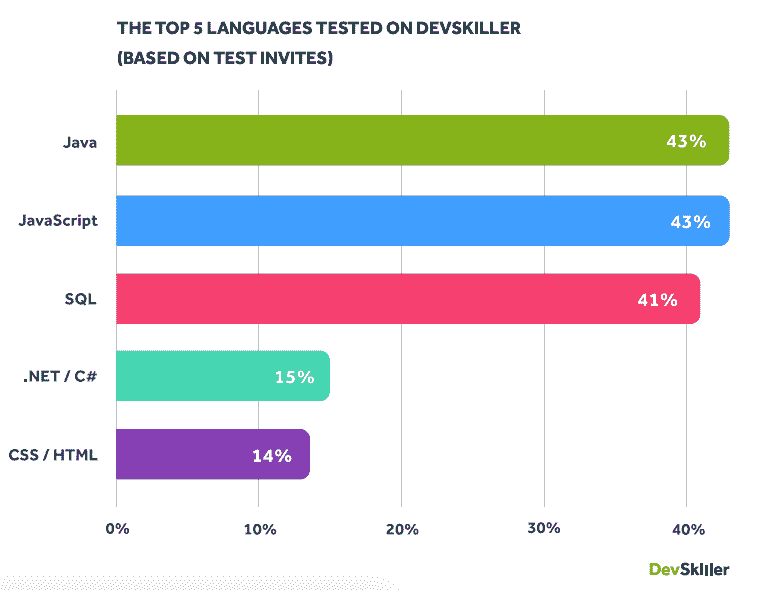
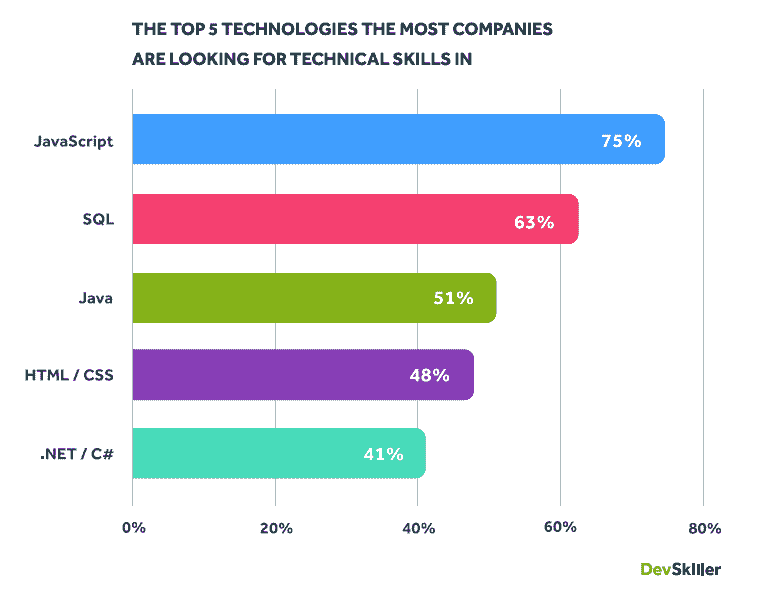
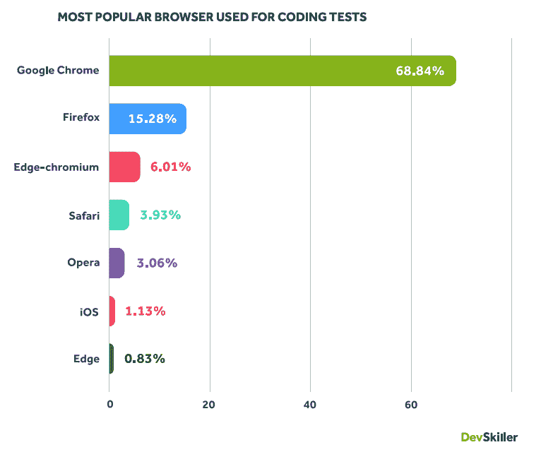
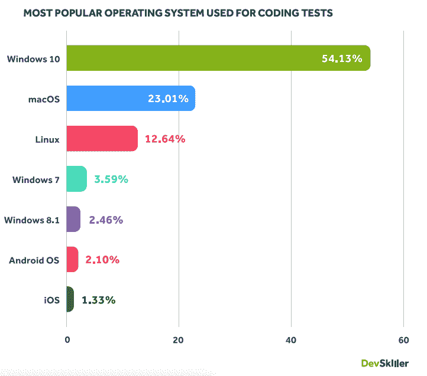
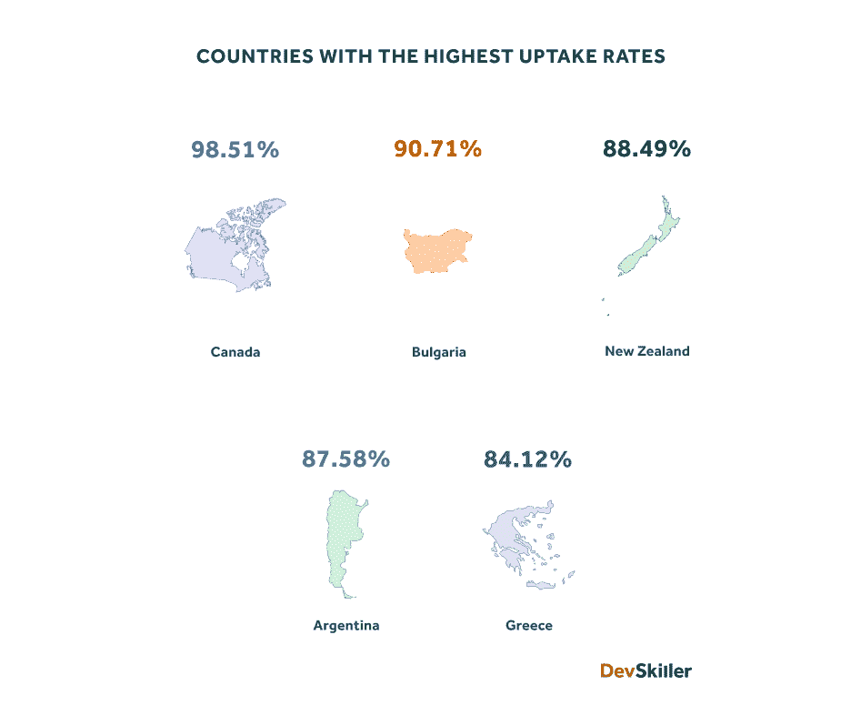
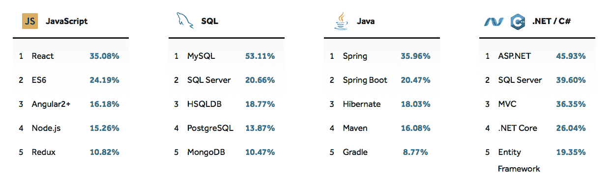
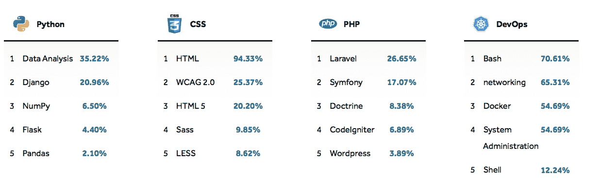
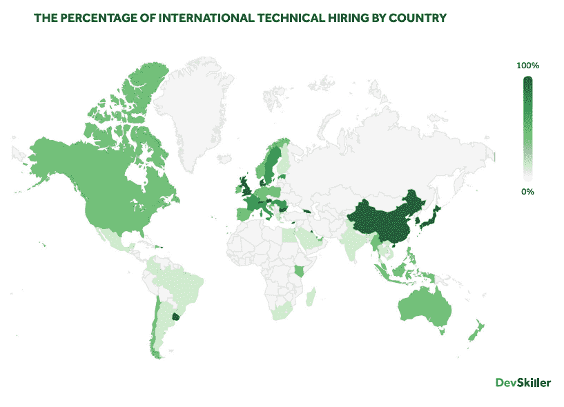
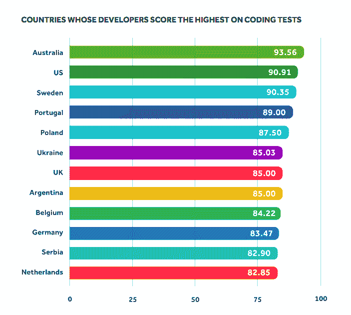
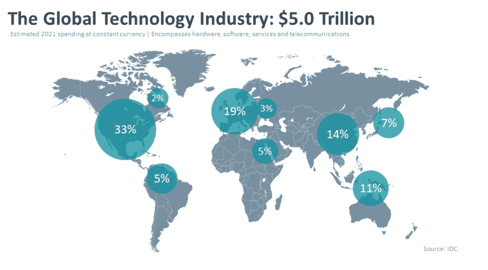

# 我们向来自 156 个国家的开发人员发送了 304，654 份编码测试——以下是我们了解到的情况

> 原文：<https://www.freecodecamp.org/news/developer-skills-report-insights-from-coding-tests/>

在 DevSkiller，我们以详细的行业报告而闻名，这些报告帮助 IT 招聘专业人员做出招聘决定。过去的一年是我们团队有史以来收集的最多样化、数据量最大的一年。

尽管 2020 年给我们带来了各种情况，但这场演出必须继续下去。我们已经收集了 304，654 次编码测试，发送给 156 个国家的开发者，以创建 [2021 年发展技能报告](https://devskiller.com/it-skills-report/)。

虽然很容易指出大型科技跨国公司确实会从我们经历的危机中获利，但许多其他小企业将很难适应市场波动的需求。

创新技术可以帮助减轻这一过程中许多不可预见的负担，但企业对依赖不熟悉的技术所涉及的风险持谨慎态度。

为了更容易地处理我们的科技世界在过去一年中发生的变化，我将提供对数据集的见解，并强调今年报告中一些更相关的发现。

## 1) Java 和 JavaScript 是 2021 年最受欢迎的 IT 技能

今年最重要的发展之一是 Java 重新加入了 JavaScript，成为 IT 技能的领头羊。这两种流行语言出现在 43%的测试邀请中。

前 5 名的其余部分是 SQL。NET/C#和 CSS/HTML 连续第二年。

随着 Java 再次强调其相关性，这一趋势表明，尽管前端架构在软件开发中非常重要，但许多公司都在寻找精通后端技术的开发人员。

正如我们在去年的报告中发现的，在 DevSkiller 的平台上，前 5 名 IT 技能通常与其他语言一起测试。然而，这表明越来越多的公司正在寻找具备这些 it 技能的开发人员。

## 2) 75%的公司都在寻找 JavaScript 开发人员

有趣的是，与去年相比，排名前五的理想 IT 技能保持不变。他们的总体百分比略有变化，但名单或多或少保持不变。

去年，75%的公司在寻找 JavaScript 开发人员。SQL 以 63%的比例位居第二，而 Java 略微下降到 51%。HTML/CSS 和。NET/C#相比去年分别提高了 48%和 41%。

这些数字也在 [Stack Overflow 2020 开发者调查](https://insights.stackoverflow.com/survey/2020)中得到证实，在该调查中，它也占据首位。这足以证明 JavaScript 仍然是首选的前端 IT 技能。

我们想指出的是，越来越多的人倾向于用 TypeScript 来代替 JavaScript。这两者之间的区别在这份报告中没有详细说明，因为我们将大多数类型脚本编码测试邀请归类为我们平台上的 JavaScript。在接下来的几年里，我们会做出更清晰的区分。

连续一年，SQL 都是最受欢迎的数据库 IT 技能。当公司越来越多地选择。NET/C#来解决技术问题，Java 仍然是首选。HTML/CSS 越来越受欢迎，这表明对熟练 web 开发人员的需求越来越大。

## 3)谷歌 Chrome 和 Windows 10 是我们平台上最受欢迎的浏览器和操作系统

在过去的一年中，我们决定对候选人在我们的系统中使用的最流行的浏览器和操作系统进行分析。

毫不奇怪，谷歌浏览器(68.84%)遥遥领先于其他浏览器。这一发现反映了 StatCounter Global 的数据，该数据在发表时将谷歌 Chrome 列为最受欢迎的网络浏览器(63.54%)。

Mozilla Firefox (15.28%)在我们的榜单上排名第二，其次是 Edge-chromium (6.01%)和 Safari (3.93%)。我们的补充来源 StatCounter 将 Safari 排在第二位，而 Firefox 排在第三位。

这表明开发人员有不同的需求，Firefox 可以更好地满足这些需求——这表明开发人员不一定要遵循与普通大众相同的趋势。

最受欢迎的操作系统是 Windows 10，有 54.13%的开发者使用该操作系统。同样不出所料的是，这与 [2020 Stack Overflow 开发者调查一致，](https://insights.stackoverflow.com/survey/2020#technology-most-loved-dreaded-and-wanted-other-frameworks-libraries-and-tools-wanted3)在该调查中，几乎一半的受访开发者将 Windows 作为他们的主要操作系统。

接下来是 macOS (23.01%)、Linux (12.64%)，而 Windows 7、Windows 8.1、Android OS 和 iOS 的使用人数都不到 5%。

## 4)参加编码测试的考生比以往任何时候都多(69%)

在过去的一年中，69%的考试由考生参加，创下了历史最高水平。去年，只有 41%的考生参加了考试。如果你考虑到公司向比去年更多的候选人发出 DevSkiller 编码测试的事实，这是一个更加令人印象深刻的壮举。

我们认为，今年报告中的高摄取量可能是由于新冠肺炎疫情。那些要么被迫失业，要么对自己的工作不确定的候选人，并没有忽视他们的编码邀请。

## 5) React、MySQL、Spring、ASP.NET、数据分析、HTML、Laravel 和 Bash 是各自技术栈中最受欢迎的技术

由于我们的测试是在考虑技术栈的情况下创建的，所以我们能够看到在它们各自的栈中最流行的 IT 技能、资源和技术是什么。

### React 是 JavaScript 技术栈中最常用的技术，出现在 35%的测试中。

React 连续第二年成为 JavaScript 技术栈中最受欢迎的技术。

就像去年一样，React 高居黑客新闻[招聘趋势](https://www.hntrends.com/2019/dec-another-year-on-top-for-react.html)榜首，在发布之时，它已经连续 31 个月保持领先。

### 超过一半的 SQL 测试使用 MySQL，占 53%。

MySQL 的受欢迎程度逐年增加，2020 年数据库管理系统的受欢迎程度增加了近 16%。SQL Server 和 HSQLDB 分列二、三位。

### Spring 是 Java 技术栈中使用最多的工具，有 36%的测试使用它。

Spring 仍然是最受欢迎的工具，但与去年(47%)相比有所下降。Spring Boot 的用户友好性和功能性把流行的框架放在了第二位。

### 几乎一半的人都见过 ASP.NET。NET/C#技术堆栈测试。

去年的领导者再次高居榜首。NET/C#技术栈，高达 45.93%。今年，SQL Server (36.90%)以微弱优势超过 MVC (36.35%)位居第二。

### 数据分析位于 Python 技术栈的顶端，在 35.22%的测试中使用。

流行的开源 web 框架 Django 连续第二年占据了 20.96%的份额。

### HTML 出现在 94%的 CSS 测试中。

由于这两种技术是如此的可互换，HTML 在 CSS 技术栈中如此突出也就不足为奇了。

### Laravel 仍然是 PHP 技术栈中最受欢迎的资源，有 26.65%的测试。

尽管比去年略有下降，Laravel 仍然是 PHP 技术栈中最受欢迎的框架。Symfony 在 17.07%的测试中表现突出。

### Bash 是 DevOps 技术堆栈中的行业领导者，在 70.61%的测试中出现。

这是我们第一次将 DevOps 技术堆栈纳入本报告，近年来它的受欢迎程度迅速提高。紧随 Bash 之后的是网络(65.31%)，然后是 Docker 和系统管理并列 54.69%。

## 6)各国比以往任何时候都更加关注海外的技术招聘需求

新冠肺炎疫情引起了公司招聘模式的重大变化。因此，大多数公司都经历了向远程友好甚至远程优先工作场所的快速转变，这促使国际招聘大幅增加。

今年，英国、加拿大、澳大利亚、印度尼西亚、丹麦和智利的国际招聘比例都有所上升。

## 7)澳大利亚开发人员在编码测试中得分最高

前几年，我们使用平均分来确定各国得分最高的开发人员。

今年，我们分析了第 90 个百分位数——这表明了某个国家只有前 10%的候选人得分高于。我们做出这一改变是因为平均分数包含了异常值，这些异常值通常会影响平均值并扭曲结果。

过去一年，澳大利亚在 IT 技能方面拔得头筹，10%的澳大利亚开发人员在编码测试中得分高于 93.56%。来自美国的开发者位居第二(90.91%)。前五名中的其他几个国家是瑞典(90.35%)、葡萄牙(89%)和波兰(87.50%)

## 8)美国正在推动国际招聘，但在海外招聘方面，美国仅是第五大劳动力市场

美国是国际招聘的全球领导者，但已下滑至第五大劳动力市场。2020 年，我们看到美国从第二位跌至第四位，这是持续下滑趋势的一部分。

这些统计数据证明了来自其他市场的开发商的质量在不断提高。巴西占据了前五名的位置，而来自俄罗斯和加拿大的开发人员正成为越来越受欢迎的海外招聘来源。

我们看到的另一个趋势是，企业正集中精力将 IT 技能分配给以外包为主的国家。这一趋势可能会持续数年。

有趣的是，加拿大和巴西在美国招募开发者的国家中分列第一和第二位。正如我们去年提到的，地理位置的接近和相对时差使得美国公司希望从这些国家寻找开发人员。

## 这些 IT 技能数字对我们的发展意味着什么？

2020 年以各种可能的方式挑战着我们。其影响的后果无疑需要数年时间才能恢复，包括科技界。

尽管现实令人清醒，但劳工统计局预测未来十年 IT 行业将增长 11%。预计在软件开发领域会有更大的提升。

我们还分析了 2020 年全球 IT 市场的状况以及 2021 年的前景。据 CompTia 报道，研究咨询公司 IDC 在 8 月份预测 2020 年全球 IT 收入为 4.8 万亿美元，但由于新冠肺炎疫情，该公司未能达到这一目标。

正如预期的那样，2021 年美国将成为世界上最大的科技市场，占总收入的 33%，或 1.6 万亿美元。在美国之外，西欧(19%)和中国(14%)是预计 2021 年的两个最大的技术市场。

虽然我们所有的数据都是在过去的一年中收集的，但它为未来一年提供了一些有趣的见解:

*   美国的开发人员劳动力市场正在萎缩，尽管它仍然是技术招聘的全球领导者，但在为全球市场提供 it 技能的专业人员方面，它现在排名第五。
*   澳大利亚开发商声称自己是世界上最好的开发商之一。
*   JavaScript 不会消失，这种传统技术的受欢迎程度和需求似乎只会上升。
*   疫情为考生提供了更多的时间来参加和完成编码测试。
*   熟悉 SQL 等数据库语言还有很长的路要走，Spring Boot 也在慢慢地与 Spring 竞争，成为 Java 技术栈中最受欢迎的资源。

这些只是报告中的一些发现。如果你想全面了解这些见解和更多信息，请查看完整的 [2021 年 DevSkiller IT 技能报告](https://devskiller.com/it-skills-report/)。