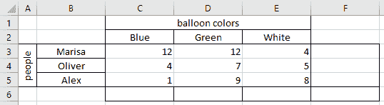
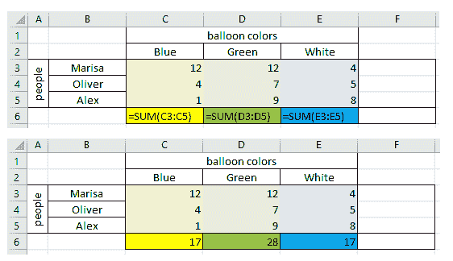
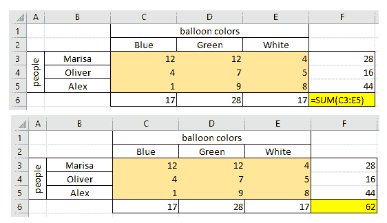
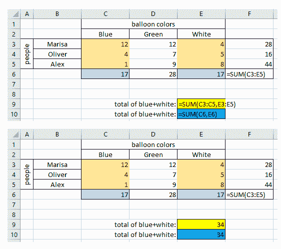
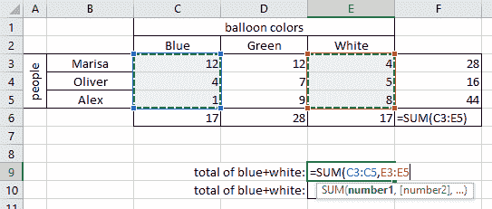
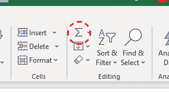

# 自动求和 Excel–如何用求和公式将数字相加

> 原文：<https://www.freecodecamp.org/news/how-to-add-numbers-in-excel-with-the-excel-sum-formula/>

Excel 中的`SUM()`公式用于将两个或多个单元格的内容相加。它获取单元格名称并返回求和的结果。

让我们应用`SUM`公式，这样我们就可以看到它的作用。假设你正在组织一个聚会，不同的人带着不同颜色的气球。你将在表格中记录每个人带了多少个每种颜色的气球。

## 如何添加列中的单元格

首先，我们想知道人们带了多少每种颜色的气球来参加聚会。

所以基于上表，为了找出我们有多少个蓝色气球，我们可以在单元格`C6`中写下`SUM`公式。然后我们把想要加在一起的单元格写成`C3:C5`，它会被解释为“从`C3`到`C5`的所有单元格”。所以我们会有`=SUM(C3:C5)`。

我们也可以对绿色和白色气球做同样的事情——我们将为绿色写单元格`D3:D5`,为白色写单元格`E3:E5`。

## 如何将一行中的单元格相加

接下来，我们想知道每个人带了多少气球。为了找出玛丽莎带了多少个气球，我们可以在`F3`单元格中写出`SUM`公式，把我们要加在一起的单元格写成`C3:E3`。这将被解释为“从`C3`到`E3`的所有单元”，这给了我们`=SUM(C3:E3)`。

类似地，对于奥利弗的气球，我们写单元格`C4:E4`，对于亚历克斯的气球写`C5:E5`。

## 如何添加块中的单元格

我们要学的最后一件事是算出我们总共有多少个气球。

要做到这一点，我们需要把我们所有的气球加起来。我们将单元格块写成`C3:E5`，它将选择左上角有`C3`右下角有`E5`的矩形中的所有单元格。

## 如何添加不同间隔的单元格

如果我们想知道彼此不相邻的不同数据区间的总和(例如我们总共有多少个蓝色和白色气球)，我们可以使用`SUM`公式用逗号分隔数据区间。

所以既然`C3:C5`是蓝色气球的间隔，`E3:E5`是白色气球的间隔，我们可以写成`=SUM(C3:C5,E3:E5)`。同样，由于我们已经知道我们总共有多少个蓝色气球和多少个白色气球，我们可以用`=SUM(C6,E6)`将两个总数相加。

## 如何用鼠标选择数据来添加单元格

到目前为止，我们已经输入了单元格的名称来选择它们。但是 Excel 也允许你用鼠标选择要在公式中使用的单元格。

一旦你写了`=SUM(`，你就可以选择单元格了——如果你想选择多个区间，你只需按住`Ctrl`。完成后，您可以按下`Enter`,选定单元格的总和将被计算出来。

## 如何使用自动求和添加单元格

Excel 中有一个叫 AutoSum 的工具，你只需点击一下，就可以做简单的加法。你可以在主菜单中找到它，它有一个希腊大写字母 sigma(σ)的符号。

使用此工具，您可以从第一幅图像中进行任何计算之前的情况，选择三个单元格`F3`、`F4`和`F5`，按下“自动求和”按钮，它将立即用左侧单元格的总和填充单元格(与我们在一行中添加单元格时得到的结果相同)。

您也可以选择三个单元格`C6`、`D6`和`E6`，并按下 AutoSum 以获得上述单元格的总和(与我们在一列中添加单元格时的结果相同)。

或者，自动求和工具可以用作编写`SUM`公式的快捷方式:当您只选择一个单元格并按下自动求和按钮时，该单元格将填充有`SUM`公式。然后，您可以用鼠标选择要求和的单元格，或者在公式的括号内写入要求和的单元格的间隔。

如果所选单元格靠近其他已填充的单元格，则可以用要求和的单元格建议来预填充`SUM`公式。

## 包扎

`SUM()`公式允许您将单元格相加。为了确定要求和的单元格，您可以键入它们的名称作为`SUM`()公式的参数，或者在键入公式名称和左括号后用鼠标选择它们。该公式也可以与自动求和工具一起使用。