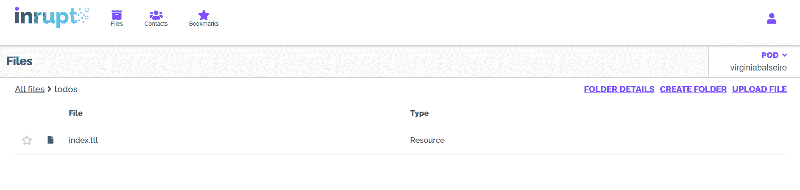

# 如何使用 React 构建一个可靠的待办事项应用程序

> 原文：<https://www.freecodecamp.org/news/create-a-solid-to-do-app-with-react/>

在本教程中，你将学习如何创建一个基本的[固体](https://solidproject.org/about)待办事项应用程序。但是什么是固体——不要和[固体](https://www.freecodecamp.org/news/solid-principles-explained-in-plain-english/)混淆？嗯，它是一套用来构建去中心化应用的惯例和工具。

那么我说的分权是什么意思呢？目前，我们所有的数据都集中在几个网络平台上:脸书、谷歌和其他。这对隐私有各种各样的后果，我们都知道，但它也危及网络的普遍性原则:网络必须是每个人都可以访问的。让我用一个例子来说明这一点:如果我的德语老师决定创建一个脸书群来共享课程材料，我需要一个脸书帐户来访问它。同样，如果教师决定退出脸书，她需要将学生和数据一起转移到另一个应用程序。

有了 Solid，数据和 app 解耦。数据存储在一个地方，应用程序在那里读写数据。用户可以控制数据的位置，以及他们希望与哪些人或应用程序共享数据。用户可以根据哪些应用程序更适合他们的需求来决定使用哪些应用程序，并且他们可以完全控制自己的数据。

这对开发者也有很多好处，因为竞争是基于应用程序的质量，而不是你控制了多少用户数据。

对于前端开发人员来说，如果您想保存用户数据，不必担心建立数据库，这是一个额外的好处。

本教程将帮助您熟悉一些可用于编写可靠应用程序的工具。我们将使用以下库:

*   [solid-client](https://docs.inrupt.com/developer-tools/javascript/client-libraries/tutorial/read-write-data/) :在 Solid Pods 中读写数据的库
*   solid-UI-react:UI 组件库，使与数据的交互更加容易。

## 先决条件

本教程假设您对 React 有基本的了解。

你还需要[有自己的吊舱](https://solidproject.org/users/get-a-pod)。您可以预先创建它，或者在我们向待办事项应用程序添加身份验证时作为登录过程的一部分，通过注册而不是登录来创建它。

这里有一个到仓库的链接，你可以在那里找到代码:[https://github.com/VirginiaBalseiro/solid-todo-tutorial](https://github.com/VirginiaBalseiro/solid-todo-tutorial)

这里有一个 CodeSandbox 的链接:[https://codesandbox.io/s/solid-todo-tutorial-7uz4j](https://codesandbox.io/s/solid-todo-tutorial-7uz4j)。如果你想在 CodeSandbox 上测试应用程序，只要确保在一个单独的选项卡上打开它。

# 入门指南

我们将从使用 [create-react-app 创建一个 React 应用程序开始。](https://create-react-app.dev/)这将在您运行应用程序的目录下创建一个以您的应用程序命名的新目录。因此，导航到保存项目的目录并运行:

```
npx create-react-app solid-todo-tutorial 
```

这将创建一个名为`solid-todo-tutorial`的新目录。转到该目录并安装我之前提到的两个实体库:

```
cd solid-todo-tutorial
npm install @inrupt/solid-client @inrupt/solid-ui-react 
```

现在我们准备开始编码。

# 如何认证用户

我在这些片段中保留了类名，以防您希望使用存储库中可用的样式表。

### 如何使用 LoginButton 组件让用户登录

为了能够写入我们的 Pod，我们需要做的第一件事是作为一个拥有写权限的用户进行身份验证(这样我们就有权限这样做)。幸运的是，使用`solid-ui-react`中的[登录按钮](https://solid-ui-react.docs.inrupt.com/?path=/story/authentication-login-button--with-children)非常简单。

我们需要从`solid-ui-react`导入`LoginButton`。该组件接受两个必需的属性:`oidcIssuer`，Pod 提供者，和一个`redirectUrl`，它是我们登录后希望重定向到的 URL。

我们将通过文本输入框从用户那里获得一个字符串形式的 Pod 提供者，我们还将提供一些 Pod 提供者选项。

`LoginButton`还带有一个可选的`authOptions`道具，它是一个具有`clientName`属性的对象。这很有用，因为我们希望在用户验证时向他们显示我们的应用程序的名称。

如果我们没有通过`clientName`，将会产生一个随机的字符串，当用户授予我们的应用程序做事情的权限时，这个字符串会让用户感到困惑。

在`App.js`中，让我们去掉 React 应用程序附带的所有样板文件，使用`LoginButton`:

```
// App.js

import React from "react";
import { LoginButton } from "@inrupt/solid-ui-react";

const authOptions = {
    clientName: "Solid Todo App",
  };

function App() {
const [oidcIssuer, setOidcIssuer] = useState("");

  const handleChange = (event) => {
    setOidcIssuer(event.target.value);
  };

  return (
    <div className="app-container">
	 <span>
            Log in with:
            <input
              className="oidc-issuer-input "
              type="text"
              name="oidcIssuer"
              list="providers"
              value={oidcIssuer}
              onChange={handleChange}
            />
          <datalist id="providers">
            <option value="https://broker.pod.inrupt.com/" />
            <option value="https://inrupt.net/" />
          </datalist>
          </span>
		  <LoginButton
		     oidcIssuer={oidcIssuer}
		     redirectUrl={window.location.href}
		     authOptions={authOptions}
		   />
    </div>
  );
}

export default App; 
```

在`index.js`文件中，让我们用`SessionProvider`组件包装我们的应用程序组件。现在，我们可以在整个应用程序中使用`useSession`钩子，它返回会话信息，允许我们进行认证请求。

用以下内容替换`index.js`中的样板文件:

```
// index.js

import ReactDOM from "react-dom";
import App from "./App";
import { SessionProvider } from "@inrupt/solid-ui-react";

ReactDOM.render(
  <SessionProvider>
    <App />
  </SessionProvider>,
  document.getElementById("root")
); 
```

一旦完成，您就可以测试它了！使用`npm start`运行您的应用程序，然后点击登录按钮。它应该会带你到一个页面，你可以登录或注册。如果您没有帐户，可以点击“注册”来创建一个。

登录后，您将被重定向到主页。如你所见，我们的主页只有登录按钮。我们已经登录，但是我们不会对这些信息做任何事情。让我们改变这一切！

### 如何使用配置文件数据

我们将更改我们的代码，以便我们的应用程序在注销时显示登录按钮，在登录时显示我们的姓名。

为此，我们将使用来自`solid-ui-react`的`CombinedDatasetProvider`和`Text`。`CombinedDatasetProvider`需要两个道具:`datasetUrl`和`thingUrl`，在本例中，这两个道具都可以设置为用户的 WebID。

一个 **WebID** 是一个 HTTP URI，它引用一个代理(例如，一个人)，当被查找时，解析为一个配置文件文档。

为我们获取数据集和东西，这样我们就可以把它直接传给孩子们。

我们应用程序中的子组件将是`Text`组件

`Text`组件接受一个属性，或者是`property`或者是`properties`，它指定从获取的数据集/事物中检索和显示的值。

在我们的例子中，我们希望文本组件从用户的配置文件中检索并显示用户名。`property`或`properties`是我们为**谓词**选择的一个或多个 URL，我们希望为其获取数据。

在我们的例子中，我们想要得到用户的名字。

用户的简档数据存储为[资源描述框架(RDF)](https://www.w3.org/RDF/) 数据。RDF 是网络数据交换的标准模型。RDF 数据存储在**三元组**中，由一个**主语**，一个**谓语**和一个**宾语**组成。

例如，如果我想写一个社交网络应用程序，我想存储 Bob 的熟人，我可以像这样添加一个:`<http://example.org/bob#me> <http://xmlns.com/foaf/0.1/knows> <http://example.org/alice#me> .`

在这种情况下，`<http://example.org/bob#me>`是主语，`<http://xmlns.com/foaf/0.1/knows>`是谓语，`<http://example.org/alice#me>`是宾语。

为了指定我们想要检索名称，我们使用名称标识符。在我们的例子中，我们使用现有词汇表中的名称标识符。

词汇表是具有明确定义的含义的标识符(URIs)的集合。一个流行词汇的例子是**[【FOAF】](http://xmlns.com/foaf/spec/)**，它定义 URIs 来描述人和他们的关系。

你可以在 Solid Project 网站上找到更多关于词汇的信息。

在大多数情况下，登录用户的名字将存储在“[http://www.w3.org/2006/vcard/ns#fn](http://www.w3.org/2006/vcard/ns#fn)或“[http://xmlns.com/foaf/0.1/name](http://xmlns.com/foaf/0.1/name)”下的配置文件中。`fn`代表格式化名称。在 RDF 中，看起来像这样:

```
:me <http://www.w3.org/2006/vcard/ns#fn> "Virginia Balseiro" . 
```

或者

```
:me <[<http://xmlns.com/foaf/0.1/name>](<http://xmlns.com/foaf/0.1/name>)> "Virginia Balseiro" 
```

但是在我们的例子中，我们希望它在 [`http://www.w3.org/2006/vcard/ns#fn`](http://www.w3.org/2006/vcard/ns#fn) 下检查，如果它找不到任何东西，就在 [`http://xmlns.com/foaf/0.1/name`](http://xmlns.com/foaf/0.1/name) 下检查。我们可以在我们的`Text`组件中使用`properties`，这是一个试图读取的属性数组。

```
// App.js

import React from "react";
import {
  LoginButton,
  Text,
  useSession,
  CombinedDataProvider,
} from "@inrupt/solid-ui-react";

const authOptions = {
    clientName: "Solid Todo App",
  };

function App() {
  const { session } = useSession();
  const [oidcIssuer, setOidcIssuer] = useState("");

  const handleChange = (event) => {
    setOidcIssuer(event.target.value);
  };
  return (
    <div className="app-container">
      {session.info.isLoggedIn ? (
        <CombinedDataProvider
          datasetUrl={session.info.webId}
          thingUrl={session.info.webId}
        >
          <div className="message logged-in">
            <span>You are logged in as: </span>
            <Text properties={[
                "http://www.w3.org/2006/vcard/ns#fn",
                "http://xmlns.com/foaf/0.1/name",
              ]} />
          </div>
        </CombinedDataProvider>
      ) : (
        <div className="message">
          <span>You are not logged in. </span>
          <span>
            Log in with:
            <input
              className="oidc-issuer-input "
              type="text"
              name="oidcIssuer"
              list="providers"
              value={oidcIssuer}
              onChange={handleChange}
            />
           <datalist id="providers">
             <option value="https://broker.pod.inrupt.com/" />
             <option value="https://inrupt.net/" />
           </datalist>
          </span>
          <LoginButton
            oidcIssuer={oidcIssuer}
            redirectUrl={window.location.href}
            authOptions={authOptions}
          />
        </div>
      )}
    </div>
  );
}

export default App; 
```

我们现在可以登录并在应用程序中显示 Pod 中的信息。

### 如何注销用户

现在让我们添加一个[注销按钮](https://solid-ui-react.vercel.app/?path=/story/authentication-logout-button--with-children)，这样我们就可以随时注销。这很简单:我们只需要从`solid-ui-react`导入`LogoutButton`，并将其显示在带有用户名的文本下方:

```
// App.js

import {
  LoginButton,
  LogoutButton,
  Text,
  useSession,
  CombinedDataProvider,
} from "@inrupt/solid-ui-react";

function App() {
  const { session } = useSession();

	// ...

	<div className="message logged-in">
	  <span>You are logged in as: </span>
	  <Text properties={[
	     "http://xmlns.com/foaf/0.1/name",
	     "http://www.w3.org/2006/vcard/ns#fn",
	   ]} />    
	   <LogoutButton />
	 </div>

	// ...

} 
```

# 如何创建待办事项

### 如何添加“添加待办事项”按钮

要创建一个待办事项，我们需要一个按钮来触发一个功能，将待办事项添加到我们的待办事项列表中。让我们将添加待办事项的所有逻辑和 UI 放入`src/components/AddTodo/index.js`中的一个单独组件中:

```
// components/AddTodo/index.js

import React from "react";

function AddTodo() {
  return <button className="add-button">Add Todo</button>;
}

export default AddTodo; 
```

在我们的应用程序中，我们将只向登录用户显示这个`AddTodo`按钮:

```
// App.js

import AddTodo from "../src/components/AddTodo";

function App() {
// ...
      {session.info.isLoggedIn ? (
        <CombinedDataProvider
          datasetUrl={session.info.webId}
          thingUrl={session.info.webId}
        >
          <div className="message logged-in">
            <span>You are logged in as: </span>
            <Text
              properties={[
                "http://xmlns.com/foaf/0.1/name",
                "http://www.w3.org/2006/vcard/ns#fn",
              ]} />
            <LogoutButton />
          </div>
          <section>
            <AddTodo />
          </section>
        </CombinedDataProvider>
      ) : 
// ...
} 
```

目前这个按钮没有任何作用。让我们改变这一点。

### 如何初始化待办事项数据集

用正式的术语来说，我们的每一个待办事项都将被组织成**件事情**，这些事情被分组到一个**数据集中。**因此，首先我们需要检查数据集是否已经存在，如果不存在，我们必须创建它。

假设我们的结构化数据将被存储在 pod 的根目录下的一个名为“todos”的文件夹中，让我们编写一个函数来实现这一点。

正确的方法是检查配置文件(即用户的 WebID 上的数据)，查找一个已知谓词的 URL(例如`myVocab:todolistContainer`)，然后通过该链接找到这个文件夹。

只有当不存在这样的链接时，应用程序才会初始化自己的文件夹——初始化后，它会从用户的 WebID 链接回自己的文件夹。

为此，我们需要创建一个新的 vocab，为了简单起见，这不包括在本教程中。

让我们把这个函数放在`src/utils/index.js`中，因为我们将来可能会在`AddTodo`组件之外的某个地方再次使用它。

```
// utils/index.js

import {
  createSolidDataset,
  getSolidDataset,
  saveSolidDatasetAt,
} from "@inrupt/solid-client";

export async function getOrCreateTodoList(containerUri, fetch) {
  const indexUrl = `${containerUri}index.ttl`;
  try {
    const todoList = await getSolidDataset(indexUrl, { fetch });
    return todoList;
  } catch (error) {
    if (error.statusCode === 404) {
      const todoList = await saveSolidDatasetAt(
        indexUrl,
        createSolidDataset(),
        {
          fetch,
        }
      );
      return todoList;
    }
  }
} 
```

我们在这里使用来自`solid-client`的三个函数来读取和写入我们的 pod 中的数据:

*   `getSolidDataset`:获取我们想要获取的数据集的 URI，加上一个`options`对象，在这里我们传递了`fetch`函数。这是我们从会话中得到的一个函数，它用于发出认证请求。
*   `createSolidDataset`:在内存中初始化一个新的数据集。
*   `saveSolidDatasetAt`:将 URI 作为第一个参数(我们的数据集将保存在这里)，将所讨论的数据集作为第二个参数(在本例中是一个新的空数据集)，以及 fetch 函数。

如果找到了待办事项列表`index`文件，我们的 getOrCreateTodoList 函数将返回它。如果没有(如果有 404 错误)，它将在给定的位置创建文件。

现在我们可以在我们的`AddTodo`组件中使用这个函数。我们需要向它传递一个容器 URI，这是通过将 Pod URI 与我们选择用来存储待办事项列表的文件夹名称连接起来而实现的。所以首先我们需要:

*   使用当前会话的 WebID(当前用户的 WebID)获取配置文件数据集。
*   从具有相同 URL(用户的 WebID)的配置文件数据集中提取配置文件`Thing`。
*   获取用户窗格的 URL。为此，我们使用`getUrlAll`，它返回一个数组，其中包含存储在谓词`http://www.w3.org/ns/pim/space#storage`下的所有 URL。我们将假设数组中的第一个项目是我们想要使用的 Pod。

一旦我们有了容器 URL，我们现在可以检查待办事项列表数据集是否存在。如果没有，我们可以创建它，并在组件中的任何地方使用它:

```
// components/AddTodo/index.js

import { getSolidDataset, getThing, getUrlAll } from "@inrupt/solid-client";
import { useSession } from "@inrupt/solid-ui-react";
import React, { useEffect, useState } from "react";
import { getOrCreateTodoList } from "../../utils";

function AddTodo() {
  const { session } = useSession();
  const [todoList, setTodoList] = useState();

  useEffect(() => {
    if (!session) return;
    (async () => {
      const profileDataset = await getSolidDataset(session.info.webId, {
        fetch: session.fetch,
      });
      const profileThing = getThing(profileDataset, session.info.webId);
      const podsUrls = getUrlAll(
        profileThing,
        "http://www.w3.org/ns/pim/space#storage"
      );
      const pod = podsUrls[0];
      const containerUri = `${pod}todos/`;
      const list = await getOrCreateTodoList(containerUri, session.fetch);
      setTodoList(list);
    })();
  }, [session]);

  return <button className="add-button">Add Todo</button>;
}

export default AddTodo; 
```

要检查它是否工作，请转到 [PodBrowser](https://podbrowser.inrupt.com/login) ，通过从下拉列表中选择您的 Pod 提供商登录，输入您的用户名和密码，并检查“todos”文件夹是否已在您的 Pod 中创建。


如果你进入“todos”容器，里面应该有一个`index.ttl`文件。



Files view in PodBrowser showing the newly created "index.tll" file

如果你点击`index.ttl`，右边会打开一个带有“下载”链接的抽屉。点击它下载文件，你可以用任何文本编辑器打开它，比如记事本。该文件的内容应该如下所示:

```
@prefix as:    <https://www.w3.org/ns/activitystreams#> .
@prefix rdf:   <http://www.w3.org/1999/02/22-rdf-syntax-ns#> .
@prefix xsd:   <http://www.w3.org/2001/XMLSchema#> .
@prefix ldp:   <http://www.w3.org/ns/ldp#> .
@prefix skos:  <http://www.w3.org/2004/02/skos/core#> .
@prefix rdfs:  <http://www.w3.org/2000/01/rdf-schema#> .
@prefix acl:   <http://www.w3.org/ns/auth/acl#> .
@prefix vcard: <http://www.w3.org/2006/vcard/ns#> .
@prefix foaf:  <http://xmlns.com/foaf/0.1/> .
@prefix dc:    <http://purl.org/dc/terms/> .
@prefix acp:   <http://www.w3.org/ns/solid/acp#> .

<https://pod.inrupt.com/virginiabalseiro/todos/index.ttl>
        rdf:type  ldp:RDFSource . 
```

这是我们将要添加待办事项的文件。

如果你在编写代码的过程中测试应用程序，弄乱了你的待办事项列表，你可以点击细节抽屉中的“删除”按钮，删除这个文件，然后在 PodBrowser 上删除包含它的文件夹(“todos”)。

下次刷新应用时，将会再次创建该文件夹和文件，以便您可以重新开始。

# 如何向数据集中添加项

好了，现在我们终于可以添加一个待办事项了！添加待办事项实质上是向我们刚刚创建的待办事项列表数据集添加一个项目，或`[Thing](https://docs.inrupt.com/developer-tools/javascript/client-libraries/reference/glossary/)`。我们的待办事项有三个属性:

*   `text` -待办事项的内容。它将存储在谓词:[http://schema.org/text](http://schema.org/text)下
*   `created` -创建该待办事项的日期，存储在[http://www.w3.org/2002/12/cal/ical#created](http://www.w3.org/2002/12/cal/ical#created)下
*   待办事项的类型，这将帮助我们稍后进行过滤。这是存放在[http://www.w3.org/2002/12/cal/ical#Vtodo](http://www.w3.org/2002/12/cal/ical#Vtodo)下的

我们在这里对谓词字符串进行了硬编码，但是有一些库使这变得更容易，比如 [rdf-namespaces](https://www.npmjs.com/package/rdf-namespaces) 。

日期将帮助我们以后对它们进行分类。所以我们需要创造一个东西，然后把这些加进去。我们将使用:

*   `addStringNoLocale`添加文本字符串
*   `addDatetime`添加创建日期

让我们写一个这样的函数，这样我们就可以通过点击按钮来触发它。

```
// components/AddTodo/index.js
import {
  addDatetime,
  addStringNoLocale,
  createThing,
  getSolidDataset,
  getSourceUrl,
  getThing,
  getUrlAll,
  saveSolidDatasetAt,
  setThing,
} from "@inrupt/solid-client";

function AddTodo() { 
const { session } = useSession();
// ...
  const addTodo = async (text) => {
    const indexUrl = getSourceUrl(todoList);
    const todoWithText = addStringNoLocale(
      createThing(),
      "http://schema.org/text",
      text
    );
    const todoWithDate = addDatetime(
      todoWithText,
      "http://www.w3.org/2002/12/cal/ical#created",
      new Date()
    );
    const todoWithType = addUrl(todoWithDate, "http://www.w3.org/1999/02/22-rdf-syntax-ns#type", "http://www.w3.org/2002/12/cal/ical#Vtodo");
    const updatedTodoList = setThing(todoList, todoWithType);
    const updatedDataset = await saveSolidDatasetAt(indexUrl, updatedTodoList, {
      fetch: session.fetch,
    });
    setTodoList(updatedDataset);
  };
// ...
} 
```

我们先创建`Thing`，添加一个字符串和一个日期，然后在 dataset 中设置这个东西(`todoList`)。我们需要通过将`todoList`保存在其 URL 中来覆盖它，这是通过使用`getSourceUrl`获得的。

现在我们需要修改我们的组件，这样我们就可以从用户那里获得输入文本。让我们将这些谓词放在常量中，以保持代码整洁，避免由于输入错误而导致的错误:

```
// components/AddTodo/index.js

import {
  addDatetime,
  addStringNoLocale,
  createThing,
  getSolidDataset,
  getSourceUrl,
  getUrlAll,
  saveSolidDatasetAt,
  setThing,
  getThing,
} from "@inrupt/solid-client";
import { useSession } from "@inrupt/solid-ui-react";
import React, { useEffect, useState } from "react";
import { getOrCreateTodoList } from "../../utils";

const STORAGE_PREDICATE = "http://www.w3.org/ns/pim/space#storage";
const TEXT_PREDICATE = "http://schema.org/text";
const CREATED_PREDICATE = "http://www.w3.org/2002/12/cal/ical#created";
const TODO_CLASS = "http://www.w3.org/2002/12/cal/ical#Vtodo";
const TYPE_PREDICATE = "http://www.w3.org/1999/02/22-rdf-syntax-ns#type";

function AddTodo() {
  const { session } = useSession();
  const [todoList, setTodoList] = useState();
  const [todoText, setTodoText] = useState("");

  useEffect(() => {
    if (!session) return;
    (async () => {
      const profileDataset = await getSolidDataset(session.info.webId, {
        fetch: session.fetch,
      });
      const profileThing = getThing(profileDataset, session.info.webId);
      const podsUrls = getUrlAll(profileThing, STORAGE_PREDICATE);
      const pod = podsUrls[0];
      const containerUri = `${pod}todos/`;
      const list = await getOrCreateTodoList(containerUri, session.fetch);
      setTodoList(list);
    })();
  }, [session]);

  const addTodo = async (text) => {
    const indexUrl = getSourceUrl(todoList);
    const todoWithText = addStringNoLocale(createThing(), TEXT_PREDICATE, text);
    const todoWithDate = addDatetime(
      todoWithText,
      CREATED_PREDICATE,
      new Date()
    );
    const todoWithType = addUrl(todoWithDate, TYPE_PREDICATE, TODO_CLASS);
    const updatedTodoList = setThing(todoList, todoWithType);
    const updatedDataset = await saveSolidDatasetAt(indexUrl, updatedTodoList, {
      fetch: session.fetch,
    });
    setTodoList(updatedDataset);
  };

  const handleSubmit = async (event) => {
    event.preventDefault();
    addTodo(todoText);
  };

  const handleChange = (e) => {
    e.preventDefault();
    setTodoText(e.target.value);
  };

  return (
    <>
      <form onSubmit={handleSubmit} className="todo-form">
        <label htmlFor="todo-input">
          <input
            id="todo-input"
            type="text"
            value={todoText}
            onChange={handleChange}
          />
        </label>
        <button type="submit" className="add-button">
          Add Todo
        </button>
      </form>
    </>
  );
}

export default AddTodo; 
```

现在，如果我们写一些文字并点击`AddTodo`，我们的待办事项将被添加！但是我们还看不到我们的待办事项。

因此，为了检查它是否工作，在 [PodBrowser](https://podbrowser.inrupt.com/) 上导航到你的“todos”文件夹，再次下载`index.ttl`文件，看看是否有变化。如果一切顺利，您应该会看到这样的内容:

```
<https://pod.inrupt.com/virginiabalseiro/todos/index.ttl#16141957896165236259077375411>
        <http://www.w3.org/1999/02/22-rdf-syntax-ns#type> <http://www.w3.org/2002/12/cal/ical#Vtodo> ;
        <http://www.w3.org/2002/12/cal/ical#created>  "2021-02-24T19:43:09.616Z"^^xsd:dateTime ;
        <http://schema.org/text>  "Finish the Solid Todo App tutorial" . 
```

您可以看到，已经为我们的待办事项生成了一个随机 id。当我们创建一个东西而没有为主题传递 URL 或名称字符串时，就会发生这种情况，这对于这种情况来说很好。接下来，我们将看看如何获取我们的待办事项，以便显示它们。

# 如何显示待办事项

为了显示待办事项，我们将使用来自`solid-ui-react`的另外两个组件:`Table`和`TableColumn`组件。

Table 组件有一个必需的属性`things`，它是一个对象数组，包含数据集中的每样东西以及它们所属的数据集。它应该是这样的:

```
[{ dataset: myDataset, thing: thing1 }, { dataset: myDataset, thing: thing2 } ]; 
```

在我们的例子中，我们已经有了数据集(我们的待办事项列表)，但是现在我们需要从中提取一些东西并映射它们以获得一个类似上面的数组。

我们获取待办事项的地方是在`AddTodo`组件中。但是我们将创建一个名为`TodoList`的组件来显示我们的表，所以我们也需要在那里使用列表。

让我们将`useEffect`移动到`App`组件，这样我们就可以将`todoList`和`setTodoList`传递给需要它们的组件。我们添加一个检查来查看用户是否被注销，在这种情况下，我们退出`useEffect`。

```
// App.js

import React, { useEffect, useState } from "react";
import {
  LoginButton,
  LogoutButton,
  Text,
  useSession,
  CombinedDataProvider,
} from "@inrupt/solid-ui-react";
import { getSolidDataset, getUrlAll, getThing } from "@inrupt/solid-client";
import AddTodo from "./components/AddTodo";
import TodoList from "./components/TodoList";
import { getOrCreateTodoList } from "./utils";

const STORAGE_PREDICATE = "http://www.w3.org/ns/pim/space#storage";

const authOptions = {
  clientName: "Solid Todo App",
};

function App() {
  const { session } = useSession();
  const [todoList, setTodoList] = useState();
  const [oidcIssuer, setOidcIssuer] = useState("");

  const handleChange = (event) => {
    setOidcIssuer(event.target.value);
  };

  useEffect(() => {
    if (!session || !session.info.isLoggedIn) return; 
    (async () => {
      const profileDataset = await getSolidDataset(session.info.webId, {
        fetch: session.fetch,
      });
      const profileThing = getThing(profileDataset, session.info.webId);
      const podsUrls = getUrlAll(profileThing, STORAGE_PREDICATE);
      const pod = podsUrls[0];
      const containerUri = `${pod}todos/`;
      const list = await getOrCreateTodoList(containerUri, session.fetch);
      setTodoList(list);
    })();
  }, [session, session.info.isLoggedIn]);

  return (
    <div className="app-container">
      {session.info.isLoggedIn ? (
        <CombinedDataProvider
          datasetUrl={session.info.webId}
          thingUrl={session.info.webId}
        >
          <div className="message logged-in">
            <span>You are logged in as: </span>
            <Text
              properties={[
                "http://xmlns.com/foaf/0.1/name",
                "http://www.w3.org/2006/vcard/ns#fn",
              ]}
            />
            <LogoutButton />
          </div>
          <section>
            <AddTodo todoList={todoList} setTodoList={setTodoList} />
            <TodoList todoList={todoList} setTodoList={setTodoList} />
          </section>
        </CombinedDataProvider>
      ) : (
        <div className="message">
          <span>You are not logged in. </span>
          <span>
            Log in with:
            <input
              className="oidc-issuer-input "
              type="text"
              name="oidcIssuer"
              list="providers"
              value={oidcIssuer}
              onChange={handleChange}
            />
           <datalist id="providers">
            <option value="https://broker.pod.inrupt.com/" />
            <option value="https://inrupt.net/" />
           </datalist>
          </span>
          <LoginButton
            oidcIssuer={oidcIssuer}
            redirectUrl={window.location.href}
            authOptions={authOptions}
          />
        </div>
      )}
    </div>
  );
}

export default App; 
```

我们的 AddTodo 组件现在将如下所示:

```
// components/AddTodo/index.jsx

import {
  addDatetime,
  addStringNoLocale,
  createThing,
  getSourceUrl,
  saveSolidDatasetAt,
  setThing,
} from "@inrupt/solid-client";
import { useSession } from "@inrupt/solid-ui-react";
import React, { useState } from "react";

const TEXT_PREDICATE = "http://schema.org/text";
const CREATED_PREDICATE = "http://www.w3.org/2002/12/cal/ical#created";
const TODO_CLASS = "http://www.w3.org/2002/12/cal/ical#Vtodo";
const TYPE_PREDICATE = "http://www.w3.org/1999/02/22-rdf-syntax-ns#type";

function AddTodo({ todoList, setTodoList }) {
  const { session } = useSession();
  const [todoText, setTodoText] = useState("");

  const addTodo = async (text) => {
    const indexUrl = getSourceUrl(todoList);
    const todoWithText = addStringNoLocale(createThing(), TEXT_PREDICATE, text);
    const todoWithDate = addDatetime(
      todoWithText,
      CREATED_PREDICATE,
      new Date()
    );
    const todoWithType = addUrl(todoWithDate, TYPE_PREDICATE, TODO_CLASS);
    const updatedTodoList = setThing(todoList, todoWithType);
    const updatedDataset = await saveSolidDatasetAt(indexUrl, updatedTodoList, {
      fetch: session.fetch,
    });
    setTodoList(updatedDataset);
  };

  const handleSubmit = async (event) => {
    event.preventDefault();
    addTodo(todoText);
    setTodoText("");
  };

  const handleChange = (e) => {
    e.preventDefault();
    setTodoText(e.target.value);
  };

  return (
      <form className="todo-form" onSubmit={handleSubmit}>
        <label htmlFor="todo-input">
          <input
            id="todo-input"
            type="text"
            value={todoText}
            onChange={handleChange}
          />
        </label>
        <button className="add-button" type="submit">Add Todo</button>
      </form>
  );
}

export default AddTodo; 
```

注意，我们在`handleSubmit`中添加了一行，在添加了待办事项后将文本设置为空字符串，这样输入框的内容就被清空了。

对于我们的`TodoList`组件，我们将需要来自`solid-ui-react`的`Table`和`TableColumn`组件。我们还将使用来自 solid-client 的`getThingAll`从我们的数据集中提取东西，这样我们就可以为表创建我们需要的数组。

现在，让我们只显示我们的数据集包含的东西的数量:

```
// components/TodoList/index.jsx

import { getThingAll } from "@inrupt/solid-client";
import { Table, TableColumn } from "@inrupt/solid-ui-react";
import React, { useEffect, useState } from "react";

function TodoList({ todoList }) {
	const todoThings = todoList ? getThingAll(todoList) : [];

  return <div>Your to-do list has {todoThings.length} items</div>;
}

export default TodoList; 
```

一旦添加了`TodoList`组件，如果发现任何错误，您可能需要停止并使用`npm start`重新启动应用程序。

要想知道它是否有效，请尝试添加待办事项，看看项目数量是否会发生变化。你会注意到数组的长度比你创建的待办事项多一项。这是因为待办事项数据集中还有一项不是待办事项。我们稍后会解决这个问题。

要使用`Table`组件，我们需要创建包含所需对象的数组，并将其传递给表:

```
// components/TodoList/index.jsx

function TodoList({ todoList }) {
// ...
const thingsArray = todoThings.map((t) => {
    return { dataset: todoList, thing: t };
  });
// ...
} 
```

但是要真正显示任何东西，我们需要在`Table`中使用`TableColumn`组件。`TableColumn`组件需要一个必需的道具`property`，这是我们想要显示的属性。这意味着存储我们想要显示的数据的谓词。

对于我们的待办事项，我们有两个属性:创建待办事项的`text`和`date`，分别存储在 http://schema.org/text 和 http://www.w3.org/2002/12/cal/ical#created 的[下:](http://schema.org/text)

```
// ./components/TodoList/index.jsx

const TEXT_PREDICATE = "http://schema.org/text";
const CREATED_PREDICATE = "http://www.w3.org/2002/12/cal/ical#created";

function TodoList({ todoList }) {
// ...
<div>
  Your to-do list has {todoThings.length} items
  <Table things={thingsArray}>
    <TableColumn property={TEXT_PREDICATE} />
    <TableColumn property={CREATED_PREDICATE} />
   </Table>
 </div>
// ...
} 
```

您会注意到两件事:首先是标题。`TableColumn`接受一个可选的属性`header`，用它我们可以设置列的标题。如果我们不传递这个属性，那么这个头将是这个属性的谓词的 URL。如果不想要头，也可以传递一个空字符串。让我们为我们的待办事项的文本这样做，并为日期传递“Created”。

其次,“创建时间”列没有显示任何内容。这是因为`TableColumn`也接受一个可选属性`dataType`，如果没有设置的话默认为‘string’，但是我们拥有的数据不是 string 而是 datetime，所以我们需要设置它:

```
// components/TodoList/index.jsx

const TEXT_PREDICATE = "http://schema.org/text";
const CREATED_PREDICATE = "http://www.w3.org/2002/12/cal/ical#created";

function TodoList({ todoList }) {
// ...
	<div className="table-container">
		<span className="tasks-message">
		  Your to-do list has {todoThings.length} items
		</span>
	  <Table className="table" things={thingsArray}>
	    <TableColumn property={TEXT_PREDICATE} header="" />
	     <TableColumn
	       property={CREATED_PREDICATE}
	       dataType="datetime"
	       header="Created At"
	      />
	   </Table>
	 </div>
// ...
} 
```

最后，如果我们能把日期格式化成这样就好了:`Sat Dec 26 2020`，而不是这么长的字符串。

body 属性允许我们向列传递一个自定义的 body，在这里我们可以对每个单元格的值进行格式化。当我们想要将一个自定义组件(例如一个链接)传递给单元格，而不是传递来自数据集的值时，这个属性非常有用。

但是，在我们这样做之前，我们需要过滤掉数据集中的非待办事项。如果您查看`index.ttl`文件，您会注意到类似这样的一行:

```
<https://pod.inrupt.com/virginiabalseiro/todos/index.ttl>
        rdf:type  ldp:RDFSource . 
```

这是由服务器自动添加的，用来识别我们正在处理的资源类型，但是当我们试图格式化日期时，它会抛出一个错误，因为它没有一个`created`属性。这也是为什么我们的待办事项中多了一项。

所以我们需要过滤掉所有包含值为`RDFSource`的属性`type`的东西。

在显示商品数量的消息中，我们也将从`todoThing`切换到`thingsArray`，因为否则我们也会计算`type`。

我们的`TodoList`组件现在看起来像这样:

```
// ./components/TodoList/index.jsx

import React from "react";
import { getThingAll, getUrl } from "@inrupt/solid-client";
import { Table, TableColumn } from "@inrupt/solid-ui-react";

function TodoList({ todoList }) {
  const todoThings = todoList ? getThingAll(todoList) : [];

  const TEXT_PREDICATE = "http://schema.org/text";
  const CREATED_PREDICATE = "http://www.w3.org/2002/12/cal/ical#created";
  const TODO_CLASS = "http://www.w3.org/2002/12/cal/ical#Vtodo";
  const TYPE_PREDICATE = "http://www.w3.org/1999/02/22-rdf-syntax-ns#type";

  const thingsArray = todoThings.filter((t) => getUrl(t, TYPE_PREDICATE) === TODO_CLASS).map((t) => {
    return { dataset: todoList, thing: t };
  });

  if (!thingsArray.length) return null;

  return (
    <div className="table-container">
      <span className="tasks-message">
        Your to-do list has {thingsArray.length} items
      </span>
      <Table className="table" things={thingsArray}>
        <TableColumn property={TEXT_PREDICATE} header="" />
        <TableColumn
          property={CREATED_PREDICATE}
          dataType="datetime"
		      header="Created At"
          body={({ value }) => value.toDateString()}
        />
      </Table>
    </div>
  );
}

export default TodoList; 
```

# 如何将待办事项标记为完成

既然我们可以显示我们的待办事项，我们需要一种方法来标记它们完成。我们将把这个“完成”状态存储在“[http://www.w3.org/2002/12/cal/ical#completed"](http://www.w3.org/2002/12/cal/ical#completed%22%5D(http://www.w3.org/2002/12/cal/ical#completed%22)下，以日期时间作为对象。

让我们向表中添加一个新列:

```
// components/TodoList/index.jsx

const COMPLETED_PREDICATE = "http://www.w3.org/2002/12/cal/ical#completed";
// ...
<TableColumn
  property={COMPLETED_PREDICATE}
  dataType="datetime"
  header="Done"
  body={({ value }) => (
     <label>
       <input type="checkbox" />
      </label>
     )}
 />
// ... 
```

目前这个复选框没有任何作用。当我们单击复选框时，我们需要将这个带有日期时间值的属性添加到我们的待办事项中。为此，我们需要待办事项的 URL，这样我们就可以找到它并向它添加属性。

为此，我们将使用来自`solid-ui-react`的`useThing`钩子。

我们需要编写一个函数来处理向我们的待办事项添加一个`completed`属性。该函数将待办事项作为参数，添加一个带有`datetime`值的`completed`属性，将其设置在数据集中，并保存更新后的数据集。

```
// components/TodoList/index.jsx
import {
  addDatetime,
  getSourceUrl,
  saveSolidDatasetAt,
  setThing,
} from "@inrupt/solid-client";
import {
  Table,
  TableColumn,
  useSession,
} from "@inrupt/solid-ui-react";

function TodoList({ todoList, setTodoList }) {
  const { fetch } = useSession();
  // ...
  const handleCheck = async (todo) => {
	    const todosUrl = getSourceUrl(todoList);
	    const date = new Date();
	    const doneTodo = addDatetime(
	      todo,
	      "http://www.w3.org/2002/12/cal/ical#completed",
	      date
	    );
	    const updatedTodos = setThing(todoList, doneTodo, { fetch });
	    await saveSolidDatasetAt(todosUrl, updatedTodos, {
	      fetch,
	    });
	  };
  // ...
} 
```

为了访问待办事项，我们首先需要为我们的`TableColumn`创建一个定制的 body 组件。它需要是一个合适的组件，这样我们就可以使用`useThing`钩子，所以让我们把它放在`TodoList`组件之外，但是在同一个文件中。我们还将传递给它一个`checked`属性，我们将使用它来设置复选框中的`checked`属性，以及我们的`handleCheck`函数。

```
// components/TodoList/index.jsx
import {
  Table,
  TableColumn,
  useThing,
  useSession,
} from "@inrupt/solid-ui-react";

function CompletedBody({ checked, handleCheck }) {
    const { thing } = useThing();
    return (
      <label>
        <input
          type="checkbox"
          checked={checked}
          onChange={() => handleCheck(thing)}
        />
      </label>
    );
  } 
```

现在我们可以在我们专栏的`body`中使用这个组件:

```
// components/TodoList/index.jsx

<TableColumn
  property={COMPLETED_PREDICATE}
  dataType="datetime"
  header="Done"
  body={({ value }) => <CompletedBody checked={Boolean(value)} handleCheck={handleCheck} />}
 /> 
```

现在，如果您单击复选框，一个属性将被添加到待办事项中。如果您检查`index.ttl`文件，您会看到类似这样的内容:

```
<https://pod.inrupt.com/virginiabalseiro/todos/index.ttl#16089989748796144560745441174>
        <http://www.w3.org/1999/02/22-rdf-syntax-ns#type> <http://www.w3.org/2002/12/cal/ical#Vtodo> ;        
        <http://www.w3.org/2002/12/cal/ical#created>  "2020-12-26T16:09:34.880Z"^^xsd:dateTime ;
        <http://schema.org/text>  "Walk the dog" ;
        <http://www.w3.org/2002/12/cal/ical#completed>  "2020-12-26T16:09:39.853Z"^^xsd:dateTime . 
```

我们还希望将待办事项标记为“未完成”，因此本质上是从待办事项中移除该属性。为此，我们需要修改我们的`handleCheck`函数，以便在点击复选框时删除标记为已完成的待办事项，或者在未完成时添加待办事项:

```
// components/TodoList/index.jsx
import {
  addDatetime,
  getDatetime,
  getSourceUrl,
  getThingAll,
  getUrl, 
  removeDatetime,
  saveSolidDatasetAt,
  setThing,
} from "@inrupt/solid-client";

const COMPLETED_PREDICATE = "http://www.w3.org/2002/12/cal/ical#completed";

function TodoList({ todoList, setTodoList }) {
const { fetch } = useSession();
// ...

const handleCheck = async (todo, checked) => {
    const todosUrl = getSourceUrl(todoList);
    let updatedTodos;
    let date;
    if (!checked) {
      date = new Date();
      const doneTodo = addDatetime(todo, COMPLETED_PREDICATE, date);
      updatedTodos = setThing(todoList, doneTodo, { fetch });
    } else {
      date = getDatetime(todo, COMPLETED_PREDICATE);
      const undoneTodo = removeDatetime(todo, COMPLETED_PREDICATE, date);
      updatedTodos = setThing(todoList, undoneTodo, { fetch });
    }
    const updatedList = await saveSolidDatasetAt(todosUrl, updatedTodos, {
      fetch,
    });
    setTodoList(updatedList);
  };
// ...
} 
```

我们还需要更新`CompletedBody`组件:

```
// components/TodoList/index.jsx

function CompletedBody({ checked, handleCheck }) {
    const { thing } = useThing();
    return (
      <label>
        <input
          type="checkbox"
          checked={checked}
          onChange={() => handleCheck(thing, checked)}
        />
      </label>
    );
  } 
```

注意，我们需要在这里使用`setTodoList`来更新待办事项列表，它是从`App`组件获得的。

不过有一个小问题:每次我们检查一个待办事项，我们的列表都会被重新排列。

为了解决这个问题，我们可以在从待办事项列表数据集中提取事物后对事物数组进行排序。我们希望它们按创建日期排序:

```
// components/TodoList/index.jsx

const todoThings = todoList ? getThingAll(todoList) : [];
  todoThings.sort((a, b) => {
    return (
      getDatetime(a, CREATED_PREDICATE) - getDatetime(b, CREATED_PREDICATE)
    );
  }); 
```

此外，使用`TableColumn`组件，我们可以按属性对项目进行排序。如果我们将一个`sortable`属性传递给我们的一个列，我们可以基于该属性安排我们的待办事项，所以让我们使用“创建于”列和待办事项内容列来看看它是如何工作的。让我们在内容列中添加一个“待办事项”标题，这样我们就可以看到我们的排序标准。

我们(几乎)完成的`TodoList`组件现在看起来像这样:

```
// components/TodoList/index.jsx

import {
  addDatetime,
  getDatetime,
  getSourceUrl,
  getThingAll,
  getUrl,
  removeDatetime,
  saveSolidDatasetAt,
  setThing,
} from "@inrupt/solid-client";
import {
  Table,
  TableColumn,
  useThing,
  useSession,
} from "@inrupt/solid-ui-react";
import React from "react";

const TEXT_PREDICATE = "http://schema.org/text";
const CREATED_PREDICATE = "http://www.w3.org/2002/12/cal/ical#created";
const COMPLETED_PREDICATE = "http://www.w3.org/2002/12/cal/ical#completed";

function CompletedBody({ checked, handleCheck }) {
    const { thing } = useThing();
    return (
      <label>
        <input
          type="checkbox"
          checked={checked}
          onChange={() => handleCheck(thing, checked)}
        />
      </label>
    );
  }

function TodoList({ todoList, setTodoList }) {
  const todoThings = todoList ? getThingAll(todoList) : [];
  todoThings.sort((a, b) => {
    return (
      getDatetime(a, CREATED_PREDICATE) - getDatetime(b, CREATED_PREDICATE)
    );
  });

  const { fetch } = useSession();

  const handleCheck = async (todo, checked) => {
    const todosUrl = getSourceUrl(todoList);
    let updatedTodos;
    if (!checked) {
      const date = new Date();
      const doneTodo = addDatetime(todo, COMPLETED_PREDICATE, date);
      updatedTodos = setThing(todoList, doneTodo, { fetch });
    } else {
      const date = getDatetime(todo, COMPLETED_PREDICATE);
      const undoneTodo = removeDatetime(todo, COMPLETED_PREDICATE, date);
      updatedTodos = setThing(todoList, undoneTodo, { fetch });
    }
    const updatedList = await saveSolidDatasetAt(todosUrl, updatedTodos, {
      fetch,
    });
    setTodoList(updatedList);
  };

  const thingsArray = todoThings
    .filter((t) => getUrl(t, TYPE_PREDICATE) === TODO_CLASS)
    .map((t) => {
      return { dataset: todoList, thing: t };
    });
  if (!thingsArray.length) return null;

  return (
    <div className="table-container">
      <span className="tasks-message">
        Your to-do list has {thingsArray.length} items
      </span>
      <Table className="table" things={thingsArray}>
        <TableColumn property={TEXT_PREDICATE} header="To Do" sortable />
        <TableColumn
          property={CREATED_PREDICATE}
          dataType="datetime"
          header="Created At"
          body={({ value }) => value.toDateString()}
          sortable
        />
        <TableColumn
          property={COMPLETED_PREDICATE}
          dataType="datetime"
          header="Done"
          body={({ value }) => <CompletedBody checked={Boolean(value)} handleCheck={handleCheck} />}
        />
      </Table>
    </div>
  );
}

export default TodoList; 
```

# 如何删除待办事项

要删除待办事项，我们需要一个新列来添加删除按钮。

我们还需要编写一个函数来获取待办事项`Thing`并在点击时删除它:

```
// components/TodoList/index.jsx

import {
  addDatetime,
  getDatetime,
  getSourceUrl,
  getThingAll,
  getUrl,
  removeDatetime,
	removeThing,
  saveSolidDatasetAt,
  setThing,
} from "@inrupt/solid-client";

function TodoList({ todoList, setTodoList }) {
// ...
	const deleteTodo = async (todo) => {
	    const todosUrl = getSourceUrl(todoList);
	    const updatedTodos = removeThing(todoList, todo);
	    const updatedDataset = await saveSolidDatasetAt(todosUrl, updatedTodos, {
	      fetch,
	    });
	    setTodoList(updatedDataset);
	  };
// ...
} 
```

我们可以使用`useThing`钩子获取待办事项`Thing`(就像我们之前使用`CompleteBody`组件将待办事项标记为完成一样)，所以使用哪个属性并不重要。但是因为`property`在`TableColumn`组件中不是可选的，我们将使用待办文本。

因为我们需要使用一个钩子，所以我们必须在`TodoList`组件之外为自定义主体编写一个适当的 React 组件:

```
// components/TodoList/index.jsx

function DeleteButton({ deleteTodo }) {
    const { thing } = useThing();
    return (
      <button className="delete-button" onClick={() => deleteTodo(thing)}>
        Delete
      </button>
    );
  } 
```

并将该列添加到表中的最后一列之后:

```
// components/TodoList/index.jsx

<TableColumn
          property={TEXT_PREDICATE}
          header=""
          body={() => <DeleteButton deleteTodo={deleteTodo} />}
        /> 
```

就是这样！现在，如果我们点击删除按钮，我们可以删除待办事项。

# 结论

### 从这里去哪里

您已经完成了教程！你现在知道如何创建你自己的坚实的应用程序的基础。现在，您可以从头开始构建自己的应用程序，进行实验，并了解更多信息。这里有一些资源可以帮助你:

*   [实体 UI 反应文档](https://solid-ui-react.docs.inrupt.com/?path=/story/intro--page)
*   [固体客户端库文档](https://docs.inrupt.com/developer-tools/javascript/client-libraries/)
*   [您可以用](https://inrupt.com/solidApps/solid-app-listing)测试和体验的可靠应用
*   [可靠的社区论坛，您可以在这里提问，了解人们在谈论什么](https://forum.solidproject.org/)