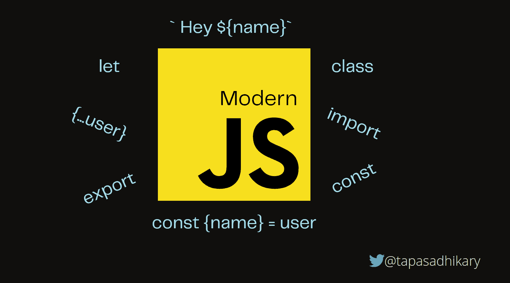
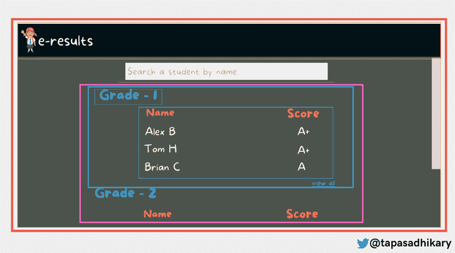
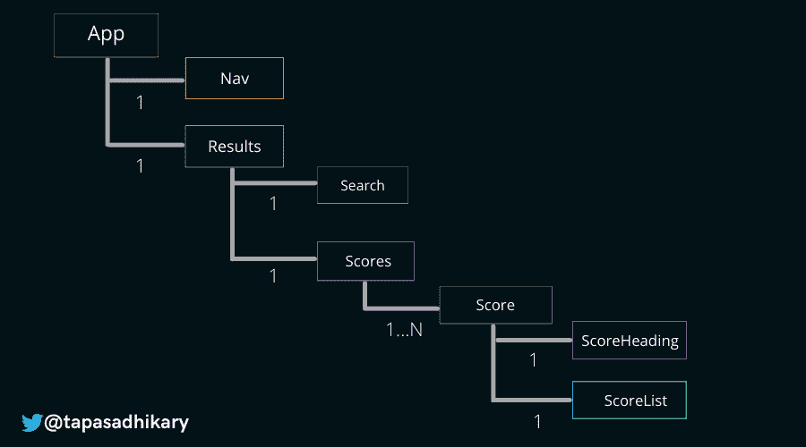
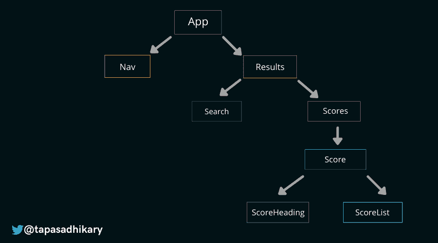
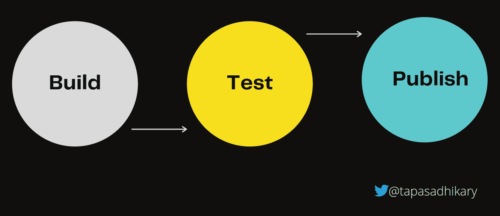

# React 教程–通过示例代码学习 React 和 JavaScript 编程基础

> 原文：<https://www.freecodecamp.org/news/learn-react-basics/>

React 是一个帮助您构建用户界面的开源 JavaScript 库。这是一个基于组件的，声明性的，“一次学习，随处编写”的工具。

拥有 164K+ GitHub stars，30K+ forks，以及接近~ 1000 万的周下载量，React 无疑是一个学习和使用起来非常棒的用户界面库。

如果您是一名刚刚开始使用 React 的开发人员，或者正在考虑在您的项目或企业中使用 React，那么这篇文章非常适合您。如果您不久前开始学习 React，但是您发现很难掌握基础知识，请阅读这篇文章。

# TL；速度三角形定位法(dead reckoning)

这篇文章很长，但是如果你想学习 React 或者你已经在使用它，它应该是一篇有趣的文章。它回答了这些问题:

*   现代 JavaScript 知识如何让你成为高效的 React 开发者？
*   在设计开发 React 应用的时候，你的心态需要什么样的改变？
*   你需要了解哪些生态系统，为什么？

放松，拿起你最喜欢的饮料，享受这篇文章。

# 我为什么写这篇文章

一开始，当我学习 React 的时候，我犯了一个错误，没有把注意力集中在一些重要的基础上。随着我的知识越来越丰富，我开始学习这些概念，并发现自己对 React 更加适应。

我的许多学员讨论了他们在处理 React 时面临的挑战，这些挑战也围绕着这些基本原则。所以这激励我写这篇文章，并分享我所学到的。

# React 需要了解的现代 JavaScript 概念



Flexibility with Modern JavaScript

JavaScript 的标准化名称是 ECMAScript。ECMAScript 2015(也是第 6 版，这也是它被称为 ES6 的原因)为 JavaScript 语言带来了许多很酷的特性和新语法。

React 和许多其他现代用户界面框架和库与 ES6 配合得很好。有必要了解它的现代语法和新特性，以使编码更容易。

> 这并不意味着你不能用 ES5 编写一个 React 应用程序。如果有必要的话，你可以这么做，但是你会有点儿用强硬的方式做事。

这里有几个你需要学好的概念。

## 1.如何在 JavaScript 中使用 Let 和 Const

在 ES5 之前，声明变量的唯一方式是使用`var`关键字。ES6 引入了另外两种声明变量的方法，使用了`let`和`const`关键字。使用这些现代的关键字给了我们更多的可预测性和更少的在代码中引入错误的机会。

### `var`关键字

用`var`声明的变量是函数范围的。这意味着当我们试图访问函数外部的变量时，我们将得到一个`ReferenceError`。

```
var x = 10;
function someFunc(){
    var y = 10;
    console.log('inside someFunc', x, y);
}
```

现在，如果您调用`someFunc()`，它将在浏览器控制台中记录以下内容:

```
inside someFunc 10 10
```

但是尝试在`sumFunc()`之外访问变量 y，您将得到以下错误:

```
Uncaught ReferenceError: y is not defined 
```

### `let`关键字

`let`是块范围的。这就是`let`和`var`的主要区别。以这个函数为例，我们使用一个`for`循环，并在循环内外访问变量`i`。

```
function letsLoop() {
 for (var i=0; i<5; i++) {
   console.log('i inside the loop: ', i);
 }

 console.log('i outside of loop', i);
} 
```

当您调用函数`letsLoop()`时，输出如下:

```
i inside the loop:  0
i inside the loop:  1
i inside the loop:  2
i inside the loop:  3
i inside the loop:  4
i outside of loop 5
```

现在，让我们在声明和赋值变量`i`时，将关键字`var`改为`let`。

```
function letsLoop() {
 for (let i=0; i<5; i++) {
   console.log('i inside the loop: ', i);
 }

 console.log('i outside of loop', i);
}
```

如果你现在执行`letsLoop()`函数，当你在`for`循环之外访问变量`i`时，你将得到一个`ReferenceError`。是因为变量`i`的可见性和可访问性(或范围)仅限于`for`块。

```
i inside the loop:  0
i inside the loop:  1
i inside the loop:  2
i inside the loop:  3
i inside the loop:  4
Uncaught ReferenceError: i is not defined
    at letsLoop (<anonymous>:6:35)
    at <anonymous>:1:1
```

### `const`关键字

`const`和`let`差不多。唯一的区别是，一旦你给用`const`关键字定义的变量赋值，你就不能再给它赋值了。

```
const name = 'freeCodeCamp';

name = 'My freeCodeCamp'; // Uncaught TypeError: Assignment to constant variable.
```

这适用于我们可以在 JavaScript 中创建的所有类型的变量。当涉及到像`object`这样复杂的数据结构时，你需要小心。当一个对象被声明并用`const`赋值时，你仍然可以改变它的属性值。但是你不能把这个变量重新分配给另一个对象。请看一看:

```
const publication = {
 'name': 'freeCodeCamp'
}

publication.name= 'My freeCodeCamp'; // Allowed

publication = {}; // Uncaught TypeError: Assignment to constant variable.
```

现在来比较三个关键词:

|  | 定义变量 | 让 | 常数 |
| --- | --- | --- | --- |
| 范围 | 功能 | 街区 | 街区 |
| 重新分配新值 | 允许 | 允许 | 不允许 |
| 在声明之前访问时 | 不明确的 | 参考错误 | 参考错误 |

以下是使用 var、let 和 const 的一些规则:

*   不要再用`var`了。使用`let`或`const`。
*   多使用`const`。当需要给变量重新赋值时，使用`let`。

在 React 应用中，你会经常看到使用`let`和`const`的代码。React 组件通常使用`const`来声明。看看下面的例子。

变量`DifficultyLevels`使用`const`声明，并被赋予一个函数作为值。这个函数定义了一个 React 组件。在这里使用`const`是有意义的，因为它不会被重新分配另一个值。

现在，注意变量`level`在`useEffect`中的用法。我们需要根据条件重新分配它的值。所以在这里使用`let`关键字是有意义的。但是，你不会在任何地方看到任何`var`！

```
const DifficultyLevels = () => {

    const userDataLS = getFromLS(LS_KEY_USER_DATA);
    const [userData, setUserData] = useState(userDataLS || {
        'fullName': '',
        'age': '',
        'email': '',
        'gender': 'F',
        'difficultyLevel': BEGINNER
    });

    //... other code

    useEffect(() => {
        let level = 'beginner';
        if (userData.age >=10 && userData.age <= 13) {
            level = 'intermediate';
        } else if (userData.age > 13) {
            level = 'advanced';
        }

        setUserData({
            ...userData,
            'difficultyLevel': level
        });
    }, [userData.age]);

    //... other code

    return(
        <>
        	{/*...other code */}

          	<span> { userData.level } </span>

		  	{/*...other code */}
        </>
    )

}
```

## 2.如何在 JavaScript 中使用模板文字

像这样连接字符串的日子已经一去不复返了:

```
var name = 'Tapas';
var publication = 'freeCodeCamp';
var greeting = 'Hello'; // Or Hola

// It produces output like, "Hello Tapas, welcome to freeCodeCamp."
var message = greeting + ' ' + name + ', welcome to ' + publication + '.';
```

上面处理字符串连接和动态值的方法工作量太大，难以阅读，而且容易出错。我们通过自然地编写代码来获得相同的输出，而不用担心`+`、空格等等，怎么样？

对于 ES6，我们有`template literals,`，它是允许嵌入表达式的字符串。我们在模板文字中使用反斜线(` `)代替单引号或双引号。我们可以使用美元符号($)和花括号(如`${expression}`)将动态值(或表达式)定义为占位符。

让我们用模板文字来写上面的例子。

```
// We are expecting the values to change dynamically, hence `let`
let name = 'Tapas';
let publication = 'freeCodeCamp';
let greeting = 'Hello'; // Or Hola

// A much better way of wrting like natural language sentence
let message = `${greeting} ${name}, welcome to ${publication}.`;
```

那么我们在 React 代码中使用它吗？是的，为什么不呢？您可能希望在 React 组件中使用上述问候消息，并将其呈现在 UI 元素中。[这里有一篇文章](https://blog.greenroots.info/what-exactly-is-javascript-tagged-template-literal-ckg6hyekf000n8bs1hz9udvzc)可以帮助你详细了解模板文字。

你在你的 React 项目中使用了[样式组件](https://styled-components.com/)吗？在这种情况下，您已经在使用模板文字了！

## 3.如何在 JavaScript 中导入和导出模块

为了在 React 中高效地编码，您需要`think in React`。您需要考虑的一个主要方法是将 UI 分成合适的组件层次结构。

我们将在下面了解这意味着什么。但是在高层次上，React 中的每个组件都可以是一个 JavaScript 模块。您必须导出该模块，以便将其导入代码中的其他位置，从而实现更好的组件组合。这就是为什么很好地掌握模块概念和导入/导出功能是非常重要的。

下面是一个简单的例子，展示了我们如何导出一个 React 组件并将其导入到另一个组件中。

```
 // under-construction.js under the directory src/components/utility

import React from "react";

const UnderConstruction = () => {

    return(
        <div className="column">
            <p style={{marginTop:"10px"}}>
                If you are seeing this, I am probably working on it! 
                Please give it a few days to get constructed.
            </p>
        </div>
    )
};

export default UnderConstruction;
```

在另一个组件中:

```
import UnderConstruction from './components/utility/under-construction'
```

请[阅读本文](https://blog.greenroots.info/javascript-modules-and-how-to-effectively-work-with-export-import-cka7t5z6s01irx9s16st6j51j)以熟悉 JavaScript 模块和导入/导出关键字。

## 4.如何在 JavaScript 中使用箭头函数

只是提醒一下——您可以编写没有 JavaScript 箭头函数的 React 代码。

没错。那么，我们为什么要谈论他们呢？箭头函数在许多方面都很有用:

*   这使得函数编写变得更加容易。与标准函数相比，使用箭头函数时键入的字符通常更少。

```
const double = (num) => {return num * 2;};
```

*   与标准函数不同，箭头函数不会在其定义内重新定义`this`的值。这种行为使得开发人员很容易选择使用箭头函数作为回调函数。谁因为`this`想要更多的 bug？

这里有一篇优秀的文章让你开始了解箭头函数及其用法。

## 5.JavaScript 中的析构是如何工作的

析构是 JavaScript 语法，用于从对象属性中提取值，并将它们赋给变量。对于 JavaScript 数组，析构也是可能的。

一旦你很好地学会了析构，它将有助于使事情变得非常简单。

您可以在循环中使用析构，如下所示:

```
for(let { name, age } of users) {
    console.log(`${name} is ${age} years old!`);
}
```

使用函数的返回值:

```
const getUser = () => {
    return{ 
        'name': 'Alex',
        'address': '15th Park Avenue',
        'age': 43
    }
}

const { name, age } = getUser();

console.log(name, age); // Alex 43
```

在函数参数中:

```
function logDetails({name, age}) {
    console.log(`${name} is ${age} year(s) old!`)
}
```

下面是一个数组析构的例子:

```
let emojis = ['🔥', '⏲️', '🏆', '🍉'];

let [fire, clock, , watermelon] = emojis;

console.log(fire, clock, watermelon); // 🔥 ⏲️ 🍉 
```

当然，我们本来可以做到，表情符号[0]，表情符号[1]，等等。但是，一个一个地给变量赋值太多了。

在 React 应用程序中，你会看到大量使用对象和数组析构。一个有经验的 React 开发人员可能会审查您的代码，他也希望看到这些实现。

这里有一篇关于对象析构的深入文章。您还需要了解数组析构。

## 6.JavaScript 中 Spread 运算符和 Rest 参数的工作方式

扩展语法(也称为扩展操作符)是 ES6 的另一个优秀特性。顾名思义，它接受一个 iterable(就像一个数组)并将它扩展(展开)成单独的元素。

我们还可以使用 spread 语法扩展对象，并将其`enumerable`属性复制到一个新对象中。

Spread 语法使用三个点`...`帮助我们用最简单的语法`clone`一个对象和数组，就像这样:

```
const clone_some_object = {...some_object}
```

当您使用对象和数组的新实例来设置状态变量以帮助重新渲染组件时，这在 React 中非常有用。

`Rest`参数有点与`spread`语法相反。spread 语法有助于扩展或分布元素和属性，而 rest 参数有助于将它们收集在一起。

[查看本文的后半部分](https://www.freecodecamp.org/news/javascript-object-destructuring-spread-operator-rest-parameter/)以了解更多关于 Spread 运算符和 Rest 参数的信息。

## 7.如何在 JavaScript 中使用类

ES6 的`class`是另一个帮助你用 JavaScript 编写面向对象编程的好工具。

```
class Employee {
	constructor(name) {
		this.name = name;
	}

	greeting() {
		return `Hello, ${this.name}`;
	}
}

let emp = new Employee("Tapas");
emp.greeting(); // "Hello, Tapas"
```

我们也可以通过扩展现有的类来创建一个类。在 React 中，我们可以用两种方式创建组件:

*   使用类
*   使用函数。

下面是我们如何使用 ES6 类创建 React 组件的示例:

```
class Greeting extends React.Component {
	render() {
		return <span>Hello World!</span>;
	}
}
```

[你可以在 freeCodeCamp YouTube 频道观看这个视频](https://www.youtube.com/watch?v=2ZphE5HcQPQ)来了解更多关于 ES6 课程的信息。

除此之外，了解一下`for-of`循环、`async-await`、`ternary operator`等等也会很有帮助。

# 组件架构


Component Architecture - Many is better than One.

欢迎来到文章的第二部分。再说说`Components`。如果我们谈论 React，我们必须谈论组件。

一个源代码文件包含一个应用程序的所有功能。但是它产生了一些您作为开发人员想要避免的问题。以下是我遇到的一些问题(可能还有更多):

*   一个以上的开发者在应用上工作可能会增加协作问题，比如合并冲突、独立工作等等。
*   代码可重用性降低，重复增加。
*   团队以单线程模型结束工作，最终交付变得缓慢。
*   将你的应用作为一个单元来测试不再可能。当您修改单个文件时，您总是会触及整个应用程序。
*   你的设计师不会喜欢的。

当你使用 React 时，你将把你的应用程序分成尽可能多的小单元，称为组件。理想情况下，每个组件应该只做一件事。

那么，我们如何将它付诸实践呢？让我们通过一个例子来了解一下。

## 如何将 React 应用程序可视化为一堆组件

让我们假设我们正在使用 React 构建一个 web 应用程序，该应用程序按成绩列出每个学生的成绩。我们的设计师已经提出了一个模型，如下所示。我们看到的是以下内容:

*   带有徽标和应用程序名称的顶部导航。
*   成绩按等级的明显划分。
*   显示了各年级前三名学生的成绩。
*   有一个`view all`选项可以查看一个等级的所有结果。
*   我们可以通过搜索学生的名字来搜索任何学生的结果。


An Imaginary Web application: e-results

现在我们需要开始考虑组件。这意味着如何将这个应用程序分成负责单一职责的逻辑单元。

答案不一定只有一个。这很好，但是我们需要确保我们在创建组件方面做得更好。

我们可以这样做:

*   名为`App`的根组件。
*   顶部导航的`Nav`组件。
*   一个`Results`组件，是除了`Nav`之外的整个页面。
*   一个`Search`组件。
*   一个可能包含所有分数的`Scores`组件。
*   一个`Score`组件，包含标题、评分表和所有链接的视图。
*   一个包含类似于`Grade 1`的标题的`ScoreHeading`组件。
*   包含分数表的`ScoreList`组件。

下图显示了用不同的颜色标记它们。



Thinking in Components

太好了，我们现在有所有的组件了。所以，我们需要开始考虑组件组成。这是什么意思？

这些组件实际上是独立的单元，每个都应该做一件事情。然而，React 应用程序中的大多数组件将通过数据相互联系。

我们还需要互相添加组件，以便这些单元最终构建整个应用程序。

从下图中，您可以了解这些组件是如何组成的。

*   组件`App`是一个根级组件，它有另外两个组件`Nav`和`Results`。
*   `Nav`组件有一个徽标和一个标题。
*   `Results`分量有一个`Search`分量和一个`Scores`分量。
*   一个`Scores`组件可以有多个`Score`组件。
*   每个`Score`组件都有一个`ScoreHeading`和`ScoreList`组件。

下图对你有意义吗？



The Component Tree

这是另一种形象化的方法:



The Component Hierarchy

这些组件中的每一个都使用两个重要的概念来管理和使用数据，这两个概念是`props`和`state`。

## React 中的道具 vs 状态

在 React 中，`props`和`state`是管理组件内部和组件之间数据的基本方式。

*   `Props`:是父组件传递给其子组件的变量。使用 props 组件，我们可以将所需的数据传递给层次结构中的子组件。
*   `State`:另一方面，`state`是一个组件在自己内部管理的变量。在许多情况下，组件的状态变量可以通过使用 props 传递给它的数据来初始化。

# NPM 生态系统



NPM Ecosystem - Build, Test, and Publish

这是文章的最后一部分。本节将解释为什么了解 NPM 生态系统会让您更容易使用 React。

## 什么是 NPM？

`NPM`是`Node.js`平台的包管理器。它由节点可以找到的模块组成，帮助节点智能地管理依赖冲突。最常见的是，它用于发布、发现、安装和开发程序。

你可以在这里找到更多关于`NPM` [的信息。](https://docs.npmjs.com/cli/npm)

## 为什么我需要了解 NPM？

React 本身是一个很小的库，可以让你创建组件和构建完整的 web 应用程序。然而，您将经常需要使用 React 可能不提供的现成的东西。

例如，对于广泛的状态管理，您可能希望使用`Redux`。您可能希望选择一个外部库来帮助它，该库以一个`NPM`包的形式提供，您可以下载并安装。

类似地，npm 包适用于各种工具、图表库、字符串外部化、路由——只要你能说出来的，很可能都有一个包。

## `Open-Source`心态

如果您找不到作为现有 npm 模块的特定功能，该怎么办？是的，这可能发生。此外，它可能作为一个现有的 npm 包提供，但它并不符合您的需求。那你会怎么做？

有两种简单的方法来处理这种情况:

*   您将该功能构建为一个组件，对其进行测试，然后将其发布为一个开源的 npm 包。
*   您对现有的开源 npm 包做出了贡献，并使它变得更好。

作为 React 开发人员，拥有开源思维是很自然的。主动寻找机会，要么创造新的东西，要么为已经存在的东西做出贡献。当你的作品被别人使用和欣赏，就像你使用别人的作品一样，这是一种很棒的感觉。

我创建了一个[开源项目](https://github.com/atapas/react-package-publisher)来帮助使用脚本快速发布 npm 包。请随意看看，叉一下，投稿。你可能会发现它很有用。

# 在结束之前...

我希望您发现这篇文章很有见地，并且它能帮助您开始更有效地使用这些概念。我们来连线。你会发现我活跃在 [Twitter (@tapasadhikary)](https://twitter.com/tapasadhikary) 。请随时关注。

您可能也会喜欢这些文章:

*   [作为软件开发人员如何每天学习新东西](https://www.freecodecamp.org/news/learn-something-new-every-day-as-a-software-developer/)
*   [如何用单个变更事件处理程序创建 React 表单？](https://blog.greenroots.info/how-to-create-react-form-with-a-single-change-event-handler-ckizqh0yq00x7zks16wd1cxu1)
*   [你可能会发现有用的 16 个 GitHub 辅助项目库](https://blog.greenroots.info/16-side-project-github-repositories-you-may-find-useful-ckk50hic406quhls1dui2d6sd)
*   [使用 React 钩子理解动态导入、懒惰和悬念](https://blog.greenroots.info/understanding-dynamic-imports-lazy-and-suspense-using-react-hooks-ckdfssktb01czpts12krebs1h)