# 如何部署 Node.js 应用程序–从服务器设置到生产

> 原文：<https://www.freecodecamp.org/news/deploy-nodejs-app-server-to-production/>

在本教程中，我们将学习在将节点应用程序部署到生产服务器之前需要了解的一切。

我们将从在数字海洋上租用服务器开始。然后，我们将配置这个服务器，连接到它，安装 Nginx 并配置它，拉或创建我们的节点应用程序，并将其作为一个进程运行。

正如你所看到的，有很多事情要做，这将是一个充满行动的教程。所以让我们开始吧，不要浪费任何时间。

在开始之前，您应该对终端如何工作以及如何在 Vi/Vim 中工作有一些基本的了解。如果你不熟悉基本命令，我建议你多读一点。

我将在 MacOS 中运行这些命令。如果您想在 Windows 中学习本教程，可以使用 Powershell 或您选择的其他 Unix 模拟器。

虽然我将使用 Node.js 作为我们的示例应用程序的平台，但是大多数步骤对于任何 web 应用程序都是相同的。

## 为什么是数字海洋？

我选择 Digital Ocean 是因为与 AWS 之类的产品相比，它价格便宜，界面也很容易使用。此外，GitHub 学生包中包含 100 美元的信用点数，因此您在几个月内无需支付任何费用。这是部署课程或爱好项目的理想选择。

它有一个概念叫做 Droplets，基本上就是你共享的一个服务器。你可以把服务器想象成你拥有或租用的公寓。

Droplets 在服务器上运行的虚拟机的帮助下工作。所以 Droplet 是你在共享服务器上的虚拟机。由于它是一个虚拟机，它的 CPU 和内存份额可以很容易地增加，通常是通过向您的提供商投入更多的钱。

## 如何创建数字海洋项目

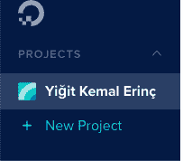

我假设您在继续之前已经注册并登录了数字海洋。我们应该首先创建一个包含我们的水滴的项目。让我们单击左侧菜单中的“新建项目”按钮。它将要求您命名您的项目。

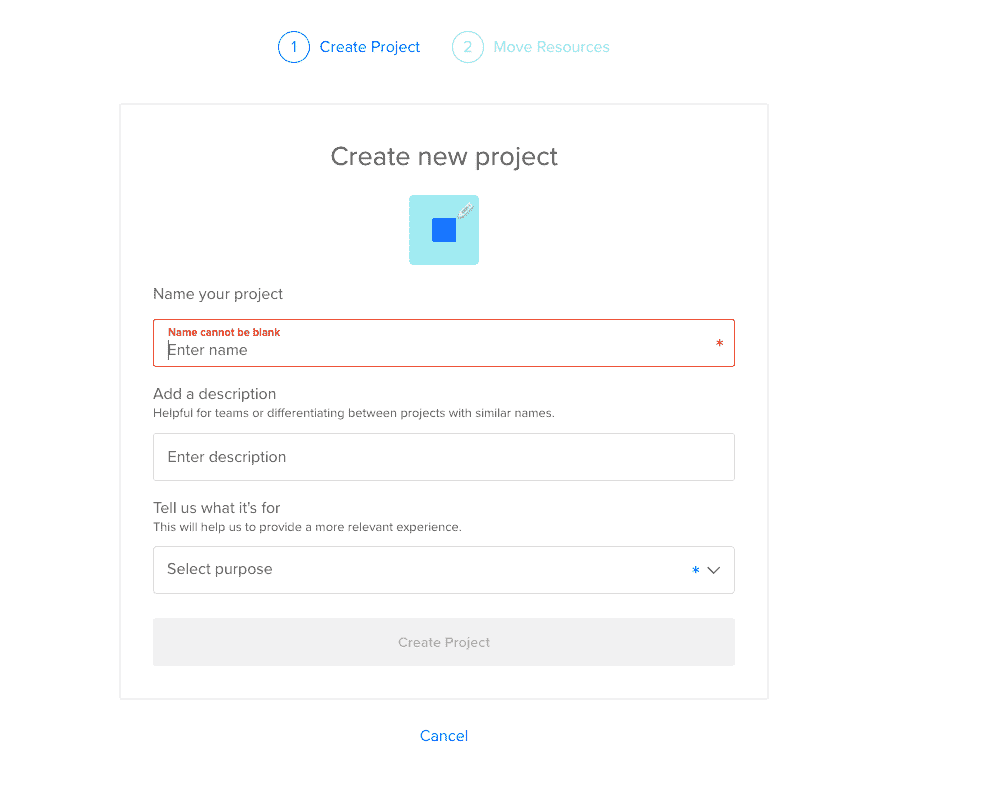

输入您想要的任何名称。它还会询问您是否要移动任何资源，但现在只需单击“跳过”——我们稍后将创建 droplet。

## 如何在数字海洋上创建水滴

让我们通过点击开始按钮来创建我们的 droplet。

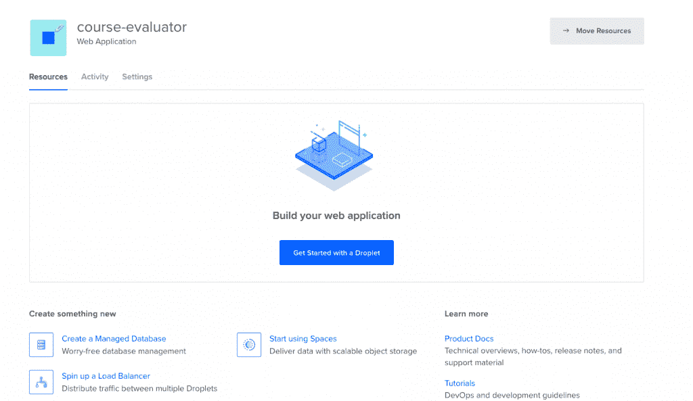

单击该按钮后，它会要求我们选择一个虚拟机映像。

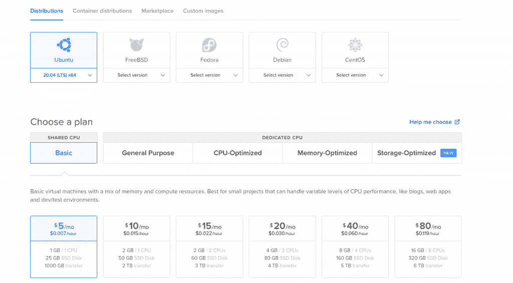

Choosing an Image

在这个页面上，我将选择 Ubuntu 20.04，因为这是我写这篇文章时最新的 LTS 版本。LTS 的意思是“长期支持”。对于实际项目，最好使用 LTS 版本，因为供应商保证它将得到长期支持和维护。这意味着从长远来看你不会有问题。

我选择了 Ubuntu，并向您推荐它，因为它是最常用的 Linux 发行版。这意味着这也是最容易找到你未来问题的答案。

如果需要也可以选择有专用 CPU。如果你正在建立自己的创业公司或任何商业项目，我建议你阅读这篇[帖子](https://www.digitalocean.com/docs/droplets/resources/choose-plan/)，它包含了如何为你做出正确选择的详细说明。

在这种情况下，我会选择最便宜的。

然后，您需要选择一个数据中心区域。您应该选择离您最近的一个，以最小化网络延迟。

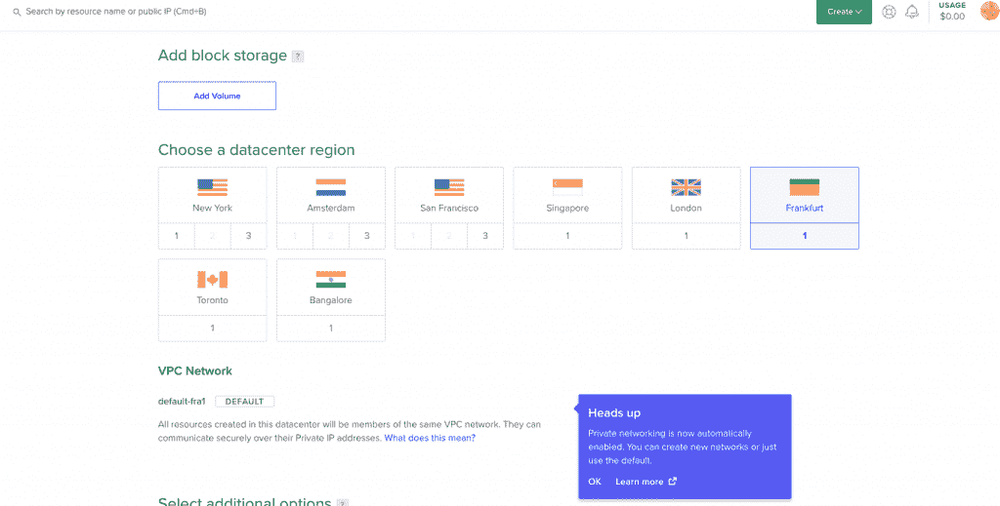

Select a Datacenter

接下来，让我们选择 SSH 密钥作为身份验证方法，因为它比基本密码身份验证安全得多。

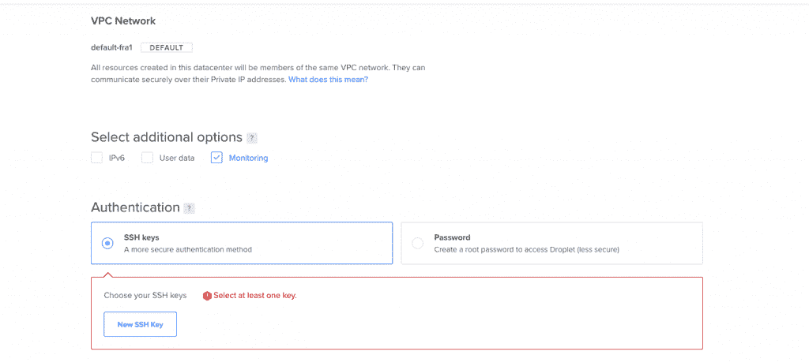

Authentication Method

为了连接到服务器，我们需要在我们自己的设备上生成一个新的 SSH 密钥，并将其添加到数字海洋中。

## 如何生成 SSH 密钥

我将在我的 macOS 设备上生成密钥。如果你使用的是 Windows，你可以参考这篇文章。打开您的终端，进入 ssh 文件夹:

```
cd ~/.ssh
```

然后创建您的 SSH 密钥:

```
ssh-keygen
```

如果您的计算机说它不知道此命令，您应该通过 brew 安装它。

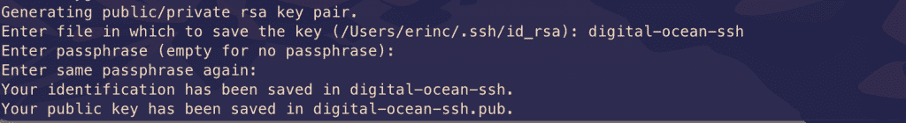

它会要求您命名文件并输入密码。不要输入名称，只需按回车键并使用默认值。您应该已经生成了这些文件。在这个截图中，我把我的名字命名为 digital-ocean-ssh，所以不要被它弄糊涂了。

```
❯ lsid_dsa      id_rsa      known_hosts
```

我们的公钥是`id_dsa`，而`id_rsa`是我们的私钥。如果你忘记了哪一个是私有的，你可以打印其中一个来看。

## 如何将您的 SSH 密钥添加到数字海洋

现在，我们想复制我们的公钥，并将其上传到数字海洋，这样他们就知道在身份验证中使用哪个密钥。

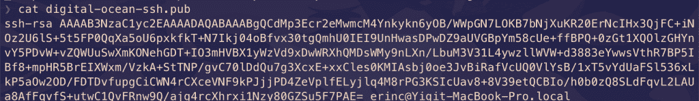

复制整个密钥，包括 ssh-rsa 部分。

点击“新建 SSH 密钥”:

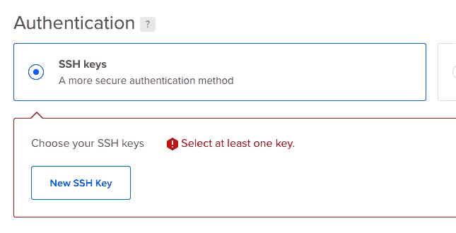

将密钥粘贴到单击按钮后出现的文本框中，您应该会看到您的 SSH 密钥。

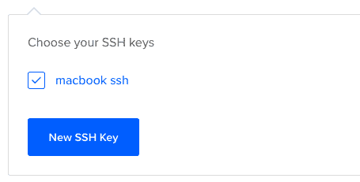

## 如何连接到服务器

我们将使用终端通过 SSH 连接到我们的服务器。如果你愿意，你也可以看看 Termius 的界面。

将 IP_ADDRESS 替换为您的服务器的 IP 地址后，在您的终端中运行此命令(您可以从 Digital Ocean 的面板中查找)。

```
ssh root@IP_ADDRESS
```

如果一切顺利，现在你应该在服务器的终端。我们已成功连接到服务器。如果有任何错误，您可以通过运行带有“-v”选项或“-vv”选项的命令来进行调试，以获得更详细的信息。

## 如何设置服务器

在将节点应用程序部署到服务器之前，我们需要做一些初始设置。

### 更新和升级软件

我们想更新服务器的软件，以确保我们使用的是最新版本。

许多服务器容易受到攻击，因为它们使用的是具有已知漏洞的旧版本软件。攻击者可以搜索这些软件中的漏洞，并试图利用它们来访问您的服务器。

你可以使用**“apt update”**命令来更新 Ubuntu 的软件。

```
apt updateHit:1 https://repos.insights.digitalocean.com/apt/do-agent main InReleaseGet:2 http://mirrors.digitalocean.com/ubuntu focal InRelease [265 kB]      Hit:3 http://mirrors.digitalocean.com/ubuntu focal-updates InRelease                Get:4 http://security.ubuntu.com/ubuntu focal-security InRelease [109 kB]Hit:5 http://mirrors.digitalocean.com/ubuntu focal-backports InReleaseFetched 374 kB in 1s (662 kB/s)                          Reading package lists... DoneBuilding dependency tree       Reading state information... Done96 packages can be upgraded. Run 'apt list --upgradable' to see them.
```

如果你看了消息，上面写着“96 包可以升级”。我们已经安装了新的软件包，但是我们还没有把软件升级到那些版本。

为此，让我们运行另一个命令:

```
apt upgrade
```

当它提示您时键入 y，它将升级软件。

### 创建用户

我们以 root 用户(拥有最高特权的用户)的身份连接到服务器。成为根源是危险的，会让我们暴露于弱点。

因此，我们应该创建一个新用户，而不是以 root 用户身份运行命令。用您选择的用户名替换`$username`。

```
whoamiroot
```

```
adduser $username
```

您需要输入用户的密码。之后，它会问一堆问题，所以只需输入 y，直到提示结束。

新用户已经创建，但是我们还需要将这个新用户添加到“sudo”组，这样我们就可以执行我们需要的任何操作。

```
usermod -aG sudo $USERNAME
```

我们使用`-aG`(添加组)选项添加组，并将组名`sudo`添加到用户名中。

我们仍然是 root 用户，所以让我们使用`su`(切换用户)命令将我们的用户切换到新创建的用户。

```
su $USERNAME
```

此时，如果您运行 **`whoami`** 命令，您应该会看到您的用户名。您可以通过运行以下命令来确认 sudo 组的存在:

```
sudo cat /var/log/auth.log
```

只有超级用户可以查看此文件，在您运行此命令后，操作系统会要求您输入用户密码。

### 复制 SSH 密钥

我们已经成功创建了用户，但是我们还没有为这个新用户启用 SSH 登录。

因此，我们必须复制之前在本地计算机上创建的公钥，并将其粘贴到这个用户的 SSH 文件夹中，这样 SSH 就可以知道应该使用哪个密钥来验证我们的新用户。

```
mkdir -p ~/.ssh
```

如果目录不存在，`-p`参数将创建该目录。

```
vi ~/.ssh/authorized_keys
```

我们将使用 vi 或 vim 创建一个文件，并将其命名为 **`authorized_keys`** 。

复制您的公钥(` id_dsa `文件)，然后按“I”进入插入模式。然后用 CMD + V 把它粘贴到这个文件里就行了。

按 esc 键退出插入模式，键入 **:wq** 保存并退出。

如果你有任何关于使用 Vim-Vi 的问题，你可以查看解释如何使用它的教程之一[。](https://www.freecodecamp.org/news/how-not-to-be-afraid-of-vim-anymore-ec0b7264b0ae/)

### 作为新用户连接到服务器

现在我们应该能够使用 ssh 毫无问题地连接到服务器了。你可以用这个命令来连接，只要记得插入你的用户名和`IP_ADDRESS`就可以了。

```
ssh $USERNAME@IP_ADDRESS
```

如果您在这一点上有任何问题，您应该删除 droplet 并重新开始。重新开始并不需要很多时间，但是调试服务器问题可能会很困难。

### 如何禁用超级用户登录

作为一种安全预防措施，禁用 Root 登录是一种很好的做法，所以我们现在就这么做。

以防万一，更改文件权限会很有用，这样我们就不会在将来遇到有关权限的问题。

```
chmod 644 ~/.ssh/authorized_keys
```

现在让我们打开我们的`sshd_config`文件:

```
sudo vi /etc/ssh/sshd_config
```

找到这一行，用我们之前对 vi 做的同样的方法把 yes 改为 no。

```
PermitRootLogin no
```

保存并退出 vi。

## 如何安装 Node.js 和 Git

我们现在可以安装 Node.js 和 Git:

```
sudo apt install nodejs npm
```

```
sudo apt install git
```

我们现在准备创建一个节点应用程序并运行它。你可以从 Github 获取你的节点项目，或者在这里创建一个节点应用程序来测试它是否工作。

移动到您选择的目录并创建一个 **"app.js"** 文件:

```
sudo vi app.js
```

您可以将以下代码片段粘贴到您的 **app.js** 文件中:

```
const express = require('express');const app = express();const port = 3000;app.get('/', (req, res) => {        res.send('Hello World');});app.listen(port, () => console.log(`Example app listening on port ${port}!`));
```

现在我们可以用以下命令运行它:

```
node app.js
```

您应该看到“示例应用程序监听端口 3000！”在你的终端上。

我们可以通过向我们的服务器发送请求来确认它正在工作:

```
GET http://IP_ADDRESS:3000/
```

从像 Postman 这样的 HTTP 客户端或您的浏览器发送这个请求，您应该会看到“Hello World”消息。

此时，您应该会注意到有问题:普通用户不知道如何向端口 3000 发送请求。

我们应该将到达我们 web 服务器的请求从我们的 IP 重定向到端口 3000。我们可以在 Nginx 的帮助下完成这个任务。

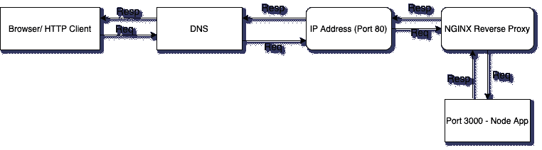

## 如何安装和配置 Nginx

我们将使用 Nginx 作为反向代理，将请求重定向到我们的节点应用程序。

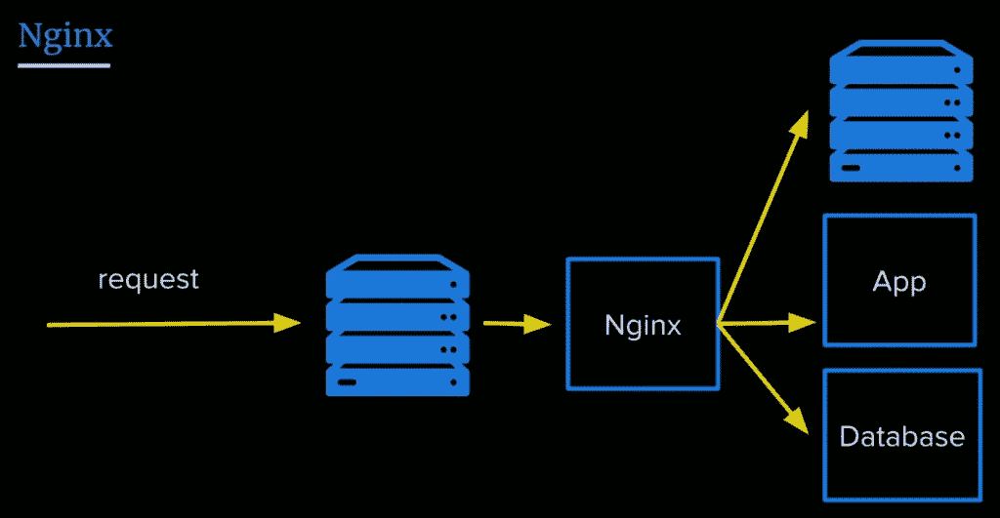

Nginx as a Reverse Proxy

让我们安装 Nginx:

```
sudo apt install nginx
```

启动 Nginx 服务:

```
sudo service nginx start
```

我们可以通过从浏览器向服务器的 IP 地址发送请求来测试它是否工作。在你的浏览器中输入你的服务器的 IP 地址，你会看到:


重要的是要知道 Nginx 默认从 **"/var/www/html"** 开始服务，你也可以在那个目录中找到这个 html 文件。

我还建议你在“/var/www”下创建一个文件夹，把它叫做 app，把你的 Node app 移到那个文件夹里，这样就容易找到了。

### 如何配置 Nginx 反向代理

我们将编辑 Nginx 配置文件来配置反向代理:

```
sudo vi /etc/nginx/sites-available/default
```

在该文件中，您需要找到位置/块，并将其更改如下:

```
location / {                # First attempt to serve request as file, then                # as directory, then fall back to displaying a 404\.                proxy_pass http://127.0.0.1:3000/;        }
```

`proxy_pass`指令将请求代理到指定的端口。我们给出了运行节点应用程序的端口。

让我们重新启动 Nginx，这样更改就会生效:

```
sudo service nginx reload
```

在这一步之后，当我们向服务器发送请求时，我们应该能够看到消息。恭喜，我们已经完成了部署节点应用程序的最少步骤！

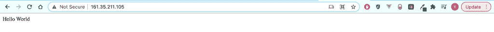

但是我仍然建议你完成下面的奖励步骤，因为我相信它非常重要。

如果看不到 hello world 消息，可以检查一下你的 app 和 Nginx 是否在运行，然后重启。

## 如何将您的应用程序作为一个进程运行

我们不希望每次出现问题和应用程序崩溃时都要手动启动应用程序。我们想让它自己重启。此外，每当服务器启动时，我们的应用程序也应该启动。

要做到这一点，我们可以利用 PM2。让我们安装并配置 PM2。

```
sudo npm i -g pm2
```

我们使用“-g”选项全局安装 pm2，以便可以从每个文件夹访问它。

```
pm2 start app.js
```

这可以确保应用程序在因错误退出时会重新启动。

让我们保存当前的进程列表。

```
pm2 save
```

我们还需要将它转换成一个守护进程，只要系统启动，它就会运行:

```
pm2 startup systemd
```

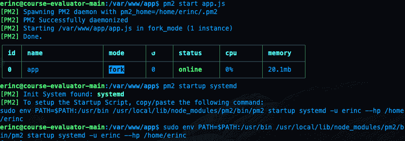

提醒一下，在本教程中，我使用的是 Ubuntu 的命令。如果您正在使用任何其他的 Linux 发行版，您应该替换这个命令中的`systemd`。

我们可以通过重新启动服务器并发送请求来确认服务正在重新启动，而无需手动运行 app.js:

```
sudo reboot
```

在我们之前发送请求之后，您应该能够看到 hello world 消息。

## 结论

在本教程中，我们从头开始，为自己租了一台服务器，连接到它，并配置它，使它从端口 80 服务于我们的 Node.js 应用程序。

如果您已经跟随并能够完成所有步骤，那么恭喜您！你可以为自己感到骄傲，因为这不是一个容易的话题:)。我希望你已经学到了很多。谢谢你的时间。

我计划通过将服务器连接到一个域名，然后将其连接到 CircleCI 进行持续集成，来进一步探索这个主题。我还将介绍为您的 Node.js/React 应用程序制作做好准备所需的步骤。不过，这篇文章已经够长了，所以这些话题留待另一篇文章讨论:)

如果你喜欢阅读，并想了解我未来的帖子，你可以订阅我的个人博客。如果你有兴趣阅读更多，你可以在那里看到我以前的帖子。我通常会写一些与 web 开发相关的主题。