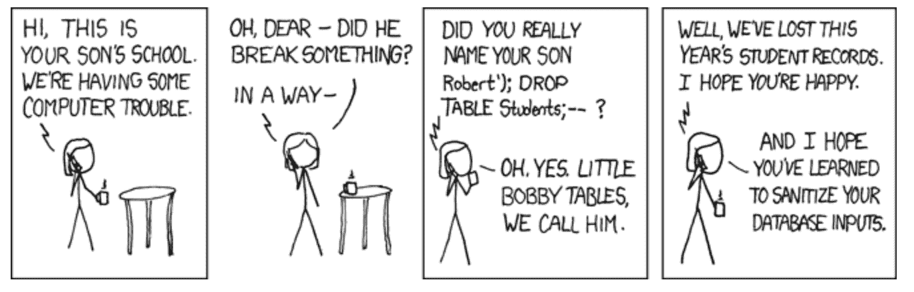

# SQL 注入教程——什么是 SQL 注入，如何防范

> 原文：<https://www.freecodecamp.org/news/what-is-sql-injection-how-to-prevent-it/>

SQL 注入是指通过输入数据从客户端向应用程序插入或注入 SQL 查询。

成功的攻击允许攻击者访问数据库中的敏感数据、修改数据库数据、关闭数据库或发出其他管理命令、恢复文件内容，有时还会向操作系统发出命令。

这种类型的攻击相对容易检测和利用，因此快速修复任何易受攻击的系统尤为重要。

## SQL 注入是如何工作的？

当数据从不受信任的来源进入程序，并且该数据用于动态构造 SQL 查询时，就会发生 SQL 注入。

因为 SQL 不区分控制平面和数据平面，所以攻击者可以在数据输入中放置一个元字符(一个不被解释为数据的字符，例如下划线，在 SQL 中，它将被理解为单个字符的通配符)，然后在控制平面中输入 SQL 命令。

例如，在下面的漫画中，如果将字符串`Robert'); DROP TABLE Students;–-`输入到一个请求学生姓名的查询中，则该查询将变成如下所示:

```
AND studentName = 'Robert';
DROP TABLE Students;
--'
```

drop table 命令用于删除一个表和该表中的所有行，而这对连字符告诉大多数数据库服务器应将语句的剩余部分视为注释(允许服务器忽略修改后的查询留下的尾随'。



https://xkcd.com/327/

许多数据库服务器允许一次执行多个查询，只要它们用分号隔开。如果是这样，这种类型的攻击允许攻击者对数据库执行几个命令(包括 Oracle 在内的几个数据库服务器不允许这种类型的执行)。

防止 SQL 注入实际上相当简单——要么不允许动态查询，要么防止包含恶意 SQL 的用户输入影响查询的逻辑。

## 其他类型的 SQL 注入

还有一些其他类型的 SQL 注入需要注意:

### 基于错误的 SQL 注入

攻击者依靠来自数据库的详细错误消息来了解数据库结构。为了防止这种情况，应该只显示一般的错误消息。

### 盲目 SQL 注入

当应用程序易受 SQL 注入攻击，但仅显示一般错误消息(而不是详细的错误消息或查询结果)时发生。

获取信息的一种方法是使用真/假查询，一次提取一个问题的信息。另一种选择是发送一个命令，要求数据库在返回响应之前等待一段特定的时间。

根据数据库用多长时间响应错误消息，攻击者可以推断命令返回的是真还是假。

### 联合 SQL 注入

利用 UNION 运算符从数据库的多个表中检索数据。

### 带外 SQL 注入

相对不常见，但当攻击者无法在他们提交命令的同一通道中接收到对命令的响应时就会发生。

相反，它依赖于服务器使用另一种协议(如 HTTP 或 DNS)来响应攻击者的查询的能力。

## 如何防范 SQL 注入攻击

### 准备好的语句(带有参数化查询)

参数化查询要求开发人员定义所有 SQL 代码，然后将每个参数传递给查询。然后，数据库可以区分代码和数据，而不管用户输入。

例如，如果攻击者输入名称`Robert'); DROP TABLE Students;–-`，参数化查询将不再容易受到攻击，而是寻找与整个字符串`Robert'); DROP TABLE Students;–-`完全匹配的名称。

预处理语句的好处是 SQL 代码保留在应用程序中，使其(大部分)独立于数据库。

在极少数情况下，这可能会损害性能。如果出现这种情况，开发人员将需要对所有数据进行强有力的验证，或者使用特定于数据库的转义例程对所有用户提供的输入进行转义。

### 存储过程

存储过程是预先创建的 SQL 语句，其参数不包括任何动态 SQL 生成(可以生成，但不应该生成)。为了建立存储过程，开发人员需要为任何需要的输入构建带有参数的 SQL 语句。

存储过程和预准备语句的区别在于，存储过程是在数据库中定义和存储的，但是是从应用程序中调用的。

此外，由于存储过程需要某些 DBMS 中的执行权限(默认情况下不可用)，因此创建一个具有最低权限的单独帐户而不是授予所有者访问权限是很重要的。

### 允许列表输入验证

Allowlist 输入验证根据一组已知的、已批准的输入来检查外部输入，不匹配的输入将失败。这只应在不允许绑定变量的情况下使用(SQL 语句中实际值的占位符)。

Allowlist 输入验证也可以是一个备份选项，用于在将输入传递给查询之前检测输入。

### 转义所有用户提供的输入

只有在前面的选项都不可行的情况下，您才应该使用这种方法，因为它无法防止所有 SQL 注入。仅将它用于不能重写以使用早期建议之一的遗留代码。不幸的是，这是一个非常特定于数据库的实现。

每个 DBMS 都支持字符转义方案。如果使用正确的方案对所有用户输入进行转义，DBMS 将能够区分输入和开发人员编写的 SQL 代码。

### 最小特权

最小特权不是对 SQL 注入的防御，而是限制任何攻击可能造成的损害的一种方式。

确保应用程序帐户只拥有所需的权限可能会令人沮丧(授予他们 DBA 或 admin 权限肯定更容易，但是提供了更多的攻击面)。

与其取消帐户的访问权限，不如从头开始，只授予所需的访问权限。

例如，如果某个帐户需要只读访问权限，请确保它只对需要的表(甚至是表的一部分)具有只读访问权限。如果可以，请避免授予数据库帐户创建或删除权限。每个用户/应用程序应该有一个单独的帐户。

此外，检查运行数据库管理系统(DBMS)的操作系统帐户的权限。默认情况下，许多运行在非常强大的帐户下——更改为一个更合适的特权。

### 来源/延伸阅读:

*   [OWASP SQL 注入](https://owasp.org/www-community/attacks/SQL_Injection)
*   [PortSwigger SQL 注入](https://portswigger.net/web-security/sql-injection)
*   [Netsparker SQL 注入](https://www.netsparker.com/blog/web-security/sql-injection-cheat-sheet/)