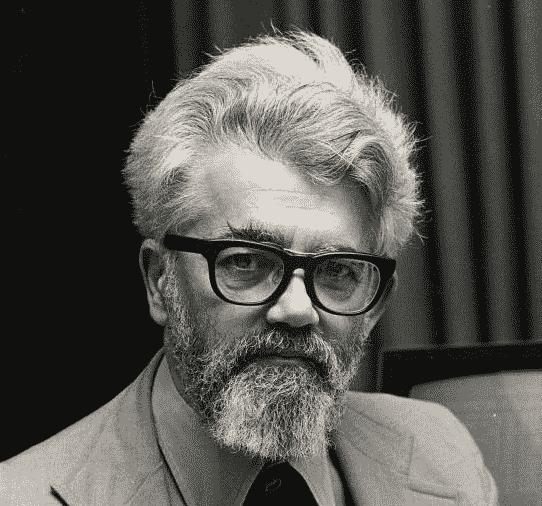
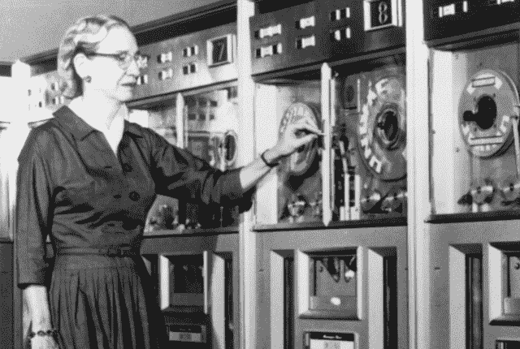

# 学习编码

> 原文：<https://www.freecodecamp.org/news/please-do-learn-to-code-233597dd141c/>

今天早上，我醒来时收到几十条来自学生的信息，他们读了一篇题为“请不要学习编码”的文章。

起初，我以为杰夫·阿特伍德 2012 年的文章会自发地出现在 Reddit 上。但事实并非如此——这是一篇全新的同名 Tech Crunch 文章，它呼应了阿特伍德的论断，即鼓励每个人学习编程就像鼓励每个人学习管道工程一样。

这就是为什么编程——不像管道工程——是每个人都应该学习的重要技能:**编程是人类与机器对话的方式**。

John McCarthy, the computer scientist who invented the Lisp language and coined the term “Artificial Intelligence”

> “每个人都需要电脑编程。这将是我们对仆人说话的方式。”—约翰·麦卡锡

#### 几千年来，人们一直在管理他人。

古罗马人在战败士兵的背上建立了他们的帝国。英国人通过将他们的意志强加给几十个殖民地的居民来建立他们的帝国。美国成为今天的经济力量，部分归功于工业革命期间廉价的移民劳动力。

但是在 21 世纪的这里，我们不再通过管理管理谷物田地、从亚洲殖民地进口香料或在落基山脉修建铁路来完成工作。

现在我们通过管理机器来完成工作。

## 学习编码——因为工作的本质已经发生了根本的变化

今天，做大部分工作的不再是人类，而是机器。

想想看——每天，人类进行 35 亿次谷歌搜索。执行这项工作的是机器，而不是人类。

想想人类手动进行一次谷歌搜索需要多少工时。你能想象一群博士日以继夜地互相打电话讨论他们应该向谁推荐哪些文件吗？如果这项工作是由机器来做的话，那它就一点也不实用。

旅行顾问帮助你决定去哪里度假。Expedia 帮助您预订到达目的地的正确航班。谷歌地图指引你去机场。由于机器的辛勤工作，所有这些服务都在普通消费者的能力范围之内。

但是机器只能做所有这些工作，因为人类确切地告诉它们该做什么。而人类做到这一点的唯一方法就是编写软件。

没错——电脑远不如人类聪明。为了让计算机成功完成我们分配给它们的工作，它们需要我们人类给它们极其清晰的指令。

这意味着编码。

## 编码不是某种特殊技能。这真的是“新的文化”

这是 21 世纪每个雄心勃勃的人想要成功都需要学习的基本技能。

不相信我？看看法律界就知道了。软件把它翻了个底朝天，导致不会编程的律师大量失业。

对于经理、营销人员、会计师、医生以及几乎所有介于两者之间的白领工作来说，情况也越来越如此。

更不用说 300 万工作主要是开车的美国人，以及全世界数十亿从事其他重复性工作的人，这些工作很快将由机器以更低的成本和更高的效率来完成。

我希望这些被解雇的工人能够通过廉价的教育项目接受新工作的再培训，比如星巴克与亚利桑那州立大学的合作——所有员工都可以获得免费的大学教育(有望获得相关的新技能，如软件开发)——或者政府资助的同等项目。

至少，他们可以通过像 EdX 这样的项目获得免费的数学和计算机科学教育，通过自由代码营获得免费的编程教育。

## 编程或被编程

我们在软件开发中有一个概念，叫做“技术压路机”。

Stewart Brand, founder of the Whole Earth Catalog and the Long Now Foundation

> “一旦新技术碾过你，如果你不是压路机的一部分，你就是道路的一部分。”—斯图尔特·布兰德

你不能阻止技术。你只能去适应它。

一旦一项创造历史的新技术从神怪瓶子里出来，你就不能把它放回去。飞机、抗生素和核弹头都是如此。对于微处理器、互联网和机器学习来说也是如此。

那些适应这些永久变化浪潮的人会蓬勃发展。那些对它们不屑一顾的人——或者甚至没有意识到它们的存在——逐渐变得无关紧要。

编码是一种新的文化。就像读书是 12 世纪，写作是 16 世纪，算术是 18 世纪，开车是 20 世纪。

就像不是每个学习写作的人都会成为职业作家，也不是每个学习算术的人都会成为职业数学家一样，不是每个学习编码的人都会成为软件开发人员。但是所有学习这些东西的人都会因为他们的努力而变得更好。

想想你阅读处方药标签的能力，或者当你取款时，你数一数银行家递给你的钱的能力。如果你会编码，还有同样重要的事情可以做:将日常生活中单调乏味的部分自动化。

有些人把这种基本技能发展得更远，作为积累巨大个人财富的一种方式，或者作为让世界变得更美好的一种方式。

## 船是用来航行的

Rear Admiral Grace Hopper invented the first compiler and pioneered high-level programming languages.

> 停泊在港口的船是安全的，但那不是船的目的。扬帆出海，做新的事情。—格蕾丝·赫柏

从本质上来说，计算机是一种数字处理机器。

从本质上讲，人脑是学习机器。

看起来你可能永远也不会编码。看起来你似乎不适合做这个。

你身后可能会有一大群人试图学习编码，放弃了，并渴望与你同甘共苦。

这些人会阅读像 Tech Crunch 文章这样的文章，并在脸书上分享它们——就像昨天 14000 人所做的那样——这进一步打击了世界各地数百万努力实现这种新知识的人。

但是编码批评者关于他们没有能力学习编码的说法可能是不正确的。教育家和认知科学家越来越倾向于认为任何有能力的人都可以学习编码——就像你可以学习阅读、写作、算术或驾驶汽车一样。

当然，有阅读障碍的人阅读更困难，有计算障碍的人做数学更困难，两者都更难编程。但即使这些都是可以克服的局限，[程序员每天都在克服局限](https://www.quora.com/Can-anyone-learn-how-to-code/answer/Quincy-Larson)。

所以听从格蕾丝·赫柏的建议吧。扬帆出海，学习新事物。把那台学习机放进你的脑袋里使用。

学习编码。学会和机器对话。繁荣昌盛。