# 如何在 Word 中插入复选框

> 原文：<https://www.freecodecamp.org/news/how-to-insert-a-checkbox-in-word/>

有时候，您会想要从列表中检查项目，或者在表单上将它们标记为完成。幸运的是，给你的微软 Word 文档添加复选框并不太难。

有两种主要类型的复选框:交互式(允许用户在他们的计算机上的 Word 文档中选中复选框)和非交互式(如果您要打印一些东西供人们填写，您会使用它)。我们将在这里研究这两种选择。

只需几次调整和点击，您就可以将复选框直接插入到 Word 中，让我们看看您是如何做到的。

简单说明一下:这是 Mac 使用 Office 2019 的教程。如果您使用的是 Windows 机器或不同版本的 Word，其中一些可能会有所不同。

## 如何在 Word 文档中添加复选框–交互方式

为了将交互式复选框直接添加到您的 Word 文档中(例如，用户可以在他们的计算机上/电子地进行检查)，您需要启用一些特殊的工具。

### 步骤 1:启用“开发人员”功能区

转到主 Word 菜单中的 Word 选项卡(在屏幕顶部)，并从下拉菜单中选择“首选项”。

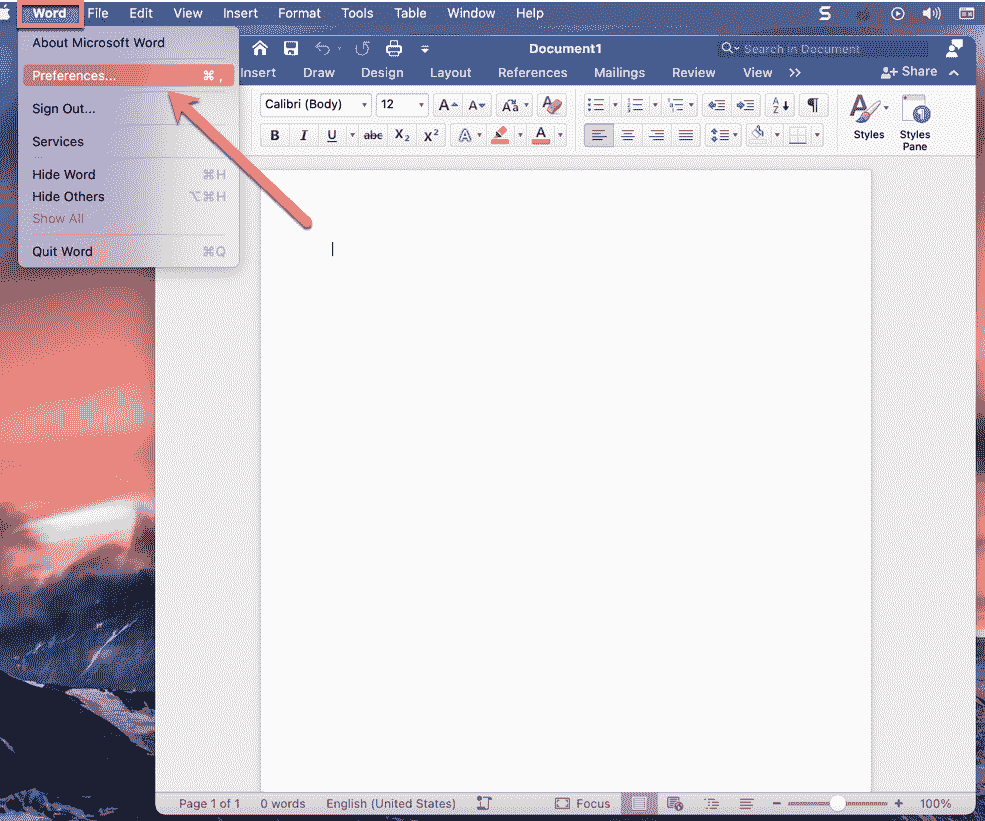

Select the "Preferences" option under the Word menu.

这将打开以下菜单，您将看到一个“功能区和工具栏”选项，如下所示:

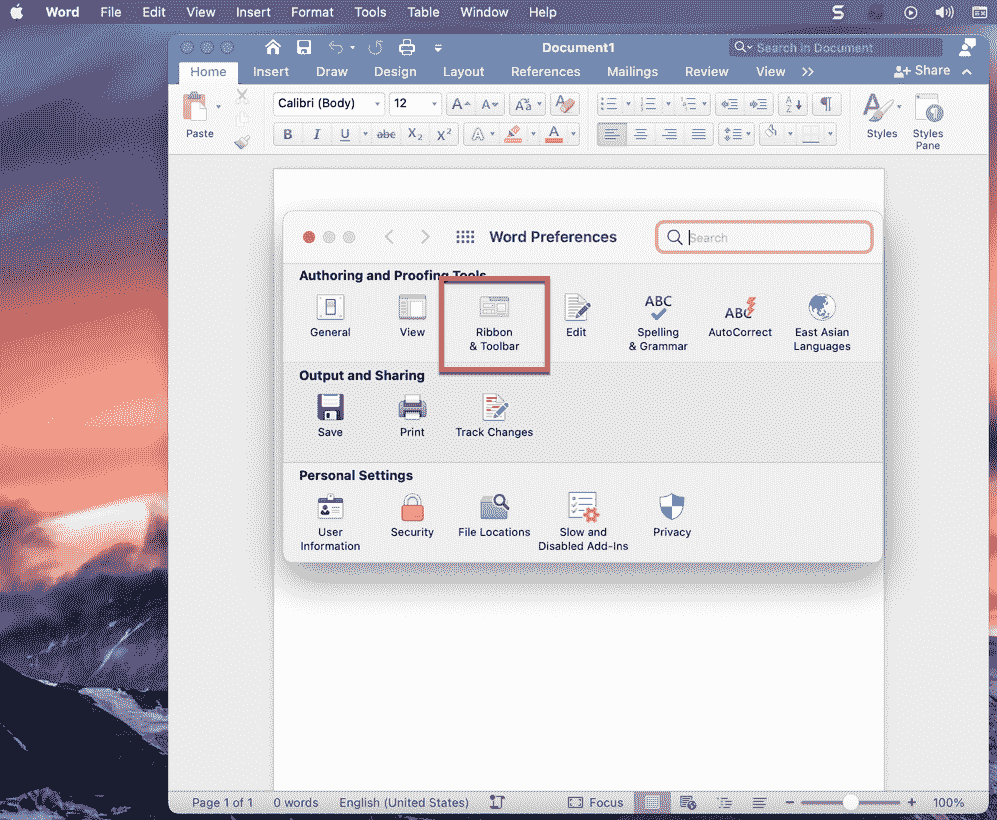

只需点击功能区和工具栏按钮，你会看到功能区和工具栏菜单。这里有很多选择，但是只要看看右边的“主选项卡”下拉菜单，然后滚动到那个长长的列表的底部(很多东西可能已经被选中了)。

当你到达底部时，你会看到“开发者”复选框(如下图所示)，它可能会被取消选中。只需选中该框并点击“保存”，然后返回到您的 word 文档。

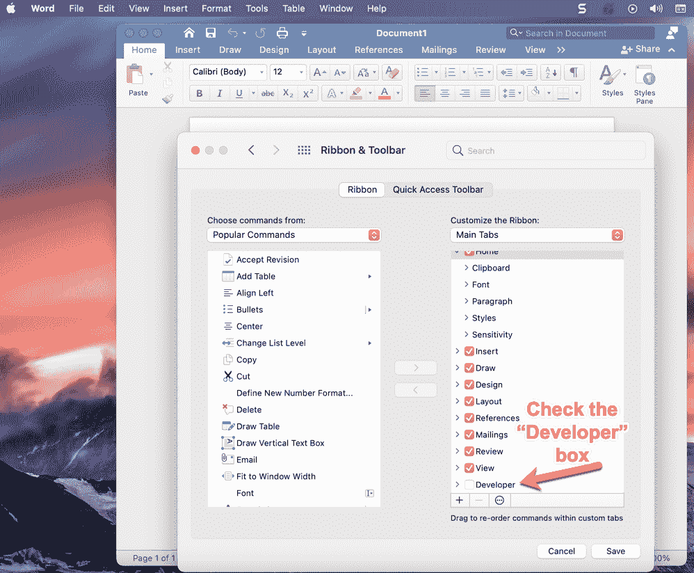

Turn on your "Developer" setting.

现在，当您返回到 word 文档时，您会看到更多选项被添加到您的功能区中(这是文档顶部的菜单，带有选项“主页”、“插入”、“绘图”、“设计”、“布局”等)。

### 步骤 2:转到“开发人员”选项卡

你会在菜单的末尾看到两个小箭头，如果你点击它们，你会看到一个“开发者”选项——点击“开发者”按钮。

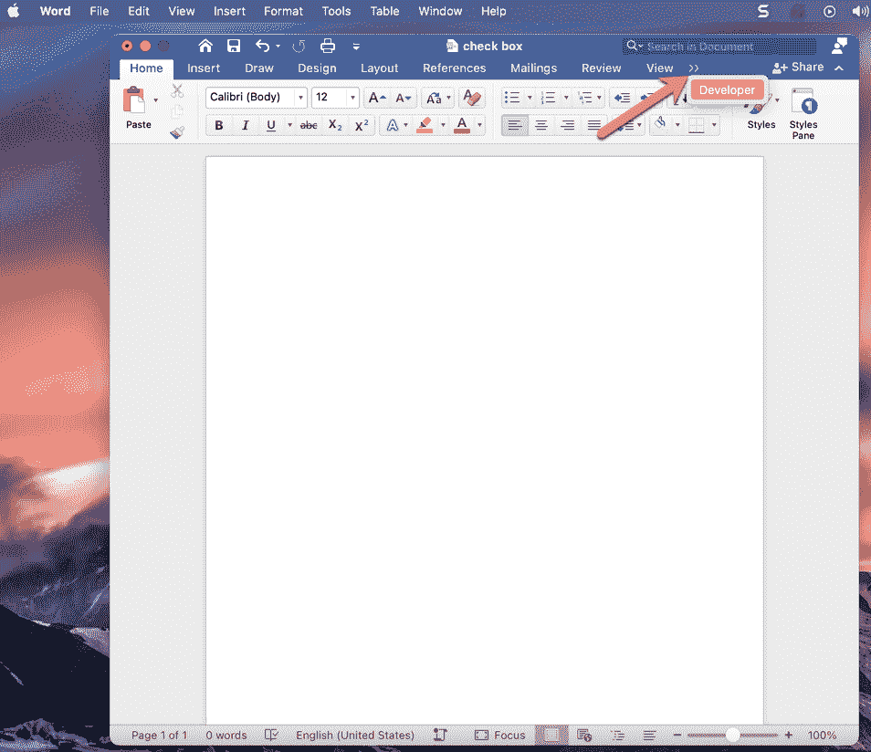

这将显示一个全新的带状图，如下所示:

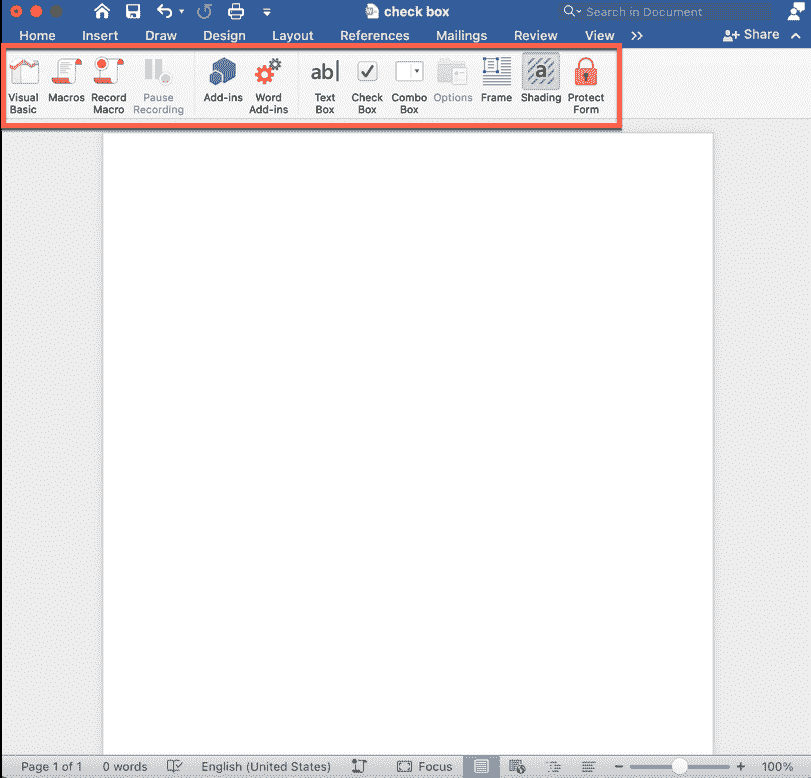

### 步骤 3:添加您的复选框

您会在开发者功能区中间看到“复选框”选项。如果你点击它，一个复选框将被添加到你的 Word 文档中，无论你的光标在哪里。所以只要确保你的光标在你想要的地方。

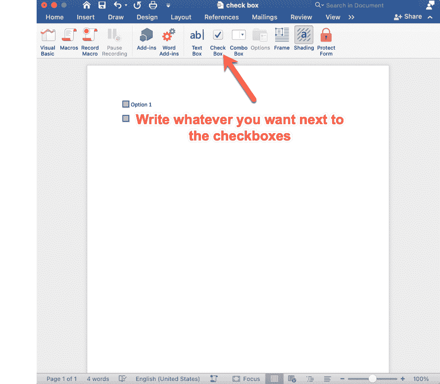

一旦你添加了所有你想要的复选框，并且**你已经准备好让你的表单交互**，还有一个步骤。

### 第四步:保护你的表格

Word 是智能的，如果您仍在编辑和处理表单，它不会让您实际选中复选框。如果有的话，任何人都可以进来填写、修改文本、编辑等等。

所以，你要保护好自己的形态。这使得人们唯一能做的就是选中这些框(或取消选中)。

只需单击开发人员功能区右侧的锁形符号“保护表单”即可:

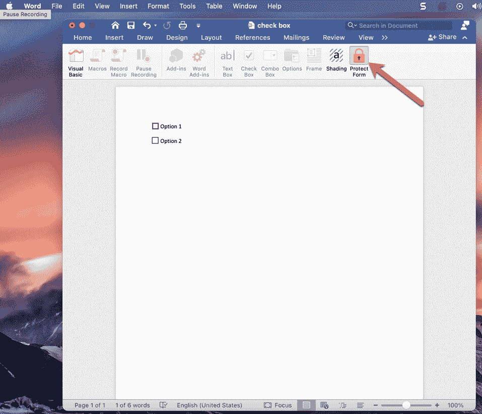

How to protect your form so users can check the checkboxes

一旦你这样做了，你现在可以测试你的新复选框。如果你点击这个框，会出现一个 X，表示它已经被选中。如果你犯了一个错误，不想要那张支票，只需再次点击方框，X 就会消失。

请记住，一旦您单击“保护表单”，您将无法进行任何格式或其他更改(您的所有功能区都将“灰显”且不可访问)。如果您需要进行编辑，只需再次单击“保护表单”按钮，您就可以进行这些更改。

现在，您可以将复选框添加到您的表单中，并以电子方式共享它们。

但是如果你只是想打印出一个带有复选框的列表，人们可以在纸上手工填写，那该怎么办呢？接下来让我们看看如何做到这一点。

## 如何在 Word 中为打印文档添加复选框

如果您只想在要打印的文档中添加框，并让人们手动检查，这样做要容易一些。您只需使用项目符号来创建您的清单。

不过，在这之前，您需要对项目符号选项进行一些更新。

### 步骤 1:自定义项目符号选项

如果你想要看起来像空复选框的项目符号，你只需要对你的项目符号选项做一些更新。

**首先**，确保您的光标位于您希望复选框在 Word 文档中出现的位置。完成以下步骤后，Word 将在那里插入该框。

在 Word 中，在(文档上的)主页菜单中，您会发现“项目符号”选项卡，它看起来像三个垂直的点，旁边有一个小箭头按钮:

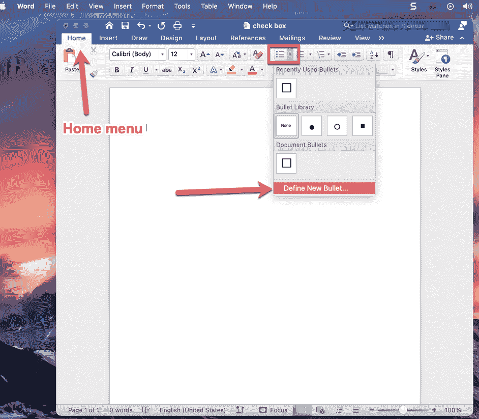

单击带有箭头小按钮，您将看到上面的下拉列表，在底部有“定义新项目符号”的选项。

只需点击该选项，您将进入一个如下所示的新屏幕:

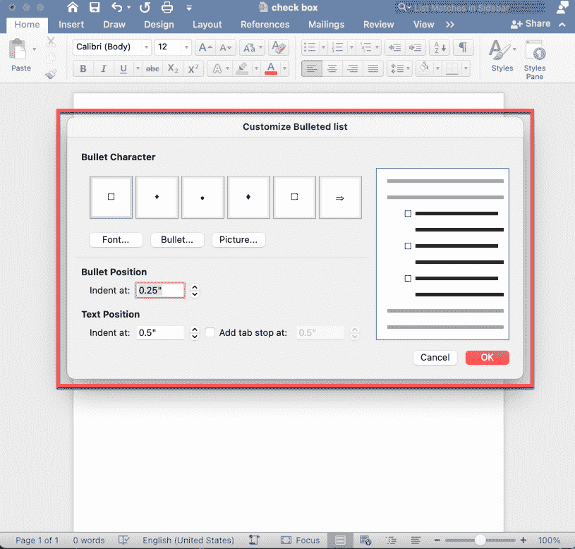

首先，您需要选择一种带有类似复选框符号的字体。所以点击“字体”按钮(在项目符号的例子下面)，选择“绕组 2”(你可能需要向下滚动一点)。

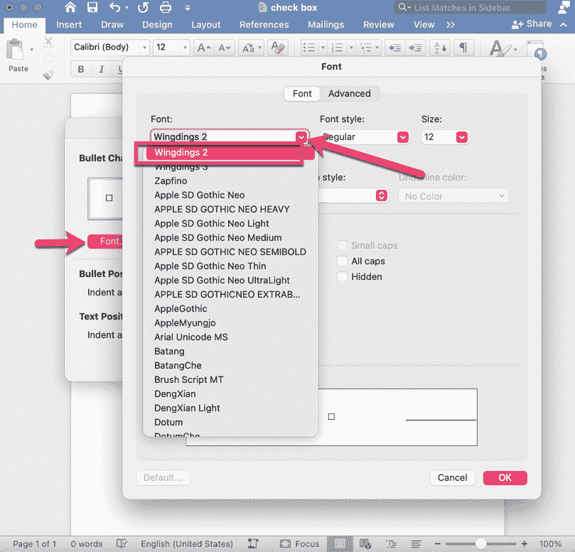

然后单击“确定”,您将返回到自定义项目列表屏幕。现在你的字体是“Wingdings 2”，你可以自定义你的项目符号。

### 步骤 2:为您的自定义项目符号选择符号

要选择复选框符号，只需单击“项目符号字符”示例列表中出现的一个项目符号(选中它，因此您将更改该项目符号)。然后单击“项目符号”按钮，将出现一个符号列表:

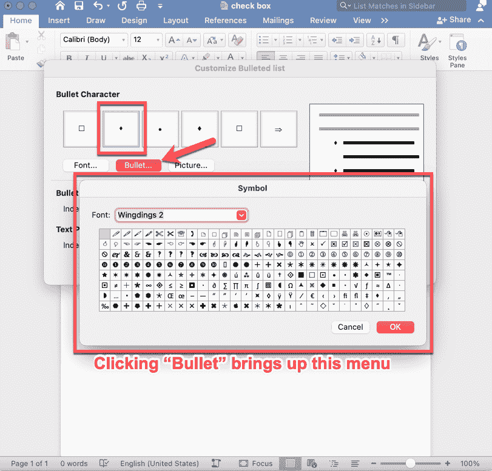

你可以看到有很多选项，但是中间/右边有一个空的复选框。只需点击它，然后点击“Ok ”,你会看到之前的项目符号已经被复选框选项所取代。

### 步骤 3:在 Word 文档中输入您的复选框

现在再次点击“Ok ”,你将回到你的 word 文档——你将看到一个复选框！

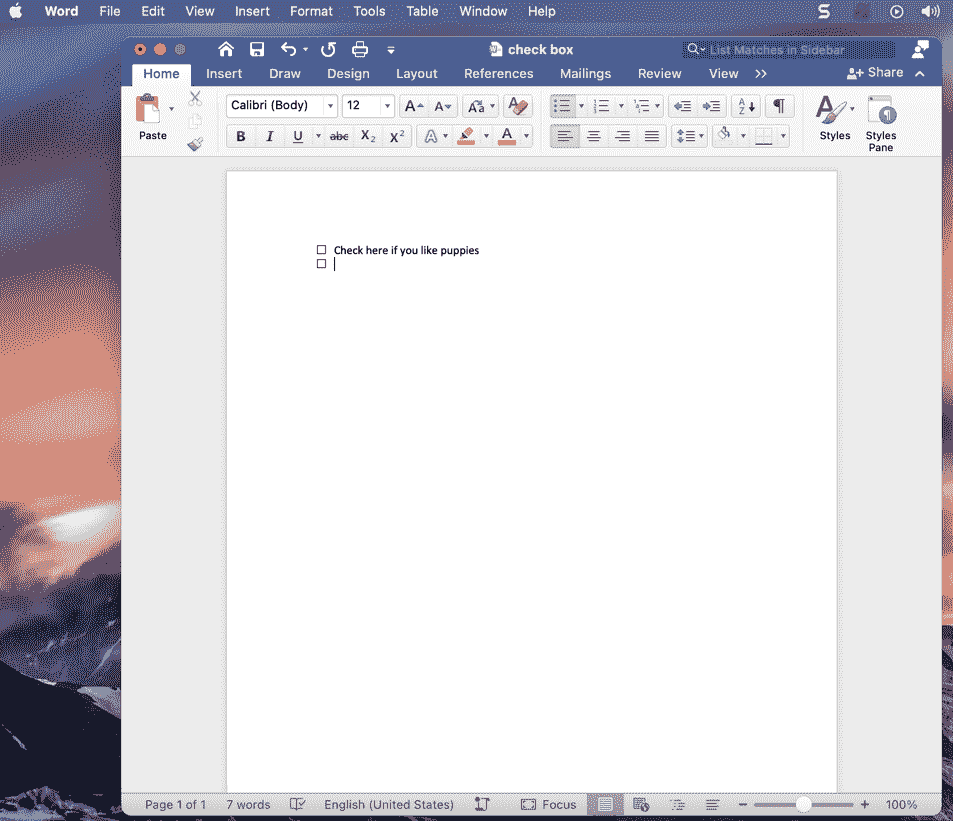

有趣的提示:如果你添加一些文字(比如上面的“如果你喜欢小狗，请在这里打勾”)然后按回车键，下面会出现一个新的复选框。因此，您的复选框将自动以列表形式继续，直到您完成您的列表。

当你完成了你的列表，只需再次点击回车键，光标将回到没有复选框的新的一行的开始。

请记住，如果您插入一个复选框，不要在它旁边键入任何内容，然后按 enter，复选框将会消失，您的光标将转到新的一行。

这里有另一个有趣的提示:如果你想改变复选框列表的对齐方式，你可以点击并按住其中一个框，然后来回拖动它，使其或多或少地缩进。

### 就是这样！

现在您知道了如何在 Word 文档中插入交互式和非交互式复选框。尽情享受吧！